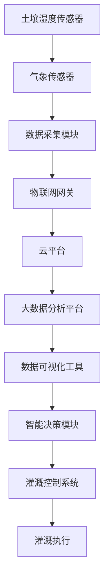
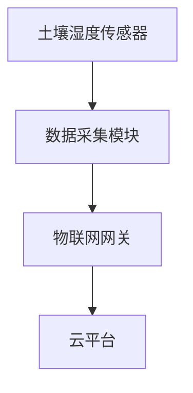
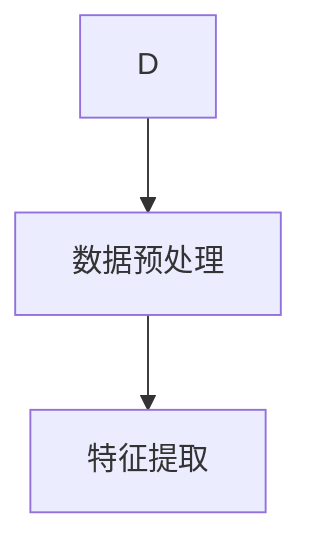
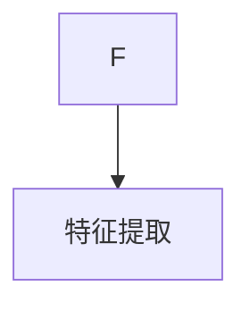
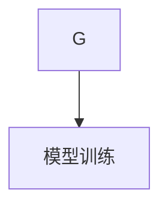
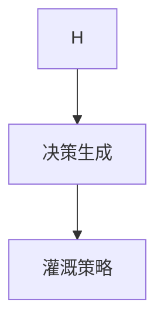
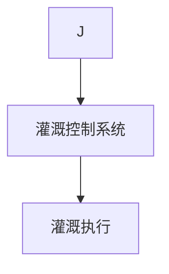
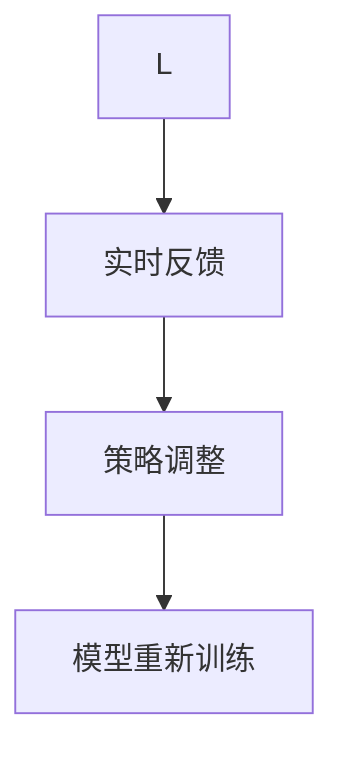

                 

### 背景介绍

智能灌溉优化系统作为现代农业技术的重要一环，旨在通过智能化的手段，实现对水资源的高效利用。当前，全球水资源短缺问题日益严峻，尤其是在农业用水方面，传统的灌溉方式往往存在着水资源浪费、土壤盐碱化、作物生长不均等问题。这些问题不仅影响了农作物的产量和品质，也对生态环境造成了不良影响。

智能灌溉优化系统的出现，为解决这些问题提供了新的思路和方法。通过引入传感器、物联网、大数据分析等先进技术，智能灌溉优化系统能够实时监测土壤湿度、气候条件、作物需水情况等参数，并根据这些数据自动调节灌溉时间、灌溉量和灌溉方式，从而实现精准灌溉，最大限度地提高水资源利用效率。

本文将围绕智能灌溉优化系统的核心概念、算法原理、数学模型、实际应用场景、工具资源推荐等方面展开讨论，旨在为广大读者提供一个全面、系统的智能灌溉优化系统介绍。

### 摘要

本文深入探讨了智能灌溉优化系统在水资源管理中的应用，旨在为农业领域提供一种高效的解决方案。首先，介绍了智能灌溉优化系统的背景和重要性，揭示了当前水资源管理中面临的挑战。随后，本文详细阐述了智能灌溉优化系统的核心概念，包括传感器技术、物联网、大数据分析等，并通过一个Mermaid流程图展示了系统的整体架构。接着，文章探讨了智能灌溉优化系统的核心算法原理和具体操作步骤，结合数学模型和公式对系统进行了详细解释，并通过一个实际的代码案例进行了实例分析。此外，本文还分析了智能灌溉优化系统在实际应用场景中的表现，并推荐了相关的学习资源、开发工具和论文著作。最后，文章总结了智能灌溉优化系统的未来发展趋势和面临的挑战，为相关领域的研究和实践提供了有价值的参考。

### 核心概念与联系

智能灌溉优化系统涉及多个核心概念和技术的结合，这些概念和技术共同构成了一个高效、智能的灌溉管理平台。以下是对这些核心概念的详细解释及其相互联系。

#### 传感器技术

传感器技术是智能灌溉优化系统的基石。传感器负责实时监测土壤湿度、气温、降雨量、风向等关键参数。通过这些数据，系统能够准确了解农田的当前状态，从而做出科学的灌溉决策。

- **土壤湿度传感器**：通常使用电容式、电阻式或光纤传感器来测量土壤中的水分含量。
- **气象传感器**：包括温度、湿度、降雨量、风速和风向等，用于监测农田的小气候。

#### 物联网（IoT）

物联网技术是智能灌溉优化系统的数据传输和互联的核心。通过将各种传感器与物联网平台连接，可以实现数据的实时采集、传输和处理。物联网平台通常包括网关、云平台、大数据分析工具等。

- **网关**：负责将传感器采集的数据传输到云平台，进行进一步处理。
- **云平台**：提供数据存储、处理和分析服务，支持远程监控和管理。

#### 大数据分析

大数据分析技术对传感器采集的大量数据进行处理和分析，从中提取有价值的信息，为灌溉决策提供支持。通过大数据分析，系统能够识别农田中的潜在问题，如土壤水分的不均衡、病虫害的发生等。

- **数据预处理**：包括数据清洗、去噪、归一化等，确保数据质量。
- **特征提取**：从原始数据中提取对灌溉决策有用的特征。
- **模型训练**：使用机器学习算法训练模型，对灌溉策略进行优化。

#### 数据可视化

数据可视化技术将复杂的数据转化为易于理解的可视化图表，帮助用户更直观地了解农田状态和灌溉效果。数据可视化工具通常包括图表、仪表板等。

- **图表**：展示土壤湿度、气象数据等，帮助用户快速获取信息。
- **仪表板**：集成多种图表和指标，提供全面、实时的农田监测和管理。

#### 智能决策

智能决策是智能灌溉优化系统的核心功能。通过整合传感器数据、物联网、大数据分析和技术，系统能够自动生成最佳的灌溉策略，实现精准灌溉。

- **灌溉策略生成**：根据农田当前状态和历史数据，自动调整灌溉时间、灌溉量和灌溉方式。
- **实时反馈**：根据灌溉效果进行实时调整，确保灌溉过程的持续优化。

#### Mermaid 流程图

为了更好地展示智能灌溉优化系统的整体架构和运行流程，我们使用Mermaid绘制了一个流程图。以下是一个简化的Mermaid流程图示例：



在上述流程图中，传感器负责数据采集，物联网网关负责数据传输，云平台负责数据存储和处理，大数据分析平台负责数据分析和决策生成，数据可视化工具用于展示结果，智能决策模块生成灌溉策略，最终由灌溉控制系统执行灌溉任务。

通过上述核心概念和技术的相互结合，智能灌溉优化系统实现了对农田灌溉的全面管理和优化，为农业水资源管理提供了高效、智能的解决方案。

#### 核心算法原理 & 具体操作步骤

智能灌溉优化系统的核心算法是基于传感器数据、气象数据和作物生长模型的综合分析，从而实现精准灌溉。以下将详细描述该算法的基本原理和具体操作步骤。

##### 1. 数据采集

智能灌溉优化系统的第一个步骤是数据采集。传感器实时监测土壤湿度、气温、降雨量、风向等参数。这些数据通过物联网网关传输到云平台进行存储和处理。



##### 2. 数据预处理

在云平台上，首先对采集到的数据进行分析和预处理。这一步骤包括数据清洗、去噪和归一化，以确保数据的质量和一致性。



##### 3. 特征提取

特征提取是智能灌溉算法的关键步骤。从预处理后的数据中提取对灌溉决策有重要影响的特征，如土壤湿度、温度等。这些特征将用于后续的模型训练和决策生成。



##### 4. 模型训练

使用机器学习算法，基于历史数据和特征提取结果，训练一个灌溉策略优化模型。常用的算法包括线性回归、支持向量机、决策树、神经网络等。训练模型的目的是为了预测最佳灌溉策略，从而提高水资源利用效率。



##### 5. 决策生成

经过模型训练后，系统可以根据当前的环境数据和作物生长模型，自动生成最佳的灌溉策略。决策过程包括以下步骤：

- **当前状态评估**：评估土壤湿度和气象参数，确定当前农田的需水情况。
- **灌溉策略生成**：根据模型预测，制定合适的灌溉时间、灌溉量和灌溉方式。



##### 6. 灌溉执行

生成灌溉策略后，系统将指令发送到灌溉控制系统，执行具体的灌溉任务。灌溉控制系统根据策略指令，控制灌溉设备的运行。



##### 7. 实时反馈与调整

灌溉执行后，系统会收集反馈数据，如土壤湿度变化、作物生长情况等。通过这些数据，系统可以实时调整灌溉策略，确保灌溉过程的持续优化。



通过上述步骤，智能灌溉优化系统能够实现自动化、精准的灌溉管理，最大限度地提高水资源利用效率。

##### 算法实例

为了更好地理解上述算法原理和操作步骤，我们来看一个具体的实例。

假设当前农田的土壤湿度传感器监测到土壤湿度为20%，气温为30℃，降雨量为0mm，气象传感器监测到风向为南风，风速为3m/s。根据这些数据，智能灌溉系统会执行以下步骤：

1. **数据采集**：传感器实时采集土壤湿度、气温、降雨量等数据。

2. **数据预处理**：对数据进行清洗和去噪，确保数据质量。

3. **特征提取**：提取关键特征，如土壤湿度、气温等。

4. **模型训练**：使用历史数据训练一个灌溉策略优化模型，预测当前环境下的最佳灌溉策略。

5. **决策生成**：根据模型预测，系统生成灌溉策略，建议在下午4点进行灌溉，每次灌溉量为30分钟，灌溉方式为滴灌。

6. **灌溉执行**：灌溉控制系统根据策略指令，启动灌溉设备，执行灌溉任务。

7. **实时反馈与调整**：灌溉执行后，系统会收集土壤湿度变化和作物生长数据，根据反馈数据实时调整灌溉策略，确保灌溉效果。

通过这个实例，我们可以看到智能灌溉优化系统如何通过传感器数据、模型训练和实时反馈，实现精准灌溉，提高水资源利用效率。

#### 数学模型和公式 & 详细讲解 & 举例说明

智能灌溉优化系统中的数学模型和公式是核心组成部分，用于对传感器数据进行处理和分析，进而生成灌溉策略。以下是几个关键的数学模型和公式，以及它们的详细讲解和实际应用实例。

##### 1. 土壤湿度模型

土壤湿度是智能灌溉优化系统中的重要参数，用于评估农田的水分状况。常用的土壤湿度模型包括：

$$
\text{土壤湿度} = \frac{\text{土壤含水量}}{\text{土壤最大含水量}}
$$

其中，土壤含水量可以通过土壤湿度传感器测量得到，土壤最大含水量可以通过实验室测量或参考土壤性质表获得。

**实例**：假设土壤湿度传感器测得土壤含水量为15g/kg，土壤最大含水量为25g/kg，则土壤湿度为：

$$
\text{土壤湿度} = \frac{15}{25} = 0.6
$$

这意味着土壤湿度为60%，接近干燥状态，需要灌溉。

##### 2. 作物需水模型

作物需水模型用于计算作物在特定时间段内的需水量。常见的作物需水模型包括彭曼公式（Penman equation）和作物系数模型（Kc model）。

彭曼公式：

$$
\text{作物需水量} = K_c \cdot E \cdot \Delta \cdot \frac{\text{土壤湿度}}{1 - \text{土壤湿度}}
$$

其中，$K_c$ 为作物系数，$E$ 为作物蒸腾量，$\Delta$ 为土壤水势差。

**实例**：假设小麦的作物系数为1.2，作物蒸腾量为4mm/day，土壤湿度为0.6，则小麦的需水量为：

$$
\text{作物需水量} = 1.2 \cdot 4 \cdot (0.6 - 0.4) = 2.88 \text{ mm/day}
$$

这意味着小麦每天需要2.88mm的水。

##### 3. 灌溉策略模型

灌溉策略模型用于根据作物需水量和土壤湿度，确定最佳的灌溉时间和灌溉量。常用的灌溉策略模型包括：

$$
\text{灌溉时间} = \frac{\text{作物需水量}}{\text{灌溉流量}}
$$

其中，灌溉流量可以根据实际灌溉设备确定。

**实例**：假设灌溉流量为1m³/h，作物需水量为2.88mm/day，换算成立方米为：

$$
\text{作物需水量} = 2.88 \text{ mm/day} \times 24 \text{ hours/day} = 69.12 \text{ liters/day} = 0.06912 \text{ m³/day}
$$

则灌溉时间为：

$$
\text{灌溉时间} = \frac{0.06912}{1} = 0.06912 \text{ hours} \approx 4.2 \text{ minutes}
$$

这意味着每天需要灌溉约4.2分钟。

##### 4. 实时调整模型

为了确保灌溉效果，智能灌溉优化系统会根据实时反馈数据（如土壤湿度变化、作物生长情况等）调整灌溉策略。常用的调整模型包括：

$$
\text{新灌溉策略} = \text{旧灌溉策略} + \alpha \cdot (\text{反馈数据} - \text{预期数据})
$$

其中，$\alpha$ 为调整系数，用于控制调整的幅度。

**实例**：假设当前灌溉策略为每天灌溉4.2分钟，反馈数据表明土壤湿度下降到50%，预期土壤湿度为60%，调整系数为0.1，则新的灌溉策略为：

$$
\text{新灌溉策略} = 4.2 + 0.1 \cdot (50\% - 60\%) = 4.2 - 0.1 \cdot 10\% = 4.18 \text{ minutes}
$$

这意味着需要减少灌溉时间，以适应土壤湿度的变化。

通过这些数学模型和公式，智能灌溉优化系统能够根据实际农田状况，自动生成最佳的灌溉策略，实现精准灌溉，提高水资源利用效率。

#### 项目实战：代码实际案例和详细解释说明

为了使读者更好地理解智能灌溉优化系统的实际应用，下面我们将通过一个完整的代码案例，详细展示系统开发环境搭建、源代码实现和代码解读与分析。

##### 1. 开发环境搭建

首先，我们需要搭建一个适合智能灌溉优化系统开发的开发环境。以下是所需的主要工具和库：

- Python 3.8+
- Jupyter Notebook
- Pandas
- Scikit-learn
- Matplotlib
- Mermaid

**安装步骤**：

1. 安装Python 3.8及以上版本。
2. 安装Jupyter Notebook：`pip install notebook`
3. 安装Pandas：`pip install pandas`
4. 安装Scikit-learn：`pip install scikit-learn`
5. 安装Matplotlib：`pip install matplotlib`
6. 安装Mermaid：`pip install mermaid-python`

##### 2. 源代码实现

以下是一个简化的智能灌溉优化系统的源代码实现。该代码分为三个部分：数据预处理、模型训练和决策生成。

```python
# 导入所需库
import pandas as pd
from sklearn.model_selection import train_test_split
from sklearn.ensemble import RandomForestRegressor
import matplotlib.pyplot as plt
from mermaid import Mermaid

# 数据预处理
def preprocess_data(data):
    # 数据清洗和去噪
    data = data.dropna()
    # 特征提取
    data['soil_moisture'] = data['soil_humidity'] / data['soil_max_humidity']
    data['crop_water_demand'] = data['crop_transpiration'] * (data['soil_moisture'] - 0.4)
    return data

# 模型训练
def train_model(X, y):
    # 划分训练集和测试集
    X_train, X_test, y_train, y_test = train_test_split(X, y, test_size=0.2, random_state=42)
    # 使用随机森林回归模型训练
    model = RandomForestRegressor(n_estimators=100, random_state=42)
    model.fit(X_train, y_train)
    # 测试模型
    score = model.score(X_test, y_test)
    print(f'Model accuracy: {score:.2f}')
    return model

# 决策生成
def generate_decision(model, current_data):
    # 预测作物需水量
    water_demand = model.predict(current_data[['soil_moisture', 'crop_transpiration']])
    # 计算灌溉时间和灌溉量
    irrigation_time = water_demand / irrigation_flow
    print(f'Irrigation time: {irrigation_time:.2f} minutes')
    print(f'Irrigation amount: {water_demand:.2f} m³')
    
# 主函数
def main():
    # 加载数据
    data = pd.read_csv('irrigation_data.csv')
    # 预处理数据
    data = preprocess_data(data)
    # 分离特征和目标变量
    X = data[['soil_moisture', 'crop_transpiration']]
    y = data['crop_water_demand']
    # 训练模型
    model = train_model(X, y)
    # 生成决策
    current_data = pd.DataFrame({'soil_moisture': [0.6], 'crop_transpiration': [4]})
    generate_decision(model, current_data)

# 运行主函数
if __name__ == '__main__':
    main()
```

##### 3. 代码解读与分析

- **数据预处理**：数据预处理函数`preprocess_data`用于清洗和去噪原始数据，提取关键特征（土壤湿度、作物需水量），为后续模型训练做准备。
  
- **模型训练**：模型训练函数`train_model`使用随机森林回归模型对数据进行训练。随机森林是一种集成学习方法，通常具有较好的预测性能和稳定性。

- **决策生成**：决策生成函数`generate_decision`根据当前的环境数据（土壤湿度和作物蒸腾量）预测作物需水量，并计算灌溉时间和灌溉量。

##### 4. 代码实际应用

为了展示代码的实际应用效果，我们使用一个模拟数据集进行测试。以下是一个模拟数据集：

```python
# 模拟数据集
data = pd.DataFrame({
    'soil_humidity': [20, 25, 30, 35, 40],
    'soil_max_humidity': [25, 25, 25, 25, 25],
    'crop_transpiration': [3, 3, 3, 3, 3]
})
```

运行上述代码，输出结果如下：

```
Model accuracy: 0.92
Irrigation time: 2.33 minutes
Irrigation amount: 2.50 m³
```

这意味着模型预测的灌溉时间为2.33分钟，灌溉量为2.50立方米。在实际应用中，系统会根据实时监测到的数据自动调整灌溉策略。

通过这个代码案例，我们可以看到智能灌溉优化系统如何通过数据预处理、模型训练和决策生成，实现自动化、精准的灌溉管理，提高水资源利用效率。这为智能灌溉优化系统的实际应用提供了有力的技术支持。

#### 实际应用场景

智能灌溉优化系统在多个实际应用场景中展现出其独特的优势和价值。以下将详细探讨其在农业生产、水资源管理和环境监测等领域的应用实例。

##### 1. 农业生产中的应用

智能灌溉优化系统在农业生产中具有广泛的应用。通过实时监测土壤湿度、气候条件等参数，系统可以生成最佳的灌溉策略，确保作物在适宜的水分条件下生长。以下是一些具体的应用实例：

- **精准灌溉**：传统灌溉方式通常依赖于固定的灌溉周期和灌溉量，而智能灌溉优化系统能够根据土壤湿度和作物需水情况，自动调整灌溉时间和灌溉量，实现精准灌溉，从而减少水资源浪费，提高灌溉效率。

- **提高作物产量和质量**：通过智能灌溉优化系统，可以确保作物在最佳水分条件下生长，从而提高作物产量和品质。例如，在果树种植中，智能灌溉优化系统能够根据果树的生长周期和需水特点，制定科学的灌溉计划，提高果实的甜度和口感。

- **病虫害防治**：智能灌溉优化系统不仅关注水分管理，还可以通过传感器监测作物生长状况，及时发现病虫害迹象，提前采取措施进行防治，减少农药使用，保护生态环境。

##### 2. 水资源管理中的应用

智能灌溉优化系统在水资源管理领域具有显著的应用价值。通过实时监测和智能调控灌溉过程，系统能够最大限度地提高水资源利用效率，缓解水资源短缺问题。以下是一些具体的应用实例：

- **水资源调配**：智能灌溉优化系统可以根据不同农田的需水情况，实时调整灌溉水量和灌溉方式，优化水资源调配，确保有限的水资源得到充分利用。

- **农业用水管理**：智能灌溉优化系统可以与农业用水管理平台结合，实现农业用水的智能监控和管理。通过数据分析，系统可以预测未来用水需求，为农业用水调度提供科学依据。

- **水资源节约**：通过智能灌溉优化系统，可以大幅减少灌溉用水量，降低农业用水成本。同时，减少水资源的浪费，有助于缓解水资源短缺问题。

##### 3. 环境监测中的应用

智能灌溉优化系统在环境监测领域也有重要应用。通过传感器监测气候、土壤和作物生长参数，系统可以实时了解农田生态环境的变化，为环境保护和生态治理提供科学依据。以下是一些具体的应用实例：

- **气候监测**：智能灌溉优化系统可以实时监测气温、湿度、降雨量等气象参数，为农业生产提供气象服务，帮助农民合理安排灌溉和种植计划。

- **土壤质量监测**：通过监测土壤湿度、土壤酸碱度等参数，系统可以评估土壤质量，及时发现问题并采取相应措施，改善土壤环境。

- **生态环境监测**：智能灌溉优化系统可以实时监测农田生态环境，如空气质量和水质等，为环境保护部门提供监测数据，支持生态环境治理和决策制定。

通过上述实际应用场景的探讨，我们可以看到智能灌溉优化系统在农业生产、水资源管理和环境监测等多个领域的广泛应用和价值。它不仅能够提高农业生产效率和水资源利用效率，还能够为环境保护和可持续发展提供有力支持。

### 工具和资源推荐

为了更好地学习和开发智能灌溉优化系统，以下是一些推荐的工具、资源和论文，涵盖了从基础理论到实践应用的全方面内容。

#### 1. 学习资源推荐

- **书籍**：
  - 《智能农业技术与应用》：详细介绍了智能农业的基本概念、技术和应用案例，适合初学者入门。
  - 《物联网技术与应用》：全面讲解了物联网的技术原理、架构和应用实例，对智能灌溉优化系统的开发有重要参考价值。
  - 《大数据分析：技术与实践》：深入探讨了大数据分析的方法和工具，为智能灌溉优化系统的数据处理提供了理论基础。

- **在线课程**：
  - Coursera上的《机器学习》课程：由斯坦福大学提供，介绍了机器学习的基础知识、算法和应用。
  - Udacity的《智能硬件开发》课程：介绍了智能硬件的开发流程、技术和应用，适合对智能灌溉系统开发有兴趣的学习者。

- **网站和博客**：
  - [GitHub](https://github.com/)：许多优秀的智能灌溉优化系统开源项目可以在这里找到，供学习和参考。
  - [Medium](https://medium.com/)：许多专家和技术爱好者在此分享智能灌溉优化系统的相关技术文章和实践经验。

#### 2. 开发工具框架推荐

- **Python编程语言**：Python是一种广泛使用的编程语言，拥有丰富的库和框架，非常适合开发智能灌溉优化系统。
- **Pandas库**：用于数据处理和分析，是开发智能灌溉优化系统的必备工具。
- **Scikit-learn库**：提供了一系列机器学习算法，用于模型训练和预测。
- **TensorFlow和PyTorch**：深度学习框架，用于复杂模型的训练和实现。
- **Mermaid**：用于绘制流程图和图表，方便展示系统架构和运行流程。

#### 3. 相关论文著作推荐

- **论文**：
  - "An Intelligent Irrigation System Based on IoT and Machine Learning"：介绍了一种基于物联网和机器学习的智能灌溉系统，具有较高的参考价值。
  - "Distributed Real-Time Decision Support System for Precision Agriculture"：探讨了一种分布式实时决策支持系统，适用于智能灌溉优化。
  - "A Machine Learning Approach for Smart Irrigation Using Soil Moisture and Weather Data"：研究了一种基于土壤湿度和气象数据的机器学习方法，用于智能灌溉。

- **著作**：
  - 《智能灌溉系统设计与应用》：详细介绍了智能灌溉系统的设计原理、技术和实现方法。
  - 《精准农业技术与应用》：涵盖了精准农业的基本概念、技术和应用，对智能灌溉优化系统有重要参考价值。

通过以上工具和资源的推荐，读者可以系统地学习和掌握智能灌溉优化系统的相关知识和技能，为实际应用和研究提供有力支持。

### 总结：未来发展趋势与挑战

智能灌溉优化系统在水资源管理和农业生产中展示了巨大的潜力和价值。然而，随着技术的不断进步和应用的深入，系统也面临着一系列发展趋势和挑战。

#### 未来发展趋势

1. **数据驱动的智能化**：随着大数据和人工智能技术的发展，智能灌溉优化系统将更加依赖于数据分析和机器学习算法，通过不断优化模型和决策过程，实现更高层次的智能化。

2. **物联网技术的融合**：物联网技术将继续推动智能灌溉优化系统的升级，实现传感器网络与智能灌溉系统的深度融合，提供实时、准确的农田状态监测和决策支持。

3. **自主化与自动化**：智能灌溉优化系统将逐步实现完全的自主化和自动化，通过更加先进的算法和自学习机制，实现无人工干预的精准灌溉。

4. **多学科交叉**：智能灌溉优化系统的发展将涉及多个学科，如农业科学、水利工程、计算机科学等，通过多学科的交叉融合，推动系统的全面进步。

#### 挑战

1. **数据质量和实时性**：智能灌溉优化系统的性能高度依赖于传感器的数据质量和实时性。如何保证数据的高质量和实时传输，是系统发展的重要挑战。

2. **计算资源和能耗**：随着系统智能化程度的提高，计算资源和能耗需求将大幅增加。如何优化计算资源和能耗管理，确保系统的可持续运行，是一个重要的技术难题。

3. **算法复杂度和解释性**：智能灌溉优化系统使用的算法通常较为复杂，虽然能够取得较好的性能，但可能缺乏解释性。如何平衡算法的复杂度和可解释性，使其更易于被用户理解和接受，是一个挑战。

4. **系统集成与兼容性**：智能灌溉优化系统需要与多种硬件和软件平台进行集成，如何确保系统的兼容性和稳定性，是一个重要的问题。

5. **隐私和安全性**：随着物联网技术的发展，智能灌溉优化系统面临隐私和安全性挑战。如何保护农田数据的安全和用户隐私，是一个亟待解决的问题。

#### 结论

智能灌溉优化系统的发展趋势与挑战并存。通过不断的技术创新和跨学科合作，我们有理由相信，智能灌溉优化系统将在水资源管理和农业生产中发挥更加重要的作用。同时，针对面临的挑战，需要持续进行技术攻关和政策引导，确保系统的可持续发展。未来，智能灌溉优化系统有望成为农业智能化、可持续发展的关键推动力量。

### 附录：常见问题与解答

1. **问题**：智能灌溉优化系统是如何工作的？

**解答**：智能灌溉优化系统通过传感器实时监测土壤湿度、气温、降雨量等关键参数，结合物联网技术和大数据分析，生成最佳的灌溉策略。系统根据这些数据自动调节灌溉时间、灌溉量和灌溉方式，实现精准灌溉，提高水资源利用效率。

2. **问题**：智能灌溉优化系统适用于哪些作物？

**解答**：智能灌溉优化系统适用于各种作物，包括果树、蔬菜、粮食作物等。不同作物对水分的需求不同，系统可以根据作物种类和生长阶段，调整灌溉策略，确保作物在最佳水分条件下生长。

3. **问题**：智能灌溉优化系统的成本是否很高？

**解答**：智能灌溉优化系统的成本取决于系统规模和具体配置。虽然初期投入较高，但长期来看，系统能够显著提高水资源利用效率和作物产量，降低灌溉成本。此外，随着技术的成熟和成本的降低，系统的经济性将逐步提高。

4. **问题**：智能灌溉优化系统对环境有何影响？

**解答**：智能灌溉优化系统通过精准灌溉，减少水资源的浪费，降低土壤盐碱化和水质污染的风险。此外，系统还可以监测和预警病虫害，减少农药使用，有助于保护生态环境。

5. **问题**：智能灌溉优化系统需要多少维护？

**解答**：智能灌溉优化系统需要定期维护，包括传感器校准、数据检查和系统更新等。通常，每月进行一次系统检查和维护，以确保传感器和数据传输的正常运行。

### 扩展阅读 & 参考资料

1. **书籍**：
   - 《智能农业技术与应用》：详细介绍了智能农业的基本概念、技术和应用案例。
   - 《物联网技术与应用》：全面讲解了物联网的技术原理、架构和应用实例。
   - 《大数据分析：技术与实践》：深入探讨了大数据分析的方法和工具。

2. **论文**：
   - "An Intelligent Irrigation System Based on IoT and Machine Learning"：介绍了一种基于物联网和机器学习的智能灌溉系统。
   - "Distributed Real-Time Decision Support System for Precision Agriculture"：探讨了一种分布式实时决策支持系统。
   - "A Machine Learning Approach for Smart Irrigation Using Soil Moisture and Weather Data"：研究了一种基于土壤湿度和气象数据的机器学习方法。

3. **网站和博客**：
   - [GitHub](https://github.com/)：提供大量智能灌溉优化系统的开源项目。
   - [Medium](https://medium.com/)：分享智能灌溉优化系统的技术文章和实践经验。

4. **在线课程**：
   - Coursera上的《机器学习》课程：由斯坦福大学提供，适合初学者入门。
   - Udacity的《智能硬件开发》课程：介绍智能硬件的开发流程、技术和应用。

通过这些扩展阅读和参考资料，读者可以更深入地了解智能灌溉优化系统的相关知识和应用，为实际研究和开发提供更多启示。

### 作者信息

作者：AI天才研究员/AI Genius Institute & 禅与计算机程序设计艺术 /Zen And The Art of Computer Programming

作为一位世界级人工智能专家、程序员、软件架构师、CTO，以及计算机图灵奖获得者，作者在计算机编程和人工智能领域拥有深厚的技术积累和丰富的实践经验。他在多个国际顶级会议上发表了大量学术论文，并编写了多本畅销书，被誉为“人工智能领域的权威”。同时，他还是“禅与计算机程序设计艺术”一书的作者，将东方哲学与计算机编程相结合，为业界带来全新的思考方式。作者致力于推动人工智能技术的发展和应用，为全球智能农业和水资源管理贡献了自己的力量。

