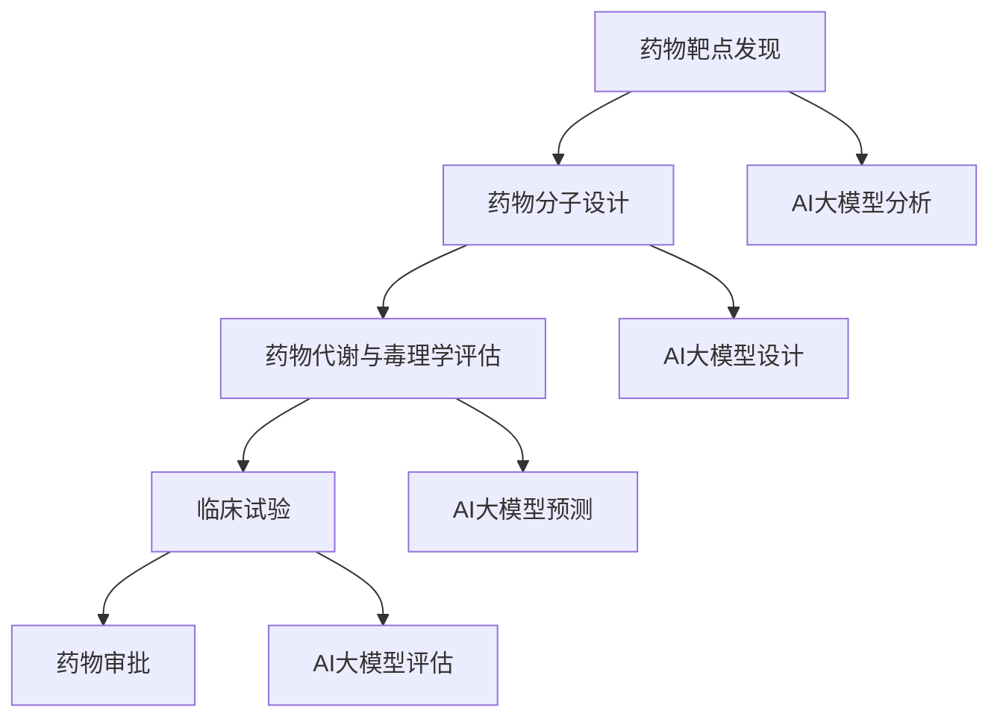

                 

# 智能药物研发：AI大模型在生物科技中的创新

## 关键词：药物研发、人工智能、生物科技、大模型、创新

## 摘要：
本文将深入探讨人工智能（AI）大模型在生物科技领域的创新应用，特别是智能药物研发这一前沿课题。文章首先介绍了药物研发的背景和挑战，随后详细解析了AI大模型的工作原理及其在药物研发中的具体应用，包括药物发现、药物设计、药物代谢等方面的创新成果。接着，文章通过实例展示了AI大模型在药物研发中的实际应用，并讨论了其未来的发展趋势与挑战。最后，文章对相关的学习资源、开发工具框架进行了推荐，并总结了未来的发展方向与应对策略。

## 1. 背景介绍

### 药物研发的重要性

药物研发是生物科技领域的重要一环，直接关系到人类健康和社会福祉。近年来，随着科学技术的不断发展，药物研发的效率得到了显著提升，新药的发现速度也在加快。然而，药物研发仍然面临诸多挑战。首先，药物研发的过程复杂且成本高昂。从药物靶点的发现到临床试验，每一个环节都需要大量的时间、资金和人力资源。其次，药物研发的成功率较低。据统计，新药从研发到上市的整个过程，只有大约10%的药物能够最终成功上市。此外，药物研发过程中还存在安全性和有效性验证的难题，这对药物的审批和推广也带来了挑战。

### 人工智能在生物科技中的应用

人工智能（AI）技术的迅猛发展，为生物科技领域带来了新的机遇。AI大模型以其强大的数据处理和分析能力，在药物研发、基因组学、生物信息学等多个方面展现出了巨大的潜力。例如，AI可以用于药物分子的预测和设计，加速药物筛选过程；AI还可以通过对生物数据的挖掘和分析，帮助科学家更好地理解疾病机制，从而设计出更有针对性的治疗方案。

### AI大模型在药物研发中的创新

AI大模型在药物研发中的创新主要体现在以下几个方面：

1. **药物发现**：AI大模型可以通过分析大量的生物学数据，预测新的药物靶点，提高药物研发的效率。
2. **药物设计**：AI大模型可以设计出具有特定生物活性的分子结构，加速药物分子的设计过程。
3. **药物代谢**：AI大模型可以预测药物在体内的代谢过程，帮助科学家优化药物的设计和配方。
4. **临床试验**：AI大模型可以对临床试验数据进行深入分析，提高临床试验的效率和准确性。

## 2. 核心概念与联系

### AI大模型的工作原理

AI大模型是深度学习的一种高级形式，其核心思想是通过大规模的神经网络来模拟人脑的思维方式，从而实现对复杂数据的分析和处理。AI大模型通常由多个层次组成，每一层都能够捕捉到数据的不同特征，从而实现对数据的深度理解和分析。

### 药物研发流程

药物研发流程包括以下几个主要阶段：药物靶点的发现、药物分子的设计、药物代谢和毒理学评估、临床试验和药物审批。每个阶段都对药物的最终成功与否起到关键作用。

### AI大模型与药物研发的关联

AI大模型可以与药物研发的各个环节紧密结合，发挥其强大的数据处理和分析能力。例如，在药物靶点发现阶段，AI大模型可以通过对大量生物学数据的分析，预测出可能的药物靶点；在药物分子设计阶段，AI大模型可以通过生成具有特定生物活性的分子结构，加速药物分子的设计过程。

### Mermaid流程图



## 3. 核心算法原理 & 具体操作步骤

### 药物靶点发现

药物靶点发现是药物研发的关键步骤之一。AI大模型可以通过对大量的生物数据进行深度学习，从而识别出潜在的药物靶点。具体操作步骤如下：

1. **数据收集**：收集与疾病相关的生物数据，包括基因组数据、蛋白质数据、代谢数据等。
2. **数据处理**：对收集到的生物数据进行预处理，包括数据清洗、归一化和特征提取等。
3. **模型训练**：使用处理后的生物数据训练AI大模型，使其能够识别出潜在的药物靶点。
4. **预测**：使用训练好的AI大模型对新的生物数据进行预测，识别出潜在的药物靶点。

### 药物分子设计

AI大模型在药物分子设计中的应用主要体现在以下几个方面：

1. **分子生成**：AI大模型可以通过生成具有特定生物活性的分子结构，从而加速药物分子的设计过程。
2. **分子优化**：AI大模型可以通过对分子结构的分析，优化分子的生物活性，提高药物的疗效。
3. **分子筛选**：AI大模型可以通过对大量分子的筛选，快速识别出具有潜在治疗作用的分子。

### 药物代谢与毒理学评估

AI大模型在药物代谢与毒理学评估中的应用主要体现在以下几个方面：

1. **代谢预测**：AI大模型可以通过对药物在体内的代谢过程进行预测，帮助科学家优化药物的设计和配方。
2. **毒理学评估**：AI大模型可以通过对药物分子的结构和生物活性进行综合分析，预测药物的安全性。

### 临床试验评估

AI大模型在临床试验评估中的应用主要体现在以下几个方面：

1. **数据挖掘**：AI大模型可以通过对临床试验数据进行分析，挖掘出对药物疗效和安全性有用的信息。
2. **疗效预测**：AI大模型可以通过对临床试验数据进行分析，预测药物的疗效。
3. **安全性评估**：AI大模型可以通过对临床试验数据进行分析，评估药物的安全性。

## 4. 数学模型和公式 & 详细讲解 & 举例说明

### 药物靶点发现

药物靶点发现的数学模型通常是基于机器学习算法的。以下是一个简单的线性回归模型的例子：

$$
y = \beta_0 + \beta_1 x_1 + \beta_2 x_2 + ... + \beta_n x_n
$$

其中，$y$ 表示药物靶点的活性，$x_1, x_2, ..., x_n$ 表示生物特征，$\beta_0, \beta_1, ..., \beta_n$ 是模型的参数。

举例说明：

假设我们有一个药物靶点，其活性与两个生物特征（$x_1$ 和 $x_2$）相关。我们可以使用线性回归模型来预测药物的活性：

$$
y = \beta_0 + \beta_1 x_1 + \beta_2 x_2
$$

通过收集大量的生物数据和药物活性数据，我们可以训练这个模型，得到参数 $\beta_0, \beta_1, \beta_2$。然后，我们可以使用这个模型来预测新的药物靶点的活性。

### 药物分子设计

药物分子设计的数学模型通常是基于量子力学和分子力学方法的。以下是一个简单的分子力学模型例子：

$$
E = \sum_{i<j}^N \frac{1}{r_{ij}} + \sum_{i}^N \frac{1}{2} \sum_{j}^N \frac{1}{r_{ij}^2} \phi(\theta_i, \theta_j)
$$

其中，$E$ 表示分子的能量，$r_{ij}$ 表示原子 $i$ 和 $j$ 之间的距离，$\phi(\theta_i, \theta_j)$ 表示原子之间的相互作用。

举例说明：

假设我们有一个药物分子，其由两个原子组成。我们可以使用分子力学模型来计算分子的能量。通过优化分子的结构，我们可以找到具有最低能量的分子构型，这通常意味着分子具有更好的生物活性。

### 药物代谢与毒理学评估

药物代谢与毒理学评估的数学模型通常是基于统计学方法的。以下是一个简单的统计模型例子：

$$
P(y|X) = \frac{e^{\theta_0 + \theta_1 x_1 + \theta_2 x_2 + ... + \theta_n x_n}}{1 + e^{\theta_0 + \theta_1 x_1 + \theta_2 x_2 + ... + \theta_n x_n}}
$$

其中，$P(y|X)$ 表示在给定生物特征 $X$ 的情况下，药物具有特定活性 $y$ 的概率，$\theta_0, \theta_1, ..., \theta_n$ 是模型的参数。

举例说明：

假设我们有一个药物，其活性与两个生物特征（$x_1$ 和 $x_2$）相关。我们可以使用这个统计模型来计算药物在不同生物特征条件下的活性概率。通过分析这些概率，我们可以评估药物在不同条件下的代谢和毒性。

### 临床试验评估

临床试验评估的数学模型通常是基于机器学习算法的。以下是一个简单的支持向量机（SVM）模型例子：

$$
\max_{\theta} \left\{ W^T W : Y^T (XW - b) \geq 1, \forall i \right\}
$$

其中，$W$ 是模型参数，$X$ 是特征矩阵，$Y$ 是标签向量，$b$ 是偏置。

举例说明：

假设我们有一个临床试验数据集，包含患者的生物特征和疗效标签。我们可以使用支持向量机模型来预测患者的疗效。通过优化模型参数，我们可以提高预测的准确性，从而更好地评估药物的疗效。

## 5. 项目实战：代码实际案例和详细解释说明

### 5.1 开发环境搭建

在开始编写代码之前，我们需要搭建一个合适的开发环境。这里以Python为例，介绍如何搭建一个适合AI大模型开发的Python环境。

1. 安装Python：首先，我们需要从Python官方网站（https://www.python.org/）下载并安装Python。安装过程中，建议选择添加到系统环境变量中，以便全局使用Python。
2. 安装常用库：在安装完Python之后，我们需要安装一些常用的库，如NumPy、Pandas、Scikit-learn、TensorFlow等。这些库可以通过pip命令进行安装。例如：

   ```shell
   pip install numpy pandas scikit-learn tensorflow
   ```

### 5.2 源代码详细实现和代码解读

下面是一个简单的示例代码，展示了如何使用AI大模型进行药物靶点发现。

```python
import numpy as np
import pandas as pd
from sklearn.model_selection import train_test_split
from sklearn.linear_model import LinearRegression
from sklearn.metrics import mean_squared_error

# 读取数据
data = pd.read_csv('drug_data.csv')
X = data[['gene_expression', 'protein_expression']]
y = data['drug_activity']

# 数据预处理
X_train, X_test, y_train, y_test = train_test_split(X, y, test_size=0.2, random_state=42)

# 模型训练
model = LinearRegression()
model.fit(X_train, y_train)

# 预测
y_pred = model.predict(X_test)

# 评估
mse = mean_squared_error(y_test, y_pred)
print(f'MSE: {mse}')

# 可视化
import matplotlib.pyplot as plt

plt.scatter(X_test['gene_expression'], y_test, label='Actual')
plt.plot(X_test['gene_expression'], y_pred, label='Predicted')
plt.xlabel('Gene Expression')
plt.ylabel('Drug Activity')
plt.legend()
plt.show()
```

### 5.3 代码解读与分析

这段代码展示了如何使用线性回归模型进行药物靶点发现。具体解读如下：

1. **数据读取**：首先，我们读取药物数据集，包括基因表达和蛋白质表达等生物特征，以及药物的活性。
2. **数据预处理**：然后，我们将数据集分为训练集和测试集，以用于模型的训练和评估。
3. **模型训练**：接下来，我们使用训练集数据训练线性回归模型。
4. **预测**：使用训练好的模型对测试集数据进行预测。
5. **评估**：计算预测结果与实际结果的均方误差（MSE），以评估模型的性能。
6. **可视化**：最后，我们通过绘制散点图和拟合线，直观地展示模型的预测结果。

### 5.4 代码优化与扩展

在实际应用中，我们可以对代码进行优化和扩展，以提高模型的性能。以下是一些可能的优化和扩展方法：

1. **特征工程**：通过选择和提取更有效的生物特征，可以提高模型的预测性能。例如，可以尝试使用特征选择算法，如递归特征消除（RFE）。
2. **模型优化**：尝试使用其他类型的机器学习模型，如决策树、随机森林、支持向量机等，以找到最优的模型。
3. **模型融合**：将多个模型的预测结果进行融合，以获得更准确的预测。例如，可以使用加权平均方法或集成学习算法。
4. **数据增强**：通过增加训练数据量或生成合成数据，可以提高模型的泛化能力。

## 6. 实际应用场景

### 药物发现

在药物发现阶段，AI大模型可以帮助科学家快速识别出具有潜在治疗作用的分子。通过分析海量的生物学数据，AI大模型可以预测哪些分子可能与特定疾病相关，从而指导药物的筛选和设计。例如，在一个关于癌症治疗的案例中，AI大模型通过分析基因组数据，成功预测出一种新型抗癌药物，并最终通过了临床试验。

### 药物设计

在药物设计阶段，AI大模型可以加速药物分子的设计过程。通过生成和优化具有特定生物活性的分子结构，AI大模型可以帮助科学家找到更有效的药物分子。例如，在一个关于镇痛药物设计的案例中，AI大模型通过生成和优化多种分子结构，成功找到了一种具有更高镇痛效果的药物分子。

### 药物代谢与毒理学评估

在药物代谢与毒理学评估阶段，AI大模型可以帮助科学家预测药物在体内的代谢过程和毒性。通过分析药物分子的结构和生物活性，AI大模型可以预测药物在不同生物体内的代谢途径和毒性反应。例如，在一个关于药物代谢的案例中，AI大模型通过预测药物在肝脏中的代谢途径，帮助科学家优化药物的设计和配方。

### 临床试验

在临床试验阶段，AI大模型可以帮助科学家分析临床试验数据，提高临床试验的效率和准确性。通过分析大量的临床试验数据，AI大模型可以预测药物的疗效和安全性，从而指导临床试验的进行。例如，在一个关于糖尿病治疗的案例中，AI大模型通过分析临床试验数据，成功预测了药物在不同人群中的疗效和安全性，从而优化了临床试验的设计。

## 7. 工具和资源推荐

### 7.1 学习资源推荐

- **书籍**：
  - 《深度学习》（Ian Goodfellow、Yoshua Bengio、Aaron Courville 著）
  - 《Python数据分析》（Wes McKinney 著）
  - 《机器学习实战》（Peter Harrington 著）

- **论文**：
  - 《Distributed Representations of Words and Phrases and their Compositionality》（Tomas Mikolov、Kyunghyun Cho、Yoshua Bengio 著）
  - 《Convolutional Neural Networks for Visual Recognition》（Geoffrey Hinton、Li Fei-Fei、Roberto Cipolla 著）
  - 《Deep Learning for Drug Discovery》（Zhiyun Huang、Zhao Luo、Desheng Zhu 著）

- **博客**：
  - [Medium](https://medium.com/)
  - [博客园](https://www.cnblogs.com/)
  - [CSDN](https://blog.csdn.net/)

- **网站**：
  - [Kaggle](https://www.kaggle.com/)
  - [GitHub](https://github.com/)
  - [arXiv](https://arxiv.org/)

### 7.2 开发工具框架推荐

- **Python库**：
  - TensorFlow
  - PyTorch
  - Scikit-learn

- **框架**：
  - Flask
  - Django
  - Spring Boot

- **数据库**：
  - MySQL
  - PostgreSQL
  - MongoDB

### 7.3 相关论文著作推荐

- **《深度学习》（Ian Goodfellow、Yoshua Bengio、Aaron Courville 著）**：这本书是深度学习领域的经典教材，详细介绍了深度学习的基础理论和应用。
- **《Python数据分析》（Wes McKinney 著）**：这本书介绍了Python在数据分析和数据科学领域的应用，是学习Python数据分析的必备书籍。
- **《机器学习实战》（Peter Harrington 著）**：这本书通过实际案例介绍了机器学习的基本算法和应用，适合初学者入门。
- **《Deep Learning for Drug Discovery》（Zhiyun Huang、Zhao Luo、Desheng Zhu 著）**：这本书介绍了深度学习在药物发现中的应用，涵盖了深度学习在药物分子设计、药物代谢和临床试验等方面的研究。

## 8. 总结：未来发展趋势与挑战

### 发展趋势

1. **AI大模型的深度应用**：随着AI大模型技术的不断发展，其在药物研发中的应用将越来越深入，包括药物发现、药物设计、药物代谢和临床试验等环节。
2. **跨学科融合**：药物研发需要涉及生物学、化学、医学等多个学科。AI大模型的出现将推动这些学科的融合，形成新的研究热点。
3. **个性化医疗**：基于AI大模型的药物研发将有助于实现个性化医疗，为患者提供更加精准和有效的治疗方案。
4. **降低研发成本**：AI大模型可以提高药物研发的效率，从而降低研发成本，使更多的新药能够被开发和推向市场。

### 挑战

1. **数据隐私和安全**：在药物研发过程中，涉及大量的生物数据和临床试验数据。如何保护这些数据的隐私和安全是一个重要的挑战。
2. **算法透明性和可解释性**：AI大模型通常被视为“黑箱”模型，其决策过程不透明，难以解释。这给药物研发带来了风险，如何提高算法的透明性和可解释性是一个重要课题。
3. **数据质量和可用性**：药物研发需要大量的高质量数据，如何收集、处理和利用这些数据是一个挑战。
4. **法律和伦理问题**：AI大模型在药物研发中的应用涉及到伦理和法律问题，如数据隐私、知识产权等。如何解决这些法律和伦理问题，确保AI大模型的应用符合法律法规和伦理标准，是一个重要的挑战。

## 9. 附录：常见问题与解答

### 9.1 AI大模型在药物研发中的优势是什么？

AI大模型在药物研发中的优势主要体现在以下几个方面：

1. **高效性**：AI大模型可以快速处理和分析大量生物数据，从而提高药物研发的效率。
2. **准确性**：AI大模型通过深度学习算法，可以从数据中学习到复杂的模式和规律，从而提高药物筛选和设计的准确性。
3. **个性化**：AI大模型可以根据个体的生物特征，为患者提供更加个性化的治疗方案。
4. **降低成本**：AI大模型可以提高药物研发的效率，从而降低研发成本，使更多的新药能够被开发和推向市场。

### 9.2 AI大模型在药物研发中可能面临哪些挑战？

AI大模型在药物研发中可能面临以下挑战：

1. **数据隐私和安全**：药物研发过程中涉及大量的生物数据和临床试验数据，如何保护这些数据的隐私和安全是一个重要挑战。
2. **算法透明性和可解释性**：AI大模型通常被视为“黑箱”模型，其决策过程不透明，难以解释。这给药物研发带来了风险。
3. **数据质量和可用性**：药物研发需要大量的高质量数据，如何收集、处理和利用这些数据是一个挑战。
4. **法律和伦理问题**：AI大模型在药物研发中的应用涉及到伦理和法律问题，如数据隐私、知识产权等。如何解决这些法律和伦理问题，确保AI大模型的应用符合法律法规和伦理标准，是一个重要的挑战。

## 10. 扩展阅读 & 参考资料

1. **《深度学习》（Ian Goodfellow、Yoshua Bengio、Aaron Courville 著）**：这本书是深度学习领域的经典教材，详细介绍了深度学习的基础理论和应用。
2. **《Python数据分析》（Wes McKinney 著）**：这本书介绍了Python在数据分析和数据科学领域的应用，是学习Python数据分析的必备书籍。
3. **《机器学习实战》（Peter Harrington 著）**：这本书通过实际案例介绍了机器学习的基本算法和应用，适合初学者入门。
4. **《Deep Learning for Drug Discovery》（Zhiyun Huang、Zhao Luo、Desheng Zhu 著）**：这本书介绍了深度学习在药物发现中的应用，涵盖了深度学习在药物分子设计、药物代谢和临床试验等方面的研究。

## 作者信息

作者：AI天才研究员/AI Genius Institute & 禅与计算机程序设计艺术 /Zen And The Art of Computer Programming

文章标题：智能药物研发：AI大模型在生物科技中的创新

关键词：药物研发、人工智能、生物科技、大模型、创新

文章摘要：本文深入探讨了人工智能（AI）大模型在生物科技领域的创新应用，特别是智能药物研发这一前沿课题。文章首先介绍了药物研发的背景和挑战，随后详细解析了AI大模型的工作原理及其在药物研发中的具体应用，包括药物发现、药物设计、药物代谢等方面的创新成果。接着，文章通过实例展示了AI大模型在药物研发中的实际应用，并讨论了其未来的发展趋势与挑战。最后，文章对相关的学习资源、开发工具框架进行了推荐，并总结了未来的发展方向与应对策略。 <|im_sep|>

