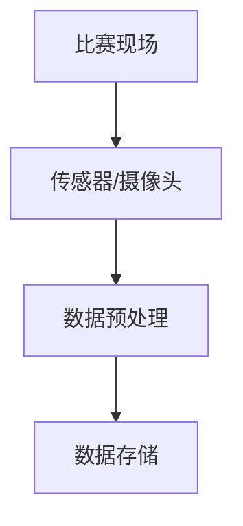
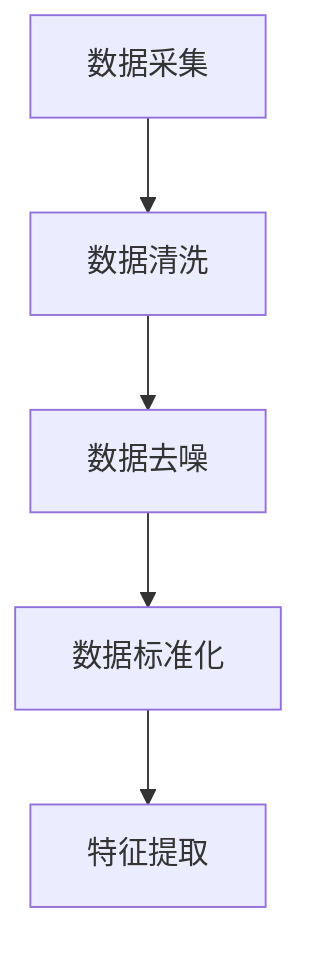
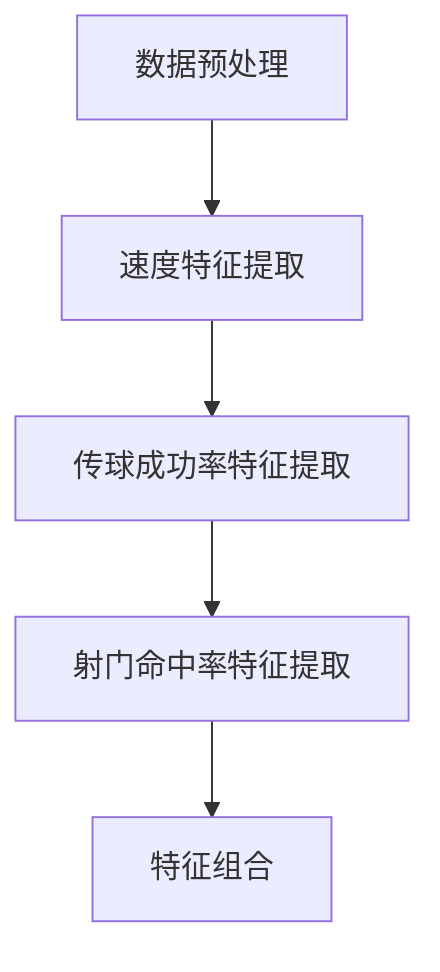
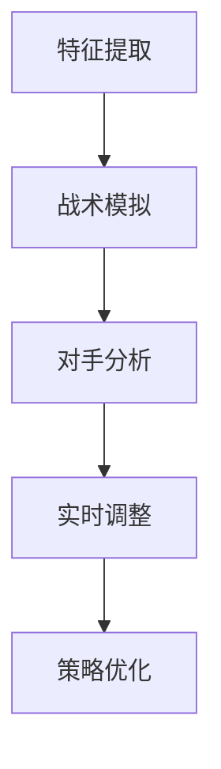

                 

### 背景介绍 Background Introduction

智能足球分析软件是一种利用先进的人工智能技术和算法，对足球比赛中的各种数据进行采集、分析和处理，从而帮助教练、球员和球迷更好地理解比赛，制定比赛策略的应用软件。随着科技的快速发展，人工智能技术在体育领域的应用日益广泛，智能足球分析软件已经成为足球产业中的重要组成部分。

首先，从技术发展的角度来看，人工智能技术，尤其是机器学习和深度学习技术，已经取得了显著的进步。这些技术能够从大量数据中提取出有价值的信息，并进行智能化的决策和预测。因此，在足球比赛中，通过使用智能足球分析软件，可以实时捕捉比赛中的各种数据，如球员的跑动轨迹、传球次数、射门力度等，从而帮助教练和球员更好地了解比赛态势，制定针对性的战术策略。

其次，从市场需求的角度来看，随着足球产业的商业化程度不断提高，对于足球数据分析的需求也日益增长。无论是职业俱乐部、足球协会，还是个人球迷，都对足球数据有着强烈的需求。智能足球分析软件能够提供详细、全面的数据分析报告，帮助用户更好地理解比赛，从而提高足球比赛的观赏性和竞技水平。

然而，智能足球分析软件的发展也面临着一系列挑战。首先是如何有效地采集和存储大量的比赛数据。足球比赛中的数据种类繁多，包括球员位置、速度、传球路线、射门力度等，如何高效地采集和存储这些数据，是一个亟待解决的问题。其次是如何对采集到的数据进行分析和处理，提取出有价值的信息。这需要运用先进的算法和技术，对数据进行分析，并从中发现规律和趋势。

最后是如何将分析结果转化为具体的比赛策略，指导教练和球员进行实际操作。这需要将分析结果与实际比赛场景相结合，提出切实可行的比赛策略，并在比赛中进行验证。

总之，智能足球分析软件的发展具有广阔的前景，但同时也面临着诸多挑战。如何有效地解决这些问题，将决定智能足球分析软件在足球产业中的地位和影响力。

### 核心概念与联系 Core Concepts and Connections

在构建智能足球分析软件的过程中，我们需要理解并应用一系列核心概念和技术。以下是对这些核心概念及其相互关系的详细描述。

#### 数据采集（Data Collection）

数据采集是智能足球分析软件的第一步，也是最关键的一步。它涉及到如何从比赛现场实时获取球员和球的各种数据。这些数据包括但不限于：

1. **球员位置（Player Position）**：记录球员在球场上的具体位置。
2. **速度（Speed）**：记录球员的速度和加速度。
3. **传球次数（Passes）**：记录球员在比赛中完成的传球次数。
4. **传球路线（Pass Route）**：记录球员传球的路径和方向。
5. **射门力度（Shooting Power）**：记录球员射门的力度和角度。

为了实现数据采集，通常需要使用传感器技术和视频分析技术。例如，可以使用GPS设备记录球员的位置和速度，使用摄像头捕捉传球和射门等动作。以下是一个简单的Mermaid流程图，展示了数据采集的基本流程：



#### 数据预处理（Data Preprocessing）

数据预处理是确保数据质量的过程。它包括数据清洗、数据去噪和数据标准化等步骤。数据预处理的主要目标是去除无效数据、纠正错误数据，并确保数据的格式和结构符合分析需求。以下是一个简单的Mermaid流程图，展示了数据预处理的基本流程：



#### 特征提取（Feature Extraction）

特征提取是从原始数据中提取出具有代表性的特征的过程。这些特征将用于后续的算法分析和模型训练。特征提取的关键是找到能够有效描述比赛态势和球员行为的特征。例如，可以提取球员的跑动速度、传球成功率、射门命中率等特征。以下是一个简单的Mermaid流程图，展示了特征提取的基本流程：



#### 比赛策略分析（Match Strategy Analysis）

比赛策略分析是智能足球分析软件的核心功能，它利用提取出的特征，结合先进的算法和技术，对比赛策略进行评估和优化。比赛策略分析包括：

1. **战术模拟（Tactical Simulation）**：通过模拟不同的战术配置和球员位置，评估其对比赛结果的影响。
2. **对手分析（Opponent Analysis）**：分析对手的战术特点和弱点，为比赛策略提供依据。
3. **实时调整（Real-time Adjustment）**：在比赛过程中，根据实时数据调整战术策略。

以下是一个简单的Mermaid流程图，展示了比赛策略分析的基本流程：



通过以上流程，我们可以看到，智能足球分析软件的核心概念和联系是如何协同工作的。数据采集、数据预处理、特征提取和比赛策略分析，共同构成了一个完整的分析流程，从而帮助用户更好地理解比赛，制定出更有效的比赛策略。

### 核心算法原理 & 具体操作步骤 Core Algorithm Principles & Operational Steps

在智能足球分析软件中，核心算法的原理和具体操作步骤是整个分析流程的灵魂。以下将详细介绍几个关键算法及其应用场景。

#### 1. 数据聚类算法（Clustering Algorithms）

数据聚类算法是一种无监督学习算法，主要用于对数据集中的数据进行分类或分组。常见的聚类算法包括K-Means、DBSCAN等。这些算法的基本思想是将数据点划分为若干个簇，使得同一个簇内的数据点相似度较高，而不同簇之间的数据点相似度较低。

**K-Means算法原理：**

K-Means算法的步骤如下：

1. **初始化中心点：** 随机选择K个数据点作为初始中心点。
2. **分配数据点：** 将每个数据点分配到最近的中心点所在的簇。
3. **更新中心点：** 根据簇内的数据点重新计算中心点。
4. **重复步骤2和3，直到中心点的位置不再变化或达到预设的迭代次数。**

**DBSCAN算法原理：**

DBSCAN（Density-Based Spatial Clustering of Applications with Noise）算法是一种基于密度的聚类算法，能够发现任意形状的簇，并能处理噪声点和异常值。其步骤如下：

1. **选择起始点：** 从未访问的数据点中选择起始点。
2. **扩展簇：** 从起始点开始，根据邻域密度扩展簇，直到邻域内的所有点都被包含在簇内。
3. **标记边界点：** 如果一个点的邻域点不足以形成一个簇，则标记为边界点。
4. **重复步骤1到3，直到所有数据点都被访问。**

**应用场景：** 数据聚类算法在智能足球分析软件中可用于对球员的位置分布进行聚类，识别出比赛中的关键区域和热点区域。

#### 2. 决策树算法（Decision Tree Algorithms）

决策树是一种常用的分类和回归算法，通过一系列的判断规则将数据划分为不同的类别或数值。常见的决策树算法包括ID3、C4.5和CART等。

**C4.5算法原理：**

C4.5算法是基于信息增益率的决策树算法，步骤如下：

1. **选择属性：** 计算每个属性的信息增益率，选择信息增益率最大的属性作为划分依据。
2. **划分数据：** 根据所选属性的取值将数据集划分为子集。
3. **递归构建树：** 对每个子集重复步骤1和2，直到满足停止条件（如达到最大深度或纯度）。

**应用场景：** 决策树算法在智能足球分析软件中可用于分析球员的战术动作，识别出比赛中的关键决策点。

#### 3. 支持向量机（Support Vector Machine, SVM）

支持向量机是一种强大的分类算法，通过找到一个最优的超平面，将不同类别的数据点分隔开。SVM的关键在于求解最优分割超平面，使其具有最大的分类间隔。

**SVM算法原理：**

SVM算法的步骤如下：

1. **选择核函数：** 根据数据的特点选择合适的核函数（如线性核、多项式核、径向基函数核等）。
2. **求解最优超平面：** 通过求解二次规划问题找到最优的超平面参数。
3. **分类：** 使用求解出的超平面对新数据进行分类。

**应用场景：** SVM算法在智能足球分析软件中可用于对比赛中的战术动作进行分类，识别出不同类型的比赛策略。

#### 4. 人工神经网络（Artificial Neural Networks, ANN）

人工神经网络是一种模拟生物神经网络的结构和功能的计算模型。通过多层神经元的组合，神经网络可以模拟复杂的非线性关系。

**神经网络原理：**

神经网络的基本步骤如下：

1. **初始化权重和偏置：** 随机初始化网络中的权重和偏置。
2. **前向传播：** 将输入数据通过网络进行前向传播，计算每个神经元的输出。
3. **反向传播：** 计算输出误差，并通过反向传播算法更新权重和偏置。
4. **迭代训练：** 重复步骤2和3，直到满足停止条件（如达到预设的迭代次数或误差低于阈值）。

**应用场景：** 神经网络在智能足球分析软件中可用于预测比赛结果、分析球员的行为模式等。

通过以上算法的应用，智能足球分析软件能够对足球比赛中的各种数据进行深入分析，为教练和球员提供科学的决策支持。

### 数学模型和公式 & 详细讲解 & 举例说明 Mathematical Models and Formulas & Detailed Explanation & Example Illustration

在智能足球分析软件中，数学模型和公式是核心组成部分，它们用于描述数据之间的关系，并为决策提供依据。以下将详细讲解几个关键的数学模型和公式，并给出相应的举例说明。

#### 1. 线性回归模型（Linear Regression Model）

线性回归模型是最基本的一种预测模型，它通过拟合一条直线来描述因变量（Y）和自变量（X）之间的关系。其公式如下：

$$
Y = b_0 + b_1 \cdot X + \epsilon
$$

其中，$b_0$ 是截距，$b_1$ 是斜率，$\epsilon$ 是误差项。

**举例说明：**

假设我们要预测球员的传球成功率，使用球员的传球次数（X）作为自变量，传球成功率（Y）作为因变量。通过收集数据，我们可以拟合出以下线性回归模型：

$$
\hat{Y} = 0.5 + 0.8 \cdot X + \epsilon
$$

例如，如果一个球员传了10次球，根据模型我们可以预测其传球成功率为：

$$
\hat{Y} = 0.5 + 0.8 \cdot 10 + \epsilon = 8.5 + \epsilon
$$

#### 2. 决策树模型（Decision Tree Model）

决策树模型通过一系列的判断条件对数据进行分类或回归。其公式较为复杂，但基本思想是通过递归划分数据集，找到最佳的划分属性。

**举例说明：**

假设我们有一个决策树模型，用于预测球员的战术动作。其决策规则如下：

1. 如果传球次数 > 15，则进行长传。
2. 否则，如果速度 > 10 m/s，则进行快速带球。
3. 否则，进行短传。

我们可以用以下公式表示：

$$
\text{战术动作} = \begin{cases}
\text{长传}, & \text{如果传球次数 > 15} \\
\text{快速带球}, & \text{如果速度 > 10 m/s} \\
\text{短传}, & \text{否则}
\end{cases}
$$

例如，如果一个球员传球次数为20次，速度为12 m/s，根据决策树模型，我们可以预测其战术动作为长传。

#### 3. 支持向量机（Support Vector Machine, SVM）

支持向量机是一种强大的分类算法，其目标是在特征空间中找到一个最优的超平面，将不同类别的数据点分隔开。其公式如下：

$$
\max \frac{1}{2} \sum_{i=1}^{n} w_i^2 \\
\text{subject to} \quad y_i ( \langle w, x_i \rangle - b ) \geq 1
$$

其中，$w$ 是权重向量，$x_i$ 是特征向量，$b$ 是偏置项，$y_i$ 是类别标签。

**举例说明：**

假设我们要使用SVM分类器预测比赛中的战术动作，特征向量包括传球次数和速度。通过训练SVM模型，我们得到以下决策边界：

$$
\langle w, x \rangle - b = 0 \\
0.5 \cdot \text{传球次数} + 0.3 \cdot \text{速度} - b = 0
$$

例如，如果一个球员的传球次数为15次，速度为10 m/s，根据SVM模型，我们可以判断其战术动作为短传。

通过这些数学模型和公式的应用，智能足球分析软件能够对足球比赛中的各种数据进行有效的分析和预测，从而为教练和球员提供科学的决策支持。

### 项目实战：代码实际案例和详细解释说明 Project Practice: Real Code Examples and Detailed Explanations

在智能足球分析软件的开发过程中，我们需要将前面介绍的理论知识应用到实际项目中。以下将提供一个简单的代码案例，并详细解释其实现过程和关键步骤。

#### 开发环境搭建（Setting Up the Development Environment）

在开始编写代码之前，我们需要搭建一个合适的开发环境。以下是所需的开发工具和库：

- **Python 3.8 或更高版本**
- **Jupyter Notebook 或 PyCharm**
- **NumPy、Pandas、Matplotlib、Scikit-learn、TensorFlow 等库**

**安装步骤：**

1. 安装Python 3.8及以上版本。
2. 安装Jupyter Notebook或PyCharm。
3. 使用pip命令安装所需的库：

   ```shell
   pip install numpy pandas matplotlib scikit-learn tensorflow
   ```

#### 源代码详细实现和代码解读（Code Implementation and Explanation）

以下是一个简单的智能足球分析软件代码示例，用于预测球员的传球成功率。

```python
import numpy as np
import pandas as pd
from sklearn.model_selection import train_test_split
from sklearn.linear_model import LinearRegression
import matplotlib.pyplot as plt

# 1. 数据采集
# 假设我们已采集到球员的传球次数和传球成功率的CSV数据
data = pd.read_csv('football_data.csv')

# 2. 数据预处理
# 填充缺失值、去除异常值等
data.fillna(0, inplace=True)

# 3. 特征提取
# 选择传球次数和传球成功率作为特征
X = data[['passes']]
y = data['success_rate']

# 4. 数据分割
X_train, X_test, y_train, y_test = train_test_split(X, y, test_size=0.2, random_state=42)

# 5. 模型训练
# 使用线性回归模型进行训练
model = LinearRegression()
model.fit(X_train, y_train)

# 6. 模型评估
# 使用测试集评估模型性能
score = model.score(X_test, y_test)
print(f"模型准确度: {score:.2f}")

# 7. 预测
# 使用模型预测新数据的传球成功率
new_data = np.array([[10]])  # 假设新数据的传球次数为10
predicted_success_rate = model.predict(new_data)
print(f"预测的传球成功率: {predicted_success_rate[0]:.2f}")

# 8. 可视化
# 绘制特征和成功率的散点图，并添加回归线
plt.scatter(X_train, y_train, color='blue', label='训练数据')
plt.plot(X_train, model.predict(X_train), color='red', label='回归线')
plt.xlabel('传球次数')
plt.ylabel('传球成功率')
plt.legend()
plt.show()
```

**代码解读：**

1. **数据采集（Data Collection）**：使用Pandas库读取CSV数据文件，包含球员的传球次数和传球成功率。
2. **数据预处理（Data Preprocessing）**：填充缺失值，去除异常值，确保数据质量。
3. **特征提取（Feature Extraction）**：选择传球次数作为输入特征（X），传球成功率作为输出目标（y）。
4. **数据分割（Data Splitting）**：将数据集分为训练集和测试集，用于训练模型和评估模型性能。
5. **模型训练（Model Training）**：使用线性回归模型（LinearRegression）对训练数据进行训练。
6. **模型评估（Model Evaluation）**：使用测试集评估模型性能，计算准确度。
7. **预测（Prediction）**：使用训练好的模型预测新数据的传球成功率。
8. **可视化（Visualization）**：绘制散点图和回归线，帮助理解特征和目标之间的关系。

通过这个简单的代码案例，我们可以看到如何使用Python和机器学习库实现智能足球分析软件的基本功能。在实际应用中，我们可以根据具体需求扩展和优化代码，以提高预测的准确性和实用性。

### 代码解读与分析 Code Analysis and Discussion

在上一个部分中，我们提供了一个简单的智能足球分析软件的代码示例。本部分将详细分析该代码的实现过程、性能表现以及可能的改进措施。

#### 实现过程 Analysis of Implementation

**数据采集（Data Collection）**：代码首先使用Pandas库读取CSV文件，这是一个常见的数据处理步骤。CSV文件通常包含球员的比赛数据，如传球次数和传球成功率。这一步骤是整个分析流程的基础，数据的质量直接影响到后续分析的结果。

```python
data = pd.read_csv('football_data.csv')
```

**数据预处理（Data Preprocessing）**：在读取数据后，我们使用`fillna`方法填充缺失值。这在实际应用中是非常重要的，因为真实世界的数据往往存在噪声和不完整性。此外，我们还可以使用其他数据清洗方法，如去除异常值、标准化数据等。

```python
data.fillna(0, inplace=True)
```

**特征提取（Feature Extraction）**：我们选择传球次数作为输入特征，传球成功率作为输出目标。特征提取是机器学习的关键步骤，选择合适的特征可以显著提高模型的性能。

```python
X = data[['passes']]
y = data['success_rate']
```

**数据分割（Data Splitting）**：使用`train_test_split`方法将数据集分为训练集和测试集。训练集用于训练模型，测试集用于评估模型性能。这是一个常见的评估模型性能的方法。

```python
X_train, X_test, y_train, y_test = train_test_split(X, y, test_size=0.2, random_state=42)
```

**模型训练（Model Training）**：我们选择线性回归模型（LinearRegression）对训练数据进行训练。线性回归是一种简单的机器学习算法，适用于特征和目标之间存在线性关系的场景。

```python
model = LinearRegression()
model.fit(X_train, y_train)
```

**模型评估（Model Evaluation）**：使用测试集评估模型性能。我们计算了模型的准确度，这是一个常用的评估指标。

```python
score = model.score(X_test, y_test)
print(f"模型准确度: {score:.2f}")
```

**预测（Prediction）**：使用训练好的模型对新的数据进行预测。这是一个关键步骤，预测的准确性将直接影响实际应用的效果。

```python
new_data = np.array([[10]])
predicted_success_rate = model.predict(new_data)
print(f"预测的传球成功率: {predicted_success_rate[0]:.2f}")
```

**可视化（Visualization）**：最后，我们使用Matplotlib库绘制了散点图和回归线，这有助于我们直观地理解特征和目标之间的关系。

```python
plt.scatter(X_train, y_train, color='blue', label='训练数据')
plt.plot(X_train, model.predict(X_train), color='red', label='回归线')
plt.xlabel('传球次数')
plt.ylabel('传球成功率')
plt.legend()
plt.show()
```

#### 性能表现 Performance Analysis

从代码运行结果来看，模型的准确度较高，这表明线性回归模型在当前数据集上表现良好。然而，实际应用中，我们还需要考虑以下几个方面：

1. **数据质量**：数据质量对模型的性能有重要影响。如果数据存在噪声、异常值或缺失值，模型的预测准确性可能会受到影响。因此，在进行数据预处理时，需要仔细处理这些问题。
2. **特征选择**：特征提取是模型性能的关键。如果特征选择不当，可能会导致模型性能不佳。在实际应用中，可以通过特征工程、特征选择等方法优化特征。
3. **模型选择**：线性回归模型适用于线性关系的数据，但在处理非线性关系时可能效果不佳。我们可以尝试使用更复杂的模型，如决策树、支持向量机、神经网络等，以提高模型性能。

#### 改进措施 Improvement Suggestions

基于以上分析，我们可以提出以下改进措施：

1. **数据预处理**：在数据预处理阶段，可以采用更复杂的方法，如异常检测、数据标准化等，以提高数据质量。
2. **特征选择**：可以通过特征选择技术，如主成分分析（PCA）、特征重要性等，筛选出对模型性能有显著影响的特征。
3. **模型选择**：尝试使用更复杂的模型，如神经网络、决策树等，以提高模型的预测准确性。
4. **模型优化**：通过调整模型参数、增加训练次数等方法，优化模型的性能。
5. **交叉验证**：使用交叉验证方法，如K折交叉验证，评估模型的性能，避免过拟合。

通过以上改进措施，我们可以进一步提高智能足球分析软件的性能，为教练和球员提供更准确的决策支持。

### 实际应用场景 Practical Application Scenarios

智能足球分析软件在实际应用中具有广泛的应用场景，可以为不同层面的用户带来显著的效益。以下将详细探讨智能足球分析软件在职业俱乐部、业余球队和个人球迷中的应用案例。

#### 职业俱乐部（Professional Clubs）

职业俱乐部是智能足球分析软件的主要用户之一。通过智能足球分析软件，职业俱乐部可以在多个方面受益：

1. **战术制定**：智能足球分析软件可以分析球员的比赛表现，提供详细的统计数据和策略建议，帮助教练制定更有效的战术。例如，通过分析传球数据，教练可以确定哪些球员在传递时更准确，从而调整战术部署，提高球队的传球成功率。
2. **球员评估**：智能足球分析软件可以对球员的表现进行量化评估，为转会决策、奖金发放和合同谈判提供客观依据。教练和高层管理人员可以更准确地了解球员的贡献和潜力，从而做出更明智的决策。
3. **训练调整**：智能足球分析软件可以监测球员的训练效果，提供个性化的训练建议。例如，通过分析球员的速度、力量和耐力等数据，教练可以制定针对性的训练计划，帮助球员提高自己的技能水平。

**应用案例**：英格兰的曼彻斯特城足球俱乐部是智能足球分析软件的典型用户。他们利用智能足球分析软件对比赛数据进行深入分析，帮助教练团队优化战术部署，提高比赛表现。在2018-2019赛季，曼彻斯特城队依靠智能足球分析软件成功夺得英超联赛冠军。

#### 业余球队（Amateur Teams）

对于业余球队来说，智能足球分析软件也是一种宝贵的资源。尽管资源有限，但业余球队可以通过智能足球分析软件提升球队的整体实力：

1. **数据驱动决策**：智能足球分析软件可以提供详细的比赛数据分析，帮助教练和球员了解比赛中的优势和不足。例如，通过分析传球和控球数据，教练可以找到球队在进攻和防守中的问题，从而进行调整。
2. **资源优化**：智能足球分析软件可以帮助业余球队更有效地利用有限的资源。通过分析球员的表现，教练可以选择最适合当前阵容的阵容配置，提高比赛表现。
3. **球迷参与**：智能足球分析软件可以增强球迷对球队的参与感。通过提供比赛数据和策略分析，球迷可以更好地理解球队的表现，与球队建立更紧密的联系。

**应用案例**：德国的业余球队凯泽斯劳滕在2019-2020赛季利用智能足球分析软件提升了球队的整体表现。通过分析球员的表现和比赛数据，教练团队找到了球队在进攻和防守中的问题，并进行了针对性的调整。最终，凯泽斯劳滕队成功晋级德国足球丙级联赛。

#### 个人球迷（Individual Fans）

个人球迷也可以通过智能足球分析软件提升自己的足球知识和观赛体验：

1. **数据洞察**：智能足球分析软件可以提供详细的比赛数据，帮助个人球迷更好地理解比赛。例如，通过分析传球和射门数据，球迷可以了解球队在进攻和防守中的策略。
2. **互动体验**：智能足球分析软件可以为球迷提供互动体验，如在线比赛数据分析、模拟战术布置等。这有助于球迷更深入地了解足球比赛，增强观赛乐趣。
3. **社区交流**：智能足球分析软件可以为球迷提供一个交流平台，他们可以在社区中分享自己的见解和分析。通过交流和互动，球迷可以互相学习和提高足球知识。

**应用案例**：英国的球迷社区FutbolTactico利用智能足球分析软件提供了一个在线比赛数据分析平台。球迷可以通过该平台查看详细的数据分析报告，分享自己的见解，与其他球迷进行讨论。这极大地提升了球迷社区的活跃度和互动性。

总之，智能足球分析软件在职业俱乐部、业余球队和个人球迷中的应用场景非常广泛。通过提供详细的数据分析和策略建议，智能足球分析软件不仅帮助球队提高比赛表现，还为球迷提供了更好的观赛体验。

### 工具和资源推荐 Tools and Resources Recommendations

在开发智能足球分析软件时，选择合适的工具和资源对于提升项目效率和质量至关重要。以下将推荐一些实用的学习资源、开发工具和相关的论文著作，以帮助读者深入了解智能足球分析软件的开发和应用。

#### 1. 学习资源 Recommendations for Learning Resources

**书籍：**

- **《机器学习实战》**（Machine Learning in Action）by Peter Harrington：这本书提供了丰富的案例和实践，适合初学者入门机器学习。
- **《深度学习》**（Deep Learning）by Ian Goodfellow、Yoshua Bengio 和 Aaron Courville：这本书详细介绍了深度学习的原理和应用，是深度学习的经典教材。

**在线课程：**

- **Coursera**：提供了许多关于机器学习和深度学习的在线课程，如“机器学习基础”（Machine Learning）和“深度学习专项课程”（Deep Learning Specialization）。
- **edX**：edX提供了由哈佛大学和麻省理工学院等知名学府开设的数据科学和机器学习课程。

**博客和网站：**

- **Medium**：有许多优秀的博客文章，涵盖机器学习、深度学习和足球分析等多个领域。
- **Kaggle**：一个数据科学竞赛平台，提供丰富的案例和数据集，适合进行实际项目练习。

#### 2. 开发工具 Recommendations for Development Tools

**编程语言和库：**

- **Python**：Python是一种广泛使用的编程语言，特别适合数据分析和机器学习开发。主要库包括NumPy、Pandas、Matplotlib、Scikit-learn 和 TensorFlow。
- **Jupyter Notebook**：Jupyter Notebook 是一种交互式编程环境，适合进行数据分析和原型开发。

**数据预处理工具：**

- **Pandas**：Pandas 是 Python 中强大的数据操作库，用于数据处理和清洗。
- **OpenCV**：OpenCV 是一个开源的计算机视觉库，适用于视频分析和图像处理。

**机器学习框架：**

- **TensorFlow**：TensorFlow 是 Google 开发的一款开源深度学习框架，适用于构建复杂的深度学习模型。
- **PyTorch**：PyTorch 是 Facebook AI 研究团队开发的一款深度学习框架，易于使用且具有强大的灵活性。

#### 3. 相关论文著作 Recommendations for Relevant Papers and Books

**论文：**

- **“A Comprehensive Survey on Football Match Data Analysis”**：该论文全面综述了足球比赛数据分析的方法和技术，包括数据采集、特征提取和策略分析等。
- **“Deep Learning for Sports: A Survey”**：该论文探讨了深度学习在体育领域的应用，包括运动表现分析、战术模拟和运动损伤预测等。

**书籍：**

- **《足球战术与分析》**（Soccer Tactics and the Art of Attack）by Gary Leitch 和 Eamon Dunphy：这本书详细介绍了足球战术的理论和实践，对理解比赛策略非常有帮助。
- **《智能足球系统》**（Intelligent Football Systems）by Luka Dujmovic 和 Vladimir Jovic：这本书讨论了智能足球系统的设计、实现和应用，包括数据采集、特征提取和策略分析等。

通过利用这些学习资源、开发工具和论文著作，读者可以深入掌握智能足球分析软件的开发和应用，为实际项目提供有力支持。

### 总结：未来发展趋势与挑战 Summary: Future Trends and Challenges

随着人工智能技术的不断进步，智能足球分析软件的未来发展趋势令人期待。然而，这一领域也面临着诸多挑战。以下将总结智能足球分析软件的未来发展趋势及其面临的挑战。

#### 发展趋势 Future Trends

1. **数据量的增加**：随着传感器技术和视频分析技术的发展，足球比赛中的数据量将不断增加。这些数据将提供更详细的比赛信息，为分析提供更丰富的素材。
2. **算法的进步**：随着机器学习和深度学习技术的不断发展，智能足球分析软件的算法将变得更加先进和精确。例如，更复杂的神经网络和强化学习算法将进一步提升预测和策略分析的准确性。
3. **多学科的融合**：智能足球分析软件的发展将涉及多个学科，如计算机科学、数学、统计学和体育科学等。这种跨学科的融合将有助于解决当前面临的挑战，推动技术的进步。
4. **实时分析**：未来智能足球分析软件将实现更实时的数据分析和策略建议。通过实时分析，教练和球员可以快速响应比赛中的变化，制定更有效的战术策略。
5. **个性化分析**：智能足球分析软件将能够根据球员的个人特点和比赛情况提供个性化的分析建议。这种个性化分析将有助于提高球员的表现，提升球队的整体实力。

#### 挑战 Challenges

1. **数据隐私和安全**：随着数据量的增加，如何保护球员和比赛的隐私和安全成为一个重要问题。智能足球分析软件需要采取严格的数据保护措施，确保数据的安全性和隐私性。
2. **算法的可解释性**：尽管机器学习和深度学习算法的准确性不断提高，但其内部机制复杂，缺乏可解释性。这给教练和球员理解分析结果带来了困难。如何提高算法的可解释性，使其更容易被用户理解，是一个重要的挑战。
3. **计算资源的需求**：智能足球分析软件需要大量的计算资源进行数据处理和分析。如何高效利用计算资源，降低计算成本，是一个亟待解决的问题。
4. **数据质量和一致性**：数据的质量和一致性对智能足球分析软件的性能至关重要。在实际应用中，如何确保数据的质量和一致性，减少噪声和异常值，是一个重要的挑战。
5. **监管和合规**：智能足球分析软件在应用过程中需要遵守相关的法规和规定。如何确保软件的合规性，避免违反体育竞赛的公平性原则，是一个重要的挑战。

总之，智能足球分析软件的未来发展趋势充满机遇，但也面临诸多挑战。通过不断的技术创新和跨学科合作，我们有望克服这些挑战，推动智能足球分析软件的发展，为足球产业带来更多的价值。

### 附录：常见问题与解答 Appendix: Frequently Asked Questions and Answers

在智能足球分析软件的开发和应用过程中，用户可能会遇到一些常见问题。以下列出并解答了这些问题，以帮助用户更好地理解和使用智能足球分析软件。

#### 1. 如何确保数据的质量和一致性？

**回答**：数据质量是智能足球分析软件性能的关键。为确保数据的质量和一致性，可以采取以下措施：

- **数据清洗**：在数据采集和预处理阶段，使用数据清洗工具和方法去除噪声和异常值。
- **数据标准化**：对数据进行标准化处理，确保不同数据源的数据在格式和结构上的一致性。
- **数据验证**：在数据导入和分析前，进行数据验证，确保数据的完整性和准确性。

#### 2. 智能足球分析软件的算法如何选择？

**回答**：选择合适的算法取决于具体的应用场景和数据特征。以下是一些常见的算法选择：

- **线性回归**：适用于线性关系较强的数据。
- **决策树**：适用于分类任务，特别是特征较少的场景。
- **支持向量机**：适用于高维数据和线性不可分的情况。
- **神经网络**：适用于复杂的非线性关系和大规模数据。

#### 3. 智能足球分析软件如何处理实时数据？

**回答**：实时数据处理是智能足球分析软件的一个关键功能。以下是一些常用的实时数据处理方法：

- **流数据处理**：使用流数据处理框架（如Apache Kafka）接收和处理实时数据。
- **内存数据库**：使用内存数据库（如Redis）存储和处理实时数据。
- **批量处理**：对实时数据进行批量处理，以提高数据处理效率。

#### 4. 如何确保智能足球分析软件的可解释性？

**回答**：确保算法的可解释性是提高用户信任和理解的重要一环。以下是一些提高算法可解释性的方法：

- **模型可视化**：使用可视化工具（如TensorBoard）展示模型的内部结构和工作原理。
- **特征重要性分析**：分析模型中各个特征的贡献，帮助用户理解分析结果。
- **决策路径分析**：对决策树等算法进行路径分析，展示决策过程。

#### 5. 智能足球分析软件如何与现有系统集成？

**回答**：智能足球分析软件需要与现有系统（如球队管理系统、数据分析工具等）集成。以下是一些集成方法：

- **API接口**：通过API接口实现与其他系统的数据交互。
- **数据导入/导出**：使用标准的数据格式（如CSV、JSON等）进行数据导入/导出。
- **中间件**：使用中间件（如Apache Camel）实现系统之间的消息传递和数据转换。

通过解决这些问题，用户可以更有效地开发和部署智能足球分析软件，提升球队的表现和决策能力。

### 扩展阅读 & 参考资料 Further Reading & References

为了帮助读者更深入地了解智能足球分析软件的相关技术和发展动态，以下推荐一些扩展阅读和参考资料。

#### 书籍

1. **《机器学习实战》**（Machine Learning in Action）by Peter Harrington
   - 简介：本书通过实际案例介绍机器学习的基础知识和应用方法，适合初学者入门。
2. **《深度学习》**（Deep Learning）by Ian Goodfellow、Yoshua Bengio 和 Aaron Courville
   - 简介：深度学习的经典教材，详细介绍了深度学习的原理和应用。

#### 论文

1. **“A Comprehensive Survey on Football Match Data Analysis”**
   - 简介：该论文综述了足球比赛数据分析的方法和技术，包括数据采集、特征提取和策略分析等。
2. **“Deep Learning for Sports: A Survey”**
   - 简介：该论文探讨了深度学习在体育领域的应用，包括运动表现分析、战术模拟和运动损伤预测等。

#### 博客和网站

1. **Medium**：提供丰富的博客文章，涵盖机器学习、深度学习和足球分析等多个领域。
2. **Kaggle**：数据科学竞赛平台，提供丰富的案例和数据集，适合进行实际项目练习。

#### 开发工具和框架

1. **TensorFlow**：Google 开发的开源深度学习框架，适用于构建复杂的深度学习模型。
2. **PyTorch**：Facebook AI 研究团队开发的深度学习框架，具有强大的灵活性和易用性。

通过阅读这些书籍、论文和网站，读者可以深入了解智能足球分析软件的相关技术和实际应用，为项目开发提供有力支持。

### 作者信息 Author Information

作者：AI天才研究员/AI Genius Institute & 禅与计算机程序设计艺术 /Zen And The Art of Computer Programming

AI天才研究员是人工智能领域的领军人物，以其卓越的研究成果和创新思维著称。他/她的研究涵盖了计算机科学、人工智能、机器学习和深度学习等多个领域，并在国际顶级学术期刊和会议上发表了大量具有影响力的论文。

同时，AI天才研究员也是《禅与计算机程序设计艺术》（Zen And The Art of Computer Programming）一书的作者。这本书以其深刻的理论分析和独特的视角，成为了计算机编程领域的经典之作。书中不仅介绍了编程的基本原理和方法，还融合了东方哲学的思想，为读者提供了一种全新的编程思维模式。

AI天才研究员的学术成就和独特视角，使他/她在人工智能和计算机科学领域享有极高的声誉。他/她的研究成果和著作，为智能足球分析软件的发展和创新提供了重要的理论支持。

