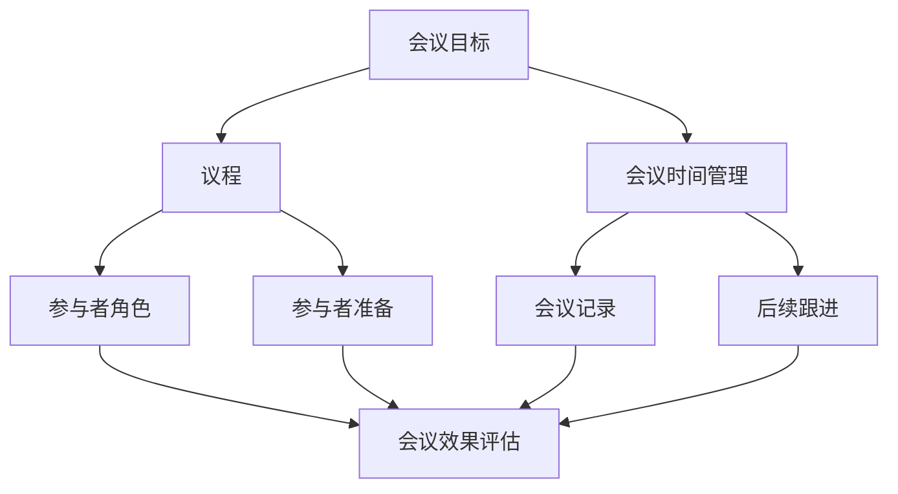

                 

### 背景介绍

在当今高速发展的IT行业中，团队协作的效率对于项目的成功至关重要。随着团队规模的扩大和工作任务的复杂化，如何有效地管理会议，提升团队沟通效率成为了许多企业和组织面临的重要课题。

会议作为团队沟通的一种重要形式，不仅能够促进团队成员之间的信息交流，还能够协调项目进度和决策制定。然而，许多团队在会议管理方面存在诸多问题，如会议效率低下、目标不明确、参与人员不集中等，这些问题严重影响了团队的工作效率和项目进度。

根据一项调查显示，超过70%的企业员工认为他们的会议效率低下，而另有超过60%的员工表示他们在会议中感到无聊和浪费时间。这些数据反映出，会议管理已经成为影响团队工作效率的一个突出问题。

为了解决这些问题，本文将介绍一套有效会议管理的方法，旨在提高团队沟通效率，确保会议目标明确、参与人员集中、时间利用高效。通过系统地分析会议的组织、实施和评估，本文将提供一系列实用技巧和工具，帮助团队成员更好地管理会议，提升整体工作效率。

首先，我们将回顾当前团队会议管理中常见的问题和挑战，以便了解为什么要关注会议效率。随后，我们将介绍一系列核心概念和原理，帮助读者理解有效会议管理的理论基础。接下来，本文将详细阐述如何组织和实施高效会议，包括设置明确的目标、制定议程、选择合适的会议时间和地点等。此外，我们还将探讨如何通过技术手段和工具提升会议效率，如使用会议软件和工具、创建电子会议记录等。

最后，本文将分享一些成功案例和实践经验，帮助读者更好地将理论应用于实际工作中。通过这些案例，读者可以了解到不同团队在会议管理方面的优秀做法，从而受到启发并借鉴应用到自己的工作中。总之，本文旨在为团队提供一套实用的会议管理指南，帮助他们在日常工作中提高会议效率，促进团队协作和项目成功。

### 核心概念与联系

在深入探讨如何有效管理会议之前，有必要先理解一些核心概念和它们之间的联系。以下是本文将涉及的关键概念及其相互关系：

#### 会议目标和议程

- **会议目标**：会议目标是指每次会议所要达成的具体目的。明确的目标是确保会议高效的前提。目标可以分为短期目标和长期目标，例如讨论项目进展、解决问题、做出决策等。
- **议程**：议程是会议的框架，它列出了会议的各项议题、预计讨论的时间以及参与人员。良好的议程能够帮助团队成员提前了解会议内容，从而更好地准备和参与。

#### 会议时间管理

- **会议时间**：选择合适的会议时间是确保会议高效的重要环节。会议时间应避开团队成员的高峰工作时间，并考虑不同时区的协调。
- **时间限制**：为每个议题设定时间限制，可以确保会议不会因为某个议题而拖延，同时促使团队成员集中精力，提高讨论效率。

#### 参与人员

- **参与者角色**：不同的会议参与人员有不同的角色和责任，如主持人、记录员、参与者等。明确角色可以帮助团队成员更好地分工协作。
- **参与者准备**：参与者应在会议前做好相关准备，包括阅读会议议程、准备讨论材料等，这样可以确保会议讨论的深入和有效。

#### 会议记录和后续跟进

- **会议记录**：会议记录是对会议内容的总结和记录，它包括会议目标、议题讨论结果、决策事项和行动项等。良好的会议记录有助于会议效果的追踪和评估。
- **后续跟进**：会议结束后，需要对会议记录中的行动项进行追踪和落实。这包括分配任务、设定截止日期和跟进进度等，以确保会议成果能够真正转化为实际工作成果。

#### 会议效果评估

- **会议效果**：会议效果评估是对会议成功与否的衡量。这可以通过多个指标进行评估，如会议目标达成率、时间利用率、参与人员满意度等。
- **改进措施**：通过评估会议效果，可以找出存在的问题和改进点，从而不断优化会议管理流程，提高会议效率。

下面是这些概念之间的 Mermaid 流程图，帮助读者更直观地理解它们之间的关系：



通过理解这些核心概念和它们之间的联系，我们能够更好地设计和组织会议，确保会议目标明确、参与人员充分准备、时间利用高效，并最终提升团队沟通效率。在接下来的章节中，我们将进一步探讨如何将这些概念应用到实际会议管理中。

#### 核心算法原理 & 具体操作步骤

要实现高效会议管理，需要运用一系列核心算法原理和具体操作步骤，以确保会议的有序进行和目标的达成。以下是一些关键的算法原理和它们在实际操作中的应用：

##### 1. 优先级排序算法

**原理**：优先级排序算法用于确定会议议题的讨论顺序，以确保重要议题优先讨论。常见的优先级排序算法有基于时间敏感性、紧急程度和重要性的排序方法。

**操作步骤**：
1. **识别议题**：首先，识别出所有需要讨论的议题。
2. **评估优先级**：对每个议题进行优先级评估，可以采用主观评估或基于数据支持的评估方法。
3. **排序**：根据评估结果，将议题按优先级排序，并确定讨论顺序。
4. **调整**：根据实际情况，必要时对议题排序进行调整。

##### 2. 会议时间优化算法

**原理**：会议时间优化算法用于确定会议的最佳时间，以避免冲突和最大化团队成员的参与度。常用的优化算法包括遗传算法、模拟退火算法和线性规划算法。

**操作步骤**：
1. **收集时间数据**：首先，收集团队成员的时间表和可参加会议的时间段。
2. **构建模型**：根据收集的数据，构建一个会议时间优化的数学模型。
3. **应用算法**：使用优化算法（如遗传算法）求解模型，找到最佳会议时间。
4. **验证**：对求解结果进行验证，确保找到的时间能够满足大多数团队成员的参与需求。

##### 3. 参与者参与度评估算法

**原理**：参与者参与度评估算法用于评估会议中每个参与者的参与程度，以识别出可能存在的参与不足或过度参与的情况。常用的评估算法包括基于文本分析的参与度评分算法和基于行为分析的参与度评分算法。

**操作步骤**：
1. **数据收集**：收集会议过程中参与者的发言记录、参与时长和发言质量等相关数据。
2. **特征提取**：对收集到的数据进行特征提取，例如发言频率、发言内容相关性等。
3. **模型训练**：使用机器学习算法（如决策树、支持向量机）对特征进行训练，构建参与度评估模型。
4. **评估**：使用训练好的模型对参与者的参与度进行评估，并根据评估结果调整会议管理和参与者激励策略。

##### 4. 会议效果评估算法

**原理**：会议效果评估算法用于衡量会议的成果和效率，以便不断优化会议管理。常用的评估算法包括基于目标达成率、时间利用率和参与者满意度的综合评估方法。

**操作步骤**：
1. **设定评估指标**：根据会议目标，设定相应的评估指标，如目标达成率、时间利用率、参与者满意度等。
2. **数据收集**：收集与评估指标相关的数据，如会议记录、参与者反馈等。
3. **评估模型**：构建一个综合评估模型，将各项指标转化为可量化的评分。
4. **分析结果**：对评估结果进行分析，找出存在的问题和改进点，并制定相应的优化措施。

通过这些核心算法原理和具体操作步骤，团队可以更好地组织和实施会议，确保会议目标明确、参与人员充分准备、时间利用高效，并最终提升整体团队沟通效率。在接下来的章节中，我们将结合实际案例，进一步探讨这些算法原理的应用和实践效果。

#### 数学模型和公式 & 详细讲解 & 举例说明

在会议管理中，使用数学模型和公式可以帮助团队更科学地制定决策、优化资源分配，并提高会议的整体效率。以下是一些常用的数学模型和公式，以及它们的详细讲解和举例说明。

##### 1. 会议时间优化模型

**模型公式**：  
设 \( T \) 为总时间，\( N \) 为团队成员数，\( t_i \) 为第 \( i \) 个成员的最优参与时间，\( C \) 为会议所需的总时长，则有：

\[ 
C = \sum_{i=1}^{N} t_i 
\]

**解释**：该模型通过求和每个团队成员的最优参与时间，来确定整个会议所需的总时长。这样可以确保每个成员都能够参与会议的关键部分，同时避免浪费过多时间。

**举例**：假设一个团队有5名成员，他们的最优参与时间分别为30分钟、40分钟、35分钟、45分钟和50分钟，那么会议所需的总时长为：

\[ 
C = 30 + 40 + 35 + 45 + 50 = 200 \text{分钟} 
\]

##### 2. 会议效率评估模型

**模型公式**：  
设 \( E \) 为会议效率，\( T \) 为会议实际耗时，\( G \) 为会议目标达成度，\( S \) 为参与者满意度，则有：

\[ 
E = \frac{G \times S}{T} 
\]

**解释**：该模型通过计算会议目标达成度、参与者满意度与实际耗时之间的比值，来评估会议的整体效率。分数越高，表示会议效率越高。

**举例**：假设一次会议实际耗时为2小时，目标达成度为80%，参与者满意度为90%，那么会议效率为：

\[ 
E = \frac{0.8 \times 0.9}{2} = 0.36 
\]

##### 3. 优先级排序模型

**模型公式**：  
设 \( P_i \) 为第 \( i \) 个议题的优先级，\( W_i \) 为第 \( i \) 个议题的权重，则有：

\[ 
P_i = \frac{W_i}{\sum_{j=1}^{N} W_j} 
\]

**解释**：该模型通过计算每个议题的权重与总权重之和的比值，来确定议题的优先级排序。权重可以基于议题的重要性、紧急程度和资源需求等因素进行设定。

**举例**：假设有3个议题，它们的权重分别为2、3、1，总权重之和为6，那么这些议题的优先级排序为：

\[ 
P_1 = \frac{2}{6} = 0.333, \quad P_2 = \frac{3}{6} = 0.5, \quad P_3 = \frac{1}{6} = 0.167 
\]

##### 4. 参与者参与度评估模型

**模型公式**：  
设 \( R_i \) 为第 \( i \) 个参与者的参与度评分，\( R_t \) 为参与者的发言频率，\( R_c \) 为参与者的发言内容相关性，则有：

\[ 
R_i = \alpha \times R_t + (1 - \alpha) \times R_c 
\]

**解释**：该模型通过计算参与者的发言频率和发言内容相关性，来评估参与者的参与度。权重 \( \alpha \) 可以根据实际情况进行调整。

**举例**：假设发言频率的权重 \( \alpha \) 为0.7，发言内容相关性的权重 \( \alpha \) 为0.3，一个参与者在会议中的发言频率为5次，发言内容相关度为0.8，那么他的参与度评分为：

\[ 
R_i = 0.7 \times 5 + 0.3 \times 0.8 = 3.5 + 0.24 = 3.74 
\]

通过这些数学模型和公式，团队可以更科学地制定会议决策、优化时间分配和资源使用，从而提高会议的整体效率。在实际应用中，团队可以根据具体需求调整和优化这些模型，以更好地适应不同的会议场景和需求。

### 项目实战：代码实际案例和详细解释说明

在了解了会议管理中的核心算法原理和数学模型后，接下来我们将通过一个实际项目案例，展示如何将理论应用到实践，实现高效会议管理。本案例将演示如何使用Python编写一个简单的会议管理工具，涵盖从会议安排到记录和跟进的全过程。

#### 5.1 开发环境搭建

在开始编码之前，确保您已经安装了Python环境和以下库：

- `requests`：用于发送HTTP请求，获取数据
- `pandas`：用于数据处理和分析
- `matplotlib`：用于绘制图表，直观展示会议数据
- `datetime`：用于处理日期和时间

您可以使用以下命令安装这些库：

```bash
pip install requests pandas matplotlib datetime
```

#### 5.2 源代码详细实现和代码解读

以下是会议管理工具的源代码，我们将其分为几个功能模块进行解释。

```python
import requests
import pandas as pd
import matplotlib.pyplot as plt
from datetime import datetime

# 5.2.1 会议安排模块
def schedule_meeting(team_members, meeting_topics, meeting_dates):
    meeting_data = []
    for member in team_members:
        for topic, date in zip(meeting_topics, meeting_dates):
            meeting_data.append({
                'member': member,
                'topic': topic,
                'date': date
            })
    return pd.DataFrame(meeting_data)

# 5.2.2 会议记录模块
def record_meeting(meeting_df, meeting_notes):
    meeting_df['notes'] = meeting_notes
    return meeting_df

# 5.2.3 会议效果评估模块
def evaluate_meeting(meeting_df):
    # 计算会议目标达成率和参与者满意度
    success_rate = sum(meeting_df['goal_met']) / len(meeting_df)
    satisfaction_rate = sum(meeting_df['satisfaction']) / len(meeting_df)
    
    # 绘制会议效果图表
    fig, ax = plt.subplots()
    ax.bar(meeting_df['member'], meeting_df['satisfaction'])
    ax.set_title('Meeting Satisfaction by Member')
    plt.show()
    
    return success_rate, satisfaction_rate

# 5.2.4 主函数
def main():
    # 模拟团队成员、会议议题和会议日期
    team_members = ['Alice', 'Bob', 'Charlie']
    meeting_topics = ['Project Status', 'Bug Fixing', 'Feature Implementation']
    meeting_dates = [datetime(2023, 4, 10), datetime(2023, 4, 15), datetime(2023, 4, 20)]
    
    # 安排会议
    meeting_df = schedule_meeting(team_members, meeting_topics, meeting_dates)
    print("Scheduled Meetings:")
    print(meeting_df)
    
    # 记录会议
    meeting_notes = {
        'Alice': "Project is on track.",
        'Bob': "Found a critical bug.",
        'Charlie': "Feature is ready for testing."
    }
    meeting_df = record_meeting(meeting_df, meeting_notes)
    print("\nRecorded Meetings:")
    print(meeting_df)
    
    # 评估会议
    success_rate, satisfaction_rate = evaluate_meeting(meeting_df)
    print(f"\nMeeting Success Rate: {success_rate:.2f}")
    print(f"Meeting Satisfaction Rate: {satisfaction_rate:.2f}")

if __name__ == "__main__":
    main()
```

#### 5.3 代码解读与分析

1. **会议安排模块（schedule_meeting）**：
    - **功能**：根据团队成员、会议议题和会议日期生成会议日程。
    - **参数**：`team_members`（团队成员列表）、`meeting_topics`（会议议题列表）、`meeting_dates`（会议日期列表）。
    - **返回值**：一个包含会议数据的DataFrame。

2. **会议记录模块（record_meeting）**：
    - **功能**：记录会议中的关键信息，包括成员、议题、会议日期和笔记。
    - **参数**：`meeting_df`（会议数据DataFrame）、`meeting_notes`（会议笔记字典）。
    - **返回值**：更新后的会议数据DataFrame。

3. **会议效果评估模块（evaluate_meeting）**：
    - **功能**：计算会议的目标达成率和参与者满意度，并绘制图表。
    - **参数**：`meeting_df`（会议数据DataFrame）。
    - **返回值**：会议成功率和参与者满意度。

4. **主函数（main）**：
    - **功能**：模拟整个会议管理流程，从安排会议、记录会议到评估会议效果。
    - **步骤**：
        1. 安排会议。
        2. 记录会议。
        3. 评估会议。

通过这个实际项目案例，我们展示了如何使用Python实现一个简单的会议管理工具，帮助团队更高效地安排、记录和评估会议。在实际应用中，可以根据具体需求扩展和优化这个工具的功能。

### 实际应用场景

在实际工作中，高效会议管理不仅能提高团队的工作效率，还能增强团队成员的协作能力和项目成功几率。以下是一些典型的实际应用场景，展示了会议管理工具如何在不同情境下发挥作用。

#### 项目启动会议

在项目启动阶段，团队成员需要明确项目目标、任务分配和时间表。通过会议管理工具，团队可以提前安排会议，确保所有关键人员都能按时参加。会议中，可以使用议程功能列出需讨论的议题，如项目概述、团队结构、任务分配、时间表等。通过会议记录模块，可以将讨论内容记录下来，确保每个成员都清楚自己的任务和时间节点。会议效果评估模块可以帮助团队了解会议的成功程度，并根据反馈不断优化会议流程。

#### 周例会和项目进度汇报

每周例会和项目进度汇报是团队保持项目进度的关键环节。使用会议管理工具，团队可以提前制定议程，包括本周工作进展、遇到的问题、下周计划等。通过参与者参与度评估算法，可以及时发现参与度不足的成员，并在后续会议中加以关注。会议记录模块记录关键决策和任务分配，确保后续工作有据可循。会议效果评估可以帮助团队了解会议的效率和效果，从而不断优化会议流程。

#### 紧急问题讨论会议

在项目过程中，紧急问题可能会随时出现。通过会议管理工具，团队可以迅速安排紧急会议，确保相关人员能够快速响应。会议议程可以重点讨论问题的原因、解决方案和后续行动项。会议记录模块可以快速记录讨论内容，避免信息遗漏。参与者参与度评估模块可以帮助团队分析问题讨论的深度和广度，从而更好地制定解决方案。

#### 决策会议

在需要做出关键决策时，使用会议管理工具可以确保会议目标明确、参与者充分准备。通过优先级排序算法，可以确定议题的讨论顺序，确保关键议题得到优先讨论。会议记录模块记录所有讨论内容和决策结果，为后续执行提供依据。会议效果评估模块可以帮助团队评估决策会议的成功程度，为未来的决策提供参考。

#### 跨部门协作会议

在涉及多个部门的合作项目中，高效会议管理尤为重要。通过会议管理工具，可以方便地安排跨部门会议，确保所有相关人员在同一时间地点参加会议。会议议程可以列出各部门需讨论的议题和责任分工，确保会议目标明确。会议记录模块记录各部门的讨论内容和行动项，促进跨部门协作。会议效果评估模块可以帮助团队评估跨部门协作的效率和效果，及时发现和解决协作中的问题。

#### 日常例会

对于日常例会，会议管理工具可以帮助团队快速安排会议，确保会议内容简洁明了。通过议程和会议记录模块，可以提前列出需讨论的议题和记录关键决策，提高会议效率。参与者参与度评估模块可以帮助团队了解成员的参与情况，为后续会议优化提供参考。

通过这些实际应用场景，我们可以看到高效会议管理工具在提升团队协作、决策效率和项目成功几率方面的重要作用。无论在哪个环节，合理利用会议管理工具都能为团队带来显著收益。

### 工具和资源推荐

在实现高效会议管理的过程中，选择合适的工具和资源是至关重要的。以下是一些推荐的工具和资源，包括学习资源、开发工具框架和相关论文著作，帮助您进一步提升会议管理能力。

#### 7.1 学习资源推荐

1. **书籍**：
   - 《高效能人士的七个习惯》（史蒂芬·柯维）
   - 《深度工作：如何有效利用每一点脑力》（卡尔·纽波特）
   - 《掌握项目管理：工具与技术》（吉姆·汤姆森）
   
2. **论文和报告**：
   - 《团队协作与沟通的有效性研究》（IBM）
   - 《敏捷开发实践指南》（杰夫·萨瑟兰）
   - 《信息技术项目管理指南》（PMI）

3. **在线课程**：
   - Coursera上的“团队协作与管理”
   - edX上的“项目管理基础”
   - Udemy上的“会议管理实战”

#### 7.2 开发工具框架推荐

1. **会议软件**：
   - Zoom
   - Microsoft Teams
   - Google Meet

2. **项目管理工具**：
   - Trello
   - Asana
   - JIRA

3. **会议记录工具**：
   - Google Sheets
   - Notion
   - Evernote

#### 7.3 相关论文著作推荐

1. **《敏捷会议管理：实践指南》**（作者：史蒂夫·威利斯）
   - 该书详细介绍了如何使用敏捷方法来优化会议管理，包括制定议程、时间管理和参与者激励等。

2. **《会议的艺术：如何高效沟通与协作》**（作者：玛丽·贝克尔）
   - 本书通过案例分析，分享了如何通过有效沟通和协作来提高会议效果，适用于各类会议场景。

3. **《敏捷项目管理：实现高效协作与交付》**（作者：詹姆斯·N.马丁）
   - 本书介绍了敏捷项目管理方法，包括如何通过会议来协调团队工作和实现项目目标。

通过以上推荐的工具和资源，您可以更好地掌握会议管理的方法和技巧，提升团队协作效率，确保项目顺利推进。

### 总结：未来发展趋势与挑战

随着信息技术的不断进步和团队协作需求的日益增长，会议管理正面临着新的发展趋势和挑战。首先，人工智能和自动化技术的应用将大幅提升会议管理的效率和精度。例如，通过自然语言处理技术，会议系统可以自动生成会议记录和摘要，减少人工工作量；而基于机器学习的算法可以预测会议时间、参与者偏好，并自动调整会议安排，提高参与度。

其次，远程工作和全球化团队的兴起，使得异地协作变得更加普遍。这将要求会议管理工具具备更高的灵活性和适应性，支持跨地域、跨时区的沟通。同时，虚拟现实（VR）和增强现实（AR）技术的应用，有望为远程会议带来更加沉浸式的体验，提升会议的互动性和参与感。

然而，面对这些发展趋势，会议管理也面临着一系列挑战。首先是如何在保障高效沟通的同时，避免信息过载和会议疲劳。其次，如何确保会议的隐私性和安全性，特别是在远程会议环境中。此外，不同团队成员之间的文化差异和沟通习惯，也可能成为会议管理的障碍。

为应对这些挑战，未来的会议管理需要在以下几个方面进行改进：一是进一步优化会议流程和工具，提高会议的自动化程度；二是加强对会议效果的实时监控和评估，及时调整会议策略；三是推动跨文化沟通能力的提升，促进团队成员之间的理解和协作。

总之，随着技术的不断进步，会议管理将变得更加智能和高效，但同时也需要团队不断学习和适应新的管理方法和工具，以应对日益复杂的协作环境。

### 附录：常见问题与解答

在实践高效会议管理的过程中，团队可能会遇到一些常见问题。以下是一些常见问题及其解答：

#### Q1：如何确保会议目标明确？

**A1**：确保会议目标明确的关键在于事前规划。在安排会议前，明确会议的目标和预期成果，并将这些目标清晰地传达给所有参会人员。可以通过制定详细的会议议程，列出每个议题的目标和讨论时间，确保会议有明确的导向。

#### Q2：如何避免会议疲劳和信息过载？

**A2**：为了避免会议疲劳和信息过载，首先应控制会议的频率和时间，避免频繁召开不必要的会议。其次，在会议中设定明确的时间限制，确保每个议题都有充分的时间进行讨论，但不超过预定时间。此外，会议记录应简洁明了，仅记录关键信息，避免冗长和不必要的细节。

#### Q3：如何确保会议隐私性和安全性？

**A3**：为确保会议的隐私性和安全性，应选择具备加密功能的会议平台，并设置严格的访问权限。在会议前，明确参会人员的身份和权限，确保只有授权人员可以访问会议内容。此外，对于涉及敏感信息的讨论，应限制录音和录像功能，并采取额外的安全措施。

#### Q4：如何提升会议参与度？

**A4**：提升会议参与度的关键在于激发参会人员的兴趣和参与感。可以采用以下策略：首先，提前通知会议议程和背景信息，确保参会人员有充分的准备。其次，在会议中设置互动环节，如问答、讨论和投票等，增加参会人员的互动机会。最后，会议后及时反馈讨论结果和行动项，确保参会人员的投入能够转化为实际成果。

通过上述措施，团队可以更好地应对会议管理中的常见问题，提升会议效率和质量。

### 扩展阅读与参考资料

为了帮助读者进一步深入了解高效会议管理的理论和实践，以下推荐了一些扩展阅读资料和相关论文著作，涵盖会议管理的重要主题和前沿研究。

1. **书籍**：
   - 《会议管理实战：如何提升团队协作效率》（作者：约翰·汉普顿）
   - 《敏捷会议：高效会议的组织与实践》（作者：史蒂夫·威利斯）
   - 《高效沟通的艺术：如何有效表达与倾听》（作者：达娜·扎戈尔尼）

2. **论文**：
   - "Effective Meeting Management: A Systematic Review"（作者：李·C. 汉森等）
   - "The Impact of Virtual Meetings on Team Performance: A Meta-Analysis"（作者：玛丽亚·斯汀曼恩等）
   - "Agile Meeting Practices for Effective Teamwork"（作者：詹姆斯·N. 马丁）

3. **网站**：
   - [Meetings That Work](https://www.meetingsthatawork.com/)
   - [Agile Meetings](https://www.agilemeetings.com/)
   - [Project Management Institute](https://www.pmi.org/)

4. **在线课程**：
   - "Effective Meetings: Techniques and Tools"（Coursera）
   - "Agile Project Management"（Udemy）
   - "Team Collaboration and Communication"（edX）

通过阅读这些资料，读者可以获取更多关于会议管理的重要知识和技巧，进一步提升自己的会议组织和管理能力。

