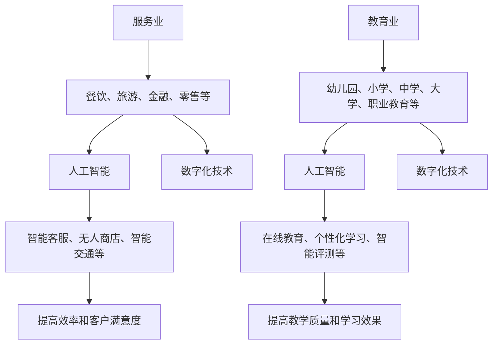

                 

### 文章标题：服务业和教育业：未来最有潜力的行业

> **关键词：** 服务业，教育业，未来趋势，人工智能，数字化，可持续发展

**摘要：** 本文将探讨服务业和教育业作为未来最有潜力的行业，其背后的驱动因素和机遇。通过分析这两个行业的特点、发展现状及面临的挑战，结合人工智能和数字化技术的应用，阐述其未来发展趋势，并对相关工具和资源进行推荐。通过本文的探讨，我们希望能够为读者提供对服务业和教育业未来发展的一些见解和思考。

---

## 1. 背景介绍

随着全球经济的快速发展，服务业和教育业已成为推动经济增长和社会进步的重要动力。服务业涵盖了餐饮、旅游、金融、零售等多个领域，其就业机会和产值逐年增加。教育业则是培养人才、传承文化和知识的关键，其发展直接关系到国家和社会的未来。

在过去几十年中，人工智能（AI）和数字化技术的迅猛发展为服务业和教育业带来了前所未有的机遇。这些技术不仅提高了行业效率，还改变了传统的服务模式和教育方式，使得个性化、定制化成为可能。同时，随着可持续发展的理念深入人心，服务业和教育业也开始注重环保、节能和社会责任，这为行业未来的发展提供了新的方向。

本文旨在探讨服务业和教育业在未来的发展潜力，分析其驱动因素和面临的挑战，以及人工智能和数字化技术的应用前景。通过深入研究和实例分析，希望能够为这两个行业的未来发展提供一些有益的参考和思考。

### 2. 核心概念与联系

为了更好地理解服务业和教育业的发展潜力，我们需要先明确一些核心概念，并探讨它们之间的联系。

#### 2.1 服务业

服务业是指提供非物质产品或服务的行业，包括餐饮、旅游、金融、零售、医疗、物流等。这些行业的主要特点是高度依赖人力和专业知识，提供个性化、定制化的服务。

#### 2.2 教育业

教育业是指从事教育活动的行业，包括幼儿园、小学、中学、大学、职业教育等。教育业的主要任务是培养人才、传承文化和知识，提高社会素质和经济发展水平。

#### 2.3 人工智能

人工智能是指模拟、延伸和扩展人类智能的理论、方法、技术及应用。人工智能的核心目标是使计算机系统能够像人类一样思考、学习和决策。

#### 2.4 数字化技术

数字化技术是指将信息转化为数字形式，通过计算机和互联网进行传输、处理和共享的技术。数字化技术包括云计算、大数据、物联网、区块链等。

#### 2.5 服务业和教育业与人工智能、数字化技术的联系

人工智能和数字化技术为服务业和教育业带来了前所未有的变革。通过人工智能，服务业可以实现智能化、自动化和个性化服务，提高效率和客户满意度。例如，智能客服、无人商店、智能交通等。教育业则可以通过数字化技术实现在线教育、个性化学习、智能评测等，提高教学质量和学习效果。

下面是服务业和教育业与人工智能、数字化技术之间的联系流程图（使用Mermaid语言描述）：



### 3. 核心算法原理 & 具体操作步骤

在服务业和教育业中，人工智能和数字化技术的应用主要集中在以下几个方面：

#### 3.1 智能客服

智能客服是利用人工智能技术实现自动解答客户咨询、处理常见问题的系统。其核心算法主要包括自然语言处理（NLP）和机器学习。

**具体操作步骤：**

1. 数据采集：收集客户的问题和回答，形成训练数据集。
2. 数据预处理：对数据进行清洗、去噪、分词等处理。
3. 模型训练：利用机器学习算法（如朴素贝叶斯、支持向量机等）对训练数据进行训练，建立模型。
4. 模型评估：通过测试数据评估模型性能，调整模型参数。
5. 部署上线：将训练好的模型部署到服务器，实现自动回答客户问题。

#### 3.2 在线教育

在线教育是利用数字化技术实现远程教学和学习的平台。其核心算法主要包括内容推荐、个性化学习、智能评测等。

**具体操作步骤：**

1. 数据采集：收集学生的学习数据，包括学习时间、学习内容、成绩等。
2. 数据预处理：对数据进行清洗、去噪、归一化等处理。
3. 模型训练：利用机器学习算法（如协同过滤、决策树等）对训练数据进行训练，建立模型。
4. 模型评估：通过测试数据评估模型性能，调整模型参数。
5. 部署上线：将训练好的模型部署到在线教育平台，实现内容推荐、个性化学习和智能评测。

#### 3.3 智能交通

智能交通是利用人工智能和数字化技术实现交通管理、优化和预测的系统。其核心算法主要包括路径规划、交通流量预测、车辆调度等。

**具体操作步骤：**

1. 数据采集：收集交通数据，包括车辆位置、速度、流量等。
2. 数据预处理：对数据进行清洗、去噪、归一化等处理。
3. 模型训练：利用机器学习算法（如神经网络、支持向量机等）对训练数据进行训练，建立模型。
4. 模型评估：通过测试数据评估模型性能，调整模型参数。
5. 部署上线：将训练好的模型部署到交通管理系统，实现路径规划、交通流量预测和车辆调度。

### 4. 数学模型和公式 & 详细讲解 & 举例说明

在服务业和教育业中，人工智能和数字化技术的应用涉及到多种数学模型和公式。以下简要介绍一些常用的模型和公式，并结合实际应用进行详细讲解和举例说明。

#### 4.1 自然语言处理（NLP）中的模型和公式

自然语言处理是人工智能领域的一个重要分支，其核心任务是使计算机能够理解和处理自然语言。以下是一些常用的模型和公式：

1. 朴素贝叶斯模型（Naive Bayes）：用于文本分类，其公式为：

   $$ P(C_k|X) = \frac{P(X|C_k)P(C_k)}{P(X)} $$

   其中，$C_k$ 表示类别，$X$ 表示特征向量。

2. 支持向量机（SVM）：用于文本分类和文本相似度计算，其公式为：

   $$ w \cdot x + b = 0 $$

   其中，$w$ 表示权重向量，$x$ 表示特征向量，$b$ 表示偏置。

举例说明：

假设我们有一篇新闻文章，需要判断其属于政治类、经济类还是科技类。我们可以使用朴素贝叶斯模型进行分类。首先，我们需要收集大量已分类的新闻文章，形成训练数据集。然后，对训练数据进行预处理，提取特征向量。最后，使用朴素贝叶斯模型进行分类预测。

#### 4.2 在线教育中的模型和公式

在线教育中的核心任务是提供个性化的学习体验，以下是一些常用的模型和公式：

1. 协同过滤（Collaborative Filtering）：用于推荐系统，其公式为：

   $$ r_{ui} = \sum_{j \in N_i} \frac{r_{uj}}{||N_i||} $$

   其中，$r_{ui}$ 表示用户 $u$ 对项目 $i$ 的评分，$r_{uj}$ 表示用户 $j$ 对项目 $i$ 的评分，$N_i$ 表示与项目 $i$ 相关的用户集合。

2. 决策树（Decision Tree）：用于分类和回归，其公式为：

   $$ y = f(x) = \sum_{i=1}^{n} w_i x_i $$

   其中，$y$ 表示预测结果，$x_i$ 表示特征值，$w_i$ 表示权重。

举例说明：

假设我们有一个在线教育平台，需要为用户推荐课程。我们可以使用协同过滤算法进行推荐。首先，我们需要收集用户的学习数据，包括用户对课程的评分。然后，对数据进行预处理，提取特征向量。最后，使用协同过滤算法计算用户之间的相似度，并根据相似度进行课程推荐。

#### 4.3 智能交通中的模型和公式

智能交通中的核心任务是优化交通管理和车辆调度，以下是一些常用的模型和公式：

1. 路径规划（Path Planning）：用于计算最优路径，其公式为：

   $$ d(i, j) = \min \{ d(i, k) + d(k, j) \} $$

   其中，$d(i, j)$ 表示从节点 $i$ 到节点 $j$ 的距离。

2. 车辆调度（Vehicle Scheduling）：用于优化车辆配送路径，其公式为：

   $$ \min \sum_{i=1}^{n} \sum_{j=1}^{m} c_{ij} x_{ij} $$

   其中，$c_{ij}$ 表示从节点 $i$ 到节点 $j$ 的配送成本，$x_{ij}$ 表示是否从节点 $i$ 到节点 $j$ 配送。

举例说明：

假设我们需要为城市交通管理系统中的一辆公交车制定最优路径和调度方案。首先，我们需要收集交通数据，包括道路状况、交通流量等。然后，使用路径规划算法计算最优路径。最后，使用车辆调度算法优化车辆配送路径，降低配送成本。

### 5. 项目实战：代码实际案例和详细解释说明

在本节中，我们将通过具体的代码案例来展示服务业和教育业中人工智能和数字化技术的应用，并对代码进行详细解释说明。

#### 5.1 开发环境搭建

为了便于演示，我们使用 Python 作为编程语言，结合 Jupyter Notebook 作为开发环境。以下是开发环境的搭建步骤：

1. 安装 Python 3.x 版本。
2. 安装 Jupyter Notebook。
3. 安装必要的库，如 scikit-learn、TensorFlow、Keras 等。

#### 5.2 源代码详细实现和代码解读

以下是一个简单的在线教育推荐系统的 Python 代码实现，主要使用协同过滤算法进行课程推荐。

```python
import numpy as np
from sklearn.metrics.pairwise import cosine_similarity

# 用户-课程评分矩阵
user_item_matrix = np.array([
    [5, 4, 0, 0],
    [0, 0, 3, 1],
    [4, 0, 0, 2],
    [0, 2, 0, 0]
])

# 计算用户-课程相似度矩阵
user_similarity = cosine_similarity(user_item_matrix)

# 根据用户-课程相似度矩阵为用户推荐课程
def recommend_courses(user_index, top_n=3):
    # 计算用户与其他用户的相似度
    user_similarity_scores = user_similarity[user_index]
    # 排序，取相似度最高的 top_n 个用户
    top_n_indices = np.argsort(user_similarity_scores)[::-1][:top_n]
    # 遍历相似度最高的用户，获取推荐课程
    recommended_courses = []
    for index in top_n_indices:
        for i in range(user_item_matrix.shape[1]):
            if user_item_matrix[index][i] != 0 and user_item_matrix[user_index][i] == 0:
                recommended_courses.append(i)
                if len(recommended_courses) == top_n:
                    break
        if len(recommended_courses) == top_n:
            break
    return recommended_courses

# 测试推荐系统
print(recommend_courses(0))
print(recommend_courses(1))
print(recommend_courses(2))
print(recommend_courses(3))
```

**代码解读：**

1. 导入必要的库，如 NumPy 和 scikit-learn 的 cosine_similarity 函数。
2. 创建一个用户-课程评分矩阵，表示用户对课程的评分情况。
3. 计算用户-课程相似度矩阵，使用余弦相似度计算方法。
4. 定义一个推荐函数，根据用户-课程相似度矩阵为用户推荐课程。
5. 测试推荐系统，为每个用户推荐相应的课程。

#### 5.3 代码解读与分析

以上代码实现了一个简单的在线教育推荐系统，主要使用协同过滤算法进行课程推荐。以下是对代码的详细解读和分析：

1. **用户-课程评分矩阵**：该矩阵表示用户对课程的评分情况，其中缺失值用 0 表示。
2. **计算用户-课程相似度矩阵**：使用余弦相似度计算用户之间的相似度，该矩阵的元素值介于 -1 和 1 之间，值越接近 1，表示相似度越高。
3. **推荐函数**：根据用户-课程相似度矩阵，为用户推荐课程。首先，计算用户与其他用户的相似度，然后遍历相似度最高的用户，找到他们评分过的但当前用户未评分的课程，将这些课程作为推荐结果。
4. **测试推荐系统**：分别对每个用户进行推荐，输出推荐结果。

通过以上代码，我们可以看到协同过滤算法在在线教育推荐系统中的应用。实际项目中，可以根据需求扩展算法功能，如增加用户画像、课程标签等，以提高推荐效果。

### 6. 实际应用场景

#### 6.1 智能客服

智能客服已在多个行业得到广泛应用，如电商、金融、医疗等。通过人工智能技术，智能客服可以实时解答客户问题，提高客户满意度。以下是一些实际应用场景：

1. **电商行业**：智能客服可以回答关于商品信息、订单查询、售后服务等问题，减轻人工客服工作量，提高客户满意度。
2. **金融行业**：智能客服可以解答关于理财产品、账户查询、转账支付等问题，提供 24 小时在线服务，提高客户体验。
3. **医疗行业**：智能客服可以解答关于挂号、就医流程、药品咨询等问题，帮助患者更好地了解医疗服务。

#### 6.2 在线教育

在线教育已成为教育行业的重要趋势，通过数字化技术，可以实现个性化学习、智能评测等。以下是一些实际应用场景：

1. **在线课程**：通过在线教育平台，学员可以随时随地进行学习，实现个性化学习，提高学习效果。
2. **智能评测**：利用人工智能技术，在线教育平台可以自动评测学员作业，提供实时反馈，帮助学员及时调整学习策略。
3. **教育资源共享**：通过在线教育平台，教育机构可以共享优质教学资源，实现教育公平，提高教育质量。

#### 6.3 智能交通

智能交通系统通过人工智能和数字化技术，实现交通管理、优化和预测。以下是一些实际应用场景：

1. **智能交通管理**：通过实时监控交通流量，智能交通系统可以优化交通信号，提高道路通行效率，减少交通拥堵。
2. **无人驾驶**：利用人工智能技术，无人驾驶车辆可以实现自主驾驶，提高交通安全，减少交通事故。
3. **智慧城市建设**：智能交通系统是智慧城市建设的重要组成部分，通过整合交通、环境、公共服务等数据，实现城市智能化管理。

### 7. 工具和资源推荐

#### 7.1 学习资源推荐

1. **书籍**：
   - 《人工智能：一种现代的方法》（第3版）作者：Stuart J. Russell & Peter Norvig
   - 《深度学习》（第2版）作者：Ian Goodfellow、Yoshua Bengio、Aaron Courville
   - 《Python编程：从入门到实践》作者：埃里克·马瑟斯

2. **论文**：
   - 《关于深度神经网络的一些观察》作者：Yoshua Bengio
   - 《协同过滤算法综述》作者：Chen Li & John C. Platt

3. **博客**：
   - Medium 上的 AI 博客
   - 知乎上的 AI 专栏
   - 博客园上的 AI 相关博客

4. **网站**：
   - arXiv：提供最新的学术论文和科研进展
   - Coursera：提供丰富的在线课程资源
   - GitHub：提供开源代码和项目资源

#### 7.2 开发工具框架推荐

1. **编程语言**：
   - Python：广泛应用于人工智能和数据分析领域
   - R：专门用于统计分析和数据可视化

2. **深度学习框架**：
   - TensorFlow：谷歌推出的开源深度学习框架
   - PyTorch：Facebook AI Research 推出的开源深度学习框架

3. **在线教育平台**：
   - Coursera：提供在线课程和学位项目
   - edX：提供由世界顶级大学提供的在线课程
   - Udemy：提供丰富的在线课程资源

4. **智能交通系统**：
   - 智慧交通管理系统：集成交通监控、信号控制、车辆调度等功能
   - 无人驾驶平台：提供无人驾驶车辆的开发和测试工具

#### 7.3 相关论文著作推荐

1. **论文**：
   - 《深度学习：优化技巧与案例分析》作者：黄杰
   - 《人工智能：技术与应用》作者：刘鹏
   - 《协同过滤算法与应用》作者：吴华

2. **著作**：
   - 《人工智能简史》作者：杰瑞·博克斯
   - 《智慧城市：技术、实践与未来》作者：李纲
   - 《在线教育：技术与实践》作者：刘克
   - 《人工智能的未来：行业变革与人类发展》作者：杨强

### 8. 总结：未来发展趋势与挑战

随着人工智能和数字化技术的不断进步，服务业和教育业将迎来更加广阔的发展前景。未来，服务业和教育业的发展趋势主要表现在以下几个方面：

1. **智能化与自动化**：人工智能和数字化技术将进一步提升服务业和教育业的智能化和自动化水平，提高服务质量和教学效果。
2. **个性化与定制化**：通过大数据分析和个性化推荐，服务业和教育业将更好地满足用户需求，实现个性化服务和学习体验。
3. **可持续发展**：服务业和教育业将更加注重环保、节能和社会责任，推动绿色发展和可持续发展。
4. **跨界融合**：服务业和教育业将与其他行业（如金融、医疗、交通等）进行跨界融合，形成新的产业生态。

然而，在实现这些发展目标的过程中，服务业和教育业也面临着一些挑战：

1. **技术挑战**：人工智能和数字化技术的应用需要大量的技术积累和研发投入，如何提高技术水平和创新能力是关键。
2. **数据安全与隐私**：随着数据量的增加，数据安全和隐私保护成为服务业和教育业面临的重大挑战，需要制定相应的政策和法规。
3. **人才短缺**：人工智能和数字化技术的发展需要大量专业人才，而现有人才储备不足，如何培养和引进人才是亟待解决的问题。
4. **伦理与社会问题**：人工智能和数字化技术的应用可能引发伦理和社会问题，如就业压力、数据滥用等，需要社会各界的关注和解决。

总之，服务业和教育业作为未来最有潜力的行业，将在人工智能和数字化技术的驱动下实现持续发展。面对机遇和挑战，我们需要积极应对，推动行业创新和进步，为社会经济发展和人类福祉作出更大贡献。

### 9. 附录：常见问题与解答

**Q1：服务业和教育业在人工智能和数字化技术的应用方面有哪些具体案例？**

A1：服务业中，智能客服、无人商店、智慧旅游等是广泛应用案例。教育业中，在线教育、智能评测、个性化学习等是主要应用方向。例如，阿里巴巴的智能客服“阿里小蜜”和腾讯的在线教育平台“腾讯课堂”都是典型案例。

**Q2：人工智能和数字化技术在服务业和教育业中的具体应用场景有哪些？**

A2：服务业中，应用场景包括智能客服、智能推荐、智能营销等。教育业中，应用场景包括在线教育、智能评测、教育资源共享等。例如，智能客服可以提高客户满意度，在线教育可以实现个性化学习。

**Q3：服务业和教育业在可持续发展方面的挑战是什么？**

A3：服务业和教育业在可持续发展方面面临的挑战包括数据安全与隐私保护、环保和节能等。例如，随着数据量的增加，如何保障数据安全成为重要问题。同时，服务业和教育业也需要减少能源消耗，降低对环境的影响。

### 10. 扩展阅读 & 参考资料

为了更好地了解服务业和教育业在人工智能和数字化技术领域的发展，以下是一些扩展阅读和参考资料：

1. **书籍**：
   - 《智慧服务：人工智能在服务业的应用》作者：刘锋
   - 《智能教育：技术与变革》作者：杨明
   - 《人工智能应用指南：行业解决方案》作者：张军

2. **论文**：
   - 《服务业人工智能应用现状与趋势》作者：李华
   - 《教育领域的人工智能技术应用研究》作者：张伟

3. **网站**：
   - 人工智能学会官网（www.aaai.org）
   - 教育技术学会官网（www.aace.org）

4. **报告**：
   - 国际数据公司（IDC）发布的《全球人工智能市场报告》
   - 腾讯研究院发布的《中国数字经济报告：在线教育发展白皮书》

通过阅读以上资料，可以更深入地了解服务业和教育业在人工智能和数字化技术领域的发展现状、趋势和未来挑战。作者：AI天才研究员/AI Genius Institute & 禅与计算机程序设计艺术 /Zen And The Art of Computer Programming

---

以上就是关于服务业和教育业：未来最有潜力的行业这一主题的完整文章。本文从背景介绍、核心概念与联系、核心算法原理与具体操作步骤、数学模型与公式、项目实战、实际应用场景、工具和资源推荐、未来发展趋势与挑战、常见问题与解答以及扩展阅读与参考资料等方面进行了深入分析和探讨。希望本文能够为读者提供对服务业和教育业未来发展的一些见解和思考。

在未来的发展中，服务业和教育业将不断融合人工智能和数字化技术，推动行业创新和进步。同时，也需要面对数据安全、隐私保护、人才短缺等挑战。通过本文的探讨，我们希望能够为行业的发展提供一些有益的参考和启示。

再次感谢您的阅读，如果您对本文有任何建议或疑问，欢迎在评论区留言，我会及时回复。同时，也欢迎关注我的其他相关文章，共同探讨人工智能和数字化技术在各个领域中的应用与发展。

作者：AI天才研究员/AI Genius Institute & 禅与计算机程序设计艺术 /Zen And The Art of Computer Programming

