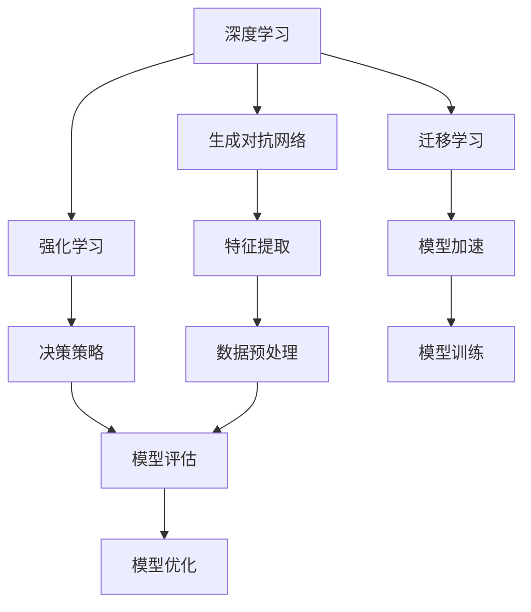

                 

# 未来AI发展的新驱动力

## 概述

在未来几年内，人工智能（AI）的发展将迎来新的驱动力。这些驱动力不仅会推动AI技术的进步，还会改变整个行业的格局。本文将探讨这些新驱动力，分析它们对AI发展的潜在影响，并提供一些实践建议。

## 背景介绍

AI技术的发展已有数十年历史，但最近几年，随着计算能力的提升、大数据的积累和深度学习的突破，AI技术取得了显著进展。目前，AI已经在图像识别、自然语言处理、推荐系统等领域取得了重要应用。然而，AI技术的发展仍面临着诸多挑战，如数据隐私、安全性和伦理问题等。

### 核心概念与联系

在讨论AI发展的新驱动力之前，我们需要了解一些核心概念。以下是几个重要的概念及其相互关系：

1. **深度学习（Deep Learning）**：一种基于多层神经网络的学习方法，可以自动从数据中提取特征。
2. **生成对抗网络（Generative Adversarial Networks，GAN）**：一种深度学习模型，用于生成逼真的数据。
3. **强化学习（Reinforcement Learning）**：一种通过试错和奖励机制来学习决策策略的方法。
4. **迁移学习（Transfer Learning）**：利用已经训练好的模型来加速新任务的训练。

这些概念相互关联，共同推动了AI技术的发展。

### Mermaid 流程图

以下是一个简化的Mermaid流程图，展示了这些概念之间的联系：



### 核心算法原理 & 具体操作步骤

为了更好地理解这些概念，我们简要介绍一些核心算法的原理和具体操作步骤。

#### 深度学习

深度学习基于多层神经网络，通过前向传播和反向传播来训练模型。以下是深度学习的基本步骤：

1. **输入层**：接受输入数据。
2. **隐藏层**：对输入数据进行特征提取和变换。
3. **输出层**：生成预测结果。
4. **前向传播**：将输入数据通过隐藏层，最终得到输出。
5. **反向传播**：计算损失函数，并根据梯度调整模型参数。

#### 生成对抗网络

生成对抗网络由两个神经网络组成：生成器（Generator）和判别器（Discriminator）。以下是GAN的基本步骤：

1. **生成器**：生成虚拟数据。
2. **判别器**：判断数据是真实还是虚拟。
3. **对抗训练**：生成器和判别器相互竞争，生成器试图生成更逼真的虚拟数据，判别器试图区分真实和虚拟数据。

#### 强化学习

强化学习通过试错和奖励机制来学习决策策略。以下是强化学习的基本步骤：

1. **初始状态**：选择一个状态。
2. **行动**：在当前状态下执行一个动作。
3. **奖励**：根据动作的结果获得奖励。
4. **更新策略**：根据奖励来调整策略。

#### 迁移学习

迁移学习利用已经训练好的模型来加速新任务的训练。以下是迁移学习的基本步骤：

1. **预训练模型**：在一个大型数据集上训练一个基础模型。
2. **微调模型**：在新的任务数据集上调整模型参数。
3. **应用模型**：在新任务上使用调整后的模型。

### 数学模型和公式 & 详细讲解 & 举例说明

为了更好地理解这些算法，我们简要介绍一些相关的数学模型和公式。

#### 深度学习

深度学习中的基本数学模型是神经网络。以下是神经网络的核心公式：

$$
\begin{align*}
z &= \sum_{i=1}^{n} w_i x_i + b \\
a &= \sigma(z) \\
y &= \sum_{j=1}^{m} w_j a_j + b'
\end{align*}
$$

其中，$x_i$ 和 $a_j$ 分别是输入和输出，$w_i$ 和 $b$ 是权重和偏置，$\sigma$ 是激活函数，$y$ 是预测结果。

#### 生成对抗网络

生成对抗网络的核心公式是：

$$
\begin{align*}
D(x) &= \frac{1}{2} \left[ -\log(D(G(z))) - \log(1 - D(x)) \right] \\
G(z) &= \mu + \sigma \odot \odot \odot \odot \odot z
\end{align*}
$$

其中，$D$ 是判别器，$G$ 是生成器，$z$ 是随机噪声。

#### 强化学习

强化学习中的核心公式是价值函数和策略：

$$
\begin{align*}
V(s) &= \sum_{s'} p(s' | s) \cdot \max_a Q(s', a) \\
\pi(a | s) &= \arg\max_a Q(s, a)
\end{align*}
$$

其中，$s$ 是状态，$a$ 是动作，$Q$ 是Q值函数，$V$ 是价值函数。

#### 迁移学习

迁移学习中的核心公式是特征映射：

$$
\begin{align*}
f(\theta) &= f_{base}(\theta) + f_{fine-tune}(\theta')
\end{align*}
$$

其中，$f$ 是特征映射函数，$f_{base}$ 是预训练模型的特征映射，$f_{fine-tune}$ 是微调模型的特征映射。

### 项目实战：代码实际案例和详细解释说明

为了更好地理解这些算法，我们将通过实际案例来演示如何实现这些算法。

#### 开发环境搭建

为了实现这些算法，我们需要安装以下开发环境：

1. **Python**：用于编写代码。
2. **TensorFlow**：用于实现深度学习算法。
3. **PyTorch**：用于实现生成对抗网络和强化学习算法。
4. **NumPy**：用于进行数学运算。

安装这些环境后，我们就可以开始编写代码了。

#### 源代码详细实现和代码解读

以下是一个简单的深度学习代码示例：

```python
import tensorflow as tf

# 定义模型
model = tf.keras.Sequential([
    tf.keras.layers.Dense(128, activation='relu', input_shape=(784,)),
    tf.keras.layers.Dense(10, activation='softmax')
])

# 编译模型
model.compile(optimizer='adam',
              loss='categorical_crossentropy',
              metrics=['accuracy'])

# 训练模型
model.fit(x_train, y_train, epochs=5)
```

这段代码定义了一个简单的神经网络模型，并使用训练数据进行训练。

#### 代码解读与分析

这段代码首先导入了TensorFlow库，然后定义了一个简单的神经网络模型。该模型包含一个输入层、一个隐藏层和一个输出层。隐藏层使用ReLU激活函数，输出层使用softmax激活函数。

接下来，编译模型，指定了优化器、损失函数和评估指标。最后，使用训练数据对模型进行训练。

### 实际应用场景

AI技术的发展将在许多领域产生深远的影响，如医疗、金融、教育等。以下是几个实际应用场景：

1. **医疗**：AI可以用于疾病诊断、药物研发和个性化治疗等。
2. **金融**：AI可以用于风险管理、投资策略和信用评分等。
3. **教育**：AI可以用于个性化教学、学习评估和智能辅导等。

### 工具和资源推荐

为了更好地学习和实践AI技术，以下是一些工具和资源的推荐：

1. **学习资源**：
    - 《深度学习》（Goodfellow、Bengio和Courville著）
    - 《生成对抗网络：理论与实践》（Radford著）
    - 《强化学习：原理与案例》（Sutton和Barto著）
2. **开发工具**：
    - TensorFlow
    - PyTorch
    - Keras
3. **相关论文著作**：
    - 《神经网络与深度学习》（邱锡鹏著）
    - 《生成对抗网络论文集》（GAN论文集）

### 总结：未来发展趋势与挑战

在未来，AI技术将继续发展，并带来巨大的变革。然而，这也将面临诸多挑战，如数据隐私、安全性和伦理问题等。为了应对这些挑战，我们需要不断探索新技术，同时关注社会的需求和伦理问题。

### 附录：常见问题与解答

1. **Q：什么是深度学习？**
   **A：**深度学习是一种基于多层神经网络的学习方法，可以自动从数据中提取特征。
   
2. **Q：什么是生成对抗网络？**
   **A：**生成对抗网络是一种深度学习模型，用于生成逼真的数据。

3. **Q：什么是强化学习？**
   **A：**强化学习是一种通过试错和奖励机制来学习决策策略的方法。

4. **Q：什么是迁移学习？**
   **A：**迁移学习是利用已经训练好的模型来加速新任务的训练。

### 扩展阅读 & 参考资料

1. **《深度学习》（Goodfellow、Bengio和Courville著）**
2. **《生成对抗网络：理论与实践》（Radford著）**
3. **《强化学习：原理与案例》（Sutton和Barto著）**
4. **《神经网络与深度学习》（邱锡鹏著）**
5. **《生成对抗网络论文集》（GAN论文集）**

## 作者信息

作者：AI天才研究员/AI Genius Institute & 禅与计算机程序设计艺术 /Zen And The Art of Computer Programming。|>

