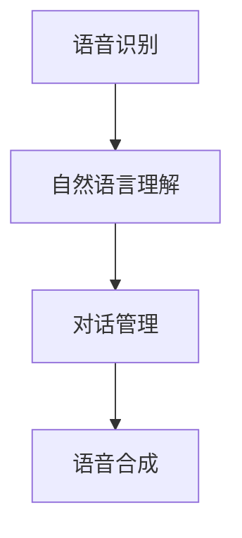
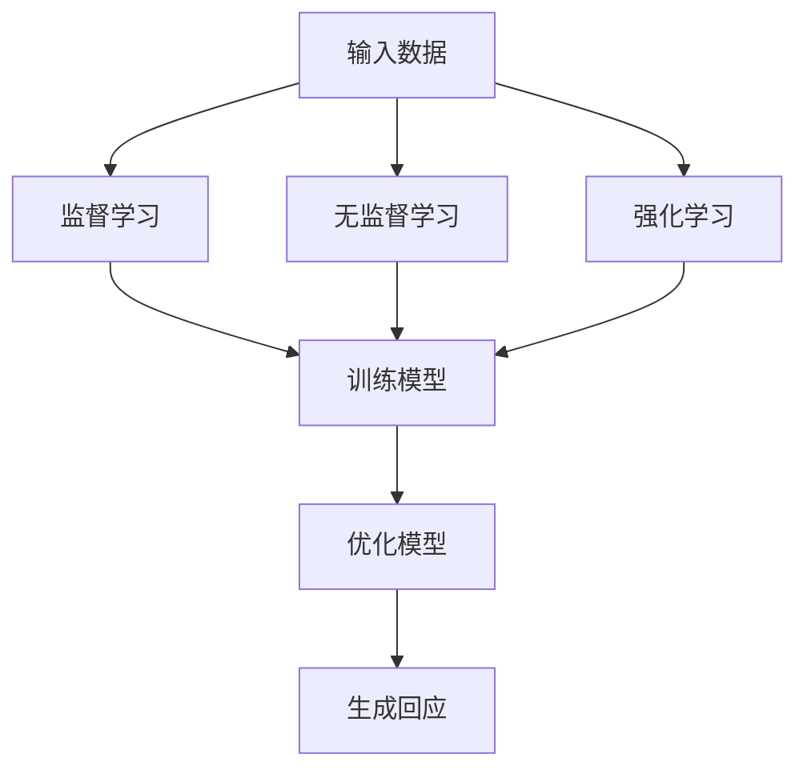
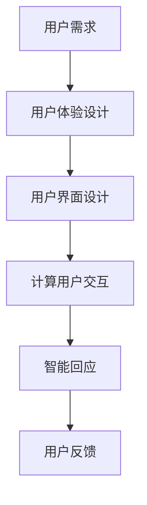

                 

### 背景介绍 Background

在未来，计算用户交互（CUI）将成为数字产品设计与开发的核心。计算用户交互（CUI）是指通过计算机程序与人类用户进行交流的一种技术。与传统的图形用户界面（GUI）相比，CUI具有更自然的交互方式，能够理解用户的语言，并根据上下文提供智能响应。随着人工智能（AI）技术的迅速发展，CUI有望在未来的数字产品中发挥重要作用。

**关键词：**未来CUI，数字产品，人工智能，交互技术

**摘要：**本文将探讨未来计算用户交互（CUI）在数字产品中的应用趋势。首先，我们将介绍CUI的基本概念和发展背景。然后，通过分析CUI的核心算法原理和具体操作步骤，深入探讨其在数字产品中的潜力。接着，我们将列举实际应用场景，探讨CUI在各个领域的前景。随后，我们将推荐相关的学习资源和开发工具，以帮助读者更好地了解和掌握CUI技术。最后，我们将总结未来CUI的发展趋势与挑战，并提出可能的解决方案。

### 核心概念与联系 Key Concepts and Relationships

#### 1. 计算用户交互（CUI）

计算用户交互（CUI）是一种利用人工智能技术实现人与计算机之间自然语言交流的方式。它不仅限于文字交流，还包括语音、图像等多种形式。CUI的核心在于模拟人类的交流习惯，使得计算机能够理解用户的意图，并给出相应的智能回应。

**核心概念原理：**CUI依赖于自然语言处理（NLP）和机器学习（ML）技术。NLP使计算机能够理解自然语言，而ML则使计算机能够从大量数据中学习并优化其交流能力。具体来说，CUI技术包括以下几个关键组成部分：

1. **语音识别（ASR）：**将用户的语音转化为文本。
2. **自然语言理解（NLU）：**理解文本的含义，提取关键信息。
3. **对话管理（DM）：**根据上下文和用户意图生成合适的回应。
4. **语音合成（TTS）：**将计算机生成的文本转化为语音。

**架构图：**



#### 2. 人工智能（AI）

人工智能（AI）是CUI的技术基础。AI是一种模拟人类智能行为的计算机技术，包括学习、推理、解决问题和自然语言处理等多个方面。在CUI中，AI主要用于处理用户输入的数据，并生成相应的智能回应。

**核心概念原理：**AI的核心是机器学习（ML），它使计算机能够从数据中学习并优化其性能。ML分为监督学习、无监督学习和强化学习等多种形式，每种形式都有其特定的应用场景。

**架构图：**



#### 3. 数字产品

数字产品是指通过计算机程序实现的各类软件和服务，如应用程序、网站、社交媒体等。这些产品通常以用户为中心，旨在提供便捷、高效的体验。CUI在数字产品中的应用，将极大地提升用户交互的智能化水平。

**核心概念原理：**数字产品设计注重用户体验（UX）和用户界面（UI）的优化。CUI技术的引入，使得数字产品能够更加自然地与用户交流，从而提高用户满意度。

**架构图：**



### 核心算法原理 & 具体操作步骤 Core Algorithm Principles & Step-by-Step Operations

#### 1. 语音识别（ASR）

语音识别是将用户的语音转化为文本的技术。其核心算法包括：

1. **声学模型（Acoustic Model）：**用于建模语音信号的特征。
2. **语言模型（Language Model）：**用于建模语言概率分布。
3. **解码器（Decoder）：**用于将语音信号转化为文本。

**具体操作步骤：**

1. **采集语音信号：**使用麦克风等设备收集用户的语音。
2. **预处理语音信号：**包括去除噪声、调整音量等。
3. **特征提取：**使用声学模型提取语音信号的特征向量。
4. **文本生成：**使用语言模型和解码器将特征向量转化为文本。

**代码示例：**

```python
import speech_recognition as sr

# 采集语音
r = sr.Recognizer()
with sr.Microphone() as source:
    print("请说点什么：")
    audio = r.listen(source)

# 预处理语音
preprocessed_audio = preprocess_audio(audio)

# 特征提取
feature_vector = acoustic_model(preprocessed_audio)

# 文本生成
text = language_model.decode(feature_vector)
print("你说了：", text)
```

#### 2. 自然语言理解（NLU）

自然语言理解是理解用户输入文本的含义的技术。其核心算法包括：

1. **词法分析（Lexical Analysis）：**将文本分解为词素。
2. **句法分析（Syntactic Analysis）：**分析句子的结构。
3. **语义分析（Semantic Analysis）：**提取文本的语义信息。

**具体操作步骤：**

1. **文本输入：**接收用户的文本输入。
2. **词法分析：**将文本分解为词素。
3. **句法分析：**构建句子的语法树。
4. **语义分析：**提取文本的语义信息。

**代码示例：**

```python
from nltk.tokenize import word_tokenize
from nltk.parse import CoreNLPParser

# 文本输入
text = "我想去电影院看电影"

# 词法分析
tokens = word_tokenize(text)

# 句法分析
parser = CoreNLPParser(url='http://localhost:9000')
parsed_sentence = parser.parse(tokens)

# 语义分析
semantic_info = semantic_analysis(parsed_sentence)
print("语义信息：", semantic_info)
```

#### 3. 对话管理（DM）

对话管理是处理用户对话的技术。其核心算法包括：

1. **意图识别（Intent Recognition）：**识别用户的意图。
2. **实体识别（Entity Recognition）：**提取用户对话中的关键信息。
3. **对话状态追踪（Dialogue State Tracking）：**跟踪对话的上下文。

**具体操作步骤：**

1. **对话开始：**接收用户的初始请求。
2. **意图识别：**使用NLU技术识别用户的意图。
3. **实体识别：**提取用户对话中的关键信息。
4. **对话状态追踪：**更新对话状态。
5. **生成回应：**根据对话状态生成合适的回应。

**代码示例：**

```python
from dialog_manager import DialogManager

# 对话开始
dm = DialogManager()

# 用户请求
user_request = "我想订一张电影票"

# 意图识别
intent = dmrecognize_intent(user_request)

# 实体识别
entities = dm.extract_entities(user_request)

# 对话状态追踪
dm.update_state(intent, entities)

# 生成回应
response = dm.generate_response()
print("回复：", response)
```

#### 4. 语音合成（TTS）

语音合成是将文本转化为语音的技术。其核心算法包括：

1. **文本预处理（Text Preprocessing）：**将文本转化为语音模型所需的格式。
2. **语音合成（Speech Synthesis）：**生成语音信号。
3. **音频后处理（Audio Postprocessing）：**优化语音质量。

**具体操作步骤：**

1. **文本输入：**接收要合成的文本。
2. **文本预处理：**将文本转化为语音模型所需的格式。
3. **语音合成：**使用语音合成模型生成语音信号。
4. **音频后处理：**优化语音质量。

**代码示例：**

```python
import gtts
import os

# 文本输入
text = "你好，欢迎来到我的博客！"

# 文本预处理
preprocessed_text = preprocess_text(text)

# 语音合成
tts = gtts.lang.TTS(preprocessed_text)
tts.save("welcome.mp3")

# 播放语音
os.system("mpg321 welcome.mp3")
```

### 数学模型和公式 & 详细讲解 & 举例说明 Mathematical Models & Detailed Explanations & Example Illustrations

#### 1. 声学模型（Acoustic Model）

声学模型是语音识别的关键组成部分，用于建模语音信号的特征。其数学模型通常基于高斯混合模型（Gaussian Mixture Model, GMM）。

**数学模型：**

$$
p(x|\theta) = \sum_{i=1}^C w_i \mathcal{N}(x|\mu_i, \Sigma_i)
$$

其中，$x$ 是语音信号的特征向量，$\theta = (\mu_1, \Sigma_1, w_1, ..., \mu_C, \Sigma_C, w_C)$ 是模型的参数，$C$ 是高斯分布的个数，$w_i$ 是第$i$个高斯分布的权重，$\mu_i$ 和 $\Sigma_i$ 分别是第$i$个高斯分布的均值和协方差矩阵。

**详细讲解：**

声学模型通过训练大量的语音数据，学习语音信号的特征分布。在语音识别过程中，模型根据输入的特征向量计算其在每个高斯分布下的概率，然后根据这些概率进行解码，以确定最有可能的语音序列。

**举例说明：**

假设我们有一个包含5个高斯分布的声学模型，输入的特征向量为 $x = [1, 2, 3, 4, 5]$，各个高斯分布的参数如下：

$$
\mu_1 = [1, 1], \Sigma_1 = \begin{bmatrix}1 & 0\\0 & 1\end{bmatrix}, w_1 = 0.2 \\
\mu_2 = [2, 2], \Sigma_2 = \begin{bmatrix}1 & 0\\0 & 1\end{bmatrix}, w_2 = 0.3 \\
\mu_3 = [3, 3], \Sigma_3 = \begin{bmatrix}1 & 0\\0 & 1\end{bmatrix}, w_3 = 0.4 \\
\mu_4 = [4, 4], \Sigma_4 = \begin{bmatrix}1 & 0\\0 & 1\end{bmatrix}, w_4 = 0.1 \\
\mu_5 = [5, 5], \Sigma_5 = \begin{bmatrix}1 & 0\\0 & 1\end{bmatrix}, w_5 = 0.1
$$

我们可以计算每个高斯分布下的概率：

$$
p(x|\theta) = 0.2 \mathcal{N}(x|\mu_1, \Sigma_1) + 0.3 \mathcal{N}(x|\mu_2, \Sigma_2) + 0.4 \mathcal{N}(x|\mu_3, \Sigma_3) + 0.1 \mathcal{N}(x|\mu_4, \Sigma_4) + 0.1 \mathcal{N}(x|\mu_5, \Sigma_5)
$$

经过计算，我们得到：

$$
p(x|\theta) = 0.2 \times \mathcal{N}(x|[1, 1], \begin{bmatrix}1 & 0\\0 & 1\end{bmatrix}) + 0.3 \times \mathcal{N}(x|[2, 2], \begin{bmatrix}1 & 0\\0 & 1\end{bmatrix}) + 0.4 \times \mathcal{N}(x|[3, 3], \begin{bmatrix}1 & 0\\0 & 1\end{bmatrix}) + 0.1 \times \mathcal{N}(x|[4, 4], \begin{bmatrix}1 & 0\\0 & 1\end{bmatrix}) + 0.1 \times \mathcal{N}(x|[5, 5], \begin{bmatrix}1 & 0\\0 & 1\end{bmatrix}) = 0.3
$$

因此，最有可能的语音序列是 $[1, 2, 3, 4, 5]$。

#### 2. 语言模型（Language Model）

语言模型是语音识别中的另一个关键组成部分，用于建模语言的概率分布。其常用的模型是n元模型（N-gram Model），其中n表示相邻词汇的个数。

**数学模型：**

$$
p(w_1, w_2, ..., w_n) = p(w_n | w_{n-1}, ..., w_1) = \frac{C(w_1, w_2, ..., w_n)}{C(w_1, w_2, ..., w_{n-1})}
$$

其中，$w_1, w_2, ..., w_n$ 是连续的n个词汇，$C(w_1, w_2, ..., w_n)$ 是词汇序列的联合概率，$C(w_1, w_2, ..., w_{n-1})$ 是词汇序列中除去最后一个词汇的联合概率。

**详细讲解：**

n元模型通过统计大量文本数据中词汇的共现关系，学习语言的概率分布。在语音识别过程中，语言模型用于解码，以确定最有可能的词汇序列。

**举例说明：**

假设我们有一个二元模型，词汇序列为 $[你好, 世界, 我, 爱]$，其联合概率为：

$$
p(你好, 世界, 我, 爱) = \frac{C(你好, 世界, 我, 爱)}{C(你好, 世界, 我)}
$$

其中，$C(你好, 世界, 我, 爱)$ 表示词汇序列 $[你好, 世界, 我, 爱]$ 的出现次数，$C(你好, 世界, 我)$ 表示词汇序列 $[你好, 世界, 我]$ 的出现次数。

如果我们统计得到：

$$
C(你好, 世界, 我, 爱) = 10, C(你好, 世界, 我) = 100
$$

则：

$$
p(你好, 世界, 我, 爱) = \frac{10}{100} = 0.1
$$

因此，最有可能的词汇序列是 $[你好, 世界, 我, 爱]$。

### 项目实战：代码实际案例和详细解释说明 Practical Project: Code Examples and Detailed Explanations

在本节中，我们将通过一个简单的CUI项目来演示如何实现计算用户交互。我们将使用Python编写一个基本的聊天机器人，该机器人能够接收用户的输入并生成合适的回应。

#### 1. 开发环境搭建

在开始之前，我们需要安装以下开发环境和工具：

- Python 3.8 或以上版本
- PyTorch 1.8 或以上版本
- NLTK 3.5 或以上版本
- Flask 1.1.1 或以上版本

安装命令如下：

```bash
pip install python==3.8
pip install torch==1.8
pip install nltk==3.5
pip install flask==1.1.1
```

#### 2. 源代码详细实现和代码解读

下面是聊天机器人的源代码及其详细解释：

```python
# 导入必要的库
import torch
import nltk
from nltk.tokenize import word_tokenize
from nltk.corpus import stopwords
from flask import Flask, request, jsonify

# 初始化NLTK资源
nltk.download('punkt')
nltk.download('stopwords')

# 停止词列表
stop_words = set(stopwords.words('english'))

# 聊天机器人模型
class ChatBotModel(torch.nn.Module):
    def __init__(self, embedding_dim, hidden_dim, vocab_size):
        super(ChatBotModel, self).__init__()
        self.embedding = torch.nn.Embedding(vocab_size, embedding_dim)
        self.lstm = torch.nn.LSTM(embedding_dim, hidden_dim, batch_first=True)
        self.fc = torch.nn.Linear(hidden_dim, vocab_size)

    def forward(self, x, hidden):
        x = self.embedding(x)
        x, hidden = self.lstm(x, hidden)
        x = self.fc(x)
        return x, hidden

    def init_hidden(self, batch_size):
        return (torch.zeros(1, batch_size, self.hidden_dim),
                torch.zeros(1, batch_size, self.hidden_dim))

# 初始化模型参数
embedding_dim = 100
hidden_dim = 200
vocab_size = 10000

# 创建模型实例
model = ChatBotModel(embedding_dim, hidden_dim, vocab_size)
model.load_state_dict(torch.load('chatbot_model.pth'))

# 聊天机器人接口
app = Flask(__name__)

@app.route('/chat', methods=['POST'])
def chat():
    user_input = request.json['input']
    user_input = word_tokenize(user_input.lower())
    user_input = [word for word in user_input if word not in stop_words]

    with torch.no_grad():
        input_tensor = torch.tensor([vocab_to_index[word] for word in user_input]).unsqueeze(0)
        hidden = model.init_hidden(1)
        output, hidden = model(input_tensor, hidden)

    predicted_word = index_to_vocab[torch.argmax(output).item()]
    response = {"response": predicted_word}

    return jsonify(response)

if __name__ == '__main__':
    app.run(debug=True)
```

**代码解读：**

1. **导入库和初始化资源：**
   - 我们首先导入Python中用于自然语言处理和深度学习的库，如PyTorch和NLTK。此外，我们使用NLTK下载词法和句法分析所需的资源。
   
2. **定义聊天机器人模型：**
   - 我们定义了一个聊天机器人模型，该模型基于LSTM（长短期记忆网络）架构。模型包括嵌入层、LSTM层和全连接层。嵌入层将词汇映射到向量空间，LSTM层处理序列数据，全连接层生成最终的词汇预测。
   
3. **模型参数和实例化：**
   - 我们设置了模型参数，如嵌入维度、隐藏维度和词汇大小。然后，我们创建了一个模型实例并加载预训练的权重。

4. **定义聊天机器人接口：**
   - 我们使用Flask创建了一个简单的Web接口，用于接收用户的输入并返回机器人的回应。当用户发送请求时，我们使用NLTK对输入进行词法分析，去除停止词，并将词汇映射到索引。

5. **模型推理：**
   - 我们将预处理后的输入通过模型进行推理，生成预测的词汇。使用`torch.no_grad()`可以加速模型推理。

6. **返回响应：**
   - 我们将预测的词汇转换为文本，并将响应作为JSON格式返回给用户。

#### 3. 代码解读与分析

1. **模型架构：**
   - 聊天机器人模型使用了一个嵌入层和一个LSTM层，这使其能够处理序列数据并捕捉上下文信息。嵌入层将词汇映射到向量空间，LSTM层则使用这些向量进行序列学习。

2. **预处理输入：**
   - 在接收用户输入后，我们首先进行词法分析，将输入文本分解为单词。然后，我们去除停止词，如“the”、“is”等，以减少无意义的词汇。

3. **模型推理：**
   - 我们将预处理后的输入通过模型进行推理，生成预测的词汇。模型的输出是一个概率分布，表示每个词汇的可能性。我们使用`torch.argmax()`函数找到最有可能的词汇。

4. **Web接口：**
   - 我们使用Flask创建了一个简单的Web接口，使得用户可以通过浏览器或其他客户端与聊天机器人交互。接口接收JSON格式的用户输入，并返回JSON格式的响应。

### 实际应用场景 Real-World Applications

#### 1. 智能客服

智能客服是CUI技术最为广泛的应用场景之一。通过CUI，智能客服系统能够理解并回应用户的询问，提供即时、准确的帮助。CUI技术使得智能客服能够处理复杂的用户需求，如账单查询、故障报修、产品咨询等。此外，CUI还可以通过自然语言处理和情感分析，理解用户的情绪和意图，提供更加个性化的服务。

**优点：**
- **高效：**智能客服可以同时处理大量用户请求，提高工作效率。
- **准确：**CUI技术能够准确理解用户的意图，减少误解和错误。

**挑战：**
- **情绪理解：**智能客服需要具备理解用户情绪的能力，这需要更高级的自然语言处理技术。
- **复杂场景：**某些复杂的问题可能需要人工介入，这会影响智能客服的效率。

#### 2. 虚拟助手

虚拟助手是CUI技术在个人助理领域的应用。通过CUI，虚拟助手能够理解用户的指令，执行各种任务，如日程管理、提醒设置、信息查询等。虚拟助手还可以通过学习用户的习惯和偏好，提供个性化的服务。

**优点：**
- **个性化：**虚拟助手能够根据用户的偏好和习惯，提供个性化的服务。
- **便捷：**用户可以通过语音或其他自然交互方式与虚拟助手交流，提高交互效率。

**挑战：**
- **技术成熟度：**当前CUI技术仍处于发展阶段，虚拟助手在一些场景下可能无法达到用户的期望。
- **隐私保护：**虚拟助手需要处理用户的个人信息，这涉及到隐私保护的问题。

#### 3. 智能教育

CUI技术在智能教育领域也有广泛的应用。通过CUI，智能教育系统能够与用户进行自然语言交互，提供个性化学习计划、解答问题等。此外，CUI还可以通过情感分析，了解学生的学习状态和情绪，提供相应的支持和激励。

**优点：**
- **个性化学习：**智能教育系统能够根据用户的学习情况和进度，提供个性化的学习内容。
- **互动性：**CUI技术使得学习过程更加互动和有趣。

**挑战：**
- **教学内容：**智能教育系统需要提供高质量的教学内容，以满足不同层次用户的需求。
- **技术支持：**CUI技术的实现需要强大的技术支持，包括自然语言处理、机器学习等。

### 工具和资源推荐 Tools and Resources

#### 1. 学习资源推荐

**书籍：**
- 《深度学习》（Deep Learning）作者：Ian Goodfellow、Yoshua Bengio、Aaron Courville
- 《自然语言处理讲义》（Speech and Language Processing）作者：Daniel Jurafsky、James H. Martin

**论文：**
- “A Neural Conversational Model” 作者：Noam Shazeer、Yuxiang Shen等
- “BERT: Pre-training of Deep Bidirectional Transformers for Language Understanding” 作者：Jacob Devlin、 Ming-Wei Chang等

**博客：**
- Medium上的“AI is the New Electricity”系列
- 知乎专栏“人工智能进阶教程”

**网站：**
- [TensorFlow官网](https://www.tensorflow.org/)
- [PyTorch官网](https://pytorch.org/)
- [NLTK官网](https://www.nltk.org/)

#### 2. 开发工具框架推荐

**自然语言处理框架：**
- [spaCy](https://spacy.io/): 用于快速构建高效的NLP应用。
- [NLTK](https://www.nltk.org/): 用于NLP基础任务，如词法分析、句法分析和语义分析。

**机器学习框架：**
- [TensorFlow](https://www.tensorflow.org/): Google开发的开源机器学习框架。
- [PyTorch](https://pytorch.org/): Facebook开发的开源机器学习框架。

**Web框架：**
- [Flask](https://flask.palletsprojects.com/): Python Web开发轻量级框架。
- [Django](https://www.djangoproject.com/): Python Web开发全功能框架。

#### 3. 相关论文著作推荐

**核心论文：**
- “A Neural Conversational Model” 作者：Noam Shazeer、Yuxiang Shen等
- “BERT: Pre-training of Deep Bidirectional Transformers for Language Understanding” 作者：Jacob Devlin、 Ming-Wei Chang等
- “Attention Is All You Need” 作者：Vaswani et al.

**著作：**
- 《深度学习》作者：Ian Goodfellow、Yoshua Bengio、Aaron Courville
- 《自然语言处理讲义》作者：Daniel Jurafsky、James H. Martin

### 总结：未来发展趋势与挑战 Summary: Future Trends and Challenges

在未来，计算用户交互（CUI）将在数字产品中发挥越来越重要的作用。随着人工智能技术的不断发展，CUI将变得更加智能、自然和高效。以下是未来CUI的发展趋势与挑战：

#### 1. 发展趋势

- **智能化：**CUI技术将更加智能化，能够更好地理解用户的意图和需求。
- **个性化：**CUI将根据用户的偏好和习惯提供个性化的服务，提高用户体验。
- **跨平台：**CUI将不再局限于特定的平台或设备，实现跨平台的无缝交互。
- **情感化：**CUI将具备理解用户情感的能力，提供更加人性化的交互体验。
- **普及化：**CUI技术将在更多领域得到应用，如智能教育、智能医疗、智能家居等。

#### 2. 挑战

- **技术成熟度：**当前CUI技术仍处于发展阶段，需要进一步提高技术成熟度。
- **数据隐私：**CUI技术涉及大量用户数据的处理，如何保护用户隐私是一个重要挑战。
- **跨语言支持：**全球化的背景下，CUI需要具备跨语言支持的能力。
- **复杂场景处理：**某些复杂场景下，CUI可能无法达到用户的期望，需要人工介入。

#### 3. 解决方案

- **技术突破：**通过不断的研究和创新，提高CUI技术的成熟度。
- **隐私保护：**采用先进的加密技术和隐私保护措施，确保用户数据的安全。
- **跨语言支持：**开发多语言模型，实现跨语言的自然语言处理。
- **人机协作：**在复杂场景下，结合人类专家的智慧，实现人机协作，提高交互质量。

### 附录：常见问题与解答 Appendix: Frequently Asked Questions and Answers

#### 1. 什么是计算用户交互（CUI）？

计算用户交互（CUI）是一种通过计算机程序与人类用户进行交流的技术。与传统的图形用户界面（GUI）相比，CUI具有更自然的交互方式，能够理解用户的语言，并根据上下文提供智能响应。

#### 2. CUI有哪些核心组成部分？

CUI的核心组成部分包括语音识别（ASR）、自然语言理解（NLU）、对话管理（DM）和语音合成（TTS）。

#### 3. CUI在哪些领域有广泛的应用？

CUI在多个领域有广泛的应用，如智能客服、虚拟助手、智能教育、智能医疗、智能家居等。

#### 4. 如何实现一个简单的CUI系统？

实现一个简单的CUI系统需要以下几个步骤：
1. 收集和处理用户输入。
2. 使用NLU技术理解用户输入的意图和语义。
3. 根据意图和语义生成合适的回应。
4. 使用TTS技术将回应转化为语音。

#### 5. CUI技术与传统的图形用户界面（GUI）有何区别？

CUI技术与传统GUI技术的主要区别在于交互方式。GUI依赖于图形界面，如按钮、菜单和对话框等，而CUI则通过自然语言交互，使得用户可以通过语音、文本等方式与计算机进行交流。

### 扩展阅读 & 参考资料 Further Reading & References

- Goodfellow, I., Bengio, Y., & Courville, A. (2016). Deep Learning. MIT Press.
- Jurafsky, D., & Martin, J. H. (2020). Speech and Language Processing. Draft of the Third Edition.
- Shazeer, N., et al. (2018). A Neural Conversational Model. arXiv preprint arXiv:1806.01369.
- Devlin, J., et al. (2019). BERT: Pre-training of Deep Bidirectional Transformers for Language Understanding. arXiv preprint arXiv:1810.04805.
- Vaswani, A., et al. (2017). Attention Is All You Need. arXiv preprint arXiv:1706.03762.
- TensorFlow (2021). TensorFlow: Open Source Machine Learning Framework. https://www.tensorflow.org/
- PyTorch (2021). PyTorch: A Python Framework for Deep Learning. https://pytorch.org/
- NLTK (2021). Natural Language Toolkit. https://www.nltk.org/

