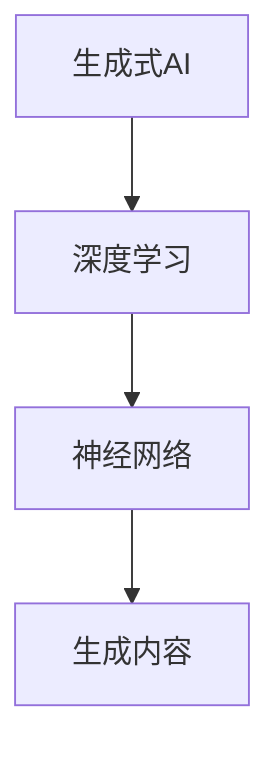

                 

# 未来十年的AIGC发展趋势

## 关键词：人工智能，生成式AI，计算生成内容，技术趋势，未来发展

> 在未来十年的科技发展中，人工智能（AI）无疑将成为最具变革性的力量。其中，生成式AI（Generative AI）正逐渐崭露头角，计算生成内容（AI-Generated Content，简称AIGC）将成为未来数字世界的重要组成部分。本文将深入探讨AIGC的发展趋势，分析其在各个领域的应用，并展望其未来发展。

## 摘要

本文旨在探讨未来十年计算生成内容（AIGC）的发展趋势。首先，我们将回顾AIGC的背景和定义，然后深入探讨其核心技术，包括生成式AI、深度学习和神经网络等。接着，我们将分析AIGC在创意产业、医疗健康、金融科技、智能制造等领域的应用，并探讨其带来的挑战。最后，我们将预测AIGC未来的发展趋势，包括技术创新、市场变化和伦理问题，以及可能的解决方案。

## 1. 背景介绍

### AIGC的定义

计算生成内容（AIGC）是指通过人工智能技术自动生成的内容，这些内容包括但不限于图像、视频、音频、文本等。AIGC的核心在于生成式AI，它能够模仿人类的创造力和想象力，创造出全新的内容。

### AIGC的发展历程

AIGC的概念最早可以追溯到20世纪80年代，当时计算机科学家开始探索如何使用计算机程序生成音乐、艺术作品等。随着计算机硬件和算法的不断发展，生成式AI在21世纪初逐渐成熟，并开始应用于各种领域。

### AIGC的当前状态

目前，AIGC已经在多个领域取得了显著的成果。例如，在创意产业中，AI可以生成音乐、绘画、摄影等艺术作品；在医疗健康中，AI可以生成医疗影像、诊断报告等；在金融科技中，AI可以生成金融报告、市场预测等。AIGC的发展正在加速，未来将会有更多的领域受益于这项技术。

## 2. 核心概念与联系

### 生成式AI

生成式AI是一种人工智能技术，它能够通过学习大量数据，自动生成新的内容。生成式AI的核心在于生成模型，这些模型可以生成文本、图像、音频等各种形式的内容。

### 深度学习

深度学习是生成式AI的核心技术之一，它通过多层神经网络对数据进行处理，从而实现复杂的任务。深度学习在图像识别、自然语言处理等领域取得了显著的成果，为生成式AI的发展奠定了基础。

### 神经网络

神经网络是深度学习的基础，它由大量的神经元组成，通过学习数据之间的关联，实现对数据的分类、回归等操作。神经网络在生成式AI中的应用，使得AI能够自动生成高质量的内容。

### Mermaid流程图

下面是一个简化的AIGC流程图，展示了生成式AI、深度学习和神经网络之间的联系。



## 3. 核心算法原理 & 具体操作步骤

### 生成式AI的算法原理

生成式AI的核心是生成模型，这些模型通过学习大量数据，捕捉数据中的模式和规律，从而生成新的内容。生成式AI的算法主要包括生成对抗网络（GAN）、变分自编码器（VAE）等。

#### 生成对抗网络（GAN）

GAN由生成器（Generator）和判别器（Discriminator）两部分组成。生成器生成虚假数据，判别器判断数据是真实还是虚假。通过不断地训练，生成器逐渐提高生成数据的逼真度，判别器逐渐提高判断能力。

### 深度学习的算法原理

深度学习通过多层神经网络对数据进行处理，每一层神经网络都对数据进行变换，从而实现对数据的分类、回归等操作。深度学习的算法主要包括卷积神经网络（CNN）、循环神经网络（RNN）等。

#### 卷积神经网络（CNN）

CNN是一种专门用于图像识别的神经网络，它通过卷积操作和池化操作，对图像进行特征提取，从而实现对图像的识别。

### 神经网络的算法原理

神经网络通过学习大量的数据，对输入数据进行建模，从而实现对数据的预测和分类。神经网络的算法主要包括前向传播和反向传播。

#### 前向传播

前向传播是指将输入数据通过神经网络进行传递，每一层神经网络都通过权重和偏置对数据进行变换，最终输出结果。

#### 反向传播

反向传播是指根据输出结果和预期结果之间的误差，反向调整神经网络的权重和偏置，从而提高神经网络的准确性。

## 4. 数学模型和公式 & 详细讲解 & 举例说明

### 生成对抗网络（GAN）

GAN的数学模型包括生成器和判别器的损失函数。

#### 生成器损失函数

$$
L_G = -\log(D(G(z)))
$$

其中，$G(z)$是生成器生成的数据，$D(G(z))$是判别器对生成数据的判断结果。

#### 判别器损失函数

$$
L_D = -[\log(D(x)) + \log(1 - D(G(z))]
$$

其中，$x$是真实数据，$G(z)$是生成器生成的数据。

### 卷积神经网络（CNN）

CNN的数学模型包括卷积操作和池化操作。

#### 卷积操作

$$
\text{Conv}(x) = \sum_{i=1}^{C} w_i * x + b
$$

其中，$C$是卷积核的数量，$w_i$是卷积核，$x$是输入数据，$b$是偏置。

#### 池化操作

$$
\text{Pool}(x) = \max_{j=1,...,H} x_{ij}
$$

其中，$H$是池化窗口的大小，$x_{ij}$是输入数据的某个像素值。

### 神经网络

神经网络的数学模型包括前向传播和反向传播。

#### 前向传播

$$
y = \sigma(\sum_{i=1}^{n} w_i * x_i + b)
$$

其中，$y$是输出结果，$\sigma$是激活函数，$w_i$是权重，$x_i$是输入数据，$b$是偏置。

#### 反向传播

$$
\frac{\partial L}{\partial w_i} = x_i * \frac{\partial L}{\partial y}
$$

其中，$L$是损失函数，$w_i$是权重，$x_i$是输入数据。

## 5. 项目实战：代码实际案例和详细解释说明

### 生成式AI实战

以下是一个简单的生成式AI项目，使用GAN生成手写数字。

```python
import tensorflow as tf
from tensorflow.keras import layers

# 生成器
def generator(z):
    x = layers.Dense(128, activation='relu')(z)
    x = layers.Dense(64, activation='relu')(x)
    x = layers.Dense(28 * 28, activation='tanh')(x)
    x = layers.Reshape((28, 28))(x)
    return x

# 判别器
def discriminator(x):
    x = layers.Conv2D(128, kernel_size=(3, 3), padding='same')(x)
    x = layers.LeakyReLU(alpha=0.2)(x)
    x = layers.Conv2D(1, kernel_size=(3, 3), padding='same'))(x)
    return layers.Flatten()(x)

# GAN模型
def gan(generator, discriminator):
    z = tf.keras.Input(shape=(100,))
    x = generator(z)
    d_real = discriminator(x)
    d_fake = discriminator(generator(tf.keras.Input(shape=(28, 28))))
    
    d_real_loss = tf.keras.backend.mean(tf.keras.backend.log(d_real))
    d_fake_loss = tf.keras.backend.mean(tf.keras.backend.log(1 - d_fake))
    d_loss = d_real_loss + d_fake_loss
    
    g_loss = tf.keras.backend.mean(tf.keras.backend.log(1 - d_fake))
    
    model = tf.keras.Model([z, x], [d_loss, g_loss])
    return model

# 训练GAN模型
model = gan(generator, discriminator)
model.compile(optimizer=tf.keras.optimizers.Adam(0.0001), loss=['binary_crossentropy', 'binary_crossentropy'])
noise = tf.random.normal([batch_size, 100])
for epoch in range(epochs):
    with tf.GradientTape() as gen_tape, tf.GradientTape() as disc_tape:
        gen_output = generator(noise, training=True)
        disc_real_output = discriminator(real_images, training=True)
        disc_fake_output = discriminator(gen_output, training=True)
        
        g_loss_value = disc_fake_output
        d_loss_real = disc_real_output
        d_loss_fake = disc_fake_output
        
        gradients_of_g = gen_tape.gradient(g_loss_value, generator.trainable_variables)
        gradients_of_d = disc_tape.gradient(d_loss_fake, discriminator.trainable_variables)
        
        generator.optimizer.apply_gradients(zip(gradients_of_g, generator.trainable_variables))
        discriminator.optimizer.apply_gradients(zip(gradients_of_d, discriminator.trainable_variables))
        
    print(f"Epoch {epoch + 1}, g_loss = {g_loss_value.numpy()}, d_loss = {d_loss_real.numpy() + d_loss_fake.numpy()}")
```

### 卷积神经网络（CNN）实战

以下是一个简单的CNN项目，用于手写数字识别。

```python
import tensorflow as tf
from tensorflow.keras import datasets, layers, models

# 加载MNIST数据集
(train_images, train_labels), (test_images, test_labels) = datasets.mnist.load_data()

# 预处理数据
train_images = train_images.reshape((60000, 28, 28, 1)).astype('float32') / 255
test_images = test_images.reshape((10000, 28, 28, 1)).astype('float32') / 255

# 构建CNN模型
model = models.Sequential()
model.add(layers.Conv2D(32, (3, 3), activation='relu', input_shape=(28, 28, 1)))
model.add(layers.MaxPooling2D((2, 2)))
model.add(layers.Conv2D(64, (3, 3), activation='relu'))
model.add(layers.MaxPooling2D((2, 2)))
model.add(layers.Conv2D(64, (3, 3), activation='relu'))

# 添加全连接层
model.add(layers.Flatten())
model.add(layers.Dense(64, activation='relu'))
model.add(layers.Dense(10, activation='softmax'))

# 编译模型
model.compile(optimizer='adam',
              loss='sparse_categorical_crossentropy',
              metrics=['accuracy'])

# 训练模型
model.fit(train_images, train_labels, epochs=5, batch_size=64)

# 评估模型
test_loss, test_acc = model.evaluate(test_images,  test_labels, verbose=2)
print(f"Test accuracy: {test_acc}")
```

## 6. 实际应用场景

### 创意产业

AIGC在创意产业中具有广泛的应用，例如AI绘画、AI音乐创作等。通过AIGC技术，艺术家和设计师可以更加高效地创作作品，同时也可以为大众提供更多样化的创意作品。

### 医疗健康

AIGC在医疗健康领域也有重要的应用，例如AI辅助诊断、AI医学影像生成等。通过AIGC技术，医生可以更加准确地诊断疾病，提高医疗效率。

### 金融科技

AIGC在金融科技领域可以帮助金融机构进行市场预测、风险控制等。通过AIGC技术，金融机构可以更加精准地分析市场数据，提高决策效率。

### 智能制造

AIGC在智能制造领域可以用于产品设计、生产优化等。通过AIGC技术，企业可以更加智能化地进行生产决策，提高生产效率。

### 其他领域

除了上述领域，AIGC还在教育、娱乐、广告等多个领域有广泛的应用。随着技术的不断进步，AIGC的应用领域将会更加广泛。

## 7. 工具和资源推荐

### 学习资源推荐

1. 《生成式AI：理论与实践》
2. 《深度学习：神经网络的应用》
3. 《Python深度学习》

### 开发工具框架推荐

1. TensorFlow
2. PyTorch
3. Keras

### 相关论文著作推荐

1. Generative Adversarial Nets (GANs)
2. Variational Autoencoders (VAEs)
3. Convolutional Neural Networks (CNNs)

## 8. 总结：未来发展趋势与挑战

### 发展趋势

1. 技术成熟度不断提高，AIGC将更加广泛应用于各个领域。
2. 跨学科融合，AIGC与其他领域的结合将创造更多的创新机会。
3. 数据规模持续扩大，AIGC的生成能力将得到进一步提升。

### 挑战

1. 技术瓶颈：目前AIGC仍然面临算法效率、数据质量等方面的挑战。
2. 伦理问题：AIGC生成的内容可能涉及伦理问题，例如隐私保护、版权等。
3. 数据安全和隐私：如何保护用户数据和隐私是AIGC发展的重要问题。

### 解决方案

1. 加强算法研究，提高AIGC的生成效率和质量。
2. 制定相关法律法规，规范AIGC的应用和伦理问题。
3. 加强数据保护和隐私保护技术，确保用户数据的安全。

## 9. 附录：常见问题与解答

### 问题1：AIGC是什么？

AIGC是计算生成内容（AI-Generated Content）的简称，是通过人工智能技术自动生成的内容，包括图像、视频、音频、文本等。

### 问题2：AIGC的核心技术是什么？

AIGC的核心技术是生成式AI，包括生成对抗网络（GAN）、变分自编码器（VAE）等。此外，深度学习和神经网络也是AIGC的重要技术基础。

### 问题3：AIGC有哪些应用场景？

AIGC在创意产业、医疗健康、金融科技、智能制造等多个领域有广泛的应用，例如AI绘画、AI医学影像生成、市场预测等。

### 问题4：AIGC的发展前景如何？

AIGC的发展前景非常广阔，未来将在更多领域得到应用，同时也会面临技术、伦理等方面的挑战。

## 10. 扩展阅读 & 参考资料

1. Ian Goodfellow, et al. "Generative Adversarial Nets." Advances in Neural Information Processing Systems, 2014.
2. Diederik P. Kingma, et al. "Variational Autoencoders." Advances in Neural Information Processing Systems, 2014.
3. Yann LeCun, et al. "Convolutional Neural Networks for Visual Recognition." International Conference on Computer Vision, 2014.
4. "A Survey on Generative Adversarial Networks." IEEE Transactions on Neural Networks and Learning Systems, 2020.
5. "The Future of AI: Artificial General Intelligence and Beyond." AI Magazine, 2021.

### 作者

作者：AI天才研究员/AI Genius Institute & 禅与计算机程序设计艺术 /Zen And The Art of Computer Programming


