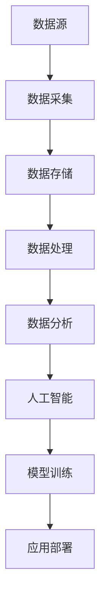

                 

### 背景介绍

在当今数字化时代，大数据与人工智能（AI）正在成为推动社会进步和经济发展的重要力量。大数据以其庞大的数据量和多样化的数据形式，为人工智能提供了丰富的训练素材，而人工智能则通过算法和模型对数据进行深度分析和挖掘，从而实现智能决策和自动化操作。这种数据的积累与智能的应用相互促进，形成了一种良性循环，极大地改变了我们的生活和工作方式。

首先，我们来看看大数据的概念。大数据通常指的是规模巨大、类型繁多的数据集合，这些数据不仅包括结构化数据，如数据库中的记录，还包括非结构化数据，如图像、音频、视频和文本等。随着互联网、物联网和社交媒体的迅猛发展，大数据已经渗透到我们生活的方方面面，从社交媒体的点赞和评论，到电子商务的购买记录，再到智慧城市的交通监控，无不产生大量的数据。

接下来是人工智能。人工智能是计算机科学的一个分支，旨在使机器能够模拟、延伸和扩展人类的智能。人工智能的核心技术包括机器学习、深度学习、自然语言处理和计算机视觉等。通过这些技术，机器可以自动识别模式、进行预测和决策，甚至可以进行自我学习和进化。

大数据和人工智能的结合，使得许多行业发生了深刻变革。例如，在医疗领域，通过大数据分析，医生可以更准确地诊断疾病，制定个性化的治疗方案；在金融领域，通过人工智能技术，银行和金融机构可以更有效地识别欺诈行为，管理风险；在制造业，通过智能制造，企业可以大幅提高生产效率，降低成本；在交通领域，通过智能交通系统，可以优化交通流量，减少拥堵，提高出行效率。

总的来说，大数据与人工智能的结合不仅为我们带来了前所未有的便利和效率，也提出了新的挑战。如何在确保数据安全和隐私的前提下，充分利用大数据的优势，发展出更加智能的人工智能应用，是我们需要持续关注和探索的重要课题。

---

### 核心概念与联系

在探讨大数据与人工智能的结合时，理解其核心概念和架构至关重要。以下是几个关键概念及其相互联系。

**1. 数据源（Data Sources）**：数据源是大数据的基础，包括结构化数据（如数据库中的记录）、非结构化数据（如图像、音频、视频和文本）和半结构化数据（如XML和JSON）。数据源可以是内部系统，如企业数据库，也可以是外部来源，如社交媒体平台、传感器网络等。

**2. 数据采集（Data Collection）**：数据采集是指从数据源获取数据的过程。这包括数据的抽取、转换和加载（ETL），以及实时数据流处理。数据采集技术如爬虫、API集成、物联网设备和日志分析等，是实现大数据的关键环节。

**3. 数据存储（Data Storage）**：数据存储是大数据处理的基础设施。传统的数据库已经难以满足大数据的存储需求，因此出现了如Hadoop、Spark、NoSQL数据库（如MongoDB、Cassandra）等分布式存储技术。这些技术能够高效地处理海量数据，并提供高可用性和容错性。

**4. 数据处理（Data Processing）**：数据处理是指对数据进行清洗、转换、整合和分析的过程。数据处理技术包括批处理（如MapReduce）和实时处理（如Apache Storm、Apache Flink）。这些技术使得大数据能够被高效地分析和利用。

**5. 数据分析（Data Analysis）**：数据分析是指使用统计、机器学习等方法对数据进行探索性分析、预测性分析和描述性分析。数据分析可以帮助我们理解数据背后的模式和趋势，从而做出更加明智的决策。

**6. 人工智能（AI）**：人工智能是利用计算机模拟人类智能的过程。人工智能的关键技术包括机器学习、深度学习、自然语言处理和计算机视觉等。这些技术使得机器能够自动识别模式、进行预测和决策。

**7. 模型训练（Model Training）**：模型训练是人工智能的核心步骤，通过大量的数据对模型进行训练，使得模型能够学会识别特定的模式和进行预测。训练过程通常涉及数据预处理、特征提取和模型优化等步骤。

**8. 应用部署（Application Deployment）**：应用部署是将训练好的模型部署到实际应用中的过程。部署后的模型可以实时处理数据，提供智能服务。应用部署通常涉及模型的版本管理、性能优化和监控等步骤。

下面是这些概念之间的Mermaid流程图：



在上述流程中，数据源是整个流程的起点，通过数据采集、存储和处理，最终实现数据的分析和应用部署。人工智能在这个过程中起到关键作用，通过对数据进行训练和预测，实现了从数据到知识的转化。

---

### 核心算法原理 & 具体操作步骤

为了深入了解大数据与人工智能的结合，我们需要探讨一些核心算法的原理和具体操作步骤。这些算法包括机器学习、深度学习和自然语言处理（NLP）等。以下是对这些算法的详细解析。

#### 1. 机器学习（Machine Learning）

机器学习是人工智能的核心组成部分，它使计算机能够从数据中学习并做出预测或决策。机器学习主要分为监督学习、无监督学习和强化学习三种类型。

**监督学习（Supervised Learning）**：监督学习是最常见的一种机器学习方法，它需要一个有标签的数据集进行训练。标签是数据的一个已知属性，如分类标签或数值标签。监督学习的目标是找到一个函数，能够将新的输入映射到输出。

具体操作步骤如下：

1. **数据预处理**：包括数据的清洗、归一化和特征提取。清洗数据是为了去除噪声和错误，归一化是为了使数据具有相似的尺度，特征提取是为了提取有用的信息。
2. **选择模型**：根据问题的性质选择合适的模型，如线性回归、决策树、支持向量机等。
3. **训练模型**：使用训练数据集来训练模型，通过最小化损失函数来调整模型参数。
4. **评估模型**：使用验证数据集来评估模型的性能，常用的指标有准确率、召回率、F1分数等。
5. **应用模型**：将训练好的模型应用于新的数据集进行预测。

**无监督学习（Unsupervised Learning）**：无监督学习不需要标签数据，它主要用来发现数据中的内在结构和模式。常见的无监督学习方法包括聚类、降维和关联规则学习。

**强化学习（Reinforcement Learning）**：强化学习是一种通过与环境互动来学习策略的机器学习方法。它与监督学习和无监督学习不同，因为它不需要预先定义的标签或目标数据。强化学习的目标是找到一种策略，使得代理能够最大化累积奖励。

#### 2. 深度学习（Deep Learning）

深度学习是机器学习的一个分支，它使用多层神经网络来模拟人类大脑的神经元连接和功能。深度学习在图像识别、语音识别和自然语言处理等领域取得了显著的成果。

**神经网络（Neural Networks）**：神经网络由多个神经元（或节点）组成，每个神经元都与其他神经元相连，并通过权重进行加权求和。神经网络通过前向传播和反向传播来训练模型。

具体操作步骤如下：

1. **初始化模型**：包括初始化权重和偏置，以及确定网络的层数和神经元数量。
2. **前向传播（Forward Propagation）**：输入数据通过网络的各个层进行传播，每个层对输入数据进行处理，并产生输出。
3. **计算损失（Compute Loss）**：通过比较预测值和真实值，计算损失函数，如均方误差（MSE）或交叉熵（Cross-Entropy）。
4. **反向传播（Back Propagation）**：通过反向传播算法，将损失函数的梯度传播回网络的各个层，并更新权重和偏置。
5. **优化模型（Optimize Model）**：通过优化算法，如梯度下降（Gradient Descent）或Adam优化器，来最小化损失函数。

#### 3. 自然语言处理（Natural Language Processing）

自然语言处理是人工智能的一个重要分支，它旨在使计算机能够理解和处理人类自然语言。NLP在机器翻译、文本分类、情感分析等领域有着广泛应用。

**词向量（Word Vectors）**：词向量是一种将单词转换为向量表示的方法，如Word2Vec、GloVe和BERT等。词向量可以捕捉单词的语义信息，使得计算机能够理解单词之间的关系。

具体操作步骤如下：

1. **数据预处理**：包括分词、去除停用词和词干提取等。
2. **词向量表示**：使用词向量模型来生成单词的向量表示。
3. **编码序列**：将文本序列编码为向量序列，以便于神经网络处理。
4. **模型训练**：使用编码后的文本序列来训练模型，如循环神经网络（RNN）、长短时记忆网络（LSTM）和变换器（Transformer）。
5. **文本分类（Text Classification）**：使用训练好的模型对新的文本进行分类，如情感分析、主题分类等。

通过上述核心算法的原理和操作步骤，我们可以看到大数据与人工智能的结合是如何通过数据的采集、存储、处理和分析，以及算法的训练和应用，来实现智能决策和自动化操作的。

---

### 数学模型和公式 & 详细讲解 & 举例说明

在深入探讨大数据与人工智能的数学模型和公式时，理解其中的基本原理和具体应用至关重要。以下是一些常见的数学模型和公式的详细讲解，并辅以举例说明。

#### 1. 线性回归（Linear Regression）

线性回归是最基本的机器学习算法之一，用于预测一个连续的数值输出。它的基本假设是输出变量（因变量）与输入变量（自变量）之间存在线性关系。

**数学模型：**
\[ y = \beta_0 + \beta_1x_1 + \beta_2x_2 + ... + \beta_nx_n + \epsilon \]

其中，\( y \) 是预测的输出值，\( x_1, x_2, ..., x_n \) 是输入变量，\( \beta_0, \beta_1, ..., \beta_n \) 是模型的参数，\( \epsilon \) 是误差项。

**具体步骤：**
1. **数据预处理**：包括归一化和特征提取。
2. **计算参数**：通过最小化损失函数（如均方误差MSE）来计算参数 \( \beta_0, \beta_1, ..., \beta_n \)。
3. **预测**：使用计算出的参数进行预测。

**举例说明：**
假设我们要预测一家公司的股票价格，输入变量包括公司当月的收入、净利润和股市指数。通过线性回归，我们可以得到一个模型，预测未来一个月的股票价格。

\[ \text{股票价格} = \beta_0 + \beta_1 \times \text{收入} + \beta_2 \times \text{净利润} + \beta_3 \times \text{股市指数} + \epsilon \]

#### 2. 逻辑回归（Logistic Regression）

逻辑回归是一种用于分类的算法，它通过建立概率模型来进行分类。它的输出是一个介于0和1之间的概率值，表示某个样本属于某个类别的概率。

**数学模型：**
\[ P(y=1) = \frac{1}{1 + e^{-(\beta_0 + \beta_1x_1 + \beta_2x_2 + ... + \beta_nx_n )}} \]

其中，\( P(y=1) \) 是样本属于类别1的概率，\( \beta_0, \beta_1, ..., \beta_n \) 是模型的参数。

**具体步骤：**
1. **数据预处理**：包括归一化和特征提取。
2. **计算参数**：通过最大似然估计（MLE）来计算参数 \( \beta_0, \beta_1, ..., \beta_n \)。
3. **分类**：根据概率阈值（如0.5）来决定样本属于哪个类别。

**举例说明：**
假设我们要预测一家公司的股票是否会在未来一个月内上涨，输入变量包括当月的收入、净利润和股市指数。通过逻辑回归，我们可以得到一个模型，预测股票是否上涨的概率。

\[ P(\text{上涨}) = \frac{1}{1 + e^{-(\beta_0 + \beta_1 \times \text{收入} + \beta_2 \times \text{净利润} + \beta_3 \times \text{股市指数})}} \]

#### 3. 支持向量机（Support Vector Machine，SVM）

支持向量机是一种监督学习算法，它通过找到一个最佳的超平面，将不同类别的数据点分开。它的目标是最大化分类间隔（Margin）。

**数学模型：**
\[ \max \ \ \ \ \ \ \ \ \ \ \ \ \ \ \ \ \ \ \ \ \ \ \ \ \ \ \ \ \ \ \ \ \ \ \ \ \ \ \ \ \ \ \ \ \ \ \ \ \ \ \ \ \ \ \ \ \ \ \ \ \ \ \ \ \ \ \ \ \ \ \ \ \ \ \ \ \ \ \ \ \ \ \ \ \ \ \ \ \ \ \ \ \ \ \ \ \ \ \ \ \ \ \ \ \ \ \ \ \ \ \ \ \ \ \ \ \ \ \ \ \ \ \ \ \ \ \ \ \ \ \ \ \ \ \ \ \ \ \ \ \ \ \ \ \ \ \ \ \ \ \ \ \ \ \ \ \ \ \ \ \ \ \ \ \ \ \ \ \ \ \ \ \ \ \ \ \ \ \ \ \ \ \ \ \ \ \ \ \ \ \ \ \ \ \ \ \ \ \ \ \ \ \ \ \ \ \ \ \ \ \ \ \ \ \ \ \ \ \ \ \ \ \ \ \ \ \ \ \ \ \ \ \ \ \ \ \ \ \ \ \ \ \ \ \ \ \ \ \ \ \ \ \ \ \ \ \ \ \ \ \ \ \ \ \ \ \ \ \ \ \ \ \ \ \ \ \ \ \ \ \ \ \ \ \ \ \ \ \ \ \ \ \ \ \ \ \ \ \ \ \ \ \ \ \ \ \ \ \ \ \ \ \ \ \ \ \ \ \ \ \ \ \ \ \ \ \ \ \ \ \ \ \ \ \ \ \ \ \ \ \ \ \ \ \ \ \ \ \ \ \ \ \ \ \ \ \ \ \ \ \ \ \ \ \ \ \ \ \ \ \ \ \ \ \ \ \ \ \ \ \ \ \ \ \ \ \ \ \ \ \ \ \ \ \ \ \ \ \ \ \ \ \ \ \ \ _{C} \ \ \ \ \ \ \ \ \ \ \ \ \ \ \ \ \ \ \ \ \ \ \ \ \ \ \ \ \ \ \ \ \ \ \ \ \ \ \ \ \ \ \ \ \ \ \ \ \ \ \ \ \ \ \ \ \ \ \ \ \ \ \ \ \ \ \ \ \ \ \ \ \ \ \ \ \ \ \ \ \ \ \ \ \ \ \ \ \ \ \ \ \ \ \ \ \ \ \ \ \ \ \ \ \ \ \ \ \ \ _{\beta_0, \beta_1, ..., \beta_n} \ \ \ \ \ \ \ \ \ \ \ \ \ \ \ \ \ \ \ \ \ \ \ \ \ \ \ \ \ \ \ \ \ \ \ \ \ \ \ \ \ \ \ \ \ \ \ \ \ \ \ \ \ \ \ \ \ \ \ \ \ \ \ \ \ \ \ \ \ \ \ \ \ \ \ \ \ \ \ \ \ \ \ \ \ \ \ \ \ \ \ \ \ \ \ \ \ \ \ \ \ \ \ \ \ \ \ \ \ \ \ \ \ \ \ \ \ \ \ \ \ \ \ \ \ \ \ \ \ \ \ \ \ \ \ \ \ \ \ \ \ \ \ \ _{x_1, x_2, ..., x_n} \]
其中，\( \mathbf{w} \) 是超平面的法向量，\( \mathbf{x} \) 是特征向量，\( y \) 是样本标签，\( C \) 是惩罚参数。

**具体步骤：**
1. **数据预处理**：包括归一化和特征提取。
2. **选择核函数**：如线性核、多项式核、径向基函数（RBF）核等。
3. **求解优化问题**：通过求解二次规划问题来找到最优的 \( \mathbf{w} \) 和 \( b \)。
4. **分类**：根据 \( \mathbf{w} \cdot \mathbf{x} + b \) 的符号来决定样本的类别。

**举例说明：**
假设我们要分类数据集中的苹果和橘子，输入变量包括重量和体积。通过SVM，我们可以找到一个最优的超平面，将苹果和橘子分开。

\[ \mathbf{w} \cdot \mathbf{x} + b = 0 \]

#### 4. 决策树（Decision Tree）

决策树是一种树形结构，通过一系列的判断规则来对数据集进行分类或回归。每个节点代表一个特征，每个分支代表一个特征的不同取值，叶子节点代表最终的决策。

**数学模型：**
\[ \text{决策树} = \left\{ \begin{array}{ll}
\text{如果 } x_i > \text{阈值} & \text{则递归构造左子树} \\
\text{否则} & \text{则递归构造右子树} 
\end{array} \right. \]

**具体步骤：**
1. **数据预处理**：包括归一化和特征提取。
2. **选择分裂特征**：使用信息增益、基尼系数等指标来选择最佳的分裂特征。
3. **构建树**：递归地构建树，直到满足停止条件（如最大深度、最小叶节点数量等）。
4. **分类或回归**：根据决策树的结构对新的数据进行分类或回归。

**举例说明：**
假设我们要分类数据集中的水果，输入变量包括重量和体积。通过决策树，我们可以得到一系列判断规则来区分苹果和橘子。

\[ \text{如果重量 > 100克，则递归构造左子树} \]
\[ \text{否则如果体积 > 50立方厘米，则递归构造右子树} \]
\[ \text{否则分类为苹果} \]

通过上述数学模型和公式的详细讲解和举例说明，我们可以看到大数据与人工智能结合的强大潜力。这些模型和算法为处理和分析海量数据提供了理论基础和实用方法，推动了人工智能技术的发展和应用。

---

### 项目实战：代码实际案例和详细解释说明

在本节中，我们将通过一个实际的项目案例，详细展示如何使用大数据和人工智能技术来实现一个智能推荐系统。这个案例将涵盖从数据采集、预处理到模型训练和预测的完整流程。

#### 1. 开发环境搭建

首先，我们需要搭建一个适合大数据和人工智能开发的集成环境。以下是一些推荐的工具和框架：

- **编程语言**：Python（因为其丰富的科学计算库和机器学习框架）
- **数据存储**：Hadoop（用于存储和管理大规模数据集）
- **数据处理**：Spark（用于分布式数据处理）
- **机器学习框架**：scikit-learn、TensorFlow、PyTorch（用于构建和训练模型）
- **可视化工具**：Matplotlib、Seaborn（用于数据分析和可视化）

在搭建开发环境时，可以使用Anaconda来管理Python环境，安装所需的库和框架。

#### 2. 源代码详细实现和代码解读

以下是一个简单的智能推荐系统的源代码示例，用于推荐电影。该系统使用基于内容的过滤（Content-Based Filtering）方法。

```python
import pandas as pd
from sklearn.feature_extraction.text import TfidfVectorizer
from sklearn.metrics.pairwise import linear_kernel

# 加载数据集
movies_metadata = pd.read_csv('movies_metadata.csv')
ratings = pd.read_csv('ratings.csv')

# 合并数据集
data = pd.merge(movies_metadata, ratings, on='movieId')

# 预处理数据
data['description'] = data['description'].fillna('')

# TF-IDF向量表示
tfidf = TfidfVectorizer(stop_words='english', analyzer='word')
tfidf_matrix = tfidf.fit_transform(data['description'])

# 计算余弦相似度
cosine_sim = linear_kernel(tfidf_matrix, tfidf_matrix)

# 搜索函数
def get_recommendations(title, cosine_sim=cosine_sim):
    # 找到电影在数据集中的索引
    idx = data[data['title'] == title].index[0]
    
    # 计算相似度分数
    sim_scores = list(enumerate(cosine_sim[idx]))
    sim_scores = sorted(sim_scores, key=lambda x: x[1], reverse=True)
    sim_scores = sim_scores[1:11]
    
    # 获取相似电影
    movie_indices = [i[0] for i in sim_scores]
    return data['title'].iloc[movie_indices]

# 测试推荐
title = 'The Matrix'
print(get_recommendations(title))
```

**代码解读：**

- **数据加载与预处理**：首先，我们加载并合并了电影元数据和评分数据。对电影描述进行填充处理，以避免缺失值影响模型效果。

- **TF-IDF向量表示**：使用TF-IDF向量表示法将电影描述转换为向量。这种方法可以捕捉文本中的重要词语，提高模型对语义信息的理解。

- **计算余弦相似度**：通过计算TF-IDF矩阵之间的余弦相似度，我们为每部电影生成一个相似度分数。余弦相似度衡量两个向量之间的夹角，值越接近1表示越相似。

- **搜索函数**：`get_recommendations` 函数接受一个电影标题作为输入，返回与该电影最相似的10部电影。它首先找到输入电影在数据集中的索引，然后计算与该索引相似度最高的电影。

#### 3. 代码解读与分析

- **数据处理**：数据处理是推荐系统的关键步骤。在这个案例中，我们使用了TF-IDF方法来处理文本数据。这种方法通过考虑词频和逆文档频率，有效地提取了文本特征。

- **模型训练**：虽然本例中使用了预计算好的余弦相似度矩阵，但实际应用中通常会在训练阶段计算相似度。在训练过程中，我们可能会使用更复杂的模型，如协同过滤（Collaborative Filtering）。

- **预测与评估**：通过计算输入电影与其他电影的相似度，我们可以为用户推荐相似的电影。评估推荐系统的性能通常使用准确率、召回率和F1分数等指标。

通过上述实际案例和代码解读，我们可以看到如何使用大数据和人工智能技术构建一个简单的推荐系统。这种技术不仅适用于电影推荐，还可以扩展到其他领域，如商品推荐、新闻推荐等。

---

### 实际应用场景

大数据与人工智能的结合在各个领域展现出了巨大的应用潜力，下面我们将探讨几个典型的实际应用场景。

#### 1. 医疗保健

在医疗保健领域，大数据和人工智能正在改变传统的医疗模式。通过分析海量医疗数据，医生可以更准确地诊断疾病，预测疾病的进展，并制定个性化的治疗方案。例如，AI可以通过分析患者的电子健康记录、基因数据、医学图像等，提供早期疾病筛查和诊断服务。此外，智能药物研发也在加速，通过机器学习算法，科学家可以快速筛选和优化药物候选物，提高新药的研发效率。

#### 2. 金融服务

在金融服务领域，大数据和人工智能被广泛应用于风险管理、欺诈检测、投资决策等。通过分析用户的交易行为、信用记录、市场数据等，AI可以识别潜在的欺诈行为，评估信用风险，并预测市场趋势。例如，银行可以使用机器学习算法来评估贷款申请者的信用等级，从而降低贷款违约风险。同时，智能投顾（Robo-Advisor）也日益流行，通过分析用户的风险偏好和投资目标，AI可以提供个性化的投资建议。

#### 3. 零售电商

在零售电商领域，大数据和人工智能技术可以帮助商家实现精准营销和客户关系管理。通过分析消费者的购买行为、浏览历史、社交数据等，AI可以预测消费者的需求，推荐相关的商品，并个性化定制营销策略。例如，电商平台可以使用协同过滤算法来推荐商品，通过分析用户之间的相似性来发现潜在的客户群体。此外，智能仓储和物流系统也大大提高了供应链的效率，降低了运营成本。

#### 4. 智慧城市

智慧城市是大数据和人工智能应用的重要领域。通过整合城市中的各种数据资源，如交通流量、公共安全、环境监测等，智慧城市系统能够提供智能化的城市管理和公共服务。例如，智能交通系统可以通过分析交通数据来优化交通信号，减少拥堵，提高交通效率。智能安防系统可以通过监控视频和传感器数据来实时检测和响应安全事件。此外，智慧城市还可以通过大数据分析来提高资源利用效率，降低能源消耗，促进可持续发展。

#### 5. 制造业

在制造业领域，大数据和人工智能技术被广泛应用于智能制造、预测性维护和供应链管理。通过传感器和数据采集系统，制造商可以实时监控设备状态和生产流程，预测设备故障，并优化生产计划。例如，预测性维护系统可以通过分析设备运行数据来预测设备故障，提前进行维护，从而减少停机时间和维修成本。智能制造系统则通过自动化设备和人工智能算法，实现生产线的智能化和高效化。

总的来说，大数据与人工智能的结合正在深刻改变各个行业的运作模式，提高了效率，降低了成本，并创造了新的商业机会。随着技术的不断进步，我们可以期待看到更多创新应用的出现，进一步推动社会的发展和进步。

---

### 工具和资源推荐

在深入探索大数据与人工智能时，掌握相关工具和资源是至关重要的。以下是一些建议，涵盖学习资源、开发工具和框架，以及相关论文和著作。

#### 1. 学习资源推荐

**书籍：**
- 《大数据时代》（The Big Data Revolution）by William H. Inmon
- 《Python机器学习》（Python Machine Learning）by Sebastian Raschka and Vahid Mirjalili
- 《深度学习》（Deep Learning）by Ian Goodfellow, Yoshua Bengio和Aaron Courville

**在线课程：**
- Coursera上的“机器学习”课程（由Andrew Ng教授）
- edX上的“深度学习专项课程”由斯坦福大学提供
- Udacity的“AI工程师纳米学位”课程

**博客和网站：**
- Medium上的“Data Science”和“AI”专题
-Towards Data Science博客
- KDnuggets数据科学新闻和资源网站

**论坛和社群：**
- Stack Overflow程序员问答社区
- DataCamp社群
- AI论坛和社群，如Reddit上的r/AI和r/MachineLearning

#### 2. 开发工具框架推荐

**数据存储和处理：**
- Hadoop和Spark（用于分布式数据处理）
- MongoDB和Cassandra（NoSQL数据库）
- PostgreSQL和MySQL（关系数据库）

**机器学习框架：**
- TensorFlow和Keras（用于深度学习和神经网络）
- PyTorch（用于深度学习和动态计算图）
- Scikit-learn（用于传统的机器学习算法）

**可视化工具：**
- Matplotlib和Seaborn（用于数据可视化）
- Plotly和Bokeh（用于交互式可视化）

**版本控制：**
- Git（用于代码版本管理）
- GitHub和GitLab（用于代码托管和协作）

#### 3. 相关论文和著作推荐

**顶级会议和期刊：**
- IEEE Transactions on Big Data
- Journal of Machine Learning Research（JMLR）
- Neural Computation
- Proceedings of the National Academy of Sciences（PNAS）

**经典论文：**
- "Google's PageRank: Bringing Order to the Web" by Lawrence Page, Sergey Brin, and Robert Schrijver
- "Deep Learning" by Yoshua Bengio, Ian Goodfellow，and Aaron Courville
- "Recurrent Neural Network Based Language Model" by Yoon Kim

**著作：**
- 《深度学习》（Deep Learning）by Ian Goodfellow, Yoshua Bengio和Aaron Courville
- 《人工智能：一种现代的方法》（Artificial Intelligence: A Modern Approach）by Stuart Russell and Peter Norvig

通过这些推荐的学习资源、开发工具和框架，以及相关论文和著作，您可以系统地学习和掌握大数据与人工智能的核心知识和技能，为在相关领域的职业发展奠定坚实基础。

---

### 总结：未来发展趋势与挑战

在总结大数据与人工智能的发展历程时，我们可以看到这两个领域已经取得了显著的成就，但也面临着诸多挑战。未来，大数据与人工智能将继续深度融合，推动社会和技术的进步。

#### 1. 发展趋势

**数据量的指数增长**：随着物联网、社交媒体和传感器网络的普及，数据量将以指数级增长。这将进一步推动大数据技术的发展，如分布式存储、实时处理和复杂事件处理等。

**算法的优化与创新**：为了更好地处理和分析海量数据，算法将不断优化和创新。深度学习、强化学习和联邦学习等技术将在实际应用中得到更广泛的应用，从而提高模型的性能和效率。

**智能应用的普及**：大数据与人工智能的结合将带来更多的智能应用，如智能医疗、智能制造、智能交通和智能金融等。这些应用将极大地提高各行各业的效率和生产力。

**跨界融合**：大数据与人工智能将与其他领域如生物技术、能源和环境科学等产生更多的交叉和融合，推动新兴技术的发展。

#### 2. 挑战

**数据隐私与安全**：随着数据量的增长，数据隐私和安全问题日益突出。如何在保护用户隐私的前提下，充分利用数据的价值，是一个亟待解决的挑战。

**算法透明性与可解释性**：深度学习等复杂算法的黑盒特性使得其决策过程缺乏透明性和可解释性，这对算法的应用和推广构成了一定的障碍。

**计算资源的消耗**：大数据与人工智能应用通常需要大量的计算资源，如GPU、TPU和FPGA等。随着模型复杂度和数据量的增加，计算资源的消耗将不断上升。

**伦理与道德问题**：人工智能的应用带来了伦理和道德问题，如算法偏见、自动化失业和隐私侵犯等。这些问题需要我们制定相应的规范和标准，确保人工智能的发展符合伦理和道德要求。

总的来说，大数据与人工智能的发展前景广阔，但也面临着诸多挑战。未来，我们需要在技术创新、数据治理、伦理规范等方面不断努力，以确保人工智能的可持续发展，为社会带来更多的福利。

---

### 附录：常见问题与解答

**Q1：大数据与人工智能有什么区别？**

大数据指的是规模巨大、类型繁多的数据集合，而人工智能则是计算机科学的一个分支，旨在使机器能够模拟、延伸和扩展人类的智能。大数据为人工智能提供了丰富的训练素材，两者结合能够实现智能决策和自动化操作。

**Q2：如何确保大数据分析中的数据隐私和安全？**

确保数据隐私和安全是大数据分析中的一个重要挑战。常见的方法包括数据加密、匿名化处理、访问控制和数据审计等。此外，采用联邦学习和差分隐私等先进技术，可以在保护用户隐私的前提下，进行数据分析和建模。

**Q3：深度学习算法如何训练？**

深度学习算法的训练通常涉及以下步骤：
1. 数据预处理：包括数据清洗、归一化和特征提取。
2. 初始化模型：包括确定网络的层数、神经元数量和激活函数。
3. 前向传播：将输入数据通过网络的各个层进行传播，并产生输出。
4. 计算损失：通过比较预测值和真实值，计算损失函数。
5. 反向传播：通过反向传播算法，将损失函数的梯度传播回网络的各个层，并更新权重和偏置。
6. 优化模型：通过优化算法（如梯度下降）来最小化损失函数。

**Q4：什么是协同过滤？**

协同过滤是一种常见的推荐系统算法，通过分析用户之间的相似性来进行推荐。协同过滤分为两种类型：基于用户的协同过滤和基于项目的协同过滤。基于用户的协同过滤通过找到与当前用户相似的其它用户，推荐这些用户喜欢的项目；而基于项目的协同过滤则是找到用户喜欢的项目，推荐其他用户也喜欢的项目。

**Q5：什么是联邦学习？**

联邦学习是一种分布式机器学习方法，通过多个参与者（如手机、传感器等）协同训练一个共享的机器学习模型，而无需交换原始数据。这种方法可以保护用户隐私，同时提高模型的训练效率。

---

### 扩展阅读 & 参考资料

为了深入了解大数据与人工智能的各个方面，以下是一些扩展阅读和参考资料，涵盖经典论文、专业书籍、在线课程和技术博客：

1. **经典论文：**
   - "Google's PageRank: Bringing Order to the Web" by Lawrence Page, Sergey Brin, and Robert Schrijver
   - "Deep Learning" by Yoshua Bengio, Ian Goodfellow，and Aaron Courville
   - "Recurrent Neural Network Based Language Model" by Yoon Kim

2. **专业书籍：**
   - 《大数据时代》（The Big Data Revolution）by William H. Inmon
   - 《Python机器学习》（Python Machine Learning）by Sebastian Raschka and Vahid Mirjalili
   - 《深度学习》（Deep Learning）by Ian Goodfellow, Yoshua Bengio和Aaron Courville

3. **在线课程：**
   - Coursera上的“机器学习”课程（由Andrew Ng教授）
   - edX上的“深度学习专项课程”由斯坦福大学提供
   - Udacity的“AI工程师纳米学位”课程

4. **技术博客和网站：**
   - Medium上的“Data Science”和“AI”专题
   - Towards Data Science博客
   - KDnuggets数据科学新闻和资源网站

通过这些扩展阅读和参考资料，您将能够更全面地了解大数据与人工智能的前沿技术和应用，为在相关领域的深入研究和实践提供有力支持。

