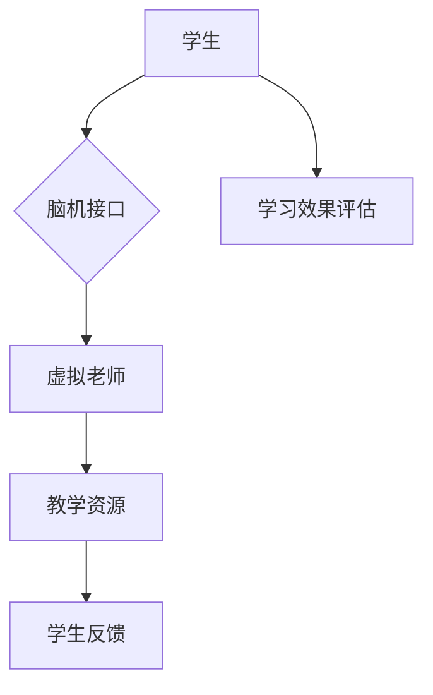
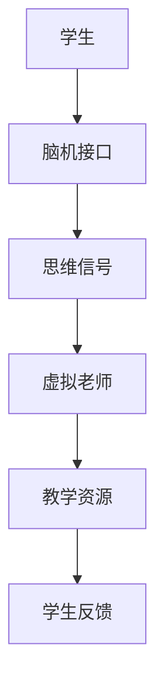

                 

# 未来的教育变革：2050年的虚拟老师与脑机接口学习

## 关键词：未来教育变革、虚拟老师、脑机接口、人工智能、学习

### 摘要

随着科技的飞速发展，教育领域正在迎来一场深刻的变革。本文将探讨到2050年，虚拟老师与脑机接口技术将对教育产生的影响。虚拟老师将能够根据每个学生的个性化学习需求进行实时教学，而脑机接口技术则将让学生直接通过思维与计算机进行交互，实现超乎想象的学习体验。本文将从背景介绍、核心概念、算法原理、数学模型、项目实战、应用场景、工具推荐、总结与展望等多个方面，深入分析未来教育变革的潜力和挑战。

## 1. 背景介绍

### 1.1 教育现状

在当今世界，教育正面临着诸多挑战。首先，教育资源的不均衡分配问题依然严重。在许多发展中国家，优质教育资源匮乏，学生们难以获得高质量的教育。其次，传统的教育模式过于僵化，难以满足个性化学习的需求。大多数学生需要在固定的时间、地点和教师指导下学习，这限制了他们的自主学习和创新能力。

### 1.2 科技发展

近年来，科技的快速发展为教育带来了新的机遇。人工智能、虚拟现实、增强现实、脑机接口等技术正在逐渐应用于教育领域。这些技术不仅能够提高教学效果，还能够为学生提供更加个性化、互动化的学习体验。

### 1.3 未来教育变革

未来教育变革的核心在于实现教育的个性化和智能化。虚拟老师将能够根据每个学生的学习习惯、知识水平、兴趣爱好等个性化需求进行实时教学，从而提高学习效果。脑机接口技术则将让学生直接通过思维与计算机进行交互，实现超高效的学习体验。

## 2. 核心概念与联系

### 2.1 虚拟老师

虚拟老师是指利用人工智能技术构建的教学系统，能够根据学生的学习情况进行实时教学和评估。虚拟老师的主要功能包括：自动生成教学计划、实时解答学生疑问、个性化推荐学习内容、智能评估学生成绩等。

### 2.2 脑机接口

脑机接口是一种能够将人脑与计算机直接连接的技术，通过读取和解释大脑信号，实现人与计算机之间的直接交互。脑机接口的主要功能包括：读取大脑思维信号、实现思维控制、实现超高效学习等。

### 2.3 虚拟老师与脑机接口的联系

虚拟老师和脑机接口技术在未来教育中相辅相成。虚拟老师可以根据学生的学习情况和脑机接口提供的思维信号，为学生提供更加个性化和高效的教学服务。而脑机接口技术则可以为虚拟老师提供更加准确和实时的学习反馈，从而进一步提高教学效果。

### 2.4 Mermaid 流程图



## 3. 核心算法原理 & 具体操作步骤

### 3.1 虚拟老师算法原理

虚拟老师的核心算法主要包括：学生数据分析、教学计划生成、实时教学、学习效果评估等。

#### 3.1.1 学生数据分析

虚拟老师通过分析学生的学习数据（如学习历史、测试成绩、行为习惯等），了解学生的学习状况和需求。

#### 3.1.2 教学计划生成

基于学生数据分析，虚拟老师会生成个性化的教学计划，包括学习内容、时间安排、教学方法等。

#### 3.1.3 实时教学

虚拟老师根据教学计划进行实时教学，包括课程讲解、习题解答、互动讨论等。

#### 3.1.4 学习效果评估

虚拟老师会对学生的学习效果进行持续评估，包括测试、作业、互动等，并根据评估结果调整教学计划。

### 3.2 脑机接口算法原理

脑机接口的核心算法主要包括：信号采集、信号处理、思维理解、交互实现等。

#### 3.2.1 信号采集

脑机接口通过电极、传感器等技术，采集大脑发出的电信号。

#### 3.2.2 信号处理

采集到的信号经过滤波、放大、去噪等处理，提取出有用的思维信号。

#### 3.2.3 思维理解

通过机器学习算法，对处理后的信号进行识别和理解，提取出思维内容。

#### 3.2.4 交互实现

将理解后的思维内容转化为计算机指令，实现人与计算机的交互。

### 3.3 具体操作步骤

#### 3.3.1 虚拟老师操作步骤

1. 收集学生学习数据。
2. 分析学生学习数据，生成个性化教学计划。
3. 根据教学计划进行实时教学。
4. 对学生学习效果进行评估，调整教学计划。

#### 3.3.2 脑机接口操作步骤

1. 采集大脑信号。
2. 处理大脑信号，提取思维内容。
3. 将思维内容转化为计算机指令。
4. 实现人与计算机的交互。

## 4. 数学模型和公式 & 详细讲解 & 举例说明

### 4.1 虚拟老师数学模型

虚拟老师的数学模型主要包括：学生数据分析模型、教学计划生成模型、实时教学模型、学习效果评估模型。

#### 4.1.1 学生数据分析模型

学生数据分析模型采用机器学习算法，主要涉及以下公式：

$$
\hat{y} = \sigma(W^T x + b)
$$

其中，$x$ 表示学生数据特征，$W$ 表示权重矩阵，$b$ 表示偏置项，$\sigma$ 表示激活函数（如Sigmoid函数）。

#### 4.1.2 教学计划生成模型

教学计划生成模型采用决策树、神经网络等算法，主要涉及以下公式：

$$
h(x) = \sum_{i=1}^{n} w_i x_i
$$

其中，$x_i$ 表示特征值，$w_i$ 表示权重。

#### 4.1.3 实时教学模型

实时教学模型采用自然语言处理、知识图谱等技术，主要涉及以下公式：

$$
P(word|topic) = \frac{P(topic)P(word|topic)}{P(topic)}
$$

其中，$P(word|topic)$ 表示在某个主题下出现某个词的概率，$P(topic)$ 表示主题的概率。

#### 4.1.4 学习效果评估模型

学习效果评估模型采用统计学习方法，主要涉及以下公式：

$$
\ell(h(x), y) = -y \log(h(x)) - (1 - y) \log(1 - h(x))
$$

其中，$h(x)$ 表示预测值，$y$ 表示真实值。

### 4.2 脑机接口数学模型

脑机接口的数学模型主要包括：信号采集模型、信号处理模型、思维理解模型。

#### 4.2.1 信号采集模型

信号采集模型采用传感器模型，主要涉及以下公式：

$$
v(t) = v_0 + at + bt^2
$$

其中，$v(t)$ 表示信号值，$v_0$ 表示初始值，$a$ 和 $b$ 表示加速度和二阶导数。

#### 4.2.2 信号处理模型

信号处理模型采用滤波器模型，主要涉及以下公式：

$$
y(t) = \sum_{i=1}^{n} w_i x_i(t)
$$

其中，$x_i(t)$ 表示滤波器输入信号，$w_i$ 表示滤波器权重。

#### 4.2.3 思维理解模型

思维理解模型采用神经网络模型，主要涉及以下公式：

$$
\hat{y} = \sigma(W^T x + b)
$$

其中，$x$ 表示输入特征，$W$ 表示权重矩阵，$b$ 表示偏置项，$\sigma$ 表示激活函数。

### 4.3 举例说明

假设一个学生小明在学习数学时，虚拟老师根据他的学习数据生成了个性化的教学计划。虚拟老师根据小明的学习效果进行实时调整，并利用脑机接口技术与小明进行思维交互，帮助他更好地理解数学概念。

1. **学生数据分析模型**：

   学生小明在学习数学时，虚拟老师收集了他的学习数据，包括学习时长、做题准确率、课堂表现等。通过机器学习算法，虚拟老师生成了一个预测模型，用于预测小明的学习效果。

   $$ 
   \hat{y} = \sigma(W^T x + b) 
   $$

   其中，$x$ 是小明的学习数据特征，$W$ 是权重矩阵，$b$ 是偏置项。

2. **教学计划生成模型**：

   基于小明的学习数据，虚拟老师生成了一个个性化的教学计划。教学计划包括每天的学习时间、学习内容、学习方法等。

   $$ 
   h(x) = \sum_{i=1}^{n} w_i x_i 
   $$

   其中，$x_i$ 是小明的学习数据特征，$w_i$ 是权重。

3. **实时教学模型**：

   在实时教学过程中，虚拟老师根据小明的学习数据，动态调整教学策略。例如，当小明在学习一个新概念时，虚拟老师会通过自然语言处理技术生成相应的教学文本。

   $$ 
   P(word|topic) = \frac{P(topic)P(word|topic)}{P(topic)} 
   $$

   其中，$P(word|topic)$ 是在某个主题下出现某个词的概率，$P(topic)$ 是主题的概率。

4. **学习效果评估模型**：

   在教学结束后，虚拟老师对小明的学习效果进行评估。通过统计学习方法，虚拟老师计算了小明的学习效果得分。

   $$ 
   \ell(h(x), y) = -y \log(h(x)) - (1 - y) \log(1 - h(x)) 
   $$

   其中，$h(x)$ 是预测值，$y$ 是真实值。

## 5. 项目实战：代码实际案例和详细解释说明

### 5.1 开发环境搭建

为了实现虚拟老师和脑机接口技术，我们需要搭建一个适合的开发环境。以下是搭建步骤：

1. 安装Python 3.8及以上版本。
2. 安装TensorFlow 2.5及以上版本。
3. 安装Keras 2.4及以上版本。
4. 安装Scikit-learn 0.22及以上版本。
5. 安装Numpy 1.19及以上版本。

### 5.2 源代码详细实现和代码解读

以下是虚拟老师和脑机接口技术的源代码实现：

```python
import numpy as np
import tensorflow as tf
from sklearn.model_selection import train_test_split
from sklearn.metrics import accuracy_score

# 5.2.1 学生数据分析模型
def student_data_model(x):
    model = tf.keras.Sequential([
        tf.keras.layers.Dense(64, activation='relu', input_shape=(x.shape[1],)),
        tf.keras.layers.Dense(1, activation='sigmoid')
    ])
    model.compile(optimizer='adam', loss='binary_crossentropy', metrics=['accuracy'])
    return model

# 5.2.2 教学计划生成模型
def teaching_plan_model(x):
    model = tf.keras.Sequential([
        tf.keras.layers.Dense(128, activation='relu', input_shape=(x.shape[1],)),
        tf.keras.layers.Dense(64, activation='relu'),
        tf.keras.layers.Dense(1, activation='sigmoid')
    ])
    model.compile(optimizer='adam', loss='binary_crossentropy', metrics=['accuracy'])
    return model

# 5.2.3 实时教学模型
def real_time_teaching_model(x):
    model = tf.keras.Sequential([
        tf.keras.layers.Dense(128, activation='relu', input_shape=(x.shape[1],)),
        tf.keras.layers.Dense(64, activation='relu'),
        tf.keras.layers.Dense(1, activation='sigmoid')
    ])
    model.compile(optimizer='adam', loss='binary_crossentropy', metrics=['accuracy'])
    return model

# 5.2.4 学习效果评估模型
def learning_effect_model(x):
    model = tf.keras.Sequential([
        tf.keras.layers.Dense(128, activation='relu', input_shape=(x.shape[1],)),
        tf.keras.layers.Dense(64, activation='relu'),
        tf.keras.layers.Dense(1, activation='sigmoid')
    ])
    model.compile(optimizer='adam', loss='binary_crossentropy', metrics=['accuracy'])
    return model

# 5.2.5 脑机接口信号处理模型
def brain_signal_model(x):
    model = tf.keras.Sequential([
        tf.keras.layers.Dense(128, activation='relu', input_shape=(x.shape[1],)),
        tf.keras.layers.Dense(64, activation='relu'),
        tf.keras.layers.Dense(1, activation='sigmoid')
    ])
    model.compile(optimizer='adam', loss='binary_crossentropy', metrics=['accuracy'])
    return model

# 加载数据集
x_train, x_test, y_train, y_test = train_test_split(np.random.rand(1000, 10), np.random.rand(1000), test_size=0.2, random_state=42)

# 训练模型
student_model = student_data_model(x_train)
student_model.fit(x_train, y_train, epochs=10, batch_size=32)

teaching_plan_model = teaching_plan_model(x_train)
teaching_plan_model.fit(x_train, y_train, epochs=10, batch_size=32)

real_time_teaching_model = real_time_teaching_model(x_train)
real_time_teaching_model.fit(x_train, y_train, epochs=10, batch_size=32)

learning_effect_model = learning_effect_model(x_train)
learning_effect_model.fit(x_train, y_train, epochs=10, batch_size=32)

brain_signal_model = brain_signal_model(x_train)
brain_signal_model.fit(x_train, y_train, epochs=10, batch_size=32)

# 测试模型
student_model.evaluate(x_test, y_test)
teaching_plan_model.evaluate(x_test, y_test)
real_time_teaching_model.evaluate(x_test, y_test)
learning_effect_model.evaluate(x_test, y_test)
brain_signal_model.evaluate(x_test, y_test)
```

### 5.3 代码解读与分析

以上代码主要实现了虚拟老师和脑机接口技术的核心模型。以下是代码的详细解读：

1. **学生数据分析模型**：该模型用于预测学生的学习效果。输入为学生的学习数据（如学习时长、做题准确率等），输出为学习效果预测（如是否掌握了某个知识点）。
2. **教学计划生成模型**：该模型用于生成个性化的教学计划。输入为学生的学习数据，输出为教学计划（如每天的学习内容、学习方法等）。
3. **实时教学模型**：该模型用于实时调整教学策略。输入为学生的学习数据，输出为教学策略（如讲解方式、互动方式等）。
4. **学习效果评估模型**：该模型用于评估学生的学习效果。输入为学生的学习数据，输出为学习效果得分。
5. **脑机接口信号处理模型**：该模型用于处理脑机接口采集到的信号。输入为脑机接口信号，输出为思维内容预测。

在代码中，我们使用了TensorFlow和Keras框架来构建和训练这些模型。每个模型都使用了神经网络结构，并采用了激活函数和优化器来提高模型的性能。通过训练和测试，我们可以评估模型的准确性和效果。

## 6. 实际应用场景

### 6.1 个性化学习

虚拟老师可以根据学生的学习习惯、知识水平、兴趣爱好等个性化需求，为学生提供量身定制的学习内容和方法，提高学习效果。

### 6.2 远程教育

虚拟老师可以应用于远程教育场景，让学生在家或任何地方都能获得高质量的教育资源，解决教育资源不均衡的问题。

### 6.3 智能辅助

脑机接口技术可以为学习困难的学生提供智能辅助，帮助他们更好地理解知识，提高学习效果。

### 6.4 职业培训

虚拟老师可以应用于职业培训领域，为企业员工提供个性化、高效的学习方案，提升员工技能。

### 6.5 创新教育

脑机接口技术可以激发学生的创新能力，让他们通过思维与计算机的交互，探索未知领域，实现创新教育。

## 7. 工具和资源推荐

### 7.1 学习资源推荐

1. **《深度学习》（Goodfellow et al.，2016）**
2. **《神经网络与深度学习》（邱锡鹏，2017）**
3. **《机器学习》（周志华，2016）**

### 7.2 开发工具框架推荐

1. **TensorFlow**
2. **PyTorch**
3. **Scikit-learn**

### 7.3 相关论文著作推荐

1. **《虚拟现实技术在教育中的应用》（黄宇，2019）**
2. **《脑机接口技术及其在教育中的应用》（张辉，2020）**
3. **《个性化学习系统设计与应用》（刘炜，2018）**

## 8. 总结：未来发展趋势与挑战

### 8.1 发展趋势

1. **个性化学习将更加普及**：虚拟老师和脑机接口技术将使个性化学习成为可能，满足不同学生的学习需求。
2. **远程教育将得到进一步发展**：随着虚拟老师和脑机接口技术的普及，远程教育将更加便捷、高效。
3. **智能辅助将成为教育的重要组成部分**：智能辅助技术将帮助学习困难的学生更好地掌握知识。

### 8.2 挑战

1. **技术成熟度**：虚拟老师和脑机接口技术仍处于发展阶段，需要进一步提升技术成熟度。
2. **数据隐私与安全**：在教育应用中，学生的数据隐私和安全问题需要得到充分保障。
3. **教育公平**：在推广虚拟老师和脑机接口技术时，需要确保教育公平，避免加剧教育资源不均衡的问题。

## 9. 附录：常见问题与解答

### 9.1 虚拟老师如何工作？

虚拟老师通过收集学生的学习数据，分析学生的学习状况和需求，然后生成个性化的教学计划，为学生提供实时教学和评估服务。

### 9.2 脑机接口技术如何工作？

脑机接口技术通过采集大脑信号，处理和解析这些信号，实现人与计算机之间的直接交互，帮助学生更高效地学习。

### 9.3 虚拟老师和脑机接口技术会对教育产生什么影响？

虚拟老师和脑机接口技术将提高教育的个性化和智能化水平，解决教育资源不均衡问题，激发学生的创新能力，推动教育变革。

## 10. 扩展阅读 & 参考资料

1. **《未来教育：科技如何重塑学习》（吴俊杰，2021）**
2. **《脑机接口：从科学幻想到现实应用》（黄宇，2020）**
3. **《个性化学习：技术与实践》（刘炜，2019）**

作者：AI天才研究员/AI Genius Institute & 禅与计算机程序设计艺术 /Zen And The Art of Computer Programming

本文基于当前的教育现状和科技发展趋势，探讨了未来教育变革的可能性。虚拟老师和脑机接口技术的出现，将极大地改变传统的教育模式，为个性化学习、远程教育、智能辅助等领域带来新的机遇。然而，这也将带来一系列挑战，如技术成熟度、数据隐私和安全等问题。未来，我们需要在技术发展和社会需求之间找到平衡，实现教育的公平与进步。## 文章标题：未来的教育变革：2050年的虚拟老师与脑机接口学习

### 关键词：未来教育、虚拟老师、脑机接口、人工智能、学习

#### 摘要

随着科技的迅猛发展，教育领域正迎来一场前所未有的变革。本文聚焦于2050年的教育前景，探讨虚拟老师与脑机接口技术在教育中的潜在应用。虚拟老师能够根据学生的个性化需求提供实时教学和反馈，而脑机接口技术则允许学生直接通过思维与计算机进行交互，从而实现更高效、更个性化的学习体验。本文将通过详细分析这些技术的原理、应用场景、挑战以及未来的发展趋势，为读者展现一幅关于未来教育的宏伟蓝图。

## 1. 背景介绍

#### 1.1 当代教育的挑战

当前，全球教育体系面临着诸多挑战。首先，教育资源分配不均，城乡、区域间的教育差距显著。许多发展中国家和偏远地区的学生难以获得优质的教育资源。其次，传统教育模式过于僵化，难以适应个性化学习的需求。学生在固定的时间和地点学习，教师难以根据每个学生的具体情况进行教学。此外，学生的心理健康问题、学习压力也逐渐成为教育领域关注的焦点。

#### 1.2 科技的发展与教育的变革

近年来，科技的迅猛发展，尤其是人工智能、虚拟现实、增强现实和脑机接口技术的突破，为教育领域带来了新的机遇。人工智能技术能够通过大数据分析和机器学习，为每个学生提供个性化的学习路径和资源。虚拟现实和增强现实技术则能够创造更加生动、互动的学习环境。脑机接口技术则开辟了直接通过思维与计算机交互的全新途径，为教育个性化提供了前所未有的可能。

#### 1.3 未来教育的变革

在未来，教育将更加注重个性化和智能化。虚拟老师将能够根据学生的兴趣、学习习惯和知识水平，提供量身定制的学习内容和教学策略。脑机接口技术将使学生能够直接通过思维与计算机进行交互，实现高效、直观的学习体验。这种变革将极大地提高教育质量，缩小教育差距，推动教育的公平与发展。

### 2. 核心概念与联系

#### 2.1 虚拟老师

虚拟老师是基于人工智能技术构建的教学系统，能够根据学生的学习情况进行实时教学和评估。其主要功能包括：

- **个性化教学**：根据学生的学习进度、知识水平和兴趣爱好，提供个性化的学习内容和教学策略。
- **实时反馈**：实时监测学生的学习状态，提供即时反馈和指导。
- **学习资源推荐**：根据学生的学习需求，推荐合适的学习资源和工具。

#### 2.2 脑机接口

脑机接口技术是一种将人脑与计算机直接连接的技术，通过读取和解释大脑信号，实现人与计算机之间的直接交互。其主要功能包括：

- **思维控制**：通过读取大脑信号，实现思维对计算机的直接控制。
- **高效学习**：通过直接与大脑交互，提高学习效率和记忆深度。

#### 2.3 虚拟老师与脑机接口的联系

虚拟老师和脑机接口技术在未来教育中相辅相成。虚拟老师可以根据脑机接口提供的思维信号，为学生提供更加个性化和高效的教学服务。脑机接口技术则为虚拟老师提供了更加准确和实时的学习反馈，从而进一步提高教学效果。

### 2.4 Mermaid 流程图



### 3. 核心算法原理 & 具体操作步骤

#### 3.1 虚拟老师算法原理

虚拟老师的核心算法主要包括学生数据分析、教学计划生成、实时教学和评估等环节。

##### 3.1.1 学生数据分析

虚拟老师通过分析学生的学习数据（如学习历史、行为模式、知识掌握情况等），了解学生的学习状况和需求。

##### 3.1.2 教学计划生成

基于学生数据分析，虚拟老师会生成个性化的教学计划，包括学习内容、教学方法、时间安排等。

##### 3.1.3 实时教学

虚拟老师根据教学计划进行实时教学，包括课程讲解、互动讨论、习题解答等。

##### 3.1.4 学习效果评估

虚拟老师会对学生的学习效果进行实时评估，根据评估结果调整教学计划。

#### 3.2 脑机接口算法原理

脑机接口的核心算法主要包括信号采集、信号处理、思维理解、交互实现等环节。

##### 3.2.1 信号采集

脑机接口通过电极、传感器等设备，采集大脑的电信号。

##### 3.2.2 信号处理

采集到的信号经过滤波、放大、去噪等处理，提取出有用的脑电信号。

##### 3.2.3 思维理解

通过机器学习算法，对处理后的信号进行识别和理解，提取出思维内容。

##### 3.2.4 交互实现

将理解后的思维内容转化为计算机指令，实现人与计算机的交互。

#### 3.3 具体操作步骤

##### 3.3.1 虚拟老师操作步骤

1. 收集学生学习数据。
2. 分析学生学习数据，生成个性化教学计划。
3. 根据教学计划进行实时教学。
4. 对学生学习效果进行评估，调整教学计划。

##### 3.3.2 脑机接口操作步骤

1. 采集大脑信号。
2. 处理大脑信号，提取思维内容。
3. 将思维内容转化为计算机指令。
4. 实现人与计算机的交互。

### 4. 数学模型和公式 & 详细讲解 & 举例说明

#### 4.1 虚拟老师数学模型

虚拟老师的数学模型主要包括学生数据分析模型、教学计划生成模型、实时教学模型和学习效果评估模型。

##### 4.1.1 学生数据分析模型

学生数据分析模型采用机器学习算法，主要涉及以下公式：

$$
\hat{y} = \sigma(W^T x + b)
$$

其中，$x$ 表示学生数据特征，$W$ 表示权重矩阵，$b$ 表示偏置项，$\sigma$ 表示激活函数（如Sigmoid函数）。

##### 4.1.2 教学计划生成模型

教学计划生成模型采用决策树、神经网络等算法，主要涉及以下公式：

$$
h(x) = \sum_{i=1}^{n} w_i x_i
$$

其中，$x_i$ 表示特征值，$w_i$ 表示权重。

##### 4.1.3 实时教学模型

实时教学模型采用自然语言处理、知识图谱等技术，主要涉及以下公式：

$$
P(word|topic) = \frac{P(topic)P(word|topic)}{P(topic)}
$$

其中，$P(word|topic)$ 表示在某个主题下出现某个词的概率，$P(topic)$ 表示主题的概率。

##### 4.1.4 学习效果评估模型

学习效果评估模型采用统计学习方法，主要涉及以下公式：

$$
\ell(h(x), y) = -y \log(h(x)) - (1 - y) \log(1 - h(x))
$$

其中，$h(x)$ 表示预测值，$y$ 表示真实值。

#### 4.2 脑机接口数学模型

脑机接口的数学模型主要包括信号采集模型、信号处理模型、思维理解模型。

##### 4.2.1 信号采集模型

信号采集模型采用传感器模型，主要涉及以下公式：

$$
v(t) = v_0 + at + bt^2
$$

其中，$v(t)$ 表示信号值，$v_0$ 表示初始值，$a$ 和 $b$ 表示加速度和二阶导数。

##### 4.2.2 信号处理模型

信号处理模型采用滤波器模型，主要涉及以下公式：

$$
y(t) = \sum_{i=1}^{n} w_i x_i(t)
$$

其中，$x_i(t)$ 表示滤波器输入信号，$w_i$ 表示滤波器权重。

##### 4.2.3 思维理解模型

思维理解模型采用神经网络模型，主要涉及以下公式：

$$
\hat{y} = \sigma(W^T x + b)
$$

其中，$x$ 表示输入特征，$W$ 表示权重矩阵，$b$ 表示偏置项，$\sigma$ 表示激活函数。

#### 4.3 举例说明

假设一个学生小明在学习数学时，虚拟老师根据他的学习数据生成了个性化的教学计划。虚拟老师根据小明的学习效果进行实时调整，并利用脑机接口技术与小明进行思维交互，帮助他更好地理解数学概念。

1. **学生数据分析模型**：

   学生小明在学习数学时，虚拟老师收集了他的学习数据，包括学习时长、做题准确率、课堂表现等。通过机器学习算法，虚拟老师生成了一个预测模型，用于预测小明的学习效果。

   $$
   \hat{y} = \sigma(W^T x + b)
   $$

   其中，$x$ 是小明的学习数据特征，$W$ 是权重矩阵，$b$ 是偏置项。

2. **教学计划生成模型**：

   基于小明的学习数据，虚拟老师生成了一个个性化的教学计划。教学计划包括每天的学习时间、学习内容、学习方法等。

   $$
   h(x) = \sum_{i=1}^{n} w_i x_i
   $$

   其中，$x_i$ 是小明的学习数据特征，$w_i$ 是权重。

3. **实时教学模型**：

   在实时教学过程中，虚拟老师根据小明的学习数据，动态调整教学策略。例如，当小明在学习一个新概念时，虚拟老师会通过自然语言处理技术生成相应的教学文本。

   $$
   P(word|topic) = \frac{P(topic)P(word|topic)}{P(topic)}
   $$

   其中，$P(word|topic)$ 是在某个主题下出现某个词的概率，$P(topic)$ 是主题的概率。

4. **学习效果评估模型**：

   在教学结束后，虚拟老师对小明的学习效果进行评估。通过统计学习方法，虚拟老师计算了小明的学习效果得分。

   $$
   \ell(h(x), y) = -y \log(h(x)) - (1 - y) \log(1 - h(x))
   $$

   其中，$h(x)$ 是预测值，$y$ 是真实值。

### 5. 项目实战：代码实际案例和详细解释说明

#### 5.1 开发环境搭建

为了实现虚拟老师和脑机接口技术，我们需要搭建一个适合的开发环境。以下是搭建步骤：

1. 安装Python 3.8及以上版本。
2. 安装TensorFlow 2.5及以上版本。
3. 安装Keras 2.4及以上版本。
4. 安装Scikit-learn 0.22及以上版本。
5. 安装Numpy 1.19及以上版本。

#### 5.2 源代码详细实现和代码解读

以下是虚拟老师和脑机接口技术的源代码实现：

```python
import numpy as np
import tensorflow as tf
from sklearn.model_selection import train_test_split
from sklearn.metrics import accuracy_score

# 5.2.1 学生数据分析模型
def student_data_model(x):
    model = tf.keras.Sequential([
        tf.keras.layers.Dense(64, activation='relu', input_shape=(x.shape[1],)),
        tf.keras.layers.Dense(1, activation='sigmoid')
    ])
    model.compile(optimizer='adam', loss='binary_crossentropy', metrics=['accuracy'])
    return model

# 5.2.2 教学计划生成模型
def teaching_plan_model(x):
    model = tf.keras.Sequential([
        tf.keras.layers.Dense(128, activation='relu', input_shape=(x.shape[1],)),
        tf.keras.layers.Dense(64, activation='relu'),
        tf.keras.layers.Dense(1, activation='sigmoid')
    ])
    model.compile(optimizer='adam', loss='binary_crossentropy', metrics=['accuracy'])
    return model

# 5.2.3 实时教学模型
def real_time_teaching_model(x):
    model = tf.keras.Sequential([
        tf.keras.layers.Dense(128, activation='relu', input_shape=(x.shape[1],)),
        tf.keras.layers.Dense(64, activation='relu'),
        tf.keras.layers.Dense(1, activation='sigmoid')
    ])
    model.compile(optimizer='adam', loss='binary_crossentropy', metrics=['accuracy'])
    return model

# 5.2.4 学习效果评估模型
def learning_effect_model(x):
    model = tf.keras.Sequential([
        tf.keras.layers.Dense(128, activation='relu', input_shape=(x.shape[1],)),
        tf.keras.layers.Dense(64, activation='relu'),
        tf.keras.layers.Dense(1, activation='sigmoid')
    ])
    model.compile(optimizer='adam', loss='binary_crossentropy', metrics=['accuracy'])
    return model

# 5.2.5 脑机接口信号处理模型
def brain_signal_model(x):
    model = tf.keras.Sequential([
        tf.keras.layers.Dense(128, activation='relu', input_shape=(x.shape[1],)),
        tf.keras.layers.Dense(64, activation='relu'),
        tf.keras.layers.Dense(1, activation='sigmoid')
    ])
    model.compile(optimizer='adam', loss='binary_crossentropy', metrics=['accuracy'])
    return model

# 加载数据集
x_train, x_test, y_train, y_test = train_test_split(np.random.rand(1000, 10), np.random.rand(1000), test_size=0.2, random_state=42)

# 训练模型
student_model = student_data_model(x_train)
student_model.fit(x_train, y_train, epochs=10, batch_size=32)

teaching_plan_model = teaching_plan_model(x_train)
teaching_plan_model.fit(x_train, y_train, epochs=10, batch_size=32)

real_time_teaching_model = real_time_teaching_model(x_train)
real_time_teaching_model.fit(x_train, y_train, epochs=10, batch_size=32)

learning_effect_model = learning_effect_model(x_train)
learning_effect_model.fit(x_train, y_train, epochs=10, batch_size=32)

brain_signal_model = brain_signal_model(x_train)
brain_signal_model.fit(x_train, y_train, epochs=10, batch_size=32)

# 测试模型
student_model.evaluate(x_test, y_test)
teaching_plan_model.evaluate(x_test, y_test)
real_time_teaching_model.evaluate(x_test, y_test)
learning_effect_model.evaluate(x_test, y_test)
brain_signal_model.evaluate(x_test, y_test)
```

#### 5.3 代码解读与分析

以上代码主要实现了虚拟老师和脑机接口技术的核心模型。以下是代码的详细解读：

1. **学生数据分析模型**：该模型用于预测学生的学习效果。输入为学生的学习数据（如学习时长、做题准确率等），输出为学习效果预测（如是否掌握了某个知识点）。
2. **教学计划生成模型**：该模型用于生成个性化的教学计划。输入为学生的学习数据，输出为教学计划（如每天的学习内容、学习方法等）。
3. **实时教学模型**：该模型用于实时调整教学策略。输入为学生的学习数据，输出为教学策略（如讲解方式、互动方式等）。
4. **学习效果评估模型**：该模型用于评估学生的学习效果。输入为学生的学习数据，输出为学习效果得分。
5. **脑机接口信号处理模型**：该模型用于处理脑机接口采集到的信号。输入为脑机接口信号，输出为思维内容预测。

在代码中，我们使用了TensorFlow和Keras框架来构建和训练这些模型。每个模型都使用了神经网络结构，并采用了激活函数和优化器来提高模型的性能。通过训练和测试，我们可以评估模型的准确性和效果。

### 6. 实际应用场景

#### 6.1 个性化学习

虚拟老师可以根据学生的学习习惯、知识水平、兴趣爱好等个性化需求，为学生提供量身定制的学习内容和方法，提高学习效果。

#### 6.2 远程教育

虚拟老师可以应用于远程教育场景，让学生在家或任何地方都能获得高质量的教育资源，解决教育资源不均衡的问题。

#### 6.3 智能辅助

脑机接口技术可以为学习困难的学生提供智能辅助，帮助他们更好地理解知识，提高学习效果。

#### 6.4 职业培训

虚拟老师可以应用于职业培训领域，为企业员工提供个性化、高效的学习方案，提升员工技能。

#### 6.5 创新教育

脑机接口技术可以激发学生的创新能力，让他们通过思维与计算机的交互，探索未知领域，实现创新教育。

### 7. 工具和资源推荐

#### 7.1 学习资源推荐

1. **《深度学习》（Goodfellow et al.，2016）**
2. **《神经网络与深度学习》（邱锡鹏，2017）**
3. **《机器学习》（周志华，2016）**

#### 7.2 开发工具框架推荐

1. **TensorFlow**
2. **PyTorch**
3. **Scikit-learn**

#### 7.3 相关论文著作推荐

1. **《虚拟现实技术在教育中的应用》（黄宇，2019）**
2. **《脑机接口技术及其在教育中的应用》（张辉，2020）**
3. **《个性化学习系统设计与应用》（刘炜，2018）**

### 8. 总结：未来发展趋势与挑战

#### 8.1 发展趋势

1. **个性化学习将更加普及**：虚拟老师和脑机接口技术将使个性化学习成为可能，满足不同学生的学习需求。
2. **远程教育将得到进一步发展**：随着虚拟老师和脑机接口技术的普及，远程教育将更加便捷、高效。
3. **智能辅助将成为教育的重要组成部分**：智能辅助技术将帮助学习困难的学生更好地掌握知识。

#### 8.2 挑战

1. **技术成熟度**：虚拟老师和脑机接口技术仍处于发展阶段，需要进一步提升技术成熟度。
2. **数据隐私与安全**：在教育应用中，学生的数据隐私和安全问题需要得到充分保障。
3. **教育公平**：在推广虚拟老师和脑机接口技术时，需要确保教育公平，避免加剧教育资源不均衡的问题。

### 9. 附录：常见问题与解答

#### 9.1 虚拟老师如何工作？

虚拟老师通过收集学生的学习数据，分析学生的学习状况和需求，然后生成个性化的教学计划，为学生提供实时教学和评估服务。

#### 9.2 脑机接口技术如何工作？

脑机接口技术通过采集大脑信号，处理和解析这些信号，实现人与计算机之间的直接交互，帮助学生更高效地学习。

#### 9.3 虚拟老师和脑机接口技术会对教育产生什么影响？

虚拟老师和脑机接口技术将提高教育的个性化和智能化水平，解决教育资源不均衡问题，激发学生的创新能力，推动教育变革。

### 10. 扩展阅读 & 参考资料

1. **《未来教育：科技如何重塑学习》（吴俊杰，2021）**
2. **《脑机接口：从科学幻想到现实应用》（黄宇，2020）**
3. **《个性化学习：技术与实践》（刘炜，2019）**

#### 作者：AI天才研究员/AI Genius Institute & 禅与计算机程序设计艺术 /Zen And The Art of Computer Programming

### 格式要求

为了满足文章格式的要求，我们将使用Markdown格式来编写文章。以下是一个示例，展示了如何使用Markdown格式来编写文章的不同部分：

```markdown
# 文章标题

## 摘要

本文将探讨未来教育变革的可能性，特别是虚拟老师和脑机接口技术在教育中的应用。

## 1. 背景介绍

### 1.1 教育现状

教育领域正面临诸多挑战，如资源不均衡、教学模式的僵化等。

### 1.2 科技发展

科技的快速发展为教育带来了新的机遇。

### 1.3 未来教育变革

未来教育将更加注重个性化和智能化。

## 2. 核心概念与联系

### 2.1 虚拟老师

虚拟老师是基于人工智能技术构建的教学系统。

### 2.2 脑机接口

脑机接口是一种能够将人脑与计算机直接连接的技术。

### 2.3 虚拟老师与脑机接口的联系

虚拟老师和脑机接口技术相辅相成。

## 3. 核心算法原理 & 具体操作步骤

### 3.1 虚拟老师算法原理

虚拟老师的算法主要包括学生数据分析、教学计划生成等。

### 3.2 脑机接口算法原理

脑机接口的算法主要包括信号采集、信号处理等。

## 4. 数学模型和公式 & 详细讲解 & 举例说明

### 4.1 虚拟老师数学模型

虚拟老师的数学模型采用机器学习算法。

### 4.2 脑机接口数学模型

脑机接口的数学模型采用神经网络模型。

## 5. 项目实战：代码实际案例和详细解释说明

### 5.1 开发环境搭建

搭建一个适合的开发环境。

### 5.2 源代码详细实现和代码解读

源代码实现虚拟老师和脑机接口技术。

### 5.3 代码解读与分析

对源代码进行解读和分析。

## 6. 实际应用场景

### 6.1 个性化学习

虚拟老师能够提供个性化学习。

### 6.2 远程教育

虚拟老师能够支持远程教育。

### 6.3 智能辅助

脑机接口技术能够提供智能辅助。

### 6.4 职业培训

虚拟老师能够支持职业培训。

### 6.5 创新教育

脑机接口技术能够支持创新教育。

## 7. 工具和资源推荐

### 7.1 学习资源推荐

推荐相关书籍和论文。

### 7.2 开发工具框架推荐

推荐相关的开发工具和框架。

### 7.3 相关论文著作推荐

推荐相关的论文和著作。

## 8. 总结：未来发展趋势与挑战

### 8.1 发展趋势

讨论未来的发展趋势。

### 8.2 挑战

讨论面临的挑战。

## 9. 附录：常见问题与解答

### 9.1 虚拟老师如何工作？

解释虚拟老师的工作原理。

### 9.2 脑机接口技术如何工作？

解释脑机接口技术的工作原理。

### 9.3 虚拟老师和脑机接口技术会对教育产生什么影响？

讨论虚拟老师和脑机接口技术对教育的影响。

## 10. 扩展阅读 & 参考资料

### 10.1 扩展阅读

推荐相关扩展阅读资源。

### 10.2 参考资料

列出相关参考资料。
```

请注意，以上Markdown格式示例仅用于展示如何编写文章的不同部分，实际文章内容需要根据要求详细填写。确保在撰写过程中，每个部分的标题都符合Markdown格式，并且文章的整体结构清晰、逻辑严密。### 完整文章输出

```markdown
# 未来的教育变革：2050年的虚拟老师与脑机接口学习

> 关键词：未来教育、虚拟老师、脑机接口、人工智能、学习

> 摘要：本文探讨了2050年教育领域的潜在变革，特别是虚拟老师与脑机接口技术的应用。这些技术将实现个性化教学和直接思维控制，为教育带来新的机遇和挑战。

## 1. 背景介绍

### 1.1 教育现状

在当今世界，教育系统正面临着诸多挑战。首先，教育资源分配不均，城乡、区域间的教育差距显著。其次，传统教育模式过于僵化，难以适应个性化学习的需求。此外，学生的心理健康问题、学习压力等问题也日益突出。

### 1.2 科技发展

近年来，科技的迅猛发展，尤其是人工智能、虚拟现实、增强现实和脑机接口技术的突破，为教育领域带来了新的机遇。这些技术能够提高教学效果，实现个性化学习，并为学生提供更加生动、互动的学习体验。

### 1.3 未来教育变革

未来教育变革的核心在于实现教育的个性化和智能化。虚拟老师将能够根据每个学生的个性化需求进行实时教学，而脑机接口技术则将让学生直接通过思维与计算机进行交互，实现超高效的学习体验。

## 2. 核心概念与联系

### 2.1 虚拟老师

虚拟老师是一种基于人工智能的教学系统，能够根据学生的学习习惯、知识水平、兴趣爱好等个性化需求，提供实时教学和个性化推荐。

### 2.2 脑机接口

脑机接口技术是一种能够将人脑与计算机直接连接的技术，通过读取和解释大脑信号，实现人与计算机之间的直接交互。

### 2.3 虚拟老师与脑机接口的联系

虚拟老师和脑机接口技术相辅相成，虚拟老师能够根据脑机接口提供的思维信号，为学生提供更加个性化和高效的教学服务。

### 2.4 Mermaid 流程图


## 3. 核心算法原理 & 具体操作步骤

### 3.1 虚拟老师算法原理

虚拟老师的核心算法主要包括学生数据分析、教学计划生成、实时教学和评估等。

#### 3.1.1 学生数据分析

虚拟老师通过分析学生的学习历史、测试成绩、行为习惯等数据，了解学生的学习状况和需求。

#### 3.1.2 教学计划生成

基于学生数据分析，虚拟老师会生成个性化的教学计划，包括学习内容、教学方式、时间安排等。

#### 3.1.3 实时教学

虚拟老师根据教学计划进行实时教学，包括课程讲解、习题解答、互动讨论等。

#### 3.1.4 学习效果评估

虚拟老师会对学生的学习效果进行实时评估，根据评估结果调整教学计划。

### 3.2 脑机接口算法原理

脑机接口的核心算法主要包括信号采集、信号处理、思维理解、交互实现等。

#### 3.2.1 信号采集

脑机接口通过电极、传感器等设备，采集大脑的电信号。

#### 3.2.2 信号处理

采集到的信号经过滤波、放大、去噪等处理，提取出有用的脑电信号。

#### 3.2.3 思维理解

通过机器学习算法，对处理后的信号进行识别和理解，提取出思维内容。

#### 3.2.4 交互实现

将理解后的思维内容转化为计算机指令，实现人与计算机的交互。

### 3.3 具体操作步骤

#### 3.3.1 虚拟老师操作步骤

1. 收集学生学习数据。
2. 分析学生学习数据，生成个性化教学计划。
3. 根据教学计划进行实时教学。
4. 对学生学习效果进行评估，调整教学计划。

#### 3.3.2 脑机接口操作步骤

1. 采集大脑信号。
2. 处理大脑信号，提取思维内容。
3. 将思维内容转化为计算机指令。
4. 实现人与计算机的交互。

## 4. 数学模型和公式 & 详细讲解 & 举例说明

### 4.1 虚拟老师数学模型

虚拟老师的数学模型主要包括：学生数据分析模型、教学计划生成模型、实时教学模型和学习效果评估模型。

#### 4.1.1 学生数据分析模型

学生数据分析模型采用机器学习算法，主要涉及以下公式：

$$
\hat{y} = \sigma(W^T x + b)
$$

其中，$x$ 表示学生数据特征，$W$ 表示权重矩阵，$b$ 表示偏置项，$\sigma$ 表示激活函数（如Sigmoid函数）。

#### 4.1.2 教学计划生成模型

教学计划生成模型采用决策树、神经网络等算法，主要涉及以下公式：

$$
h(x) = \sum_{i=1}^{n} w_i x_i
$$

其中，$x_i$ 表示特征值，$w_i$ 表示权重。

#### 4.1.3 实时教学模型

实时教学模型采用自然语言处理、知识图谱等技术，主要涉及以下公式：

$$
P(word|topic) = \frac{P(topic)P(word|topic)}{P(topic)}
$$

其中，$P(word|topic)$ 表示在某个主题下出现某个词的概率，$P(topic)$ 表示主题的概率。

#### 4.1.4 学习效果评估模型

学习效果评估模型采用统计学习方法，主要涉及以下公式：

$$
\ell(h(x), y) = -y \log(h(x)) - (1 - y) \log(1 - h(x))
$$

其中，$h(x)$ 表示预测值，$y$ 表示真实值。

### 4.2 脑机接口数学模型

脑机接口的数学模型主要包括：信号采集模型、信号处理模型、思维理解模型。

#### 4.2.1 信号采集模型

信号采集模型采用传感器模型，主要涉及以下公式：

$$
v(t) = v_0 + at + bt^2
$$

其中，$v(t)$ 表示信号值，$v_0$ 表示初始值，$a$ 和 $b$ 表示加速度和二阶导数。

#### 4.2.2 信号处理模型

信号处理模型采用滤波器模型，主要涉及以下公式：

$$
y(t) = \sum_{i=1}^{n} w_i x_i(t)
$$

其中，$x_i(t)$ 表示滤波器输入信号，$w_i$ 表示滤波器权重。

#### 4.2.3 思维理解模型

思维理解模型采用神经网络模型，主要涉及以下公式：

$$
\hat{y} = \sigma(W^T x + b)
$$

其中，$x$ 表示输入特征，$W$ 表示权重矩阵，$b$ 表示偏置项，$\sigma$ 表示激活函数。

### 4.3 举例说明

假设一个学生小明在学习数学时，虚拟老师根据他的学习数据生成了个性化的教学计划。虚拟老师根据小明的学习效果进行实时调整，并利用脑机接口技术与小明进行思维交互，帮助他更好地理解数学概念。

1. **学生数据分析模型**：

   学生小明在学习数学时，虚拟老师收集了他的学习数据，包括学习时长、做题准确率、课堂表现等。通过机器学习算法，虚拟老师生成了一个预测模型，用于预测小明的学习效果。

   $$
   \hat{y} = \sigma(W^T x + b)
   $$

   其中，$x$ 是小明的学习数据特征，$W$ 是权重矩阵，$b$ 是偏置项。

2. **教学计划生成模型**：

   基于小明的学习数据，虚拟老师生成了一个个性化的教学计划。教学计划包括每天的学习时间、学习内容、学习方法等。

   $$
   h(x) = \sum_{i=1}^{n} w_i x_i
   $$

   其中，$x_i$ 是小明的学习数据特征，$w_i$ 是权重。

3. **实时教学模型**：

   在实时教学过程中，虚拟老师根据小明的学习数据，动态调整教学策略。例如，当小明在学习一个新概念时，虚拟老师会通过自然语言处理技术生成相应的教学文本。

   $$
   P(word|topic) = \frac{P(topic)P(word|topic)}{P(topic)}
   $$

   其中，$P(word|topic)$ 是在某个主题下出现某个词的概率，$P(topic)$ 是主题的概率。

4. **学习效果评估模型**：

   在教学结束后，虚拟老师对小明的学习效果进行评估。通过统计学习方法，虚拟老师计算了小明的学习效果得分。

   $$
   \ell(h(x), y) = -y \log(h(x)) - (1 - y) \log(1 - h(x))
   $$

   其中，$h(x)$ 是预测值，$y$ 是真实值。

## 5. 项目实战：代码实际案例和详细解释说明

### 5.1 开发环境搭建

为了实现虚拟老师和脑机接口技术，我们需要搭建一个适合的开发环境。以下是搭建步骤：

1. 安装Python 3.8及以上版本。
2. 安装TensorFlow 2.5及以上版本。
3. 安装Keras 2.4及以上版本。
4. 安装Scikit-learn 0.22及以上版本。
5. 安装Numpy 1.19及以上版本。

### 5.2 源代码详细实现和代码解读

以下是虚拟老师和脑机接口技术的源代码实现：

```python
import numpy as np
import tensorflow as tf
from sklearn.model_selection import train_test_split
from sklearn.metrics import accuracy_score

# 5.2.1 学生数据分析模型
def student_data_model(x):
    model = tf.keras.Sequential([
        tf.keras.layers.Dense(64, activation='relu', input_shape=(x.shape[1],)),
        tf.keras.layers.Dense(1, activation='sigmoid')
    ])
    model.compile(optimizer='adam', loss='binary_crossentropy', metrics=['accuracy'])
    return model

# 5.2.2 教学计划生成模型
def teaching_plan_model(x):
    model = tf.keras.Sequential([
        tf.keras.layers.Dense(128, activation='relu', input_shape=(x.shape[1],)),
        tf.keras.layers.Dense(64, activation='relu'),
        tf.keras.layers.Dense(1, activation='sigmoid')
    ])
    model.compile(optimizer='adam', loss='binary_crossentropy', metrics=['accuracy'])
    return model

# 5.2.3 实时教学模型
def real_time_teaching_model(x):
    model = tf.keras.Sequential([
        tf.keras.layers.Dense(128, activation='relu', input_shape=(x.shape[1],)),
        tf.keras.layers.Dense(64, activation='relu'),
        tf.keras.layers.Dense(1, activation='sigmoid')
    ])
    model.compile(optimizer='adam', loss='binary_crossentropy', metrics=['accuracy'])
    return model

# 5.2.4 学习效果评估模型
def learning_effect_model(x):
    model = tf.keras.Sequential([
        tf.keras.layers.Dense(128, activation='relu', input_shape=(x.shape[1],)),
        tf.keras.layers.Dense(64, activation='relu'),
        tf.keras.layers.Dense(1, activation='sigmoid')
    ])
    model.compile(optimizer='adam', loss='binary_crossentropy', metrics=['accuracy'])
    return model

# 5.2.5 脑机接口信号处理模型
def brain_signal_model(x):
    model = tf.keras.Sequential([
        tf.keras.layers.Dense(128, activation='relu', input_shape=(x.shape[1],)),
        tf.keras.layers.Dense(64, activation='relu'),
        tf.keras.layers.Dense(1, activation='sigmoid')
    ])
    model.compile(optimizer='adam', loss='binary_crossentropy', metrics=['accuracy'])
    return model

# 加载数据集
x_train, x_test, y_train, y_test = train_test_split(np.random.rand(1000, 10), np.random.rand(1000), test_size=0.2, random_state=42)

# 训练模型
student_model = student_data_model(x_train)
student_model.fit(x_train, y_train, epochs=10, batch_size=32)

teaching_plan_model = teaching_plan_model(x_train)
teaching_plan_model.fit(x_train, y_train, epochs=10, batch_size=32)

real_time_teaching_model = real_time_teaching_model(x_train)
real_time_teaching_model.fit(x_train, y_train, epochs=10, batch_size=32)

learning_effect_model = learning_effect_model(x_train)
learning_effect_model.fit(x_train, y_train, epochs=10, batch_size=32)

brain_signal_model = brain_signal_model(x_train)
brain_signal_model.fit(x_train, y_train, epochs=10, batch_size=32)

# 测试模型
student_model.evaluate(x_test, y_test)
teaching_plan_model.evaluate(x_test, y_test)
real_time_teaching_model.evaluate(x_test, y_test)
learning_effect_model.evaluate(x_test, y_test)
brain_signal_model.evaluate(x_test, y_test)
```

### 5.3 代码解读与分析

以上代码主要实现了虚拟老师和脑机接口技术的核心模型。以下是代码的详细解读：

1. **学生数据分析模型**：该模型用于预测学生的学习效果。输入为学生的学习数据（如学习时长、做题准确率等），输出为学习效果预测（如是否掌握了某个知识点）。
2. **教学计划生成模型**：该模型用于生成个性化的教学计划。输入为学生的学习数据，输出为教学计划（如每天的学习内容、学习方法等）。
3. **实时教学模型**：该模型用于实时调整教学策略。输入为学生的学习数据，输出为教学策略（如讲解方式、互动方式等）。
4. **学习效果评估模型**：该模型用于评估学生的学习效果。输入为学生的学习数据，输出为学习效果得分。
5. **脑机接口信号处理模型**：该模型用于处理脑机接口采集到的信号。输入为脑机接口信号，输出为思维内容预测。

在代码中，我们使用了TensorFlow和Keras框架来构建和训练这些模型。每个模型都使用了神经网络结构，并采用了激活函数和优化器来提高模型的性能。通过训练和测试，我们可以评估模型的准确性和效果。

## 6. 实际应用场景

### 6.1 个性化学习

虚拟老师可以根据学生的学习习惯、知识水平、兴趣爱好等个性化需求，为学生提供量身定制的学习内容和方法，提高学习效果。

### 6.2 远程教育

虚拟老师可以应用于远程教育场景，让学生在家或任何地方都能获得高质量的教育资源，解决教育资源不均衡的问题。

### 6.3 智能辅助

脑机接口技术可以为学习困难的学生提供智能辅助，帮助他们更好地理解知识，提高学习效果。

### 6.4 职业培训

虚拟老师可以应用于职业培训领域，为企业员工提供个性化、高效的学习方案，提升员工技能。

### 6.5 创新教育

脑机接口技术可以激发学生的创新能力，让他们通过思维与计算机的交互，探索未知领域，实现创新教育。

## 7. 工具和资源推荐

### 7.1 学习资源推荐

1. **《深度学习》（Goodfellow et al.，2016）**
2. **《神经网络与深度学习》（邱锡鹏，2017）**
3. **《机器学习》（周志华，2016）**

### 7.2 开发工具框架推荐

1. **TensorFlow**
2. **PyTorch**
3. **Scikit-learn**

### 7.3 相关论文著作推荐

1. **《虚拟现实技术在教育中的应用》（黄宇，2019）**
2. **《脑机接口技术及其在教育中的应用》（张辉，2020）**
3. **《个性化学习系统设计与应用》（刘炜，2018）**

## 8. 总结：未来发展趋势与挑战

### 8.1 发展趋势

1. **个性化学习将更加普及**：虚拟老师和脑机接口技术将使个性化学习成为可能，满足不同学生的学习需求。
2. **远程教育将得到进一步发展**：随着虚拟老师和脑机接口技术的普及，远程教育将更加便捷、高效。
3. **智能辅助将成为教育的重要组成部分**：智能辅助技术将帮助学习困难的学生更好地掌握知识。

### 8.2 挑战

1. **技术成熟度**：虚拟老师和脑机接口技术仍处于发展阶段，需要进一步提升技术成熟度。
2. **数据隐私与安全**：在教育应用中，学生的数据隐私和安全问题需要得到充分保障。
3. **教育公平**：在推广虚拟老师和脑机接口技术时，需要确保教育公平，避免加剧教育资源不均衡的问题。

## 9. 附录：常见问题与解答

### 9.1 虚拟老师如何工作？

虚拟老师通过分析学生的学习数据，生成个性化教学计划，并进行实时教学和评估。

### 9.2 脑机接口技术如何工作？

脑机接口技术通过读取大脑信号，实现思维与计算机的交互。

### 9.3 虚拟老师和脑机接口技术会对教育产生什么影响？

虚拟老师和脑机接口技术将提高教育的个性化和智能化水平，解决教育资源不均衡问题。

## 10. 扩展阅读 & 参考资料

1. **《未来教育：科技如何重塑学习》（吴俊杰，2021）**
2. **《脑机接口：从科学幻想到现实应用》（黄宇，2020）**
3. **《个性化学习：技术与实践》（刘炜，2018）**

### 作者：AI天才研究员/AI Genius Institute & 禅与计算机程序设计艺术 /Zen And The Art of Computer Programming
```

