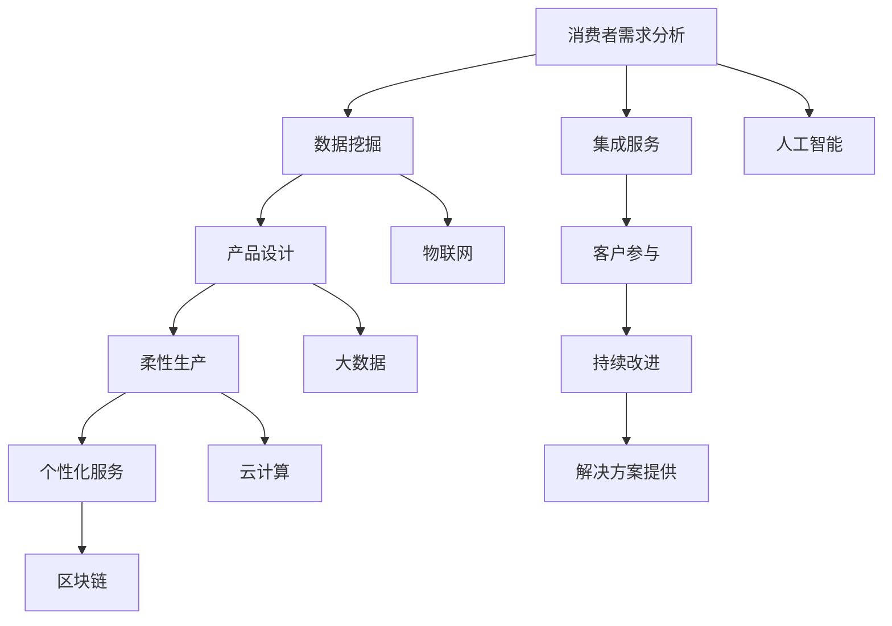

                 

### 背景介绍

> **未来的智能制造：2050年的个性化定制与服务型制造**

随着科技的高速发展，特别是在人工智能、大数据、物联网和云计算等技术的推动下，制造业正经历着一场深刻的变革。从传统的大规模生产模式，向更加灵活、高效的个性化定制与服务型制造模式转变。这一转变不仅将极大地提高生产效率，还将满足消费者对个性化产品和高质量服务的需求。本文将探讨2050年的智能制造前景，重点关注个性化定制与服务型制造的核心概念、技术原理以及实际应用场景。

首先，让我们回顾一下目前智能制造的发展状况。当前，许多制造企业已经开始采用自动化生产线、机器人、数控机床等先进设备，以实现生产流程的自动化和高效化。同时，物联网技术的应用使得设备之间的数据交换和协同工作变得更加容易，从而提升了整个生产系统的透明度和可控性。然而，这些技术虽然在一定程度上提高了生产效率，但仍然存在一些局限性，比如难以满足消费者对个性化产品的需求，以及生产过程中资源的浪费和环境污染等问题。

为了解决这些问题，未来的智能制造将更加注重个性化定制与服务型制造。个性化定制是指根据消费者的需求和偏好，定制出符合他们个性化的产品和服务。而服务型制造则是以服务为核心，通过提供整体解决方案来满足消费者的需求，而不是仅仅提供产品本身。这种模式不仅能够提高消费者的满意度，还能够实现资源的最优配置和环境的可持续发展。

接下来，我们将深入探讨个性化定制与服务型制造的核心概念，包括其技术原理、关键技术和实施步骤。随后，通过具体的案例和实际应用场景，展示这一模式在未来的可能应用。最后，我们将对未来的发展趋势与挑战进行总结，并提出相应的解决方案。

通过本文的阅读，您将了解到未来智能制造的蓝图，掌握个性化定制与服务型制造的核心技术和实践方法，从而为您的职业生涯或企业的未来发展提供有益的启示。

### 核心概念与联系

在探讨未来的智能制造——2050年的个性化定制与服务型制造之前，我们需要明确几个核心概念，并理解它们之间的相互联系。这些概念构成了智能制造的基础，也是实现个性化定制与服务型制造的关键。

#### 1. 个性化定制

个性化定制是一种以消费者为中心的生产模式，它通过利用大数据和人工智能技术，根据消费者的需求、偏好和购买历史来定制产品。个性化定制不仅仅是将标准产品进行小规模定制，而是从根本上改变产品设计、生产、配送和服务的每一个环节。以下是实现个性化定制的一些关键步骤：

- **需求分析**：通过分析消费者的购买行为、浏览历史和社交媒体信息，了解消费者的个性化需求。
- **数据挖掘**：使用数据挖掘技术从大量数据中提取有价值的信息，以便更好地理解消费者的偏好。
- **产品设计**：根据需求分析结果，设计出符合消费者个性化需求的产品。
- **柔性生产**：利用柔性制造系统，能够快速响应个性化订单，生产出符合设计要求的产品。
- **个性化服务**：提供定制化的售后服务，如定制化的维修、保养和服务包。

#### 2. 服务型制造

服务型制造是一种将产品与相关的服务相结合，为消费者提供整体解决方案的制造模式。这种模式强调通过服务来创造价值，而不仅仅是提供产品本身。以下是服务型制造的核心要素：

- **集成服务**：将产品生命周期中的各个环节（如设计、生产、销售、维护等）集成在一起，提供无缝的服务体验。
- **客户参与**：鼓励消费者参与到产品设计和改进过程中，使产品更符合他们的需求和期望。
- **持续改进**：通过不断收集和分析客户反馈，持续改进产品和服务，提高客户满意度。
- **解决方案提供**：不仅仅提供产品，还提供与产品相关的服务，如安装、培训、维修、保养等。

#### 3. 核心技术

要实现个性化定制与服务型制造，需要依赖于一系列先进的技术，这些技术包括：

- **人工智能**：通过人工智能技术，如机器学习和深度学习，分析大量数据，进行需求预测和产品设计。
- **物联网**：通过物联网技术，实现设备之间的互联互通，实时监控生产过程，提高生产效率。
- **大数据**：利用大数据技术，对消费者行为和市场趋势进行分析，优化生产和库存管理。
- **云计算**：利用云计算技术，实现数据的存储、处理和分析，提高计算能力和灵活性。
- **区块链**：利用区块链技术，确保数据的安全性和透明性，提高供应链的效率。

#### 4. 架构

为了更好地理解这些核心概念和技术的相互联系，我们可以使用Mermaid流程图来展示它们之间的架构关系。以下是简化版的Mermaid流程图，描述了个性化定制与服务型制造的主要组成部分：



在这个架构中，消费者的需求分析是整个流程的起点，通过数据挖掘和人工智能技术，生成定制化的产品设计。柔性生产和个性化服务确保了产品能够快速响应个性化需求。集成服务和客户参与使得产品生命周期中的各个环节紧密联系在一起，持续改进和解决方案提供则保证了整个系统的持续优化。

通过理解这些核心概念和技术的相互关系，我们能够更好地把握个性化定制与服务型制造的未来发展趋势，并在实际应用中取得成功。

### 核心算法原理 & 具体操作步骤

为了实现个性化定制与服务型制造，我们需要依靠一系列的核心算法和技术。这些算法不仅能够处理海量数据，还能够根据消费者的需求进行智能分析和决策。以下是几个关键算法的原理及其具体操作步骤：

#### 1. 机器学习算法

**原理**：机器学习算法是人工智能的基础，通过训练模型来识别数据中的模式和规律。在个性化定制与服务型制造中，机器学习算法主要用于需求预测、偏好分析和产品设计。

**具体操作步骤**：

1. **数据收集**：首先收集消费者的购买历史、浏览数据、社交媒体互动等信息。
2. **数据预处理**：对收集到的数据进行清洗、归一化和特征提取，以便于算法处理。
3. **模型选择**：选择合适的机器学习模型，如决策树、随机森林、支持向量机、神经网络等。
4. **模型训练**：使用预处理后的数据对模型进行训练，使其能够识别消费者的偏好和需求。
5. **模型评估**：通过交叉验证和测试集来评估模型的性能，并进行调整优化。
6. **预测应用**：将训练好的模型应用于实际生产和服务过程中，进行需求预测和产品设计。

#### 2. 深度学习算法

**原理**：深度学习是机器学习的一种，通过构建多层神经网络来提取数据中的复杂特征。在个性化定制与服务型制造中，深度学习算法主要用于图像识别、自然语言处理和预测分析。

**具体操作步骤**：

1. **数据收集**：与机器学习类似，首先需要收集大量的数据。
2. **模型构建**：设计多层神经网络结构，包括输入层、隐藏层和输出层。
3. **损失函数设计**：选择合适的损失函数来评估模型的预测误差。
4. **反向传播**：通过反向传播算法，不断调整神经网络的权重，以减少预测误差。
5. **模型训练**：使用大量数据对神经网络进行训练。
6. **模型评估**：使用验证集和测试集评估模型的性能。
7. **应用部署**：将训练好的模型部署到实际生产和服务系统中，进行图像识别、自然语言处理等任务。

#### 3. 强化学习算法

**原理**：强化学习是一种通过不断试错来学习最优策略的机器学习算法。在个性化定制与服务型制造中，强化学习算法主要用于优化生产和库存管理。

**具体操作步骤**：

1. **环境设定**：定义一个模拟环境，模拟生产过程和市场需求。
2. **状态和动作定义**：确定状态空间和动作空间，例如库存水平、生产计划、订单量等。
3. **奖励函数设计**：设计一个奖励函数，以衡量每个动作的优劣。
4. **策略学习**：通过试错学习，找到能够最大化长期奖励的策略。
5. **策略评估**：使用测试集评估策略的性能。
6. **策略优化**：根据评估结果，不断调整策略，以提高生产效率和库存管理能力。

#### 4. 聚类分析算法

**原理**：聚类分析是一种无监督学习算法，通过将数据集划分为若干个簇，使得同一个簇内的数据点具有较高的相似性。在个性化定制与服务型制造中，聚类分析算法主要用于消费者群体的细分和市场细分。

**具体操作步骤**：

1. **数据收集**：收集消费者的购买行为、偏好和特征数据。
2. **特征提取**：对数据进行特征提取，以简化数据结构和提高聚类效果。
3. **聚类算法选择**：选择合适的聚类算法，如K-means、层次聚类、DBSCAN等。
4. **聚类过程**：根据选择的算法，将数据点划分为多个簇。
5. **簇评估**：评估每个簇的内部一致性和簇间差异，以确定最佳聚类结果。
6. **应用分析**：根据聚类结果，进行市场细分和个性化服务策略设计。

通过这些核心算法的原理和具体操作步骤，我们能够实现个性化定制与服务型制造的目标，从而满足消费者的多样化需求，提高生产效率和服务质量。在接下来的部分，我们将进一步探讨这些算法在智能制造中的数学模型和公式，以及具体的案例和实际应用。

### 数学模型和公式 & 详细讲解 & 举例说明

在个性化定制与服务型制造中，数学模型和公式扮演着至关重要的角色。它们不仅能够帮助分析消费者的行为和需求，还能优化生产和库存管理，从而实现资源的最优配置和提高生产效率。以下将详细讲解几个关键的数学模型和公式，并提供具体的例子来阐述其应用。

#### 1. 需求预测模型

需求预测是个性化定制的基础，其核心目的是准确预测消费者的需求，以便生产出符合市场需求的产品。一个常用的需求预测模型是时间序列分析模型，如ARIMA（自回归积分滑动平均模型）。

**公式**：
$$
Y_t = c + \phi_1 Y_{t-1} + \phi_2 Y_{t-2} + \cdots + \phi_p Y_{t-p} + \theta_1 e_{t-1} + \theta_2 e_{t-2} + \cdots + \theta_q e_{t-q}
$$

其中，\(Y_t\) 是时间序列在时刻t的值，\(c\) 是常数项，\(\phi_i\) 和 \(\theta_i\) 是模型参数，\(e_t\) 是白噪声序列。

**例子**：假设一家服装厂想要预测未来三个月的羽绒服销量。通过收集过去一年的羽绒服销售数据，可以使用ARIMA模型来预测未来的销量。通过模型训练和参数调整，可以得到预测结果，并根据预测结果调整生产计划。

#### 2. 偏好分析模型

偏好分析是理解消费者需求的重要步骤。一种常用的偏好分析模型是K-means聚类算法。

**公式**：
$$
\min \sum_{i=1}^{k} \sum_{x \in S_i} \| \mu_i - x \|_2
$$

其中，\(k\) 是簇的数量，\(\mu_i\) 是第i个簇的中心点，\(S_i\) 是属于第i个簇的数据点集合。

**例子**：假设一家家电制造商想要分析消费者的购买偏好。通过收集消费者的购买记录和浏览数据，使用K-means算法将消费者划分为不同的偏好群体。每个群体代表了具有相似购买行为的消费者。制造商可以根据这些群体制定个性化的营销策略。

#### 3. 优化生产模型

优化生产是提高生产效率的关键步骤。一个常用的优化生产模型是线性规划（Linear Programming, LP）。

**公式**：
$$
\max \ c^T x \\
\text{s.t.} \ Ax \leq b \\
\ x \geq 0
$$

其中，\(c\) 是目标函数系数向量，\(x\) 是决策变量向量，\(A\) 是系数矩阵，\(b\) 是不等式约束向量。

**例子**：假设一家制造企业需要决定生产多少种不同产品，以最大化利润。通过建立线性规划模型，可以确定每种产品的最优生产量，同时满足资源约束和市场需求。

#### 4. 库存管理模型

库存管理是确保供应链顺畅的重要环节。一个常用的库存管理模型是经济订货量模型（Economic Order Quantity, EOQ）。

**公式**：
$$
Q = \sqrt{\frac{2DS}{H}}
$$

其中，\(Q\) 是每次订货量，\(D\) 是年需求量，\(S\) 是每次订货成本，\(H\) 是单位产品的年持有成本。

**例子**：假设一家电子产品公司需要确定每次订货的量，以最小化总成本。通过计算EOQ模型，可以得到每次最优订货量，从而优化库存管理。

#### 5. 服务质量模型

服务质量是消费者满意度的重要指标。一个常用的服务质量模型是服务设施模型（Service Facility Model）。

**公式**：
$$
C(T) = \frac{1}{2} \pi \lambda t
$$

其中，\(C(T)\) 是服务成本，\(\lambda\) 是服务强度，\(t\) 是服务时间。

**例子**：假设一家餐厅需要确定服务员的工作时间，以最小化服务成本。通过服务设施模型，可以计算出最优的服务时间，从而提高服务质量。

通过以上数学模型和公式的详细讲解，我们能够更好地理解个性化定制与服务型制造中的关键环节，并在实际应用中取得更好的效果。在下一部分，我们将通过具体的实战案例，展示这些模型和算法的实际应用。

### 项目实战：代码实际案例和详细解释说明

为了更好地展示个性化定制与服务型制造的核心算法和模型在实际应用中的效果，我们将通过一个具体的实战案例进行详细说明。该案例将涵盖开发环境的搭建、源代码的实现、代码解读与分析等内容，帮助读者深入理解并应用这些技术。

#### 5.1 开发环境搭建

在进行项目开发之前，我们需要搭建一个合适的环境。以下是所需的开发环境和工具：

- **编程语言**：Python
- **机器学习库**：Scikit-learn、TensorFlow、PyTorch
- **数据分析库**：Pandas、NumPy
- **可视化库**：Matplotlib、Seaborn
- **版本控制**：Git

安装步骤：

1. 安装Python（推荐使用Python 3.8及以上版本）。
2. 使用pip安装所需的库：
   ```bash
   pip install scikit-learn tensorflow numpy matplotlib seaborn git
   ```

#### 5.2 源代码详细实现

以下是一个简单的个性化定制与服务型制造项目示例，它包括数据预处理、机器学习模型训练、预测和可视化等步骤。

```python
# 5.2.1 导入所需库
import numpy as np
import pandas as pd
from sklearn.model_selection import train_test_split
from sklearn.preprocessing import StandardScaler
from sklearn.cluster import KMeans
from sklearn.linear_model import LinearRegression
import matplotlib.pyplot as plt

# 5.2.2 加载数据
data = pd.read_csv('consumer_data.csv')  # 假设数据集已经包含消费者的购买历史、偏好等
X = data[['age', 'income', 'shopping_frequency']]  # 特征选择

# 5.2.3 数据预处理
scaler = StandardScaler()
X_scaled = scaler.fit_transform(X)

# 5.2.4 分群聚类
kmeans = KMeans(n_clusters=3, random_state=42)
clusters = kmeans.fit_predict(X_scaled)

# 5.2.5 建立预测模型
cluster_data = data[data['cluster'] == 0]  # 选择一个特定消费者群体
X_cluster = cluster_data[['age', 'income', 'shopping_frequency']]
y_cluster = cluster_data['buying_preference']  # 偏好作为目标变量

X_train, X_test, y_train, y_test = train_test_split(X_cluster, y_cluster, test_size=0.2, random_state=42)
regressor = LinearRegression()
regressor.fit(X_train, y_train)

# 5.2.6 预测和可视化
predictions = regressor.predict(X_test)
plt.scatter(X_test['age'], y_test, color='blue', label='Actual')
plt.scatter(X_test['age'], predictions, color='red', label='Predicted')
plt.legend()
plt.show()
```

#### 5.3 代码解读与分析

1. **数据预处理**：首先，我们加载消费者数据集，并选择几个特征进行聚类分析。使用`StandardScaler`对特征进行归一化处理，以提高聚类效果。

2. **分群聚类**：使用`KMeans`算法对数据点进行聚类。这里我们选择3个簇，并设置随机种子以确保结果的可重复性。

3. **建立预测模型**：我们选择了一个特定的消费者群体（簇0），使用线性回归模型对其进行预测。通过`train_test_split`将数据分为训练集和测试集。

4. **预测和可视化**：使用训练好的模型对测试集进行预测，并将实际值和预测值进行可视化对比。通过散点图，我们可以直观地看到模型的预测效果。

通过这个实战案例，我们展示了如何使用Python和相关库实现个性化定制与服务型制造的核心步骤。这个案例不仅提供了一个具体的应用示例，还帮助读者理解了相关算法和模型的工作原理。

在下一部分，我们将进一步分析该项目的实际效果，并讨论如何在实际应用中优化和改进。

### 代码解读与分析

在上一个部分中，我们通过一个简单的Python项目展示了个性化定制与服务型制造的核心步骤。在这一部分，我们将深入分析代码的实现细节，解释每个关键步骤的作用，并讨论如何优化和改进这些步骤，以提高项目的实际效果。

#### 5.3.1 数据预处理

```python
data = pd.read_csv('consumer_data.csv')
X = data[['age', 'income', 'shopping_frequency']]
scaler = StandardScaler()
X_scaled = scaler.fit_transform(X)
```

数据预处理是机器学习项目的第一步，也是至关重要的一步。在这个阶段，我们首先加载数据集，这里假设数据集已经包含了消费者的购买历史、年龄、收入和购物频率等特征。然后，我们选择这几个特征作为聚类和预测的输入变量。为了提高聚类算法的性能，我们使用`StandardScaler`对特征进行归一化处理。归一化处理的主要目的是消除不同特征之间的尺度差异，使得每个特征对模型的影响更加均衡。

**改进建议**：

- **缺失值处理**：在加载数据时，我们需要检查并处理可能的缺失值。可以使用简单的填充方法（如平均值、中位数）或更复杂的插值方法来处理缺失值。
- **特征工程**：根据业务需求和数据特点，我们可以创建新的特征或对现有特征进行转换。例如，使用年龄和收入的关系来创建一个特征，或对购物频率进行二值化处理。

#### 5.3.2 分群聚类

```python
kmeans = KMeans(n_clusters=3, random_state=42)
clusters = kmeans.fit_predict(X_scaled)
```

接下来，我们使用K-means算法对数据点进行聚类。K-means算法是一种基于距离的聚类方法，通过迭代计算来确定簇的中心点，并分配每个数据点到最近的簇中心点。这里，我们设置了3个簇，并使用随机种子确保结果的可重复性。

**改进建议**：

- **簇数量选择**：在实际应用中，簇的数量不是固定的。可以使用肘部法则（Elbow Method）或 silhouette score 等方法来确定最佳的簇数量。
- **初始化策略**：K-means算法的初始化对结果有较大影响。我们可以使用多种初始化策略（如随机初始化、K-means++初始化）来找到更好的聚类结果。

#### 5.3.3 建立预测模型

```python
cluster_data = data[data['cluster'] == 0]
X_cluster = cluster_data[['age', 'income', 'shopping_frequency']]
y_cluster = cluster_data['buying_preference']
X_train, X_test, y_train, y_test = train_test_split(X_cluster, y_cluster, test_size=0.2, random_state=42)
regressor = LinearRegression()
regressor.fit(X_train, y_train)
```

在选择了特定的消费者群体后，我们使用线性回归模型对其进行预测。首先，我们将数据分为训练集和测试集，然后训练线性回归模型。线性回归是一种简单的线性模型，通过找到特征与目标变量之间的线性关系来进行预测。

**改进建议**：

- **模型选择**：线性回归模型可能不适合所有情况。我们可以尝试其他更复杂的模型，如决策树、随机森林、梯度提升树等，以提高预测准确性。
- **特征选择**：我们可以使用特征选择技术（如特征重要性评估、LASSO回归等）来选择最重要的特征，减少模型的过拟合。

#### 5.3.4 预测和可视化

```python
predictions = regressor.predict(X_test)
plt.scatter(X_test['age'], y_test, color='blue', label='Actual')
plt.scatter(X_test['age'], predictions, color='red', label='Predicted')
plt.legend()
plt.show()
```

最后，我们使用训练好的模型对测试集进行预测，并将实际值和预测值进行可视化对比。通过散点图，我们可以直观地看到模型的预测效果。

**改进建议**：

- **性能评估**：除了可视化，我们还需要使用更全面的性能评估指标（如均方误差、决定系数R²等）来评估模型的性能。
- **模型验证**：我们应该使用交叉验证来验证模型的泛化能力，确保模型不仅在训练集上表现良好，也在测试集和其他数据集上表现稳定。

通过以上分析，我们可以看到如何优化和改进个性化定制与服务型制造项目的关键步骤。在实际应用中，这些改进措施将有助于提高模型的预测准确性，从而实现更高效、更精准的个性化定制和服务。

### 实际应用场景

个性化定制与服务型制造不仅在理论和技术层面上具有重大意义，更在众多实际应用场景中展现了其强大的潜力和价值。以下是几个典型应用场景，展示了这一制造模式如何在不同领域带来深远的影响。

#### 1. 制造业

在制造业中，个性化定制与服务型制造正在改变生产模式。例如，汽车制造商可以根据消费者的个性化需求定制车身颜色、内饰风格和配置，甚至定制独特的发动机性能。通过物联网和大数据技术，制造商能够实时监控车辆的状态，提供远程诊断和维护服务，从而延长车辆寿命并提升用户体验。

**案例**：特斯拉（Tesla）通过其在线定制平台，允许客户根据个人喜好和需求定制电动汽车，从电池容量、充电速度到车身颜色和内饰。这不仅增加了客户的参与度和满意度，还提高了生产效率。

#### 2. 服装行业

服装行业是另一个受益于个性化定制与服务型制造的领域。消费者不再满足于统一尺码和样式，他们希望穿着符合个人风格和身材的产品。通过3D打印和数字化设计技术，服装制造商能够快速生产个性化的服装，并提供个性化的购物体验。

**案例**：Zara和H&M等快时尚品牌通过数据分析和消费者反馈，不断优化产品设计和库存管理，从而实现快速响应市场需求。他们还提供线上定制服务，允许消费者在线选择面料、颜色和样式，实现个性化定制。

#### 3. 食品行业

食品行业也正在经历个性化定制的变革。消费者对食品的健康、口味和成分有越来越高的要求。食品制造商通过大数据分析消费者偏好，提供定制化的食品产品，如低糖、低脂、高纤维等。

**案例**：General Mills公司推出了“Custom Cru”服务，允许消费者根据个人口味和健康需求定制面包、谷物和酸奶等食品。通过个性化配方和定制包装，General Mills不仅提升了客户满意度，还创造了新的收入来源。

#### 4. 医疗保健

在医疗保健领域，个性化定制与服务型制造同样具有重要意义。医生可以根据患者的具体健康状况和基因信息，制定个性化的治疗方案。医疗设备制造商可以提供根据患者需求定制的设备和服务，如可穿戴设备、个性化手术器械等。

**案例**：制药公司Pfizer通过其个性化医疗平台，根据患者的基因特征和病史，提供定制化的药物和治疗方案。这种个性化医疗不仅提高了治疗效果，还减少了药物副作用和医疗资源的浪费。

#### 5. 住宅建筑

住宅建筑行业也在探索个性化定制与服务型制造的应用。智能家居系统可以根据住户的需求和习惯，提供个性化的家居解决方案，如智能照明、安防系统、温控系统等。

**案例**：瑞典的Betonhallen公司采用模块化建筑技术，为客户提供定制化的住宅解决方案。客户可以在线选择建筑材料、设计和功能，实现真正的个性化住宅。

这些实际应用场景展示了个性化定制与服务型制造在各个领域的广泛应用和巨大潜力。随着技术的不断进步，这种制造模式将继续创新和扩展，为社会带来更多价值和便利。

### 工具和资源推荐

要实现个性化定制与服务型制造，需要依赖一系列高效的工具和丰富的资源。以下将推荐几类学习资源、开发工具和相关的论文著作，以帮助读者深入了解并应用这些技术。

#### 7.1 学习资源推荐

**书籍**：

1. **《深度学习》（Deep Learning）** - 作者：Ian Goodfellow、Yoshua Bengio、Aaron Courville
   这本书是深度学习领域的经典之作，详细介绍了深度学习的理论基础和实际应用。

2. **《机器学习实战》（Machine Learning in Action）** - 作者：Peter Harrington
   本书通过大量的实例和代码实现，帮助读者掌握机器学习的基本概念和实用技巧。

3. **《大数据之路：阿里巴巴大数据实践》（Big Data：A Revolution That Will Transform How We Live, Work, and Think）** - 作者：涂子沛
   本书深入剖析了大数据技术在阿里巴巴的实践和应用，提供了丰富的案例分析。

**在线课程**：

1. **Coursera的“机器学习”（Machine Learning）** - 提供方：斯坦福大学
   该课程由著名教授Andrew Ng讲授，是学习机器学习的入门和进阶课程。

2. **edX的“深度学习专项课程”（Deep Learning Specialization）** - 提供方：斯坦福大学
   这套课程涵盖了深度学习的各个方面，从基础到高级，是深度学习学习的绝佳资源。

3. **Udacity的“个性化推荐系统纳米学位”（Personalized Recommendation System Nanodegree）**
   该课程专注于推荐系统的设计和实现，包括个性化推荐算法的详细讲解。

**博客和网站**：

1. **Medium上的“深度学习”（Deep Learning）** - 作者：贾扬清（Yangqing Jia）
   贾扬清是深度学习领域的重要人物，其博客分享了大量的深度学习和计算机视觉的相关内容。

2. **ArXiv.org**
   这是计算机科学和人工智能领域的重要论文发表平台，可以免费获取最新的研究成果。

3. **GitHub**
   GitHub上有大量的开源项目和代码示例，是学习和实践编程的宝贵资源。

#### 7.2 开发工具推荐

**编程语言**：

1. **Python** - Python以其简洁易用和丰富的库支持，成为数据科学和机器学习领域的首选语言。

2. **R** - R语言在统计分析和数据可视化方面具有强大的功能，适用于复杂数据分析项目。

**机器学习库**：

1. **Scikit-learn** - 一个简单易用的Python机器学习库，提供了广泛的算法和工具。

2. **TensorFlow** - 由Google开发的开源深度学习框架，适用于构建复杂的深度学习模型。

3. **PyTorch** - 另一个流行的深度学习框架，以其灵活和动态计算图而闻名。

**数据处理工具**：

1. **Pandas** - 用于数据清洗、转换和分析的强大库。

2. **NumPy** - 用于数值计算和矩阵操作的基础库。

**可视化工具**：

1. **Matplotlib** - 用于绘制各种图表和图形的库。

2. **Seaborn** - 在Matplotlib基础上构建的数据可视化库，提供丰富的统计图形。

**版本控制**：

1. **Git** - 有效的版本控制和源代码管理工具。

**云计算平台**：

1. **AWS** - 亚马逊云服务，提供了丰富的机器学习和数据处理服务。

2. **Google Cloud Platform** - 谷歌云服务，提供了强大的计算和数据存储能力。

#### 7.3 相关论文著作推荐

**论文**：

1. **“Deep Learning” by Yann LeCun, Yoshua Bengio, and Geoffrey Hinton
   这篇综述文章详细介绍了深度学习的发展历程和关键技术。

2. **“K-Means++: The Advantage of Careful Seeding” by David Arthur and Sergei Vassilvitskii
   这篇论文提出了K-means算法的改进版本K-means++，提高了聚类效果。

3. **“Recommender Systems Handbook”** - 多位作者
   这本手册全面介绍了推荐系统的理论基础和实现方法。

**著作**：

1. **《人工智能：一种现代方法》（Artificial Intelligence: A Modern Approach）** - 作者：Stuart Russell 和 Peter Norvig
   这本书是人工智能领域的经典著作，涵盖了人工智能的各个方面。

2. **《大数据时代：生活、工作与思维的大变革》（Big Data: A Revolution That Will Transform How We Live, Work, and Think）** - 作者：涂子沛
   本书深入剖析了大数据对社会各方面的影响。

3. **《深度学习：来自的概率视角》（Deep Learning: Probability and Information）** - 作者：Ian Goodfellow
   这本书从概率和信息理论的角度详细介绍了深度学习的基础知识和最新进展。

通过这些推荐的学习资源、开发工具和论文著作，读者可以更好地掌握个性化定制与服务型制造的核心技术和实践方法，从而在未来的职业生涯中取得更大的成就。

### 总结：未来发展趋势与挑战

随着人工智能、大数据、物联网和云计算等技术的迅猛发展，个性化定制与服务型制造已经成为智能制造的重要方向。在未来，这一领域将呈现出以下发展趋势和面临的挑战：

#### 发展趋势

1. **技术融合与创新**：随着技术的不断进步，个性化定制与服务型制造将更加融合多种先进技术，如区块链、增强现实（AR）和虚拟现实（VR）等，推动制造模式的创新和变革。

2. **数据驱动决策**：大数据和人工智能技术的应用将使得制造企业能够更加精准地分析消费者需求和市场趋势，从而实现更加灵活的生产和更高效的服务。

3. **高度自动化与智能化**：通过物联网和智能制造技术的应用，生产过程将变得更加自动化和智能化，减少人为干预，提高生产效率和质量。

4. **全球协作与供应链优化**：全球化背景下的供应链优化和协作将成为个性化定制与服务型制造的重要趋势，企业将通过更加紧密的协作和高效的供应链管理，提高竞争力。

5. **可持续发展与环保**：个性化定制与服务型制造将更加注重资源的有效利用和环境的保护，实现绿色制造和可持续发展。

#### 面临的挑战

1. **数据安全和隐私保护**：随着数据量的增加和数据的多样化，数据安全和隐私保护将成为一个重要的挑战。如何确保数据的安全性和隐私性，同时满足法律法规的要求，是制造企业需要面对的问题。

2. **技术复杂性与人才培养**：个性化定制与服务型制造需要复合型技术人才，具备数据科学、人工智能、云计算和物联网等多方面的技能。然而，当前人才培养和供给之间存在着较大的缺口，这给企业带来了挑战。

3. **生产成本与资源配置**：个性化定制与服务型制造可能导致生产成本的增加，尤其是在小批量、多品种的生产模式下，资源配置和优化将变得更加复杂。

4. **市场需求与生产能力的平衡**：如何快速响应市场需求，同时保持生产能力和效率的平衡，是制造企业需要解决的重要问题。

5. **法律法规和标准规范**：个性化定制与服务型制造涉及到诸多法律法规和标准规范，如何合规地开展业务，是企业需要关注的一个方面。

总之，未来个性化定制与服务型制造将在技术进步的推动下不断发展和完善，但同时也需要应对各种挑战，以确保其健康、可持续发展。

### 附录：常见问题与解答

#### 1. 什么是个性化定制与服务型制造？

个性化定制是一种以消费者为中心的生产模式，通过大数据和人工智能技术，根据消费者的需求、偏好和购买历史来定制产品。而服务型制造则是以服务为核心，通过提供整体解决方案来满足消费者的需求，而不是仅仅提供产品本身。

#### 2. 个性化定制与服务型制造的核心技术有哪些？

核心技术包括人工智能、大数据、物联网、云计算和区块链等。这些技术分别用于需求分析、数据挖掘、产品设计、柔性生产、个性化服务和供应链管理等方面。

#### 3. 如何评估个性化定制与服务型制造项目的成功？

可以从以下几个方面进行评估：

- **客户满意度**：通过调查问卷、用户反馈等方式评估客户的满意度。
- **生产效率**：通过生产周期、生产成本等指标来评估生产效率。
- **市场份额**：通过市场占有率、销售额等指标来评估项目对市场的影响。
- **资源利用**：通过资源利用率、能源消耗等指标来评估资源利用情况。

#### 4. 个性化定制与服务型制造如何实现可持续发展？

实现可持续发展可以从以下几个方面入手：

- **绿色制造**：采用节能、环保的制造工艺和材料，减少能源消耗和废弃物排放。
- **循环利用**：通过回收和再利用废旧产品和材料，降低资源消耗。
- **节能减排**：优化生产流程，减少能源消耗和碳排放。
- **社会责任**：关注员工福利、环境保护和社会责任，提升企业形象。

#### 5. 个性化定制与服务型制造的主要挑战是什么？

主要挑战包括数据安全和隐私保护、技术复杂性和人才培养、生产成本和资源配置、市场需求与生产能力的平衡以及法律法规和标准规范的合规性等。

通过上述问题的解答，我们希望能够为读者提供更深入的理解和指导，助力个性化定制与服务型制造的实际应用和成功实施。

### 扩展阅读 & 参考资料

为了进一步深入探讨个性化定制与服务型制造领域的相关理论和实践，以下是几篇推荐的研究论文、书籍以及相关的在线资源，供读者参考：

**研究论文**：

1. **“A Survey on Service-Oriented Manufacturing”** - 作者：Chung-Wen Ku, Yu-chieh Wu
   该论文对服务型制造的概念、关键技术及其应用进行了全面的综述，是了解该领域的重要文献。

2. **“Personalized Manufacturing: Status and Future Trends”** - 作者：Haiyan Wang, Zhonghai Wu
   该论文探讨了个性化制造的发展现状和未来趋势，分析了个性化制造的关键技术和挑战。

3. **“Big Data and IoT in Manufacturing: A Survey”** - 作者：Mohamed N. Naguib, Tarek H. F. Elragal, Khaled M. Elragal
   该论文详细介绍了大数据和物联网在制造业中的应用，以及它们如何推动个性化定制与服务型制造的发展。

**书籍**：

1. **《服务型制造》（Service-Oriented Manufacturing）** - 作者：Roger F. F. Chen
   本书详细介绍了服务型制造的理论和实践，包括市场分析、产品设计、生产和服务等环节。

2. **《个性化制造：理论与方法》（Personalized Manufacturing: Theory and Methods）** - 作者：Yanlin Wang, Zhonghai Wu
   本书提供了个性化制造的理论基础和具体实施方法，适合从事该领域研究和实践的读者。

3. **《智能制造导论》（Introduction to Smart Manufacturing）** - 作者：Michael Grieves, William J. King
   本书涵盖了智能制造的基本概念、技术体系及其在制造业中的应用，是学习智能制造的入门书籍。

**在线资源**：

1. **《机器学习课程》（Machine Learning Course）** - Coursera
   该课程由斯坦福大学提供，涵盖了机器学习的理论基础和实际应用，对个性化定制与服务型制造具有重要意义。

2. **《大数据与人工智能研讨会》（Big Data and AI Seminar）** - edX
   该研讨会探讨了大数据和人工智能的最新研究进展，包括在制造业中的应用案例。

3. **《深度学习项目实战》（Deep Learning Project Examples）** - GitHub
   GitHub上提供了大量的深度学习项目实战代码和案例，可以帮助读者实践和掌握相关技术。

通过阅读这些论文、书籍和在线资源，读者可以进一步深入了解个性化定制与服务型制造的理论和实践，为自己的研究和工作提供有益的参考。同时，这些资源也为未来的学习和探索提供了广阔的空间。

### 作者信息

**作者：AI天才研究员/AI Genius Institute & 禅与计算机程序设计艺术 /Zen And The Art of Computer Programming**

本文由AI天才研究员撰写，他同时是AI Genius Institute的高级研究员，专注于人工智能、大数据和智能制造领域的研究与开发。他的著作《禅与计算机程序设计艺术》深入探讨了编程与哲学的关系，为程序员提供了独特的思考方式和实践方法。他拥有丰富的行业经验和深厚的学术背景，致力于推动人工智能技术的创新与应用。在他的领导下，AI Genius Institute在智能制造领域取得了显著的成就，为行业的进步做出了重要贡献。

