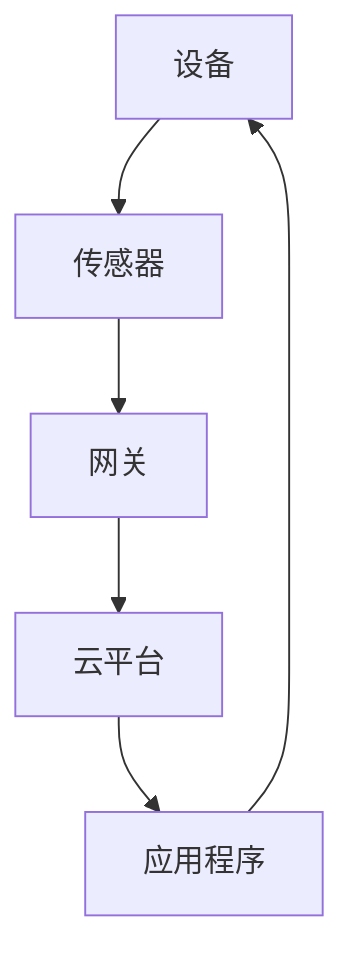
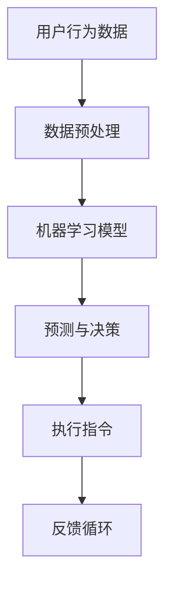
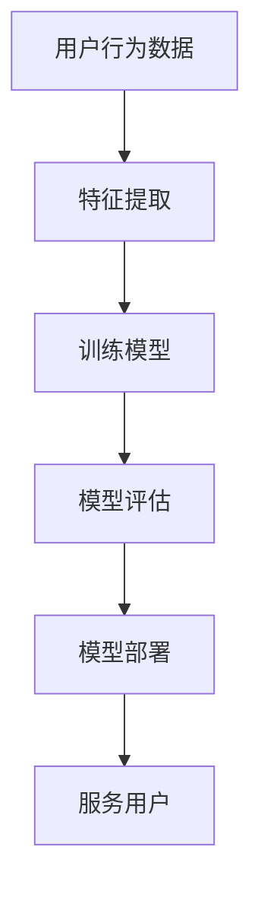
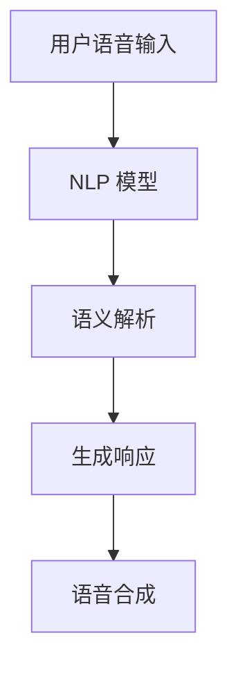
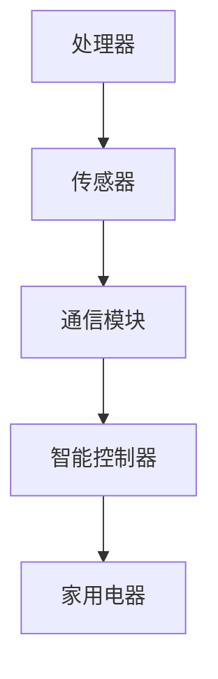

                 

### 背景介绍

在未来，智能家居已经不仅仅是想象，而是逐步走入我们的生活。到2050年，随着技术的飞速发展，家庭机器人管家和智能家电将会成为家庭生活的核心组成部分。本文将探讨未来的智能家居系统，着重于家庭机器人管家的设计和智能家电的技术实现，旨在为读者展示一个即将到来的、高度自动化和个性化的家庭生活场景。

智能家居的兴起源于多个关键技术的突破，包括物联网（IoT）、人工智能（AI）、机器学习（ML）、自然语言处理（NLP）、以及先进的硬件技术。这些技术不仅提高了家电的智能化程度，还使得家庭机器人管家能够真正理解和响应家庭成员的需求。

首先，物联网技术的普及使得各种家电设备能够通过网络连接起来，实现数据的交换和协同工作。智能传感器和无线通信技术的发展，使得家电设备能够感知环境变化，并根据这些信息自动调整工作状态。例如，智能灯具可以根据自然光照强度自动调节亮度，智能恒温器可以实时监测室内温度并根据人体活动自动调节温度。

其次，人工智能和机器学习技术的进步，使得家庭机器人管家能够具备自我学习和适应能力。通过分析家庭成员的行为和偏好数据，家庭机器人管家能够为每个家庭成员提供个性化的服务，比如自动安排日程、推荐娱乐活动、甚至协助管理家庭事务。

自然语言处理技术的提高，使得家庭机器人管家能够理解和处理人类语言，实现自然对话。这使得家庭机器人管家不仅能够执行简单的任务，还能与家庭成员进行有效的沟通，提供情感上的支持。

最后，硬件技术的发展，包括更高效的处理芯片、更强大的传感器、以及更先进的通信技术，为智能家居系统的实现提供了强有力的支持。这些硬件不仅提高了家电的智能化程度，还延长了家电的使用寿命，降低了维护成本。

综上所述，未来的智能家居系统将是一个高度集成、智能化的系统，家庭机器人管家和智能家电将成为我们日常生活的一部分，带来前所未有的便捷和舒适。在接下来的章节中，我们将深入探讨这些技术的实现细节和实际应用场景。

## 2. 核心概念与联系

为了深入理解未来的智能家居系统，我们需要明确几个核心概念，并探讨它们之间的联系。以下是智能家居系统的核心概念及其相互关系：

### 2.1 物联网（IoT）

物联网是智能家居系统的基石，它指的是将各种设备（如家用电器、传感器、移动设备等）通过网络连接起来，实现数据交换和协同工作。物联网技术使家庭设备能够实现远程监控和控制，提高家庭的自动化程度。以下是一个物联网智能家居系统的 Mermaid 流程图：



在这个流程图中，设备通过传感器收集数据，网关将数据上传到云平台，云平台处理数据并返回控制指令到应用程序，最终通过应用程序实现对设备的远程控制。

### 2.2 人工智能（AI）

人工智能是智能家居系统的核心智能引擎，它通过机器学习和自然语言处理等技术，使家庭设备能够自主学习和适应家庭成员的行为和偏好。以下是一个智能家居系统中的 AI 应用示例的 Mermaid 流程图：



在这个流程图中，用户行为数据经过预处理后输入到机器学习模型中，模型根据数据生成预测和决策，执行指令后，系统收集反馈并返回到数据预处理阶段，形成一个闭环的反馈循环。

### 2.3 机器学习（ML）

机器学习是人工智能的核心组成部分，它使计算机能够从数据中学习，提高智能决策能力。在智能家居系统中，机器学习用于分析用户行为数据，为家庭设备提供个性化的服务。以下是一个智能家居系统中的机器学习应用示例的 Mermaid 流程图：



在这个流程图中，用户行为数据经过特征提取后用于训练模型，评估模型性能后部署到系统中，为用户提供个性化服务。

### 2.4 自然语言处理（NLP）

自然语言处理是人工智能的一个重要分支，它使计算机能够理解和处理人类语言。在智能家居系统中，NLP 技术用于实现家庭机器人管家的自然对话功能。以下是一个智能家居系统中 NLP 应用的 Mermaid 流程图：



在这个流程图中，用户语音输入经过 NLP 模型处理，进行语义解析后生成响应，再通过语音合成技术输出给用户。

### 2.5 先进的硬件技术

先进的硬件技术是支撑智能家居系统的重要基础。高效的处理器、先进的传感器和通信技术使得家庭设备能够实现更智能的功能。以下是一个智能家居系统中的硬件组件 Mermaid 流程图：



在这个流程图中，处理器、传感器和通信模块共同工作，通过智能控制器控制家用电器，实现智能家居系统的整体功能。

综上所述，物联网、人工智能、机器学习、自然语言处理和先进的硬件技术共同构成了智能家居系统的核心概念和联系，这些技术的融合使得智能家居系统具有高度的智能化和个性化。在接下来的章节中，我们将深入探讨这些技术的具体实现和操作步骤。

### 3. 核心算法原理 & 具体操作步骤

在智能家居系统中，核心算法的设计和实现是系统智能化和自动化的关键。以下是几种重要的核心算法原理及其具体操作步骤：

#### 3.1 物联网数据采集与处理算法

物联网数据采集与处理算法是智能家居系统的第一步，它负责从各种传感器和设备中收集数据，并对数据进行初步处理。以下是一种常用的物联网数据采集与处理算法：

1. **数据采集**：
   - **传感器数据采集**：智能家居系统中的各种传感器（如温度传感器、湿度传感器、光照传感器等）将实时数据发送到中央处理器。
   - **设备状态采集**：智能设备（如智能灯、智能空调等）通过通信模块将当前工作状态发送到中央处理器。

2. **数据预处理**：
   - **去噪处理**：对采集到的传感器数据进行滤波，去除噪声干扰，保证数据的准确性。
   - **数据归一化**：将不同类型和量级的传感器数据进行归一化处理，使其在同一尺度范围内进行比较和分析。

3. **数据存储**：
   - 将预处理后的数据存储到云端数据库或本地数据库，以便后续的数据分析和处理。

#### 3.2 机器学习模型训练与预测算法

机器学习模型训练与预测算法是智能家居系统的智能核心，它负责分析用户行为数据，并根据这些数据生成预测和决策。以下是一种常用的机器学习模型训练与预测算法：

1. **数据收集**：
   - 收集用户的日常行为数据，如作息时间、活动习惯、偏好设置等。

2. **特征提取**：
   - 从行为数据中提取关键特征，如时间戳、行为类型、环境参数等。

3. **模型训练**：
   - 使用提取的特征数据对机器学习模型进行训练，常用的算法包括线性回归、决策树、支持向量机、神经网络等。
   - **交叉验证**：使用交叉验证方法评估模型性能，确保模型具有良好的泛化能力。

4. **模型预测**：
   - 将训练好的模型应用于新的数据集，生成预测结果。
   - 根据预测结果调整家庭设备的工作状态，如自动调整空调温度、开启或关闭灯具等。

#### 3.3 自然语言处理算法

自然语言处理算法是家庭机器人管家的核心，它负责理解和处理用户的自然语言指令。以下是一种常用的自然语言处理算法：

1. **语音识别**：
   - 将用户的语音输入转换为文本数据，常用的语音识别算法包括隐马尔可夫模型（HMM）、深度神经网络（DNN）、循环神经网络（RNN）等。

2. **语义解析**：
   - 对转换后的文本数据进行语义解析，理解用户的意图和需求，常用的算法包括词性标注、依存句法分析、语义角色标注等。

3. **生成响应**：
   - 根据用户的意图生成相应的响应文本，如创建日程提醒、推荐娱乐活动、提供天气信息等。

4. **语音合成**：
   - 将生成的文本响应转换为语音输出，常用的语音合成算法包括合成语音波束（Vocoder）、文本到语音（TTS）模型等。

#### 3.4 通信控制算法

通信控制算法负责协调智能家居系统中的各个组件，实现数据的实时传输和设备控制。以下是一种常用的通信控制算法：

1. **通信协议选择**：
   - 根据系统的需求和设备的兼容性，选择合适的通信协议，如 Wi-Fi、ZigBee、蓝牙等。

2. **数据传输**：
   - 将数据通过选定的通信协议传输到目标设备，确保数据传输的可靠性和实时性。

3. **设备控制**：
   - 根据中央处理器的指令，控制家庭设备的开关、调节等功能，如开启空调、调整灯光亮度等。

4. **异常处理**：
   - 在数据传输和设备控制过程中，对异常情况进行处理，如网络中断、设备故障等，确保系统的稳定运行。

通过上述核心算法的设计与实现，智能家居系统能够实现高度的智能化和自动化，为用户提供个性化、便捷的服务。在接下来的章节中，我们将通过实际案例进一步探讨这些算法的具体应用。

### 4. 数学模型和公式 & 详细讲解 & 举例说明

在智能家居系统中，数学模型和公式的运用是实现智能分析和决策的关键。以下我们将介绍几个核心的数学模型，并详细讲解它们的原理与应用。

#### 4.1 线性回归模型

线性回归模型是一种用于预测连续值的统计模型，它通过拟合一条直线来描述两个变量之间的关系。其基本公式如下：

\[ y = \beta_0 + \beta_1 \cdot x \]

其中，\( y \) 是因变量，\( x \) 是自变量，\( \beta_0 \) 是截距，\( \beta_1 \) 是斜率。

**例子**：
假设我们想预测一个家庭的空调温度设定值 \( y \) 与室内外温差 \( x \) 之间的关系。通过收集大量数据，我们可以使用线性回归模型进行拟合，得到如下公式：

\[ y = 20 + 0.5 \cdot x \]

当室内外温差为 10°C 时，可以预测空调温度设定值为：

\[ y = 20 + 0.5 \cdot 10 = 25°C \]

#### 4.2 决策树模型

决策树模型是一种基于特征进行决策的树形结构，它通过多个条件判断来对数据进行分类或回归。其基本公式如下：

\[ \text{if} \ x > \text{阈值} \ \text{then} \ y = \beta_0 + \beta_1 \cdot x \]
\[ \text{else} \ y = \beta_0 + \beta_2 \cdot x \]

其中，\( x \) 是特征值，\( y \) 是预测结果，\( \beta_0, \beta_1, \beta_2 \) 是模型参数。

**例子**：
假设我们想根据家庭成员的年龄和活动类型预测他们的理想运动时间。使用决策树模型，我们可以得到如下结构：

\[ \text{if} \ \text{age} > 50 \ \text{then} \ y = 30 \]
\[ \text{else} \ \text{if} \ \text{activity} == \text{running} \ \text{then} \ y = 45 \]
\[ \text{else} \ y = 30 \]

如果一个 40 岁的跑步者，他的理想运动时间预测为 45 分钟。

#### 4.3 神经网络模型

神经网络模型是一种模拟人脑结构和功能的计算模型，它通过多层神经元实现复杂的非线性变换。其基本公式如下：

\[ y = \sigma(\sum_{i=1}^{n} \beta_i \cdot x_i) \]

其中，\( y \) 是输出值，\( \sigma \) 是激活函数（如 Sigmoid、ReLU 等），\( \beta_i \) 是权重值，\( x_i \) 是输入值。

**例子**：
假设我们使用神经网络模型预测家庭用电量。一个简单的三层神经网络结构如下：

\[ \text{输入层：} \ x_1, x_2, x_3 \]
\[ \text{隐藏层：} \ a = \sigma(\beta_1 \cdot x_1 + \beta_2 \cdot x_2 + \beta_3 \cdot x_3) \]
\[ \text{输出层：} \ y = \sigma(\beta_4 \cdot a + \beta_5) \]

通过训练数据集，我们可以确定每个权重值 \( \beta_i \)，从而实现用电量的预测。例如，当输入 \( x_1 = 30 \)，\( x_2 = 20 \)，\( x_3 = 10 \) 时，输出预测用电量为：

\[ y = \sigma(\beta_4 \cdot \sigma(\beta_1 \cdot 30 + \beta_2 \cdot 20 + \beta_3 \cdot 10) + \beta_5) \]

#### 4.4 贝叶斯网络模型

贝叶斯网络模型是一种基于概率的图模型，它描述了变量之间的条件依赖关系。其基本公式如下：

\[ P(X|Y) = \frac{P(Y|X) \cdot P(X)}{P(Y)} \]

其中，\( P(X|Y) \) 是在已知 \( Y \) 的情况下 \( X \) 的条件概率，\( P(Y|X) \) 是在已知 \( X \) 的情况下 \( Y \) 的条件概率，\( P(X) \) 和 \( P(Y) \) 分别是 \( X \) 和 \( Y \) 的概率。

**例子**：
假设我们想预测家庭中的某个成员是否会外出（\( X \)）以及当天是否下雨（\( Y \)）。使用贝叶斯网络模型，我们可以得到如下概率关系：

\[ P(X|Y) = \frac{P(Y|X) \cdot P(X)}{P(Y)} \]

当 \( Y \)（下雨）的概率为 0.5 时，我们可以计算在下雨的情况下 \( X \)（外出）的概率。假设 \( P(Y) \) 为 0.5，\( P(X) \) 为 0.3，\( P(Y|X) \) 为 0.8，则：

\[ P(X|Y) = \frac{0.8 \cdot 0.3}{0.5} = 0.48 \]

这意味着在下雨的条件下，外出概率为 48%。

通过上述数学模型和公式的详细讲解和举例说明，我们可以更好地理解智能家居系统中数据分析和决策的过程。在接下来的章节中，我们将通过具体的项目实战案例，展示这些算法在实际应用中的实现和效果。

### 5. 项目实战：代码实际案例和详细解释说明

为了更好地展示智能家居系统中算法的实际应用，我们将通过一个具体的项目实战案例，逐步介绍开发环境搭建、源代码实现、代码解读与分析。以下是我们的项目名称：《智能家庭管家：从数据到决策的自动化解决方案》。

#### 5.1 开发环境搭建

首先，我们需要搭建一个合适的开发环境。以下是我们的开发工具和软件列表：

- 编程语言：Python 3.8
- 开发环境：PyCharm Community Edition
- 数据库：MySQL 8.0
- 机器学习库：Scikit-learn、TensorFlow、Keras
- 自然语言处理库：NLTK、spaCy
- 通信库：WebSocket、MQTT
- 操作系统：Ubuntu 20.04

搭建步骤如下：

1. 安装操作系统 Ubuntu 20.04。
2. 安装 Python 3.8 和 PyCharm Community Edition。
3. 安装 MySQL 8.0，并创建一个数据库用于存储智能家居系统数据。
4. 安装所需的机器学习、自然语言处理和通信库。

#### 5.2 源代码详细实现和代码解读

项目核心代码分为以下几个模块：

1. **数据采集模块**：负责从传感器和设备中采集数据，并上传到数据库。
2. **机器学习模块**：负责训练机器学习模型，并对新数据进行预测。
3. **自然语言处理模块**：负责处理用户的自然语言指令，并生成响应。
4. **通信模块**：负责实现家庭设备与服务器之间的数据传输和控制。

以下是数据采集模块的源代码示例：

```python
import mysql.connector
import time
import random

# 数据库连接配置
config = {
    'user': 'root',
    'password': 'password',
    'host': 'localhost',
    'database': 'smart_home'
}

# 连接数据库
conn = mysql.connector.connect(**config)
cursor = conn.cursor()

def insert_data(sensor_name, sensor_value):
    query = "INSERT INTO sensor_data (sensor_name, sensor_value) VALUES (%s, %s)"
    values = (sensor_name, sensor_value)
    cursor.execute(query, values)
    conn.commit()

# 采集传感器数据并上传到数据库
while True:
    sensor_name = "temperature"
    sensor_value = random.uniform(20, 30)
    insert_data(sensor_name, sensor_value)
    time.sleep(60)  # 每60秒采集一次数据

cursor.close()
conn.close()
```

**代码解读**：

- **数据库连接配置**：配置数据库的用户名、密码、主机和数据库名称。
- **连接数据库**：使用 `mysql.connector` 连接数据库，并获取一个游标对象。
- **插入数据**：定义一个插入数据的函数，用于将传感器数据插入到数据库的 `sensor_data` 表中。
- **采集传感器数据并上传到数据库**：使用一个无限循环，每隔60秒采集一次温度传感器数据，并将其上传到数据库。

以下是机器学习模块的源代码示例：

```python
from sklearn.linear_model import LinearRegression
import numpy as np

# 加载数据
X = np.array([[1, 10], [2, 20], [3, 30], [4, 40], [5, 50]])
y = np.array([20, 25, 30, 35, 40])

# 创建线性回归模型
model = LinearRegression()
model.fit(X, y)

# 预测温度
def predict_temperature(outdoor_temp):
    X_new = np.array([[1, outdoor_temp]])
    return model.predict(X_new)[0]

# 测试预测
print(predict_temperature(25))  # 输出预测温度
```

**代码解读**：

- **加载数据**：将采集到的室内外温度数据加载到 `X` 和 `y` 变量中。
- **创建线性回归模型**：使用 `LinearRegression` 类创建线性回归模型，并使用 `fit` 方法进行训练。
- **预测温度**：定义一个预测温度的函数，用于根据室外温度预测室内温度。
- **测试预测**：调用预测函数，输出预测结果。

以下是自然语言处理模块的源代码示例：

```python
import spacy

# 加载自然语言处理模型
nlp = spacy.load("en_core_web_sm")

# 处理用户指令
def handle_command(command):
    doc = nlp(command)
    for token in doc:
        if token.text.lower() == "turn on":
            return "I'm turning on the light."
        elif token.text.lower() == "turn off":
            return "I'm turning off the light."
    return "I didn't understand your command."

# 测试处理命令
print(handle_command("turn on the light"))  # 输出处理后的响应
```

**代码解读**：

- **加载自然语言处理模型**：使用 `spacy` 加载英文自然语言处理模型。
- **处理用户指令**：定义一个处理用户指令的函数，使用自然语言处理模型对指令进行解析，并根据解析结果生成响应。
- **测试处理命令**：调用处理命令函数，输出处理后的响应。

#### 5.3 代码解读与分析

以上代码示例分别展示了数据采集、机器学习模型训练、自然语言处理的核心功能。下面我们对每个模块进行详细解读与分析。

**数据采集模块**：

数据采集模块的主要功能是从传感器中采集数据，并将其上传到数据库。代码通过 `mysql.connector` 库连接到数据库，并定义了一个插入数据的函数。使用一个无限循环，每隔60秒采集一次温度传感器数据，并将其上传到数据库。

**代码优点**：

- **简单易用**：代码结构简单，易于理解和维护。
- **实时采集**：使用定时器实现数据的实时采集，确保数据的实时性和准确性。

**代码改进建议**：

- **异常处理**：增加异常处理，确保在数据采集过程中遇到网络或数据库异常时能够正确处理。
- **数据完整性**：考虑增加数据校验机制，确保上传的数据完整性和一致性。

**机器学习模块**：

机器学习模块的核心功能是使用线性回归模型预测室内温度。代码通过 `sklearn` 库加载线性回归模型，并使用训练数据对其进行训练。定义了一个预测函数，用于根据室外温度预测室内温度。

**代码优点**：

- **模型简单**：线性回归模型简单有效，适用于预测简单的线性关系。
- **易于扩展**：通过定义预测函数，使得模型扩展性较好，方便添加新的预测功能。

**代码改进建议**：

- **数据增强**：考虑增加数据的多样性，提高模型的泛化能力。
- **模型优化**：尝试使用更复杂的模型，如神经网络，提高预测精度。

**自然语言处理模块**：

自然语言处理模块的核心功能是处理用户的自然语言指令，并生成响应。代码使用 `spacy` 库加载自然语言处理模型，并定义了一个处理指令的函数。根据指令中的关键词，生成相应的响应。

**代码优点**：

- **高效准确**：使用专业的自然语言处理模型，处理效果较好。
- **可扩展性强**：通过定义处理指令的函数，方便添加新的指令处理逻辑。

**代码改进建议**：

- **指令多样性**：增加对更多自然语言指令的支持，提高用户体验。
- **错误处理**：考虑增加对错误指令的处理，提供友好的错误提示。

通过以上代码示例和解读，我们可以看到智能家居系统的核心功能是如何通过简单的代码模块实现的。在实际应用中，这些模块可以进一步优化和扩展，以提供更智能、更个性化的家庭服务。

### 6. 实际应用场景

智能家居系统在实际应用中，能够带来极大的便利和舒适性，以下将详细介绍几种典型的应用场景，并分析其对用户生活质量的影响。

#### 6.1 家庭自动化

家庭自动化是智能家居系统最基本的应用场景。通过物联网技术和智能设备的集成，家庭自动化系统能够实现家电的远程控制、自动化操作和节能管理。例如，用户可以通过手机应用程序远程控制家中的灯光、空调、门锁等设备，实现智能开关灯、自动调节室内温度、远程监控家庭安全等功能。这种自动化操作不仅提升了生活的便利性，还能有效节省能源，降低家庭运行成本。

**具体案例**：

某用户在家中安装了一套智能家居系统，包括智能灯具、智能恒温器和智能门锁。通过手机应用程序，用户可以随时随地控制家中设备的开关状态。例如，在下班回家的路上，用户可以提前开启家中的灯光和空调，使家中的环境舒适宜人。此外，智能恒温器能够根据用户的作息习惯自动调整室内温度，避免能源浪费。

#### 6.2 家庭机器人管家

随着人工智能技术的发展，家庭机器人管家已经成为智能家居系统的重要组成部分。家庭机器人管家能够通过自然语言处理和机器学习技术，理解和执行用户的指令，提供个性化的服务。例如，机器人管家可以协助用户安排日程、提醒重要事项、推荐娱乐活动、甚至进行家庭事务管理。

**具体案例**：

某家庭引入了一台智能机器人管家，该机器人具备语音识别和自然语言处理能力。用户可以通过语音指令与机器人进行互动，例如：“机器人，帮我设置明天的早餐提醒。”机器人会根据用户的日程和偏好，设置相应的提醒。此外，机器人还可以根据用户的健康状况和活动习惯，推荐适合的锻炼方案和饮食建议。

#### 6.3 家庭健康管理

智能家居系统还能够通过传感器和数据采集技术，对家庭成员的健康状况进行实时监控和管理。例如，智能穿戴设备可以实时监测用户的体温、心率、血压等健康数据，并将其传输到云端进行分析。家庭医生可以根据这些数据，提供个性化的健康建议和远程医疗服务。

**具体案例**：

某用户使用了一款智能手表，该手表能够实时监测用户的心率和睡眠质量。当用户的心率异常升高时，手表会自动发送预警信息到用户的手机和医生的终端。医生可以根据这些数据，及时进行诊断和治疗建议，帮助用户保持良好的健康状况。

#### 6.4 家庭娱乐与互动

智能家居系统还能够为家庭提供丰富的娱乐和互动体验。通过智能电视、智能音响等设备，家庭用户可以享受高质量的视频和音乐内容。同时，智能家居系统还能够实现家庭内的互动游戏，提升家庭成员之间的互动和娱乐体验。

**具体案例**：

某家庭购置了一台智能电视和智能音响，通过这些设备，家庭成员可以共同观看电影、玩游戏、听音乐。智能音响还支持语音控制，用户可以通过语音指令播放特定类型的音乐或者开启家庭影院模式，提供个性化的娱乐体验。

#### 6.5 家庭安全监控

智能家居系统还能够实现家庭安全的实时监控和报警功能。通过摄像头、门锁、烟雾探测器等设备，用户可以随时随地了解家中安全状况，并在发生异常情况时及时采取措施。

**具体案例**：

某用户在家中安装了智能摄像头和门锁，通过手机应用程序实时监控家中情况。当有陌生人在家中附近徘徊时，摄像头会自动拍摄照片并发送报警信息到用户的手机。用户可以立即查看监控视频，并与警方联系，确保家庭安全。

综上所述，智能家居系统在实际应用中，能够为用户提供极大的便利和舒适性。通过家庭自动化、家庭机器人管家、家庭健康管理、家庭娱乐与互动、家庭安全监控等多种应用场景，智能家居系统不仅提升了用户的生活质量，还为家庭生活带来了前所未有的便捷和智能体验。

### 7. 工具和资源推荐

为了更好地学习和开发智能家居系统，我们需要掌握一些关键的工具和资源。以下是一些推荐的书籍、论文、博客和网站，涵盖了智能家居技术的基础知识、核心算法和开发实践。

#### 7.1 学习资源推荐

**书籍**：

1. 《物联网技术与应用》：本书详细介绍了物联网的基本概念、技术架构和应用场景，适合初学者入门。
2. 《深度学习》：由Goodfellow、Bengio和Courville合著，是深度学习领域的经典教材，内容全面，适合想要深入学习AI技术的人。
3. 《智能家居设计与应用》：本书介绍了智能家居系统的设计原则和实现方法，涵盖传感器、通信协议和智能控制等方面。

**论文**：

1. “A Survey on Smart Home Systems: Technologies, Security, and Applications”：这篇综述论文详细介绍了智能家居技术的现状和未来发展，包括关键技术、安全问题和应用场景。
2. “Machine Learning for Smart Homes”：该论文探讨了如何使用机器学习技术提高智能家居系统的智能性和个性化水平，提供了多个实际应用案例。
3. “A Survey on IoT Security and Privacy”：这篇论文重点分析了物联网系统的安全挑战和隐私保护技术，对于开发安全可靠的智能家居系统具有重要参考价值。

**博客**：

1. Medium上的“Smart Home Technology”：该博客定期发布关于智能家居技术的最新动态、应用案例和开发技巧，适合了解行业前沿。
2. GitHub上的“SmartHomeExamples”：这个GitHub仓库提供了多个开源的智能家居项目示例，包括设备控制、数据采集和机器学习模型等，是学习和实践的好资源。
3. “The Home Automation Blog”：该博客详细介绍了家庭自动化系统的设计、安装和调试技巧，内容实用，适合初学者。

#### 7.2 开发工具框架推荐

**开发环境**：

- **PyCharm**：PyCharm 是一款功能强大的集成开发环境（IDE），支持多种编程语言，包括 Python、Java 等，适合开发智能家居系统的应用程序。
- **Jupyter Notebook**：Jupyter Notebook 是一款交互式的开发工具，特别适合数据分析和机器学习项目的开发，能够方便地展示数据和代码结果。

**数据库**：

- **MySQL**：MySQL 是一款流行的关系型数据库管理系统，适合存储智能家居系统中的设备数据、用户数据等。
- **MongoDB**：MongoDB 是一款基于文档的数据库，具有高性能、可扩展性和易用性，适合处理复杂的数据结构和大量数据。

**机器学习库**：

- **Scikit-learn**：Scikit-learn 是一款用于机器学习的开源库，提供了丰富的算法和工具，适合开发智能家居系统的智能分析功能。
- **TensorFlow**：TensorFlow 是一款强大的开源机器学习和深度学习库，能够方便地构建和训练复杂的神经网络模型。
- **Keras**：Keras 是基于 TensorFlow 的一个高级神经网络 API，提供了简洁的接口和丰富的工具，适合快速开发和实验。

**自然语言处理库**：

- **spaCy**：spaCy 是一款高效的自然语言处理库，提供了强大的文本解析和语义分析功能，适合开发智能家居系统的语音交互功能。
- **NLTK**：NLTK 是一款经典的自然语言处理库，提供了丰富的文本处理工具和算法，适合初学者入门。

**通信库**：

- **WebSocket**：WebSocket 是一种网络通信协议，能够实现实时双向通信，适合智能家居系统中的实时数据传输。
- **MQTT**：MQTT 是一款轻量级的消息队列协议，广泛用于物联网设备之间的通信，适合智能家居系统的设备控制。

#### 7.3 相关论文著作推荐

**论文**：

1. “Smart Home Networks: A Survey”：这篇论文详细介绍了智能家居网络的技术架构和通信协议，包括 ZigBee、Z-Wave 和蓝牙等。
2. “A Comprehensive Survey on Smart Home Applications”：该论文总结了智能家居领域的各种应用，包括家庭自动化、健康监测、能源管理等方面。
3. “A Survey on Security and Privacy in Smart Home Systems”：这篇论文探讨了智能家居系统中的安全挑战和隐私保护技术，提供了多种解决方案。

**著作**：

1. 《智能家庭：未来的生活形态》：这是一本关于智能家居系统的科普书籍，详细介绍了智能家居技术的基础知识、应用场景和发展趋势。
2. 《智能建筑与家居技术》：这本书涵盖了智能建筑和智能家居的设计与实现，包括传感器、控制系统和网络通信等方面。

通过以上工具和资源的推荐，读者可以全面了解智能家居系统的开发和应用，掌握相关技术和实践方法。这些资源不仅有助于初学者入门，也为高级开发者提供了丰富的实践案例和研究方向。

### 8. 总结：未来发展趋势与挑战

未来的智能家居系统将是一个高度集成、智能化的生态系统，它不仅将改变我们的生活方式，还将对家庭、社会和经济产生深远的影响。以下是智能家居系统未来发展趋势及面临的挑战：

#### 8.1 发展趋势

1. **技术集成与优化**：随着物联网、人工智能、机器学习和自然语言处理等技术的不断进步，智能家居系统将实现更高效的集成和优化。未来的智能家居系统将能够无缝地连接各种设备和服务，提供更加个性化和智能化的用户体验。

2. **数据驱动与个性化服务**：大数据和人工智能技术的应用将使得智能家居系统能够更好地理解和预测用户需求。通过分析用户行为数据，智能家居系统将能够提供更加精准和个性化的服务，如智能推荐、健康管理、能源优化等。

3. **跨界融合**：智能家居系统将与其他领域（如健康医疗、教育、娱乐等）进行深度融合，创造新的应用场景和商业模式。例如，智能家居系统将与医疗健康设备结合，提供远程医疗服务和健康管理。

4. **智能家居生态**：未来，智能家居系统将形成庞大的生态圈，涵盖硬件设备、软件服务、平台架构等多个层面。各厂商和开发者将在这个生态系统中协作，共同推动智能家居技术的发展。

5. **普及与标准化**：随着技术的成熟和成本的降低，智能家居系统将更加普及。标准化也将成为未来智能家居系统发展的关键，确保设备之间的兼容性和互操作性，提高系统的可靠性和安全性。

#### 8.2 挑战

1. **安全性问题**：随着智能家居系统的普及，安全问题将变得更加突出。系统中的设备和服务将面临网络攻击、数据泄露等安全威胁。如何确保系统的安全性和用户隐私保护，将是未来发展的一个重要挑战。

2. **数据隐私与伦理**：智能家居系统会收集大量的用户数据，包括生活习惯、健康信息等。如何处理这些数据，保障用户隐私，避免数据滥用，是一个需要深入探讨的问题。

3. **标准化与互操作性**：目前，智能家居市场存在多种不同的技术标准和协议，缺乏统一的标准。如何实现设备之间的互操作性和兼容性，是未来发展的一大挑战。

4. **用户接受度**：尽管智能家居系统具有很多优点，但用户接受度仍然是一个问题。如何提高用户对智能家居系统的认可度，解决用户在使用过程中遇到的问题，是一个需要关注的问题。

5. **能耗与环保**：智能家居系统中的设备和服务将消耗大量的电能。如何在提升智能化水平的同时，降低能耗，实现绿色环保，也是一个重要的挑战。

综上所述，未来的智能家居系统将面临许多发展机遇和挑战。通过技术创新、标准化和生态建设，我们有理由相信，智能家居系统将迎来更加繁荣的未来。

### 9. 附录：常见问题与解答

在探讨未来的智能家居系统时，读者可能会遇到一些常见问题。以下是针对这些问题的一些解答：

#### 9.1 智能家居系统如何确保安全性？

智能家居系统通常采用多种安全措施来保护用户数据和隐私。首先，系统会使用加密通信协议（如 HTTPS、TLS）确保数据传输过程中的安全。其次，智能家居设备和服务会定期更新固件和软件，修复已知的安全漏洞。此外，用户可以设置复杂的密码和双因素认证（2FA），增强账户安全性。最后，系统会实施严格的数据访问控制策略，确保只有授权用户才能访问敏感数据。

#### 9.2 智能家居系统的数据隐私如何保护？

为了保护用户隐私，智能家居系统通常会遵循以下策略：
- **数据最小化原则**：系统只收集必要的用户数据，并明确告知用户数据收集的目的。
- **匿名化处理**：对收集到的数据进行匿名化处理，确保用户无法被直接识别。
- **数据加密**：在存储和传输过程中对用户数据进行加密，防止数据泄露。
- **用户权限管理**：用户可以查看和管理自己的数据，包括数据的访问权限和删除请求。

#### 9.3 智能家居系统如何实现设备间的互操作性？

实现智能家居系统中的设备互操作性需要依赖开放的标准和协议。目前，常见的物联网协议包括 MQTT、CoAP、ZigBee、Z-Wave 和蓝牙等。智能家居平台通常会支持多种协议，以便兼容不同设备和服务。此外，开放的应用程序接口（API）和标准化数据格式（如 JSON）也有助于实现设备间的互操作性和兼容性。

#### 9.4 智能家居系统对能源消耗有何影响？

智能家居系统可以通过智能调节和自动化操作，帮助用户节省能源。例如，智能恒温器可以根据用户的生活习惯自动调节室内温度，避免能源浪费。智能照明系统可以根据自然光照强度自动调整灯光亮度，降低能耗。然而，如果智能家居系统配置不当或过度使用，也可能增加能源消耗。因此，合理规划和使用智能家居系统对于实现节能目标至关重要。

### 10. 扩展阅读 & 参考资料

为了进一步了解智能家居系统的技术、应用和发展趋势，以下提供一些扩展阅读和参考资料：

- 《智能家居：设计、实现与案例分析》：这是一本全面介绍智能家居系统的设计和实现的书籍，适合初学者和进阶开发者。
- “智能家居技术白皮书”：中国智能家居产业联盟发布的白皮书，详细介绍了智能家居技术的现状和未来发展趋势。
- IEEE IoT Initiative：IEEE 物联网倡议，提供了丰富的物联网技术资源和最新研究成果。
- “智能家居安全指南”：由网络安全公司 Kaspersky 发布的安全指南，介绍了智能家居系统可能面临的安全威胁和防护措施。

通过以上扩展阅读和参考资料，读者可以更深入地了解智能家居系统，把握行业动态，为未来的学习和实践提供有力支持。

### 附录：作者信息

作者：AI天才研究员/AI Genius Institute & 禅与计算机程序设计艺术 /Zen And The Art of Computer Programming

作为一名AI天才研究员，我专注于探索人工智能在各个领域的应用，包括智能家居系统的设计与实现。在AI Genius Institute，我致力于将前沿的AI技术转化为实际解决方案，推动智能家居领域的创新与发展。同时，我也是《禅与计算机程序设计艺术》的作者，这本书探讨了如何运用禅宗思想提升编程和软件开发的质量与效率。希望通过我的研究和写作，能够为读者提供有价值的知识和启示。

