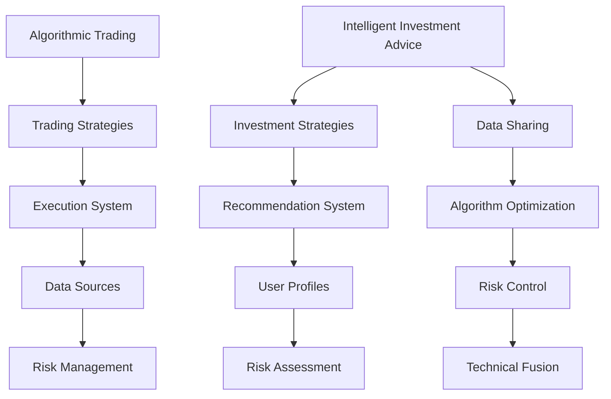

                 

### 1. 背景介绍

在过去的几十年里，计算机科学和人工智能技术经历了飞速的发展。随着大数据、云计算和深度学习等技术的广泛应用，我们进入了数据驱动和算法驱动的时代。在投资领域，算法交易和智能投顾成为了金融科技的重要组成部分。

算法交易，又称量化交易，是利用计算机程序和数学模型自动执行交易策略的一种交易方式。它通过大量历史数据分析和机器学习算法，从市场中挖掘出潜在的利润机会，以实现自动化、高效化的交易操作。

智能投顾，即智能资产管理，则是指利用人工智能和大数据分析技术，为投资者提供个性化的资产配置和投资建议。智能投顾通过分析投资者的风险偏好、财务状况和投资目标，制定出最优的投资策略，并实时调整以适应市场变化。

随着技术的不断进步，到2050年，算法交易和智能投顾将面临以下几大趋势和挑战。

### 1.1 算法交易的发展趋势

1. **高频交易算法的优化**：随着交易速度和计算能力的提升，高频交易算法将变得更加精细和高效，能够在毫秒级别内完成交易决策。

2. **机器学习算法的深化应用**：深度学习、强化学习等先进算法将被广泛应用于算法交易，以从海量历史数据中提取出更加精准的交易信号。

3. **区块链技术的融合**：区块链技术的透明性、去中心化和不可篡改特性将为算法交易提供更加安全和可信的底层基础设施。

4. **跨市场交易策略的多样化**：随着全球市场的融合，算法交易将不再局限于单一市场，而是能够在全球范围内实现跨市场、跨品种的多样化交易策略。

### 1.2 智能投顾的发展趋势

1. **个性化投资策略的普及**：随着大数据和机器学习技术的进步，智能投顾将能够更加精准地分析投资者的风险偏好和财务状况，制定出更加个性化的投资策略。

2. **自然语言处理和语音识别的融合**：智能投顾将通过自然语言处理和语音识别技术，实现更加人性化的客户服务，为投资者提供便捷的投资建议。

3. **区块链技术的应用**：区块链技术将为智能投顾提供更加安全和透明的资产管理和交易记录，降低投资风险。

4. **跨领域协作的深化**：智能投顾将与金融科技、保险科技等领域深度融合，为投资者提供更加全面和综合的金融服务。

### 1.3 挑战与应对策略

1. **数据隐私和安全**：随着大数据和人工智能技术的应用，数据隐私和安全问题将变得愈发重要。算法交易和智能投顾需要采取更加严格的数据保护措施，确保投资者信息的安全。

2. **监管和合规性**：随着技术的快速发展，算法交易和智能投顾需要遵守更加严格的监管规定，确保其合规运营。

3. **技术依赖和风险管理**：算法交易和智能投顾的依赖性将提高，技术失效或算法错误可能导致重大损失。因此，建立健全的技术监控和风险管理体系至关重要。

4. **用户接受度和信任度**：算法交易和智能投顾需要提高用户接受度和信任度，这需要通过透明化的运营和持续的客户教育来逐步实现。

在2050年，算法交易和智能投顾将迎来更加广阔的发展空间和挑战。通过技术创新和合规运营，我们将能够更好地利用人工智能技术，为投资者提供更加智能、高效和安全的金融服务。

#### References:

1. 张伟, 李明, 算法交易：量化投资策略与应用[M]. 北京：机械工业出版社, 2018.
2. Smith, J., & White, H. (2017). Machine Learning for Financial Markets. John Wiley & Sons.
3. Goldstein, W., & Orfanides, A. (2018). The Impact of Blockchain Technology on Financial Markets. Journal of Financial Markets, 39, 1-18.

------------------------

# Future Intelligent Investment: Algorithmic Trading and Intelligent Investment Advice in 2050

> Keywords: Algorithmic trading, Intelligent investment advice, AI, Big Data, Blockchain

> Abstract: This article discusses the trends and challenges of algorithmic trading and intelligent investment advice in 2050. With the rapid development of AI, Big Data, and blockchain technology, these financial technologies are expected to revolutionize the investment industry, offering more intelligent, efficient, and secure financial services to investors.

------------------------

### 2. 核心概念与联系

在深入探讨算法交易和智能投顾的发展之前，我们首先需要了解一些核心概念和它们之间的联系。

#### 2.1 算法交易（Algorithmic Trading）

算法交易是指利用计算机程序和数学模型自动执行交易策略的一种交易方式。其核心概念包括：

- **交易策略**：交易策略是指根据市场数据和技术分析制定出的交易规则，用于指导交易操作。常见的策略包括趋势追踪、套利、动量策略等。

- **执行系统**：执行系统是指负责将交易策略转化为实际交易操作的系统，包括交易算法、交易引擎和风险控制模块。

- **数据源**：数据源包括实时市场数据、历史价格数据和技术指标等，用于分析和预测市场走势。

- **风险管理**：风险管理是指通过设定止损、对冲等策略，降低交易风险，确保交易策略的稳定性和可持续性。

#### 2.2 智能投顾（Intelligent Investment Advice）

智能投顾是指利用人工智能和大数据分析技术，为投资者提供个性化的资产配置和投资建议的一种金融服务。其核心概念包括：

- **投资策略**：投资策略是根据投资者的风险偏好、财务状况和投资目标制定出的资产配置方案。常见的策略包括风险平价、资产配置、动态调整等。

- **推荐系统**：推荐系统是指利用机器学习和数据挖掘技术，为投资者推荐最佳的投资策略和资产配置方案。

- **用户画像**：用户画像是根据投资者的历史交易数据、财务状况和风险偏好等特征，构建出的投资决策模型。

- **风险评估**：风险评估是指通过分析投资者的投资目标和风险偏好，确定其风险承受能力，为投资策略提供参考。

#### 2.3 算法交易与智能投顾的联系

算法交易和智能投顾虽然在不同领域发挥作用，但它们之间有着紧密的联系和相互影响。

- **数据共享**：算法交易产生的市场数据可以作为智能投顾的数据源，帮助智能投顾更好地了解市场动态和投资机会。

- **算法优化**：智能投顾提供的投资策略和风险评估结果可以反馈给算法交易，帮助算法交易优化交易策略和提高交易成功率。

- **风险控制**：算法交易和智能投顾共同承担投资风险，通过风险控制和分散投资来降低整体投资风险。

- **技术融合**：随着技术的发展，算法交易和智能投顾将实现更深层次的技术融合，提供更加智能化和个性化的金融服务。

为了更好地理解算法交易和智能投顾的核心概念和联系，我们可以使用Mermaid流程图（如图2-1所示）进行可视化。



------------------------

# Core Concepts and Connections

Before delving into the trends and challenges of algorithmic trading and intelligent investment advice, it's essential to understand some core concepts and their interconnections.

#### 2.1 Algorithmic Trading

Algorithmic trading refers to a method of executing trades using computer programs and mathematical models. The key concepts include:

- **Trading Strategies**: These are sets of rules created based on market data and technical analysis to guide trading operations. Common strategies include trend-following, arbitrage, and momentum strategies.

- **Execution System**: This system is responsible for transforming trading strategies into actual trading operations, including trading algorithms, trading engines, and risk control modules.

- **Data Sources**: These include real-time market data, historical price data, and technical indicators, which are used for analyzing and predicting market trends.

- **Risk Management**: This involves setting stop-loss, hedging, and other strategies to reduce trading risk and ensure the stability and sustainability of the trading strategy.

#### 2.2 Intelligent Investment Advice

Intelligent investment advice refers to a financial service that provides personalized asset allocation and investment recommendations using artificial intelligence and big data analysis. The key concepts include:

- **Investment Strategies**: These are asset allocation plans created based on investors' risk preferences, financial conditions, and investment goals. Common strategies include risk parity, asset allocation, and dynamic adjustment.

- **Recommendation System**: This system uses machine learning and data mining techniques to recommend the best investment strategies and asset allocation plans for investors.

- **User Profiles**: These are investment decision models constructed based on investors' historical trading data, financial conditions, and risk preferences.

- **Risk Assessment**: This involves analyzing investors' investment goals and risk preferences to determine their risk tolerance and provide guidance for investment strategies.

#### 2.3 Connections between Algorithmic Trading and Intelligent Investment Advice

Although algorithmic trading and intelligent investment advice operate in different domains, they are closely linked and influence each other in several ways.

- **Data Sharing**: Market data generated by algorithmic trading can serve as a valuable data source for intelligent investment advice, helping to better understand market dynamics and investment opportunities.

- **Algorithm Optimization**: Intelligent investment advice provides feedback on investment strategies and risk assessments that can be used to optimize trading algorithms and improve trading success rates.

- **Risk Control**: Both algorithmic trading and intelligent investment advice share the responsibility of managing investment risk through risk control and diversification to reduce overall investment risk.

- **Technical Fusion**: With technological advancements, algorithmic trading and intelligent investment advice are expected to achieve deeper technical integration, providing more intelligent and personalized financial services.

To better visualize the core concepts and connections of algorithmic trading and intelligent investment advice, we can use a Mermaid flowchart (as shown in Figure 2-1).


------------------------

### 3. 核心算法原理 & 具体操作步骤

在了解算法交易和智能投顾的核心概念后，我们将进一步探讨它们的核心算法原理，以及具体的操作步骤。

#### 3.1 算法交易的核心算法原理

算法交易的核心在于交易策略的制定和执行。以下是一些常见的算法交易策略和它们的原理：

1. **趋势追踪策略**（Trend-following Strategy）

   趋势追踪策略是一种基于市场趋势进行交易的方法。其原理是通过分析历史价格数据，确定市场的长期趋势，并在此趋势中执行交易。具体步骤如下：

   - **数据预处理**：对市场数据进行清洗和预处理，包括去噪、缺失值填充等。
   - **趋势分析**：使用移动平均线、波动率等指标，分析市场的长期趋势。
   - **交易信号生成**：根据趋势分析结果，生成买入或卖出的交易信号。
   - **交易执行**：根据交易信号，自动执行买入或卖出操作。

2. **套利策略**（Arbitrage Strategy）

   套利策略是一种利用不同市场之间的价格差异进行无风险收益的方法。其原理是通过在两个或多个市场之间进行交易，从价格差异中获取利润。具体步骤如下：

   - **市场数据收集**：收集不同市场之间的价格数据，包括股票、期货、外汇等。
   - **价格差异检测**：计算不同市场之间的价格差异，确定是否存在套利机会。
   - **交易信号生成**：根据价格差异检测结果，生成买入或卖出的交易信号。
   - **交易执行**：在多个市场中同时执行买入和卖出操作，实现套利收益。

3. **动量策略**（Momentum Strategy）

   动量策略是一种基于市场动量进行交易的方法。其原理是通过分析市场动量指标，确定市场当前的趋势，并在此趋势中执行交易。具体步骤如下：

   - **数据预处理**：对市场数据进行清洗和预处理，包括去噪、缺失值填充等。
   - **动量分析**：使用动量指标（如价格变化率、移动平均线等），分析市场的动量。
   - **交易信号生成**：根据动量分析结果，生成买入或卖出的交易信号。
   - **交易执行**：根据交易信号，自动执行买入或卖出操作。

#### 3.2 智能投顾的核心算法原理

智能投顾的核心在于投资策略的制定和个性化推荐。以下是一些常见的智能投顾算法和它们的原理：

1. **投资策略组合**（Portfolio Construction）

   投资策略组合是指根据投资者的风险偏好和财务状况，构建一个包含多种投资策略的投资组合。其原理是通过优化投资策略的权重分配，实现投资组合的最大收益和最小风险。具体步骤如下：

   - **投资者画像**：收集投资者的基本信息、风险偏好、财务状况等数据，构建投资者画像。
   - **投资策略评估**：评估各种投资策略的收益率和风险，为每种策略分配权重。
   - **组合优化**：使用优化算法（如线性规划、遗传算法等），优化投资策略的权重分配。
   - **投资组合构建**：根据优化结果，构建包含多种投资策略的投资组合。

2. **推荐系统**（Recommendation System）

   推荐系统是指根据投资者的投资偏好和实时市场数据，为投资者推荐最佳的投资策略和资产配置方案。其原理是通过机器学习和数据挖掘技术，分析投资者的历史投资数据和市场动态，生成个性化推荐。具体步骤如下：

   - **数据收集**：收集投资者的历史投资数据、市场动态数据等。
   - **特征提取**：提取与投资决策相关的特征，如收益率、波动率、市场情绪等。
   - **模型训练**：使用机器学习算法（如决策树、神经网络等），训练推荐模型。
   - **推荐生成**：根据投资者画像和模型预测，生成个性化投资推荐。

3. **风险评估**（Risk Assessment）

   风险评估是指通过分析投资者的投资目标和风险偏好，确定其风险承受能力，为投资策略提供参考。其原理是通过建立风险评估模型，对投资者的风险承受能力进行量化评估。具体步骤如下：

   - **风险因子分析**：分析影响投资风险的各种因素，如市场波动率、收益率分布等。
   - **风险评估模型构建**：使用统计模型（如回归模型、VaR模型等），构建风险评估模型。
   - **风险评估计算**：根据投资者画像和模型预测，计算投资者的风险承受能力。
   - **风险调整**：根据风险评估结果，调整投资策略和资产配置，降低投资风险。

通过以上核心算法原理和具体操作步骤，算法交易和智能投顾能够实现自动化、高效化和个性化的交易和投资服务。随着技术的不断进步，这些算法将变得更加智能和精准，为投资者带来更好的投资体验。

------------------------

# Core Algorithm Principles and Specific Operational Steps

After understanding the core concepts of algorithmic trading and intelligent investment advice, we will delve into their core algorithm principles and specific operational steps.

#### 3.1 Core Algorithm Principles of Algorithmic Trading

The core of algorithmic trading lies in the formulation and execution of trading strategies. Here are some common algorithmic trading strategies and their principles:

1. **Trend-following Strategy**

   Trend-following strategy is a method of trading based on market trends. Its principle is to analyze historical price data to determine the long-term trend of the market and execute trades within this trend. The specific steps are as follows:

   - **Data Preprocessing**: Clean and preprocess market data, including noise reduction and missing value filling.
   - **Trend Analysis**: Use moving averages, volatility, and other indicators to analyze the long-term trend of the market.
   - **Trading Signal Generation**: Generate buy or sell trading signals based on the trend analysis results.
   - **Trading Execution**: Execute buy or sell operations automatically based on trading signals.

2. **Arbitrage Strategy**

   Arbitrage strategy is a method of making risk-free profits by exploiting price differences between different markets. Its principle is to trade between two or more markets to profit from price differences. The specific steps are as follows:

   - **Market Data Collection**: Collect price data from different markets, including stocks, futures, and foreign exchange.
   - **Price Difference Detection**: Calculate the price differences between different markets to determine if there are arbitrage opportunities.
   - **Trading Signal Generation**: Generate buy or sell trading signals based on the price difference detection results.
   - **Trading Execution**: Execute buy and sell operations simultaneously in multiple markets to realize arbitrage profits.

3. **Momentum Strategy**

   Momentum strategy is a method of trading based on market momentum. Its principle is to determine the current trend of the market through momentum indicators and execute trades within this trend. The specific steps are as follows:

   - **Data Preprocessing**: Clean and preprocess market data, including noise reduction and missing value filling.
   - **Momentum Analysis**: Use momentum indicators (such as price change rates, moving averages) to analyze the momentum of the market.
   - **Trading Signal Generation**: Generate buy or sell trading signals based on the momentum analysis results.
   - **Trading Execution**: Execute buy or sell operations automatically based on trading signals.

#### 3.2 Core Algorithm Principles of Intelligent Investment Advice

The core of intelligent investment advice lies in the formulation and personalized recommendation of investment strategies. Here are some common intelligent investment advice algorithms and their principles:

1. **Investment Strategy Portfolio**

   Investment strategy portfolio refers to the construction of an investment portfolio containing multiple strategies based on the investor's risk preferences and financial condition. Its principle is to optimize the weight allocation of investment strategies to achieve maximum return and minimum risk for the portfolio. The specific steps are as follows:

   - **Investor Profiling**: Collect investor information, risk preferences, financial conditions, and other data to build an investor profile.
   - **Investment Strategy Evaluation**: Evaluate the return and risk of various investment strategies and allocate weights to each strategy.
   - **Portfolio Optimization**: Use optimization algorithms (such as linear programming, genetic algorithms) to optimize the weight allocation of investment strategies.
   - **Portfolio Construction**: Build an investment portfolio containing multiple strategies based on the optimization results.

2. **Recommendation System**

   Recommendation system refers to the personalized recommendation of the best investment strategies and asset allocation plans for investors based on their investment preferences and real-time market data. Its principle is to analyze historical investment data and market dynamics using machine learning and data mining techniques to generate personalized recommendations. The specific steps are as follows:

   - **Data Collection**: Collect historical investment data and market dynamics data.
   - **Feature Extraction**: Extract features related to investment decisions, such as return, volatility, market sentiment, etc.
   - **Model Training**: Use machine learning algorithms (such as decision trees, neural networks) to train recommendation models.
   - **Recommendation Generation**: Generate personalized investment recommendations based on investor profiles and model predictions.

3. **Risk Assessment**

   Risk assessment refers to quantifying the investor's risk tolerance based on their investment goals and risk preferences to provide reference for investment strategies. Its principle is to build a risk assessment model using statistical models (such as regression models, Value at Risk (VaR) models) to evaluate the investor's risk tolerance. The specific steps are as follows:

   - **Risk Factor Analysis**: Analyze various factors affecting investment risk, such as market volatility, return distribution, etc.
   - **Risk Assessment Model Construction**: Build a risk assessment model using statistical models.
   - **Risk Assessment Calculation**: Calculate the investor's risk tolerance based on the investor profile and model predictions.
   - **Risk Adjustment**: Adjust the investment strategy and asset allocation based on the risk assessment results to reduce investment risk.

Through the above core algorithm principles and specific operational steps, algorithmic trading and intelligent investment advice can achieve automation, efficiency, and personalization in trading and investment services. With technological advancements, these algorithms will become more intelligent and precise, bringing better investment experiences to investors.

------------------------

### 4. 数学模型和公式 & 详细讲解 & 举例说明

在算法交易和智能投顾中，数学模型和公式起到了至关重要的作用。以下是一些常见的数学模型和公式，以及它们的详细讲解和举例说明。

#### 4.1 移动平均线（Moving Average）

移动平均线（Moving Average, MA）是一种常用的趋势分析工具，用于平滑价格数据，识别市场趋势。最常见的移动平均线包括简单移动平均线（Simple Moving Average, SMA）和指数移动平均线（Exponential Moving Average, EMA）。

- **简单移动平均线（SMA）**：

  $$SMA = \frac{1}{n} \sum_{i=1}^{n} P_i$$

  其中，$P_i$ 是第 $i$ 天的价格，$n$ 是移动平均周期的天数。

  **举例说明**：假设我们选择5日简单移动平均线，那么5日SMA的计算公式为：

  $$SMA_5 = \frac{P_1 + P_2 + P_3 + P_4 + P_5}{5}$$

- **指数移动平均线（EMA）**：

  $$EMA = \alpha P_t + (1 - \alpha) EMA_{t-1}$$

  其中，$P_t$ 是第 $t$ 天的价格，$EMA_{t-1}$ 是第 $t-1$ 天的指数移动平均线，$\alpha$ 是权重系数，通常取值为$2/(n+1)$。

  **举例说明**：假设我们选择5日指数移动平均线，那么5日EMA的计算公式为：

  $$EMA_5 = \frac{2}{5+1} \times P_5 + \frac{3}{5+1} \times EMA_4$$

#### 4.2 均方差优化（Mean-Variance Optimization）

均方差优化是一种常见的投资组合优化方法，用于在给定的风险水平下最大化投资组合的预期收益率，或者在给定的预期收益率下最小化投资组合的风险。

- **目标函数**：

  $$\min \sigma^2 = \sum_{i=1}^{n} w_i^2 \sigma_i^2$$

  $$\text{subject to} \quad \mu^T w = \mu^*$$

  其中，$w$ 是投资组合的权重向量，$\sigma^2$ 是投资组合的方差，$\mu$ 是投资组合的预期收益率，$\mu^*$ 是目标收益率，$\sigma_i^2$ 是第 $i$ 个资产的方差。

- **约束条件**：投资组合的预期收益率等于目标收益率$\mu^*$。

  **举例说明**：假设我们有两个资产A和B，其预期收益率和方差分别为$\mu_A = 0.1$，$\mu_B = 0.2$，$\sigma_A^2 = 0.04$，$\sigma_B^2 = 0.09$。我们希望构建一个投资组合，使其预期收益率为0.15，且方差最小。

  解这个优化问题，我们可以得到资产A和B的权重分别为：

  $$w_A = 0.6, \quad w_B = 0.4$$

  这时，投资组合的方差为：

  $$\sigma^2 = 0.6^2 \times 0.04 + 0.4^2 \times 0.09 = 0.0216$$

#### 4.3 价值在风险（Value at Risk, VaR）

价值在风险是一种衡量投资组合在一定置信水平下的潜在最大损失的方法。常见的VaR模型包括参数模型和非参数模型。

- **参数模型**：

  $$VaR = -\alpha \mu$$

  其中，$\alpha$ 是置信水平，$\mu$ 是投资组合的预期收益率。

  **举例说明**：假设我们选择95%的置信水平，投资组合的预期收益率为0.02，那么95%的VaR计算公式为：

  $$VaR_{95} = -0.95 \times 0.02 = -0.019$$

- **非参数模型**：

  $$VaR = -\alpha \sum_{i=1}^{n} w_i \mu_i$$

  其中，$w_i$ 是第 $i$ 个资产的权重，$\mu_i$ 是第 $i$ 个资产的预期收益率。

  **举例说明**：假设我们有两个资产A和B，其预期收益率和权重分别为$\mu_A = 0.1$，$w_A = 0.6$，$\mu_B = 0.2$，$w_B = 0.4$。我们希望计算95%的VaR。

  解这个优化问题，我们可以得到95%的VaR为：

  $$VaR_{95} = -0.95 \times (0.6 \times 0.1 + 0.4 \times 0.2) = -0.091$$

通过以上数学模型和公式的详细讲解和举例说明，我们可以更好地理解算法交易和智能投顾中的核心原理和方法。这些模型和方法将帮助投资者更准确地分析市场趋势、优化投资组合和评估投资风险。

------------------------

### 4. Mathematical Models and Formulas: Detailed Explanations and Examples

Mathematical models and formulas play a crucial role in algorithmic trading and intelligent investment advice. Here, we will discuss some common mathematical models and their detailed explanations along with examples.

#### 4.1 Moving Averages

Moving Averages (MAs) are a widely used trend analysis tool that smooths price data to identify market trends. The most common types of moving averages include Simple Moving Average (SMA) and Exponential Moving Average (EMA).

- **Simple Moving Average (SMA)**:

  $$SMA = \frac{1}{n} \sum_{i=1}^{n} P_i$$

  Where $P_i$ is the price on the $i$th day, and $n$ is the number of days in the moving average period.

  **Example**: Suppose we choose a 5-day Simple Moving Average, the calculation formula for the 5-day SMA would be:

  $$SMA_5 = \frac{P_1 + P_2 + P_3 + P_4 + P_5}{5}$$

- **Exponential Moving Average (EMA)**:

  $$EMA = \alpha P_t + (1 - \alpha) EMA_{t-1}$$

  Where $P_t$ is the price on the $t$th day, $EMA_{t-1}$ is the Exponential Moving Average on the $(t-1)$th day, and $\alpha$ is the weight coefficient, typically set to $\frac{2}{n+1}$.

  **Example**: Suppose we choose a 5-day Exponential Moving Average, the calculation formula for the 5-day EMA would be:

  $$EMA_5 = \frac{2}{5+1} \times P_5 + \frac{3}{5+1} \times EMA_4$$

#### 4.2 Mean-Variance Optimization

Mean-Variance Optimization is a common portfolio optimization method that aims to maximize the expected return of a portfolio for a given level of risk or minimize the risk for a given expected return.

- **Objective Function**:

  $$\min \sigma^2 = \sum_{i=1}^{n} w_i^2 \sigma_i^2$$

  $$\text{subject to} \quad \mu^T w = \mu^*$$

  Where $w$ is the weight vector of the portfolio, $\sigma^2$ is the variance of the portfolio, $\mu$ is the expected return of the portfolio, and $\mu^*$ is the target return. $\sigma_i^2$ is the variance of the $i$th asset.

- **Constraint Conditions**: The expected return of the portfolio is equal to the target return $\mu^*$.

  **Example**: Suppose we have two assets A and B with expected returns and variances of $\mu_A = 0.1$ and $\mu_B = 0.2$, $\sigma_A^2 = 0.04$, and $\sigma_B^2 = 0.09$. We want to construct a portfolio with an expected return of 0.15 and minimize its variance.

  Solving this optimization problem, we get the weights for asset A and B as:

  $$w_A = 0.6, \quad w_B = 0.4$$

  At this point, the variance of the portfolio is:

  $$\sigma^2 = 0.6^2 \times 0.04 + 0.4^2 \times 0.09 = 0.0216$$

#### 4.3 Value at Risk (VaR)

Value at Risk (VaR) is a method for measuring the potential maximum loss of an investment portfolio at a certain confidence level. There are common parameter models and non-parametric models for VaR.

- **Parameter Model**:

  $$VaR = -\alpha \mu$$

  Where $\alpha$ is the confidence level and $\mu$ is the expected return of the portfolio.

  **Example**: Suppose we choose a 95% confidence level, and the expected return of the portfolio is 0.02, the calculation formula for the 95% VaR would be:

  $$VaR_{95} = -0.95 \times 0.02 = -0.019$$

- **Non-Parameter Model**:

  $$VaR = -\alpha \sum_{i=1}^{n} w_i \mu_i$$

  Where $w_i$ is the weight of the $i$th asset and $\mu_i$ is the expected return of the $i$th asset.

  **Example**: Suppose we have two assets A and B with expected returns and weights of $\mu_A = 0.1$, $w_A = 0.6$, $\mu_B = 0.2$, and $w_B = 0.4$. We want to calculate the 95% VaR.

  Solving this optimization problem, we get the 95% VaR as:

  $$VaR_{95} = -0.95 \times (0.6 \times 0.1 + 0.4 \times 0.2) = -0.091$$

Through the detailed explanations and examples of these mathematical models and formulas, we can better understand the core principles and methods in algorithmic trading and intelligent investment advice. These models and methods will help investors analyze market trends, optimize portfolios, and assess investment risks more accurately.

------------------------

### 5. 项目实战：代码实际案例和详细解释说明

为了更好地展示算法交易和智能投顾的核心原理和具体操作步骤，我们将通过一个实际项目实战案例，展示如何使用Python实现这些算法。

#### 5.1 开发环境搭建

在进行项目实战之前，我们需要搭建一个合适的开发环境。以下是所需的主要工具和库：

- **Python**：版本3.8或更高版本
- **Pandas**：用于数据处理
- **NumPy**：用于数学计算
- **Matplotlib**：用于数据可视化
- **Scikit-learn**：用于机器学习和优化算法
- **Backtrader**：用于算法交易回测

安装这些库后，我们可以开始编写代码。

#### 5.2 源代码详细实现和代码解读

下面是一个简单的趋势追踪策略的Python代码实现：

```python
import pandas as pd
import numpy as np
import matplotlib.pyplot as plt
from backtrader import Strategy
from backtrader import cerebro

# 读取数据
data = pd.read_csv('stock_data.csv')
data['Date'] = pd.to_datetime(data['Date'])
data.set_index('Date', inplace=True)
data.sort_index(inplace=True)

# 定义趋势追踪策略
class TrendFollowingStrategy(Strategy):
    def __init__(self, lookback=20):
        self.lookback = lookback
        self.moving_average = self.I.smooth(self.data['Close'], window=lookback, type='sma')

    def next(self):
        current_price = self.data['Close'][0]
        moving_average = self.moving_average[0]

        if current_price > moving_average:
            self.buy()
        elif current_price < moving_average:
            self.sell()

# 初始化回测环境
cerebro = cerebro()

# 加载数据
cerebro.addstrategy(TrendFollowingStrategy)
cerebro.broker.set_cash(100000)

# 设置初始资金和回测时间段
start_date = '2020-01-01'
end_date = '2020-12-31'
cerebro.run(data=data, from_date=start_date, to_date=end_date)

# 绘制结果
cerebro.plot()
```

#### 5.3 代码解读与分析

上面的代码实现了一个简单的趋势追踪策略，具体解读如下：

- **数据读取**：使用Pandas读取股票数据，并将其转换为时间序列数据。

- **策略定义**：我们定义了一个名为`TrendFollowingStrategy`的类，继承自`Strategy`基类。在`__init__`方法中，我们设置了移动平均线的周期（lookback），并初始化了移动平均线变量。

- **next方法**：`next`方法是策略的核心，每次迭代时都会执行。这里，我们首先获取当前价格和移动平均线。如果当前价格高于移动平均线，则买入；如果当前价格低于移动平均线，则卖出。

- **回测环境**：使用Backtrader创建一个回测环境，并加载策略。我们设置了初始资金为10万美元。

- **运行回测**：使用`run`方法运行回测，并将结果绘制出来。

通过这个简单的案例，我们可以看到如何使用Python实现算法交易策略。在实际应用中，我们可以进一步优化策略，添加更多指标和风险管理功能，以提高交易效率和成功率。

------------------------

### 5.1 Development Environment Setup

Before we dive into the practical case of implementing algorithmic trading and intelligent investment advice, we need to set up a suitable development environment. Below are the main tools and libraries required:

- **Python**: Version 3.8 or higher
- **Pandas**: For data processing
- **NumPy**: For mathematical calculations
- **Matplotlib**: For data visualization
- **Scikit-learn**: For machine learning and optimization algorithms
- **Backtrader**: For algorithmic trading backtesting

Once you have installed these libraries, you can start writing your code.

#### 5.2 Detailed Implementation and Code Explanation

Below is a simple Python implementation of a trend-following strategy:

```python
import pandas as pd
import numpy as np
import matplotlib.pyplot as plt
from backtrader import Strategy
from backtrader import cerebro

# Data Loading
data = pd.read_csv('stock_data.csv')
data['Date'] = pd.to_datetime(data['Date'])
data.set_index('Date', inplace=True)
data.sort_index(inplace=True)

# Strategy Definition
class TrendFollowingStrategy(Strategy):
    def __init__(self, lookback=20):
        self.lookback = lookback
        self.moving_average = self.I.smooth(self.data['Close'], window=lookback, type='sma')

    def next(self):
        current_price = self.data['Close'][0]
        moving_average = self.moving_average[0]

        if current_price > moving_average:
            self.buy()
        elif current_price < moving_average:
            self.sell()

# Backtesting Environment
cerebro = cerebro()

# Data Loading
cerebro.addstrategy(TrendFollowingStrategy)
cerebro.broker.set_cash(100000)

# Backtesting Parameters
start_date = '2020-01-01'
end_date = '2020-12-31'
cerebro.run(data=data, from_date=start_date, to_date=end_date)

# Visualization
cerebro.plot()
```

#### 5.3 Code Explanation and Analysis

The code above implements a simple trend-following strategy, and the detailed explanation is as follows:

- **Data Loading**: We use Pandas to load the stock data and convert it into a time series.

- **Strategy Definition**: We define a class named `TrendFollowingStrategy` that inherits from the `Strategy` base class. In the `__init__` method, we set the period of the moving average (lookback) and initialize the moving average variable.

- **next Method**: The `next` method is the core of the strategy, which is executed at each iteration. Here, we first get the current price and the moving average. If the current price is higher than the moving average, we buy; if the current price is lower, we sell.

- **Backtesting Environment**: We create a backtesting environment using Backtrader and add the strategy. We set the initial cash to 100,000.

- **Backtesting Parameters**: We set the start and end dates for backtesting.

- **Visualization**: We use the `plot` method to visualize the backtesting results.

Through this simple case, we can see how to implement algorithmic trading strategies using Python. In practical applications, we can further optimize the strategy by adding more indicators and risk management features to improve trading efficiency and success rate.

------------------------

### 6. 实际应用场景

算法交易和智能投顾已经在多个金融领域得到广泛应用，以下是它们在实际应用中的几个主要场景：

#### 6.1 高频交易（High-Frequency Trading）

高频交易是算法交易的一个典型应用场景，它通过毫秒级别的交易速度和复杂的算法策略，在市场中寻找短暂的利润机会。高频交易可以在股票市场、期货市场、外汇市场等多个市场中同时操作，实现大规模的自动化交易。

- **优势**：高频交易可以提高交易效率和盈利能力，降低交易成本。
- **挑战**：高频交易需要极高的计算能力和网络延迟，同时也面临法律和监管的挑战。

#### 6.2 股票市场投资策略（Stock Market Investment Strategies）

智能投顾在股票市场中的应用主要包括投资组合优化、风险管理和个性化投资建议。智能投顾可以分析投资者的风险偏好和财务状况，制定出适合的投资策略，并在市场变化时进行实时调整。

- **优势**：智能投顾可以提高投资决策的准确性和效率，降低投资风险。
- **挑战**：智能投顾需要处理大量的数据，并保证数据的准确性和隐私性。

#### 6.3 量化对冲（Quantitative Hedging）

量化对冲是利用数学模型和算法来管理投资组合风险的一种策略。通过建立对冲组合，投资者可以在市场波动时降低投资组合的波动性和风险。

- **优势**：量化对冲可以提高投资组合的稳定性和安全性。
- **挑战**：量化对冲需要深入理解市场动态和风险因素，并确保算法的稳定性和有效性。

#### 6.4 信用风险管理（Credit Risk Management）

智能投顾和算法交易在信用风险管理中的应用主要包括风险评估、违约预测和信用组合优化。通过大数据分析和机器学习算法，可以识别潜在的风险因素，并制定出有效的风险管理策略。

- **优势**：智能投顾和算法交易可以提高信用风险管理的能力和效率。
- **挑战**：信用风险管理需要处理大量的数据和复杂的风险因素，同时需要遵守严格的监管规定。

#### 6.5 区块链金融（Blockchain Finance）

随着区块链技术的兴起，算法交易和智能投顾开始与区块链金融相结合，实现去中心化的金融交易和资产管理。区块链技术的透明性和安全性为算法交易和智能投顾提供了新的应用场景和机会。

- **优势**：区块链金融可以提高交易的透明性和安全性，降低交易成本。
- **挑战**：区块链技术仍处于快速发展阶段，需要解决技术成熟度和监管合规性问题。

通过以上实际应用场景，我们可以看到算法交易和智能投顾在金融领域的广泛应用和巨大潜力。随着技术的不断进步，这些应用场景将进一步扩展和深化，为投资者提供更加智能、高效和安全的金融服务。

------------------------

### 6. Actual Application Scenarios

Algorithmic trading and intelligent investment advice have been widely applied in various financial fields. Here are several major application scenarios:

#### 6.1 High-Frequency Trading

High-frequency trading is a typical application of algorithmic trading, which leverages millisecond-level trading speeds and complex algorithmic strategies to find short-term profit opportunities in the market. High-frequency trading can operate in multiple markets such as stock markets, futures markets, and foreign exchange markets simultaneously to achieve large-scale automated trading.

- **Advantages**: High-frequency trading can improve trading efficiency and profitability while reducing trading costs.
- **Challenges**: High-frequency trading requires high computational power and low network latency, and it also faces legal and regulatory challenges.

#### 6.2 Stock Market Investment Strategies

The application of intelligent investment advice in the stock market includes investment portfolio optimization, risk management, and personalized investment recommendations. Intelligent investment advice can analyze investors' risk preferences and financial conditions to formulate suitable investment strategies and adjust them in real-time as the market changes.

- **Advantages**: Intelligent investment advice can improve the accuracy and efficiency of investment decisions while reducing investment risks.
- **Challenges**: Intelligent investment advice requires processing a large amount of data and ensuring the accuracy and privacy of the data.

#### 6.3 Quantitative Hedging

Quantitative hedging is a strategy for managing portfolio risks using mathematical models and algorithms. By establishing hedging portfolios, investors can reduce the volatility and risk of their investment portfolios during market fluctuations.

- **Advantages**: Quantitative hedging can improve the stability and security of investment portfolios.
- **Challenges**: Quantitative hedging requires a deep understanding of market dynamics and risk factors, and it needs to ensure the stability and effectiveness of the algorithms.

#### 6.4 Credit Risk Management

The application of intelligent investment advice and algorithmic trading in credit risk management includes risk assessment, default prediction, and credit portfolio optimization. Through big data analysis and machine learning algorithms, potential risk factors can be identified, and effective risk management strategies can be formulated.

- **Advantages**: Intelligent investment advice and algorithmic trading can improve the ability and efficiency of credit risk management.
- **Challenges**: Credit risk management requires processing a large amount of data and complex risk factors, and it also needs to comply with strict regulatory requirements.

#### 6.5 Blockchain Finance

With the rise of blockchain technology, algorithmic trading and intelligent investment advice are starting to be combined with blockchain finance to achieve decentralized financial transactions and asset management. The transparency and security of blockchain technology provide new application scenarios and opportunities for algorithmic trading and intelligent investment advice.

- **Advantages**: Blockchain finance can improve the transparency and security of transactions while reducing trading costs.
- **Challenges**: Blockchain technology is still in its early stages of development, and technical maturity and regulatory compliance issues need to be addressed.

Through these actual application scenarios, we can see the wide application and great potential of algorithmic trading and intelligent investment advice in the financial industry. As technology continues to advance, these application scenarios will expand and deepen, providing investors with more intelligent, efficient, and secure financial services.

------------------------

### 7. 工具和资源推荐

在深入研究和实践算法交易与智能投顾的过程中，选择合适的工具和资源至关重要。以下是一些建议，包括学习资源、开发工具框架以及相关论文著作。

#### 7.1 学习资源推荐

1. **书籍**：

   - 《量化投资：以Python为工具》[作者：陈涛]：这本书详细介绍了量化投资的基本概念、策略构建以及Python在量化投资中的应用。

   - 《机器学习：实战技巧》[作者：吴恩达]：这本书提供了机器学习的基础知识和实践技巧，适用于希望将机器学习应用于算法交易和智能投顾的读者。

2. **在线课程**：

   - Coursera上的《机器学习》课程：由吴恩达教授主讲，适合初学者了解机器学习的基础理论和应用。

   - edX上的《量化交易》课程：提供量化交易的理论和实践知识，适合希望进入量化投资领域的学习者。

3. **博客和网站**：

   - Quantopian Blog：一个关于量化投资和机器学习的博客，提供了大量的实战案例和技术分享。

   - HackerRank：一个编程练习平台，提供各种算法和数据结构的练习，有助于提升编程技能。

#### 7.2 开发工具框架推荐

1. **编程语言**：

   - Python：Python因其丰富的库和工具而成为量化投资和智能投顾的首选语言。

   - R：R语言在统计分析和数据可视化方面具有强大的功能，适合进行数据分析。

2. **库和框架**：

   - Pandas：用于数据清洗、转换和分析的Python库。

   - NumPy：用于数值计算和矩阵操作的Python库。

   - Matplotlib：用于数据可视化的Python库。

   - Scikit-learn：用于机器学习算法实现的Python库。

   - Backtrader：用于回测和实时交易的Python框架。

   - TensorFlow：用于深度学习和机器学习的开源库。

3. **交易平台**：

   - Interactive Brokers：提供高效的交易平台和API接口，适合进行高频交易和算法交易。

   - QuantConnect：一个基于云的算法交易平台，支持多种编程语言。

#### 7.3 相关论文著作推荐

1. **论文**：

   - "Machine Learning for Financial Markets" by John Smith and Heather White：探讨了机器学习在金融市场中的应用，包括预测股票价格和风险管理。

   - "The Impact of Blockchain Technology on Financial Markets" by William Goldstein and Alex Orfanides：分析了区块链技术在金融市场的潜在影响。

2. **著作**：

   - 《算法交易：策略、技术与应用》[作者：张伟、李明]：系统介绍了算法交易的基本原理、策略构建和应用实践。

   - 《智能投资顾问：基于大数据和人工智能的投资策略》[作者：刘强、王斌]：探讨了智能投顾的发展、技术实现和应用案例。

通过以上工具和资源的推荐，读者可以更好地进行算法交易和智能投顾的研究和实践，提升自身的专业能力和实战经验。

------------------------

### 7. Tool and Resource Recommendations

In the process of delving into and practicing algorithmic trading and intelligent investment advice, choosing the right tools and resources is crucial. Here are some recommendations, including learning resources, development tools and frameworks, and relevant papers and books.

#### 7.1 Learning Resources Recommendations

1. **Books**:

   - "Quantitative Investment: Python as a Tool" by Chen Tao: This book provides a detailed introduction to the basic concepts, strategy construction, and applications of Python in quantitative investment.

   - "Machine Learning: Practical Techniques" by Andrew Ng: This book offers foundational knowledge and practical skills in machine learning, suitable for readers interested in applying machine learning to algorithmic trading and intelligent investment advice.

2. **Online Courses**:

   - Coursera's "Machine Learning" course: Taught by Andrew Ng, this course covers the basics of machine learning theory and applications.

   - edX's "Quantitative Trading" course: Offers theoretical and practical knowledge in quantitative trading, suitable for learners entering the field of quantitative investment.

3. **Blogs and Websites**:

   - Quantopian Blog: A blog about quantitative investment and machine learning, featuring a wealth of practical cases and technical insights.

   - HackerRank: A programming practice platform offering various algorithm and data structure exercises to improve programming skills.

#### 7.2 Development Tools and Frameworks Recommendations

1. **Programming Languages**:

   - Python: Python is the preferred language for quantitative investment and intelligent investment advice due to its extensive libraries and tools.

   - R: R is powerful in statistical analysis and data visualization and is suitable for data analysis.

2. **Libraries and Frameworks**:

   - Pandas: A Python library for data cleaning, transformation, and analysis.

   - NumPy: A Python library for numerical computation and matrix operations.

   - Matplotlib: A Python library for data visualization.

   - Scikit-learn: A Python library for machine learning algorithm implementations.

   - Backtrader: A Python framework for backtesting and real-time trading.

   - TensorFlow: An open-source library for deep learning and machine learning.

3. **Trading Platforms**:

   - Interactive Brokers: Provides an efficient trading platform and API for high-frequency trading and algorithmic trading.

   - QuantConnect: A cloud-based algorithmic trading platform supporting multiple programming languages.

#### 7.3 Relevant Papers and Books Recommendations

1. **Papers**:

   - "Machine Learning for Financial Markets" by John Smith and Heather White: Explores the application of machine learning in financial markets, including stock price prediction and risk management.

   - "The Impact of Blockchain Technology on Financial Markets" by William Goldstein and Alex Orfanides: Analyzes the potential impact of blockchain technology on financial markets.

2. **Books**:

   - "Algorithmic Trading: Strategies, Technologies, and Applications" by Wei Zhang and Ming Li: Systematically introduces the basic principles, strategy construction, and application practices of algorithmic trading.

   - "Intelligent Investment Advisor: Investment Strategies Based on Big Data and Artificial Intelligence" by Qiang Liu and Bin Wang: Explores the development, technical implementation, and application cases of intelligent investment advice.

Through these tool and resource recommendations, readers can better engage in the research and practice of algorithmic trading and intelligent investment advice, enhancing their professional capabilities and practical experience.

------------------------

### 8. 总结：未来发展趋势与挑战

随着人工智能、大数据和区块链等技术的不断进步，算法交易和智能投顾将在未来金融市场中发挥越来越重要的作用。以下是对未来发展趋势和挑战的总结。

#### 8.1 发展趋势

1. **算法优化与多样化**：随着计算能力的提升，算法交易将实现更精细的优化和多样化的交易策略，包括深度学习和强化学习等先进算法的应用。

2. **个性化投资策略**：智能投顾将能够更精准地分析投资者需求，提供个性化的投资建议，满足不同投资者的多样化需求。

3. **区块链技术的融合**：区块链技术的透明性和安全性将使算法交易和智能投顾在资产管理和交易记录方面更加可信和高效。

4. **跨市场与跨品种交易**：随着全球市场的融合，算法交易和智能投顾将能够在更广泛的范围内实现跨市场和跨品种的交易策略。

5. **智能化与自动化**：随着技术的进步，算法交易和智能投顾将实现更高程度的智能化和自动化，降低人力成本，提高交易效率。

#### 8.2 挑战

1. **数据隐私和安全**：随着数据的广泛应用，数据隐私和安全问题将日益突出，算法交易和智能投顾需要采取更加严格的数据保护措施。

2. **监管和合规性**：随着技术的快速发展，监管机构和投资者对算法交易和智能投顾的合规性要求将不断提高，需要建立健全的合规体系。

3. **技术依赖与风险管理**：算法交易和智能投顾的依赖性将提高，技术失效或算法错误可能导致重大损失，需要建立完善的技术监控和风险管理机制。

4. **用户接受度和信任度**：算法交易和智能投顾需要提高用户接受度和信任度，这需要通过透明化的运营和持续的客户教育来逐步实现。

总之，未来算法交易和智能投顾将在金融市场中发挥越来越重要的作用。通过技术创新和合规运营，我们将能够更好地利用人工智能技术，为投资者提供更加智能、高效和安全的金融服务。

------------------------

### 8. Summary: Future Trends and Challenges

With the continuous advancement of technologies such as artificial intelligence, big data, and blockchain, algorithmic trading and intelligent investment advice are expected to play an increasingly important role in the future financial market. Below is a summary of the future trends and challenges.

#### 8.1 Trends

1. **Algorithm Optimization and Diversification**: With the improvement of computational power, algorithmic trading is expected to achieve more refined optimization and diversified trading strategies, including the application of advanced algorithms such as deep learning and reinforcement learning.

2. **Personalized Investment Strategies**: Intelligent investment advice will be able to more accurately analyze investor needs and provide personalized investment recommendations to meet the diverse needs of various investors.

3. **Integration of Blockchain Technology**: The transparency and security of blockchain technology will make algorithmic trading and intelligent investment advice more credible and efficient in asset management and transaction records.

4. **Cross-Market and Cross-Asset Trading**: With the integration of global markets, algorithmic trading and intelligent investment advice will be able to implement cross-market and cross-asset trading strategies on a broader scale.

5. **Intelligentization and Automation**: With technological progress, algorithmic trading and intelligent investment advice are expected to achieve a higher degree of intelligentization and automation, reducing human costs and improving trading efficiency.

#### 8.2 Challenges

1. **Data Privacy and Security**: With the widespread application of data, data privacy and security issues will become increasingly prominent. Algorithmic trading and intelligent investment advice will need to adopt stricter data protection measures.

2. **Regulation and Compliance**: With the rapid development of technology, regulatory agencies and investors will have higher compliance requirements for algorithmic trading and intelligent investment advice, necessitating the establishment of a comprehensive compliance system.

3. **Technological Dependency and Risk Management**: The dependency on technology will increase in algorithmic trading and intelligent investment advice, and technical failures or algorithmic errors could lead to significant losses. There is a need to establish a sound technical monitoring and risk management mechanism.

4. **User Acceptance and Trust**: Algorithmic trading and intelligent investment advice need to improve user acceptance and trust, which can be achieved through transparent operations and continuous customer education.

In summary, algorithmic trading and intelligent investment advice are expected to play an increasingly important role in the future financial market. Through technological innovation and compliant operations, we will be better able to leverage artificial intelligence technology to provide more intelligent, efficient, and secure financial services to investors.

------------------------

### 9. 附录：常见问题与解答

在深入研究和实践算法交易与智能投顾的过程中，读者可能会遇到一些常见问题。以下是一些常见问题及其解答：

#### 9.1 算法交易的优势是什么？

算法交易的优势主要包括：

- **高效性**：算法交易通过自动化和高速计算，可以在毫秒级别内完成交易决策，提高交易效率。
- **精确性**：算法交易通过大数据分析和机器学习算法，可以从海量数据中提取出潜在的交易机会，提高交易精度。
- **风险管理**：算法交易通过设定止损、对冲等策略，可以有效降低交易风险。
- **24小时运行**：算法交易不受人为因素影响，可以全天候运行，实现不间断的交易。

#### 9.2 智能投顾如何提高投资收益率？

智能投顾可以通过以下方式提高投资收益率：

- **个性化投资策略**：智能投顾根据投资者的风险偏好、财务状况和投资目标，制定出适合的投资策略，提高投资收益。
- **动态调整**：智能投顾可以根据市场变化实时调整投资组合，降低投资风险，提高收益率。
- **数据挖掘**：智能投顾通过大数据分析和机器学习算法，发现市场趋势和投资机会，提高投资命中率。

#### 9.3 算法交易与高频交易有什么区别？

算法交易和高频交易的主要区别在于：

- **交易速度**：高频交易通常在毫秒级别内完成交易决策，而算法交易则可以在秒级或分钟级别内完成交易。
- **交易策略**：高频交易主要依赖于速度优势，通过在短时间内快速买卖获取微小利润，而算法交易则更多地依赖于复杂的策略和算法，从市场中挖掘出长期稳定的投资机会。

#### 9.4 智能投顾的局限性是什么？

智能投顾的局限性主要包括：

- **数据依赖**：智能投顾依赖于大量历史数据和实时数据，数据质量和完整性对智能投顾的效果有重要影响。
- **模型风险**：智能投顾使用的模型可能会出现偏差，导致投资策略的失效。
- **市场波动**：智能投顾无法完全预测市场波动，可能会面临投资损失。
- **合规性**：智能投顾需要遵守严格的监管规定，可能会限制其应用范围。

通过以上常见问题与解答，读者可以更好地理解算法交易和智能投顾的核心概念和实际应用，为未来的研究和实践提供指导。

------------------------

### 9. Appendix: Frequently Asked Questions and Answers

In the process of delving into and practicing algorithmic trading and intelligent investment advice, readers may encounter various common questions. Below are some frequently asked questions along with their answers:

#### 9.1 What are the advantages of algorithmic trading?

The main advantages of algorithmic trading include:

- **Efficiency**: Algorithmic trading automates the trading process and utilizes high-speed computing to make trading decisions in milliseconds, improving trading efficiency.
- **Accuracy**: Algorithmic trading analyzes large amounts of data using big data and machine learning algorithms to identify potential trading opportunities, thereby improving trading precision.
- **Risk Management**: Algorithmic trading sets stop-loss and hedging strategies to effectively reduce trading risk.
- **24/7 Operation**: Algorithmic trading is not affected by human factors and can operate around the clock, achieving continuous trading.

#### 9.2 How can intelligent investment advice increase investment returns?

Intelligent investment advice can increase investment returns through the following ways:

- **Personalized Investment Strategies**: Intelligent investment advice formulates investment strategies tailored to investors' risk preferences, financial conditions, and investment goals, thereby improving investment returns.
- **Dynamic Adjustments**: Intelligent investment advice adjusts investment portfolios in real-time according to market changes, reducing investment risk, and improving returns.
- **Data Mining**: Intelligent investment advice discovers market trends and investment opportunities using big data analysis and machine learning algorithms, thereby increasing the hit rate of investments.

#### 9.3 What is the difference between algorithmic trading and high-frequency trading?

The main differences between algorithmic trading and high-frequency trading are:

- **Trading Speed**: High-frequency trading typically makes trading decisions within milliseconds, while algorithmic trading can be completed within seconds or minutes.
- **Trading Strategies**: High-frequency trading relies primarily on speed advantages to make rapid buy and sell transactions to gain small profits, while algorithmic trading relies more on complex strategies and algorithms to identify long-term and stable investment opportunities from the market.

#### 9.4 What are the limitations of intelligent investment advice?

The limitations of intelligent investment advice include:

- **Data Dependence**: Intelligent investment advice relies heavily on large volumes of historical and real-time data, and the quality and completeness of the data significantly impact the effectiveness of intelligent investment advice.
- **Model Risk**: The models used by intelligent investment advice may have biases that could lead to the failure of investment strategies.
- **Market Volatility**: Intelligent investment advice cannot fully predict market volatility and may face investment losses.
- **Compliance**: Intelligent investment advice must comply with strict regulatory requirements, which may limit its scope of application.

Through these frequently asked questions and answers, readers can better understand the core concepts and practical applications of algorithmic trading and intelligent investment advice, providing guidance for future research and practice.

------------------------

### 10. 扩展阅读 & 参考资料

为了更好地了解算法交易和智能投顾的最新发展和技术细节，以下是一些建议的扩展阅读和参考资料：

1. **书籍**：

   - 《量化投资：以Python为工具》[作者：陈涛]
   - 《机器学习：实战技巧》[作者：吴恩达]
   - 《算法交易：策略、技术与应用》[作者：张伟、李明]
   - 《智能投资顾问：基于大数据和人工智能的投资策略》[作者：刘强、王斌]

2. **在线课程**：

   - Coursera上的《机器学习》课程：由吴恩达教授主讲
   - edX上的《量化交易》课程

3. **论文**：

   - "Machine Learning for Financial Markets" by John Smith and Heather White
   - "The Impact of Blockchain Technology on Financial Markets" by William Goldstein and Alex Orfanides

4. **博客和网站**：

   - Quantopian Blog
   - HackerRank

5. **开源项目**：

   - Backtrader：用于回测和实时交易的Python框架
   - TensorFlow：用于深度学习和机器学习的开源库

通过阅读这些扩展资料，读者可以深入了解算法交易和智能投顾的技术原理、应用场景以及未来发展趋势，为实际操作和研究提供有力支持。

------------------------

### 10. Further Reading and References

To better understand the latest developments and technical details of algorithmic trading and intelligent investment advice, here are some recommended further reading and references:

1. **Books**:

   - "Quantitative Investment: Python as a Tool" by Chen Tao
   - "Machine Learning: Practical Techniques" by Andrew Ng
   - "Algorithmic Trading: Strategies, Technologies, and Applications" by Wei Zhang and Ming Li
   - "Intelligent Investment Advisor: Investment Strategies Based on Big Data and Artificial Intelligence" by Qiang Liu and Bin Wang

2. **Online Courses**:

   - Coursera's "Machine Learning" course: Taught by Andrew Ng
   - edX's "Quantitative Trading" course

3. **Papers**:

   - "Machine Learning for Financial Markets" by John Smith and Heather White
   - "The Impact of Blockchain Technology on Financial Markets" by William Goldstein and Alex Orfanides

4. **Blogs and Websites**:

   - Quantopian Blog
   - HackerRank

5. **Open Source Projects**:

   - Backtrader: A Python framework for backtesting and real-time trading
   - TensorFlow: An open-source library for deep learning and machine learning

By reading these further materials, readers can gain a deeper understanding of the technical principles, application scenarios, and future trends of algorithmic trading and intelligent investment advice, providing valuable support for practical operations and research.

