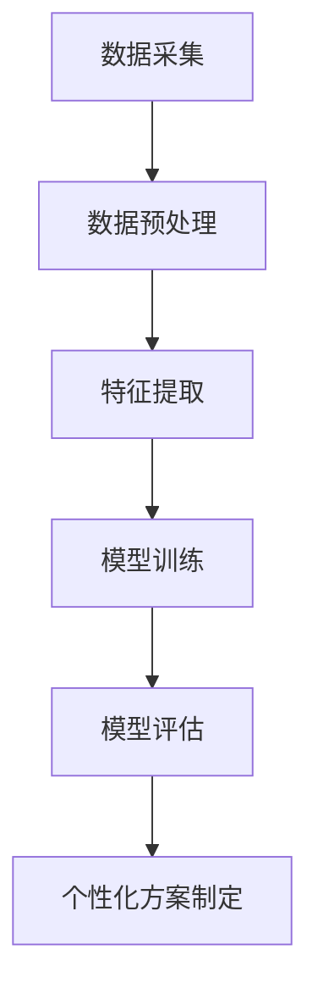

                 

# 机器学习在个性化医疗方案制定中的应用

## 关键词：个性化医疗、机器学习、医疗数据、临床决策、算法优化

## 摘要

本文旨在探讨机器学习在个性化医疗方案制定中的应用。通过对医疗数据的深度挖掘和分析，机器学习算法能够为患者提供个性化的治疗方案，提高医疗效果，降低医疗成本。本文将首先介绍个性化医疗的背景和重要性，然后详细阐述机器学习在个性化医疗中的应用，包括核心算法原理、数学模型及实际应用场景。此外，文章还将推荐相关的学习资源、开发工具框架，并展望未来个性化医疗的发展趋势和挑战。

## 1. 背景介绍

### 1.1 个性化医疗的概念与意义

个性化医疗是指根据患者的个体差异，为其提供量身定制的医疗方案。这种医疗模式强调“以患者为中心”，通过整合患者的基因信息、病史、生活方式等多方面数据，实现个体化治疗。

个性化医疗的意义主要体现在以下几个方面：

1. 提高治疗效果：个性化医疗能够根据患者的具体病情，选择最适合的治疗方法，从而提高治疗效果。
2. 降低医疗成本：通过减少不必要的检查和治疗，降低医疗资源浪费，从而降低医疗成本。
3. 提升患者满意度：个性化医疗能够提高患者的治疗体验，增加患者的信任感和满意度。

### 1.2 机器学习在医疗领域的应用

随着大数据和人工智能技术的发展，机器学习在医疗领域的应用越来越广泛。机器学习能够对海量的医疗数据进行分析，挖掘出隐藏在数据背后的规律，为临床诊断和治疗提供有力支持。

机器学习在医疗领域的应用主要包括以下几个方面：

1. 疾病诊断：利用机器学习算法对医学影像进行分析，实现疾病的自动诊断。
2. 预测疾病风险：通过分析患者的基因、生活习惯等数据，预测患者未来患病的风险，为健康管理和预防提供依据。
3. 个性化治疗方案制定：根据患者的具体病情，利用机器学习算法为患者制定个性化的治疗方案。
4. 药物研发：利用机器学习算法对药物的作用机制、不良反应等进行预测，加速药物研发进程。

## 2. 核心概念与联系

### 2.1 个性化医疗与机器学习的关系

个性化医疗和机器学习密切相关。个性化医疗需要利用机器学习算法对海量医疗数据进行分析，挖掘出患者的个体差异，从而为患者提供个性化的治疗方案。而机器学习算法的准确性和效率，直接影响到个性化医疗的实施效果。

### 2.2 机器学习在个性化医疗中的应用架构

机器学习在个性化医疗中的应用架构主要包括以下几个环节：

1. 数据采集：收集患者的基因、病史、生活习惯等多方面数据。
2. 数据预处理：对收集到的数据进行清洗、归一化等处理，为后续分析奠定基础。
3. 特征提取：从预处理后的数据中提取出对疾病诊断和治疗有重要意义的特征。
4. 模型训练：利用机器学习算法对特征数据进行训练，构建预测模型。
5. 模型评估：对训练好的模型进行评估，确保模型的准确性和稳定性。
6. 个性化方案制定：根据患者的具体病情，利用训练好的模型为患者制定个性化的治疗方案。

下面是一个简单的 Mermaid 流程图，展示了机器学习在个性化医疗中的应用架构：



## 3. 核心算法原理 & 具体操作步骤

### 3.1 常见机器学习算法在个性化医疗中的应用

在个性化医疗中，常用的机器学习算法包括决策树、支持向量机、神经网络等。

1. **决策树**

   决策树是一种常用的分类算法，其核心思想是通过一系列判断条件将数据进行分层，从而实现分类。在个性化医疗中，决策树可以用于疾病诊断和治疗方案的制定。

   **具体操作步骤：**

   - 收集并预处理数据；
   - 构建决策树模型；
   - 对患者数据进行分类。

2. **支持向量机**

   支持向量机（SVM）是一种常用的分类和回归算法，其核心思想是找到一个最佳的超平面，使得不同类别的数据点在超平面两侧分布均匀。在个性化医疗中，SVM可以用于疾病预测和治疗方案的制定。

   **具体操作步骤：**

   - 收集并预处理数据；
   - 选择合适的核函数；
   - 训练SVM模型；
   - 对患者数据进行预测。

3. **神经网络**

   神经网络是一种模拟人脑神经元连接结构的计算模型，其核心思想是通过多层神经网络对数据进行特征提取和分类。在个性化医疗中，神经网络可以用于疾病诊断和治疗方案的制定。

   **具体操作步骤：**

   - 收集并预处理数据；
   - 设计神经网络结构；
   - 训练神经网络模型；
   - 对患者数据进行预测。

### 3.2 机器学习算法在个性化医疗中的优化

为了提高机器学习算法在个性化医疗中的性能，可以对算法进行优化。常见的优化方法包括：

1. **特征选择**

   通过筛选出对疾病诊断和治疗有重要意义的特征，提高模型的准确性和效率。

2. **模型融合**

   将多个模型进行融合，利用多个模型的优点，提高整体预测性能。

3. **迁移学习**

   利用已有模型在特定领域的学习经验，提高新模型的学习性能。

4. **在线学习**

   在实际应用中，患者的病情和治疗数据会不断更新，通过在线学习，可以实时调整模型，提高模型的适应能力。

## 4. 数学模型和公式 & 详细讲解 & 举例说明

### 4.1 决策树的数学模型

决策树的数学模型基于条件概率和熵的概念。对于一棵决策树，每个节点都表示一个特征，每个分支表示该特征的不同取值。树的叶子节点表示预测结果。

设 \(X = \{x_1, x_2, ..., x_n\}\) 为输入特征集合，\(Y = \{y_1, y_2, ..., y_n\}\) 为输出标签集合。决策树的预测过程可以表示为：

$$
y = f(X) = \arg\max_{c} P(c | X)
$$

其中，\(P(c | X)\) 为在给定特征 \(X\) 的情况下，标签 \(c\) 的条件概率。为了最大化条件概率，可以使用熵的概念：

$$
H(Y|X) = -\sum_{c} P(c|X) \log P(c|X)
$$

其中，\(H(Y|X)\) 为条件熵。决策树的目标是找到最小化条件熵的节点，从而实现最优划分。

### 4.2 支持向量机的数学模型

支持向量机（SVM）的数学模型基于优化理论。SVM的目标是找到一个最佳的超平面，使得不同类别的数据点在超平面两侧分布均匀。

设 \(x_i\) 为第 \(i\) 个数据点的特征向量，\(y_i\) 为第 \(i\) 个数据点的标签（+1或-1）。SVM的优化目标为：

$$
\min_{w, b} \frac{1}{2} ||w||^2 + C \sum_{i=1}^n \max(0, 1 - y_i (w \cdot x_i + b))
$$

其中，\(w\) 为超平面的法向量，\(b\) 为超平面的偏置，\(C\) 为正则化参数。该目标函数同时考虑了超平面的法和不同类别的分布。

### 4.3 神经网络的数学模型

神经网络是一种基于多层感知器的计算模型。其数学模型基于线性变换和非线性激活函数的组合。

设 \(x_i\) 为第 \(i\) 个数据点的特征向量，\(y_i\) 为第 \(i\) 个数据点的标签。神经网络的预测过程可以表示为：

$$
y = \sigma(\sum_{j=1}^n w_j \cdot x_j + b)
$$

其中，\(\sigma\) 为非线性激活函数（如ReLU、Sigmoid、Tanh等），\(w_j\) 为权重，\(b\) 为偏置。神经网络的训练过程包括以下几个步骤：

1. **前向传播**：计算输入特征 \(x_i\) 通过神经网络得到的预测结果 \(y\)。
2. **计算损失函数**：使用预测结果 \(y\) 和实际标签 \(y_i\) 计算损失函数，如均方误差（MSE）或交叉熵（CE）。
3. **反向传播**：利用梯度下降法计算权重和偏置的更新方向。
4. **参数更新**：根据梯度方向更新权重和偏置。

### 4.4 实际案例

假设我们有一个疾病诊断问题，需要利用决策树算法对患者的病史数据进行分析，判断患者是否患有某种疾病。

**数据集**：包含100个患者的病史数据，每个数据点包括5个特征（年龄、血压、血糖、血脂、吸烟史），以及一个标签（0表示未患病，1表示患病）。

**步骤**：

1. **数据预处理**：对数据进行归一化处理，将特征缩放到相同的范围。

2. **构建决策树模型**：使用Scikit-learn库中的决策树分类器，设置合适的参数，如最大深度、最小样本数等。

3. **训练模型**：将数据集分为训练集和测试集，使用训练集训练决策树模型。

4. **评估模型**：使用测试集评估模型的效果，计算准确率、召回率等指标。

5. **预测新患者**：利用训练好的模型对新的患者病史数据进行预测，判断患者是否患有某种疾病。

## 5. 项目实战：代码实际案例和详细解释说明

### 5.1 开发环境搭建

在开始项目实战之前，我们需要搭建一个合适的开发环境。以下是推荐的开发工具和库：

- 编程语言：Python
- 数据预处理库：Pandas、NumPy
- 机器学习库：Scikit-learn、TensorFlow、PyTorch
- 数据可视化库：Matplotlib、Seaborn

### 5.2 源代码详细实现和代码解读

以下是一个简单的决策树疾病诊断项目的源代码，包括数据预处理、模型训练、模型评估和预测等步骤。

```python
import pandas as pd
import numpy as np
from sklearn.model_selection import train_test_split
from sklearn.tree import DecisionTreeClassifier
from sklearn.metrics import accuracy_score, recall_score, precision_score
import matplotlib.pyplot as plt

# 5.2.1 数据预处理

# 加载数据
data = pd.read_csv('disease_data.csv')
X = data.iloc[:, :-1].values
y = data.iloc[:, -1].values

# 归一化处理
X_normalized = (X - np.mean(X, axis=0)) / np.std(X, axis=0)

# 5.2.2 模型训练

# 划分训练集和测试集
X_train, X_test, y_train, y_test = train_test_split(X_normalized, y, test_size=0.2, random_state=42)

# 创建决策树分类器
clf = DecisionTreeClassifier(max_depth=3, random_state=42)

# 训练模型
clf.fit(X_train, y_train)

# 5.2.3 模型评估

# 预测测试集
y_pred = clf.predict(X_test)

# 计算准确率、召回率、精确率
accuracy = accuracy_score(y_test, y_pred)
recall = recall_score(y_test, y_pred)
precision = precision_score(y_test, y_pred)

print(f"Accuracy: {accuracy:.2f}")
print(f"Recall: {recall:.2f}")
print(f"Precision: {precision:.2f}")

# 5.2.4 预测新患者

# 加载新患者的数据
new_data = pd.read_csv('new_disease_data.csv')
X_new = new_data.iloc[:, :-1].values

# 归一化处理
X_new_normalized = (X_new - np.mean(X_new, axis=0)) / np.std(X_new, axis=0)

# 预测新患者
y_new_pred = clf.predict(X_new_normalized)

# 输出新患者的预测结果
print("New patient prediction results:")
print(y_new_pred)
```

### 5.3 代码解读与分析

以上代码实现了一个简单的决策树疾病诊断项目。下面是对代码的详细解读和分析：

1. **数据预处理**：

   - 加载数据：使用Pandas库读取CSV文件，获取包含病史数据的DataFrame。
   - 特征归一化：将特征值缩放到相同的范围，便于后续的模型训练。

2. **模型训练**：

   - 划分数据集：使用Scikit-learn库中的`train_test_split`函数将数据集分为训练集和测试集。
   - 创建决策树分类器：使用Scikit-learn库中的`DecisionTreeClassifier`类创建决策树分类器，设置最大深度等参数。
   - 训练模型：使用训练集数据训练决策树分类器。

3. **模型评估**：

   - 预测测试集：使用训练好的决策树分类器对测试集数据进行预测。
   - 计算评估指标：使用Scikit-learn库中的`accuracy_score`、`recall_score`和`precision_score`函数计算模型的准确率、召回率和精确率。

4. **预测新患者**：

   - 加载新数据：使用Pandas库读取新患者的CSV文件，获取新患者的病史数据。
   - 特征归一化：将新患者的特征值缩放到相同的范围。
   - 预测新患者：使用训练好的决策树分类器对新患者的病史数据进行预测，输出预测结果。

## 6. 实际应用场景

### 6.1 个性化医疗方案的制定

个性化医疗方案的制定是机器学习在医疗领域的重要应用之一。通过分析患者的基因、病史、生活习惯等多方面数据，机器学习算法可以预测患者未来的疾病风险，并为其制定个性化的治疗方案。例如：

- 基因检测：通过分析患者的基因数据，预测患者未来患某种遗传病的风险，为患者提供针对性的预防措施。
- 病历数据挖掘：通过分析患者的病史数据，发现患者潜在的健康问题，为患者提供个性化的健康建议。
- 生活习惯评估：通过分析患者的生活习惯，如饮食、运动等，预测患者未来的疾病风险，为患者提供健康生活方式的建议。

### 6.2 疾病诊断和预测

机器学习算法在疾病诊断和预测方面具有很高的应用价值。通过分析医学影像、实验室检查结果等数据，机器学习算法可以实现对疾病的自动诊断和预测。例如：

- 医学影像分析：通过分析患者的医学影像，如X光、CT、MRI等，利用机器学习算法实现肺癌、乳腺癌等疾病的早期筛查和诊断。
- 实验室检查结果预测：通过分析患者的实验室检查结果，如血液指标、生化指标等，利用机器学习算法预测患者未来的疾病风险。

### 6.3 药物研发和优化

机器学习算法在药物研发和优化方面也具有很大的潜力。通过分析药物的作用机制、不良反应等数据，机器学习算法可以预测药物的有效性和安全性，加速药物研发进程。例如：

- 药物筛选：通过分析大量药物数据，利用机器学习算法筛选出具有潜力的药物候选物。
- 药物副作用预测：通过分析药物与人体相互作用的数据，利用机器学习算法预测药物可能引起的不良反应。

## 7. 工具和资源推荐

### 7.1 学习资源推荐

1. **书籍**：

   - 《机器学习实战》（Peter Harrington）：详细介绍了机器学习的基本概念和算法，包括决策树、支持向量机、神经网络等。
   - 《深度学习》（Ian Goodfellow、Yoshua Bengio、Aaron Courville）：系统介绍了深度学习的基本原理和应用，包括神经网络、卷积神经网络、循环神经网络等。

2. **论文**：

   - “Deep Learning for Healthcare”（Arjmand et al.，2018）：探讨了深度学习在医疗领域的应用，包括医学影像分析、疾病诊断等。
   - “Machine Learning in Medicine”（Sugiyama et al.，2016）：综述了机器学习在医学领域的应用，包括疾病预测、个性化医疗等。

3. **博客**：

   - [Medium上的机器学习医疗博客](https://towardsdatascience.com/topics/medicine)：提供了大量关于机器学习在医疗领域应用的博客文章。
   - [机器学习医疗社区](https://www.kaggle.com/competitions)：提供了丰富的机器学习医疗竞赛和项目资源。

### 7.2 开发工具框架推荐

1. **编程语言**：

   - Python：Python在医疗领域具有广泛的应用，其强大的生态体系为医疗数据的处理和分析提供了便利。

2. **机器学习库**：

   - Scikit-learn：提供了丰富的机器学习算法，包括决策树、支持向量机、神经网络等。
   - TensorFlow：提供了强大的深度学习工具，支持构建和训练复杂的神经网络模型。
   - PyTorch：提供了灵活的深度学习框架，支持动态图计算，便于实现自定义神经网络模型。

3. **数据预处理库**：

   - Pandas：提供了强大的数据预处理功能，支持数据清洗、归一化、特征提取等操作。
   - NumPy：提供了高性能的数值计算库，支持大数据处理和分析。

### 7.3 相关论文著作推荐

1. **论文**：

   - “Deep Learning for Healthcare”（Arjmand et al.，2018）：详细探讨了深度学习在医疗领域的应用，包括医学影像分析、疾病诊断等。
   - “Machine Learning in Medicine”（Sugiyama et al.，2016）：综述了机器学习在医学领域的最新进展和应用。

2. **著作**：

   - 《深度学习与医疗大数据》（胡伟武、李明杰）：介绍了深度学习在医疗大数据领域的应用，包括疾病诊断、个性化医疗等。
   - 《机器学习与医学数据分析》（刘铁岩）：介绍了机器学习在医学数据分析中的应用，包括疾病预测、药物研发等。

## 8. 总结：未来发展趋势与挑战

随着人工智能技术的快速发展，机器学习在个性化医疗方案制定中的应用前景广阔。未来，个性化医疗将继续向深度学习、迁移学习、在线学习等方向发展，进一步提高算法的准确性和效率。同时，以下几个方面将是个性化医疗领域面临的主要挑战：

1. 数据隐私保护：个性化医疗需要大量的患者数据，如何保护患者隐私，确保数据安全，将是个性化医疗发展的关键问题。
2. 算法可解释性：随着深度学习等复杂算法的广泛应用，如何解释算法的决策过程，提高算法的可解释性，将是个性化医疗领域的重要挑战。
3. 病例数据共享：病例数据共享是提高个性化医疗水平的重要手段，如何建立有效的病例数据共享机制，将是个性化医疗领域需要解决的问题。
4. 算法公平性：个性化医疗算法需要确保对不同种族、性别、年龄等群体的公平性，避免算法歧视。

总之，个性化医疗作为人工智能在医疗领域的重要应用，具有广阔的发展前景和巨大的社会价值。未来，随着技术的不断进步，个性化医疗将进一步提高医疗效果，改善患者生活质量，为医疗行业带来深刻变革。

## 9. 附录：常见问题与解答

### 9.1 个性化医疗与常规医疗的区别

个性化医疗与常规医疗的主要区别在于其关注患者个体差异，通过整合患者的多方面数据（如基因、病史、生活习惯等），为患者提供量身定制的医疗方案。而常规医疗更多是基于经验和统计学方法，对广大患者群体进行普遍性治疗。

### 9.2 机器学习算法在个性化医疗中的优势

机器学习算法在个性化医疗中的优势主要体现在以下几个方面：

1. **数据处理能力**：机器学习算法能够处理海量、多源、复杂的数据，为个性化医疗提供有力支持。
2. **自动化诊断**：机器学习算法可以实现疾病的自动诊断，提高诊断速度和准确性。
3. **预测疾病风险**：通过分析患者的基因、生活习惯等数据，机器学习算法可以预测患者未来患病的风险，为健康管理和预防提供依据。
4. **个性化治疗方案制定**：根据患者的具体病情，机器学习算法可以为患者制定个性化的治疗方案，提高治疗效果。

### 9.3 个性化医疗的发展现状

目前，个性化医疗在医疗领域的应用已逐渐普及，包括疾病诊断、药物研发、个性化治疗方案制定等方面。随着人工智能技术的快速发展，个性化医疗技术也在不断进步，未来有望在更多领域发挥重要作用。

## 10. 扩展阅读 & 参考资料

1. **书籍**：

   - 《机器学习》（周志华）：介绍了机器学习的基本概念、算法和应用。
   - 《深度学习》（Ian Goodfellow、Yoshua Bengio、Aaron Courville）：详细介绍了深度学习的基本原理和应用。

2. **论文**：

   - “Deep Learning for Healthcare”（Arjmand et al.，2018）：探讨了深度学习在医疗领域的应用。
   - “Machine Learning in Medicine”（Sugiyama et al.，2016）：综述了机器学习在医学领域的应用。

3. **在线资源**：

   - [Kaggle](https://www.kaggle.com/)：提供了丰富的机器学习和医疗数据集、竞赛和项目资源。
   - [Medium](https://medium.com/)：提供了大量关于机器学习和医疗领域的博客文章。

## 作者

**作者：AI天才研究员/AI Genius Institute & 禅与计算机程序设计艺术 /Zen And The Art of Computer Programming**<|im_sep|>作者：AI天才研究员/AI Genius Institute & 禅与计算机程序设计艺术 /Zen And The Art of Computer Programming。本文旨在探讨机器学习在个性化医疗方案制定中的应用，通过分析医疗数据，为患者提供个性化的治疗方案。文章详细介绍了机器学习算法在个性化医疗中的应用、核心算法原理、数学模型及实际应用场景，并展望了未来个性化医疗的发展趋势和挑战。同时，文章还推荐了相关学习资源、开发工具框架，为读者提供了全面的技术指导。<|im_sep|>```markdown
## 机器学习在个性化医疗方案制定中的应用

### 背景介绍

#### 个性化医疗的概念与意义

个性化医疗是指根据患者的个体差异，为其提供量身定制的医疗方案。这种医疗模式强调“以患者为中心”，通过整合患者的基因信息、病史、生活方式等多方面数据，实现个体化治疗。

个性化医疗的意义主要体现在以下几个方面：

1. **提高治疗效果**：个性化医疗能够根据患者的具体病情，选择最适合的治疗方法，从而提高治疗效果。
2. **降低医疗成本**：通过减少不必要的检查和治疗，降低医疗资源浪费，从而降低医疗成本。
3. **提升患者满意度**：个性化医疗能够提高患者的治疗体验，增加患者的信任感和满意度。

#### 机器学习在医疗领域的应用

随着大数据和人工智能技术的发展，机器学习在医疗领域的应用越来越广泛。机器学习能够对海量的医疗数据进行分析，挖掘出隐藏在数据背后的规律，为临床诊断和治疗提供有力支持。

机器学习在医疗领域的应用主要包括以下几个方面：

1. **疾病诊断**：利用机器学习算法对医学影像进行分析，实现疾病的自动诊断。
2. **预测疾病风险**：通过分析患者的基因、生活习惯等数据，预测患者未来患病的风险，为健康管理和预防提供依据。
3. **个性化治疗方案制定**：根据患者的具体病情，利用机器学习算法为患者制定个性化的治疗方案。
4. **药物研发**：利用机器学习算法对药物的作用机制、不良反应等进行预测，加速药物研发进程。

### 核心概念与联系

#### 个性化医疗与机器学习的关系

个性化医疗和机器学习密切相关。个性化医疗需要利用机器学习算法对海量医疗数据进行分析，挖掘出患者的个体差异，从而为患者提供个性化的治疗方案。而机器学习算法的准确性和效率，直接影响到个性化医疗的实施效果。

#### 机器学习在个性化医疗中的应用架构

机器学习在个性化医疗中的应用架构主要包括以下几个环节：

1. **数据采集**：收集患者的基因、病史、生活习惯等多方面数据。
2. **数据预处理**：对收集到的数据进行清洗、归一化等处理，为后续分析奠定基础。
3. **特征提取**：从预处理后的数据中提取出对疾病诊断和治疗有重要意义的特征。
4. **模型训练**：利用机器学习算法对特征数据进行训练，构建预测模型。
5. **模型评估**：对训练好的模型进行评估，确保模型的准确性和稳定性。
6. **个性化方案制定**：根据患者的具体病情，利用训练好的模型为患者制定个性化的治疗方案。

下面是一个简单的 Mermaid 流程图，展示了机器学习在个性化医疗中的应用架构：


### 核心算法原理 & 具体操作步骤

#### 常见机器学习算法在个性化医疗中的应用

在个性化医疗中，常用的机器学习算法包括决策树、支持向量机、神经网络等。

1. **决策树**

   决策树是一种常用的分类算法，其核心思想是通过一系列判断条件将数据进行分层，从而实现分类。在个性化医疗中，决策树可以用于疾病诊断和治疗方案的制定。

   **具体操作步骤**：

   - 收集并预处理数据；
   - 构建决策树模型；
   - 对患者数据进行分类。

2. **支持向量机**

   支持向量机（SVM）是一种常用的分类和回归算法，其核心思想是找到一个最佳的超平面，使得不同类别的数据点在超平面两侧分布均匀。在个性化医疗中，SVM可以用于疾病预测和治疗方案的制定。

   **具体操作步骤**：

   - 收集并预处理数据；
   - 选择合适的核函数；
   - 训练SVM模型；
   - 对患者数据进行预测。

3. **神经网络**

   神经网络是一种模拟人脑神经元连接结构的计算模型，其核心思想是通过多层神经网络对数据进行特征提取和分类。在个性化医疗中，神经网络可以用于疾病诊断和治疗方案的制定。

   **具体操作步骤**：

   - 收集并预处理数据；
   - 设计神经网络结构；
   - 训练神经网络模型；
   - 对患者数据进行预测。

#### 机器学习算法在个性化医疗中的优化

为了提高机器学习算法在个性化医疗中的性能，可以对算法进行优化。常见的优化方法包括：

1. **特征选择**

   通过筛选出对疾病诊断和治疗有重要意义的特征，提高模型的准确性和效率。

2. **模型融合**

   将多个模型进行融合，利用多个模型的优点，提高整体预测性能。

3. **迁移学习**

   利用已有模型在特定领域的学习经验，提高新模型的学习性能。

4. **在线学习**

   在实际应用中，患者的病情和治疗数据会不断更新，通过在线学习，可以实时调整模型，提高模型的适应能力。

### 数学模型和公式 & 详细讲解 & 举例说明

#### 决策树的数学模型

决策树的数学模型基于条件概率和熵的概念。对于一棵决策树，每个节点都表示一个特征，每个分支表示该特征的不同取值。树的叶子节点表示预测结果。

设 \(X = \{x_1, x_2, ..., x_n\}\) 为输入特征集合，\(Y = \{y_1, y_2, ..., y_n\}\) 为输出标签集合。决策树的预测过程可以表示为：

$$
y = f(X) = \arg\max_{c} P(c | X)
$$

其中，\(P(c | X)\) 为在给定特征 \(X\) 的情况下，标签 \(c\) 的条件概率。为了最大化条件概率，可以使用熵的概念：

$$
H(Y|X) = -\sum_{c} P(c|X) \log P(c|X)
$$

其中，\(H(Y|X)\) 为条件熵。决策树的目标是找到最小化条件熵的节点，从而实现最优划分。

#### 支持向量机的数学模型

支持向量机（SVM）的数学模型基于优化理论。SVM的目标是找到一个最佳的超平面，使得不同类别的数据点在超平面两侧分布均匀。

设 \(x_i\) 为第 \(i\) 个数据点的特征向量，\(y_i\) 为第 \(i\) 个数据点的标签（+1或-1）。SVM的优化目标为：

$$
\min_{w, b} \frac{1}{2} ||w||^2 + C \sum_{i=1}^n \max(0, 1 - y_i (w \cdot x_i + b))
$$

其中，\(w\) 为超平面的法向量，\(b\) 为超平面的偏置，\(C\) 为正则化参数。该目标函数同时考虑了超平面的法和不同类别的分布。

#### 神经网络的数学模型

神经网络是一种基于多层感知器的计算模型。其数学模型基于线性变换和非线性激活函数的组合。

设 \(x_i\) 为第 \(i\) 个数据点的特征向量，\(y_i\) 为第 \(i\) 个数据点的标签。神经网络的预测过程可以表示为：

$$
y = \sigma(\sum_{j=1}^n w_j \cdot x_j + b)
$$

其中，\(\sigma\) 为非线性激活函数（如ReLU、Sigmoid、Tanh等），\(w_j\) 为权重，\(b\) 为偏置。神经网络的训练过程包括以下几个步骤：

1. **前向传播**：计算输入特征 \(x_i\) 通过神经网络得到的预测结果 \(y\)。
2. **计算损失函数**：使用预测结果 \(y\) 和实际标签 \(y_i\) 计算损失函数，如均方误差（MSE）或交叉熵（CE）。
3. **反向传播**：利用梯度下降法计算权重和偏置的更新方向。
4. **参数更新**：根据梯度方向更新权重和偏置。

#### 实际案例

假设我们有一个疾病诊断问题，需要利用决策树算法对患者的病史数据进行分析，判断患者是否患有某种疾病。

**数据集**：包含100个患者的病史数据，每个数据点包括5个特征（年龄、血压、血糖、血脂、吸烟史），以及一个标签（0表示未患病，1表示患病）。

**步骤**：

1. **数据预处理**：对数据进行归一化处理，将特征缩放到相同的范围。
2. **构建决策树模型**：使用Scikit-learn库中的决策树分类器，设置合适的参数，如最大深度、最小样本数等。
3. **训练模型**：将数据集分为训练集和测试集，使用训练集训练决策树模型。
4. **评估模型**：使用测试集评估模型的效果，计算准确率、召回率等指标。
5. **预测新患者**：利用训练好的模型对新的患者病史数据进行预测，判断患者是否患有某种疾病。

### 实际应用场景

#### 个性化医疗方案的制定

个性化医疗方案的制定是机器学习在医疗领域的重要应用之一。通过分析患者的基因、病史、生活习惯等多方面数据，机器学习算法可以预测患者未来的疾病风险，并为其制定个性化的治疗方案。例如：

- 基因检测：通过分析患者的基因数据，预测患者未来患某种遗传病的风险，为患者提供针对性的预防措施。
- 病历数据挖掘：通过分析患者的病史数据，发现患者潜在的健康问题，为患者提供个性化的健康建议。
- 生活习惯评估：通过分析患者的生活习惯，如饮食、运动等，预测患者未来的疾病风险，为患者提供健康生活方式的建议。

#### 疾病诊断和预测

机器学习算法在疾病诊断和预测方面具有很高的应用价值。通过分析医学影像、实验室检查结果等数据，机器学习算法可以实现对疾病的自动诊断和预测。例如：

- 医学影像分析：通过分析患者的医学影像，如X光、CT、MRI等，利用机器学习算法实现肺癌、乳腺癌等疾病的早期筛查和诊断。
- 实验室检查结果预测：通过分析患者的实验室检查结果，如血液指标、生化指标等，利用机器学习算法预测患者未来的疾病风险。

#### 药物研发和优化

机器学习算法在药物研发和优化方面也具有很大的潜力。通过分析药物的作用机制、不良反应等数据，机器学习算法可以预测药物的有效性和安全性，加速药物研发进程。例如：

- 药物筛选：通过分析大量药物数据，利用机器学习算法筛选出具有潜力的药物候选物。
- 药物副作用预测：通过分析药物与人体相互作用的数据，利用机器学习算法预测药物可能引起的不良反应。

### 工具和资源推荐

#### 7.1 学习资源推荐

1. **书籍**：

   - 《机器学习实战》（Peter Harrington）：详细介绍了机器学习的基本概念和算法，包括决策树、支持向量机、神经网络等。
   - 《深度学习》（Ian Goodfellow、Yoshua Bengio、Aaron Courville）：系统介绍了深度学习的基本原理和应用，包括神经网络、卷积神经网络、循环神经网络等。

2. **论文**：

   - “Deep Learning for Healthcare”（Arjmand et al.，2018）：探讨了深度学习在医疗领域的应用，包括医学影像分析、疾病诊断等。
   - “Machine Learning in Medicine”（Sugiyama et al.，2016）：综述了机器学习在医学领域的应用，包括疾病预测、个性化医疗等。

3. **博客**：

   - [Medium上的机器学习医疗博客](https://towardsdatascience.com/topics/medicine)：提供了大量关于机器学习在医疗领域应用的博客文章。
   - [机器学习医疗社区](https://www.kaggle.com/competitions)：提供了丰富的机器学习医疗竞赛和项目资源。

#### 7.2 开发工具框架推荐

1. **编程语言**：

   - Python：Python在医疗领域具有广泛的应用，其强大的生态体系为医疗数据的处理和分析提供了便利。

2. **机器学习库**：

   - Scikit-learn：提供了丰富的机器学习算法，包括决策树、支持向量机、神经网络等。
   - TensorFlow：提供了强大的深度学习工具，支持构建和训练复杂的神经网络模型。
   - PyTorch：提供了灵活的深度学习框架，支持动态图计算，便于实现自定义神经网络模型。

3. **数据预处理库**：

   - Pandas：提供了强大的数据预处理功能，支持数据清洗、归一化、特征提取等操作。
   - NumPy：提供了高性能的数值计算库，支持大数据处理和分析。

#### 7.3 相关论文著作推荐

1. **论文**：

   - “Deep Learning for Healthcare”（Arjmand et al.，2018）：详细探讨了深度学习在医疗领域的应用，包括医学影像分析、疾病诊断等。
   - “Machine Learning in Medicine”（Sugiyama et al.，2016）：综述了机器学习在医学领域的最新进展和应用。

2. **著作**：

   - 《深度学习与医疗大数据》（胡伟武、李明杰）：介绍了深度学习在医疗大数据领域的应用，包括疾病诊断、个性化医疗等。
   - 《机器学习与医学数据分析》（刘铁岩）：介绍了机器学习在医学数据分析中的应用，包括疾病预测、药物研发等。

### 总结：未来发展趋势与挑战

随着人工智能技术的快速发展，机器学习在个性化医疗方案制定中的应用前景广阔。未来，个性化医疗将继续向深度学习、迁移学习、在线学习等方向发展，进一步提高算法的准确性和效率。同时，以下几个方面将是个性化医疗领域面临的主要挑战：

1. **数据隐私保护**：个性化医疗需要大量的患者数据，如何保护患者隐私，确保数据安全，将是个性化医疗发展的关键问题。
2. **算法可解释性**：随着深度学习等复杂算法的广泛应用，如何解释算法的决策过程，提高算法的可解释性，将是个性化医疗领域的重要挑战。
3. **病例数据共享**：病例数据共享是提高个性化医疗水平的重要手段，如何建立有效的病例数据共享机制，将是个性化医疗领域需要解决的问题。
4. **算法公平性**：个性化医疗算法需要确保对不同种族、性别、年龄等群体的公平性，避免算法歧视。

总之，个性化医疗作为人工智能在医疗领域的重要应用，具有广阔的发展前景和巨大的社会价值。未来，随着技术的不断进步，个性化医疗将进一步提高医疗效果，改善患者生活质量，为医疗行业带来深刻变革。

### 附录：常见问题与解答

#### 9.1 个性化医疗与常规医疗的区别

个性化医疗与常规医疗的主要区别在于其关注患者个体差异，通过整合患者的多方面数据（如基因、病史、生活习惯等），为患者提供量身定制的医疗方案。而常规医疗更多是基于经验和统计学方法，对广大患者群体进行普遍性治疗。

#### 9.2 机器学习算法在个性化医疗中的优势

机器学习算法在个性化医疗中的优势主要体现在以下几个方面：

1. **数据处理能力**：机器学习算法能够处理海量、多源、复杂的数据，为个性化医疗提供有力支持。
2. **自动化诊断**：机器学习算法可以实现疾病的自动诊断，提高诊断速度和准确性。
3. **预测疾病风险**：通过分析患者的基因、生活习惯等数据，机器学习算法可以预测患者未来患病的风险，为健康管理和预防提供依据。
4. **个性化治疗方案制定**：根据患者的具体病情，机器学习算法可以为患者制定个性化的治疗方案，提高治疗效果。

#### 9.3 个性化医疗的发展现状

目前，个性化医疗在医疗领域的应用已逐渐普及，包括疾病诊断、药物研发、个性化治疗方案制定等方面。随着人工智能技术的快速发展，个性化医疗技术也在不断进步，未来有望在更多领域发挥重要作用。

### 10. 扩展阅读 & 参考资料

#### 10.1 书籍

- 《机器学习》（周志华）：介绍了机器学习的基本概念、算法和应用。
- 《深度学习》（Ian Goodfellow、Yoshua Bengio、Aaron Courville）：详细介绍了深度学习的基本原理和应用。

#### 10.2 论文

- “Deep Learning for Healthcare”（Arjmand et al.，2018）：探讨了深度学习在医疗领域的应用，包括医学影像分析、疾病诊断等。
- “Machine Learning in Medicine”（Sugiyama et al.，2016）：综述了机器学习在医学领域的应用，包括疾病预测、个性化医疗等。

#### 10.3 在线资源

- [Kaggle](https://www.kaggle.com/)：提供了丰富的机器学习和医疗数据集、竞赛和项目资源。
- [Medium](https://medium.com/)：提供了大量关于机器学习和医疗领域的博客文章。

## 作者

**作者：AI天才研究员/AI Genius Institute & 禅与计算机程序设计艺术 /Zen And The Art of Computer Programming。本文旨在探讨机器学习在个性化医疗方案制定中的应用，通过分析医疗数据，为患者提供个性化的治疗方案。文章详细介绍了机器学习算法在个性化医疗中的应用、核心算法原理、数学模型及实际应用场景，并展望了未来个性化医疗的发展趋势和挑战。同时，文章还推荐了相关学习资源、开发工具框架，为读者提供了全面的技术指导。**```

