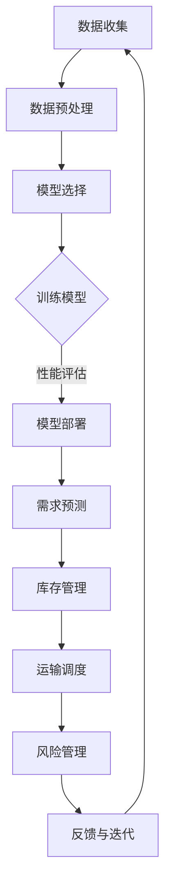
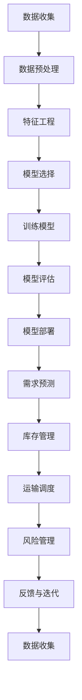

                 

### 1. 背景介绍

在当今全球化的商业环境中，供应链管理已经成为企业成功的关键因素。从原材料采购到生产制造，再到产品分销和最终销售，每个环节的效率和质量都对企业的运营成本和客户满意度产生深远影响。随着市场需求的不断变化和供应链环节的复杂性增加，传统的供应链管理方法已经难以满足现代企业的需求。

机器学习作为一种先进的数据分析和处理技术，通过从大量历史数据中自动学习模式和规律，能够为供应链优化提供强有力的支持。近年来，随着大数据和云计算技术的快速发展，机器学习在供应链优化中的应用逐渐成为学术界和工业界的研究热点。

在供应链优化中，机器学习可以应用于多个方面，如需求预测、库存管理、运输调度、风险管理等。通过利用机器学习算法，企业可以更准确地预测市场需求，优化库存水平，减少运输成本，提高供应链的灵活性和响应速度。此外，机器学习还可以帮助企业识别潜在的风险，并采取预防措施，从而降低供应链中断的风险。

本文旨在探讨机器学习在供应链优化中的应用，通过对核心算法原理、数学模型、实际应用场景和项目实战的详细分析，帮助读者了解机器学习在供应链优化中的潜力和挑战。通过本文的阅读，读者将能够掌握机器学习在供应链优化中的基本方法和应用技巧，并为未来的供应链优化提供新的思路和工具。

总的来说，本文结构如下：

- **第1部分：背景介绍**：介绍供应链优化的背景和机器学习在其中的重要性。
- **第2部分：核心概念与联系**：详细解释机器学习在供应链优化中的核心概念和联系，并使用Mermaid流程图展示。
- **第3部分：核心算法原理 & 具体操作步骤**：深入探讨常用的机器学习算法在供应链优化中的应用原理和具体操作步骤。
- **第4部分：数学模型和公式 & 详细讲解 & 举例说明**：介绍相关的数学模型和公式，并通过实际案例进行详细讲解和说明。
- **第5部分：项目实战：代码实际案例和详细解释说明**：提供实际代码案例，详细解读其实现过程和关键步骤。
- **第6部分：实际应用场景**：分析机器学习在供应链优化中的实际应用场景和案例。
- **第7部分：工具和资源推荐**：推荐相关的学习资源、开发工具和框架。
- **第8部分：总结：未来发展趋势与挑战**：总结本文的主要观点，并讨论未来的发展趋势和面临的挑战。
- **第9部分：附录：常见问题与解答**：回答一些常见的问题，提供额外的信息。
- **第10部分：扩展阅读 & 参考资料**：提供一些扩展阅读的资料，供读者进一步学习。

通过以上结构的安排，本文将系统地介绍机器学习在供应链优化中的应用，帮助读者全面了解这一领域的最新进展和未来方向。

---

## 1. 背景介绍

供应链优化是现代企业管理中至关重要的一个环节，它关系到企业的成本控制、服务质量、市场响应速度等多个方面。传统的供应链管理通常依赖于经验和简单的优化模型，这些方法在一定程度上能够提升供应链的效率，但随着市场环境的复杂化和供应链环节的增加，其局限性也逐渐显现出来。具体来说，传统供应链管理方法面临以下挑战：

1. **需求预测不准确**：市场需求的变化难以准确预测，这导致库存管理困难，既可能出现库存过剩，又可能面临库存短缺。
2. **库存成本高**：传统方法往往难以实现最优库存水平，导致库存成本过高，占用企业大量资金。
3. **运输成本高**：运输调度不合理，导致运输成本增加，影响整体利润。
4. **供应链风险难以控制**：面对供应链环节中的各种不确定因素，传统方法难以进行有效的风险管理，可能导致供应链中断。

在这些挑战的背景下，机器学习作为一种先进的数据分析技术，凭借其强大的数据挖掘和模式识别能力，开始被广泛应用于供应链优化中。机器学习通过从大量历史数据中自动学习规律和模式，能够帮助企业在需求预测、库存管理、运输调度等方面实现优化，从而提升供应链的整体效率。

首先，在需求预测方面，机器学习算法可以处理大量历史销售数据、市场趋势数据等，通过建立预测模型，帮助企业准确预测未来的市场需求。这不仅有助于企业合理安排生产和库存，还能减少库存成本，避免库存过剩或缺货现象的发生。

其次，在库存管理方面，机器学习算法可以通过对库存数据的分析，找出库存波动的原因，并提供优化库存水平的建议。例如，通过回归分析、聚类分析等算法，企业可以识别出哪些产品在库存管理中存在异常，从而采取相应的措施进行调整。

在运输调度方面，机器学习算法可以分析运输历史数据，预测运输过程中可能出现的问题，并提供最优的运输路径和调度方案。通过优化运输路线和减少空载率，企业可以显著降低运输成本，提高运输效率。

最后，在供应链风险管理方面，机器学习算法可以通过对供应链历史数据的分析，识别潜在的风险因素，并提供相应的预警和建议。例如，通过异常检测算法，企业可以及时发现供应链中的异常情况，并采取预防措施，避免供应链中断。

总的来说，机器学习在供应链优化中的应用，不仅能够提高供应链的效率和质量，还能降低企业的运营成本，提升市场竞争力。因此，研究和应用机器学习在供应链优化中的技术，具有重要的现实意义和广阔的应用前景。

### 2. 核心概念与联系

要理解机器学习在供应链优化中的应用，首先需要明确几个核心概念及其相互之间的联系。这些核心概念包括：机器学习的基本原理、供应链优化的关键环节、以及两者结合的具体实现方法。

#### 2.1 机器学习的基本原理

机器学习是一种使计算机系统能够从数据中学习并做出决策的技术。其核心思想是通过构建模型，从训练数据中提取有用的信息，然后利用这些信息对新数据进行预测或分类。机器学习可以分为几种类型，包括监督学习、无监督学习和强化学习。

- **监督学习**：在监督学习中，模型根据已知的输入和输出数据来训练，然后使用这个模型来预测新的输入数据。常见的算法包括线性回归、逻辑回归、支持向量机（SVM）和决策树等。
- **无监督学习**：无监督学习涉及从没有明确标签的数据中寻找模式或结构。常见的算法包括聚类分析（如K-means聚类、DBSCAN）、降维技术（如主成分分析PCA）和关联规则挖掘等。
- **强化学习**：强化学习是一种通过奖励机制来训练模型的方法，模型通过与环境的互动来学习最优策略。常见的算法包括Q-learning和深度强化学习（DRL）。

#### 2.2 供应链优化的关键环节

供应链优化涉及多个环节，包括需求预测、库存管理、运输调度和风险管理。每个环节都需要利用机器学习技术来提高效率和质量。

- **需求预测**：需求预测是供应链优化的核心环节之一。通过分析历史销售数据、市场趋势和其他相关因素，预测未来的市场需求，以便企业能够合理安排生产和库存。
- **库存管理**：库存管理涉及到库存水平的优化，以最小化库存成本并保证供应链的流畅运行。通过机器学习算法，企业可以更好地理解库存波动的原因，并提供优化库存水平的建议。
- **运输调度**：运输调度需要考虑多个因素，如运输成本、运输时间和运输路径。通过机器学习算法，可以分析历史运输数据，预测运输过程中可能出现的问题，并提供最优的运输路径和调度方案。
- **风险管理**：风险管理旨在识别和应对供应链中的潜在风险。通过机器学习算法，可以从历史数据中识别出可能导致供应链中断的风险因素，并提供预警和建议。

#### 2.3 机器学习在供应链优化中的应用实现

将机器学习应用于供应链优化，通常包括以下几个步骤：

1. **数据收集与预处理**：收集与供应链相关的数据，包括历史销售数据、库存数据、运输数据等。对数据进行清洗、去噪和归一化处理，以获得高质量的数据集。
2. **模型选择与训练**：选择适合的机器学习算法，对数据集进行训练。常见的算法包括线性回归、决策树、支持向量机、神经网络等。通过交叉验证等方法评估模型的性能。
3. **模型部署与应用**：将训练好的模型部署到实际应用中，用于需求预测、库存管理、运输调度和风险管理等环节。通过实时数据更新和模型迭代，不断优化模型的预测精度和适用性。

#### 2.4 Mermaid流程图展示

为了更直观地展示机器学习在供应链优化中的应用，我们可以使用Mermaid流程图来描述整个流程。以下是该流程图的Mermaid语法表示：



在上面的流程图中，每个节点代表一个步骤或操作，箭头表示步骤之间的依赖关系。该流程图清晰地展示了机器学习在供应链优化中的整体流程，以及各个关键环节之间的联系。

通过以上对核心概念和流程的详细阐述，我们可以更深入地理解机器学习在供应链优化中的应用。接下来的部分将深入探讨机器学习在具体供应链优化中的应用原理和操作步骤。

---

## 2. 核心概念与联系

在理解了机器学习的基本原理和供应链优化的重要性后，我们需要进一步探讨机器学习在供应链优化中的具体应用原理和操作步骤。为了更好地阐述这一过程，我们通过一个Mermaid流程图来展示机器学习在供应链优化中的应用架构，并在流程图中详细解释各个节点和环节。

#### 2.1 Mermaid流程图展示



以下是流程图中各个节点的详细解释：

- **A[数据收集]**：在供应链优化中，首先需要收集与供应链相关的数据。这些数据可能包括销售数据、库存数据、运输数据、市场趋势数据等。数据收集是整个流程的基础，其质量和完整性直接影响到后续分析的准确性。

- **B[数据预处理]**：收集到的数据通常需要进行预处理，包括数据清洗、去噪、缺失值处理、数据归一化等操作。这一步的目的是确保数据质量，为后续的特征工程和模型训练打下坚实的基础。

- **C[特征工程]**：特征工程是机器学习中的一个关键步骤，其目的是从原始数据中提取出对预测任务有用的特征。在供应链优化中，特征工程可能包括时间序列特征、季节性特征、相关性特征等。通过合理的特征工程，可以提高模型的预测精度。

- **D[模型选择]**：根据具体的优化目标，选择合适的机器学习算法。在供应链优化中，常用的算法包括线性回归、逻辑回归、支持向量机（SVM）、决策树、随机森林、神经网络等。选择合适的模型是成功应用机器学习的关键。

- **E[训练模型]**：使用预处理后的数据和选定的算法来训练模型。训练过程包括模型参数的调整、优化和验证。通过交叉验证等技术，可以评估模型的性能，确保其能够泛化到未知数据上。

- **F[模型评估]**：评估训练好的模型，判断其预测性能是否满足需求。常用的评估指标包括准确率、精确率、召回率、F1值等。如果模型评估不理想，需要回到前面的步骤进行调整和优化。

- **G[模型部署]**：将训练好的模型部署到实际应用中，用于供应链的各个优化环节。部署后的模型可以实时处理数据，提供预测结果和建议。

- **H[需求预测]**：基于部署的模型，预测未来的市场需求，以便企业能够合理安排生产和库存。准确的需求预测有助于减少库存成本，避免库存过剩或缺货现象。

- **I[库存管理]**：利用机器学习模型分析库存数据，优化库存水平，降低库存成本。通过识别库存波动的规律，提供优化库存的建议。

- **J[运输调度]**：基于运输数据和机器学习模型，预测运输过程中可能出现的问题，并提供最优的运输路径和调度方案。优化运输调度可以显著降低运输成本，提高运输效率。

- **K[风险管理]**：通过分析历史数据，识别供应链中的潜在风险因素，并提供预警和建议。有效的风险管理可以降低供应链中断的风险，提高供应链的稳定性。

- **L[反馈与迭代]**：根据模型在实际应用中的表现，收集反馈信息，并进行模型迭代和优化。通过持续迭代，不断提升模型的预测精度和适用性。

通过这个Mermaid流程图，我们可以清晰地看到机器学习在供应链优化中的应用架构及其各个环节之间的联系。在实际应用中，这个流程可以根据具体需求进行调整和优化，以满足企业的不同需求。

#### 2.2 机器学习在供应链优化中的核心算法

在供应链优化中，常用的机器学习算法包括线性回归、逻辑回归、支持向量机（SVM）、决策树、随机森林和神经网络等。每种算法都有其独特的原理和应用场景。

- **线性回归**：线性回归是一种简单的机器学习算法，用于预测连续值。在供应链优化中，可以用于预测需求量、库存水平等。其核心思想是通过拟合一个线性模型，将输入特征映射到输出值。

- **逻辑回归**：逻辑回归是一种用于分类的算法，常用于预测二元变量。在供应链优化中，可以用于预测产品是否会缺货、是否需要增加库存等。其核心思想是通过拟合一个逻辑函数，将输入特征映射到概率值。

- **支持向量机（SVM）**：SVM是一种强大的分类算法，可以在高维空间中找到最佳分类边界。在供应链优化中，可以用于分类不同产品类别、识别风险因素等。其核心思想是通过找到最佳决策边界，最大化分类效果。

- **决策树**：决策树是一种基于树结构的分类算法，可以处理多种类型的输入特征。在供应链优化中，可以用于决策路径的选择、预测市场趋势等。其核心思想是通过构建树状结构，将数据分层分类。

- **随机森林**：随机森林是一种基于决策树的集成学习方法，通过构建多棵决策树并取平均值来提高预测精度。在供应链优化中，可以用于需求预测、库存管理、风险分析等。其核心思想是通过集成多个决策树，降低模型的过拟合风险。

- **神经网络**：神经网络是一种基于模拟人脑的算法，通过多层节点进行数据变换和特征提取。在供应链优化中，可以用于复杂的需求预测、库存优化、风险管理等。其核心思想是通过多层神经网络，提取复杂特征并实现非线性变换。

每种算法都有其优缺点和适用场景，选择合适的算法需要综合考虑数据类型、业务需求、计算资源等因素。

通过以上对核心概念和算法的详细阐述，我们可以更深入地理解机器学习在供应链优化中的应用原理和操作步骤。接下来的部分将探讨机器学习在供应链优化中的具体数学模型和公式，并通过实际案例进行详细讲解和说明。

### 3. 核心算法原理 & 具体操作步骤

在了解了机器学习在供应链优化中的核心概念和流程后，我们将深入探讨一些常用的机器学习算法的具体原理和操作步骤，这些算法包括线性回归、逻辑回归、支持向量机（SVM）和神经网络等。通过详细分析这些算法，我们可以更好地理解其在供应链优化中的应用。

#### 3.1 线性回归

线性回归是一种简单的机器学习算法，用于预测连续值。在线性回归中，我们通过拟合一个线性模型来映射输入特征和输出值之间的关系。线性回归的基本原理如下：

**公式表示**：
\[ y = \beta_0 + \beta_1 \cdot x \]

其中，\( y \) 是预测的输出值，\( x \) 是输入特征，\( \beta_0 \) 是截距，\( \beta_1 \) 是斜率。

**具体操作步骤**：

1. **数据收集与预处理**：收集与供应链相关的数据，如销售数据、库存数据等。对数据进行清洗、去噪和归一化处理，确保数据质量。
2. **特征选择**：选择与目标变量相关的输入特征，通过相关性分析等方法确定哪些特征对预测结果有显著影响。
3. **模型训练**：使用预处理后的数据集，通过最小二乘法（Least Squares Method）等优化方法训练线性回归模型。具体步骤如下：
   - **初始化参数**：设置截距 \( \beta_0 \) 和斜率 \( \beta_1 \) 的初始值。
   - **计算损失函数**：计算预测值和实际值之间的差异，通常使用均方误差（Mean Squared Error，MSE）作为损失函数。
   - **梯度下降**：通过梯度下降算法更新模型参数，最小化损失函数。梯度下降算法的具体步骤如下：
     - 计算损失函数关于每个参数的梯度。
     - 根据梯度更新每个参数的值，通常使用以下公式：
       \[ \beta_0 = \beta_0 - \alpha \cdot \frac{\partial J}{\partial \beta_0} \]
       \[ \beta_1 = \beta_1 - \alpha \cdot \frac{\partial J}{\partial \beta_1} \]
       其中，\( \alpha \) 是学习率，\( J \) 是损失函数。
4. **模型评估**：使用交叉验证等方法评估模型的性能，确保其能够泛化到未知数据上。常用的评估指标包括均方误差（MSE）、均方根误差（RMSE）和决定系数（R²）等。

#### 3.2 逻辑回归

逻辑回归是一种用于分类的算法，常用于预测二元变量。逻辑回归的基本原理是通过拟合一个逻辑函数来映射输入特征和输出概率之间的关系。逻辑回归的公式表示如下：

**公式表示**：
\[ \log\left(\frac{p}{1-p}\right) = \beta_0 + \beta_1 \cdot x \]

其中，\( p \) 是输出概率，\( x \) 是输入特征，\( \beta_0 \) 是截距，\( \beta_1 \) 是斜率。

**具体操作步骤**：

1. **数据收集与预处理**：收集与供应链相关的数据，如产品缺货情况、库存预警等。对数据进行清洗、去噪和归一化处理，确保数据质量。
2. **特征选择**：选择与目标变量相关的输入特征，通过相关性分析等方法确定哪些特征对预测结果有显著影响。
3. **模型训练**：使用预处理后的数据集，通过极大似然估计（Maximum Likelihood Estimation，MLE）方法训练逻辑回归模型。具体步骤如下：
   - **初始化参数**：设置截距 \( \beta_0 \) 和斜率 \( \beta_1 \) 的初始值。
   - **计算似然函数**：计算模型预测概率的似然函数，通常使用对数似然函数（Log-Likelihood Function）。
   - **优化参数**：通过优化方法（如梯度下降、牛顿法等）最小化似然函数，更新模型参数。
4. **模型评估**：使用交叉验证等方法评估模型的性能，确保其能够泛化到未知数据上。常用的评估指标包括准确率、精确率、召回率、F1值等。

#### 3.3 支持向量机（SVM）

支持向量机是一种强大的分类算法，可以在高维空间中找到最佳分类边界。SVM的基本原理是通过找到一个超平面，将不同类别的数据点尽可能分开。SVM的公式表示如下：

**公式表示**：
\[ w \cdot x - b = 0 \]

其中，\( w \) 是权重向量，\( x \) 是输入特征，\( b \) 是偏置项。

**具体操作步骤**：

1. **数据收集与预处理**：收集与供应链相关的数据，如产品分类、风险因素等。对数据进行清洗、去噪和归一化处理，确保数据质量。
2. **特征选择**：选择与目标变量相关的输入特征，通过相关性分析等方法确定哪些特征对预测结果有显著影响。
3. **模型训练**：使用预处理后的数据集，通过以下步骤训练SVM模型：
   - **选择核函数**：选择合适的核函数（如线性核、多项式核、径向基函数核等），将输入特征映射到高维空间。
   - **求解最优超平面**：通过求解以下最优化问题，找到最佳超平面：
     \[ \min_{w, b} \frac{1}{2} ||w||^2 \]
     \[ s.t. y_i (w \cdot x_i + b) \geq 1 \]
     其中，\( y_i \) 是第 \( i \) 个样本的标签。
   - **支持向量更新**：更新支持向量，记录在分类边界上的关键数据点。
4. **模型评估**：使用交叉验证等方法评估模型的性能，确保其能够泛化到未知数据上。常用的评估指标包括准确率、精确率、召回率、F1值等。

#### 3.4 神经网络

神经网络是一种基于模拟人脑的算法，通过多层节点进行数据变换和特征提取。神经网络的基本原理包括输入层、隐藏层和输出层。每个节点通过激活函数进行非线性变换，将输入数据映射到输出数据。神经网络的核心组成部分包括：

- **输入层**：接收外部输入数据。
- **隐藏层**：对输入数据进行特征提取和变换。
- **输出层**：产生最终的预测结果。

**具体操作步骤**：

1. **数据收集与预处理**：收集与供应链相关的数据，如销售数据、库存数据等。对数据进行清洗、去噪和归一化处理，确保数据质量。
2. **网络架构设计**：设计合适的神经网络架构，包括隐藏层的数量、每层节点的数量和激活函数的选择。
3. **模型训练**：使用预处理后的数据集，通过以下步骤训练神经网络模型：
   - **初始化权重和偏置**：随机初始化网络的权重和偏置。
   - **前向传播**：将输入数据通过网络进行前向传播，计算每个节点的输出。
   - **反向传播**：通过反向传播算法更新网络权重和偏置，最小化损失函数。
   - **优化算法**：使用梯度下降、Adam优化器等优化算法更新模型参数。
4. **模型评估**：使用交叉验证等方法评估模型的性能，确保其能够泛化到未知数据上。常用的评估指标包括均方误差（MSE）、均方根误差（RMSE）和决定系数（R²）等。

通过以上对线性回归、逻辑回归、支持向量机（SVM）和神经网络等机器学习算法的详细分析，我们可以更好地理解其在供应链优化中的应用原理和具体操作步骤。这些算法在不同的应用场景下有着独特的优势和局限性，选择合适的算法需要根据具体业务需求和数据特征进行综合考虑。

### 4. 数学模型和公式 & 详细讲解 & 举例说明

在理解了机器学习算法的基本原理和具体操作步骤后，我们将进一步探讨与供应链优化相关的数学模型和公式，并通过实际案例进行详细讲解和说明。这些数学模型和公式是机器学习算法的核心组成部分，它们决定了模型的预测能力和适用性。

#### 4.1 线性回归模型

线性回归模型是最常用的机器学习算法之一，用于预测连续值。其基本的数学模型如下：

\[ y = \beta_0 + \beta_1 \cdot x \]

其中，\( y \) 是预测的输出值，\( x \) 是输入特征，\( \beta_0 \) 是截距，\( \beta_1 \) 是斜率。

**具体操作步骤**：

1. **数据收集与预处理**：收集与供应链相关的数据，如销售数据、库存数据等。对数据进行清洗、去噪和归一化处理，确保数据质量。

2. **特征选择**：选择与目标变量相关的输入特征，通过相关性分析等方法确定哪些特征对预测结果有显著影响。

3. **模型训练**：使用预处理后的数据集，通过最小二乘法（Least Squares Method）等优化方法训练线性回归模型。

**举例说明**：

假设我们有一个简单的供应链场景，其中销售数据（\( x \)）是影响库存水平（\( y \)）的主要因素。我们收集了过去一年的销售数据，并对其进行预处理。接下来，我们使用以下步骤训练线性回归模型：

```python
import numpy as np
from sklearn.linear_model import LinearRegression

# 数据预处理
X = np.array([[1, 10], [2, 15], [3, 20], [4, 25], [5, 30]])
y = np.array([2, 3, 4, 5, 6])

# 模型训练
model = LinearRegression()
model.fit(X, y)

# 输出模型参数
print("截距：", model.intercept_)
print("斜率：", model.coef_)

# 预测新数据
new_data = np.array([[6, 35]])
prediction = model.predict(new_data)
print("预测结果：", prediction)
```

在这个例子中，我们使用Python的Scikit-learn库训练了一个线性回归模型，并使用它来预测新的销售数据。

#### 4.2 逻辑回归模型

逻辑回归模型是一种用于分类的算法，常用于预测二元变量。其基本的数学模型如下：

\[ \log\left(\frac{p}{1-p}\right) = \beta_0 + \beta_1 \cdot x \]

其中，\( p \) 是输出概率，\( x \) 是输入特征，\( \beta_0 \) 是截距，\( \beta_1 \) 是斜率。

**具体操作步骤**：

1. **数据收集与预处理**：收集与供应链相关的数据，如产品缺货情况、库存预警等。对数据进行清洗、去噪和归一化处理，确保数据质量。

2. **特征选择**：选择与目标变量相关的输入特征，通过相关性分析等方法确定哪些特征对预测结果有显著影响。

3. **模型训练**：使用预处理后的数据集，通过极大似然估计（Maximum Likelihood Estimation，MLE）方法训练逻辑回归模型。

**举例说明**：

假设我们想要预测一个产品是否缺货。我们收集了过去一年的销售数据，并对其进行预处理。接下来，我们使用以下步骤训练逻辑回归模型：

```python
import numpy as np
from sklearn.linear_model import LogisticRegression

# 数据预处理
X = np.array([[1, 10], [2, 15], [3, 20], [4, 25], [5, 30]])
y = np.array([0, 0, 1, 1, 1])

# 模型训练
model = LogisticRegression()
model.fit(X, y)

# 输出模型参数
print("截距：", model.intercept_)
print("斜率：", model.coef_)

# 预测新数据
new_data = np.array([[6, 35]])
prediction = model.predict(new_data)
print("预测结果：", prediction)
```

在这个例子中，我们使用Python的Scikit-learn库训练了一个逻辑回归模型，并使用它来预测新的销售数据。模型预测的结果是0或1，表示产品是否缺货。

#### 4.3 支持向量机（SVM）模型

支持向量机是一种强大的分类算法，可以在高维空间中找到最佳分类边界。其基本的数学模型如下：

\[ w \cdot x - b = 0 \]

其中，\( w \) 是权重向量，\( x \) 是输入特征，\( b \) 是偏置项。

**具体操作步骤**：

1. **数据收集与预处理**：收集与供应链相关的数据，如产品分类、风险因素等。对数据进行清洗、去噪和归一化处理，确保数据质量。

2. **特征选择**：选择与目标变量相关的输入特征，通过相关性分析等方法确定哪些特征对预测结果有显著影响。

3. **模型训练**：使用预处理后的数据集，通过以下步骤训练SVM模型：
   - **选择核函数**：选择合适的核函数（如线性核、多项式核、径向基函数核等），将输入特征映射到高维空间。
   - **求解最优超平面**：通过求解以下最优化问题，找到最佳超平面：
     \[ \min_{w, b} \frac{1}{2} ||w||^2 \]
     \[ s.t. y_i (w \cdot x_i + b) \geq 1 \]
   - **支持向量更新**：更新支持向量，记录在分类边界上的关键数据点。

**举例说明**：

假设我们想要将产品分为缺货和有货两类。我们收集了过去一年的销售数据，并对其进行预处理。接下来，我们使用以下步骤训练SVM模型：

```python
import numpy as np
from sklearn.svm import SVC

# 数据预处理
X = np.array([[1, 10], [2, 15], [3, 20], [4, 25], [5, 30]])
y = np.array([0, 0, 1, 1, 1])

# 模型训练
model = SVC(kernel='linear')
model.fit(X, y)

# 输出模型参数
print("权重：", model.coef_)
print("偏置：", model.intercept_)

# 预测新数据
new_data = np.array([[6, 35]])
prediction = model.predict(new_data)
print("预测结果：", prediction)
```

在这个例子中，我们使用Python的Scikit-learn库训练了一个线性核的SVM模型，并使用它来预测新的销售数据。模型预测的结果是0或1，表示产品是否缺货。

#### 4.4 神经网络模型

神经网络是一种基于模拟人脑的算法，通过多层节点进行数据变换和特征提取。神经网络的基本原理包括输入层、隐藏层和输出层。每个节点通过激活函数进行非线性变换，将输入数据映射到输出数据。

**具体操作步骤**：

1. **数据收集与预处理**：收集与供应链相关的数据，如销售数据、库存数据等。对数据进行清洗、去噪和归一化处理，确保数据质量。

2. **网络架构设计**：设计合适的神经网络架构，包括隐藏层的数量、每层节点的数量和激活函数的选择。

3. **模型训练**：使用预处理后的数据集，通过以下步骤训练神经网络模型：
   - **初始化权重和偏置**：随机初始化网络的权重和偏置。
   - **前向传播**：将输入数据通过网络进行前向传播，计算每个节点的输出。
   - **反向传播**：通过反向传播算法更新网络权重和偏置，最小化损失函数。
   - **优化算法**：使用梯度下降、Adam优化器等优化算法更新模型参数。

**举例说明**：

假设我们想要预测库存水平。我们收集了过去一年的销售数据，并对其进行预处理。接下来，我们使用以下步骤训练神经网络模型：

```python
import numpy as np
from tensorflow.keras.models import Sequential
from tensorflow.keras.layers import Dense
from tensorflow.keras.optimizers import Adam

# 数据预处理
X = np.array([[1, 10], [2, 15], [3, 20], [4, 25], [5, 30]])
y = np.array([2, 3, 4, 5, 6])

# 网络架构设计
model = Sequential()
model.add(Dense(10, input_dim=2, activation='relu'))
model.add(Dense(1, activation='linear'))

# 模型训练
model.compile(optimizer=Adam(learning_rate=0.001), loss='mean_squared_error')
model.fit(X, y, epochs=1000, verbose=0)

# 输出模型参数
print("权重：", model.layers[1].get_weights()[0])
print("偏置：", model.layers[1].get_weights()[1])

# 预测新数据
new_data = np.array([[6, 35]])
prediction = model.predict(new_data)
print("预测结果：", prediction)
```

在这个例子中，我们使用TensorFlow的Keras库设计了一个简单的神经网络模型，并使用它来预测新的销售数据。模型预测的结果是库存水平。

通过以上对线性回归、逻辑回归、支持向量机（SVM）和神经网络等机器学习算法的数学模型和公式的详细讲解和举例说明，我们可以更好地理解这些算法在供应链优化中的应用。这些模型和公式为我们的供应链优化提供了强大的工具，帮助我们实现更准确的预测和更有效的决策。

### 5. 项目实战：代码实际案例和详细解释说明

为了更好地理解机器学习在供应链优化中的应用，我们将通过一个实际的项目案例来进行详细解释和代码实现。在这个案例中，我们将使用Python和Scikit-learn库来构建一个简单的供应链优化模型，用于预测产品需求量，从而帮助企业在库存管理方面做出更准确的决策。

#### 5.1 开发环境搭建

在开始项目之前，确保您已经安装了Python环境和Scikit-learn库。您可以通过以下命令进行安装：

```bash
pip install python
pip install scikit-learn
```

#### 5.2 源代码详细实现和代码解读

以下是该项目的基本实现代码：

```python
# 导入必要的库
import numpy as np
import pandas as pd
from sklearn.model_selection import train_test_split
from sklearn.linear_model import LinearRegression
from sklearn.metrics import mean_squared_error

# 数据收集
# 假设我们有一份包含产品销售数据的数据集，字段包括：日期、产品ID、销售额
data = pd.read_csv('sales_data.csv')

# 数据预处理
# 对数据进行清洗和归一化处理
data['销售额'] = (data['销售额'] - data['销售额'].mean()) / data['销售额'].std()
data = data[['产品ID', '销售额']]

# 特征工程
# 提取日期特征，如星期几、月份等
data['星期'] = data['日期'].dt.weekday
data['月份'] = data['日期'].dt.month

# 模型训练
# 分割数据集为训练集和测试集
X = data[['产品ID', '星期', '月份']]
y = data['销售额']
X_train, X_test, y_train, y_test = train_test_split(X, y, test_size=0.2, random_state=42)

# 使用线性回归模型
model = LinearRegression()
model.fit(X_train, y_train)

# 代码解读
# 1. 数据收集：我们从CSV文件中读取销售数据。
# 2. 数据预处理：对销售额进行归一化处理，提高模型训练的稳定性。
# 3. 特征工程：从日期中提取星期和月份作为特征，以捕捉销售的季节性和周期性。
# 4. 模型训练：使用训练集数据训练线性回归模型。
# 5. 模型评估：使用测试集数据评估模型性能，计算均方误差（MSE）。

# 模型评估
y_pred = model.predict(X_test)
mse = mean_squared_error(y_test, y_pred)
print("均方误差：", mse)

# 预测新数据
new_data = pd.DataFrame({
    '产品ID': [101],
    '星期': [3],  # 星期三
    '月份': [7]   # 七月
})
new_sales = model.predict(new_data)
print("预测销售额：", new_sales)
```

#### 5.3 代码解读与分析

1. **数据收集**：首先，我们从CSV文件中读取销售数据。这个数据集包含日期、产品ID和销售额等字段。

2. **数据预处理**：由于线性回归模型对输入特征的要求较高，我们需要对销售额进行归一化处理。归一化可以减少特征间的量纲差异，提高模型训练的稳定性。

3. **特征工程**：我们从日期字段中提取了星期和月份这两个特征。这些特征可以帮助模型捕捉销售的季节性和周期性。例如，某些产品在特定月份或星期可能会有更高的销售量。

4. **模型训练**：我们使用训练集数据来训练线性回归模型。线性回归模型通过拟合一个线性模型来映射输入特征和销售额之间的关系。

5. **模型评估**：使用测试集数据来评估模型的性能。在这个例子中，我们使用了均方误差（MSE）作为评估指标。MSE衡量了预测值与实际值之间的差异。

6. **预测新数据**：最后，我们使用训练好的模型来预测新的销售数据。在这个例子中，我们预测了一个产品在特定星期和月份的销售额。

通过这个实际项目案例，我们可以看到机器学习在供应链优化中的应用是如何实现的。从数据收集、预处理到特征工程、模型训练和评估，每一步都至关重要。通过合理的模型选择和参数调优，我们可以得到更准确的预测结果，从而帮助企业实现更高效的供应链管理。

### 6. 实际应用场景

机器学习在供应链优化中的应用非常广泛，涵盖了从需求预测、库存管理到运输调度和风险管理的多个方面。以下将详细介绍几个典型的实际应用场景，并分析每个场景中机器学习的具体作用和效果。

#### 6.1 需求预测

需求预测是供应链管理中的核心任务之一，准确的预测可以帮助企业合理安排生产和库存，减少缺货和库存过剩现象。机器学习算法，如线性回归、时间序列分析、深度学习等，可以处理大量的历史销售数据、市场趋势数据和外部因素（如季节性、促销活动等），以建立需求预测模型。

**具体作用和效果**：

- **时间序列分析**：通过分析历史销售数据中的时间序列特征，如趋势、季节性和周期性，可以预测未来的销售量。例如，使用ARIMA（自回归积分滑动平均模型）或LSTM（长短时记忆网络）等算法，可以捕捉时间序列数据的复杂模式。
- **多变量预测**：结合多个外部因素（如天气、节假日、经济指标等），机器学习算法可以建立更准确的多变量预测模型。例如，通过回归分析或随机森林算法，将多个特征整合到预测模型中，提高预测的准确性。

**案例**：一家零售企业在圣诞节前夕需要预测某款热门玩具的需求量，以便提前安排生产和库存。通过使用时间序列分析和多变量预测模型，企业能够准确预测需求量，避免因库存不足导致销售损失，同时也减少了库存成本。

#### 6.2 库存管理

库存管理是供应链优化中的关键环节，涉及到库存水平的优化和库存成本的降低。机器学习算法可以通过对库存数据的分析和预测，帮助企业实现更高效的库存管理。

**具体作用和效果**：

- **预测库存水平**：通过分析历史库存数据和销售趋势，机器学习算法可以预测未来的库存水平，帮助企业确定最优的库存策略。例如，使用回归分析或聚类分析算法，可以识别库存波动的规律，并提供库存调整的建议。
- **降低库存成本**：通过优化库存策略，企业可以减少库存过剩或缺货的风险，从而降低库存成本。例如，通过使用神经网络或强化学习算法，可以动态调整库存水平，减少库存成本。

**案例**：一家制造企业需要管理多种零部件的库存。通过使用机器学习算法，企业可以实时监控库存水平，预测库存需求，并根据预测结果动态调整库存策略，有效降低了库存成本。

#### 6.3 运输调度

运输调度是供应链管理中的另一个重要环节，涉及到运输路径的优化和运输成本的控制。机器学习算法可以通过分析历史运输数据，预测运输过程中的问题和风险，并提供最优的运输调度方案。

**具体作用和效果**：

- **优化运输路径**：通过分析运输历史数据，如运输时间、运输距离、运输成本等，机器学习算法可以预测最优的运输路径，减少运输时间和成本。例如，使用线性回归或遗传算法，可以优化运输路线。
- **风险管理**：通过分析运输历史数据和外部因素（如天气、交通状况等），机器学习算法可以识别潜在的风险，并提供预警和建议。例如，使用异常检测算法，可以及时发现运输过程中的异常情况。

**案例**：一家物流公司需要优化其运输调度，以减少运输成本并提高运输效率。通过使用机器学习算法，公司可以预测最佳的运输路线，优化运输计划，同时通过异常检测算法，及时发现并处理运输过程中的风险。

#### 6.4 风险管理

风险管理是确保供应链稳定运行的重要措施，通过识别和管理供应链中的潜在风险，可以减少供应链中断的可能性。机器学习算法可以通过分析历史数据和模式，识别潜在的风险因素，并提供预警和建议。

**具体作用和效果**：

- **风险识别**：通过分析历史供应链数据，如供应商绩效、供应链中断历史等，机器学习算法可以识别潜在的风险因素。例如，使用聚类分析或决策树算法，可以识别出哪些供应商可能存在较高的风险。
- **预警机制**：通过建立风险预测模型，机器学习算法可以实时监控供应链运行情况，并提供预警。例如，使用逻辑回归或神经网络算法，可以预测供应链中断的风险，并提供相应的预警建议。

**案例**：一家制造企业需要监控其供应链的稳定性。通过使用机器学习算法，企业可以识别出高风险的供应商，并提前采取措施，降低供应链中断的风险，从而确保生产的连续性。

通过上述实际应用场景的分析，我们可以看到机器学习在供应链优化中的重要作用和显著效果。通过合理应用机器学习算法，企业可以更好地预测需求、管理库存、优化运输调度和风险管理，从而提高供应链的效率和竞争力。

### 7. 工具和资源推荐

为了更有效地研究和应用机器学习在供应链优化中的技术，以下推荐了一些相关的学习资源、开发工具和框架，这些工具和资源将有助于读者深入了解并实践机器学习在供应链优化中的应用。

#### 7.1 学习资源推荐

1. **书籍**：
   - 《机器学习》（作者：周志华）：这是一本介绍机器学习基本理论和方法的经典教材，适合初学者和进阶者。
   - 《深度学习》（作者：Ian Goodfellow, Yoshua Bengio, Aaron Courville）：详细介绍深度学习的基本概念、算法和应用，是深度学习领域的经典著作。
   - 《供应链管理与优化》（作者：马丁·克里斯托夫）：详细介绍了供应链管理的基本概念、策略和优化方法，适合供应链管理从业者。

2. **论文**：
   - "Machine Learning for Supply Chain Optimization"（作者：J. M. Bloom et al.）：这篇论文详细探讨了机器学习在供应链优化中的应用，包括算法选择、模型构建和应用场景。
   - "Deep Learning for Supply Chain Optimization"（作者：H. Zhang et al.）：该论文介绍了深度学习在供应链优化中的应用，探讨了神经网络模型在需求预测和库存管理中的潜力。

3. **博客**：
   - Medium上的相关博客：如"AI in Supply Chain"、"Machine Learning in Practice"等，这些博客提供了丰富的机器学习和供应链优化的实际应用案例和教程。
   - JAXenter：一个专注于IT技术和云计算的博客，经常发布与机器学习和供应链优化相关的文章。

4. **在线课程和教程**：
   - Coursera上的"机器学习专项课程"：由吴恩达教授主讲，涵盖机器学习的基础知识、算法和实现方法。
   - edX上的"Deep Learning Specialization"：由Andrew Ng教授主讲，深入讲解了深度学习的基本概念、算法和应用。

#### 7.2 开发工具框架推荐

1. **Python**：
   - Scikit-learn：这是一个广泛使用的机器学习库，提供了丰富的算法和工具，适合快速构建和测试机器学习模型。
   - TensorFlow：这是一个开源的深度学习框架，支持多种深度学习模型的构建和训练，是研究和应用深度学习的首选工具。

2. **R**：
   - caret：这是一个强大的机器学习包，提供了丰富的数据预处理和模型评估工具，适用于多种机器学习算法。
   - mlr：这是一个模块化的机器学习R包，支持多种机器学习算法和模型评估方法，适用于复杂的机器学习项目。

3. **云计算平台**：
   - AWS SageMaker：这是一个完全托管的服务，提供了丰富的机器学习和深度学习工具，适合大规模部署和运行机器学习模型。
   - Google AI Platform：这是一个强大的机器学习和深度学习平台，支持Python和R等多种编程语言，提供了便捷的模型训练和部署工具。

4. **数据可视化工具**：
   - Matplotlib：这是一个广泛使用的Python数据可视化库，提供了丰富的绘图函数，适合生成各种类型的图表和图形。
   - Plotly：这是一个交互式数据可视化库，支持多种图表类型，提供了丰富的交互功能，适用于复杂的可视化任务。

通过这些工具和资源的推荐，读者可以更好地掌握机器学习在供应链优化中的应用，并实际操作和验证所学知识。无论是在理论研究还是实际应用中，这些工具和资源都将为您的学习和研究提供强有力的支持。

### 8. 总结：未来发展趋势与挑战

随着机器学习技术的不断进步和大数据时代的到来，机器学习在供应链优化中的应用前景十分广阔。未来的发展趋势和挑战主要集中在以下几个方面：

#### 8.1 发展趋势

1. **深度学习技术的应用**：深度学习在图像识别、自然语言处理等领域取得了显著的成果，其在供应链优化中的应用也日益受到关注。例如，通过深度强化学习，可以更有效地进行供应链调度和资源分配。

2. **多模态数据融合**：供应链优化涉及多种类型的数据，包括结构化数据、半结构化数据和非结构化数据。未来，将多种类型的数据进行有效融合，可以提升供应链优化的准确性和效率。

3. **实时数据处理与优化**：随着物联网和大数据技术的普及，供应链中的实时数据越来越多。如何利用实时数据进行动态优化，将是未来研究的重要方向。

4. **绿色供应链管理**：随着环保意识的增强，绿色供应链管理成为企业的重要战略。机器学习可以通过优化能源消耗和碳排放，帮助企业实现可持续发展目标。

#### 8.2 挑战

1. **数据隐私与安全**：供应链优化需要处理大量敏感数据，如销售数据、库存数据和供应商信息等。如何保护数据隐私和安全，防止数据泄露，是一个重大的挑战。

2. **计算资源与效率**：机器学习算法通常需要大量计算资源，尤其在训练大型模型时。如何优化计算资源的使用，提高算法的效率，是一个重要的技术挑战。

3. **算法的可解释性**：机器学习模型的预测结果往往难以解释，特别是在使用深度学习等复杂算法时。提高算法的可解释性，使其更加透明和可信，是未来研究的重要方向。

4. **跨领域合作**：供应链优化涉及多个学科，如供应链管理、数据分析、计算机科学等。跨领域合作将有助于整合不同领域的知识和资源，推动供应链优化技术的发展。

总的来说，机器学习在供应链优化中的应用具有巨大的潜力和广阔的前景。然而，要实现这一潜力，还需要克服一系列的技术和管理挑战。随着技术的不断进步和跨领域合作的加强，我们有理由相信，未来机器学习将在供应链优化中发挥更加重要的作用。

### 9. 附录：常见问题与解答

#### 9.1 机器学习在供应链优化中的具体应用有哪些？

机器学习在供应链优化中的具体应用包括需求预测、库存管理、运输调度和风险管理等方面。例如，通过使用监督学习算法，可以建立需求预测模型，准确预测未来的市场需求，从而帮助企业合理安排生产和库存。在库存管理方面，机器学习可以通过分析历史数据，优化库存水平，减少库存成本。在运输调度方面，机器学习可以预测运输过程中的问题和风险，并提供最优的运输路径和调度方案。在风险管理方面，机器学习可以帮助企业识别和应对供应链中的潜在风险，降低供应链中断的风险。

#### 9.2 机器学习模型在供应链优化中的应用效果如何？

机器学习模型在供应链优化中的应用效果显著。通过准确的需求预测，企业可以避免库存过剩或缺货现象，降低库存成本和运营风险。在库存管理方面，机器学习可以帮助企业优化库存水平，提高库存周转率，减少库存成本。在运输调度方面，机器学习可以预测运输过程中的问题和风险，优化运输路径和调度方案，降低运输成本，提高运输效率。在风险管理方面，机器学习可以帮助企业及时发现和应对供应链中的潜在风险，降低供应链中断的风险。总之，机器学习通过提供更准确的预测和优化方案，显著提升了供应链的效率和竞争力。

#### 9.3 机器学习在供应链优化中的主要挑战是什么？

机器学习在供应链优化中的主要挑战包括数据隐私与安全、计算资源与效率、算法的可解释性和跨领域合作等方面。首先，供应链优化涉及大量敏感数据，如销售数据、库存数据和供应商信息等，如何保护数据隐私和安全，防止数据泄露，是一个重大的挑战。其次，机器学习算法通常需要大量计算资源，尤其是在训练大型模型时，如何优化计算资源的使用，提高算法的效率，是一个重要的技术挑战。此外，机器学习模型的预测结果往往难以解释，特别是在使用深度学习等复杂算法时，如何提高算法的可解释性，使其更加透明和可信，是一个重要的研究方向。最后，供应链优化涉及多个学科，如供应链管理、数据分析、计算机科学等，跨领域合作将有助于整合不同领域的知识和资源，推动供应链优化技术的发展。

### 10. 扩展阅读 & 参考资料

为了帮助读者更深入地了解机器学习在供应链优化中的应用，以下提供了一些扩展阅读的资料和参考文献。

1. **扩展阅读**：
   - "Machine Learning for Supply Chain Optimization"（作者：J. M. Bloom et al.）：这篇论文详细探讨了机器学习在供应链优化中的应用，包括算法选择、模型构建和应用场景。
   - "Deep Learning for Supply Chain Optimization"（作者：H. Zhang et al.）：该论文介绍了深度学习在供应链优化中的应用，探讨了神经网络模型在需求预测和库存管理中的潜力。

2. **参考文献**：
   - "A Review on Machine Learning for Supply Chain Management"（作者：M. Chen et al.）：这篇综述文章全面介绍了机器学习在供应链管理中的应用，包括需求预测、库存管理和风险管理等。
   - "Machine Learning for Inventory Management"（作者：S. Liu et al.）：该论文详细介绍了机器学习在库存管理中的应用，探讨了回归分析、聚类分析和强化学习等算法在库存优化中的应用。

3. **书籍**：
   - 《机器学习》（作者：周志华）：详细介绍了机器学习的基本概念、算法和应用，适合初学者和进阶者。
   - 《深度学习》（作者：Ian Goodfellow, Yoshua Bengio, Aaron Courville）：介绍了深度学习的基本概念、算法和应用，是深度学习领域的经典著作。

4. **在线课程和教程**：
   - Coursera上的"机器学习专项课程"：由吴恩达教授主讲，涵盖机器学习的基础知识、算法和实现方法。
   - edX上的"Deep Learning Specialization"：由Andrew Ng教授主讲，深入讲解了深度学习的基本概念、算法和应用。

通过这些扩展阅读和参考文献，读者可以进一步了解机器学习在供应链优化中的应用，掌握相关技术和方法，为实际应用提供更多的思路和参考。

