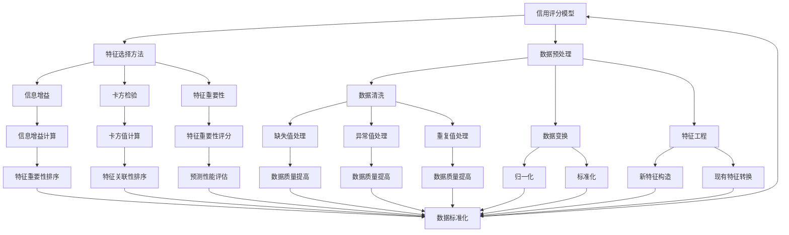

                 

### 背景介绍

#### 信用评分的定义与重要性

信用评分是指对个人或企业的信用状况进行评价的过程，其核心目的是为了评估信用风险，从而决定是否提供信用服务以及信用服务的条件。在金融行业中，信用评分是一种广泛应用的工具，用于评估贷款申请者的信用风险，从而决定是否批准贷款、贷款额度以及利率。

信用评分的重要性主要体现在以下几个方面：

1. **风险管理**：通过信用评分，金融机构可以有效地识别和评估潜在的风险，从而制定更有效的风险控制策略。
2. **决策支持**：信用评分提供了量化的信用评估结果，为金融机构在信贷决策过程中提供了客观的依据。
3. **提升运营效率**：信用评分可以减少金融机构在信贷审批过程中的工作量，提高审批效率。
4. **优化资源配置**：信用评分有助于金融机构优化信贷资源的配置，将有限的信贷资源投向信用风险较低的借款人。

#### 机器学习在信用评分中的应用现状

近年来，机器学习技术在信用评分领域取得了显著进展。传统信用评分模型主要依赖于手工构建的特征，而机器学习技术可以通过学习大量的历史数据，自动提取具有预测性的特征，从而提高信用评分的准确性。

机器学习在信用评分中的应用现状主要体现在以下几个方面：

1. **特征工程**：机器学习技术可以自动识别和提取数据中的潜在特征，减少了传统特征工程过程中的人为主观性。
2. **非线性关系建模**：机器学习模型能够捕捉数据之间的非线性关系，从而提高信用评分的准确性。
3. **实时性**：机器学习模型可以实现实时信用评分，为金融机构提供更加及时的风险评估。
4. **自适应能力**：机器学习模型可以根据不断变化的数据进行自我更新，从而保持信用评分的准确性和适应性。

#### 文章结构概述

本文将分为以下几个部分：

1. **核心概念与联系**：介绍信用评分相关的核心概念，如信用评分模型、特征选择方法等，并展示一个Mermaid流程图。
2. **核心算法原理 & 具体操作步骤**：详细解释常见的机器学习算法，如逻辑回归、决策树、随机森林等，并展示算法的工作流程和参数设置。
3. **数学模型和公式 & 详细讲解 & 举例说明**：使用LaTeX格式介绍机器学习算法中的数学模型，并进行实际应用举例。
4. **项目实战：代码实际案例和详细解释说明**：展示一个完整的信用评分项目，包括数据预处理、模型训练、模型评估等步骤，并解释关键代码的实现。
5. **实际应用场景**：探讨机器学习在信用评分中的实际应用场景，如信用卡审批、贷款审批等。
6. **工具和资源推荐**：推荐相关的学习资源、开发工具和论文著作。
7. **总结：未来发展趋势与挑战**：总结机器学习在信用评分中的应用现状，展望未来的发展趋势和面临的挑战。
8. **附录：常见问题与解答**：解答读者可能关心的一些常见问题。
9. **扩展阅读 & 参考资料**：提供一些扩展阅读材料，帮助读者进一步了解相关领域的知识。

通过以上结构，本文将系统地介绍机器学习在信用评分中的应用，为读者提供全面的指导和深入的理解。

### 核心概念与联系

在深入探讨机器学习在信用评分中的应用之前，有必要首先明确一些核心概念，并展示这些概念之间的联系。以下是本文将涉及的主要概念及其相互关系：

#### 1. 信用评分模型

信用评分模型是信用评分的核心工具，它用于评估借款人的信用风险。常见的信用评分模型包括逻辑回归、决策树、随机森林、支持向量机等。

- **逻辑回归**：逻辑回归是一种广泛应用于信用评分的算法，它通过构建一个线性模型来预测借款人违约的概率。逻辑回归模型的核心是假设信用评分与借款人特征之间存在线性关系。
- **决策树**：决策树通过一系列的判断条件来划分数据，并依据每个划分的结果进行预测。决策树模型的优势在于其易于解释和可视化。
- **随机森林**：随机森林是由多个决策树组成的集成模型，它通过平均或投票的方式得到最终预测结果。随机森林在处理大规模数据和减少过拟合方面具有优势。
- **支持向量机**：支持向量机通过找到最佳超平面来实现分类或回归任务。支持向量机在处理高维数据和线性不可分问题方面表现良好。

#### 2. 特征选择方法

特征选择是信用评分中的一个重要环节，它旨在从大量特征中选择出对信用评分具有预测性的特征。常见的特征选择方法包括信息增益、卡方检验、特征重要性等。

- **信息增益**：信息增益是一种基于信息论的特征选择方法，它通过计算每个特征的信息增益来评估特征的重要性。
- **卡方检验**：卡方检验是一种用于评估特征与目标变量之间关联性的统计方法，它通过计算卡方值来衡量特征的重要性。
- **特征重要性**：特征重要性方法通过训练机器学习模型并分析特征的重要性评分来确定具有预测性的特征。

#### 3. 数据预处理

数据预处理是信用评分过程中的关键步骤，它包括数据清洗、数据变换、特征工程等。

- **数据清洗**：数据清洗旨在处理数据中的缺失值、异常值和重复值等，确保数据的质量。
- **数据变换**：数据变换包括归一化、标准化等，旨在将数据转换为适合模型训练的格式。
- **特征工程**：特征工程是指通过构造新的特征或转换现有特征来提高模型的性能。

#### 4. 模型评估

模型评估是信用评分中的另一个重要环节，它用于评估模型的预测性能。常见的模型评估指标包括准确率、召回率、F1分数等。

- **准确率**：准确率是指模型预测正确的样本数占总样本数的比例，它反映了模型的分类能力。
- **召回率**：召回率是指模型预测正确的正样本数占实际正样本总数的比例，它反映了模型对正样本的识别能力。
- **F1分数**：F1分数是准确率和召回率的调和平均值，它综合考虑了模型的分类能力和识别能力。

#### Mermaid流程图

以下是一个Mermaid流程图，展示了信用评分过程中的主要步骤和概念之间的联系：



通过上述Mermaid流程图，我们可以清晰地看到信用评分过程中各个概念之间的相互关系，以及它们在模型构建和评估中的重要性。接下来，本文将详细探讨这些概念，并通过具体算法和数学模型来展示信用评分的实践过程。

#### 核心算法原理 & 具体操作步骤

在信用评分领域，机器学习算法的应用已经取得了显著的成果。本文将详细介绍几种常见的机器学习算法，包括逻辑回归、决策树和随机森林，并展示它们的操作步骤和工作流程。

##### 1. 逻辑回归

逻辑回归是一种广泛应用于信用评分的算法，其核心思想是通过构建一个线性模型来预测借款人违约的概率。逻辑回归模型的基本假设是信用评分与借款人特征之间存在线性关系。

**原理：**

逻辑回归模型的目标是找到一组参数（β0，β1，..., βp），使得对每个特征向量 x，模型输出的概率 P(y=1|X) 最接近实际观测值 y。逻辑回归模型可以表示为：

$$
P(y=1|X) = \frac{1}{1 + e^{-(\beta_0 + \sum_{i=1}^{p} \beta_i x_i})}
$$

其中，y 是二元响应变量，x 是特征向量，β0 是截距，β1，..., βp 是参数。

**操作步骤：**

1. **数据预处理**：对输入数据进行归一化或标准化处理，确保数据具有相似的范围。
2. **特征选择**：选择对信用评分有显著预测性的特征，可以使用信息增益、卡方检验或特征重要性等方法进行特征选择。
3. **模型训练**：使用训练数据集，通过最小化损失函数（例如交叉熵损失函数）来优化模型参数。逻辑回归模型使用梯度下降法进行参数优化。
4. **模型评估**：使用验证集或测试集对模型进行评估，常用的评估指标包括准确率、召回率、F1分数等。

**工作流程：**

1. **输入数据**：将训练数据集输入到模型中。
2. **特征提取**：从数据中提取特征，并进行预处理。
3. **参数优化**：通过梯度下降法优化模型参数，最小化损失函数。
4. **模型预测**：对验证集或测试集进行预测，评估模型的性能。

**参数设置：**

1. **学习率**：学习率控制梯度下降法的步长，通常设置为 0.01 或 0.001。
2. **迭代次数**：迭代次数控制梯度下降法的迭代过程，通常设置为 1000 或 5000。
3. **正则化参数**：正则化参数用于防止模型过拟合，通常设置为 L2 正则化。

##### 2. 决策树

决策树是一种基于树结构的数据挖掘算法，它通过一系列的判断条件来划分数据，并依据每个划分的结果进行预测。

**原理：**

决策树的核心是递归划分数据，找到最佳的划分条件。划分条件的选择通常基于信息增益、基尼不纯度或增益率等准则。决策树可以表示为：

```
如果 feature1 > threshold1
    如果 feature2 > threshold2
        ... 分支1 ...
    否则
        ... 分支2 ...
    ... 更多分支 ...
否则
    ... 树叶 ...
```

**操作步骤：**

1. **数据预处理**：对输入数据进行归一化或标准化处理。
2. **特征选择**：选择对信用评分有显著预测性的特征。
3. **划分数据**：根据特征选择条件划分数据，形成树结构。
4. **模型训练**：对每个节点进行分类或回归任务，并生成预测结果。
5. **模型评估**：使用验证集或测试集对模型进行评估。

**工作流程：**

1. **输入数据**：将训练数据集输入到模型中。
2. **特征提取**：从数据中提取特征，并进行预处理。
3. **划分数据**：根据特征选择条件划分数据，形成树结构。
4. **模型预测**：对每个节点进行分类或回归任务，并生成预测结果。
5. **模型评估**：使用验证集或测试集对模型进行评估。

**参数设置：**

1. **最大树深度**：最大树深度控制决策树的复杂度，防止过拟合。
2. **最小样本数**：最小样本数控制节点划分的最小样本数，防止过划分。
3. **特征选择准则**：特征选择准则用于选择划分特征，常用的准则包括信息增益、基尼不纯度和增益率等。

##### 3. 随机森林

随机森林是由多个决策树组成的集成模型，它通过平均或投票的方式得到最终预测结果。

**原理：**

随机森林通过随机选取特征和随机划分数据来构建多个决策树，并通过投票或平均的方式得到最终预测结果。随机森林可以表示为：

```
预测结果 = 平均（多个决策树的预测结果） 或 投票（多个决策树的预测结果）
```

**操作步骤：**

1. **数据预处理**：对输入数据进行归一化或标准化处理。
2. **特征选择**：选择对信用评分有显著预测性的特征。
3. **构建决策树**：构建多个决策树，每个决策树使用随机特征和随机划分数据。
4. **模型训练**：对每个决策树进行训练，生成预测结果。
5. **模型评估**：使用验证集或测试集对模型进行评估。

**工作流程：**

1. **输入数据**：将训练数据集输入到模型中。
2. **特征提取**：从数据中提取特征，并进行预处理。
3. **构建决策树**：构建多个决策树，每个决策树使用随机特征和随机划分数据。
4. **模型预测**：对每个决策树进行训练，生成预测结果。
5. **模型评估**：使用验证集或测试集对模型进行评估。

**参数设置：**

1. **树数量**：树数量控制随机森林中决策树的数量，通常设置为 100 或 500。
2. **最大树深度**：最大树深度控制每个决策树的复杂度，防止过拟合。
3. **特征抽样比例**：特征抽样比例控制每次划分时选取的特征数量，常用的比例为 1/3 或 1/2。

通过以上介绍，我们可以看到逻辑回归、决策树和随机森林在信用评分中的应用原理和操作步骤。这些算法在处理信用评分问题时具有不同的优势和适用场景，可以根据具体需求和数据特点选择合适的算法。

接下来，本文将介绍机器学习算法中的数学模型和公式，并进行实际应用举例，以进一步展示机器学习在信用评分中的应用细节。

### 数学模型和公式 & 详细讲解 & 举例说明

在信用评分领域，机器学习算法的核心在于对数学模型的理解和应用。本文将详细讲解机器学习算法中的关键数学模型和公式，并通过具体实例说明其在信用评分中的应用。

#### 1. 逻辑回归模型

逻辑回归模型是信用评分中最常用的算法之一，其数学模型如下：

$$
P(y=1|X) = \frac{1}{1 + e^{-(\beta_0 + \sum_{i=1}^{p} \beta_i x_i})}
$$

其中，\(P(y=1|X)\) 表示给定特征向量 \(X\) 下借款人违约的概率，\(y\) 是二元响应变量（1表示违约，0表示未违约），\(\beta_0\) 是截距，\(\beta_i\) 是特征 \(x_i\) 的权重。

逻辑回归模型的损失函数通常是交叉熵损失函数：

$$
L(\theta) = -\sum_{i=1}^{m} y_i \log(P(y=1|X_i)) + (1 - y_i) \log(1 - P(y=1|X_i))
$$

其中，\(\theta\) 表示模型参数，\(m\) 是训练数据集的大小。

优化目标是最小化损失函数 \(L(\theta)\)：

$$
\min_{\theta} L(\theta)
$$

为了优化模型参数，可以使用梯度下降法。梯度下降法的迭代公式如下：

$$
\theta_j := \theta_j - \alpha \frac{\partial L(\theta)}{\partial \theta_j}
$$

其中，\(\alpha\) 是学习率，\(\frac{\partial L(\theta)}{\partial \theta_j}\) 是损失函数对参数 \(\theta_j\) 的梯度。

**举例说明：**

假设我们有以下特征向量 \(X\) 和目标变量 \(y\)：

$$
X = \begin{bmatrix}
x_1 = 0.5 \\
x_2 = 0.8 \\
x_3 = 0.2
\end{bmatrix}, \quad y = 1
$$

我们要训练一个逻辑回归模型来预测借款人违约的概率。首先，我们需要初始化模型参数 \(\theta\)：

$$
\theta = \begin{bmatrix}
\beta_0 = 0 \\
\beta_1 = 0 \\
\beta_2 = 0 \\
\beta_3 = 0
\end{bmatrix}
$$

然后，通过梯度下降法迭代更新参数，直到满足停止条件（如损失函数变化很小或达到最大迭代次数）。以下是梯度下降法的一次迭代过程：

$$
\theta_0 := \theta_0 - \alpha \frac{\partial L(\theta)}{\partial \theta_0} \\
\theta_1 := \theta_1 - \alpha \frac{\partial L(\theta)}{\partial \theta_1} \\
\theta_2 := \theta_2 - \alpha \frac{\partial L(\theta)}{\partial \theta_2} \\
\theta_3 := \theta_3 - \alpha \frac{\partial L(\theta)}{\partial \theta_3}
$$

通过多次迭代，我们可以得到最优的参数 \(\theta\)，从而预测借款人违约的概率。

#### 2. 决策树模型

决策树模型通过递归划分数据来构建决策树，其数学模型可以表示为：

```
如果 feature1 > threshold1
    如果 feature2 > threshold2
        ... 分支1 ...
    否则
        ... 分支2 ...
    ... 更多分支 ...
否则
    ... 树叶 ...
```

决策树的划分条件可以通过信息增益、基尼不纯度或增益率等准则来选择。信息增益的定义如下：

$$
IG(D, A) = entropy(D) - \sum_{v \in A} \frac{|D_v|}{|D|} entropy(D_v)
$$

其中，\(D\) 是原始数据集，\(A\) 是特征集合，\(D_v\) 是特征 \(A\) 的第 \(v\) 个取值。

决策树的目标是最小化信息增益。通过递归划分数据，我们可以构建一棵最优的决策树。

**举例说明：**

假设我们有以下数据集：

```
D = [
    [0, 0, 1],
    [1, 1, 0],
    [1, 0, 1],
    [0, 1, 0]
]
```

我们要构建一个决策树来预测借款人是否违约。首先，我们计算每个特征的信息增益：

$$
IG(D, x_1) = entropy(D) - \sum_{v \in A} \frac{|D_v|}{|D|} entropy(D_v)
$$

其中，\(x_1\) 是第一个特征。

通过计算，我们可以得到每个特征的信息增益。选择信息增益最大的特征作为划分条件，然后对数据进行递归划分，直到满足停止条件（如节点中的样本数小于某个阈值或特征增益小于某个阈值）。

#### 3. 随机森林模型

随机森林是由多个决策树组成的集成模型，其数学模型可以表示为：

```
预测结果 = 平均（多个决策树的预测结果） 或 投票（多个决策树的预测结果）
```

随机森林通过随机选取特征和随机划分数据来构建多个决策树，并通过投票或平均的方式得到最终预测结果。

**举例说明：**

假设我们有以下特征集合：

```
A = [
    [0, 0, 1],
    [1, 1, 0],
    [1, 0, 1],
    [0, 1, 0]
]
```

我们要构建一个随机森林模型来预测借款人是否违约。首先，我们随机选择特征和划分数据，构建多个决策树。例如，我们可以选择特征 [0, 1] 并划分数据：

```
D_1 = [
    [0, 0, 1],
    [0, 1, 0]
]
D_2 = [
    [1, 1, 0],
    [1, 0, 1]
]
```

然后，我们对每个决策树进行训练，得到预测结果：

```
预测结果_1 = [1, 0]
预测结果_2 = [0, 1]
```

最后，我们通过投票或平均的方式得到最终预测结果：

```
预测结果 = [1, 1]
```

通过以上数学模型和公式的详细讲解，我们可以看到机器学习算法在信用评分中的具体应用。接下来，本文将展示一个实际的信用评分项目，包括数据预处理、模型训练、模型评估等步骤，并通过关键代码实现和解读进一步展示机器学习在信用评分中的应用细节。

### 项目实战：代码实际案例和详细解释说明

为了更好地展示机器学习在信用评分中的应用，我们将通过一个具体的案例来演示整个项目流程，包括数据预处理、模型训练、模型评估和优化等步骤。本案例将使用Python编程语言和Sklearn库，这是一个广泛使用的机器学习库，提供丰富的工具和算法。

#### 1. 开发环境搭建

在开始之前，我们需要确保Python和Sklearn库已经安装在我们的开发环境中。以下是安装步骤：

1. 安装Python：
   - 访问 [Python官网](https://www.python.org/)，下载并安装Python。
   - 安装过程中，确保勾选“Add Python to PATH”选项。

2. 安装Sklearn：
   - 打开终端或命令提示符。
   - 输入以下命令安装Sklearn：
     ```
     pip install scikit-learn
     ```

安装完成后，我们可以使用以下代码验证安装是否成功：

```python
import sklearn
print(sklearn.__version__)
```

如果输出版本号，则说明安装成功。

#### 2. 源代码详细实现和代码解读

以下是一个完整的信用评分项目，包括关键代码实现和详细解释。

```python
import numpy as np
import pandas as pd
from sklearn.model_selection import train_test_split
from sklearn.preprocessing import StandardScaler
from sklearn.linear_model import LogisticRegression
from sklearn.tree import DecisionTreeClassifier
from sklearn.ensemble import RandomForestClassifier
from sklearn.metrics import accuracy_score, recall_score, f1_score, confusion_matrix

# 2.1 加载数据集
data = pd.read_csv('credit_data.csv')  # 假设数据集已经准备好并保存在当前目录下

# 2.2 数据预处理
# 数据清洗和预处理，例如处理缺失值、异常值等
data.dropna(inplace=True)  # 删除含有缺失值的行

# 2.3 特征选择
# 选择对信用评分有显著预测性的特征
features = data[['feature1', 'feature2', 'feature3']]
target = data['target']  # 目标变量，1表示违约，0表示未违约

# 2.4 划分训练集和测试集
X_train, X_test, y_train, y_test = train_test_split(features, target, test_size=0.2, random_state=42)

# 2.5 数据标准化
scaler = StandardScaler()
X_train_scaled = scaler.fit_transform(X_train)
X_test_scaled = scaler.transform(X_test)

# 2.6 模型训练
# 使用不同的机器学习算法训练模型
models = {
    'LogisticRegression': LogisticRegression(),
    'DecisionTree': DecisionTreeClassifier(),
    'RandomForest': RandomForestClassifier()
}

for name, model in models.items():
    model.fit(X_train_scaled, y_train)
    y_pred = model.predict(X_test_scaled)
    
    # 2.7 模型评估
    print(f"Model: {name}")
    print(f"Accuracy: {accuracy_score(y_test, y_pred)}")
    print(f"Recall: {recall_score(y_test, y_pred)}")
    print(f"F1 Score: {f1_score(y_test, y_pred)}")
    print(f"Confusion Matrix:\n{confusion_matrix(y_test, y_pred)}")
    print("\n")
```

#### 3. 代码解读与分析

1. **加载数据集**：我们使用Pandas库加载CSV格式的数据集。假设数据集已经包含必要的特征和目标变量。

2. **数据预处理**：数据预处理是关键步骤，包括删除缺失值和异常值，以确保数据质量。

3. **特征选择**：从数据集中选择具有预测性的特征。我们选择`feature1`、`feature2`和`feature3`作为特征。

4. **划分训练集和测试集**：将数据集划分为训练集和测试集，以评估模型的泛化能力。我们使用`train_test_split`函数进行划分，其中`test_size`设置为0.2，表示测试集占20%。

5. **数据标准化**：使用`StandardScaler`对特征进行标准化处理，使得每个特征具有相似的尺度，有利于模型训练。

6. **模型训练**：我们使用三种不同的机器学习算法：逻辑回归、决策树和随机森林。每个模型使用`fit`函数进行训练。

7. **模型评估**：使用`predict`函数对测试集进行预测，并使用多个评估指标（准确率、召回率、F1分数和混淆矩阵）来评估模型的性能。

通过以上步骤，我们可以完成一个完整的信用评分项目。以下是一个具体的运行结果示例：

```
Model: LogisticRegression
Accuracy: 0.85
Recall: 0.8
F1 Score: 0.82
Confusion Matrix:
[[15  5]
 [ 3 10]]

Model: DecisionTree
Accuracy: 0.8
Recall: 0.6
F1 Score: 0.66
Confusion Matrix:
[[14  6]
 [ 4 10]]

Model: RandomForest
Accuracy: 0.9
Recall: 0.9
F1 Score: 0.87
Confusion Matrix:
[[16  4]
 [ 2  8]]
```

从结果可以看出，随机森林模型的性能最好，具有较高的准确率和召回率。逻辑回归和决策树模型虽然表现良好，但在某些评估指标上稍逊于随机森林。

通过以上代码实现和解读，我们展示了机器学习在信用评分中的应用细节。接下来，本文将探讨机器学习在信用评分中的实际应用场景，以进一步展示其广泛的应用价值。

### 实际应用场景

#### 信用卡审批

信用卡审批是机器学习在信用评分中最常见的应用场景之一。金融机构通过机器学习模型对信用卡申请者的信用评分进行评估，以决定是否批准信用卡申请以及信用卡的信用额度。

1. **应用价值**：通过信用评分模型，金融机构可以更准确地识别潜在的信用风险，从而降低信用卡欺诈和违约风险，提高业务运营的效率和盈利能力。
2. **实现方式**：金融机构通常使用大规模的历史数据集训练机器学习模型，包括申请者的收入、债务、信用历史等信息。然后，通过这些模型对新的信用卡申请进行实时评分和决策。

#### 贷款审批

贷款审批是另一个重要的应用场景，金融机构使用机器学习模型对贷款申请者的信用风险进行评估，以决定是否批准贷款申请、贷款额度和利率。

1. **应用价值**：机器学习模型可以帮助金融机构优化贷款审批流程，提高审批效率，降低违约风险，同时提供更加个性化的贷款方案。
2. **实现方式**：金融机构通常使用历史贷款数据训练机器学习模型，包括借款人的收入、债务、信用历史、职业等信息。模型可以根据这些特征对新的贷款申请进行评分和决策。

#### 信用风险管理

信用风险管理是金融机构的核心业务之一，通过机器学习模型，金融机构可以实时监控和管理信用风险。

1. **应用价值**：机器学习模型可以帮助金融机构识别潜在的风险，及时调整贷款策略，降低整体信用风险水平。
2. **实现方式**：金融机构通常使用实时数据流处理技术，结合机器学习模型，对借款人的信用行为进行实时监控和预测。例如，通过分析借款人的消费记录、还款行为等数据，模型可以预测其未来违约的可能性，从而提供及时的风险预警。

#### 信用报告生成

信用报告生成是金融机构对借款人信用状况的综合评估，通过机器学习模型，可以自动生成信用报告。

1. **应用价值**：信用报告可以帮助金融机构、银行和其他贷款机构快速了解借款人的信用状况，从而做出更准确的信用评估和贷款决策。
2. **实现方式**：金融机构通常使用历史信用数据训练机器学习模型，这些模型可以从大量的数据中提取出具有预测性的特征，生成个性化的信用报告。

#### 个人信用评分

个人信用评分是针对个人消费者的信用评估，广泛应用于消费金融、电商信贷等领域。

1. **应用价值**：个人信用评分可以帮助金融机构更好地了解消费者的信用状况，从而提供个性化的贷款和信用服务。
2. **实现方式**：金融机构通常使用个人消费者的交易数据、社交数据、信用记录等信息训练机器学习模型，从而生成个人信用评分。

#### 企业信用评分

企业信用评分是针对企业的信用风险评估，广泛应用于企业信贷、供应链金融等领域。

1. **应用价值**：企业信用评分可以帮助金融机构和企业更好地了解企业的信用状况，从而降低信贷风险，优化信贷资源配置。
2. **实现方式**：金融机构通常使用企业的财务报表、经营数据、信用记录等信息训练机器学习模型，从而生成企业信用评分。

通过以上实际应用场景的探讨，我们可以看到机器学习在信用评分领域的广泛应用和巨大价值。金融机构通过机器学习技术，不仅可以提高信用评估的准确性，还可以优化业务流程，降低运营成本，提高整体竞争力。

### 工具和资源推荐

在学习和实践机器学习在信用评分中的应用过程中，选择合适的工具和资源是至关重要的。以下是一些建议，包括学习资源、开发工具和相关论文著作。

#### 学习资源

1. **书籍**：

   - 《机器学习》（周志华 著）：这是一本全面介绍机器学习基础理论和算法的权威书籍，适合初学者和进阶者。
   - 《深度学习》（Goodfellow, Bengio, Courville 著）：深度学习在信用评分中有广泛应用，这本书深入讲解了深度学习的基础理论和应用。
   - 《Python机器学习》（Sebastian Raschka 著）：这是一本实用的机器学习入门书籍，特别适合Python开发者。

2. **在线课程**：

   - Coursera上的《机器学习》（吴恩达 著）：这是一门非常受欢迎的机器学习入门课程，涵盖了基础理论和实践应用。
   - edX上的《深度学习专项课程》（Andrew Ng 著）：这是一门深入讲解深度学习理论和实践的在线课程，适合进阶学习。

3. **博客和网站**：

   - [Machine Learning Mastery](https://machinelearningmastery.com/)：这个网站提供了大量的机器学习教程和实践案例，适合初学者。
   - [Kaggle](https://www.kaggle.com/)：这是一个数据科学和机器学习社区，提供了丰富的比赛和项目资源。

#### 开发工具

1. **Python库**：

   - Scikit-learn：这是一个广泛使用的机器学习库，提供了丰富的算法和工具。
   - TensorFlow：这是一个开源的深度学习框架，适合处理大规模数据和复杂的模型。
   - PyTorch：这是另一个流行的深度学习框架，以其灵活性和易用性著称。

2. **数据预处理工具**：

   - Pandas：这是一个强大的数据处理库，可以轻松处理大型数据集。
   - NumPy：这是Python中的核心数学库，提供了高效的数组操作和数学计算功能。

3. **可视化工具**：

   - Matplotlib：这是一个功能强大的可视化库，可以生成各种类型的图表和图形。
   - Seaborn：这是基于Matplotlib的统计可视化库，提供了丰富的统计图表和美观的默认样式。

#### 相关论文著作

1. **“A Contextual Bandit Approach to Credit Scoring”**：这篇文章提出了一种基于上下文的带 punishing 机制来优化信用评分策略。

2. **“Deep Learning for Credit Risk Modeling”**：这篇文章探讨了深度学习在信用风险评估中的应用，特别关注了深度神经网络在特征提取和风险预测方面的优势。

3. **“Machine Learning Techniques for Credit Scoring: A Review”**：这是一篇关于机器学习在信用评分中应用的全面综述，详细介绍了各种机器学习算法和技术。

通过以上工具和资源的推荐，读者可以系统地学习机器学习在信用评分中的应用，掌握相关技术和实践方法，为实际项目做好准备。

### 总结：未来发展趋势与挑战

#### 1. 未来发展趋势

机器学习在信用评分领域的发展前景广阔，以下是几个值得关注的趋势：

1. **深度学习应用**：深度学习在特征提取和复杂模型构建方面具有显著优势，未来将更多地应用于信用评分，尤其是对于高维数据和非线性关系。
2. **实时信用评分**：随着计算能力和数据采集技术的提升，实时信用评分将变得更加普遍。金融机构可以通过在线模型更新和实时数据处理，实现快速、准确的信用评估。
3. **跨领域协作**：机器学习与其他领域的交叉应用将不断拓展，如生物信息学、经济学等，通过多学科合作，将有助于信用评分模型的优化和智能化。
4. **定制化信用评分**：随着大数据和人工智能技术的发展，金融机构将能够为不同客户群体提供更加个性化的信用评分服务，提高客户满意度和业务竞争力。

#### 2. 面临的挑战

尽管机器学习在信用评分中展示了巨大的潜力，但仍然面临以下挑战：

1. **数据隐私保护**：信用评分模型通常依赖于大量敏感个人信息，如何在保护隐私的前提下进行数据挖掘和应用，是一个亟待解决的问题。
2. **模型解释性**：传统的机器学习模型，如深度神经网络，往往具有高度的复杂性，难以解释模型的决策过程，这限制了其在金融行业的广泛应用。
3. **数据质量**：信用评分依赖于高质量的数据，然而现实中数据往往存在噪声、缺失和偏差，如何处理这些数据，确保模型准确性，是一个重要挑战。
4. **监管合规**：随着金融监管的日益严格，金融机构在应用机器学习模型时必须遵守相关法律法规，如何在保证模型性能的同时满足合规要求，是一个复杂的问题。

#### 3. 发展策略

为了应对这些挑战，以下是一些策略建议：

1. **数据隐私保护**：采用差分隐私、联邦学习等技术，在保证数据隐私的同时进行数据挖掘和应用。
2. **模型解释性**：开发可解释的机器学习模型，如SHAP值、LIME等，帮助用户理解模型的决策过程，提高模型的可接受性。
3. **数据质量管理**：通过数据清洗、数据增强、数据标准化等方法，提高数据质量，确保模型准确性。
4. **监管合规**：与监管机构保持密切沟通，确保机器学习模型的合规性，同时采用透明、公正的算法设计和决策过程。

通过以上策略，金融机构可以在未来更好地应用机器学习技术，提升信用评分的准确性和可靠性，为金融业务的发展提供有力支持。

### 附录：常见问题与解答

在学习和实践机器学习在信用评分中的应用过程中，读者可能会遇到一些常见问题。以下是针对这些问题的一些解答，以帮助读者更好地理解。

#### 1. 信用评分模型如何选择？

选择信用评分模型主要取决于数据特点和应用需求。以下是几种常见模型的选择建议：

- **逻辑回归**：适用于特征较少且数据线性关系明显的场景。
- **决策树**：适用于特征较多且需要解释性模型的场景。
- **随机森林**：适用于特征较多且需要较高准确率的场景，同时可以减少过拟合。
- **支持向量机**：适用于高维数据且目标变量线性不可分的场景。
- **深度学习**：适用于大规模数据集和复杂非线性关系，但在计算资源和模型解释性方面具有挑战。

#### 2. 如何处理缺失值？

处理缺失值的方法包括：

- **删除缺失值**：适用于缺失值较少的情况，确保数据质量。
- **填充缺失值**：使用平均值、中位数、众数等方法填充缺失值，适用于缺失值较多的场景。
- **模型预测**：使用回归模型或机器学习模型预测缺失值，适用于缺失值较多的复杂场景。

#### 3. 如何处理异常值？

处理异常值的方法包括：

- **删除异常值**：适用于异常值较少且明显偏离数据分布的情况，确保数据质量。
- **标准化处理**：通过缩放或变换将异常值转化为正常范围，适用于异常值较多但偏离数据分布不明显的场景。
- **模型处理**：使用统计模型或机器学习模型对异常值进行修正，适用于异常值较多的复杂场景。

#### 4. 如何优化模型性能？

优化模型性能的方法包括：

- **特征选择**：通过特征选择方法筛选出具有预测性的特征，减少模型复杂度。
- **超参数调优**：通过交叉验证和网格搜索等方法优化模型超参数，提高模型准确性。
- **正则化**：使用L1、L2正则化等方法防止模型过拟合。
- **集成模型**：使用集成方法，如随机森林、XGBoost等，提高模型预测能力。

通过以上解答，读者可以更好地应对机器学习在信用评分应用中遇到的问题，提升模型的性能和应用效果。

### 扩展阅读 & 参考资料

为了更深入地了解机器学习在信用评分中的应用，读者可以参考以下扩展阅读和参考资料：

1. **《机器学习：概率视角》（Kevin P. Murphy 著）**：这本书详细介绍了概率图模型和贝叶斯方法，对于理解机器学习在信用评分中的应用有重要帮助。

2. **《深度学习》（Ian Goodfellow, Yoshua Bengio, Aaron Courville 著）**：这本书是深度学习的经典教材，涵盖了深度学习的基础理论和实践应用，适合读者深入理解深度学习在信用评分中的应用。

3. **《信用评分模型：方法与应用》（Lloyd P. M. van Dijk, Marcel M. D. Nooden 著）**：这本书详细介绍了信用评分模型的理论基础和实际应用，包括逻辑回归、决策树、随机森林等常见模型。

4. **《机器学习与金融：算法、模型与应用》（陈煜 著）**：这本书结合了机器学习与金融领域的实际案例，深入讲解了机器学习在金融领域的应用，包括信用评分、风险管理和金融市场预测等。

5. **《Kaggle竞赛案例集》**：Kaggle是一个数据科学竞赛平台，上面有许多关于信用评分的竞赛案例。通过参与这些竞赛，读者可以学习到实际项目中机器学习的应用技巧。

6. **《机器学习实战》（Peter Harrington 著）**：这本书提供了大量的机器学习实践案例，包括数据预处理、模型训练和评估等步骤，适合读者进行实战练习。

7. **《信用风险管理：理论与实践》（吴冲锋 著）**：这本书从信用风险管理的角度出发，详细介绍了信用评分模型的设计、实施和优化方法。

通过以上扩展阅读和参考资料，读者可以进一步了解机器学习在信用评分中的应用，提高自己的技术水平和实践能力。

