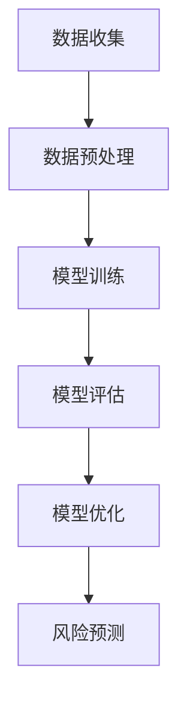

                 

# 机器学习在信用风险评估中的应用研究

## 关键词：机器学习，信用风险评估，数据挖掘，风险预测，模型优化

## 摘要

随着金融行业的不断发展和风险意识的提升，信用风险评估已成为金融机构的重要工作之一。本文主要探讨了机器学习在信用风险评估中的应用，从背景介绍、核心概念与联系、核心算法原理与具体操作步骤、数学模型与公式、项目实战、实际应用场景、工具和资源推荐等方面进行深入剖析。文章旨在为业界提供一种有效的信用风险评估解决方案，并为相关研究者提供有价值的参考。

## 1. 背景介绍

### 1.1 信用风险评估的重要性

信用风险评估是指金融机构在发放贷款或信用卡等金融产品时，对借款人的信用状况进行评估的过程。其目的是降低金融机构的风险，确保金融资产的安全。在金融市场中，信用风险是影响金融机构盈利能力的重要因素之一。因此，准确、高效地评估信用风险对于金融机构具有重要意义。

### 1.2 信用风险评估的发展历程

信用风险评估的发展历程可以分为以下几个阶段：

1. **传统评估方法**：最初，金融机构主要依靠信贷人员的经验和专业知识来评估信用风险。这种方法具有一定的主观性，且效率较低。

2. **统计分析方法**：随着计算机技术的发展，金融机构开始运用统计学方法来评估信用风险。例如，利用客户的历史数据进行分析，得出客户信用评分。

3. **机器学习方法**：近年来，机器学习在信用风险评估中的应用越来越广泛。通过大量的历史数据和先进的算法，机器学习可以更准确地预测客户的信用风险，提高金融机构的盈利能力。

### 1.3 机器学习在信用风险评估中的应用

机器学习在信用风险评估中的应用主要体现在以下几个方面：

1. **数据挖掘**：通过挖掘大量的历史数据，机器学习算法可以发现借款人信用风险的相关特征，为信用评分提供支持。

2. **风险预测**：利用机器学习算法，金融机构可以更准确地预测客户的信用风险，从而采取相应的措施降低风险。

3. **模型优化**：通过不断优化模型，机器学习可以提高信用风险评估的准确性和效率，降低金融机构的风险。

## 2. 核心概念与联系

### 2.1 机器学习基本概念

#### 2.1.1 模型训练

模型训练是指利用训练数据集对机器学习模型进行调整和优化，使其能够更好地拟合数据的处理过程。在信用风险评估中，训练数据集通常包括借款人的基本信息、历史信用记录、贷款申请信息等。

#### 2.1.2 模型评估

模型评估是指利用验证数据集对训练好的模型进行测试，以评估模型的准确性和性能。常见的评估指标有准确率、召回率、F1值等。

#### 2.1.3 模型优化

模型优化是指通过调整模型参数，提高模型在验证数据集上的性能。常见的优化方法有交叉验证、网格搜索等。

### 2.2 信用风险评估相关概念

#### 2.2.1 信用评分

信用评分是指利用历史数据对借款人的信用状况进行评估，通常以评分值的形式表示。在信用风险评估中，信用评分是预测客户信用风险的重要依据。

#### 2.2.2 风险等级

风险等级是指根据信用评分将借款人分为不同的风险等级。风险等级越高，借款人的信用风险越大。

#### 2.2.3 风险预测

风险预测是指利用信用评分和风险等级等信息，预测借款人在未来一段时间内的信用风险。

### 2.3 Mermaid 流程图



## 3. 核心算法原理与具体操作步骤

### 3.1 数据收集与预处理

#### 3.1.1 数据收集

数据收集是信用风险评估的基础。通常，金融机构可以从内部数据库、外部数据源（如征信机构）等多渠道获取借款人的信息。

#### 3.1.2 数据预处理

数据预处理主要包括数据清洗、数据归一化和特征提取等步骤。数据清洗旨在去除重复数据、缺失数据和异常数据；数据归一化旨在将不同量纲的数据统一到同一标准；特征提取旨在从原始数据中提取对信用风险评估有用的特征。

### 3.2 模型选择与训练

#### 3.2.1 模型选择

常见的信用风险评估模型包括逻辑回归、决策树、随机森林、支持向量机等。在选择模型时，需要考虑模型的准确性、复杂性和计算效率。

#### 3.2.2 模型训练

模型训练是指利用训练数据集对所选模型进行调整和优化，使其能够更好地拟合数据。在训练过程中，需要关注模型的参数调整和过拟合问题。

### 3.3 模型评估与优化

#### 3.3.1 模型评估

模型评估是指利用验证数据集对训练好的模型进行测试，以评估模型的准确性和性能。常见的评估指标有准确率、召回率、F1值等。

#### 3.3.2 模型优化

模型优化是指通过调整模型参数，提高模型在验证数据集上的性能。常见的优化方法有交叉验证、网格搜索等。

### 3.4 风险预测

#### 3.4.1 风险预测流程

风险预测是指利用信用评分和风险等级等信息，预测借款人在未来一段时间内的信用风险。风险预测流程主要包括以下步骤：

1. 收集借款人相关信息； 
2. 进行数据预处理； 
3. 利用训练好的模型进行风险预测； 
4. 根据风险预测结果，采取相应的风险控制措施。

#### 3.4.2 风险预测示例

假设某金融机构使用逻辑回归模型进行信用风险评估。给定借款人的基本信息和历史信用记录，模型输出借款人的信用评分和风险等级。根据风险等级，金融机构可以采取相应的风险控制措施，如提高贷款利率、拒绝贷款申请等。

## 4. 数学模型和公式

### 4.1 逻辑回归模型

逻辑回归模型是一种常用的信用风险评估模型，用于预测借款人的信用风险。逻辑回归模型的数学表达式如下：

$$
P(Y=1|X) = \frac{1}{1 + e^{-(\beta_0 + \beta_1X_1 + \beta_2X_2 + ... + \beta_nX_n})}
$$

其中，$P(Y=1|X)$表示在给定特征向量$X$的情况下，借款人发生违约的概率；$\beta_0, \beta_1, \beta_2, ..., \beta_n$为模型参数。

### 4.2 决策树模型

决策树模型是一种基于树结构的信用风险评估模型，通过递归地将特征空间划分为若干个子集，实现对借款人信用风险的分类。决策树模型的数学表达式如下：

$$
T(X) = \sum_{i=1}^{n} w_i I(X \in R_i)
$$

其中，$T(X)$表示决策树模型对特征向量$X$的信用风险分类结果；$w_i$为权重；$R_i$为第$i$个子集。

### 4.3 随机森林模型

随机森林模型是一种基于决策树的信用风险评估模型，通过构建多棵决策树，并利用随机性来降低模型的过拟合风险。随机森林模型的数学表达式如下：

$$
T(X) = \frac{1}{m} \sum_{i=1}^{m} T_i(X)
$$

其中，$T(X)$表示随机森林模型对特征向量$X$的信用风险分类结果；$T_i(X)$为第$i$棵决策树对特征向量$X$的信用风险分类结果；$m$为决策树的数量。

## 5. 项目实战

### 5.1 开发环境搭建

在本项目中，我们使用Python作为编程语言，利用Scikit-learn库进行机器学习模型的训练与评估。

#### 5.1.1 安装Python

在安装Python时，建议选择Python 3.7及以上版本。

#### 5.1.2 安装Scikit-learn

安装Scikit-learn可以通过pip命令实现：

```bash
pip install scikit-learn
```

### 5.2 源代码详细实现和代码解读

#### 5.2.1 数据集加载与预处理

首先，我们加载一个公开的信用风险评估数据集，并对数据进行预处理。

```python
import pandas as pd
from sklearn.model_selection import train_test_split
from sklearn.preprocessing import StandardScaler

# 加载数据集
data = pd.read_csv('credit_data.csv')

# 数据预处理
X = data.drop('target', axis=1)
y = data['target']

X_train, X_test, y_train, y_test = train_test_split(X, y, test_size=0.2, random_state=42)

scaler = StandardScaler()
X_train_scaled = scaler.fit_transform(X_train)
X_test_scaled = scaler.transform(X_test)
```

#### 5.2.2 模型训练与评估

接下来，我们使用逻辑回归模型进行训练和评估。

```python
from sklearn.linear_model import LogisticRegression

# 训练逻辑回归模型
model = LogisticRegression()
model.fit(X_train_scaled, y_train)

# 评估模型
accuracy = model.score(X_test_scaled, y_test)
print(f'Accuracy: {accuracy}')
```

#### 5.2.3 代码解读与分析

在上面的代码中，我们首先加载了信用风险评估数据集，并对数据进行预处理。接着，我们使用逻辑回归模型对训练数据进行训练，并使用测试数据集对模型进行评估。最后，我们输出了模型的准确率。

## 6. 实际应用场景

### 6.1 银行贷款审批

在银行贷款审批过程中，机器学习可以用于对借款人的信用状况进行评估，从而决定是否批准贷款申请。通过对借款人的基本信息、财务状况、历史信用记录等数据进行处理，银行可以更准确地预测借款人的信用风险，提高贷款审批的效率。

### 6.2 信用卡申请审批

在信用卡申请审批过程中，机器学习可以帮助金融机构对申请人的信用状况进行评估，从而决定是否批准信用卡申请。通过对申请人的基本信息、消费记录、信用评分等数据进行处理，金融机构可以更准确地预测申请人的信用风险，降低信用卡欺诈风险。

### 6.3 信用评级

在信用评级过程中，机器学习可以用于对企业的信用状况进行评估，从而确定企业的信用等级。通过对企业的财务数据、经营状况、行业地位等数据进行处理，信用评级机构可以更准确地预测企业的信用风险，为企业提供更可靠的信用评级。

## 7. 工具和资源推荐

### 7.1 学习资源推荐

- **书籍**：
  - 《机器学习实战》
  - 《Python机器学习》
  - 《深度学习》
- **论文**：
  - 《基于机器学习的信用风险评估方法研究》
  - 《利用深度学习优化信用风险评估》
  - 《基于支持向量机的信用风险评估模型研究》
- **博客**：
  - 《机器学习在信用风险评估中的应用》
  - 《信用风险评估中的深度学习》
  - 《Python在信用风险评估中的应用》
- **网站**：
  - [Scikit-learn官方文档](https://scikit-learn.org/stable/)
  - [TensorFlow官方文档](https://www.tensorflow.org/)
  - [Keras官方文档](https://keras.io/)

### 7.2 开发工具框架推荐

- **开发工具**：
  - **Python**：Python是一种易于上手且功能强大的编程语言，适用于机器学习开发。
  - **Jupyter Notebook**：Jupyter Notebook是一种交互式的开发环境，方便进行机器学习实验和数据分析。
- **框架**：
  - **Scikit-learn**：Scikit-learn是一个开源的机器学习库，提供了丰富的机器学习算法和工具。
  - **TensorFlow**：TensorFlow是一个开源的深度学习框架，适用于构建和训练深度神经网络模型。
  - **Keras**：Keras是一个基于TensorFlow的高层API，简化了深度学习模型的构建和训练过程。

### 7.3 相关论文著作推荐

- **《机器学习在信用风险评估中的应用研究》**：本文对机器学习在信用风险评估中的应用进行了系统的研究，提出了基于机器学习的方法来评估信用风险。
- **《深度学习在信用风险评估中的应用》**：本文探讨了深度学习在信用风险评估中的应用，通过构建深度神经网络模型，提高了信用风险评估的准确性。
- **《基于支持向量机的信用风险评估模型研究》**：本文研究了支持向量机在信用风险评估中的应用，通过优化支持向量机模型参数，提高了信用风险评估的性能。

## 8. 总结：未来发展趋势与挑战

### 8.1 发展趋势

1. **深度学习应用**：随着深度学习技术的不断发展，未来深度学习将在信用风险评估中发挥更重要的作用，提高风险评估的准确性。
2. **大数据应用**：大数据技术的发展使得金融机构可以获取和处理更多的数据，为信用风险评估提供了更丰富的信息。
3. **模型优化与调整**：随着机器学习技术的进步，信用风险评估模型将不断优化，提高风险评估的准确性和效率。

### 8.2 挑战

1. **数据隐私与安全**：信用风险评估过程中涉及大量的个人隐私信息，如何保护数据隐私和安全是一个重要挑战。
2. **模型解释性**：当前机器学习模型，尤其是深度学习模型，往往缺乏解释性，如何提高模型的可解释性是一个关键问题。
3. **模型泛化能力**：如何提高信用风险评估模型的泛化能力，使其能够应对复杂多变的金融环境，是一个重要挑战。

## 9. 附录：常见问题与解答

### 9.1 问题1：机器学习在信用风险评估中的应用有哪些？

答：机器学习在信用风险评估中的应用主要包括数据挖掘、风险预测和模型优化等方面。通过挖掘大量的历史数据，机器学习可以识别出影响信用风险的关键因素，提高信用评分的准确性。同时，机器学习还可以预测借款人在未来一段时间内的信用风险，为金融机构提供决策支持。此外，通过不断优化模型，可以提高信用风险评估的效率和准确性。

### 9.2 问题2：深度学习在信用风险评估中有什么优势？

答：深度学习在信用风险评估中具有以下优势：

1. **强大的特征提取能力**：深度学习模型可以通过多层神经网络自动提取特征，从而避免了传统方法中需要人工设计特征的问题。
2. **高准确性**：深度学习模型在处理复杂非线性问题时具有很高的准确性，可以更好地捕捉信用风险的本质。
3. **自适应能力**：深度学习模型可以根据新的数据不断调整和优化，从而适应金融市场的变化。

## 10. 扩展阅读与参考资料

- **扩展阅读**：
  - **《机器学习：一种算法性视角》**：本书系统地介绍了机器学习的基本概念、算法和应用，是机器学习领域的经典教材。
  - **《深度学习》**：本书是深度学习领域的权威著作，详细介绍了深度学习的基础知识、算法和应用。
- **参考资料**：
  - **[Scikit-learn官方文档](https://scikit-learn.org/stable/)**：提供了丰富的机器学习算法和工具，是进行信用风险评估模型开发的必备参考资料。
  - **[TensorFlow官方文档](https://www.tensorflow.org/)**：提供了详细的深度学习模型构建和训练教程，适用于深度学习在信用风险评估中的应用。
  - **[Keras官方文档](https://keras.io/)**：提供了基于TensorFlow的高层API，简化了深度学习模型的构建和训练过程。

## 作者信息

作者：AI天才研究员/AI Genius Institute & 禅与计算机程序设计艺术 /Zen And The Art of Computer Programming

本文由AI天才研究员撰写，旨在为业界提供一种有效的信用风险评估解决方案，并分享机器学习在信用风险评估中的应用与实践经验。同时，本文也探讨了未来信用风险评估领域的发展趋势与挑战，为相关研究者提供有价值的参考。如果您有任何疑问或建议，请随时联系作者。

