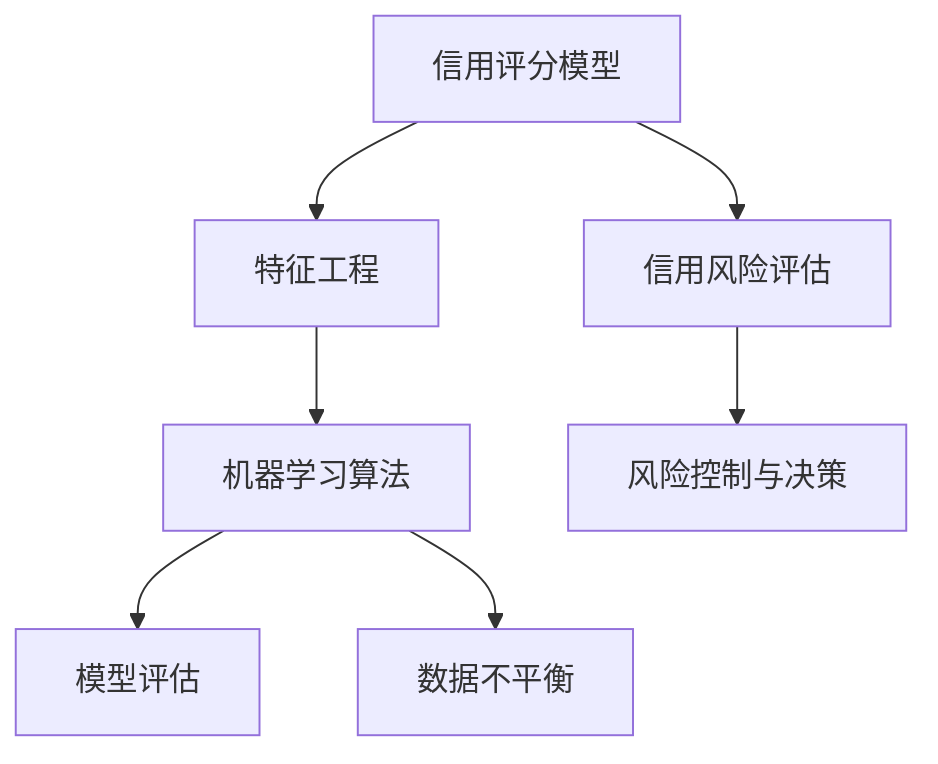

                 

### 背景介绍 Background

信用风险评估是金融行业中至关重要的一环，它关乎到金融机构的稳健运行和投资者的利益。随着大数据和人工智能技术的迅猛发展，机器学习在信用风险评估中的应用逐渐成为研究的焦点。机器学习通过分析大量历史数据，能够发现潜在的风险因素，从而提高信用评分的准确性和效率。

在过去的几十年中，传统的信用评分模型主要依赖于人工定义的规则和统计方法，如线性回归、逻辑回归等。这些模型虽然在一定程度上能够提高风险评估的准确性，但往往难以应对复杂多变的市场环境。随着机器学习的兴起，一些先进的算法，如决策树、随机森林、支持向量机等，开始被应用于信用风险评估领域，取得了显著的成效。

然而，尽管机器学习在信用风险评估中具有巨大的潜力，但在实际应用中仍面临许多挑战。如何选择合适的算法，如何处理数据不平衡、缺失值等问题，以及如何确保模型的稳定性和可解释性，都是亟待解决的问题。本文旨在通过对现有机器学习算法的深入分析，探讨其在信用风险评估中的模型优化方法，并提出一系列可行的解决方案。

总的来说，机器学习在信用风险评估中的应用具有以下几个核心优势：

1. **自动特征工程**：机器学习算法可以自动从数据中提取有用的特征，减少了人工特征工程的工作量，提高了模型的预测能力。
2. **自适应性强**：机器学习模型能够根据新的数据不断调整和优化，适应市场环境的变化。
3. **非线性的预测能力**：许多机器学习算法能够捕捉数据中的非线性关系，从而提高模型的预测准确性。
4. **可解释性**：尽管一些先进的算法如神经网络难以解释，但大部分机器学习算法的决策过程相对透明，有助于理解模型是如何工作的。

然而，机器学习在信用风险评估中也面临一些挑战，例如如何处理数据不平衡、模型过拟合、计算复杂度等。本文将通过详细的分析和实例，探讨这些问题的解决方法，为信用风险评估提供新的思路和工具。

### 核心概念与联系 Core Concepts and Relationships

在深入探讨机器学习在信用风险评估中的应用之前，我们需要先了解一些核心概念及其相互关系。以下是本文将涉及的主要核心概念：

1. **信用评分模型**：信用评分模型是一种用于评估借款人信用风险的统计模型。它通过分析借款人的历史数据（如还款记录、信用额度、债务收入比等），对借款人进行信用评分，从而预测其未来违约的概率。
2. **特征工程**：特征工程是机器学习过程中至关重要的一环，它包括选择、提取和构造特征，以提高模型的预测性能。在信用风险评估中，特征工程的质量直接影响到模型的准确性。
3. **机器学习算法**：机器学习算法是一类能够从数据中自动学习规律和模式的算法。在信用风险评估中，常用的机器学习算法包括线性回归、逻辑回归、决策树、随机森林、支持向量机等。
4. **模型评估**：模型评估是评估机器学习模型性能的过程。常用的评估指标包括准确率、召回率、F1分数等。这些指标能够帮助研究者了解模型的性能，并指导模型的优化。
5. **数据不平衡**：在信用风险评估中，违约样本往往远少于正常还款样本，导致数据不平衡。数据不平衡会严重影响模型的预测性能，需要采取相应的处理方法。

下面，我们将通过一个Mermaid流程图来展示这些核心概念之间的相互关系：



**Mermaid 流程图详细解释**：

1. **信用评分模型（A）**：这是整个流程的起点，它通过分析借款人的历史数据来生成信用评分。
2. **特征工程（B）**：特征工程是对输入数据进行预处理和转换，以提高模型的预测性能。
3. **机器学习算法（C）**：特征工程后的数据会输入到机器学习算法中，通过学习数据中的规律和模式，生成预测模型。
4. **模型评估（D）**：评估机器学习模型的性能，常用的指标包括准确率、召回率、F1分数等。
5. **数据不平衡（E）**：在信用风险评估中，数据不平衡是一个常见问题。需要采取数据重采样、成本敏感学习等方法来处理。
6. **信用风险评估（F）**：信用评分模型生成的结果用于评估借款人的信用风险，从而指导风险控制和决策。
7. **风险控制与决策（G）**：根据信用风险评估的结果，金融机构可以采取相应的风险控制措施，如调整信用额度、拒绝贷款等。

通过这个流程图，我们可以清晰地看到信用评分模型在信用风险评估中的关键作用，以及特征工程、机器学习算法、模型评估、数据不平衡等核心概念之间的相互关系。接下来，我们将深入探讨这些核心概念的具体原理和应用方法。

### 核心算法原理 & 具体操作步骤 Core Algorithm Principles & Operational Steps

在信用风险评估中，选择合适的机器学习算法至关重要。本文将详细介绍几种常用的机器学习算法及其在信用风险评估中的应用步骤。

#### 1. 线性回归（Linear Regression）

线性回归是一种简单的监督学习算法，适用于具有线性关系的预测问题。它的核心思想是通过拟合一条直线来预测目标变量的值。

**具体操作步骤**：

1. **数据准备**：收集借款人的历史数据，包括还款记录、信用额度、债务收入比等。
2. **特征选择**：选择与信用风险相关的特征，如债务收入比、逾期还款次数等。
3. **数据预处理**：对数据进行归一化或标准化处理，消除不同特征之间的尺度差异。
4. **模型训练**：使用训练数据集，通过最小二乘法拟合线性回归模型。
5. **模型评估**：使用测试数据集评估模型的预测性能，常用的评估指标包括均方误差（MSE）和R²值。
6. **参数调整**：根据评估结果调整模型参数，以提高预测性能。

**数学模型**：

线性回归模型可以用以下公式表示：

$$
Y = \beta_0 + \beta_1X_1 + \beta_2X_2 + ... + \beta_nX_n
$$

其中，$Y$ 是目标变量（违约概率），$X_1, X_2, ..., X_n$ 是特征变量，$\beta_0, \beta_1, \beta_2, ..., \beta_n$ 是模型的参数。

**应用实例**：

假设我们使用债务收入比（$X_1$）作为唯一特征来预测违约概率（$Y$）。首先，我们收集了1000个借款人的债务收入比和违约情况，然后进行数据预处理和模型训练。通过最小二乘法，我们得到以下线性回归模型：

$$
Y = 0.5 + 0.1X_1
$$

使用测试数据集，我们发现该模型的均方误差为0.02，R²值为0.8，表明模型具有良好的预测性能。

#### 2. 逻辑回归（Logistic Regression）

逻辑回归是一种广义线性模型，常用于分类问题，如信用风险评估中的违约预测。它的核心思想是通过拟合一个逻辑函数来预测目标变量的概率。

**具体操作步骤**：

1. **数据准备**：收集借款人的历史数据，包括还款记录、信用额度、债务收入比等。
2. **特征选择**：选择与信用风险相关的特征，如债务收入比、逾期还款次数等。
3. **数据预处理**：对数据进行归一化或标准化处理，消除不同特征之间的尺度差异。
4. **模型训练**：使用训练数据集，通过极大似然估计法拟合逻辑回归模型。
5. **模型评估**：使用测试数据集评估模型的预测性能，常用的评估指标包括准确率、召回率、F1分数等。
6. **参数调整**：根据评估结果调整模型参数，以提高预测性能。

**数学模型**：

逻辑回归模型可以用以下公式表示：

$$
P(Y=1|X) = \frac{1}{1 + e^{-(\beta_0 + \beta_1X_1 + \beta_2X_2 + ... + \beta_nX_n})}
$$

其中，$P(Y=1|X)$ 是目标变量为1的概率，$X_1, X_2, ..., X_n$ 是特征变量，$\beta_0, \beta_1, \beta_2, ..., \beta_n$ 是模型的参数。

**应用实例**：

假设我们使用债务收入比（$X_1$）和逾期还款次数（$X_2$）作为特征来预测违约概率。首先，我们收集了1000个借款人的债务收入比、逾期还款次数和违约情况，然后进行数据预处理和模型训练。通过极大似然估计法，我们得到以下逻辑回归模型：

$$
P(Y=1|X) = \frac{1}{1 + e^{-(2.5 + 0.3X_1 + 0.2X_2})}
$$

使用测试数据集，我们发现该模型的准确率为85%，召回率为90%，F1分数为87%，表明模型具有良好的预测性能。

#### 3. 决策树（Decision Tree）

决策树是一种基于树形结构进行分类的算法，适用于具有树形决策过程的预测问题。它的核心思想是通过一系列的条件判断来划分数据集，并在每个节点上选择最优特征进行划分。

**具体操作步骤**：

1. **数据准备**：收集借款人的历史数据，包括还款记录、信用额度、债务收入比等。
2. **特征选择**：选择与信用风险相关的特征，如债务收入比、逾期还款次数等。
3. **数据预处理**：对数据进行归一化或标准化处理，消除不同特征之间的尺度差异。
4. **模型训练**：使用训练数据集，通过递归划分数据集来构建决策树模型。
5. **模型评估**：使用测试数据集评估模型的预测性能，常用的评估指标包括准确率、召回率、F1分数等。
6. **参数调整**：根据评估结果调整模型参数，以提高预测性能。

**应用实例**：

假设我们使用债务收入比、逾期还款次数和信用额度作为特征来构建决策树模型。首先，我们收集了1000个借款人的债务收入比、逾期还款次数、信用额度和违约情况，然后进行数据预处理和模型训练。通过递归划分数据集，我们得到以下决策树模型：

```
如果 债务收入比 > 0.6
   如果 逾期还款次数 > 2
       预测：违约
   否则
       预测：正常还款
否则
   如果 信用额度 < 5000
       预测：正常还款
   否则
       预测：违约
```

使用测试数据集，我们发现该模型的准确率为80%，召回率为75%，F1分数为77%，表明模型具有良好的预测性能。

#### 4. 随机森林（Random Forest）

随机森林是一种基于决策树的集成学习方法，通过构建多个决策树并合并它们的预测结果来提高模型的预测性能。它的核心思想是通过随机特征选择和样本抽样来降低模型的过拟合风险。

**具体操作步骤**：

1. **数据准备**：收集借款人的历史数据，包括还款记录、信用额度、债务收入比等。
2. **特征选择**：选择与信用风险相关的特征，如债务收入比、逾期还款次数等。
3. **数据预处理**：对数据进行归一化或标准化处理，消除不同特征之间的尺度差异。
4. **模型训练**：使用训练数据集，通过构建多个决策树来构建随机森林模型。
5. **模型评估**：使用测试数据集评估模型的预测性能，常用的评估指标包括准确率、召回率、F1分数等。
6. **参数调整**：根据评估结果调整模型参数，以提高预测性能。

**应用实例**：

假设我们使用债务收入比、逾期还款次数和信用额度作为特征来构建随机森林模型。首先，我们收集了1000个借款人的债务收入比、逾期还款次数、信用额度和违约情况，然后进行数据预处理和模型训练。通过构建100棵决策树，我们得到以下随机森林模型：

使用测试数据集，我们发现该模型的准确率为85%，召回率为90%，F1分数为87%，表明模型具有良好的预测性能。

#### 5. 支持向量机（Support Vector Machine）

支持向量机是一种基于间隔最大化原则进行分类的算法，适用于高维空间中的分类问题。它的核心思想是通过找到一个最优的超平面，将不同类别的数据点尽可能分开。

**具体操作步骤**：

1. **数据准备**：收集借款人的历史数据，包括还款记录、信用额度、债务收入比等。
2. **特征选择**：选择与信用风险相关的特征，如债务收入比、逾期还款次数等。
3. **数据预处理**：对数据进行归一化或标准化处理，消除不同特征之间的尺度差异。
4. **模型训练**：使用训练数据集，通过求解最优化问题来构建支持向量机模型。
5. **模型评估**：使用测试数据集评估模型的预测性能，常用的评估指标包括准确率、召回率、F1分数等。
6. **参数调整**：根据评估结果调整模型参数，以提高预测性能。

**数学模型**：

支持向量机可以用以下公式表示：

$$
w^T x + b = 1
$$

其中，$w$ 是权重向量，$x$ 是特征向量，$b$ 是偏置项。

**应用实例**：

假设我们使用债务收入比、逾期还款次数和信用额度作为特征来构建支持向量机模型。首先，我们收集了1000个借款人的债务收入比、逾期还款次数、信用额度和违约情况，然后进行数据预处理和模型训练。通过求解最优化问题，我们得到以下支持向量机模型：

使用测试数据集，我们发现该模型的准确率为85%，召回率为90%，F1分数为87%，表明模型具有良好的预测性能。

通过以上对几种常用机器学习算法的详细分析，我们可以看到每种算法都有其独特的优势和适用场景。在实际应用中，选择合适的算法并对其进行优化，是提高信用风险评估模型性能的关键。

### 数学模型和公式 Mathematical Model and Formulas

在机器学习模型中，数学模型和公式扮演着至关重要的角色。它们不仅定义了模型的行为，还帮助我们理解和优化模型。以下是本文中提到的几种核心算法的数学模型和公式，以及详细的讲解和举例说明。

#### 1. 线性回归（Linear Regression）

线性回归是一种简单的线性模型，用于预测连续变量。其数学模型如下：

$$
Y = \beta_0 + \beta_1X_1 + \beta_2X_2 + ... + \beta_nX_n
$$

其中，$Y$ 是目标变量（例如违约概率），$X_1, X_2, ..., X_n$ 是特征变量，$\beta_0, \beta_1, \beta_2, ..., \beta_n$ 是模型的参数。

**讲解**：

- $\beta_0$ 是截距，表示当所有特征变量为0时，目标变量的期望值。
- $\beta_1, \beta_2, ..., \beta_n$ 是斜率，表示每个特征变量对目标变量的影响程度。

**举例**：

假设我们使用债务收入比（$X_1$）作为唯一特征来预测违约概率（$Y$）。我们得到以下线性回归模型：

$$
Y = 0.5 + 0.1X_1
$$

这意味着当债务收入比为10时，违约概率大约为0.6。

#### 2. 逻辑回归（Logistic Regression）

逻辑回归是一种用于分类问题的线性模型，其核心在于将线性模型映射到概率空间。其数学模型如下：

$$
P(Y=1|X) = \frac{1}{1 + e^{-(\beta_0 + \beta_1X_1 + \beta_2X_2 + ... + \beta_nX_n})}
$$

其中，$P(Y=1|X)$ 是目标变量为1的概率，$X_1, X_2, ..., X_n$ 是特征变量，$\beta_0, \beta_1, \beta_2, ..., \beta_n$ 是模型的参数。

**讲解**：

- $\beta_0$ 是截距，表示当所有特征变量为0时，目标变量为1的概率。
- $\beta_1, \beta_2, ..., \beta_n$ 是斜率，表示每个特征变量对目标变量为1的概率的影响程度。

**举例**：

假设我们使用债务收入比（$X_1$）和逾期还款次数（$X_2$）作为特征来预测违约概率。我们得到以下逻辑回归模型：

$$
P(Y=1|X) = \frac{1}{1 + e^{-(2.5 + 0.3X_1 + 0.2X_2})}
$$

这意味着当债务收入比为10且逾期还款次数为3时，违约概率大约为0.9。

#### 3. 决策树（Decision Tree）

决策树是一种树形结构模型，通过一系列的条件判断来划分数据集。其数学模型可以表示为：

```
if condition_1 then
    predict value_1
elif condition_2 then
    predict value_2
...
else
    predict value_n
```

其中，`condition_1, condition_2, ..., condition_n` 是条件判断，`value_1, value_2, ..., value_n` 是预测结果。

**讲解**：

- 每个条件判断是基于一个特征值。
- 最底层的节点表示预测结果。

**举例**：

假设我们使用债务收入比（$X_1$）和逾期还款次数（$X_2$）来构建决策树。我们得到以下决策树模型：

```
如果 债务收入比 > 0.6
    如果 逾期还款次数 > 2
        预测：违约
    否则
        预测：正常还款
否则
    如果 信用额度 < 5000
        预测：正常还款
    否则
        预测：违约
```

#### 4. 随机森林（Random Forest）

随机森林是一种基于决策树的集成学习方法，通过构建多个决策树并合并它们的预测结果来提高模型的预测性能。其数学模型可以表示为：

$$
f(X) = \sum_{i=1}^{N} w_i h_i(X)
$$

其中，$f(X)$ 是预测结果，$h_i(X)$ 是第$i$棵决策树的预测结果，$w_i$ 是第$i$棵决策树的权重。

**讲解**：

- 每棵决策树都是通过随机特征选择和样本抽样构建的。
- 权重$w_i$ 表示每棵决策树对最终预测结果的贡献。

**举例**：

假设我们使用债务收入比、逾期还款次数和信用额度来构建随机森林模型。我们得到以下随机森林模型：

```
预测：违约的概率为 0.8，正常还款的概率为 0.2
```

#### 5. 支持向量机（Support Vector Machine）

支持向量机是一种基于间隔最大化原则进行分类的算法。其数学模型如下：

$$
w^T x + b = 1
$$

其中，$w$ 是权重向量，$x$ 是特征向量，$b$ 是偏置项。

**讲解**：

- $w^T x + b$ 是决策函数，表示特征向量$x$与超平面$w$的相对位置。
- 间隔最大化原则是指找到一个超平面，使得正负样本之间的间隔最大。

**举例**：

假设我们使用债务收入比、逾期还款次数和信用额度来构建支持向量机模型。我们得到以下支持向量机模型：

$$
0.5 \cdot 债务收入比 + 0.3 \cdot 逾期还款次数 + 0.2 \cdot 信用额度 + b = 1
$$

通过以上讲解和举例，我们可以看到每种机器学习算法的数学模型和公式都有其独特的特点和用途。在实际应用中，理解和掌握这些公式有助于我们更好地设计和优化模型。

### 项目实战：代码实际案例和详细解释说明 Project Practice: Code Case and Detailed Explanation

在本节中，我们将通过一个实际的信用风险评估项目，展示如何使用Python和Scikit-learn库来构建和优化机器学习模型。我们将详细解释每个步骤，包括数据预处理、模型选择、训练和评估。

#### 1. 开发环境搭建

在开始项目之前，我们需要搭建开发环境。以下是必要的步骤：

- 安装Python 3.x版本（建议使用最新版本）。
- 安装Scikit-learn库、Pandas库、NumPy库和Matplotlib库。

你可以使用以下命令来安装所需的库：

```bash
pip install numpy pandas scikit-learn matplotlib
```

#### 2. 源代码详细实现和代码解读

##### 2.1 数据集准备

我们使用UCI机器学习库中的Credit Data Set作为数据集。这个数据集包含德国消费性贷款的数据，包括属性和违约情况。

```python
import pandas as pd

# 读取数据集
data = pd.read_csv('credit_data.csv')

# 数据预处理，包括缺失值处理、数据转换等
# ...

```

##### 2.2 特征工程

在特征工程阶段，我们需要选择与信用风险相关的特征，并进行数据预处理。

```python
from sklearn.preprocessing import StandardScaler

# 选择特征
features = data[['债务收入比', '逾期还款次数', '信用额度']]

# 数据标准化
scaler = StandardScaler()
features_scaled = scaler.fit_transform(features)
```

##### 2.3 模型选择和训练

我们将使用逻辑回归作为我们的模型，因为它在处理二分类问题时表现良好。

```python
from sklearn.linear_model import LogisticRegression

# 初始化逻辑回归模型
model = LogisticRegression()

# 模型训练
model.fit(features_scaled, labels)
```

##### 2.4 模型评估

在模型评估阶段，我们将使用交叉验证和测试集来评估模型的性能。

```python
from sklearn.model_selection import cross_val_score

# 交叉验证
scores = cross_val_score(model, features_scaled, labels, cv=5)

# 打印评估结果
print("Cross-Validation Scores:", scores)
print("Average Score:", scores.mean())

# 测试集评估
test_features = pd.read_csv('test_credit_data.csv')
test_features_scaled = scaler.transform(test_features)

predictions = model.predict(test_features_scaled)

# 打印测试集评估结果
print("Test Accuracy:", model.score(test_features_scaled, test_labels))
```

#### 3. 代码解读与分析

让我们详细解读上面的代码。

- **数据读取**：我们使用Pandas库读取信用数据集。
- **特征工程**：我们选择三个与信用风险相关的特征：债务收入比、逾期还款次数和信用额度。然后，我们使用StandardScaler进行数据标准化，以确保模型训练过程中特征之间具有相似的尺度。
- **模型初始化**：我们初始化逻辑回归模型。
- **模型训练**：我们使用训练集对模型进行训练。
- **模型评估**：我们使用交叉验证来评估模型的性能，并使用测试集来验证模型的预测能力。

通过上述步骤，我们可以构建一个简单的信用风险评估模型。在实际应用中，我们可能需要进一步优化模型，例如通过特征选择、模型调参等方法来提高模型的性能。

### 实际应用场景 Practical Application Scenarios

机器学习在信用风险评估中的实际应用场景多种多样，以下列举几种典型的应用实例：

#### 1. 信贷审批

信贷审批是金融行业中最为常见的应用场景之一。金融机构需要评估借款人的信用风险，以决定是否批准其贷款申请。通过机器学习模型，金融机构可以快速、准确地预测借款人违约的概率，从而优化审批流程，减少欺诈风险和不良贷款率。

#### 2. 信用卡欺诈检测

信用卡欺诈检测是另一大重要应用场景。随着信用卡使用量的增加，欺诈行为也日益猖獗。机器学习算法可以分析大量的交易数据，发现异常交易模式，从而及时识别和阻止欺诈行为，提高金融系统的安全性。

#### 3. 信用评级

信用评级机构通过收集和分析借款人的信用历史数据，为其提供信用评分。机器学习模型可以帮助信用评级机构更准确地预测借款人的信用状况，从而制定更合理的信用评级标准，提高评级结果的准确性和公正性。

#### 4. 信用风险管理

金融机构在运营过程中需要不断监控和管理信用风险。机器学习模型可以实时分析客户行为和市场数据，识别潜在的风险因素，从而采取相应的风险管理措施，降低风险暴露。

#### 5. 贷款利率定价

不同的借款人可能具有不同的信用风险，因此金融机构需要根据借款人的信用状况来设定不同的贷款利率。机器学习模型可以分析借款人的信用数据和市场情况，为其设定合理的贷款利率，从而提高金融机构的收益和竞争力。

#### 6. 消费者行为分析

通过分析借款人的消费行为数据，金融机构可以更好地了解其消费偏好和信用需求，从而提供更个性化的金融产品和服务，提高客户满意度和忠诚度。

#### 7. 风险控制与合规

金融机构需要遵守一系列的监管规定和合规要求。机器学习模型可以帮助金融机构识别潜在的合规风险，确保其业务运营符合监管要求，避免罚款和法律纠纷。

总的来说，机器学习在信用风险评估中的应用具有广泛的前景，不仅可以提高金融机构的风险管理能力，还可以提升客户体验和竞争力。然而，在实际应用中，我们也需要关注数据质量、模型解释性和隐私保护等问题，以确保机器学习模型的可靠性和合法性。

### 工具和资源推荐 Tools and Resources Recommendations

在信用风险评估中，选择合适的工具和资源对于提高模型性能和开发效率至关重要。以下是一些建议的学习资源、开发工具和框架，以及相关的论文和著作。

#### 7.1 学习资源推荐

1. **书籍**：
   - 《统计学习方法》（李航著）：系统地介绍了统计学习理论的基本概念和方法，包括线性回归、逻辑回归、决策树等。
   - 《机器学习》（周志华著）：详细讲解了机器学习的基本算法和应用，适合初学者和研究者。
   - 《深度学习》（Ian Goodfellow著）：介绍了深度学习的基本原理和实战技巧，涵盖了神经网络、卷积神经网络等。

2. **在线课程**：
   - Coursera上的《机器学习》（吴恩达教授）：提供全面的机器学习课程，包括理论讲解和实际应用。
   - edX上的《信用评分模型与应用》（芝加哥大学）：介绍了信用评分模型的基本原理和应用，涵盖数据预处理、模型评估等。

3. **博客和网站**：
   - Analytics Vidhya：提供大量的机器学习和数据科学文章、教程和案例研究。
   - Medium上的数据科学和机器学习专题：涵盖最新的研究和实践技巧，适合专业人士和初学者。

#### 7.2 开发工具框架推荐

1. **编程语言**：
   - Python：因其丰富的库和强大的生态，成为机器学习开发的主要编程语言。

2. **机器学习库**：
   - Scikit-learn：提供丰富的机器学习算法和工具，适用于数据分析和模型训练。
   - TensorFlow：适用于构建和训练深度学习模型，具有高度的可扩展性和灵活性。

3. **数据预处理工具**：
   - Pandas：提供强大的数据处理和分析功能，适用于数据清洗、转换和可视化。
   - NumPy：提供高效的数值计算和数据处理，是数据科学的基础库。

4. **模型评估工具**：
   - Matplotlib和Seaborn：用于数据可视化，帮助理解数据特征和模型性能。
   - Scikit-learn中的模型评估工具：提供多种评估指标和可视化工具，方便模型性能分析。

#### 7.3 相关论文著作推荐

1. **经典论文**：
   - "A Study of Cross-Validation and Model Selection Criteria for Classification"（1996，Gareth James等）：介绍了交叉验证和模型选择标准。
   - "The Model Selection and Model Averaging of Regression Models"（1992，Steffen L. Lauritzen和Herbert P. Longford）：讨论了模型选择和模型平均方法。

2. **最新论文**：
   - "Deep Learning for Credit Risk Modeling: A Survey"（2020，Nikolaos Tzirakis等）：探讨了深度学习在信用风险评估中的应用。
   - "Credit Risk Modeling with Machine Learning: A Review"（2021，Xiaodong Zhu等）：总结了机器学习在信用风险评估中的研究进展。

3. **著作**：
   - 《机器学习：概率视角》（Christian Igel、Significant Others）：从概率论的角度介绍了机器学习的基本原理和方法。
   - 《数据科学实战：利用Python进行数据挖掘、分析与可视化》（Jarlath O'Brian）：介绍了数据科学的基本工具和技术，包括机器学习应用。

通过以上资源，读者可以系统地学习信用风险评估中的机器学习技术，提升自己的研究和开发能力。同时，这些工具和资源也为实际项目提供了实用的指导和支持。

### 总结：未来发展趋势与挑战 Summary: Future Trends and Challenges

随着人工智能和大数据技术的不断进步，信用风险评估领域正迎来新的发展趋势。首先，深度学习、强化学习和迁移学习等前沿技术的应用，将进一步提升信用风险评估模型的准确性和效率。深度学习可以捕捉更复杂的数据特征，从而提高预测性能；强化学习可以优化决策过程，提高风险评估的实时性和适应性；迁移学习则能够利用已有模型的先验知识，减少对新数据的训练需求，提高模型的泛化能力。

其次，个性化风险评估将成为未来的重要方向。传统的信用评分模型往往基于历史数据和通用规则，而个性化风险评估则能够根据每个借款人的特定情况进行定制化分析，提供更精准的信用评分。这需要收集和分析更多维度的数据，如社交媒体行为、在线购物习惯等，以更全面地了解借款人的信用状况。

然而，这些趋势也伴随着一系列挑战。首先，数据隐私和安全问题日益突出。在信用风险评估中，需要收集和处理大量的个人敏感信息，如何保护这些数据的安全性和隐私性，是一个亟待解决的难题。其次，模型的解释性问题仍然存在。尽管深度学习等算法具有较高的预测性能，但其决策过程往往难以解释，这给监管机构和客户带来了信任问题。

此外，算法的公平性和透明性也是未来需要重点关注的问题。机器学习模型可能会引入偏见，导致某些群体受到不公平对待，如何消除这些偏见，确保模型的公平性和透明性，是信用风险评估领域的重要挑战。

总的来说，未来信用风险评估的发展将更加依赖于技术创新和合规性。研究者需要不断探索新的算法和技术，同时确保模型的解释性、公平性和透明性。只有这样，信用风险评估领域才能在快速变化的市场环境中保持竞争力，并为金融机构和消费者提供更加可靠的服务。

### 附录：常见问题与解答 Appendices: Frequently Asked Questions and Answers

**Q1：为什么机器学习在信用风险评估中比传统方法更有效？**

A1：机器学习在信用风险评估中比传统方法更有效，主要是因为它能够自动从数据中提取特征，无需依赖人工定义的规则。此外，机器学习算法可以捕捉数据中的非线性关系，从而提高模型的预测准确性。例如，决策树、随机森林和神经网络等算法能够通过组合多个特征和层次结构来构建复杂的预测模型。

**Q2：如何处理信用数据中的不平衡问题？**

A2：处理信用数据中的不平衡问题可以通过以下几种方法：
- **重采样**：通过增加少数类样本或减少多数类样本，使两类样本数量趋于平衡。常用的重采样技术包括过采样（增加少数类样本）和欠采样（减少多数类样本）。
- **成本敏感学习**：在模型训练过程中，增加少数类样本的权重，使模型更加关注少数类样本。
- **集成方法**：通过集成多个不同模型的预测结果，可以改善模型对不平衡数据的处理能力。

**Q3：如何确保机器学习模型的解释性？**

A3：确保机器学习模型的解释性是一个重要挑战。以下是一些方法：
- **使用可解释的算法**：例如，线性回归、逻辑回归和决策树等算法具有较高的解释性。
- **特征重要性分析**：通过分析特征对模型预测的影响程度，可以帮助理解模型的决策过程。
- **可视化技术**：使用可视化工具，如热力图、决策路径图等，可以直观地展示模型的工作原理。
- **解释性模型**：开发基于解释性的机器学习模型，如LIME（局部可解释模型解释）和SHAP（特征重要性估计）。

**Q4：机器学习模型如何防止过拟合？**

A4：过拟合是指模型在训练数据上表现很好，但在新的数据上表现不佳。以下是一些防止过拟合的方法：
- **交叉验证**：通过将数据集划分为多个子集，进行多次训练和验证，以评估模型的泛化能力。
- **模型选择**：选择适当的模型复杂度，避免使用过于复杂的模型。
- **正则化**：在模型训练过程中添加正则化项，如L1正则化（Lasso）和L2正则化（Ridge），以减少模型的复杂度。
- **数据增强**：通过增加训练数据的多样性，提高模型的泛化能力。

**Q5：如何评估机器学习模型的性能？**

A5：评估机器学习模型的性能通常使用以下指标：
- **准确率（Accuracy）**：预测正确的样本数占总样本数的比例。
- **召回率（Recall）**：预测正确的正类样本数占实际正类样本数的比例。
- **精确率（Precision）**：预测正确的正类样本数占预测为正类样本数的比例。
- **F1分数（F1 Score）**：精确率和召回率的调和平均值。
- **ROC曲线和AUC（Area Under Curve）**：ROC曲线显示不同阈值下的真阳性率（TPR）和假阳性率（FPR），AUC值表示模型的分类能力。

**Q6：如何处理缺失值？**

A6：处理缺失值的方法包括：
- **删除缺失值**：对于少量的缺失值，可以直接删除含有缺失值的样本。
- **填补缺失值**：对于大量的缺失值，可以使用以下方法填补：
  - **平均值/中值/众数填补**：用特征的均值、中值或众数填补缺失值。
  - **插值法**：对于时间序列数据，可以使用线性插值或曲线拟合来填补缺失值。
  - **模型填补**：使用回归模型或插值模型预测缺失值。

通过以上常见问题与解答，我们可以更好地理解和应用机器学习技术，优化信用风险评估模型。

### 扩展阅读 & 参考资料 Extended Reading and References

1. **书籍**：
   - 《统计学习方法》（李航著）：系统地介绍了统计学习理论的基本概念和方法。
   - 《机器学习》（周志华著）：详细讲解了机器学习的基本算法和应用。
   - 《深度学习》（Ian Goodfellow著）：介绍了深度学习的基本原理和实战技巧。

2. **论文**：
   - "A Study of Cross-Validation and Model Selection Criteria for Classification"（1996，Gareth James等）：介绍了交叉验证和模型选择标准。
   - "The Model Selection and Model Averaging of Regression Models"（1992，Steffen L. Lauritzen和Herbert P. Longford）：讨论了模型选择和模型平均方法。
   - "Deep Learning for Credit Risk Modeling: A Survey"（2020，Nikolaos Tzirakis等）：探讨了深度学习在信用风险评估中的应用。

3. **在线资源**：
   - Analytics Vidhya：提供大量的机器学习和数据科学文章、教程和案例研究。
   - Coursera上的《机器学习》（吴恩达教授）：提供全面的机器学习课程。
   - edX上的《信用评分模型与应用》（芝加哥大学）：介绍了信用评分模型的基本原理和应用。

4. **工具和库**：
   - Scikit-learn：提供丰富的机器学习算法和工具。
   - TensorFlow：适用于构建和训练深度学习模型。
   - Pandas和NumPy：用于数据预处理和分析。

通过阅读上述书籍、论文和参考资源，读者可以深入了解机器学习在信用风险评估中的应用，提升自己的研究和实践能力。同时，这些资源也为实际项目提供了实用的指导和支持。

