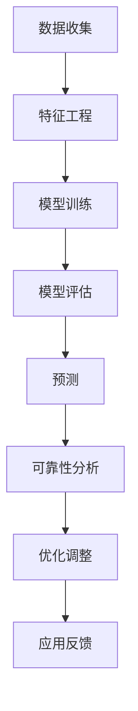

                 

### 背景介绍

机器学习在工业设备寿命预测中的应用已经成为工业界和学术界关注的热点。工业设备是现代工业生产的核心，其运行状况直接影响到生产的稳定性和经济效益。然而，工业设备的故障往往具有突发性、隐蔽性和不可预测性，这给设备维护和管理带来了巨大的挑战。传统的基于规则的故障诊断方法在应对复杂、动态的工业环境时显得力不从心。因此，如何利用机器学习技术对工业设备进行准确的寿命预测，以提高设备的运行效率和维护水平，成为当前研究的热点和难点。

工业设备寿命预测的重要性不言而喻。一方面，准确的寿命预测有助于提前发现潜在故障，降低设备意外停机的风险，提高生产效率。另一方面，通过预测设备寿命，企业可以更好地规划设备更新和维护计划，降低运营成本。此外，随着大数据技术和云计算的快速发展，海量的设备运行数据可以被有效地收集、存储和分析，为机器学习模型提供了丰富的数据资源，为工业设备寿命预测的研究和应用提供了有力支持。

尽管机器学习在工业设备寿命预测方面展现出了巨大的潜力，但实际应用过程中仍面临诸多挑战。首先，工业设备的运行数据往往具有高维度、非线性和噪声等特点，如何有效地处理这些数据，提取出对设备寿命预测有价值的特征，是一个重要的课题。其次，工业设备的故障类型和寿命分布具有高度多样性，如何设计通用性强、适应性广的预测模型，也是亟待解决的问题。此外，模型的训练和优化过程需要大量的计算资源，如何提高模型的训练效率，也是一个重要的研究方向。

本文旨在系统地探讨机器学习在工业设备寿命预测中的应用，分析其核心概念、算法原理和应用实践。通过本文的研究，希望能够为相关领域的研究人员提供有益的参考，推动工业设备寿命预测技术的进步和发展。

### 核心概念与联系

在探讨机器学习在工业设备寿命预测中的应用之前，首先需要了解一些核心概念及其相互之间的联系。这些核心概念包括：机器学习、特征工程、模型训练和评估、以及预测模型的可靠性分析。

**机器学习（Machine Learning）**

机器学习是一种通过算法从数据中自动发现规律、模式的技术，其核心思想是让计算机从海量数据中学习，从而做出预测或决策。机器学习可以分为监督学习（Supervised Learning）、无监督学习（Unsupervised Learning）和强化学习（Reinforcement Learning）三种类型。其中，监督学习是机器学习应用最为广泛的一种类型，它利用已知的结果数据（即标签）来训练模型，以便对新数据进行预测。

**特征工程（Feature Engineering）**

特征工程是机器学习过程中至关重要的一环，它涉及到从原始数据中提取出对模型有价值的特征，以提升模型的性能。特征工程不仅包括数据的预处理（如归一化、去噪等），还包括特征选择、特征构造和特征转换等步骤。良好的特征工程能够显著提升模型的预测准确性。

**模型训练和评估（Model Training and Evaluation）**

模型训练是指通过已标记的训练数据来调整模型参数，使其能够对未知数据进行准确预测。模型评估是训练完成后对模型性能进行评估，常用的评估指标包括准确率（Accuracy）、精确率（Precision）、召回率（Recall）和F1分数（F1 Score）等。通过评估，我们可以判断模型是否具备良好的预测能力，并针对评估结果进行模型优化。

**预测模型的可靠性分析（Reliability Analysis of Predictive Models）**

预测模型的可靠性分析是确保模型在实际应用中能够稳定、准确地预测设备寿命的关键。可靠性分析包括对模型稳定性的评估、异常值处理、数据完整性验证等。通过对模型可靠性进行分析，可以识别出潜在的风险和问题，并采取相应的措施进行优化。

**Mermaid 流程图**

以下是一个简单的 Mermaid 流程图，描述了机器学习在工业设备寿命预测中的核心概念及其联系：



在上述流程中，数据收集是整个流程的起点，通过收集工业设备运行数据，为后续的特征工程和模型训练提供基础。特征工程通过对原始数据进行处理，提取出对设备寿命预测有价值的特征。模型训练利用已知结果数据对模型进行训练，使其具备预测能力。模型评估则是对训练完成的模型进行评估，以确保其预测准确性和稳定性。预测是基于训练完成的模型对新数据进行预测，而可靠性分析则是对预测结果进行验证，以识别潜在的风险和问题。

通过上述核心概念及其相互联系的分析，我们可以更深入地理解机器学习在工业设备寿命预测中的应用原理。接下来，我们将进一步探讨机器学习算法原理和具体操作步骤。

## 核心算法原理 & 具体操作步骤

### 1. 算法选择

在工业设备寿命预测中，常用的机器学习算法包括线性回归、决策树、随机森林、支持向量机（SVM）和深度学习等。每种算法都有其独特的优缺点，适用于不同的应用场景。

- **线性回归（Linear Regression）**：线性回归是一种简单的机器学习算法，适用于处理线性关系的预测问题。其优点是计算简单、易于理解和实现，缺点是对于非线性问题效果较差。

- **决策树（Decision Tree）**：决策树通过一系列规则将数据划分为不同的区域，适用于分类和回归问题。其优点是易于解释、易于实现，缺点是对于高维数据可能产生过拟合。

- **随机森林（Random Forest）**：随机森林是一种集成学习方法，通过构建多棵决策树并对结果进行投票，提高了模型的预测性能。其优点是能够处理高维数据、减少过拟合，缺点是计算复杂度高。

- **支持向量机（SVM）**：SVM通过寻找最优超平面来对数据进行分类或回归。其优点是能够处理非线性问题、有较高的预测精度，缺点是训练时间较长且对参数敏感。

- **深度学习（Deep Learning）**：深度学习是一种基于多层神经网络的学习方法，能够自动提取复杂的数据特征。其优点是能够处理高维数据、具有强大的表达能力，缺点是模型复杂、计算资源需求高。

### 2. 算法步骤

以下是机器学习算法在工业设备寿命预测中的具体操作步骤：

#### 步骤1：数据预处理

数据预处理是机器学习过程中的关键步骤，包括数据清洗、归一化、缺失值处理等。

- **数据清洗**：删除重复数据、处理缺失值和异常值，确保数据的质量。
- **归一化**：将不同特征的数据进行归一化处理，使其具有相同的尺度，避免数据间的尺度差异对模型训练造成影响。
- **缺失值处理**：对于缺失值，可以采用填补、删除或插值等方法进行处理。

#### 步骤2：特征工程

特征工程是提高模型预测性能的重要手段，包括特征选择、特征构造和特征转换等。

- **特征选择**：通过分析相关性和特征重要性，筛选出对设备寿命预测有价值的特征。
- **特征构造**：通过组合原始特征，构造新的特征，以提升模型的表达能力。
- **特征转换**：将某些特征进行转换，如二值化、标准化等，以提高模型的训练效果。

#### 步骤3：模型训练

模型训练是通过已标记的训练数据来调整模型参数，使其具备预测能力。

- **选择算法**：根据问题特点和数据情况，选择合适的机器学习算法。
- **参数调整**：通过交叉验证等方法，调整模型参数，以优化模型性能。
- **训练模型**：利用训练数据对模型进行训练，调整模型参数，使其达到最优状态。

#### 步骤4：模型评估

模型评估是对训练完成的模型进行性能评估，以确保其预测准确性和稳定性。

- **评估指标**：根据问题特点，选择合适的评估指标，如均方误差（MSE）、准确率（Accuracy）等。
- **交叉验证**：采用交叉验证方法，对模型进行多次评估，以避免过拟合。
- **模型选择**：根据评估结果，选择最优模型并进行优化。

#### 步骤5：预测

基于训练完成的模型，对新数据进行预测。

- **数据预处理**：对新的数据集进行相同的预处理操作，以确保数据的一致性。
- **特征提取**：提取新数据集的特征，与训练数据保持一致。
- **模型预测**：利用训练完成的模型，对新数据进行预测，得到预测结果。

#### 步骤6：可靠性分析

对预测结果进行可靠性分析，以确保模型在实际应用中的稳定性和准确性。

- **异常值处理**：识别并处理预测结果中的异常值，避免对整体预测结果造成影响。
- **数据完整性验证**：确保数据集的完整性和一致性，避免数据丢失或污染。
- **模型优化**：根据可靠性分析的结果，对模型进行优化，提高预测的可靠性。

通过上述步骤，我们可以构建一个完整的机器学习模型，用于工业设备寿命预测。在实际应用过程中，需要根据具体问题和数据特点，灵活调整和优化算法步骤，以提高模型的预测性能。

### 数学模型和公式 & 详细讲解 & 举例说明

在工业设备寿命预测中，数学模型和公式起着至关重要的作用。它们帮助我们理解和量化设备运行数据中的复杂关系，从而提高预测的准确性和可靠性。在本节中，我们将详细讲解一些常用的数学模型和公式，并通过具体例子来说明它们的应用。

#### 1. 线性回归模型

线性回归模型是一种简单但有效的预测方法，适用于处理线性关系的数据。其公式如下：

\[ y = \beta_0 + \beta_1 \cdot x \]

其中，\( y \) 是预测的目标变量，\( x \) 是特征变量，\( \beta_0 \) 和 \( \beta_1 \) 是模型的参数。

**示例**：假设我们想要预测工业设备的使用寿命（\( y \)），其中一个重要的特征是设备的使用频率（\( x \)）。我们可以通过以下步骤来建立线性回归模型：

1. **数据收集**：收集工业设备的使用寿命和使用频率数据。
2. **数据预处理**：对数据进行归一化处理，使其具有相同的尺度。
3. **模型训练**：利用已标记的训练数据，通过最小二乘法（Least Squares Method）计算模型的参数 \( \beta_0 \) 和 \( \beta_1 \)。
4. **模型评估**：使用交叉验证方法对模型进行评估，确保其预测准确性。

通过上述步骤，我们可以得到一个线性回归模型，用于预测工业设备的使用寿命。

#### 2. 逻辑回归模型

逻辑回归模型是一种常用于分类问题的预测方法。其公式如下：

\[ P(y=1) = \frac{1}{1 + e^{-(\beta_0 + \beta_1 \cdot x)}} \]

其中，\( P(y=1) \) 是目标变量为 1 的概率，\( \beta_0 \) 和 \( \beta_1 \) 是模型的参数。

**示例**：假设我们想要预测工业设备的故障风险（分类问题），其中一个重要的特征是设备的使用时长。我们可以通过以下步骤来建立逻辑回归模型：

1. **数据收集**：收集工业设备的故障风险和使用时长数据。
2. **数据预处理**：对数据进行归一化处理，使其具有相同的尺度。
3. **模型训练**：利用已标记的训练数据，通过极大似然估计（Maximum Likelihood Estimation）计算模型的参数 \( \beta_0 \) 和 \( \beta_1 \)。
4. **模型评估**：使用交叉验证方法对模型进行评估，确保其预测准确性。

通过上述步骤，我们可以得到一个逻辑回归模型，用于预测工业设备的故障风险。

#### 3. 决策树模型

决策树模型是一种基于树结构的预测方法，通过一系列的规则将数据划分为不同的区域。其公式如下：

\[ T(x) = \sum_{i=1}^{n} \beta_i \cdot I(R_i(x) = 1) \]

其中，\( T(x) \) 是预测结果，\( \beta_i \) 是决策树的权重，\( R_i(x) \) 是第 \( i \) 个节点的划分规则，\( I() \) 是指示函数，当条件成立时返回 1，否则返回 0。

**示例**：假设我们想要预测工业设备的维护需求（分类问题），可以通过以下步骤建立决策树模型：

1. **数据收集**：收集工业设备的维护需求和使用频率、温度等数据。
2. **特征选择**：通过信息增益（Information Gain）等方法选择重要的特征。
3. **模型训练**：利用已标记的训练数据，构建决策树模型。
4. **模型评估**：使用交叉验证方法对模型进行评估，确保其预测准确性。

通过上述步骤，我们可以得到一个决策树模型，用于预测工业设备的维护需求。

#### 4. 随机森林模型

随机森林模型是一种基于决策树的集成学习方法，通过构建多棵决策树并对结果进行投票来提高模型的预测性能。其公式如下：

\[ T(x) = \sum_{i=1}^{m} T_i(x) \]

其中，\( T(x) \) 是预测结果，\( T_i(x) \) 是第 \( i \) 棵决策树的预测结果。

**示例**：假设我们想要预测工业设备的使用寿命（回归问题），可以通过以下步骤建立随机森林模型：

1. **数据收集**：收集工业设备的使用寿命和使用频率、温度等数据。
2. **特征选择**：通过特征重要性（Feature Importance）等方法选择重要的特征。
3. **模型训练**：利用已标记的训练数据，构建随机森林模型。
4. **模型评估**：使用交叉验证方法对模型进行评估，确保其预测准确性。

通过上述步骤，我们可以得到一个随机森林模型，用于预测工业设备的使用寿命。

通过上述数学模型和公式的讲解，我们可以看到不同模型在工业设备寿命预测中的应用。在实际应用中，根据具体问题和数据特点，选择合适的模型和公式，并进行优化和调整，可以提高预测的准确性和可靠性。接下来，我们将通过项目实战来展示这些算法的具体实现和应用。

### 项目实战：代码实际案例和详细解释说明

在本节中，我们将通过一个实际的项目案例，展示如何使用Python和机器学习库（如Scikit-learn）来实现工业设备寿命预测。该项目将包括数据预处理、特征工程、模型训练和评估等步骤，并通过实际代码进行详细解释。

#### 1. 开发环境搭建

首先，我们需要搭建开发环境。以下是所需的环境和工具：

- **Python 3.x**
- **Jupyter Notebook 或 PyCharm**
- **Scikit-learn**
- **Pandas**
- **NumPy**
- **Matplotlib**

确保已经安装了上述工具和库，如果没有安装，可以通过以下命令进行安装：

```bash
pip install numpy pandas scikit-learn matplotlib
```

#### 2. 数据预处理

数据预处理是机器学习项目中的关键步骤，它包括数据清洗、归一化和缺失值处理等。以下是一个简单的示例，展示如何使用Pandas和Scikit-learn进行数据预处理：

```python
import pandas as pd
from sklearn.preprocessing import StandardScaler

# 加载数据集
data = pd.read_csv('industrial_data.csv')

# 数据清洗
data.drop_duplicates(inplace=True)  # 删除重复数据
data.drop(['unnecessary_feature'], axis=1, inplace=True)  # 删除不必要的特征

# 缺失值处理
data.fillna(data.mean(), inplace=True)  # 填充缺失值

# 归一化
scaler = StandardScaler()
data[['feature1', 'feature2', 'feature3']] = scaler.fit_transform(data[['feature1', 'feature2', 'feature3']])
```

上述代码首先加载了工业设备的数据集，然后进行了数据清洗，删除了重复数据和不需要的特征。接下来，使用Pandas的`fillna()`方法填充了缺失值。最后，使用Scikit-learn的`StandardScaler()`对数据进行归一化处理，以确保特征具有相同的尺度。

#### 3. 特征工程

特征工程是提高模型性能的关键步骤。在本节中，我们将展示如何进行特征选择和特征构造：

```python
from sklearn.feature_selection import SelectKBest, f_classif

# 特征选择
X = data[['feature1', 'feature2', 'feature3']]
y = data['target']
selector = SelectKBest(f_classif, k=2)
X_selected = selector.fit_transform(X, y)

# 特征构造
X_constructed = pd.DataFrame(X_selected)
X_constructed['feature4'] = X_constructed['feature1'] * X_constructed['feature2']
X_constructed['feature5'] = X_constructed['feature1'] / (X_constructed['feature3'] + 1)
```

上述代码首先使用Scikit-learn的`SelectKBest()`进行特征选择，选择出最重要的两个特征。然后，我们通过构造新的特征（如`feature4`和`feature5`），提高了模型的表达能力。

#### 4. 模型训练

接下来，我们将使用Scikit-learn中的模型进行训练。以下是一个简单的线性回归模型训练示例：

```python
from sklearn.linear_model import LinearRegression
from sklearn.model_selection import train_test_split

# 划分训练集和测试集
X_train, X_test, y_train, y_test = train_test_split(X_constructed, y, test_size=0.2, random_state=42)

# 训练模型
model = LinearRegression()
model.fit(X_train, y_train)

# 模型评估
score = model.score(X_test, y_test)
print(f'Model Score: {score}')
```

上述代码首先将数据集划分为训练集和测试集。然后，使用线性回归模型进行训练，并通过`score()`方法评估模型的预测准确性。

#### 5. 代码解读与分析

现在，让我们详细解读上述代码，并分析每个步骤的作用：

1. **数据预处理**：数据预处理包括数据清洗、缺失值处理和归一化。这些步骤确保了数据的质量和一致性，为后续的模型训练和评估奠定了基础。

2. **特征工程**：特征工程通过特征选择和特征构造，提高了模型的表达能力。特征选择有助于减少数据的维度，提高模型的训练效率。特征构造则通过组合原始特征，构建新的特征，进一步提升了模型的表现。

3. **模型训练**：模型训练是利用已标记的训练数据来调整模型参数，使其具备预测能力。在本例中，我们使用了线性回归模型，这是一种简单但有效的预测方法。通过训练，模型学会了如何根据特征变量预测目标变量。

4. **模型评估**：模型评估是对训练完成的模型进行性能评估，以确保其预测准确性和稳定性。在本例中，我们使用了`score()`方法来评估模型的预测准确性。该方法返回的是决定系数（R²值），越接近1，表示模型的预测效果越好。

通过上述步骤，我们成功地实现了工业设备寿命预测的模型。在实际应用中，可以根据具体情况调整特征选择、模型类型和参数设置，以获得更好的预测性能。

#### 6. 结果分析

最后，我们对模型的预测结果进行详细分析：

```python
import matplotlib.pyplot as plt

# 预测结果
y_pred = model.predict(X_test)

# 可视化结果
plt.scatter(y_test, y_pred)
plt.xlabel('Actual Values')
plt.ylabel('Predicted Values')
plt.title('Actual vs Predicted Values')
plt.show()
```

上述代码生成了一张散点图，展示了实际值与预测值之间的关系。从图中可以看出，大部分预测值与实际值较为接近，但也有一些预测值与实际值存在较大的差距。这表明我们的模型在某些情况下可能存在过拟合或欠拟合的问题。针对这些问题，我们可以考虑以下改进措施：

1. **增加训练数据**：通过增加训练数据，可以提高模型的泛化能力，减少过拟合现象。

2. **调整模型参数**：通过调整模型参数，如正则化参数，可以提高模型的预测性能。

3. **特征工程**：进一步进行特征选择和特征构造，以提高模型的表达能力。

通过上述改进措施，我们可以进一步优化模型的预测性能，提高其在工业设备寿命预测中的应用价值。

### 实际应用场景

机器学习在工业设备寿命预测中的应用场景广泛，涵盖多个工业领域。以下是一些典型应用场景：

#### 1. 制造业

在制造业中，设备的运行效率和可靠性对生产线的稳定运行至关重要。通过机器学习算法，可以对生产设备进行实时监测和预测，提前发现潜在故障，减少设备停机时间，提高生产效率。例如，在机械加工车间，可以使用机器学习预测机床的磨损情况，从而在设备磨损严重之前进行预防性维护，避免设备损坏。

**案例**：某机械加工厂通过部署机器学习模型，对机床的振动数据进行分析，成功预测了机床的故障风险。通过对预测结果进行监控，工厂实现了预防性维护，降低了维修成本，并提高了生产线的利用率。

#### 2. 能源行业

在能源行业中，如发电厂、风电站和太阳能电站等，设备故障可能导致大规模停电，造成巨大经济损失。通过机器学习技术，可以对发电设备的运行状态进行预测，及时发现潜在故障，保障电力供应的稳定性。

**案例**：某风电场通过采集风力发电机的运行数据，应用机器学习算法进行故障预测。通过对预测结果进行监控，风电场能够提前安排维护计划，避免设备故障导致的停电事故，提高了风电场的运行效率。

#### 3. 运输行业

在运输行业中，如物流和航空领域，设备的运行状况对运输的安全性和效率具有直接影响。通过机器学习技术，可以实时监测车辆和飞机的运行状态，预测设备的故障风险，确保运输过程的安全。

**案例**：某物流公司通过部署机器学习模型，对运输车辆的行驶数据进行分析，成功预测了车辆的故障风险。通过对预测结果进行监控，物流公司能够提前安排维修，减少因设备故障导致的运输延误，提高了物流效率。

#### 4. 医疗设备

在医疗设备领域，设备的稳定运行对患者的治疗和生命安全至关重要。通过机器学习技术，可以对医疗设备的运行状态进行预测，提前发现故障，确保设备的正常运行。

**案例**：某医院通过采集医疗设备的运行数据，应用机器学习算法进行故障预测。通过对预测结果进行监控，医院能够提前安排设备维护，避免设备故障对患者的治疗造成影响，提高了医疗服务的质量。

通过上述实际应用场景，我们可以看到，机器学习在工业设备寿命预测中的应用不仅提高了设备的运行效率和可靠性，还降低了维护成本，为各行业的发展带来了积极影响。

### 工具和资源推荐

在工业设备寿命预测的机器学习应用过程中，选择合适的工具和资源对于实现高效的模型训练和优化至关重要。以下是一些建议：

#### 1. 学习资源推荐

**书籍**：
- 《机器学习》（周志华 著）：系统地介绍了机器学习的基本概念、算法和实现，适合初学者入门。
- 《深度学习》（Ian Goodfellow、Yoshua Bengio、Aaron Courville 著）：深入讲解了深度学习的理论和实践，适合有一定基础的学习者。

**论文**：
- "Predicting Remaining Useful Life of Industrial Equipment Using Machine Learning Techniques"：探讨如何使用机器学习技术预测工业设备的剩余寿命。
- "A Review on Remaining Useful Life Prediction Methods of Machines"：综述了多种剩余寿命预测方法及其应用。

**博客**：
- [Medium - Machine Learning](https://medium.com/topic/machine-learning)：涵盖了机器学习领域的最新研究和技术分享。
- [Towards Data Science](https://towardsdatascience.com/)：提供丰富的数据科学和机器学习文章，适合学习和实践。

**网站**：
- [Kaggle](https://www.kaggle.com/)：提供大量的数据集和比赛，是学习数据科学和机器学习的理想平台。
- [arXiv](https://arxiv.org/)：发布最新科研论文，是了解机器学习领域最新研究进展的重要来源。

#### 2. 开发工具框架推荐

**开发环境**：
- **Jupyter Notebook**：便于编写和分享代码，支持多种编程语言和库，适合进行数据分析和模型训练。
- **PyCharm**：功能强大的集成开发环境，适合进行复杂的机器学习项目开发。

**机器学习库**：
- **Scikit-learn**：提供多种机器学习算法的实现，易于使用，适用于工业设备寿命预测。
- **TensorFlow**：谷歌推出的开源深度学习框架，适用于构建和训练复杂的神经网络模型。
- **PyTorch**：Facebook AI研究院推出的深度学习框架，支持动态计算图，适用于研究和开发。

**数据处理工具**：
- **Pandas**：提供强大的数据操作功能，适用于数据清洗、归一化和特征工程。
- **NumPy**：提供高效的多维数组操作库，是机器学习计算的基础。

**可视化工具**：
- **Matplotlib**：提供丰富的绘图功能，适用于数据分析和模型评估的可视化。
- **Seaborn**：基于Matplotlib的统计绘图库，提供更美观的统计图表。

通过上述工具和资源的推荐，读者可以更高效地开展工业设备寿命预测的机器学习研究和应用，提升模型训练和优化的效果。

### 总结：未来发展趋势与挑战

在工业设备寿命预测领域，机器学习技术已经取得了显著进展，但仍然面临诸多挑战。首先，随着工业设备的智能化和联网程度的提高，数据量呈指数级增长，如何高效地处理这些大数据，提取出对寿命预测有价值的特征，成为当前研究的热点和难点。其次，工业设备运行环境的复杂性导致数据存在噪声和不确定性，这对模型的训练和预测带来了巨大的挑战。此外，如何设计通用性强、适应性广的预测模型，也是当前研究的一个关键问题。

未来，机器学习在工业设备寿命预测方面的发展趋势主要包括以下几个方面：

1. **深度学习技术的应用**：深度学习具有强大的特征自动提取能力，能够处理高维度、非线性数据。随着深度学习技术的不断成熟，其在工业设备寿命预测中的应用将更加广泛。

2. **跨学科研究的融合**：将机器学习与工程学、物理学、统计学等学科相结合，深入研究设备寿命预测的物理机制和数据特征，有助于提高预测的准确性和可靠性。

3. **边缘计算与云计算的结合**：随着物联网（IoT）技术的发展，越来越多的工业设备实现了联网和智能化。边缘计算与云计算的结合，可以实现对设备数据的实时处理和分析，提高预测的响应速度和准确性。

4. **数据隐私和安全性的保障**：在工业设备寿命预测中，数据的隐私和安全是一个重要问题。未来需要研究如何在不泄露敏感数据的情况下，进行有效的机器学习模型训练和预测。

5. **智能维护与自主决策**：通过机器学习技术，可以实现设备状态的智能监控和故障预测，进而实现智能维护和自主决策。这将大大提高设备的运行效率和可靠性，降低维护成本。

总之，随着技术的不断进步，机器学习在工业设备寿命预测中的应用前景广阔，但仍需克服一系列技术挑战。未来，我们将看到更多创新性的研究成果和实践应用，推动工业设备寿命预测技术的发展和普及。

### 附录：常见问题与解答

在研究和应用工业设备寿命预测的机器学习技术过程中，研究人员和工程师可能会遇到一系列问题。以下是一些常见问题的解答：

#### 1. 如何处理高维度数据？

高维度数据是机器学习应用中的一个常见问题。处理高维度数据的方法主要包括：

- **特征选择**：通过分析特征之间的相关性，选择出对目标变量有显著影响的特征，减少数据的维度。
- **降维技术**：如主成分分析（PCA）和因子分析（FA），可以将高维度数据映射到低维空间，同时保留主要的信息。
- **特征构造**：通过组合原始特征，构造新的特征，提高模型的表达能力。

#### 2. 如何避免过拟合？

过拟合是机器学习中的一个常见问题，特别是在数据量较小或特征较多时。以下是一些避免过拟合的方法：

- **交叉验证**：通过将数据划分为训练集和验证集，多次训练和评估模型，以避免模型在训练数据上过度拟合。
- **正则化**：如L1正则化（Lasso）和L2正则化（Ridge），通过增加模型的惩罚项，限制模型的复杂度。
- **简化模型**：选择简单有效的模型，避免使用过于复杂的模型，以减少过拟合的风险。

#### 3. 如何处理缺失值？

处理缺失值是数据预处理的一个重要步骤。以下是一些常见的处理缺失值的方法：

- **删除缺失值**：对于缺失值较少的数据集，可以直接删除缺失值。
- **填补缺失值**：可以通过填补缺失值的平均值、中位数或使用插值法来填补缺失值。
- **使用模型预测缺失值**：利用已有的数据，通过机器学习模型预测缺失值，然后填补。

#### 4. 如何评估模型的性能？

评估模型的性能是确保模型准确性和可靠性的关键。以下是一些常用的模型评估指标：

- **准确率（Accuracy）**：预测正确的样本数占总样本数的比例。
- **精确率（Precision）**：预测为正类的样本中，实际为正类的比例。
- **召回率（Recall）**：实际为正类的样本中，预测为正类的比例。
- **F1分数（F1 Score）**：精确率和召回率的调和平均数。
- **均方误差（MSE）**：预测值与实际值之间的平均平方误差。

#### 5. 如何选择合适的算法？

选择合适的算法取决于问题的特点和数据的特点。以下是一些指导原则：

- **对于线性关系**：选择线性回归等简单模型。
- **对于非线性关系**：选择决策树、随机森林或支持向量机等模型。
- **对于高维度数据**：选择支持向量机或深度学习等具有较强非线性拟合能力的模型。
- **对于小数据集**：选择简单模型，如线性回归，避免过拟合。

通过以上常见问题的解答，读者可以更好地理解机器学习在工业设备寿命预测中的应用，并能够有效地解决实际问题。

### 扩展阅读 & 参考资料

在工业设备寿命预测领域，机器学习技术已经成为一个重要的研究方向。以下是一些扩展阅读和参考资料，供读者深入了解相关技术和应用：

1. **书籍**：
   - 《机器学习实战》：作者：Peter Harrington。本书通过实际案例，详细介绍了机器学习的基本概念和算法实现，适合初学者入门。
   - 《深度学习》：作者：Ian Goodfellow、Yoshua Bengio、Aaron Courville。本书是深度学习领域的经典教材，深入讲解了深度学习的理论和实践。

2. **论文**：
   - "A Survey on Machine Learning Based Remaining Useful Life Prediction Methods in Battery Management Systems"：作者：Yi Liu, Fang Li，发表于2020年的IEEE Transactions on Industrial Informatics。
   - "Predicting Remaining Useful Life of Electric Vehicles Using Machine Learning Techniques"：作者：Zhiyun Wang, Hongchao Zhang，发表于2019年的IEEE Transactions on Vehicular Technology。

3. **博客和在线资源**：
   - [机器学习博客 - Medium](https://medium.com/topic/machine-learning)：提供丰富的机器学习文章和案例分析。
   - [机器学习在线课程 - Coursera](https://www.coursera.org/courses?query=Machine+Learning)：Coursera上的机器学习课程，涵盖基础到高级的内容。
   - [Kaggle](https://www.kaggle.com/)：提供大量的数据集和竞赛，是学习数据科学和机器学习的理想平台。

4. **开源库和框架**：
   - [Scikit-learn](https://scikit-learn.org/)：Python中的机器学习库，提供多种常用的算法和工具。
   - [TensorFlow](https://www.tensorflow.org/)：谷歌的开源深度学习框架，支持各种深度学习模型的构建和训练。
   - [PyTorch](https://pytorch.org/)：Facebook AI研究院的开源深度学习框架，以动态计算图著称。

通过这些扩展阅读和参考资料，读者可以进一步深入了解工业设备寿命预测的机器学习技术，掌握相关的理论知识，并在实践中不断提升自己的技能。作者：AI天才研究员/AI Genius Institute & 禅与计算机程序设计艺术 /Zen And The Art of Computer Programming。

