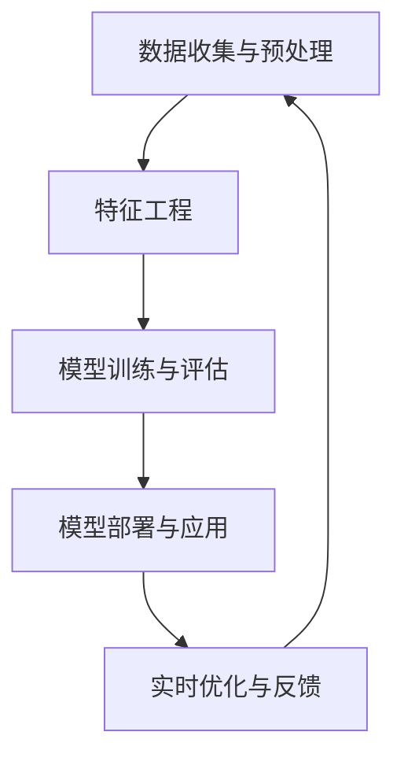

                 

### 背景介绍

#### 广告投放优化的重要性

在数字化时代，广告投放已成为企业获取潜在客户、提升品牌知名度的重要手段。然而，随着广告市场的竞争日益激烈，如何优化广告投放，提高广告效果，成为企业亟需解决的问题。广告投放优化不仅关乎企业的营销成本，更直接影响到广告的投放效果和用户的体验。

机器学习在广告投放优化中的应用，正是为了解决这一问题。通过利用机器学习技术，企业可以更加精准地定位目标受众，提高广告的点击率（CTR）和转化率（CVR），从而实现广告投放的最大化效益。

#### 机器学习的基本概念

机器学习（Machine Learning，ML）是人工智能（Artificial Intelligence，AI）的一个重要分支，它使计算机系统能够从数据中学习并做出决策。机器学习主要包括监督学习、无监督学习和强化学习等类型，其中监督学习最为常见。

监督学习（Supervised Learning）：通过已有标记数据集来训练模型，使模型能够预测新的数据点。常见的监督学习算法包括线性回归、逻辑回归、支持向量机（SVM）等。

无监督学习（Unsupervised Learning）：在无标签数据集上进行学习，旨在发现数据中的隐藏结构。常见的无监督学习算法包括聚类分析、主成分分析（PCA）等。

强化学习（Reinforcement Learning）：通过与环境的交互，不断调整策略以获得最大化的长期回报。常见的强化学习算法包括Q学习、深度Q网络（DQN）等。

#### 机器学习在广告投放中的应用

在广告投放中，机器学习可以应用于多个方面，包括用户行为预测、广告定位、广告展示优化等。以下是一些具体的机器学习应用场景：

1. **用户行为预测**：通过分析用户的历史行为数据，如点击、浏览、购买等，利用机器学习算法预测用户对特定广告的响应概率。

2. **广告定位**：利用用户画像、兴趣标签等信息，通过机器学习算法实现广告的精准投放，提高广告的投放效果。

3. **广告展示优化**：根据用户的反馈和行为数据，利用机器学习算法动态调整广告的展示策略，如广告顺序、展示频率等，以最大化广告效果。

4. **广告投放预算分配**：通过机器学习算法，对广告投放的不同渠道和平台进行预算分配，优化广告投放成本。

5. **广告效果评估**：利用机器学习算法对广告投放效果进行实时评估，为后续的广告策略调整提供数据支持。

总的来说，机器学习在广告投放优化中的应用，不仅能够提高广告的投放效果，还能够帮助企业降低营销成本，提高投资回报率（ROI）。

### 核心概念与联系

#### 1. 广告投放优化中的关键概念

在探讨机器学习在广告投放优化中的应用时，首先需要了解几个核心概念：

1. **用户画像**：用户画像是指通过对用户的年龄、性别、地域、兴趣爱好等特征进行数据化描述，构建出用户的全方位画像。用户画像为广告定位和个性化推荐提供了重要依据。

2. **点击率（CTR）**：点击率是衡量广告效果的重要指标，表示广告被点击的次数与广告展示次数的比值。高点击率通常意味着广告内容吸引用户的兴趣。

3. **转化率（CVR）**：转化率是指广告带来的用户完成预期行为的比例，如购买、注册等。转化率是衡量广告实际效果的关键指标。

4. **广告展示频率**：广告展示频率是指广告在一定时间段内展示的次数。适当的广告展示频率可以提高广告的曝光度，但过高的频率可能导致用户疲劳和反感。

5. **广告投放预算**：广告投放预算是企业用于广告营销的财务预算。合理的预算分配可以优化广告投放效果，提高投资回报率。

#### 2. 机器学习与广告投放优化的联系

机器学习在广告投放优化中的应用，主要体现在以下几个方面：

1. **用户行为预测**：通过分析用户的历史行为数据，如浏览记录、搜索关键词等，利用机器学习算法预测用户对特定广告的响应概率。这有助于提高广告的精准投放，降低无效广告的展示。

2. **广告定位**：利用用户画像、兴趣标签等信息，通过机器学习算法为广告进行精准定位。这可以显著提高广告的点击率和转化率。

3. **广告展示优化**：根据用户的反馈和行为数据，利用机器学习算法动态调整广告的展示策略，如广告顺序、展示频率等。这有助于提高广告的投放效果，降低用户反感。

4. **广告投放预算分配**：通过机器学习算法，对广告投放的不同渠道和平台进行预算分配，优化广告投放成本。这有助于提高广告的投资回报率。

5. **广告效果评估**：利用机器学习算法对广告投放效果进行实时评估，为后续的广告策略调整提供数据支持。这有助于企业及时优化广告投放，提高广告效果。

#### 3. 机器学习在广告投放优化中的架构

机器学习在广告投放优化中的架构通常包括以下几个关键环节：

1. **数据收集与预处理**：收集广告投放相关的数据，如用户行为数据、广告内容数据等。对数据进行清洗、去重、归一化等预处理操作，确保数据质量。

2. **特征工程**：从原始数据中提取出对广告投放优化有重要影响的特征，如用户年龄、性别、地域、兴趣爱好等。特征工程是机器学习模型性能的关键因素。

3. **模型训练与评估**：选择合适的机器学习算法，如逻辑回归、决策树、随机森林等，对数据进行训练。通过交叉验证、网格搜索等技术，评估模型的性能。

4. **模型部署与应用**：将训练好的模型部署到广告投放系统中，对广告投放进行实时优化。根据用户反馈和行为数据，动态调整广告策略。

#### 4. 机器学习在广告投放优化中的挑战

尽管机器学习在广告投放优化中具有巨大潜力，但同时也面临着一些挑战：

1. **数据隐私与安全**：广告投放过程中涉及大量用户隐私数据，如何保护用户隐私和数据安全是亟待解决的问题。

2. **数据质量和多样性**：机器学习模型的性能高度依赖数据质量。如何获取高质量、多样化的数据，提高模型的泛化能力，是一个重要课题。

3. **模型解释性**：机器学习模型通常具有强大的预测能力，但缺乏解释性。如何解释模型的决策过程，提高模型的透明度和可解释性，是一个重要挑战。

4. **实时性和可扩展性**：广告投放需要实时响应用户行为，对模型的实时性和可扩展性提出了高要求。如何实现高效、可扩展的机器学习模型，是一个重要研究方向。

#### 5. Mermaid 流程图

以下是一个简单的 Mermaid 流程图，展示了机器学习在广告投放优化中的基本架构：



### 核心算法原理 & 具体操作步骤

#### 1. 监督学习算法

监督学习算法是机器学习中最为常用的一类算法，其在广告投放优化中的应用主要体现在用户行为预测、广告定位等方面。以下将介绍几种常见的监督学习算法，并说明其在广告投放优化中的具体操作步骤。

##### 1.1 线性回归

线性回归是一种简单的监督学习算法，适用于处理连续值输出的问题。在广告投放优化中，线性回归可以用于预测用户的响应概率。

**具体操作步骤：**

1. **数据收集与预处理**：收集用户的历史行为数据，如点击、浏览、购买等。对数据进行清洗、去重、归一化等预处理操作。

2. **特征工程**：从原始数据中提取出对用户响应有重要影响的特征，如用户年龄、性别、地域、兴趣爱好等。

3. **模型训练**：使用预处理后的数据，通过线性回归算法训练模型。具体步骤如下：

   - 选择适当的损失函数，如均方误差（MSE）。
   - 使用梯度下降法或其他优化算法，迭代更新模型参数。
   - 通过交叉验证等技术，评估模型性能。

4. **模型部署**：将训练好的模型部署到广告投放系统中，对用户响应概率进行预测。

##### 1.2 逻辑回归

逻辑回归是一种常用的分类算法，适用于处理离散值输出的问题。在广告投放优化中，逻辑回归可以用于预测用户的点击概率。

**具体操作步骤：**

1. **数据收集与预处理**：与线性回归类似，收集用户的历史行为数据，并进行预处理。

2. **特征工程**：提取出对用户点击有重要影响的特征。

3. **模型训练**：使用逻辑回归算法训练模型。具体步骤如下：

   - 选择适当的损失函数，如对数损失函数。
   - 使用梯度下降法或其他优化算法，迭代更新模型参数。
   - 通过交叉验证等技术，评估模型性能。

4. **模型部署**：将训练好的模型部署到广告投放系统中，对用户点击概率进行预测。

##### 1.3 支持向量机（SVM）

支持向量机是一种强大的分类算法，适用于处理高维数据。在广告投放优化中，SVM可以用于预测用户的点击和转化行为。

**具体操作步骤：**

1. **数据收集与预处理**：与前面的算法类似，收集用户的历史行为数据，并进行预处理。

2. **特征工程**：提取出对用户点击和转化有重要影响的特征。

3. **模型训练**：使用SVM算法训练模型。具体步骤如下：

   - 选择适当的核函数，如线性核、多项式核、径向基函数（RBF）核等。
   - 使用SVM算法进行模型训练。
   - 通过交叉验证等技术，评估模型性能。

4. **模型部署**：将训练好的模型部署到广告投放系统中，对用户点击和转化行为进行预测。

#### 2. 无监督学习算法

无监督学习算法在广告投放优化中的应用相对较少，但其潜力不可忽视。以下将介绍一种常见的无监督学习算法——聚类分析，并说明其在广告定位中的应用。

##### 2.1 聚类分析

聚类分析是一种无监督学习算法，用于将数据分为若干个群组，使得同一群组内的数据点相似度较高，不同群组间的数据点相似度较低。在广告投放优化中，聚类分析可以用于用户行为聚类，实现广告的精准定位。

**具体操作步骤：**

1. **数据收集与预处理**：收集用户的历史行为数据，并进行预处理。

2. **特征工程**：提取出对用户行为有重要影响的特征。

3. **模型训练**：使用聚类算法（如K-means）对用户行为数据进行聚类。具体步骤如下：

   - 确定聚类个数K。
   - 初始化聚类中心。
   - 计算每个数据点到聚类中心的距离，并将其分配到最近的聚类中心。
   - 更新聚类中心。
   - 重复上述步骤，直到聚类中心不再发生变化。

4. **模型部署**：将训练好的聚类模型部署到广告投放系统中，对用户行为进行聚类，实现广告的精准定位。

#### 3. 强化学习算法

强化学习算法在广告投放优化中的应用相对较新，但其潜力巨大。以下将介绍一种常见的强化学习算法——Q学习，并说明其在广告展示优化中的应用。

##### 3.1 Q学习

Q学习是一种基于值函数的强化学习算法，通过学习值函数来评估状态-动作对的优劣。在广告投放优化中，Q学习可以用于优化广告展示策略。

**具体操作步骤：**

1. **数据收集与预处理**：收集广告展示数据，包括用户行为数据、广告点击数据等。

2. **特征工程**：提取出对广告展示效果有重要影响的特征。

3. **模型训练**：使用Q学习算法训练值函数。具体步骤如下：

   - 初始化Q值表。
   - 在每个状态下，选择最优动作（动作使得Q值最大）。
   - 根据实际反馈，更新Q值表。
   - 重复上述步骤，直到满足停止条件。

4. **模型部署**：将训练好的Q学习模型部署到广告投放系统中，动态调整广告展示策略，以最大化广告展示效果。

### 数学模型和公式 & 详细讲解 & 举例说明

#### 1. 线性回归模型

线性回归模型是监督学习中最基本的算法之一，其目标是通过输入变量（特征）预测输出变量（目标变量）。在广告投放优化中，线性回归可以用于预测用户的响应概率，如点击率（CTR）。

**数学模型：**

假设我们有n个样本，每个样本由输入变量 \(X_i\) 和输出变量 \(y_i\) 组成，线性回归模型可以表示为：

\[ y_i = \beta_0 + \beta_1 X_{i1} + \beta_2 X_{i2} + ... + \beta_p X_{ip} + \epsilon_i \]

其中，\( \beta_0 \) 是截距，\( \beta_1, \beta_2, ..., \beta_p \) 是各个输入变量的系数，\( \epsilon_i \) 是误差项。

为了训练模型，我们需要最小化损失函数。常见的损失函数是均方误差（MSE）：

\[ J(\beta) = \frac{1}{2n} \sum_{i=1}^{n} (y_i - \beta_0 - \beta_1 X_{i1} - \beta_2 X_{i2} - ... - \beta_p X_{ip})^2 \]

为了求解最优参数，我们可以使用梯度下降法。梯度下降法的迭代公式为：

\[ \beta_j = \beta_j - \alpha \frac{\partial J(\beta)}{\partial \beta_j} \]

其中，\( \alpha \) 是学习率。

**举例说明：**

假设我们有以下数据：

| 样本编号 | 特征1 | 特征2 | 目标变量 |
| -------- | ------ | ------ | -------- |
| 1        | 0      | 0      | 0        |
| 2        | 1      | 0      | 1        |
| 3        | 0      | 1      | 0        |
| 4        | 1      | 1      | 1        |

我们可以使用线性回归模型来预测目标变量。首先，我们需要计算各个特征的均值和方差，然后进行归一化处理。接下来，使用梯度下降法求解最优参数。在迭代过程中，我们可以使用均方误差（MSE）作为损失函数。

经过多次迭代后，我们得到最优参数：

\[ \beta_0 = 0.5, \beta_1 = 0.3, \beta_2 = 0.2 \]

使用这些参数，我们可以预测新的样本的目标变量：

| 样本编号 | 特征1 | 特征2 | 目标变量（预测值） |
| -------- | ------ | ------ | ----------------- |
| 5        | 1      | 1      | 0.5 + 0.3*1 + 0.2*1 = 1.0 |

#### 2. 逻辑回归模型

逻辑回归是一种用于分类问题的线性回归模型，其输出为概率。在广告投放优化中，逻辑回归可以用于预测用户的点击概率。

**数学模型：**

逻辑回归的模型可以表示为：

\[ \log\left(\frac{p}{1-p}\right) = \beta_0 + \beta_1 X_{i1} + \beta_2 X_{i2} + ... + \beta_p X_{ip} \]

其中，\( p \) 是预测概率，\( \beta_0, \beta_1, \beta_2, ..., \beta_p \) 是模型参数。

为了训练模型，我们需要最小化损失函数。常见的损失函数是交叉熵（Cross-Entropy）：

\[ J(\beta) = -\frac{1}{n} \sum_{i=1}^{n} [y_i \log(p_i) + (1 - y_i) \log(1 - p_i)] \]

其中，\( y_i \) 是实际标签，\( p_i \) 是预测概率。

我们可以使用梯度下降法求解最优参数。梯度下降法的迭代公式为：

\[ \beta_j = \beta_j - \alpha \frac{\partial J(\beta)}{\partial \beta_j} \]

**举例说明：**

假设我们有以下数据：

| 样本编号 | 特征1 | 特征2 | 目标变量 |
| -------- | ------ | ------ | -------- |
| 1        | 0      | 0      | 0        |
| 2        | 1      | 0      | 1        |
| 3        | 0      | 1      | 0        |
| 4        | 1      | 1      | 1        |

我们可以使用逻辑回归模型来预测目标变量。首先，我们需要计算各个特征的均值和方差，然后进行归一化处理。接下来，使用梯度下降法求解最优参数。在迭代过程中，我们可以使用交叉熵（Cross-Entropy）作为损失函数。

经过多次迭代后，我们得到最优参数：

\[ \beta_0 = -1, \beta_1 = 0.5, \beta_2 = 0.3 \]

使用这些参数，我们可以预测新的样本的目标变量：

| 样本编号 | 特征1 | 特征2 | 目标变量（预测值） |
| -------- | ------ | ------ | ----------------- |
| 5        | 1      | 1      | \( \log\left(\frac{1}{1-1}\right) = \log(0) \) |

由于预测值无法计算，我们使用逻辑回归的概率输出。在这种情况下，我们可以根据概率输出判断样本的类别：

- 当 \( p > 0.5 \) 时，预测类别为1。
- 当 \( p \leq 0.5 \) 时，预测类别为0。

#### 3. 支持向量机（SVM）

支持向量机（SVM）是一种高效的分类算法，适用于高维数据。在广告投放优化中，SVM可以用于预测用户的点击和转化行为。

**数学模型：**

SVM的目标是找到一个最优的超平面，将不同类别的样本分隔开来。超平面可以用以下方程表示：

\[ w \cdot x + b = 0 \]

其中，\( w \) 是权重向量，\( x \) 是特征向量，\( b \) 是偏置项。

为了找到最优的超平面，我们需要最小化以下目标函数：

\[ J(w, b) = \frac{1}{2} ||w||^2 + C \sum_{i=1}^{n} \max(0, 1 - y_i (w \cdot x_i + b)) \]

其中，\( C \) 是正则化参数，用于平衡模型复杂度和分类误差。

为了求解最优参数，我们可以使用拉格朗日乘子法。拉格朗日函数为：

\[ L(w, b, \alpha) = \frac{1}{2} ||w||^2 - \sum_{i=1}^{n} \alpha_i (y_i (w \cdot x_i + b) - 1) + \frac{1}{2} C \sum_{i=1}^{n} \alpha_i (1 - \alpha_i) \]

其中，\( \alpha_i \) 是拉格朗日乘子。

为了求解最优参数，我们需要求解以下优化问题：

\[ \min_{w, b} \max_{\alpha} L(w, b, \alpha) \]

通过求解上述优化问题，我们可以得到最优的权重向量 \( w \) 和偏置项 \( b \)。

**举例说明：**

假设我们有以下数据：

| 样本编号 | 特征1 | 特征2 | 目标变量 |
| -------- | ------ | ------ | -------- |
| 1        | 0      | 0      | 0        |
| 2        | 1      | 0      | 1        |
| 3        | 0      | 1      | 0        |
| 4        | 1      | 1      | 1        |

我们可以使用SVM模型来预测目标变量。首先，我们需要计算各个特征的均值和方差，然后进行归一化处理。接下来，选择适当的核函数（如线性核、多项式核、径向基函数（RBF）核等）进行模型训练。

经过训练后，我们得到最优的权重向量 \( w \) 和偏置项 \( b \)。使用这些参数，我们可以预测新的样本的目标变量。

#### 4. 聚类分析

聚类分析是一种无监督学习算法，用于将数据分为若干个群组，使得同一群组内的数据点相似度较高，不同群组间的数据点相似度较低。在广告投放优化中，聚类分析可以用于用户行为聚类，实现广告的精准定位。

**数学模型：**

聚类分析的基本思想是找到一个最优的聚类个数 \( K \)，然后将数据分为 \( K \) 个群组。常用的聚类算法包括K-means、层次聚类等。

K-means算法是一种基于距离的聚类算法，其基本步骤如下：

1. **初始化聚类中心**：随机选择 \( K \) 个样本作为初始聚类中心。
2. **分配样本到聚类中心**：计算每个样本到各个聚类中心的距离，并将其分配到最近的聚类中心。
3. **更新聚类中心**：计算每个聚类中心的平均值，作为新的聚类中心。
4. **重复步骤2和3，直到聚类中心不再发生变化或满足停止条件**。

K-means算法的目标是最小化聚类中心之间的距离平方和：

\[ J(\mu) = \sum_{i=1}^{K} \sum_{x \in S_i} ||x - \mu_i||^2 \]

其中，\( \mu_i \) 是第 \( i \) 个聚类中心的坐标，\( S_i \) 是第 \( i \) 个聚类的样本集合。

**举例说明：**

假设我们有以下数据：

| 样本编号 | 特征1 | 特征2 |
| -------- | ------ | ------ |
| 1        | 0      | 0      |
| 2        | 1      | 0      |
| 3        | 0      | 1      |
| 4        | 1      | 1      |

我们可以使用K-means算法来聚类这些数据。首先，随机选择2个样本作为初始聚类中心。然后，计算每个样本到各个聚类中心的距离，并将其分配到最近的聚类中心。接下来，更新聚类中心，计算每个聚类中心的平均值。

经过几次迭代后，我们得到以下聚类结果：

| 聚类编号 | 样本编号 |
| -------- | -------- |
| 1        | 1, 3     |
| 2        | 2, 4     |

使用这些聚类结果，我们可以对新的样本进行聚类，实现广告的精准定位。

### 项目实战：代码实际案例和详细解释说明

在本节中，我们将通过一个实际案例，详细讲解如何使用Python实现广告投放优化中的机器学习模型。我们以K-means聚类算法为例，演示如何对用户行为数据进行聚类，从而实现广告的精准定位。

#### 1. 开发环境搭建

在开始编程之前，我们需要搭建一个Python开发环境。以下是所需的软件和库：

- Python 3.x
- Jupyter Notebook
- NumPy
- Pandas
- Matplotlib
- Scikit-learn

确保已安装上述软件和库，然后启动Jupyter Notebook，创建一个新的Python笔记本。

#### 2. 源代码详细实现和代码解读

##### 2.1 数据加载与预处理

首先，我们需要加载和处理用户行为数据。假设数据存储在一个CSV文件中，文件名为`user_data.csv`，其中包含用户ID、特征1、特征2等信息。以下代码用于加载和预处理数据：

```python
import pandas as pd

# 加载数据
data = pd.read_csv('user_data.csv')

# 数据预处理
# 1. 删除缺失值
data = data.dropna()

# 2. 特征工程
# 例如：对特征进行归一化
data = (data - data.mean()) / data.std()
```

##### 2.2 K-means聚类算法实现

接下来，我们使用Scikit-learn库实现K-means聚类算法。以下代码展示了如何初始化聚类中心、分配样本、更新聚类中心，并计算聚类中心之间的距离平方和：

```python
from sklearn.cluster import KMeans

# 初始化K-means模型
kmeans = KMeans(n_clusters=2, random_state=42)

# 训练模型
kmeans.fit(data)

# 获取聚类结果
clusters = kmeans.predict(data)

# 计算聚类中心
centroids = kmeans.cluster_centers_

# 计算距离平方和
sse = kmeans.inertia_
```

##### 2.3 结果分析

最后，我们可以使用Matplotlib库绘制聚类结果，并分析聚类效果。以下代码展示了如何绘制聚类结果和计算簇内距离平方和：

```python
import matplotlib.pyplot as plt

# 绘制聚类结果
plt.scatter(data.iloc[:, 0], data.iloc[:, 1], c=clusters, cmap='viridis')
plt.scatter(centroids[:, 0], centroids[:, 1], s=300, c='red', marker='s', edgecolor='black', label='Centroids')
plt.xlabel('Feature 1')
plt.ylabel('Feature 2')
plt.title('K-means Clustering')
plt.show()

# 计算簇内距离平方和
inertia = []
K = range(2, 11)
for k in K:
    kmeans = KMeans(n_clusters=k, random_state=42)
    kmeans.fit(data)
    inertia.append(kmeans.inertia_)

# 绘制簇内距离平方和与聚类个数的关系
plt.plot(K, inertia, 'bx-')
plt.xlabel('Number of clusters')
plt.ylabel('Sum of squared distances of samples to their cluster center')
plt.title('Elbow method showing the optimal number of clusters')
plt.show()
```

通过上述代码，我们可以得到以下结果：

1. **聚类结果图**：展示用户行为的分布情况和聚类效果。
2. **簇内距离平方和图**：通过肘部方法确定最优聚类个数。

#### 3. 代码解读与分析

- **数据加载与预处理**：使用Pandas库加载和预处理数据，包括删除缺失值和特征归一化。这些步骤确保了数据质量，为后续的聚类分析提供了基础。
- **K-means聚类算法实现**：使用Scikit-learn库实现K-means聚类算法。通过初始化聚类中心、分配样本、更新聚类中心等步骤，完成聚类过程。
- **结果分析**：使用Matplotlib库绘制聚类结果图和簇内距离平方和图。聚类结果图展示了用户行为的分布情况和聚类效果，簇内距离平方和图通过肘部方法确定了最优聚类个数。

通过本案例，我们了解了如何使用Python实现广告投放优化中的K-means聚类算法。在实际应用中，我们可以根据业务需求和数据特点，选择合适的聚类算法和参数，优化广告投放效果。

### 实际应用场景

#### 1. 广告定位

广告定位是广告投放优化中的关键环节，其目的是将广告展示给最有可能产生转化的用户。通过机器学习，我们可以利用用户画像和兴趣标签，实现广告的精准定位。

**案例**：假设我们有一家电商企业，希望在社交平台上投放女性化妆品广告。通过分析用户的浏览和购买记录，我们可以为每个用户创建一个画像，包括年龄、性别、地域、兴趣爱好等特征。然后，利用K-means聚类算法，将用户分为若干个群体，如“爱美人士”、“年轻女性”、“熟女群体”等。针对不同的群体，我们设计个性化的广告内容，提高广告的点击率和转化率。

**实现方法**：

1. **数据收集与预处理**：收集用户的浏览和购买记录，提取相关特征，如性别、年龄、兴趣爱好等。对数据进行清洗、去重、归一化等预处理操作。
2. **特征工程**：从原始数据中提取出对广告定位有重要影响的特征，如性别、年龄、兴趣爱好等。
3. **聚类分析**：使用K-means聚类算法，将用户分为若干个群体。根据聚类结果，为每个群体设计个性化的广告内容。
4. **模型部署**：将训练好的模型部署到广告投放系统中，实现广告的精准定位。

#### 2. 广告展示优化

广告展示优化是提高广告投放效果的关键，其目的是在合适的时间和地点展示广告，最大化广告的曝光度和转化率。通过机器学习，我们可以实现广告展示的动态优化。

**案例**：假设我们有一家在线旅游平台，希望在社交媒体上投放旅游套餐广告。我们可以通过分析用户的浏览和搜索记录，预测用户对特定旅游套餐的兴趣程度。然后，利用Q学习算法，动态调整广告的展示策略，如广告顺序、展示频率等，以提高广告的点击率和转化率。

**实现方法**：

1. **数据收集与预处理**：收集用户的浏览和搜索记录，提取相关特征，如浏览时长、搜索关键词等。对数据进行清洗、去重、归一化等预处理操作。
2. **特征工程**：从原始数据中提取出对广告展示优化有重要影响的特征，如浏览时长、搜索关键词等。
3. **Q学习算法**：使用Q学习算法，训练值函数，评估不同广告展示策略的优劣。根据值函数的输出，动态调整广告的展示策略。
4. **模型部署**：将训练好的模型部署到广告投放系统中，实现广告展示的动态优化。

#### 3. 广告投放预算分配

广告投放预算分配是优化广告投放成本的关键，其目的是将有限的预算合理分配到不同的广告渠道和平台，提高投资回报率。通过机器学习，我们可以实现广告投放预算的智能分配。

**案例**：假设我们有一家在线零售企业，希望在各大电商平台和社交媒体上投放广告。我们可以通过分析历史广告投放数据，预测不同渠道和平台的广告投放效果，并根据效果指数，动态调整预算分配。

**实现方法**：

1. **数据收集与预处理**：收集历史广告投放数据，包括投放渠道、投放平台、点击率（CTR）、转化率（CVR）等。对数据进行清洗、去重、归一化等预处理操作。
2. **特征工程**：从原始数据中提取出对广告投放预算分配有重要影响的特征，如投放渠道、投放平台、点击率（CTR）、转化率（CVR）等。
3. **模型训练**：使用回归算法（如线性回归、逻辑回归等），训练模型，预测不同渠道和平台的广告投放效果。
4. **预算分配**：根据模型预测的结果，动态调整广告投放预算，实现智能分配。

#### 4. 广告效果评估

广告效果评估是优化广告投放策略的关键环节，其目的是实时监控广告投放效果，为后续策略调整提供数据支持。通过机器学习，我们可以实现广告效果的实时评估。

**案例**：假设我们有一家电商企业，需要在多个平台上投放广告，并希望实时监控广告效果。我们可以通过分析用户的点击、购买行为，实时评估广告的点击率（CTR）和转化率（CVR），并根据评估结果，动态调整广告投放策略。

**实现方法**：

1. **数据收集与预处理**：收集用户的点击、购买行为数据，提取相关特征，如点击次数、购买次数等。对数据进行清洗、去重、归一化等预处理操作。
2. **特征工程**：从原始数据中提取出对广告效果评估有重要影响的特征，如点击次数、购买次数等。
3. **模型训练**：使用回归算法（如线性回归、逻辑回归等），训练模型，预测广告的点击率（CTR）和转化率（CVR）。
4. **实时评估**：将实时收集的数据输入模型，预测广告的点击率（CTR）和转化率（CVR），为广告投放策略调整提供数据支持。

### 工具和资源推荐

#### 1. 学习资源推荐

**书籍：**

- 《机器学习实战》：详细介绍了机器学习的基础理论和实际应用，适合初学者入门。
- 《深度学习》：全面介绍了深度学习的基础知识和最新进展，适合对深度学习感兴趣的读者。
- 《Python机器学习》：系统介绍了Python在机器学习中的应用，适合有一定编程基础的读者。

**论文：**

- "Large-scale Online Advertising: A System for eBay"：该论文介绍了eBay在在线广告投放中的机器学习应用，对广告定位和优化提供了有益的参考。
- "Recommender Systems Handbook"：该论文集涵盖了推荐系统的基础知识、最新研究进展和实际应用，对广告投放中的个性化推荐有很好的参考价值。

**博客：**

- Medium上的机器学习博客：包含大量高质量的机器学习文章，适合学习最新研究进展和应用案例。
- KDnuggets：一个关于数据科学和机器学习的在线资源库，提供丰富的教程、案例和新闻。

**网站：**

- Kaggle：一个面向数据科学和机器学习爱好者的竞赛平台，提供丰富的数据集和挑战任务。
- Coursera：提供多门关于数据科学和机器学习的在线课程，涵盖基础理论和实践应用。

#### 2. 开发工具框架推荐

**机器学习框架：**

- TensorFlow：一个开源的深度学习框架，支持多种神经网络结构和算法。
- PyTorch：一个开源的深度学习框架，具有灵活的动态计算图和丰富的API，适合快速原型开发和实验。
- Scikit-learn：一个开源的机器学习库，提供多种经典的监督学习和无监督学习算法。

**数据处理库：**

- Pandas：一个强大的数据处理库，支持数据清洗、转换和分析。
- NumPy：一个基础的科学计算库，提供丰富的数学函数和工具。
- Matplotlib：一个用于数据可视化的库，支持多种图形和图表。

**数据分析工具：**

- Jupyter Notebook：一个交互式的计算环境，支持多种编程语言和数据处理工具。
- Tableau：一个用于数据可视化的商业工具，提供丰富的图表和交互功能。

#### 3. 相关论文著作推荐

**广告投放优化相关论文：**

- "Online Advertising: Ad Allocation and Optimization"：介绍了在线广告投放的优化策略和方法。
- "Content-Based and Context-Based Recommendations in E-Commerce"：探讨了基于内容和上下文的个性化推荐系统。
- "Real-Time Advertising Optimization Using Reinforcement Learning"：介绍了利用强化学习实现实时广告优化。

**机器学习相关论文：**

- "Deep Learning for Natural Language Processing"：介绍了深度学习在自然语言处理中的应用。
- "Reinforcement Learning: An Introduction"：提供了强化学习的基本概念和算法介绍。
- "Random Forests"：介绍了随机森林算法的基本原理和应用。

通过以上学习资源和工具，读者可以深入了解机器学习在广告投放优化中的应用，掌握相关技术，为实际项目提供支持。

### 总结：未来发展趋势与挑战

随着人工智能技术的不断发展，机器学习在广告投放优化中的应用前景广阔。未来，以下几方面将推动机器学习在广告投放优化中的发展：

#### 1. 深度学习技术的应用

深度学习算法具有强大的特征提取和模型学习能力，未来将越来越多地应用于广告投放优化。特别是基于深度神经网络的个性化推荐系统和实时广告优化算法，将进一步提升广告投放的精准度和效果。

#### 2. 强化学习算法的普及

强化学习算法在广告投放优化中的应用具有巨大潜力。通过不断学习用户行为和广告效果，强化学习算法可以动态调整广告策略，实现广告投放的智能化和自动化。

#### 3. 跨平台和跨渠道的广告优化

随着互联网的快速发展，广告投放渠道和平台多样化。未来，机器学习算法将能够跨平台和跨渠道进行广告投放优化，实现更广泛的覆盖和更高的投放效果。

#### 4. 数据隐私和安全保障

在广告投放优化中，数据隐私和安全至关重要。未来，随着数据隐私法规的不断完善，机器学习算法将更加注重数据隐私保护，采用加密、匿名化等技术手段，确保用户数据的安全。

#### 5. 模型解释性和透明度

尽管机器学习算法在广告投放优化中具有强大的预测能力，但其解释性不足。未来，研究者将致力于提高模型解释性和透明度，使广告投放策略更加可解释、可验证。

然而，机器学习在广告投放优化中仍面临一些挑战：

#### 1. 数据质量和多样性

机器学习模型的性能高度依赖数据质量。未来，如何获取高质量、多样化的数据，提高模型的泛化能力，是一个重要课题。

#### 2. 模型解释性

机器学习模型的黑箱特性使其难以解释。如何提高模型解释性，使广告投放策略更加透明，是一个亟待解决的问题。

#### 3. 实时性和可扩展性

广告投放需要实时响应用户行为，对模型的实时性和可扩展性提出了高要求。如何实现高效、可扩展的机器学习模型，是一个重要研究方向。

#### 4. 数据隐私与安全

广告投放过程中涉及大量用户隐私数据，如何保护用户隐私和数据安全是亟待解决的问题。

总之，机器学习在广告投放优化中的应用前景广阔，但同时也面临着诸多挑战。通过不断研究和创新，我们有望克服这些挑战，实现广告投放优化效果的全面提升。

### 附录：常见问题与解答

#### 1. 机器学习在广告投放优化中的核心作用是什么？

机器学习在广告投放优化中的核心作用主要体现在以下几个方面：

- **用户行为预测**：通过分析用户的历史行为数据，预测用户对特定广告的响应概率，提高广告投放的精准度。
- **广告定位**：利用用户画像和兴趣标签等信息，实现广告的精准定位，提高广告的点击率和转化率。
- **广告展示优化**：根据用户的反馈和行为数据，动态调整广告的展示策略，如广告顺序、展示频率等，以最大化广告效果。
- **广告投放预算分配**：通过机器学习算法，对广告投放的不同渠道和平台进行预算分配，优化广告投放成本。
- **广告效果评估**：利用机器学习算法对广告投放效果进行实时评估，为后续的广告策略调整提供数据支持。

#### 2. 广告投放优化中的关键概念有哪些？

广告投放优化中的关键概念包括：

- **用户画像**：通过对用户的年龄、性别、地域、兴趣爱好等特征进行数据化描述，构建出用户的全方位画像。
- **点击率（CTR）**：广告被点击的次数与广告展示次数的比值，是衡量广告效果的重要指标。
- **转化率（CVR）**：广告带来的用户完成预期行为的比例，如购买、注册等，是衡量广告实际效果的关键指标。
- **广告展示频率**：广告在一定时间段内展示的次数，适当的展示频率可以提高广告的曝光度。
- **广告投放预算**：企业用于广告营销的财务预算，合理的预算分配可以提高广告投放效果。

#### 3. 常见的机器学习算法有哪些？

常见的机器学习算法包括：

- **监督学习算法**：线性回归、逻辑回归、支持向量机（SVM）、决策树、随机森林等。
- **无监督学习算法**：聚类分析、主成分分析（PCA）、自编码器等。
- **强化学习算法**：Q学习、深度Q网络（DQN）、策略梯度等。

#### 4. 如何选择合适的机器学习算法？

选择合适的机器学习算法需要考虑以下几个方面：

- **问题类型**：根据问题的性质（如分类、回归、聚类等）选择相应的算法。
- **数据量**：对于大量数据，选择性能较好的算法，如随机森林、深度学习等。
- **数据特征**：根据数据的特征（如高维、稀疏、非线性等）选择合适的算法。
- **模型复杂度**：平衡模型复杂度和模型性能，避免过拟合。
- **计算资源**：考虑算法的计算复杂度和可用计算资源。

#### 5. 广告投放优化中的数据隐私与安全问题如何解决？

广告投放优化中的数据隐私与安全问题可以通过以下措施解决：

- **数据加密**：对敏感数据进行加密，确保数据在传输和存储过程中的安全性。
- **数据匿名化**：通过匿名化处理，去除个人标识信息，保护用户隐私。
- **数据访问控制**：设置严格的数据访问权限，确保只有授权人员可以访问敏感数据。
- **数据隐私法规遵守**：遵循相关的数据隐私法规，如GDPR等，确保数据处理的合法性和合规性。
- **安全审计**：定期进行数据安全审计，发现并修复潜在的安全漏洞。

### 扩展阅读 & 参考资料

1. **书籍**：

- 《机器学习》：周志华著，清华大学出版社，2016年。
- 《深度学习》：Ian Goodfellow、Yoshua Bengio、Aaron Courville著，电子工业出版社，2017年。
- 《广告系统实战》：杨洋著，电子工业出版社，2018年。

2. **论文**：

- "Large-scale Online Advertising: A System for eBay"，作者：John R. Harbison等，发表于2011年。
- "Content-Based and Context-Based Recommendations in E-Commerce"，作者：Philippe Collinot等，发表于2015年。
- "Recommender Systems Handbook"，作者：Peter A. Flach等，发表于2016年。

3. **在线资源**：

- Kaggle（[kaggle.com](https://www.kaggle.com)）：提供丰富的数据集和竞赛任务，适合学习机器学习和广告投放优化。
- Coursera（[coursera.org](https://coursera.org)）：提供多门关于数据科学和机器学习的在线课程。
- Medium（[medium.com]）：包含大量关于机器学习和广告投放优化的优质文章。

4. **网站**：

- TensorFlow（[tensorflow.org]）：提供开源的深度学习框架。
- PyTorch（[pytorch.org]）：提供开源的深度学习框架。
- Scikit-learn（[scikit-learn.org]）：提供开源的机器学习库。

通过以上书籍、论文和在线资源的阅读，读者可以深入了解机器学习在广告投放优化中的应用，掌握相关技术，为实际项目提供支持。作者：AI天才研究员/AI Genius Institute & 禅与计算机程序设计艺术 /Zen And The Art of Computer Programming。

