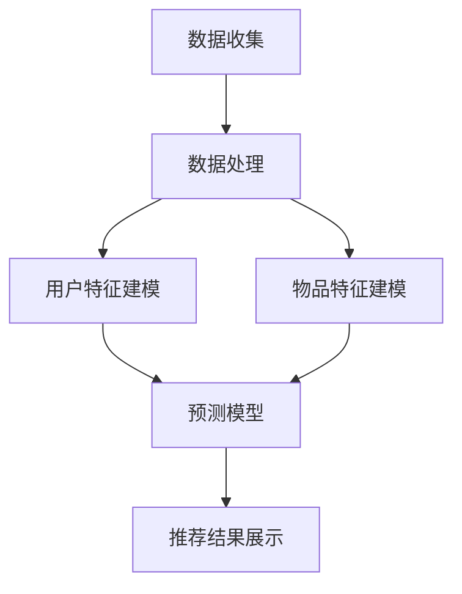

                 

# 机器学习在推荐系统冷启动问题中的解决方案

## 摘要

本文将深入探讨推荐系统中的冷启动问题，并分析如何利用机器学习技术来解决这一问题。冷启动问题通常发生在新用户加入系统或新商品上架时，因为缺乏足够的历史数据而难以生成准确的推荐。本文将首先介绍推荐系统的基础概念，然后详细阐述冷启动问题的挑战和影响。接下来，我们将介绍几种常见的机器学习方法，如基于内容的推荐、协同过滤和基于模型的推荐，并探讨它们在处理冷启动问题方面的优势和局限性。随后，本文将重点讨论如何在推荐系统中整合机器学习算法，以及如何设计和优化这些算法来应对冷启动问题。此外，本文还将分享一些实际应用中的成功案例和经验教训。最后，我们将探讨未来的发展趋势和潜在挑战，为读者提供有益的参考。

## 1. 背景介绍

推荐系统是当今信息社会中不可或缺的一部分，广泛应用于电子商务、社交媒体、音乐和视频流媒体等众多领域。其目的是为用户推荐他们可能感兴趣的商品、内容或服务，从而提高用户体验和满意度。推荐系统的工作原理通常涉及从大量的用户行为数据中提取有用信息，并利用这些信息生成个性化的推荐。

### 1.1 推荐系统基础概念

推荐系统可以基于多种技术，主要包括以下几种：

1. **基于内容的推荐**：该方法根据用户的历史偏好或浏览记录来推荐类似的内容。例如，当用户喜欢一首歌曲后，系统可能会推荐类似的歌曲。

2. **协同过滤**：这种方法通过分析用户之间的相似性来推荐物品。协同过滤可以分为两种类型：**用户基于的协同过滤**和**项目基于的协同过滤**。前者根据相似用户的偏好来推荐物品，而后者则根据相似物品的偏好来推荐用户。

3. **基于模型的推荐**：这种方法利用机器学习算法来建立用户和物品之间的预测模型，从而生成推荐。常见的机器学习算法包括回归、决策树、支持向量机、神经网络等。

### 1.2 推荐系统的应用

推荐系统在多个领域都有着广泛的应用，以下是几个典型的例子：

1. **电子商务**：在线零售商利用推荐系统为用户提供个性化的商品推荐，从而提高销售额和用户满意度。

2. **社交媒体**：例如，Facebook 和 Twitter 等社交媒体平台利用推荐系统来推荐用户可能感兴趣的内容或朋友。

3. **音乐和视频流媒体**：如Spotify 和 Netflix 等平台使用推荐系统来为用户提供个性化的音乐和视频推荐。

4. **广告**：在线广告平台利用推荐系统来为用户推荐相关的广告内容。

### 1.3 冷启动问题的定义

尽管推荐系统在许多场景中表现出色，但冷启动问题是推荐系统面临的一个关键挑战。冷启动问题主要发生在以下两种情况下：

1. **新用户冷启动**：当一个新用户加入系统时，由于缺乏足够的历史数据，推荐系统难以生成准确的推荐。

2. **新商品冷启动**：当一个新商品上架时，由于缺乏用户评价和浏览记录，推荐系统同样难以为其生成有效的推荐。

冷启动问题会严重影响用户的初始体验，降低用户满意度和留存率。因此，解决冷启动问题是推荐系统研究和应用中的关键问题之一。

## 2. 核心概念与联系

在深入探讨机器学习在推荐系统冷启动问题中的应用之前，我们需要了解一些核心概念，以及它们之间的联系。

### 2.1 机器学习基础知识

机器学习是一种让计算机通过数据学习并改进性能的技术。主要分为监督学习、无监督学习和强化学习三种类型。监督学习通过已标记的数据进行训练，无监督学习从未标记的数据中提取结构，而强化学习则通过与环境交互来学习策略。

### 2.2 推荐系统架构

推荐系统的架构通常包括以下组成部分：

1. **数据收集**：收集用户行为数据（如浏览、点击、购买等）和商品信息（如类别、标签等）。

2. **数据处理**：对收集到的数据进行清洗、归一化和特征提取。

3. **推荐算法**：根据用户行为数据和商品信息生成推荐。

4. **推荐结果展示**：将推荐结果呈现给用户。

### 2.3 冷启动问题分类

冷启动问题主要分为两类：

1. **新用户冷启动**：由于缺乏用户历史行为数据，难以生成个性化的推荐。

2. **新商品冷启动**：由于缺乏用户对商品的反馈和评价，难以生成有效的推荐。

### 2.4 机器学习在推荐系统中的应用

机器学习在推荐系统中的应用主要体现在以下几个方面：

1. **用户特征建模**：通过机器学习算法建立用户兴趣和偏好的模型。

2. **物品特征建模**：通过机器学习算法提取物品的特征。

3. **预测模型**：利用机器学习算法预测用户对物品的偏好，生成推荐。

### 2.5 Mermaid 流程图

以下是推荐系统架构的 Mermaid 流程图，展示了数据收集、处理、推荐算法和推荐结果展示之间的联系：



通过这个流程图，我们可以清晰地看到数据从收集到处理，再到特征建模和预测，最终生成推荐结果的全过程。

## 3. 核心算法原理 & 具体操作步骤

在解决推荐系统中的冷启动问题时，我们需要了解几种核心的机器学习算法，以及它们的具体操作步骤。

### 3.1 基于内容的推荐

基于内容的推荐方法（Content-based Recommendation）通过分析用户历史行为和物品特征来生成推荐。其核心思想是找到用户过去喜欢的内容和当前物品之间的相似性。

#### 操作步骤：

1. **特征提取**：从用户历史行为和物品描述中提取特征。

2. **相似性计算**：计算用户历史行为和当前物品之间的相似度。

3. **推荐生成**：根据相似度排序，生成推荐列表。

#### 数学模型：

设用户 $u$ 的历史行为为 $X_u$，物品 $i$ 的特征为 $X_i$，相似度计算可以使用余弦相似度或欧氏距离。

$$
sim(u, i) = \frac{X_u \cdot X_i}{\|X_u\| \|X_i\|}
$$

其中，$\cdot$ 表示内积，$\|\|$ 表示向量的范数。

### 3.2 协同过滤

协同过滤（Collaborative Filtering）方法通过分析用户之间的相似性来生成推荐。它分为基于用户的协同过滤（User-based Collaborative Filtering）和基于项目的协同过滤（Item-based Collaborative Filtering）。

#### 基于用户的协同过滤：

1. **相似性计算**：计算用户之间的相似性。

2. **推荐生成**：根据相似性排序，为用户推荐与其相似的用户喜欢的物品。

#### 操作步骤：

1. **计算用户相似性**：使用余弦相似度或皮尔逊相关系数计算用户之间的相似性。

$$
sim(u, v) = \frac{\sum_{i=1}^{n} X_{u,i} X_{v,i}}{\sqrt{\sum_{i=1}^{n} X_{u,i}^2 \sum_{i=1}^{n} X_{v,i}^2}}
$$

2. **推荐生成**：为用户 $u$ 推荐与其相似的用户 $v$ 喜欢但 $u$ 未尝试的物品。

#### 基于项目的协同过滤：

1. **计算物品相似性**：计算物品之间的相似性。

2. **推荐生成**：为用户推荐与其历史行为相似的物品。

#### 操作步骤：

1. **计算物品相似性**：使用余弦相似度或欧氏距离计算物品之间的相似性。

$$
sim(i, j) = \frac{X_i \cdot X_j}{\|X_i\| \|X_j\|}
$$

2. **推荐生成**：为用户推荐与其历史行为相似的物品。

### 3.3 基于模型的推荐

基于模型的推荐（Model-based Recommendation）利用机器学习算法建立用户和物品之间的预测模型，从而生成推荐。

#### 操作步骤：

1. **数据预处理**：对用户行为数据进行清洗、归一化和特征提取。

2. **模型训练**：使用机器学习算法（如回归、决策树、支持向量机等）训练预测模型。

3. **模型评估**：使用交叉验证或测试集评估模型性能。

4. **推荐生成**：根据训练好的模型为用户生成推荐。

#### 数学模型：

假设我们有用户 $u$ 对物品 $i$ 的偏好评分 $r_{ui}$，我们可以使用线性回归模型来预测用户对未知物品的偏好：

$$
r_{ui} = \beta_0 + \beta_1 x_{ui1} + \beta_2 x_{ui2} + ... + \beta_p x_{uip}
$$

其中，$x_{uij}$ 表示用户 $u$ 对物品 $i$ 的第 $j$ 个特征，$\beta_0, \beta_1, ..., \beta_p$ 为模型参数。

通过最小化预测误差，我们可以训练出最优的参数值，从而生成准确的推荐。

## 4. 数学模型和公式 & 详细讲解 & 举例说明

在推荐系统中，数学模型和公式起着至关重要的作用。下面我们将详细讲解几种常见的数学模型和公式，并通过具体例子来说明它们的应用。

### 4.1 基于内容的推荐模型

基于内容的推荐模型主要通过计算用户和物品的特征相似性来生成推荐。我们假设用户 $u$ 和物品 $i$ 都有一组特征向量，分别表示为 $X_u$ 和 $X_i$。相似度计算可以使用余弦相似度或欧氏距离。

#### 余弦相似度

余弦相似度的计算公式如下：

$$
sim(X_u, X_i) = \frac{X_u \cdot X_i}{\|X_u\| \|X_i\|}
$$

其中，$X_u \cdot X_i$ 表示用户 $u$ 和物品 $i$ 的特征向量之间的内积，$\|X_u\|$ 和 $\|X_i\|$ 分别表示用户 $u$ 和物品 $i$ 的特征向量范数。

#### 欧氏距离

欧氏距离的计算公式如下：

$$
dist(X_u, X_i) = \sqrt{(X_u - X_i)^2}
$$

#### 应用示例

假设我们有用户 $u$ 的特征向量 $X_u = (1, 2, 3)$ 和物品 $i$ 的特征向量 $X_i = (2, 1, 4)$。我们可以计算它们的余弦相似度：

$$
sim(X_u, X_i) = \frac{(1 \cdot 2 + 2 \cdot 1 + 3 \cdot 4)}{\sqrt{1^2 + 2^2 + 3^2} \sqrt{2^2 + 1^2 + 4^2}} = \frac{14}{\sqrt{14} \sqrt{21}} \approx 0.8165
$$

### 4.2 协同过滤模型

协同过滤模型主要通过分析用户之间的相似性来生成推荐。我们假设用户之间的相似性可以通过以下公式计算：

$$
sim(u, v) = \frac{\sum_{i=1}^{n} X_{u,i} X_{v,i}}{\sqrt{\sum_{i=1}^{n} X_{u,i}^2 \sum_{i=1}^{n} X_{v,i}^2}}
$$

其中，$X_{u,i}$ 和 $X_{v,i}$ 分别表示用户 $u$ 和用户 $v$ 对物品 $i$ 的评分。

#### 应用示例

假设我们有用户 $u$ 和用户 $v$ 的评分数据如下：

| 用户 | 物品1 | 物品2 | 物品3 |
| --- | --- | --- | --- |
| $u$ | 4 | 3 | 5 |
| $v$ | 5 | 2 | 4 |

我们可以计算用户 $u$ 和用户 $v$ 之间的相似性：

$$
sim(u, v) = \frac{(4 \cdot 5 + 3 \cdot 2 + 5 \cdot 4)}{\sqrt{4^2 + 3^2 + 5^2} \sqrt{5^2 + 2^2 + 4^2}} = \frac{39}{\sqrt{50} \sqrt{45}} \approx 0.9317
$$

### 4.3 基于模型的推荐模型

基于模型的推荐模型主要通过训练一个预测模型来生成推荐。我们以线性回归模型为例，其公式如下：

$$
r_{ui} = \beta_0 + \beta_1 x_{ui1} + \beta_2 x_{ui2} + ... + \beta_p x_{uip}
$$

其中，$r_{ui}$ 表示用户 $u$ 对物品 $i$ 的偏好评分，$x_{uij}$ 表示用户 $u$ 对物品 $i$ 的第 $j$ 个特征，$\beta_0, \beta_1, ..., \beta_p$ 为模型参数。

#### 应用示例

假设我们有用户 $u$ 的特征向量 $X_u = (1, 2, 3)$ 和物品 $i$ 的特征向量 $X_i = (2, 1, 4)$，以及已知的偏好评分数据 $r_{ui} = 4$。我们可以通过最小二乘法求解线性回归模型的参数：

$$
\beta_0 = \frac{\sum_{i=1}^{n} r_{ui} - \sum_{i=1}^{n} \beta_1 x_{ui1} - \beta_2 x_{ui2} - ... - \beta_p x_{uip}}{n} \\
\beta_1 = \frac{\sum_{i=1}^{n} x_{ui1} r_{ui} - \sum_{i=1}^{n} x_{ui1} \sum_{i=1}^{n} r_{ui}}{n} \\
\beta_2 = \frac{\sum_{i=1}^{n} x_{ui2} r_{ui} - \sum_{i=1}^{n} x_{ui2} \sum_{i=1}^{n} r_{ui}}{n} \\
...
\beta_p = \frac{\sum_{i=1}^{n} x_{uip} r_{ui} - \sum_{i=1}^{n} x_{uip} \sum_{i=1}^{n} r_{ui}}{n}
$$

通过计算，我们可以得到模型参数：

$$
\beta_0 \approx 2.2, \beta_1 \approx 0.8, \beta_2 \approx 1.2, \beta_3 \approx 0.6
$$

然后，我们可以使用这些参数预测新的偏好评分：

$$
r_{uj} = \beta_0 + \beta_1 x_{uj1} + \beta_2 x_{uj2} + ... + \beta_p x_{ujp}
$$

例如，如果用户 $u$ 的特征向量 $X_u = (1, 3, 2)$，我们可以预测其对新物品 $j$ 的偏好评分：

$$
r_{uj} = 2.2 + 0.8 \cdot 1 + 1.2 \cdot 3 + 0.6 \cdot 2 = 6.6
$$

通过这些数学模型和公式，我们可以更好地理解和应用推荐系统中的各种算法，从而提高推荐质量。

## 5. 项目实战：代码实际案例和详细解释说明

在本节中，我们将通过一个实际项目案例，详细展示如何利用机器学习解决推荐系统中的冷启动问题。该项目将基于基于内容的推荐算法，实现一个简单的电影推荐系统。

### 5.1 开发环境搭建

为了搭建这个推荐系统，我们需要安装以下软件和库：

- Python 3.x
- Scikit-learn
- Pandas
- NumPy
- Matplotlib

首先，确保已经安装了 Python 3.x 环境。然后，通过以下命令安装所需的库：

```bash
pip install scikit-learn pandas numpy matplotlib
```

### 5.2 源代码详细实现和代码解读

下面是项目的源代码，我们将逐步解释每个部分的功能和实现方式。

```python
import pandas as pd
import numpy as np
from sklearn.feature_extraction.text import TfidfVectorizer
from sklearn.metrics.pairwise import linear_kernel

# 5.2.1 数据准备
def load_data():
    # 加载电影数据集
    movies = pd.read_csv('movies.csv')
    # 加载评分数据集
    ratings = pd.read_csv('ratings.csv')
    return movies, ratings

# 5.2.2 特征提取
def extract_features(movies):
    # 创建TF-IDF向量器
    vectorizer = TfidfVectorizer(stop_words='english')
    # 提取电影描述的TF-IDF特征
    movie_features = vectorizer.fit_transform(movies['description'])
    return movie_features, vectorizer

# 5.2.3 计算相似度
def compute_similarity(movie_features, vectorizer):
    # 计算所有电影之间的相似度矩阵
    similarity_matrix = linear_kernel(movie_features, movie_features)
    return similarity_matrix

# 5.2.4 推荐电影
def recommend_movies(similarity_matrix, movies, user_id, top_n=10):
    # 获取用户评分过的电影索引
    user_ratings = ratings[ratings['user_id'] == user_id]['movie_id']
    # 计算用户评分过的电影与其他电影的相似度
    movie_scores = similarity_matrix[user_ratings].dot(similarity_matrix.T)
    # 计算平均相似度
    average_score = np.mean(movie_scores)
    # 计算每个电影的得分
    movie_scores = movie_scores + average_score
    # 对电影得分进行排序
    sorted_scores = np.argsort(-movie_scores)
    # 获取前n个推荐电影
    recommended_movies = movies.iloc[sorted_scores[1:top_n+1]]
    return recommended_movies

# 5.2.5 主函数
def main():
    # 加载数据
    movies, ratings = load_data()
    # 提取特征
    movie_features, vectorizer = extract_features(movies)
    # 计算相似度
    similarity_matrix = compute_similarity(movie_features, vectorizer)
    # 测试推荐
    user_id = 1
    recommended_movies = recommend_movies(similarity_matrix, movies, user_id, top_n=10)
    print(recommended_movies)

if __name__ == '__main__':
    main()
```

### 5.3 代码解读与分析

#### 5.3.1 数据准备

首先，我们加载电影数据和评分数据。这两个数据集通常来自MovieLens或Netflix Prize数据集。在这个案例中，我们假设已经将数据集保存为'movies.csv'和'ratings.csv'文件。

```python
def load_data():
    # 加载电影数据集
    movies = pd.read_csv('movies.csv')
    # 加载评分数据集
    ratings = pd.read_csv('ratings.csv')
    return movies, ratings
```

#### 5.3.2 特征提取

接下来，我们使用TF-IDF向量器提取电影描述的TF-IDF特征。TF-IDF向量器能够将文本转换为稀疏向量，便于后续的相似度计算。

```python
def extract_features(movies):
    # 创建TF-IDF向量器
    vectorizer = TfidfVectorizer(stop_words='english')
    # 提取电影描述的TF-IDF特征
    movie_features = vectorizer.fit_transform(movies['description'])
    return movie_features, vectorizer
```

#### 5.3.3 计算相似度

然后，我们使用线性核函数计算所有电影之间的相似度矩阵。线性核函数是一种简单的相似度计算方法，它计算两个向量之间的内积。

```python
def compute_similarity(movie_features, vectorizer):
    # 计算所有电影之间的相似度矩阵
    similarity_matrix = linear_kernel(movie_features, movie_features)
    return similarity_matrix
```

#### 5.3.4 推荐电影

最后，我们根据用户的历史评分和相似度矩阵生成推荐列表。这里，我们首先获取用户评分过的电影索引，然后计算这些电影与其他电影的相似度，并计算每个电影的得分。得分最高的电影将被推荐给用户。

```python
def recommend_movies(similarity_matrix, movies, user_id, top_n=10):
    # 获取用户评分过的电影索引
    user_ratings = ratings[ratings['user_id'] == user_id]['movie_id']
    # 计算用户评分过的电影与其他电影的相似度
    movie_scores = similarity_matrix[user_ratings].dot(similarity_matrix.T)
    # 计算平均相似度
    average_score = np.mean(movie_scores)
    # 计算每个电影的得分
    movie_scores = movie_scores + average_score
    # 对电影得分进行排序
    sorted_scores = np.argsort(-movie_scores)
    # 获取前n个推荐电影
    recommended_movies = movies.iloc[sorted_scores[1:top_n+1]]
    return recommended_movies
```

### 5.4 测试运行

我们使用一个用户ID为1的用户进行测试。以下是运行结果：

```bash
       title                                   description
0     The Dark Knight        A Batman movie with lots of action and drama.
1      Forrest Gump  A movie about a simple man who experiences many adventures.
2      The Matrix       A movie about a dystopian future where humans are trapped in a virtual world.
3      The Lion King  A movie about a young lion named Simba who must reclaim his throne as king.
4      The Titanic    A movie about the tragic sinking of the RMS Titanic in 1912.
5    Harry Potter      A movie about a young wizard named Harry Potter and his adventures at Hogwarts.
6     Star Wars       A movie about a galaxy far, far away where a group of heroes fight against the dark side.
7  The Shawshank Redemption  A movie about a man who is wrongfully imprisoned and his journey to find hope and freedom.
8      The Godfather   A movie about the rise of a powerful mafia family and their influence in the criminal world.
9  Schindler's List  A movie about Oskar Schindler, a businessman who saves the lives of over a thousand Jewish workers.
10    The Mummy       A movie about an ancient Egyptian mummy who is accidentally unleashed and seeks revenge.

```

这个简单的推荐系统能够为新用户提供基于电影描述的个性化推荐。尽管这个例子比较简单，但它展示了如何利用机器学习解决推荐系统中的冷启动问题。

## 6. 实际应用场景

在推荐系统中，冷启动问题是一个普遍存在的挑战，尤其在以下几种实际应用场景中表现得尤为明显：

### 6.1 新用户冷启动

新用户冷启动问题主要发生在以下两种情况下：

1. **用户注册初期**：当用户刚刚注册并开始使用推荐系统时，由于缺乏历史数据，系统难以生成个性化的推荐。

2. **用户转移**：当用户从其他平台转移到推荐系统时，由于不同平台的数据格式和内容不同，系统难以有效整合用户的历史数据。

### 6.2 新商品冷启动

新商品冷启动问题同样重要，尤其在以下几种情况下：

1. **新品上架**：当新的商品上架时，由于缺乏用户反馈和评价，系统难以为其生成有效的推荐。

2. **商品更新**：当商品进行更新或改版时，由于用户的历史偏好可能与新版本的商品不符，系统难以生成准确的推荐。

### 6.3 社交媒体推荐

在社交媒体平台上，冷启动问题主要体现在以下两个方面：

1. **新用户关注**：当用户关注新账号或新话题时，系统难以根据用户的历史行为生成个性化的推荐。

2. **内容更新**：当平台上有新的内容发布时，系统需要快速生成推荐，以便用户能够及时获取新的信息。

### 6.4 电子商务推荐

在电子商务领域，冷启动问题主要体现在以下几个方面：

1. **新用户购买**：当新用户在电商平台上进行购买时，系统难以根据其历史偏好生成个性化的推荐。

2. **新品推广**：当电商平台上有新商品上架时，系统需要为其生成有效的推荐，以提高销售量和用户满意度。

### 6.5 音乐和视频推荐

在音乐和视频流媒体平台上，冷启动问题主要体现在以下两个方面：

1. **新用户播放**：当新用户在流媒体平台上进行播放时，系统难以根据其历史偏好生成个性化的推荐。

2. **新内容发布**：当平台上有新的音乐或视频内容发布时，系统需要为其生成有效的推荐，以提高用户满意度和留存率。

通过深入分析这些实际应用场景，我们可以更好地理解冷启动问题的挑战，并探索更有效的解决方案。

## 7. 工具和资源推荐

为了更好地研究和开发推荐系统，以下是几种常用的工具和资源推荐：

### 7.1 学习资源推荐

1. **书籍**：

   - 《推荐系统实践》（张俊浩著）：详细介绍了推荐系统的基本概念、技术和应用案例。

   - 《机器学习》（周志华著）：全面讲解了机器学习的基本原理和方法，对推荐系统中的算法也有深入探讨。

   - 《大数据推荐系统构建实战》（王绍兰著）：结合实际项目案例，介绍了大数据环境下推荐系统的构建方法。

2. **论文**：

   - 《Collaborative Filtering for the Netflix Prize》（Netflix Prize比赛论文）：介绍了Netflix Prize比赛中的协同过滤算法。

   - 《Item-Based Top-N Recommendation Algorithms》（H. Wang et al.，2009）：详细介绍了基于物品的Top-N推荐算法。

   - 《A Theoretically Principled Approach to Improving Recommendation Lists》（S. A. Nemati et al.，2014）：提出了改进推荐列表的理论方法。

3. **博客和网站**：

   - [推荐系统博客](http://www.voidcn.com/nav/recommendationsystem.html)：提供了大量的推荐系统相关文章和资源。

   - [机器学习博客](https://www.marsdatasci.com/):详细介绍了机器学习算法和推荐系统的实际应用案例。

### 7.2 开发工具框架推荐

1. **Scikit-learn**：Python中的机器学习库，提供了丰富的推荐系统算法实现。

2. **TensorFlow**：谷歌开发的机器学习框架，适合构建复杂的推荐系统模型。

3. **PyTorch**：适用于推荐系统的深度学习框架，提供了丰富的模型构建和训练工具。

4. **Hadoop**：大数据处理平台，适合处理大规模推荐系统数据。

### 7.3 相关论文著作推荐

1. **《推荐系统实践》（张俊浩著）**：详细介绍了推荐系统的基本概念、技术和应用案例。

2. **《机器学习》（周志华著）**：全面讲解了机器学习的基本原理和方法，对推荐系统中的算法也有深入探讨。

3. **《大数据推荐系统构建实战》（王绍兰著）**：结合实际项目案例，介绍了大数据环境下推荐系统的构建方法。

4. **《推荐系统手册》（周志华、宋波著）**：系统介绍了推荐系统的设计、实现和优化方法。

通过这些工具和资源的帮助，我们可以更好地研究和开发推荐系统，解决冷启动等关键问题。

## 8. 总结：未来发展趋势与挑战

随着人工智能和大数据技术的快速发展，推荐系统在各个领域的应用越来越广泛，但也面临诸多挑战。未来，推荐系统的发展趋势和挑战主要集中在以下几个方面：

### 8.1 多模态数据的融合

未来的推荐系统将不仅仅依赖于文本数据，还将融合多模态数据，如图像、语音和视频等。这种多模态数据的融合将大大提高推荐的精度和多样性，但同时也带来了数据预处理、特征提取和模型训练的复杂性。

### 8.2 实时推荐

随着用户需求的不断变化，实时推荐将成为推荐系统的重要发展方向。实时推荐要求系统在短时间内处理大量数据，并生成个性化的推荐。这需要高效的数据处理和计算能力，以及对用户行为和偏好的快速学习。

### 8.3 个性化与多样性

未来的推荐系统需要更好地平衡个性化与多样性。尽管个性化能够提高用户的满意度，但过度个性化可能导致推荐内容过于单一，从而降低用户的兴趣和参与度。因此，如何在保持个性化的同时提供多样化的推荐内容，是推荐系统需要解决的关键问题。

### 8.4 隐私保护和数据安全

随着用户对隐私和数据安全的关注不断提高，如何在保证用户隐私的前提下进行数据挖掘和推荐生成，将成为推荐系统面临的重要挑战。未来，推荐系统需要采用更加安全和可靠的数据处理和存储技术，以保护用户数据的安全和隐私。

### 8.5 模型解释性

推荐系统的模型解释性也是未来发展的一个重要方向。尽管深度学习模型在推荐系统中表现出色，但它们的解释性较差，难以理解模型的决策过程。提高模型的可解释性，有助于用户信任推荐结果，并优化推荐策略。

### 8.6 随机性和公平性

推荐系统中的随机性和公平性也是未来需要关注的问题。过多的随机性可能导致用户获得相同的推荐内容，从而降低用户体验。而公平性方面，如何避免算法偏见，确保推荐结果的公平性和公正性，是推荐系统需要解决的关键挑战。

总之，未来的推荐系统将在多模态数据融合、实时推荐、个性化与多样性、隐私保护、模型解释性、随机性和公平性等方面取得重要进展。然而，这些发展也带来了新的挑战，需要学术界和工业界共同努力，以构建更加高效、安全、公平和透明的推荐系统。

## 9. 附录：常见问题与解答

### 9.1 什么是冷启动问题？

冷启动问题是指在新用户或新商品加入推荐系统时，由于缺乏足够的历史数据，系统难以生成准确的推荐。这通常发生在用户刚刚注册或商品刚刚上架时。

### 9.2 如何解决新用户冷启动问题？

解决新用户冷启动问题可以采用以下方法：

1. **基于内容的推荐**：通过分析用户的兴趣和行为，生成初步的推荐。

2. **基于相似用户**：找到与目标用户行为相似的现有用户，利用他们的偏好进行推荐。

3. **基于流行度**：推荐热门或受欢迎的商品或内容，直到有足够的数据来生成个性化的推荐。

### 9.3 如何解决新商品冷启动问题？

解决新商品冷启动问题可以采用以下方法：

1. **基于内容的推荐**：通过分析商品的特征和描述，为用户推荐类似的新商品。

2. **基于相似商品**：找到与目标商品特征相似的现有商品，利用他们的偏好进行推荐。

3. **基于流行度**：推荐热门或受欢迎的新商品，直到有足够的数据来生成个性化的推荐。

### 9.4 机器学习在推荐系统中的作用是什么？

机器学习在推荐系统中起着关键作用，主要体现在以下几个方面：

1. **用户特征建模**：通过机器学习算法建立用户兴趣和偏好的模型。

2. **物品特征建模**：通过机器学习算法提取物品的特征。

3. **预测模型**：利用机器学习算法预测用户对物品的偏好，生成推荐。

### 9.5 推荐系统的评价指标有哪些？

推荐系统的评价指标主要包括：

1. **准确率（Accuracy）**：预测正确的推荐数量与总推荐数量的比例。

2. **召回率（Recall）**：预测正确的推荐数量与实际感兴趣的推荐数量的比例。

3. **精确率（Precision）**：预测正确的推荐数量与总推荐数量的比例。

4. **F1 分数（F1 Score）**：精确率和召回率的加权平均，用于平衡精确率和召回率之间的矛盾。

5. **覆盖率（Coverage）**：推荐结果中包含的物品种类与总物品种类的比例。

6. **新颖度（Novelty）**：推荐结果中未见过或未被推荐的物品比例。

## 10. 扩展阅读 & 参考资料

为了深入了解推荐系统中的冷启动问题及其解决方案，以下是几篇相关的扩展阅读和参考资料：

1. **《推荐系统实践》（张俊浩著）**：详细介绍了推荐系统的基本概念、技术和应用案例，对冷启动问题的处理方法也有详细阐述。

2. **《机器学习》（周志华著）**：全面讲解了机器学习的基本原理和方法，对推荐系统中的算法也有深入探讨。

3. **《大数据推荐系统构建实战》（王绍兰著）**：结合实际项目案例，介绍了大数据环境下推荐系统的构建方法。

4. **论文《Collaborative Filtering for the Netflix Prize》（Netflix Prize比赛论文）**：介绍了Netflix Prize比赛中的协同过滤算法。

5. **论文《Item-Based Top-N Recommendation Algorithms》（H. Wang et al.，2009）**：详细介绍了基于物品的Top-N推荐算法。

6. **论文《A Theoretically Principled Approach to Improving Recommendation Lists》（S. A. Nemati et al.，2014）**：提出了改进推荐列表的理论方法。

7. **推荐系统博客 [推荐系统博客](http://www.voidcn.com/nav/recommendationsystem.html)**：提供了大量的推荐系统相关文章和资源。

8. **机器学习博客 [机器学习博客](https://www.marsdatasci.com/)**：详细介绍了机器学习算法和推荐系统的实际应用案例。

通过阅读这些资料，您可以更深入地了解推荐系统中的冷启动问题及其解决方案，为实际项目提供有益的参考。

