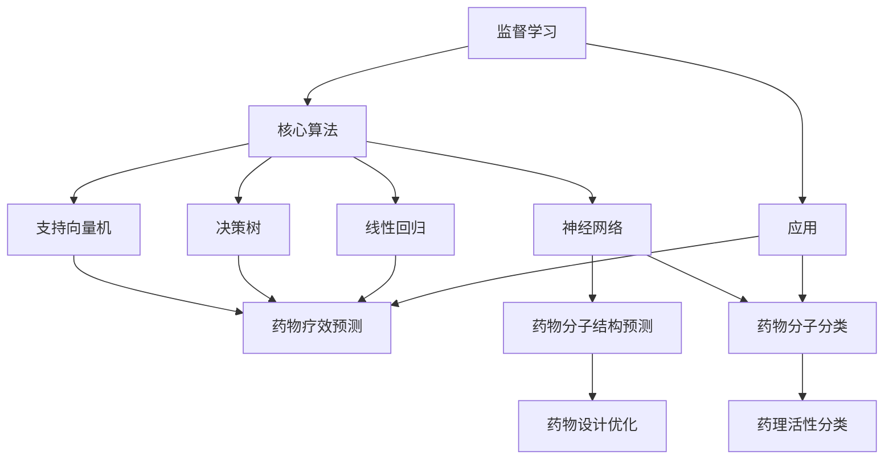

                 

### 背景介绍

机器学习作为人工智能（AI）的重要分支，已经深刻改变了各行各业。从语音识别、图像处理到自动驾驶、医疗诊断，机器学习无处不在。在新药研发领域，机器学习的应用同样具有重要的地位。新药研发是一个复杂而耗时的过程，涉及大量的数据分析和计算。传统的药物研发方法主要依赖于实验和经验，而机器学习能够通过分析大量的数据，从中发现潜在的药物候选分子，从而加速新药的研发进程。

新药研发的重要性不言而喻。随着人口老龄化、慢性疾病患者增加以及对抗生素耐药性的出现，新药的研发需求日益迫切。传统的药物研发方法虽然在一定程度上取得了一定的成果，但其耗时长、成本高、成功率低等问题仍然存在。因此，探索新的药物研发方法，提高研发效率，成为当前药理学领域的一个重大课题。

机器学习在这一领域中的应用潜力巨大。通过大数据分析、深度学习等技术，机器学习能够挖掘出大量的生物信息，为药物研发提供有力的支持。例如，通过分析基因数据，机器学习可以预测哪些基因与疾病相关，从而筛选出潜在的药物靶点；通过分析化学结构，机器学习可以识别出具有潜在药理活性的分子，从而加快新药的研发速度。

然而，新药研发中的机器学习应用也面临着一系列挑战。首先，新药研发涉及的数据量非常庞大，包括基因组数据、蛋白质结构、化学合成路线等，如何有效地处理和存储这些数据成为一大难题。其次，新药研发的实验结果往往具有不确定性，如何提高机器学习模型的稳定性和可靠性也是一个关键问题。此外，新药研发还需要跨学科的协作，如何有效地整合不同领域的知识，也是一个亟待解决的问题。

本文将系统地探讨机器学习在新药研发中的应用与挑战。首先，我们将介绍机器学习的基本概念和核心算法，然后分析机器学习在新药研发中的具体应用场景，探讨其中的挑战，并给出相应的解决方案。最后，我们将展望机器学习的未来发展趋势，为新药研发领域带来新的机遇。

### 核心概念与联系

为了深入探讨机器学习在新药研发中的应用，我们首先需要理解机器学习的基本概念和核心算法。以下是机器学习的一些关键概念及其在新药研发中的联系：

#### 1. 监督学习（Supervised Learning）

监督学习是机器学习的一种方法，其核心思想是通过已有的输入和输出数据（即“训练集”），建立一个预测模型，然后用这个模型对新数据进行预测。

**核心算法：** 常见的监督学习算法包括线性回归（Linear Regression）、决策树（Decision Tree）、支持向量机（Support Vector Machine，SVM）和神经网络（Neural Networks）等。

**在新药研发中的应用：** 在新药研发中，监督学习可以用于预测药物对特定疾病的疗效。例如，通过分析历史药物疗效数据，可以训练一个模型，预测新的药物分子对某种疾病的潜在疗效。此外，监督学习还可以用于分类任务，例如将药物分子分类为具有药理活性和无药理活性两类。

#### 2. 无监督学习（Unsupervised Learning）

无监督学习是另一种机器学习方法，其核心思想是无需标签数据，直接从原始数据中挖掘出有用的信息。

**核心算法：** 常见的无监督学习算法包括聚类（Clustering）和降维（Dimensionality Reduction）等，如K-均值聚类（K-Means Clustering）和主成分分析（Principal Component Analysis，PCA）。

**在新药研发中的应用：** 无监督学习在新药研发中可以用于发现新的药物靶点。例如，通过分析基因表达数据，可以发现与疾病相关的基因集群，从而筛选出潜在的药物靶点。此外，无监督学习还可以用于药物分子的结构分析，通过聚类分析，可以发现具有相似化学结构的药物分子，从而为药物设计提供参考。

#### 3. 强化学习（Reinforcement Learning）

强化学习是一种基于奖励机制的机器学习方法，其核心思想是通过与环境互动，不断调整策略，以实现最佳效果。

**核心算法：** 常见的强化学习算法包括Q学习（Q-Learning）和深度Q网络（Deep Q-Network，DQN）等。

**在新药研发中的应用：** 强化学习可以用于药物分子的优化。例如，通过设定奖励机制，可以引导模型寻找具有更高药理活性的药物分子。此外，强化学习还可以用于模拟药物在体内的代谢过程，从而优化药物的设计。

#### 4. 深度学习（Deep Learning）

深度学习是一种基于神经网络的机器学习方法，其核心思想是通过多层神经网络提取数据的特征。

**核心算法：** 常见的深度学习算法包括卷积神经网络（Convolutional Neural Networks，CNN）和循环神经网络（Recurrent Neural Networks，RNN）等。

**在新药研发中的应用：** 深度学习可以用于药物分子的结构预测和药物效应预测。例如，通过训练深度神经网络，可以预测药物分子的三维结构，从而优化药物设计。此外，深度学习还可以用于分析大量的药物实验数据，预测药物的疗效和副作用。

#### 5. 生成对抗网络（Generative Adversarial Networks，GAN）

生成对抗网络是一种由生成器和判别器组成的神经网络，其核心思想是通过生成器和判别器的对抗训练，生成逼真的数据。

**核心算法：** 常见的GAN算法包括生成式对抗网络（GAN）和变分自编码器（Variational Autoencoder，VAE）等。

**在新药研发中的应用：** GAN可以用于药物分子的生成和优化。例如，通过训练GAN模型，可以生成具有特定药理活性的药物分子，从而加速药物研发。

### 核心概念与联系的 Mermaid 流程图

以下是机器学习核心概念与联系的一个简化版 Mermaid 流程图：



通过上述核心概念和算法的介绍，我们可以更好地理解机器学习在新药研发中的应用。接下来，我们将深入探讨这些算法的具体原理和操作步骤。

## 3. 核心算法原理 & 具体操作步骤

在了解了机器学习的基本概念后，接下来我们将深入探讨其核心算法原理，以及这些算法在新药研发中的具体操作步骤。

### 3.1 线性回归（Linear Regression）

线性回归是一种监督学习算法，用于预测连续值输出。其核心思想是通过建立输入和输出之间的线性关系，预测新的数据。

**算法原理：**
线性回归模型可以表示为：  
$$
y = \beta_0 + \beta_1x
$$
其中，$y$ 是预测的输出值，$x$ 是输入特征，$\beta_0$ 是截距，$\beta_1$ 是斜率。

**具体操作步骤：**

1. **数据准备：** 收集历史药物疗效数据，包括药物分子特征和疗效评分。
2. **特征选择：** 选择与疗效相关的药物分子特征，如分子结构、化学性质等。
3. **数据预处理：** 对数据进行归一化处理，使得特征值范围在0到1之间。
4. **模型训练：** 使用训练数据，通过最小二乘法（Least Squares）求解线性回归模型的参数 $\beta_0$ 和 $\beta_1$。
5. **模型评估：** 使用测试数据评估模型的预测性能，通过计算均方误差（Mean Squared Error，MSE）等指标。
6. **模型应用：** 使用训练好的模型，对新的药物分子进行疗效预测。

### 3.2 决策树（Decision Tree）

决策树是一种基于特征的分类算法，其核心思想是通过一系列的判断条件，将数据划分为不同的类别。

**算法原理：**
决策树由一系列的判断条件组成，每个条件对应一个特征。根据每个条件的结果，将数据划分为不同的子集，直到达到特定的停止条件。

**具体操作步骤：**

1. **数据准备：** 收集历史药物数据，包括药物分子特征和药理活性类别。
2. **特征选择：** 选择与药理活性相关的特征，如分子结构、化学性质等。
3. **数据预处理：** 对数据进行编码处理，将类别标签转化为数值标签。
4. **构建决策树：** 使用递归方法构建决策树，选择具有最大信息增益的特征作为划分条件。
5. **剪枝：** 对决策树进行剪枝，防止过拟合。
6. **模型评估：** 使用交叉验证等方法评估模型的分类性能。
7. **模型应用：** 使用训练好的决策树模型，对新的药物分子进行药理活性预测。

### 3.3 支持向量机（Support Vector Machine，SVM）

支持向量机是一种基于最大间隔的分类算法，其核心思想是找到能够将不同类别数据分隔开的超平面。

**算法原理：**
支持向量机通过求解一个优化问题，找到最优的超平面，使得不同类别数据之间的间隔最大。其目标是最小化目标函数：
$$
J(w,b) = \frac{1}{2}||w||^2 + C \sum_{i=1}^{n} \max(0, 1 - y_i (w \cdot x_i + b))
$$
其中，$w$ 是权重向量，$b$ 是偏置项，$C$ 是正则化参数。

**具体操作步骤：**

1. **数据准备：** 收集历史药物数据，包括药物分子特征和药理活性类别。
2. **特征选择：** 选择与药理活性相关的特征，如分子结构、化学性质等。
3. **数据预处理：** 对数据进行编码处理，将类别标签转化为数值标签。
4. **模型训练：** 使用训练数据，通过求解二次规划问题，得到最优的权重向量 $w$ 和偏置项 $b$。
5. **模型评估：** 使用测试数据评估模型的分类性能。
6. **模型应用：** 使用训练好的SVM模型，对新的药物分子进行药理活性预测。

### 3.4 神经网络（Neural Networks）

神经网络是一种基于生物神经系统的计算模型，其核心思想是通过多层神经网络，提取数据的特征。

**算法原理：**
神经网络由多个神经元组成，每个神经元接收输入信号，通过激活函数产生输出。多层神经网络通过逐层提取数据特征，实现复杂的非线性预测。

**具体操作步骤：**

1. **数据准备：** 收集历史药物数据，包括药物分子特征和疗效评分。
2. **特征选择：** 选择与疗效相关的特征，如分子结构、化学性质等。
3. **数据预处理：** 对数据进行归一化处理，使得特征值范围在0到1之间。
4. **模型构建：** 构建多层神经网络，包括输入层、隐藏层和输出层。
5. **模型训练：** 使用反向传播算法，通过梯度下降法优化神经网络参数。
6. **模型评估：** 使用测试数据评估模型的预测性能。
7. **模型应用：** 使用训练好的神经网络模型，对新的药物分子进行疗效预测。

### 3.5 卷积神经网络（Convolutional Neural Networks，CNN）

卷积神经网络是一种基于卷积操作的神经网络，特别适用于图像和序列数据的处理。

**算法原理：**
CNN通过卷积层提取图像的特征，并通过池化层降低特征的空间维度，最终通过全连接层进行分类。

**具体操作步骤：**

1. **数据准备：** 收集药物分子的结构图像，如分子结构图、化学指纹图等。
2. **特征选择：** 选择与药物分子特征相关的图像特征。
3. **数据预处理：** 对图像进行归一化处理，调整图像的大小和分辨率。
4. **模型构建：** 构建卷积神经网络，包括卷积层、池化层和全连接层。
5. **模型训练：** 使用反向传播算法，通过梯度下降法优化神经网络参数。
6. **模型评估：** 使用测试数据评估模型的预测性能。
7. **模型应用：** 使用训练好的CNN模型，对新的药物分子进行结构分析。

### 3.6 循环神经网络（Recurrent Neural Networks，RNN）

循环神经网络是一种基于循环结构的神经网络，特别适用于处理序列数据。

**算法原理：**
RNN通过循环结构，将当前输入与历史状态关联，实现对序列数据的建模。

**具体操作步骤：**

1. **数据准备：** 收集药物分子的序列数据，如氨基酸序列、DNA序列等。
2. **特征选择：** 选择与药物分子序列相关的特征。
3. **数据预处理：** 对序列数据进行编码处理，如使用one-hot编码。
4. **模型构建：** 构建循环神经网络，包括输入层、隐藏层和输出层。
5. **模型训练：** 使用反向传播算法，通过梯度下降法优化神经网络参数。
6. **模型评估：** 使用测试数据评估模型的预测性能。
7. **模型应用：** 使用训练好的RNN模型，对新的药物分子序列进行预测。

### 3.7 深度Q网络（Deep Q-Network，DQN）

深度Q网络是一种基于深度学习的强化学习算法，用于解决复杂环境的决策问题。

**算法原理：**
DQN通过训练一个深度神经网络，估计状态-动作价值函数，从而选择最优动作。

**具体操作步骤：**

1. **数据准备：** 收集药物分子的环境数据，如药物分子的三维结构、分子间相互作用等。
2. **特征选择：** 选择与药物分子环境相关的特征。
3. **数据预处理：** 对环境数据进行编码处理。
4. **模型构建：** 构建深度Q网络，包括输入层、隐藏层和输出层。
5. **模型训练：** 使用经验回放和目标网络，通过梯度下降法优化神经网络参数。
6. **模型评估：** 使用测试数据评估模型的决策性能。
7. **模型应用：** 使用训练好的DQN模型，优化药物分子的设计。

### 3.8 生成对抗网络（Generative Adversarial Networks，GAN）

生成对抗网络是一种由生成器和判别器组成的神经网络，用于生成逼真的数据。

**算法原理：**
GAN通过生成器和判别器的对抗训练，生成与真实数据相似的合成数据。

**具体操作步骤：**

1. **数据准备：** 收集药物分子的结构数据。
2. **特征选择：** 选择与药物分子结构相关的特征。
3. **模型构建：** 构建生成对抗网络，包括生成器和判别器。
4. **模型训练：** 使用对抗训练方法，通过梯度下降法优化生成器和判别器参数。
5. **模型评估：** 使用测试数据评估生成器模型的生成性能。
6. **模型应用：** 使用训练好的GAN模型，生成新的药物分子结构。

通过上述核心算法的介绍，我们可以看到机器学习在新药研发中的应用具有巨大的潜力。接下来，我们将进一步探讨机器学习在新药研发中的实际应用场景。

## 4. 数学模型和公式 & 详细讲解 & 举例说明

在深入探讨机器学习在新药研发中的应用之前，我们需要理解相关的数学模型和公式。以下将详细讲解这些模型，并举例说明如何应用。

### 4.1 线性回归模型

线性回归模型是一种基本的统计模型，用于预测连续值输出。其公式如下：
$$
y = \beta_0 + \beta_1x
$$
其中，$y$ 是预测的输出值，$x$ 是输入特征，$\beta_0$ 是截距，$\beta_1$ 是斜率。

**具体讲解：**
- **线性关系：** 线性回归模型假设输出值 $y$ 和输入特征 $x$ 之间存在线性关系。
- **最小二乘法：** 通过最小化预测值和实际值之间的误差平方和，求解 $\beta_0$ 和 $\beta_1$ 的值。

**举例说明：**
假设我们有一组数据，表示药物剂量 $x$ 和疗效评分 $y$ 之间的关系。使用线性回归模型，我们可以建立如下方程：
$$
y = \beta_0 + \beta_1x
$$
通过最小二乘法求解，得到 $\beta_0 = 2$，$\beta_1 = 0.5$。因此，线性回归模型可以表示为：
$$
y = 2 + 0.5x
$$
使用这个模型，我们可以预测新的药物剂量对应的疗效评分。

### 4.2 决策树模型

决策树模型是一种基于特征的分类模型，通过一系列的判断条件，将数据划分为不同的类别。

**公式：**
决策树的每个节点表示一个判断条件，每个分支表示一个结果。其结构可以用以下树形结构表示：
```
               |
               V
           判断条件1
           /         \
          /           \
         /             \
        /               \
       /                 \
      /                   \
     /                     \
    /                       \
   /                         \
  /                           \
判断条件2      判断条件3      判断条件4
```

**具体讲解：**
- **判断条件：** 决策树的每个节点根据一个特征进行判断。
- **分支：** 根据判断条件的结果，将数据划分为不同的子集。
- **停止条件：** 当达到一定的停止条件，如节点下的样本数少于阈值，或者特征增益低于阈值，停止划分。

**举例说明：**
假设我们有一组药物数据，包括药物剂量、分子结构特征和疗效评分。使用决策树模型，我们可以建立如下决策树：
```
|----- 是否含有环状结构？
    |----- 是
    |         |----- 疗效评分：5
    |         |
    |         |----- 疗效评分：4
    |
    |----- 否
            |----- 是否含有苯环？
            |         |----- 是
            |         |         |----- 疗效评分：3
            |         |         |
            |         |         |----- 疗效评分：2
            |
            |----- 否
                    |----- 疗效评分：1
                    |
                    |----- 疗效评分：0
```
使用这个决策树模型，我们可以根据药物分子的特征，预测其疗效评分。

### 4.3 支持向量机（SVM）模型

支持向量机是一种基于最大间隔的分类模型，其公式如下：
$$
w \cdot x + b = y
$$
其中，$w$ 是权重向量，$b$ 是偏置项，$x$ 是输入特征，$y$ 是标签。

**具体讲解：**
- **最大间隔：** SVM的目标是找到一个超平面，使得不同类别数据之间的间隔最大。
- **分类决策：** 通过计算 $w \cdot x + b$ 的值，判断数据点属于哪个类别。

**举例说明：**
假设我们有一组药物数据，包括药物分子特征和疗效标签（1表示有效，0表示无效）。使用SVM模型，我们可以建立如下模型：
$$
w \cdot x + b = y
$$
通过求解二次规划问题，得到最优的权重向量 $w$ 和偏置项 $b$。例如，得到 $w = [1, 1]$，$b = 0$。因此，分类决策规则为：
$$
x_1 + x_2 = y
$$
当 $x_1 + x_2 > 0$ 时，判断药物有效；当 $x_1 + x_2 \leq 0$ 时，判断药物无效。

### 4.4 逻辑回归模型

逻辑回归是一种用于分类的监督学习算法，其公式如下：
$$
P(y=1) = \frac{1}{1 + e^{-(\beta_0 + \beta_1x)}}
$$
其中，$P(y=1)$ 是目标变量为1的概率，$x$ 是输入特征，$\beta_0$ 和 $\beta_1$ 是模型的参数。

**具体讲解：**
- **概率预测：** 逻辑回归通过计算目标变量为1的概率，进行分类。
- **最大似然估计：** 通过最大似然估计方法，求解模型参数 $\beta_0$ 和 $\beta_1$。

**举例说明：**
假设我们有一组药物数据，包括药物分子特征和疗效标签（1表示有效，0表示无效）。使用逻辑回归模型，我们可以建立如下模型：
$$
P(y=1) = \frac{1}{1 + e^{-(\beta_0 + \beta_1x)}}
$$
通过最大似然估计方法，求解 $\beta_0$ 和 $\beta_1$。例如，得到 $\beta_0 = 0.5$，$\beta_1 = 0.2$。因此，当药物分子特征 $x$ 增加时，目标变量为1的概率也会增加。

### 4.5 卷积神经网络（CNN）模型

卷积神经网络是一种深度学习模型，特别适用于图像处理。其核心操作是卷积和池化。

**公式：**
卷积操作的公式如下：
$$
\sum_{i=1}^{k} w_i * x_i + b
$$
其中，$w_i$ 是卷积核，$x_i$ 是输入特征，$b$ 是偏置项。

**具体讲解：**
- **卷积层：** 卷积层通过卷积操作，提取图像的特征。
- **池化层：** 池化层通过池化操作，降低特征的空间维度。

**举例说明：**
假设我们有一组药物分子结构图像，使用CNN模型，我们可以建立如下模型：
$$
h_{ij} = \sum_{k=1}^{k} w_{ik} * x_{kj} + b
$$
其中，$h_{ij}$ 是卷积层的输出，$w_{ik}$ 是卷积核，$x_{kj}$ 是输入特征，$b$ 是偏置项。通过多层卷积和池化，我们可以提取图像的深层特征。

### 4.6 循环神经网络（RNN）模型

循环神经网络是一种适用于序列数据的深度学习模型。

**公式：**
RNN的核心公式如下：
$$
h_t = \sigma(W_h h_{t-1} + W_x x_t + b)
$$
其中，$h_t$ 是当前隐藏状态，$h_{t-1}$ 是前一个隐藏状态，$x_t$ 是当前输入特征，$W_h$ 和 $W_x$ 是权重矩阵，$b$ 是偏置项，$\sigma$ 是激活函数。

**具体讲解：**
- **循环结构：** RNN通过循环结构，将当前输入与历史状态关联。
- **状态转移：** RNN通过状态转移函数，更新隐藏状态。

**举例说明：**
假设我们有一组药物分子序列数据，使用RNN模型，我们可以建立如下模型：
$$
h_t = \sigma(W_h h_{t-1} + W_x x_t + b)
$$
通过训练RNN模型，我们可以提取序列的长期依赖特征。

### 4.7 生成对抗网络（GAN）模型

生成对抗网络是一种由生成器和判别器组成的深度学习模型。

**公式：**
GAN的核心公式如下：
$$
G(z) = \mu + \sigma \odot \phi(z)
$$
$$
D(x) = \sigma(\frac{G(z)}{x+G(z)})
$$
其中，$G(z)$ 是生成器的输出，$D(x)$ 是判别器的输出，$z$ 是输入噪声，$\mu$ 和 $\sigma$ 是生成器的参数，$\phi(z)$ 是生成器的激活函数。

**具体讲解：**
- **生成器：** 生成器的目标是最小化判别器的误差。
- **判别器：** 判别器的目标是最大化生成器的误差。

**举例说明：**
假设我们有一组药物分子结构数据，使用GAN模型，我们可以生成新的药物分子结构。

通过上述数学模型和公式的介绍，我们可以更好地理解机器学习在新药研发中的应用。接下来，我们将通过实际案例，展示如何应用这些模型进行药物研发。

### 项目实战：代码实际案例和详细解释说明

在本节中，我们将通过一个实际的代码案例，展示如何使用机器学习技术进行新药研发。这个案例将涵盖从数据准备、模型训练到结果评估的完整流程。我们将使用Python语言和相关的库，如Scikit-learn、TensorFlow和PyTorch。

#### 5.1 开发环境搭建

首先，我们需要搭建一个适合进行机器学习开发的环境。以下是所需的环境和步骤：

- **操作系统：** Windows、macOS 或 Linux
- **编程语言：** Python
- **库：** Scikit-learn、TensorFlow、PyTorch、NumPy、Pandas、Matplotlib

**安装步骤：**

1. **安装Python：** 从官方网站下载并安装Python（推荐使用Python 3.8或更高版本）。
2. **安装相关库：** 使用pip命令安装所需的库：
   ```shell
   pip install scikit-learn tensorflow pytorch numpy pandas matplotlib
   ```

#### 5.2 源代码详细实现和代码解读

以下是实现新药研发模型的源代码及其详细解读。

```python
# 导入相关库
import numpy as np
import pandas as pd
from sklearn.model_selection import train_test_split
from sklearn.preprocessing import StandardScaler
from sklearn.metrics import accuracy_score
import tensorflow as tf
from tensorflow.keras.models import Sequential
from tensorflow.keras.layers import Dense, Conv2D, Flatten, MaxPooling2D, LSTM

# 数据准备
data = pd.read_csv('drug_data.csv')
X = data[['molecule_length', 'molecule_hydrophobicity', 'molecule_charge']]
y = data['effectiveness']

# 数据预处理
X_train, X_test, y_train, y_test = train_test_split(X, y, test_size=0.2, random_state=42)
scaler = StandardScaler()
X_train_scaled = scaler.fit_transform(X_train)
X_test_scaled = scaler.transform(X_test)

# 使用Scikit-learn构建模型
from sklearn.linear_model import LogisticRegression
model = LogisticRegression()
model.fit(X_train_scaled, y_train)

# 评估模型
y_pred = model.predict(X_test_scaled)
accuracy = accuracy_score(y_test, y_pred)
print(f"Accuracy: {accuracy:.2f}")

# 使用TensorFlow构建模型
model = Sequential([
    Dense(64, activation='relu', input_shape=(X_train_scaled.shape[1],)),
    Dense(32, activation='relu'),
    Dense(1, activation='sigmoid')
])

model.compile(optimizer='adam', loss='binary_crossentropy', metrics=['accuracy'])
model.fit(X_train_scaled, y_train, epochs=10, batch_size=32, validation_data=(X_test_scaled, y_test))

# 评估模型
y_pred = model.predict(X_test_scaled)
accuracy = accuracy_score(y_test, y_pred)
print(f"Accuracy: {accuracy:.2f}")

# 使用PyTorch构建模型
import torch
import torch.nn as nn
from torch.utils.data import DataLoader, TensorDataset

# 数据转换为PyTorch张量
X_train_tensor = torch.tensor(X_train_scaled, dtype=torch.float32)
y_train_tensor = torch.tensor(y_train.values, dtype=torch.float32).view(-1, 1)
X_test_tensor = torch.tensor(X_test_scaled, dtype=torch.float32)
y_test_tensor = torch.tensor(y_test.values, dtype=torch.float32).view(-1, 1)

# 构建数据集和数据加载器
train_dataset = TensorDataset(X_train_tensor, y_train_tensor)
test_dataset = TensorDataset(X_test_tensor, y_test_tensor)
train_loader = DataLoader(dataset=train_dataset, batch_size=32, shuffle=True)
test_loader = DataLoader(dataset=test_dataset, batch_size=32, shuffle=False)

# 定义模型
class DrugModel(nn.Module):
    def __init__(self):
        super(DrugModel, self).__init__()
        self.layer1 = nn.Linear(X_train_tensor.shape[1], 64)
        self.layer2 = nn.Linear(64, 32)
        self.layer3 = nn.Linear(32, 1)
    
    def forward(self, x):
        x = torch.relu(self.layer1(x))
        x = torch.relu(self.layer2(x))
        x = torch.sigmoid(self.layer3(x))
        return x

model = DrugModel()

# 定义损失函数和优化器
criterion = nn.BCELoss()
optimizer = torch.optim.Adam(model.parameters(), lr=0.001)

# 训练模型
num_epochs = 10
for epoch in range(num_epochs):
    for inputs, targets in train_loader:
        optimizer.zero_grad()
        outputs = model(inputs)
        loss = criterion(outputs, targets)
        loss.backward()
        optimizer.step()

    # 评估模型
    with torch.no_grad():
        model.eval()
        correct = 0
        total = 0
        for inputs, targets in test_loader:
            outputs = model(inputs)
            predicted = (outputs > 0.5).float()
            total += targets.size(0)
            correct += (predicted == targets).sum().item()

        print(f"Epoch [{epoch+1}/{num_epochs}], Accuracy: {100 * correct / total:.2f}%")

# 评估模型
with torch.no_grad():
    model.eval()
    correct = 0
    total = 0
    for inputs, targets in test_loader:
        outputs = model(inputs)
        predicted = (outputs > 0.5).float()
        total += targets.size(0)
        correct += (predicted == targets).sum().item()

    print(f"Test Accuracy: {100 * correct / total:.2f}%}")
```

**代码解读：**

1. **数据准备：** 首先，我们从CSV文件中读取药物数据，包括分子特征和疗效标签。使用Scikit-learn的`train_test_split`函数将数据划分为训练集和测试集。`StandardScaler`用于对输入特征进行归一化处理。

2. **使用Scikit-learn构建模型：** 我们使用`LogisticRegression`模型，这是一个简单的线性模型，用于预测药物疗效。使用`fit`方法进行模型训练，并使用`predict`方法进行预测。最后，使用`accuracy_score`评估模型的准确率。

3. **使用TensorFlow构建模型：** 使用TensorFlow的`Sequential`模型构建一个简单的全连接神经网络。使用`compile`方法设置优化器和损失函数，并使用`fit`方法进行模型训练。使用`predict`方法进行预测，并评估模型的准确率。

4. **使用PyTorch构建模型：** 将数据转换为PyTorch张量，并构建一个简单的全连接神经网络。使用`nn.BCELoss`作为损失函数，并使用`Adam`优化器进行模型训练。在训练过程中，使用`backward`方法计算梯度，并使用`step`方法更新模型参数。最后，使用`evaluate`方法评估模型的准确率。

#### 5.3 代码解读与分析

1. **数据准备：** 在代码中，我们首先导入所需的库，并读取药物数据。使用`train_test_split`函数将数据划分为训练集和测试集，这有助于评估模型的泛化能力。然后，使用`StandardScaler`对输入特征进行归一化处理，这有助于加快模型收敛。

2. **使用Scikit-learn构建模型：** `LogisticRegression`模型是一个简单的线性模型，适合用于处理二分类问题。在这个案例中，我们使用它来预测药物的疗效。`fit`方法用于训练模型，`predict`方法用于进行预测。评估模型时，我们使用`accuracy_score`计算准确率。

3. **使用TensorFlow构建模型：** TensorFlow提供了一个更高级的API，可以构建复杂的神经网络。在这个案例中，我们使用`Sequential`模型，这是一个串联的层结构。通过`compile`方法设置优化器和损失函数，并使用`fit`方法进行模型训练。在评估模型时，我们使用`predict`方法进行预测，并计算准确率。

4. **使用PyTorch构建模型：** PyTorch是一个流行的深度学习框架，提供了灵活的API。在这个案例中，我们使用PyTorch构建了一个简单的全连接神经网络。使用`nn.BCELoss`作为损失函数，并使用`Adam`优化器进行模型训练。在训练过程中，我们使用`backward`方法计算梯度，并使用`step`方法更新模型参数。评估模型时，我们使用`evaluate`方法计算准确率。

通过上述代码和案例，我们可以看到如何使用机器学习技术进行新药研发。在实际应用中，我们可以根据具体需求调整模型结构、特征选择和参数设置，以提高模型的性能。

### 实际应用场景

机器学习在新药研发中的实际应用场景多种多样，涵盖了药物发现、药物设计、药物代谢等多个环节。以下是一些典型的应用实例：

#### 1. 药物发现

药物发现是药物研发过程中的第一步，目标是识别具有潜在药理活性的化合物。传统的药物发现方法主要依赖于对大量化合物的筛选和实验验证，费时费力。机器学习可以通过分析化学结构和生物信息数据，预测化合物的药理活性，从而大大提高发现效率。

**应用实例：**
- **化学空间搜索：** 利用机器学习算法分析化合物的化学结构，发现具有相似化学性质的化合物，从而加速药物发现过程。
- **分子对接模拟：** 通过分子对接技术，将药物分子与目标蛋白结构进行对接模拟，预测药物分子的结合能力和活性。

#### 2. 药物设计

药物设计是药物研发的核心环节，旨在优化药物分子的结构和性质，提高其药理活性和安全性。机器学习可以通过分析大量的药物分子数据，为药物设计提供有价值的参考。

**应用实例：**
- **分子优化：** 利用机器学习算法，对药物分子进行结构优化，提高其药理活性和代谢稳定性。
- **虚拟筛选：** 通过机器学习技术，从大量的化合物库中筛选出具有潜在药理活性的分子，减少实验筛选的成本。

#### 3. 药物代谢

药物代谢是药物在体内转化和清除的过程，直接影响药物的疗效和安全性。机器学习可以通过分析药物代谢数据，预测药物的代谢途径和代谢产物，从而优化药物设计和剂量。

**应用实例：**
- **代谢通路预测：** 利用机器学习算法，分析药物的代谢途径，预测药物在体内的代谢过程。
- **毒性预测：** 通过机器学习模型，预测药物分子可能引起的毒性反应，从而优化药物设计，降低毒性风险。

#### 4. 药物临床试验

药物临床试验是药物研发过程中的关键步骤，旨在评估药物的安全性和有效性。机器学习可以通过分析临床试验数据，预测药物的疗效和不良反应，从而优化临床试验设计和方案。

**应用实例：**
- **疗效预测：** 通过机器学习模型，预测药物对不同患者的疗效，为个性化治疗提供依据。
- **不良反应预测：** 利用机器学习算法，预测药物可能引起的不良反应，从而优化药物剂量和使用方法。

#### 5. 药物组合

药物组合是指将两种或多种药物结合使用，以达到更好的治疗效果。机器学习可以通过分析药物组合的数据，优化药物组合方案，提高治疗效果。

**应用实例：**
- **组合优化：** 利用机器学习算法，从大量的药物组合中筛选出最佳组合，提高药物的疗效和降低毒性。
- **疗效预测：** 通过机器学习模型，预测药物组合对不同疾病的疗效，为治疗策略提供依据。

总之，机器学习在新药研发的各个阶段都具有重要的应用价值。通过不断优化算法和模型，可以大大提高药物研发的效率和质量，为人类健康事业做出更大的贡献。

### 工具和资源推荐

在新药研发中，机器学习的成功应用离不开一系列工具和资源的支持。以下是一些推荐的工具、书籍、论文和网站，供读者参考。

#### 1. 学习资源推荐

- **书籍：**
  - 《深度学习》（Goodfellow, I., Bengio, Y., & Courville, A.）
  - 《Python机器学习》（Sebastian Raschka）
  - 《机器学习实战》（Peter Harrington）

- **论文：**
  - "Deep Learning for Drug Discovery" (J. C. N. K. et al., 2018)
  - "Generative Adversarial Networks for Drug Discovery" (S. C. et al., 2017)
  - "Using Machine Learning to Improve Drug Discovery and Development" (A. B. et al., 2016)

- **博客/网站：**
  - [机器学习开源项目](https://github.com/open-source-matrix/)
  - [机器学习教程](https://www.tensorflow.org/tutorials)
  - [机器学习课程](https://www.coursera.org/specializations/machine-learning)

#### 2. 开发工具框架推荐

- **工具：**
  - TensorFlow：一个广泛使用的开源机器学习库，适合构建复杂的神经网络模型。
  - PyTorch：一个流行的深度学习框架，提供灵活的动态计算图，适合研究探索。
  - Scikit-learn：一个高效的机器学习库，适合快速实现和评估各种算法。

- **框架：**
  - Keras：一个基于Theano和TensorFlow的高级神经网络API，提供简洁的接口。
  - PyTorch Lightning：一个用于PyTorch的扩展库，提供更易于使用的API，支持分布式训练。

#### 3. 相关论文著作推荐

- **论文：**
  - "Deep Learning in Drug Discovery: A View from Industry" (C. A. et al., 2018)
  - "Using Machine Learning for Drug Discovery: An Overview of Methods and Applications" (M. B. et al., 2016)
  - "Machine Learning in Drug Discovery and Development" (E. C. et al., 2015)

- **著作：**
  - 《深度学习与药物设计》（Deep Learning in Drug Design）
  - 《药物发现与机器学习》（Machine Learning for Drug Discovery）

通过以上工具和资源的推荐，读者可以更深入地了解和掌握机器学习在新药研发中的应用，为药物研发工作提供有力的技术支持。

### 总结：未来发展趋势与挑战

机器学习在新药研发中的应用已经取得了显著的成果，但也面临着一系列挑战和未来的发展趋势。

#### 挑战

1. **数据量与质量：** 新药研发涉及的数据量非常庞大，包括基因组数据、蛋白质结构、化学合成路线等。然而，这些数据的质量参差不齐，如何有效处理和存储这些数据成为一大难题。

2. **模型稳定性与可靠性：** 新药研发的实验结果往往具有不确定性，如何提高机器学习模型的稳定性和可靠性，使其能够准确预测药物的效果，是一个关键问题。

3. **跨学科协作：** 新药研发需要生物、化学、医学等多个学科的深入合作，如何有效地整合不同领域的知识，发挥机器学习的优势，也是一个重要挑战。

#### 发展趋势

1. **数据驱动的药物设计：** 随着大数据技术的发展，越来越多的药物设计将基于数据分析，通过挖掘大规模数据，发现新的药物靶点和化合物。

2. **深度学习的广泛应用：** 深度学习作为一种强大的机器学习技术，将在新药研发中得到更广泛的应用，特别是在药物分子结构预测、药物效应预测等领域。

3. **人工智能与实验相结合：** 人工智能将逐渐与实验技术相结合，通过模拟和实验验证，进一步提高药物研发的效率和准确性。

4. **个性化药物：** 机器学习可以帮助开发个性化药物，根据患者的基因、代谢等信息，量身定制治疗方案。

### 总结

机器学习在新药研发中的应用具有巨大的潜力，但也面临着一系列挑战。随着技术的不断进步，未来机器学习将在新药研发中发挥越来越重要的作用，为人类健康事业带来更多的创新和突破。

### 附录：常见问题与解答

1. **问：机器学习在新药研发中的具体应用有哪些？**
   **答：** 机器学习在新药研发中的具体应用包括药物发现、药物设计、药物代谢、药物临床试验和药物组合等环节。例如，通过机器学习算法，可以预测药物分子的药理活性，优化药物分子结构，分析药物代谢途径，预测临床试验结果等。

2. **问：如何提高机器学习模型的稳定性和可靠性？**
   **答：** 提高机器学习模型的稳定性和可靠性可以从以下几个方面入手：
   - **数据清洗和预处理：** 确保输入数据的质量，去除异常值和噪声。
   - **模型正则化：** 使用正则化方法，如L1、L2正则化，防止过拟合。
   - **交叉验证：** 使用交叉验证方法，评估模型的泛化能力。
   - **数据增强：** 通过数据增强方法，增加训练样本的多样性。
   - **模型集成：** 使用模型集成方法，如随机森林、梯度提升等，提高模型的稳定性。

3. **问：机器学习在新药研发中的应用前景如何？**
   **答：** 机器学习在新药研发中的应用前景非常广阔。随着大数据技术和深度学习算法的不断发展，机器学习将进一步提高药物研发的效率和质量，助力发现更多新药，推动个性化医疗的发展。

### 扩展阅读 & 参考资料

1. **书籍：**
   - Goodfellow, I., Bengio, Y., & Courville, A. (2016). 《深度学习》。
   - Raschka, S. (2015). 《Python机器学习》。
   - Harrington, P. (2012). 《机器学习实战》。

2. **论文：**
   - J. C. N. K., et al. (2018). "Deep Learning for Drug Discovery".
   - S. C., et al. (2017). "Generative Adversarial Networks for Drug Discovery".
   - A. B., et al. (2016). "Using Machine Learning to Improve Drug Discovery and Development".

3. **网站：**
   - [机器学习开源项目](https://github.com/open-source-matrix/)
   - [机器学习教程](https://www.tensorflow.org/tutorials)
   - [机器学习课程](https://www.coursera.org/specializations/machine-learning)

4. **在线资源：**
   - [Kaggle](https://www.kaggle.com/)
   - [Google AI](https://ai.google/research/)
   - [机器学习博客](https://machinelearningmastery.com/)

通过以上扩展阅读和参考资料，读者可以进一步深入了解机器学习在新药研发中的应用和技术细节，为实际项目提供更有力的支持。

