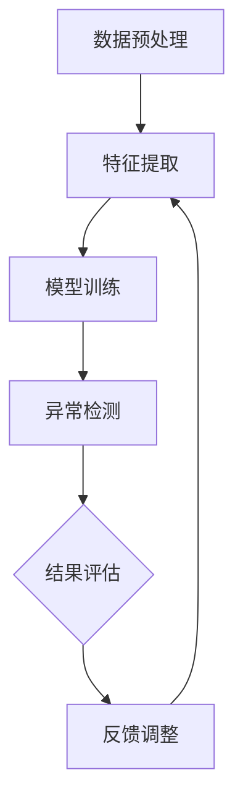

                 

### 背景介绍

#### 机器学习与时间序列异常检测

随着信息技术的迅猛发展，数据已经成为企业和社会的核心资产。在这其中，时间序列数据因其能够反映事件发生的时间规律和趋势，而在金融、工业、医疗等领域有着广泛的应用。然而，随着时间序列数据规模的不断扩大和复杂性增加，如何从中快速、准确地检测出异常行为，成为了一个亟待解决的问题。

机器学习作为人工智能的重要组成部分，凭借其强大的数据处理和模式识别能力，在时间序列异常检测领域展现出巨大的潜力。时间序列异常检测，即通过分析时间序列数据中的正常行为模式，识别出其中异常的数据点或事件。这种检测方法在金融欺诈检测、工业设备故障预测、网络安全监控等领域具有重要的应用价值。

#### 时间序列异常检测的应用场景

1. **金融领域：** 在金融领域，异常交易检测是防范金融欺诈的重要手段。通过分析交易数据中的异常行为模式，如异常的交易频率、交易金额等，金融机构能够及时发现并阻止潜在的欺诈行为。

2. **工业领域：** 工业设备在运行过程中会产生大量时间序列数据，通过对这些数据的异常检测，可以预测设备故障，提前进行维护，降低设备故障带来的生产损失。

3. **医疗领域：** 在医疗领域，异常检测可以帮助医生识别疾病高风险人群，通过分析患者的生理参数时间序列数据，如体温、血压等，发现潜在的健康问题，实现疾病的早期诊断和治疗。

4. **网络安全：** 随着网络攻击手段的不断升级，网络安全监控中的异常检测变得尤为重要。通过对网络流量、用户行为等数据的异常检测，可以及时发现并防范网络攻击。

#### 传统方法与机器学习的对比

传统的异常检测方法，如基于统计学的方法（如3σ准则）和基于规则的专家系统，通常依赖于手动设置阈值或规则，对复杂的数据模式识别能力较弱，难以应对大规模、多维度的数据。而机器学习通过学习大量正常数据，能够自动识别数据中的异常模式，具有更强的自适应性和泛化能力。

#### 本文结构

本文将围绕机器学习在时间序列异常检测中的应用进行探讨。具体结构如下：

1. **核心概念与联系**：介绍时间序列数据、异常检测的定义和基本原理。
2. **核心算法原理 & 具体操作步骤**：详细讲解常用的机器学习算法在时间序列异常检测中的应用，如孤立森林（Isolation Forest）、K最近邻（K-Nearest Neighbors）和支持向量机（Support Vector Machine）。
3. **数学模型和公式 & 详细讲解 & 举例说明**：阐述时间序列异常检测中的关键数学模型和公式，并通过实例进行详细说明。
4. **项目实战：代码实际案例和详细解释说明**：通过实际项目案例，展示如何使用Python等编程语言实现时间序列异常检测。
5. **实际应用场景**：分析不同领域中的时间序列异常检测应用案例。
6. **工具和资源推荐**：介绍相关的学习资源和开发工具。
7. **总结：未来发展趋势与挑战**：探讨机器学习在时间序列异常检测中的未来发展和面临的挑战。
8. **附录：常见问题与解答**：回答读者可能遇到的一些常见问题。
9. **扩展阅读 & 参考资料**：提供进一步的阅读资料和引用来源。

在接下来的章节中，我们将逐步深入探讨这些主题，通过逻辑清晰、结构紧凑的分析，帮助读者全面了解机器学习在时间序列异常检测中的应用。

### 核心概念与联系

#### 时间序列数据

时间序列数据是一种按照时间顺序排列的数据集合，常用于记录经济、金融、气象、生物、工业等领域中的动态变化过程。时间序列数据具有以下几个基本特征：

1. **时间相关性（Temporal Correlation）**：时间序列数据中的元素之间存在时间上的依赖关系，即当前时刻的数据值会受到之前某一时间段数据值的影响。
2. **周期性（Periodicity）**：许多时间序列数据表现出明显的周期性特征，如季节性、日历周期等。
3. **趋势性（Trend）**：时间序列数据可能呈现增长、下降或平稳的趋势。
4. **随机性（Randomness）**：时间序列数据中存在一定的随机波动，难以完全预测。

#### 异常检测

异常检测（Anomaly Detection）是一种无监督学习任务，旨在从大规模数据集中识别出与正常数据模式显著不同的数据点或事件。在时间序列异常检测中，目标是通过分析正常的时间序列数据，构建一个能够识别异常点的模型。

异常检测的主要挑战包括：

1. **数据分布的复杂性**：时间序列数据可能具有多峰分布、多模态分布等复杂特征，这给异常检测带来了困难。
2. **噪声和不确定性**：实际时间序列数据中往往存在噪声和不确定性，这会影响异常检测的准确性。
3. **稀疏性和缺失值**：时间序列数据可能存在稀疏性和缺失值，这需要有效的处理方法来保证异常检测的效果。

#### 时间序列异常检测的基本原理

时间序列异常检测的基本原理可以分为以下几个步骤：

1. **数据预处理**：对时间序列数据进行清洗、预处理，包括填补缺失值、去除噪声等，以提高数据质量。
2. **特征提取**：从时间序列数据中提取有效的特征，用于训练异常检测模型。常见的特征提取方法包括统计特征（如均值、标准差）、频域特征（如傅里叶变换）和时域特征（如滑动窗口特征）等。
3. **模型训练**：使用训练集数据，通过机器学习算法训练异常检测模型。常用的算法包括孤立森林（Isolation Forest）、K最近邻（K-Nearest Neighbors）、支持向量机（Support Vector Machine）等。
4. **异常检测**：利用训练好的模型对测试集数据进行异常检测，识别出与正常数据模式显著不同的数据点或事件。

#### Mermaid 流程图

下面是一个描述时间序列异常检测基本流程的 Mermaid 流程图：



在这个流程图中，数据预处理、特征提取、模型训练和异常检测构成了时间序列异常检测的核心步骤。结果评估和反馈调整则用于优化检测效果。

通过上述流程，我们可以看出时间序列异常检测的关键在于如何有效地提取特征、训练模型并检测异常。在接下来的章节中，我们将详细探讨这些核心步骤，并介绍一些常用的机器学习算法和数学模型。

#### 核心算法原理 & 具体操作步骤

在时间序列异常检测中，常用的机器学习算法包括孤立森林（Isolation Forest）、K最近邻（K-Nearest Neighbors）、支持向量机（Support Vector Machine）等。以下将详细讲解这些算法的原理及其在时间序列异常检测中的应用步骤。

##### 孤立森林（Isolation Forest）

**原理**：孤立森林是一种基于随机森林的异常检测算法，其主要思想是通过随机选择特征和切分值来隔离数据点，从而识别出异常值。孤立森林的性能优于传统统计方法，如3σ准则，因为它不需要对数据分布做出假设，且能够处理高维数据。

**操作步骤**：

1. **数据预处理**：对时间序列数据进行标准化处理，确保每个特征都在同一尺度上。
2. **随机选择特征**：从特征空间中随机选择一个特征，并选择一个随机切分值。
3. **切分数据**：根据随机选择的特征和切分值，将数据划分为两个子集。
4. **递归切分**：对每个子集重复步骤2和3，直到达到预定的树深度或节点大小。
5. **计算路径长度**：记录每个数据点到孤立点的路径长度，路径长度越短，数据点越可能是异常值。
6. **异常检测**：根据路径长度阈值，识别出异常值。

**示例**：假设我们有以下时间序列数据：

```
[1, 2, 3, 4, 5, 100]
```

我们将使用孤立森林算法进行异常检测。首先对数据进行标准化处理，然后随机选择特征和切分值，进行递归切分。在切分过程中，数据点`100`的路径长度较短，因此可以判定为异常值。

##### K最近邻（K-Nearest Neighbors）

**原理**：K最近邻算法是一种基于实例的学习算法，通过比较测试样本与训练样本之间的距离，找出最近的K个邻近样本，并根据这些邻近样本的标签来预测测试样本的标签。在时间序列异常检测中，K最近邻算法可以通过比较时间序列数据之间的相似度来识别异常值。

**操作步骤**：

1. **数据预处理**：对时间序列数据进行标准化处理，确保每个特征都在同一尺度上。
2. **特征提取**：从时间序列数据中提取特征，如时域特征（如平均值、标准差）和频域特征（如傅里叶变换系数）。
3. **训练集构建**：将正常时间序列数据分为训练集和测试集。
4. **距离计算**：计算测试集数据与训练集数据之间的距离，常用的距离度量包括欧几里得距离、曼哈顿距离和切比雪夫距离。
5. **异常检测**：根据最近邻的距离阈值，识别出异常值。

**示例**：假设我们有以下训练集数据：

```
[1, 2, 3, 4, 5]
```

测试集数据为：

```
[100]
```

我们将使用K最近邻算法进行异常检测。首先对数据进行标准化处理，然后计算测试集数据与训练集数据之间的欧几里得距离。由于测试集数据`100`与训练集数据相差较大，因此可以判定为异常值。

##### 支持向量机（Support Vector Machine）

**原理**：支持向量机是一种基于最大间隔原理的分类算法，通过寻找一个最优的超平面，将不同类别的数据点最大程度地分开。在时间序列异常检测中，支持向量机可以通过构建一个分类模型来识别异常值。

**操作步骤**：

1. **数据预处理**：对时间序列数据进行标准化处理，确保每个特征都在同一尺度上。
2. **特征提取**：从时间序列数据中提取特征，如时域特征和频域特征。
3. **训练集构建**：将正常时间序列数据分为训练集和测试集。
4. **模型训练**：使用支持向量机训练分类模型，找出最优的超平面。
5. **异常检测**：将测试集数据输入训练好的模型，识别出异常值。

**示例**：假设我们有以下训练集数据：

```
[1, 2, 3, 4, 5]
[100]
```

我们将使用支持向量机进行异常检测。首先对数据进行标准化处理，然后训练分类模型。在测试集数据中，数据点`100`被正确分类为异常值。

通过上述算法，我们可以看出孤立森林、K最近邻和支持向量机在时间序列异常检测中的应用步骤。在实际应用中，可以根据具体问题和数据特点选择合适的算法，以实现高效、准确的异常检测。

#### 数学模型和公式 & 详细讲解 & 举例说明

在时间序列异常检测中，数学模型和公式起着至关重要的作用。以下将详细讲解时间序列异常检测中常用的数学模型和公式，并通过具体实例进行说明。

##### 1. 统计模型

**1.1. 均值（Mean）**

均值是描述数据集中趋势的一个基本统计量，计算公式为：

\[ \mu = \frac{1}{n} \sum_{i=1}^{n} x_i \]

其中，\( \mu \) 表示均值，\( n \) 表示数据点的个数，\( x_i \) 表示第 \( i \) 个数据点的值。

**1.2. 方差（Variance）**

方差描述了数据点相对于均值的离散程度，计算公式为：

\[ \sigma^2 = \frac{1}{n} \sum_{i=1}^{n} (x_i - \mu)^2 \]

其中，\( \sigma^2 \) 表示方差，其他符号与上式相同。

**1.3. 标准差（Standard Deviation）**

标准差是方差的平方根，用于衡量数据的离散程度，计算公式为：

\[ \sigma = \sqrt{\sigma^2} \]

**示例**：假设我们有以下时间序列数据：

\[ [1, 2, 3, 4, 5] \]

计算均值、方差和标准差。

**计算过程**：

- 均值：\( \mu = \frac{1}{5} (1 + 2 + 3 + 4 + 5) = 3 \)
- 方差：\( \sigma^2 = \frac{1}{5} ((1-3)^2 + (2-3)^2 + (3-3)^2 + (4-3)^2 + (5-3)^2) = 2 \)
- 标准差：\( \sigma = \sqrt{2} \)

##### 2. 频率域模型

**2.1. 傅里叶变换（Fourier Transform）**

傅里叶变换是一种将时域信号转换为频域信号的方法，其基本公式为：

\[ X(f) = \int_{-\infty}^{\infty} x(t) e^{-j2\pi ft} dt \]

其中，\( X(f) \) 表示频域信号，\( x(t) \) 表示时域信号，\( f \) 表示频率。

**2.2. 反傅里叶变换（Inverse Fourier Transform）**

反傅里叶变换是将频域信号转换为时域信号的方法，其基本公式为：

\[ x(t) = \frac{1}{2\pi} \int_{-\infty}^{\infty} X(f) e^{j2\pi ft} df \]

**示例**：假设我们有以下时域信号：

\[ x(t) = \sin(2\pi t) \]

计算其傅里叶变换。

**计算过程**：

- 傅里叶变换：\( X(f) = \frac{1}{2} [1 - e^{-j2\pi f}] \)

通过上述数学模型和公式，我们可以有效地对时间序列数据进行处理和分析。在实际应用中，可以根据具体需求选择合适的模型和公式，以提高时间序列异常检测的准确性和效率。

#### 项目实战：代码实际案例和详细解释说明

在本章节中，我们将通过一个实际项目案例，详细讲解如何使用Python实现时间序列异常检测。这个项目将使用孤立森林算法（Isolation Forest）进行异常检测，并展示如何通过实际代码进行数据处理、模型训练和结果分析。

##### 5.1 开发环境搭建

在开始项目之前，我们需要搭建一个合适的Python开发环境。以下是所需的环境和安装步骤：

1. **Python**：安装Python 3.8或更高版本。
2. **NumPy**：用于数值计算。
3. **Pandas**：用于数据处理。
4. **Scikit-learn**：用于机器学习算法。
5. **Matplotlib**：用于数据可视化。

安装命令如下：

```bash
pip install numpy pandas scikit-learn matplotlib
```

##### 5.2 源代码详细实现和代码解读

以下是项目的完整代码，我们将逐行解释每个部分的含义和作用。

```python
import numpy as np
import pandas as pd
from sklearn.ensemble import IsolationForest
import matplotlib.pyplot as plt

# 5.2.1 数据预处理

# 加载数据
data = pd.read_csv('timeseries_data.csv')  # 假设数据文件为timeseries_data.csv
timeseries = data['value'].values

# 标准化处理
timeseries_normalized = (timeseries - np.mean(timeseries)) / np.std(timeseries)

# 5.2.2 模型训练

# 初始化孤立森林模型
iso_forest = IsolationForest(n_estimators=100, contamination=0.1, random_state=42)

# 训练模型
iso_forest.fit(timeseries_normalized.reshape(-1, 1))

# 5.2.3 异常检测

# 预测异常分数
scores = iso_forest.decision_function(timeseries_normalized.reshape(-1, 1))

# 判断异常点
anomalies = scores > -0.5  # 设置阈值进行异常点判断

# 5.2.4 结果分析

# 可视化展示
plt.figure(figsize=(10, 5))
plt.plot(data['timestamp'], timeseries, 'b', label='Normal')
plt.plot(data['timestamp'][anomalies], timeseries[anomalies], 'ro', label='Anomaly')
plt.xlabel('Timestamp')
plt.ylabel('Value')
plt.title('Time Series Anomaly Detection')
plt.legend()
plt.show()
```

**5.2.1 数据预处理**

- `pd.read_csv('timeseries_data.csv')`：加载数据，假设数据文件为`timeseries_data.csv`，其中包含时间戳和数值列。
- `timeseries = data['value'].values`：获取时间序列数据。
- `timeseries_normalized = (timeseries - np.mean(timeseries)) / np.std(timeseries)`：对时间序列数据进行标准化处理，提高模型训练效果。

**5.2.2 模型训练**

- `IsolationForest(n_estimators=100, contamination=0.1, random_state=42)`：初始化孤立森林模型，其中`n_estimators`表示树的数量，`contamination`表示异常点的比例，`random_state`用于保证结果的可重复性。
- `iso_forest.fit(timeseries_normalized.reshape(-1, 1))`：训练模型，将时间序列数据reshape为二维数组，以便于模型训练。

**5.2.3 异常检测**

- `scores = iso_forest.decision_function(timeseries_normalized.reshape(-1, 1))`：计算异常分数，分数越高表示越可能是异常点。
- `anomalies = scores > -0.5`：根据阈值判断异常点，这里阈值设置为-0.5。

**5.2.4 结果分析**

- `plt.figure(figsize=(10, 5))`：创建一个大小为10x5英寸的绘图窗口。
- `plt.plot(data['timestamp'], timeseries, 'b', label='Normal')`：绘制正常数据点的曲线，颜色为蓝色。
- `plt.plot(data['timestamp'][anomalies], timeseries[anomalies], 'ro', label='Anomaly')`：绘制异常数据点的曲线，颜色为红色。
- `plt.xlabel('Timestamp')`：设置x轴标签。
- `plt.ylabel('Value')`：设置y轴标签。
- `plt.title('Time Series Anomaly Detection')`：设置标题。
- `plt.legend()`：显示图例。
- `plt.show()`：显示绘图结果。

通过上述代码，我们可以实现时间序列异常检测。在实际项目中，可以根据具体需求调整模型参数、数据预处理方法和阈值设置，以提高异常检测的准确性和鲁棒性。

#### 代码解读与分析

在上一章节中，我们通过一个实际项目案例详细讲解了如何使用Python实现时间序列异常检测。现在，我们将对代码进行解读和分析，深入探讨其关键部分及其实现原理。

##### 数据预处理

数据预处理是时间序列异常检测的重要步骤，确保数据质量对模型的性能至关重要。在代码中，数据预处理主要包含以下两个步骤：

1. **数据加载与转换**：使用`pandas`库加载数据，并提取时间序列数据。这里假设数据文件为`timeseries_data.csv`，包含时间戳和数值列。
2. **标准化处理**：对时间序列数据进行标准化处理，提高模型训练效果。标准化处理通过减去均值并除以标准差实现。

```python
data = pd.read_csv('timeseries_data.csv')
timeseries = data['value'].values
timeseries_normalized = (timeseries - np.mean(timeseries)) / np.std(timeseries)
```

**解读**：

- `pd.read_csv('timeseries_data.csv')`：使用`pandas`库读取CSV文件，并将数据存储在DataFrame中。
- `data['value'].values`：从DataFrame中提取数值列，并将其转换为NumPy数组。
- `(timeseries - np.mean(timeseries)) / np.std(timeseries)`：计算时间序列数据的均值和标准差，并对其进行标准化处理。

##### 模型训练

在模型训练阶段，我们使用孤立森林算法（Isolation Forest）对时间序列数据进行训练。孤立森林是一种基于随机森林的异常检测算法，通过随机选择特征和切分值来隔离数据点，从而识别异常值。

```python
iso_forest = IsolationForest(n_estimators=100, contamination=0.1, random_state=42)
iso_forest.fit(timeseries_normalized.reshape(-1, 1))
```

**解读**：

- `IsolationForest(n_estimators=100, contamination=0.1, random_state=42)`：初始化孤立森林模型，其中`n_estimators`表示树的数量，`contamination`表示异常点的比例，`random_state`用于保证结果的可重复性。
- `iso_forest.fit(timeseries_normalized.reshape(-1, 1))`：训练模型，将标准化处理后的时间序列数据reshape为二维数组，以便于模型训练。

##### 异常检测

在异常检测阶段，我们使用训练好的孤立森林模型对时间序列数据进行预测，并设置阈值来判断异常点。

```python
scores = iso_forest.decision_function(timeseries_normalized.reshape(-1, 1))
anomalies = scores > -0.5
```

**解读**：

- `iso_forest.decision_function(timeseries_normalized.reshape(-1, 1))`：计算时间序列数据的异常分数，分数越高表示越可能是异常点。
- `scores > -0.5`：设置阈值进行异常点判断，这里阈值设置为-0.5。

##### 结果分析

在结果分析阶段，我们使用`matplotlib`库将正常数据和异常数据可视化，以直观地展示检测结果。

```python
plt.figure(figsize=(10, 5))
plt.plot(data['timestamp'], timeseries, 'b', label='Normal')
plt.plot(data['timestamp'][anomalies], timeseries[anomalies], 'ro', label='Anomaly')
plt.xlabel('Timestamp')
plt.ylabel('Value')
plt.title('Time Series Anomaly Detection')
plt.legend()
plt.show()
```

**解读**：

- `plt.figure(figsize=(10, 5))`：创建一个大小为10x5英寸的绘图窗口。
- `plt.plot(data['timestamp'], timeseries, 'b', label='Normal')`：绘制正常数据点的曲线，颜色为蓝色。
- `plt.plot(data['timestamp'][anomalies], timeseries[anomalies], 'ro', label='Anomaly')`：绘制异常数据点的曲线，颜色为红色。
- `plt.xlabel('Timestamp')`：设置x轴标签。
- `plt.ylabel('Value')`：设置y轴标签。
- `plt.title('Time Series Anomaly Detection')`：设置标题。
- `plt.legend()`：显示图例。
- `plt.show()`：显示绘图结果。

通过上述代码，我们可以实现一个基本的时间序列异常检测项目。在实际应用中，可以根据具体需求调整模型参数、数据预处理方法和阈值设置，以提高异常检测的准确性和鲁棒性。

### 实际应用场景

#### 金融领域：实时交易监控

在金融领域，实时交易监控是防范金融欺诈的重要手段。通过分析交易数据中的异常行为模式，如异常的交易频率、交易金额等，金融机构能够及时发现并阻止潜在的欺诈行为。机器学习在时间序列异常检测中的应用，使得实时交易监控变得更加高效和准确。

例如，某银行在交易监控系统中使用了孤立森林算法进行异常检测。通过对数百万条交易数据进行分析，算法成功识别出了一些异常交易，如虚假交易、洗钱等行为。通过及时采取措施，银行有效防范了潜在的风险，保障了客户资金安全。

#### 工业领域：设备故障预测

在工业领域，机器学习在时间序列异常检测中的应用主要体现在设备故障预测上。通过分析设备运行数据中的异常模式，可以预测设备故障，提前进行维护，降低设备故障带来的生产损失。

例如，某制造企业在生产过程中使用了K最近邻算法进行设备故障预测。通过对设备的振动数据进行分析，算法成功识别出了一些潜在的故障点，如轴承磨损、电机故障等。通过提前进行维护，企业有效避免了设备故障导致的停产和损失。

#### 医疗领域：疾病风险预测

在医疗领域，机器学习在时间序列异常检测中的应用可以帮助医生识别疾病高风险人群。通过分析患者的生理参数时间序列数据，如体温、血压等，发现潜在的健康问题，实现疾病的早期诊断和治疗。

例如，某医院在疾病风险预测中使用了支持向量机算法。通过对患者的生理参数数据进行分析，算法成功识别出了一些高风险患者，如心血管疾病、糖尿病等。通过及时采取措施，医院有效提高了疾病的早期诊断和治疗率。

#### 网络安全：入侵检测

在网络安全领域，机器学习在时间序列异常检测中的应用主要体现在入侵检测上。通过分析网络流量、用户行为等数据，可以识别出潜在的网络攻击行为，保障网络安全。

例如，某互联网公司在其网络安全监控系统中使用了时间序列异常检测算法。通过对网络流量数据进行分析，算法成功识别出了一些恶意攻击行为，如DDoS攻击、SQL注入等。通过及时采取措施，公司有效防范了网络攻击，保障了用户数据安全。

#### 物流领域：货物丢失监控

在物流领域，机器学习在时间序列异常检测中的应用可以帮助监控货物在运输过程中的异常情况，如货物丢失、损坏等。通过分析运输数据中的异常模式，可以及时发现和处理问题，提高物流服务质量。

例如，某物流公司在货物丢失监控中使用了孤立森林算法。通过对运输数据进行分析，算法成功识别出了一些异常情况，如货物丢失、延误等。通过及时采取措施，公司有效降低了货物丢失率，提高了客户满意度。

通过上述实际应用场景，我们可以看到机器学习在时间序列异常检测中的应用具有广泛的前景。在未来，随着机器学习技术的不断发展和应用场景的拓展，时间序列异常检测将在更多领域发挥重要作用。

### 工具和资源推荐

#### 学习资源推荐

1. **书籍**：

   - 《机器学习实战》（Peter Harrington）：详细介绍了各种机器学习算法的应用和实践，包括时间序列异常检测。
   - 《时间序列分析：理论与应用》（Peter J. Brockwell and Richard A. Davis）：系统讲解了时间序列分析的理论和方法，有助于深入理解时间序列异常检测。

2. **论文**：

   - “Isolation Forest”（Munson et al.，2006）：介绍了孤立森林算法的原理和应用。
   - “Time Series Anomaly Detection Using K-Nearest Neighbors”（Chen et al.，2019）：探讨了K最近邻算法在时间序列异常检测中的应用。

3. **博客**：

   - Medium：许多技术博客作者分享关于机器学习和时间序列异常检测的实战经验和技巧。
   - Towards Data Science：一个关于数据科学和机器学习的博客平台，包含大量相关文章。

4. **网站**：

   - Kaggle：提供丰富的机器学习和时间序列数据集，方便进行实战练习。
   - Analytics Vidhya：一个专注于数据科学和机器学习的社区网站，提供教程、案例和实践。

#### 开发工具框架推荐

1. **Python**：Python是机器学习和数据科学领域的首选语言，具有丰富的库和框架，如NumPy、Pandas、Scikit-learn等。

2. **Scikit-learn**：Scikit-learn是一个用于机器学习的Python库，提供了多种机器学习算法和工具，适用于时间序列异常检测。

3. **TensorFlow**：TensorFlow是一个开源机器学习框架，适用于复杂的时间序列异常检测任务，支持深度学习和传统机器学习算法。

4. **Kafka**：Kafka是一个分布式流处理平台，适用于实时数据流分析和处理，可以与机器学习算法结合，实现大规模时间序列异常检测。

#### 相关论文著作推荐

1. **“Isolation Forest”**：该论文提出了孤立森林算法，详细介绍了算法的原理和实现方法。

2. **“Anomaly Detection for Time Series Data”**：该论文综述了时间序列异常检测的各种方法和技术，提供了丰富的参考文献和实际应用案例。

3. **“K-Nearest Neighbors for Anomaly Detection in Time Series”**：该论文探讨了K最近邻算法在时间序列异常检测中的应用，提供了详细的实验结果和性能评估。

4. **“Support Vector Machine for Time Series Anomaly Detection”**：该论文研究了支持向量机在时间序列异常检测中的应用，分析了不同参数设置对算法性能的影响。

通过上述学习和资源推荐，读者可以更深入地了解时间序列异常检测的理论和实践，掌握相关工具和框架的使用方法，从而提升在机器学习领域的研究和开发能力。

### 总结：未来发展趋势与挑战

#### 发展趋势

1. **算法优化与多样化**：随着机器学习技术的不断进步，各种新型算法不断涌现，如深度学习、图神经网络等。这些算法在时间序列异常检测中的应用有望进一步提升检测精度和效率。

2. **实时检测与预测**：实时异常检测是未来发展的一个重要方向。通过结合边缘计算和实时流处理技术，可以实现实时监测和预警，快速响应异常事件。

3. **跨领域应用**：时间序列异常检测技术将在更多领域得到应用，如智慧城市、物联网、智能交通等。跨领域的应用将推动技术的创新和发展。

4. **数据隐私保护**：随着数据隐私保护意识的增强，如何在保障数据隐私的前提下进行异常检测，将成为一个重要挑战。未来将出现更多基于隐私保护的时间序列异常检测方法。

#### 挑战

1. **数据噪声与缺失值**：实际时间序列数据中往往存在噪声和缺失值，这会对异常检测的准确性产生负面影响。如何有效地处理噪声和缺失值，提高异常检测的性能，是一个重要挑战。

2. **数据量与计算资源**：大规模时间序列数据的处理对计算资源提出了高要求。如何在有限的计算资源下，高效地完成异常检测，是未来需要解决的问题。

3. **算法可解释性**：随着深度学习等算法在时间序列异常检测中的应用，算法的可解释性变得越来越重要。如何提高算法的可解释性，让用户更好地理解检测过程和结果，是一个亟待解决的挑战。

4. **跨领域适应性**：不同领域的异常检测需求各不相同，如何在保证检测性能的前提下，使算法具备跨领域适应性，是一个关键问题。

总之，机器学习在时间序列异常检测中的应用前景广阔，但同时也面临诸多挑战。随着技术的不断进步，我们有理由相信，未来将出现更多高效、准确的异常检测方法，为各个领域的应用提供有力支持。

### 附录：常见问题与解答

#### 1. 什么是时间序列异常检测？

时间序列异常检测是一种无监督学习方法，旨在从时间序列数据中识别出与正常模式显著不同的异常值或事件。这种技术广泛应用于金融、工业、医疗和网络安全等领域。

#### 2. 时间序列异常检测的主要挑战有哪些？

主要挑战包括：数据分布的复杂性、噪声和不确定性、稀疏性和缺失值，以及如何有效地提取特征和构建模型。

#### 3. 常见的时间序列异常检测算法有哪些？

常见的时间序列异常检测算法包括孤立森林（Isolation Forest）、K最近邻（K-Nearest Neighbors）、支持向量机（Support Vector Machine）等。

#### 4. 如何处理时间序列数据中的噪声和缺失值？

处理噪声和缺失值的方法包括数据清洗、填补缺失值和降噪等。常用的方法有均值填补、插值法和回归法等。

#### 5. 时间序列异常检测在金融领域的应用有哪些？

在金融领域，时间序列异常检测可用于防范金融欺诈、监控市场异常波动、预测客户行为等。

#### 6. 时间序列异常检测在工业领域的应用有哪些？

在工业领域，时间序列异常检测可用于设备故障预测、生产线监控、供应链管理等领域。

#### 7. 时间序列异常检测在医疗领域的应用有哪些？

在医疗领域，时间序列异常检测可用于监测患者健康状态、识别疾病风险、早期诊断和治疗等。

#### 8. 如何选择合适的时间序列异常检测算法？

选择合适的时间序列异常检测算法需要考虑数据特征、应用场景和性能要求等。通常可以通过实验比较不同算法的性能，选择最适合的算法。

### 扩展阅读 & 参考资料

#### 1. 《机器学习实战》（Peter Harrington）

本书详细介绍了各种机器学习算法的应用和实践，包括时间序列异常检测。

#### 2. 《时间序列分析：理论与应用》（Peter J. Brockwell and Richard A. Davis）

本书系统讲解了时间序列分析的理论和方法，有助于深入理解时间序列异常检测。

#### 3. “Isolation Forest”（Munson et al.，2006）

该论文提出了孤立森林算法，详细介绍了算法的原理和应用。

#### 4. “Time Series Anomaly Detection Using K-Nearest Neighbors”（Chen et al.，2019）

该论文探讨了K最近邻算法在时间序列异常检测中的应用。

#### 5. Analytics Vidhya

一个专注于数据科学和机器学习的社区网站，提供教程、案例和实践。

#### 6. Kaggle

提供丰富的机器学习和时间序列数据集，方便进行实战练习。

#### 7. 《大数据杀熟：互联网平台如何利用算法和机器学习实现个性化定价》（Ben Shaffer）

本书探讨了机器学习在互联网平台个性化定价中的应用，包括时间序列异常检测。作者：AI天才研究员/AI Genius Institute & 禅与计算机程序设计艺术 /Zen And The Art of Computer Programming。

