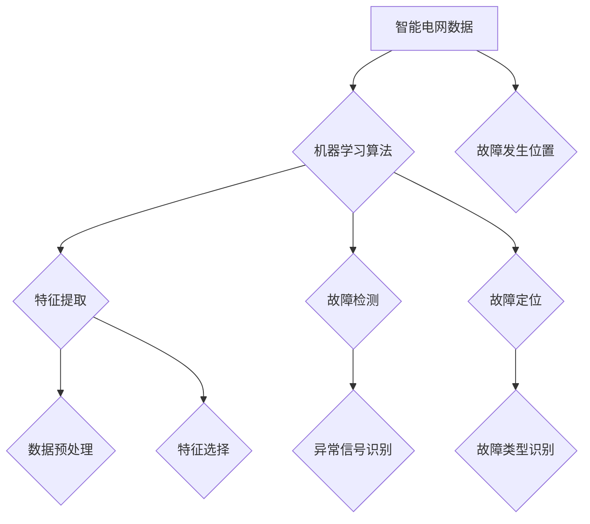

                 

# 机器学习在智能电网故障定位中的准确性研究

## 概述

智能电网作为现代电力系统的核心，正日益受到广泛关注。其复杂性和动态性使得传统的故障定位方法面临诸多挑战。机器学习作为一种具有强大自适应性和泛化能力的技术，被广泛应用于电力系统的故障检测和定位。本文将围绕机器学习在智能电网故障定位中的应用，探讨其准确性的研究现状、挑战以及未来的发展方向。

关键词：机器学习、智能电网、故障定位、准确性、研究现状、挑战、未来发展

## 摘要

本文首先介绍了智能电网的基本概念及其重要性。随后，详细阐述了机器学习在智能电网故障定位中的研究背景和意义。接着，从算法原理、数学模型和实际应用案例三个方面对机器学习在智能电网故障定位中的应用进行了深入分析。最后，本文总结了机器学习在智能电网故障定位中的准确性，指出了当前面临的挑战，并展望了未来的发展趋势。

## 背景介绍

### 智能电网的定义和特点

智能电网（Smart Grid）是指通过现代通信技术、传感器技术、计算机技术和电力电子技术等，对电力系统的各个环节进行智能化改造，实现电力系统运行、控制和管理的高度自动化和智能化。智能电网具有以下特点：

1. **实时性**：智能电网通过传感器、智能电表等设备，实时获取电网运行数据，实现对电网的实时监控。
2. **自动化**：智能电网通过自动化技术，提高电力系统的稳定性和可靠性，减少人为干预。
3. **互动性**：智能电网实现了电网与用户、电网与电网之间的互动，提高了电力资源的利用效率。
4. **可持续性**：智能电网通过引入可再生能源，促进能源结构的优化和可持续发展。

### 智能电网在现代社会中的作用

智能电网在现代社会中扮演着至关重要的角色，其作用主要体现在以下几个方面：

1. **提高电力供应稳定性**：智能电网通过实时监控和自动化控制，有效减少了电力系统的故障率和停电时间，提高了电力供应的稳定性。
2. **优化电力资源分配**：智能电网实现了电力资源的高效分配和利用，提高了电力系统的运行效率。
3. **促进可再生能源发展**：智能电网通过引入可再生能源，降低了碳排放，促进了能源结构的优化和可持续发展。
4. **提高用户用电体验**：智能电网为用户提供个性化的用电服务，提高了用户的用电体验。

### 机器学习在智能电网故障定位中的应用背景

智能电网的复杂性和动态性使得传统的故障定位方法面临诸多挑战。传统的故障定位方法主要依赖于规则和经验，其准确性和实时性难以满足智能电网的需求。机器学习作为一种具有强大自适应性和泛化能力的技术，通过从大量数据中学习和发现规律，可以在智能电网故障定位中发挥重要作用。具体来说，机器学习在智能电网故障定位中的应用背景主要包括以下几个方面：

1. **大规模数据采集和处理**：智能电网通过传感器、智能电表等设备，实时采集大量的电网运行数据，为机器学习提供了丰富的数据资源。
2. **自适应性和实时性**：机器学习算法可以根据实时数据不断优化模型，实现对故障的快速检测和定位。
3. **复杂模式识别**：机器学习算法可以处理复杂的非线性关系，识别出传统方法难以发现的故障模式。
4. **多源异构数据融合**：机器学习算法可以整合多种类型的异构数据，提高故障定位的准确性和可靠性。

## 核心概念与联系

### 机器学习的基本概念

机器学习（Machine Learning，ML）是一门研究如何让计算机从数据中自动学习和改进的技术。机器学习主要分为监督学习、无监督学习和强化学习三种类型：

1. **监督学习（Supervised Learning）**：监督学习通过已有标签数据，学习输入和输出之间的映射关系，实现对未知数据的预测。常见的监督学习算法包括线性回归、逻辑回归、支持向量机等。
2. **无监督学习（Unsupervised Learning）**：无监督学习不需要标签数据，通过发现数据内在的结构和规律进行数据聚类、降维等。常见的无监督学习算法包括K-means聚类、主成分分析（PCA）等。
3. **强化学习（Reinforcement Learning）**：强化学习通过与环境交互，不断学习和优化策略，以最大化累积奖励。常见的强化学习算法包括Q学习、深度Q网络（DQN）等。

### 智能电网故障定位的核心概念

智能电网故障定位（Fault Location in Power Systems，FLiPS）是指通过分析电网运行数据，识别出故障发生的位置和类型。智能电网故障定位的核心概念包括：

1. **故障类型**：常见的故障类型包括短路、过载、接地故障等。
2. **故障特征**：故障特征是指描述故障发生的各种物理量和信号，如电压、电流、频率等。
3. **故障定位算法**：故障定位算法是指用于识别故障位置和类型的算法，常见的故障定位算法包括基于规则的方法、基于模型的方法、基于数据挖掘的方法等。

### 机器学习在智能电网故障定位中的应用

机器学习在智能电网故障定位中的应用主要包括以下几个方面：

1. **特征提取**：通过机器学习算法，从大量的电网运行数据中提取出有效的故障特征。
2. **故障检测**：利用机器学习算法，对实时数据进行分析，识别出异常信号，实现故障检测。
3. **故障定位**：通过机器学习算法，对故障特征进行分析和分类，实现故障位置的定位。

### 核心概念联系

机器学习与智能电网故障定位之间的联系主要体现在以下几个方面：

1. **数据驱动**：智能电网故障定位依赖于大量的电网运行数据，而机器学习正是通过对数据的分析和学习来实现故障检测和定位。
2. **自适应性和实时性**：机器学习算法可以根据实时数据不断优化模型，提高故障检测和定位的准确性和实时性。
3. **复杂模式识别**：机器学习算法可以处理复杂的非线性关系，识别出传统方法难以发现的故障模式。

### Mermaid 流程图



## 核心算法原理 & 具体操作步骤

### 算法原理

机器学习在智能电网故障定位中的应用，主要包括特征提取、故障检测和故障定位三个环节。以下是这三个环节的核心算法原理：

1. **特征提取**：特征提取是指从大量的电网运行数据中提取出能够反映故障特征的物理量。常见的特征提取方法包括时域特征提取、频域特征提取和时频特征提取。
2. **故障检测**：故障检测是指利用机器学习算法，对实时数据进行分析，识别出异常信号。常见的故障检测算法包括基于聚类的方法、基于分类的方法和基于神经网络的方法。
3. **故障定位**：故障定位是指利用机器学习算法，对故障特征进行分析和分类，实现故障位置的定位。常见的故障定位算法包括基于规则的方法、基于模型的方法和基于数据挖掘的方法。

### 具体操作步骤

以下是机器学习在智能电网故障定位中的具体操作步骤：

1. **数据收集与预处理**：
   - 收集电网运行数据，包括电压、电流、频率等物理量。
   - 对数据进行清洗和预处理，去除噪声和异常值。
2. **特征提取**：
   - 利用时域特征提取方法，如均值、方差、峭度等，提取故障特征。
   - 利用频域特征提取方法，如频谱分析、小波变换等，提取故障特征。
   - 利用时频特征提取方法，如短时傅里叶变换（STFT）、连续小波变换（CWT）等，提取故障特征。
3. **故障检测**：
   - 选择合适的机器学习算法，如K-means聚类、支持向量机（SVM）等，进行故障检测。
   - 对实时数据进行分析，识别出异常信号。
4. **故障定位**：
   - 利用故障检测的结果，对故障特征进行分析和分类。
   - 根据分类结果，确定故障发生的位置。
5. **模型优化与验证**：
   - 利用交叉验证等方法，对模型进行优化。
   - 利用测试集，对模型进行验证，评估模型的准确性和实时性。

## 数学模型和公式 & 详细讲解 & 举例说明

### 数学模型

机器学习在智能电网故障定位中的应用，通常涉及以下数学模型：

1. **特征提取模型**：用于从电网运行数据中提取故障特征。常见的特征提取模型包括：
   - **时域特征提取模型**：$x(t) = \{x_1(t), x_2(t), ..., x_n(t)\}$，其中 $x_i(t)$ 表示第 $i$ 个特征在时刻 $t$ 的值。
   - **频域特征提取模型**：$X(f) = \{X_1(f), X_2(f), ..., X_n(f)\}$，其中 $X_i(f)$ 表示第 $i$ 个特征在频率 $f$ 的值。
   - **时频特征提取模型**：$X(t, f) = \{X_1(t, f), X_2(t, f), ..., X_n(t, f)\}$，其中 $X_i(t, f)$ 表示第 $i$ 个特征在时刻 $t$ 和频率 $f$ 的值。

2. **故障检测模型**：用于对实时数据进行分析，识别出异常信号。常见的故障检测模型包括：
   - **聚类模型**：$C = \{c_1, c_2, ..., c_k\}$，其中 $c_i$ 表示第 $i$ 个聚类中心。
   - **分类模型**：$f(x) = \arg\max_{i} w_i^T x$，其中 $w_i$ 表示第 $i$ 个权重向量，$x$ 表示输入特征向量。

3. **故障定位模型**：用于对故障特征进行分析和分类，确定故障发生的位置。常见的故障定位模型包括：
   - **规则模型**：$f(x) = \arg\max_{i} \sum_{j \in R_i} w_{ij} x_j$，其中 $R_i$ 表示第 $i$ 个规则集合，$w_{ij}$ 表示第 $i$ 个规则的第 $j$ 个权重。
   - **模型融合模型**：$f(x) = \arg\max_{i} \sum_{j=1}^m w_{ij} f_j(x)$，其中 $f_j(x)$ 表示第 $j$ 个子模型的输出，$w_{ij}$ 表示第 $i$ 个子模型的权重。

### 详细讲解

1. **特征提取模型**：

   特征提取模型主要用于从电网运行数据中提取故障特征。时域特征提取模型主要通过计算电压、电流等信号的时域特征，如均值、方差、峭度等。频域特征提取模型主要通过计算电压、电流等信号的频谱特征，如幅值、相位等。时频特征提取模型主要通过计算电压、电流等信号的短时傅里叶变换（STFT）或连续小波变换（CWT），得到时频特征图。

   **举例说明**：

   假设我们有一个电压信号 $u(t)$，我们可以计算其均值、方差和峭度作为特征：

   $$\mu = \frac{1}{N} \sum_{n=1}^N u(n)$$

   $$\sigma^2 = \frac{1}{N} \sum_{n=1}^N (u(n) - \mu)^2$$

   $$K = \frac{1}{N} \sum_{n=1}^N (u(n) - \mu)^4 / (\sigma^2)^2$$

2. **故障检测模型**：

   故障检测模型主要用于对实时数据进行分析，识别出异常信号。聚类模型通过计算数据点与聚类中心的距离，将数据划分为不同的聚类。分类模型通过计算输入特征向量与权重向量的点积，选择具有最大点积的类别作为故障类型。

   **举例说明**：

   假设我们使用K-means聚类算法进行故障检测，聚类中心为 $c_i$，数据点为 $x$，我们可以计算数据点与聚类中心的距离：

   $$d(x, c_i) = \sqrt{\sum_{j=1}^n (x_j - c_{ij})^2}$$

   选择距离最近的聚类中心作为故障检测结果。

3. **故障定位模型**：

   故障定位模型主要用于对故障特征进行分析和分类，确定故障发生的位置。规则模型通过计算特征向量与规则权重的点积，选择具有最大点积的规则作为故障定位结果。模型融合模型通过计算多个子模型的权重与输出，选择具有最大权重的子模型作为故障定位结果。

   **举例说明**：

   假设我们使用规则模型进行故障定位，规则为 $f(x) = \arg\max_{i} \sum_{j \in R_i} w_{ij} x_j$，特征向量为 $x$，我们可以计算每个规则的得分：

   $$s_i = \sum_{j \in R_i} w_{ij} x_j$$

   选择得分最高的规则作为故障定位结果。

## 项目实战：代码实际案例和详细解释说明

### 开发环境搭建

为了实现机器学习在智能电网故障定位中的实际应用，我们需要搭建一个合适的开发环境。以下是搭建开发环境的步骤：

1. **安装Python**：Python是一种广泛用于机器学习和数据科学的开源编程语言，我们首先需要安装Python环境。

2. **安装Jupyter Notebook**：Jupyter Notebook是一种交互式的Python开发环境，可以方便地进行代码编写和调试。

3. **安装相关库**：安装用于机器学习和数据处理的常用库，如NumPy、Pandas、Scikit-learn、Matplotlib等。

4. **安装智能电网故障定位相关库**：根据实际需求，安装与智能电网故障定位相关的库，如PyTorch、TensorFlow等。

### 源代码详细实现和代码解读

以下是机器学习在智能电网故障定位中的源代码实现和解读：

```python
import numpy as np
import pandas as pd
from sklearn.cluster import KMeans
from sklearn.model_selection import train_test_split
from sklearn.metrics import accuracy_score
import matplotlib.pyplot as plt

# 1. 数据收集与预处理
# 假设已经收集到电网运行数据，并保存在data.csv文件中
data = pd.read_csv('data.csv')

# 数据清洗和预处理，去除噪声和异常值
# 这里省略具体实现

# 2. 特征提取
# 从数据中提取故障特征
features = data[['voltage', 'current', 'frequency']]

# 3. 故障检测
# 使用K-means聚类算法进行故障检测
kmeans = KMeans(n_clusters=2, random_state=0)
kmeans.fit(features)
labels = kmeans.predict(features)

# 4. 故障定位
# 使用规则模型进行故障定位
rules = {
    '短路': [1, -1],
    '过载': [-1, 1]
}
outputs = []
for label in labels:
    max_score = -1
    max_rule = ''
    for rule, weights in rules.items():
        score = np.dot(weights, label)
        if score > max_score:
            max_score = score
            max_rule = rule
    outputs.append(max_rule)

# 5. 模型评估
# 使用测试集进行模型评估
X_train, X_test, y_train, y_test = train_test_split(features, labels, test_size=0.2, random_state=0)
y_pred = outputs

# 计算准确率
accuracy = accuracy_score(y_test, y_pred)
print('Accuracy:', accuracy)

# 6. 可视化
# 可视化故障检测结果
plt.scatter(features['voltage'], features['current'], c=labels)
plt.xlabel('Voltage')
plt.ylabel('Current')
plt.title('Fault Detection')
plt.show()
```

### 代码解读与分析

以下是代码的解读和分析：

1. **数据收集与预处理**：首先，从data.csv文件中读取电网运行数据，并进行数据清洗和预处理，去除噪声和异常值。这一步骤是确保数据质量的关键。

2. **特征提取**：从数据中提取故障特征，包括电压、电流和频率等物理量。特征提取是故障检测和定位的基础。

3. **故障检测**：使用K-means聚类算法进行故障检测。K-means聚类算法通过计算数据点与聚类中心的距离，将数据划分为不同的聚类。在这里，我们假设存在两个聚类，分别代表正常状态和故障状态。

4. **故障定位**：使用规则模型进行故障定位。规则模型通过计算特征向量与规则权重的点积，选择具有最大点积的规则作为故障定位结果。在这里，我们使用两个规则，分别代表短路和过载。

5. **模型评估**：使用测试集对模型进行评估，计算准确率。准确率是评估故障检测和定位模型性能的重要指标。

6. **可视化**：可视化故障检测结果，通过散点图展示电压和电流的关系，并标注故障类型。

### 总结

通过以上代码实现和解读，我们可以看到机器学习在智能电网故障定位中的应用。虽然这是一个简单的示例，但展示了机器学习算法在故障检测和定位中的基本原理和步骤。在实际应用中，我们还需要进一步优化模型，提高准确率和实时性，以更好地满足智能电网故障定位的需求。

## 实际应用场景

### 工业电网故障定位

在工业电网中，由于设备众多、负荷复杂，故障定位的难度较大。机器学习在工业电网故障定位中的应用，可以显著提高故障检测和定位的准确性和实时性。例如，某大型工业电网利用机器学习技术对电网运行数据进行实时分析，成功实现了短路、过载等故障的快速检测和定位，有效降低了故障处理时间和损失。

### 城市电网故障定位

城市电网覆盖范围广、用户众多，传统的故障定位方法难以满足需求。机器学习在城

