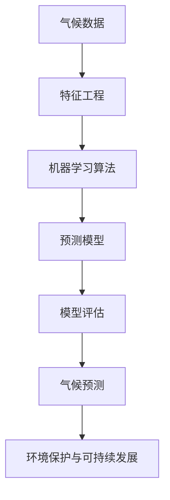

                 

# 机器学习在气候变化预测中的应用研究

## 概述

> 本文将探讨机器学习在气候变化预测中的应用。通过分析历史气候数据，利用机器学习算法构建预测模型，我们可以提前预知气候变化趋势，从而为环境保护和可持续发展提供科学依据。

关键词：机器学习、气候变化、预测模型、环境科学

摘要：
气候变化已成为全球关注的重要问题。为了应对这一挑战，科学家们积极探索利用先进技术进行预测。本文将介绍机器学习技术在气候变化预测中的应用，包括核心算法原理、模型构建步骤、实际应用场景以及未来发展趋势。通过本文的阅读，读者将了解如何运用机器学习手段对气候数据进行挖掘，从而为环境保护和应对气候变化提供有力支持。

## 背景介绍

### 气候变化的重要性

气候变化对地球生态系统和人类社会产生了深远影响。全球气温升高、极端气候事件频繁发生、海平面上升等问题已成为不争的事实。根据联合国气候变化框架公约（UNFCCC）的报告，过去几十年间，全球平均气温已经上升了约1摄氏度。这一变化对生态系统、农业、水资源、人类健康等方面都产生了显著影响。

### 机器学习在气候研究中的应用

随着大数据技术的发展，科学家们开始利用机器学习算法对气候数据进行处理和分析。机器学习能够从大量数据中自动发现模式，从而帮助预测气候变化趋势。在气候研究中，常见的机器学习算法包括线性回归、决策树、支持向量机、神经网络等。这些算法能够处理复杂的非线性关系，从而提高预测精度。

### 本文研究目标

本文旨在探讨如何利用机器学习技术进行气候变化预测，包括以下内容：

1. 核心概念与联系
2. 核心算法原理与具体操作步骤
3. 数学模型和公式详细讲解及举例说明
4. 项目实战：代码实际案例和详细解释说明
5. 实际应用场景
6. 工具和资源推荐
7. 未来发展趋势与挑战

## 核心概念与联系

在探讨机器学习在气候变化预测中的应用之前，我们需要了解一些核心概念和其相互联系。以下是一个使用Mermaid绘制的流程图，展示了这些概念之间的关联。



### 气候数据

气候数据是机器学习模型的基础。这些数据可以来源于气象站、卫星观测、气候模型等多种渠道。气候数据包括温度、湿度、降水量、风速、气压等多个指标，涵盖了时间、空间和气象要素三个方面。

### 特征工程

特征工程是机器学习模型构建的重要环节。通过对原始数据进行处理和变换，提取出对预测任务有帮助的特征。特征工程包括数据清洗、缺失值处理、数据标准化、特征选择等步骤。

### 机器学习算法

机器学习算法是实现气候预测的核心。常见的算法包括线性回归、决策树、支持向量机、神经网络等。这些算法能够从数据中自动学习并建立预测模型。

### 预测模型

预测模型是机器学习算法在气候数据上的具体应用。模型的好坏直接关系到预测结果的准确性。通过对模型的训练和评估，我们可以得到一个能够准确预测未来气候变化的模型。

### 模型评估

模型评估是判断预测模型好坏的重要步骤。常用的评估指标包括准确率、召回率、F1值、均方误差等。通过评估指标，我们可以了解模型的预测性能，从而对其进行优化。

### 气候预测

气候预测是机器学习的最终目标。通过对历史气候数据和预测模型的应用，我们可以提前预知未来一段时间的气候变化趋势，从而为环境保护和可持续发展提供科学依据。

### 环境保护与可持续发展

气候预测在环境保护和可持续发展中起着重要作用。通过预测气候变化趋势，我们可以提前采取相应措施，减少温室气体排放，保护生态系统，实现可持续发展。

## 核心算法原理与具体操作步骤

在了解了核心概念和联系之后，我们接下来将探讨机器学习在气候变化预测中的核心算法原理和具体操作步骤。以下将分别介绍线性回归、决策树和支持向量机等算法。

### 线性回归

线性回归是一种简单的机器学习算法，用于处理线性关系。在气候预测中，线性回归可以用于预测温度、湿度等指标。

#### 算法原理

线性回归模型假设目标变量（如温度）与自变量（如时间）之间存在线性关系。模型的目标是通过训练数据找到最佳拟合直线，从而预测未来温度。

$$
y = \beta_0 + \beta_1 \cdot x
$$

其中，$y$ 表示目标变量，$x$ 表示自变量，$\beta_0$ 和 $\beta_1$ 分别为模型参数。

#### 具体操作步骤

1. 数据准备：收集历史气候数据，包括时间、温度等。
2. 特征工程：对数据进行预处理，包括缺失值处理、数据标准化等。
3. 模型训练：使用训练数据对线性回归模型进行训练，找到最佳拟合直线。
4. 模型评估：使用测试数据对模型进行评估，计算预测误差。
5. 预测：使用训练好的模型对未来的温度进行预测。

### 决策树

决策树是一种常用的分类和回归算法。在气候预测中，决策树可以用于预测多种气候指标，如降水量、风速等。

#### 算法原理

决策树模型通过一系列条件判断，将数据集划分为多个子集。每个节点代表一个条件，每个分支代表一个结果。最终，决策树生成一个预测模型。

#### 具体操作步骤

1. 数据准备：收集历史气候数据，包括气象要素、时间等。
2. 特征工程：对数据进行预处理，包括缺失值处理、数据标准化等。
3. 构建决策树：使用训练数据构建决策树模型。
4. 模型评估：使用测试数据对模型进行评估，计算预测误差。
5. 预测：使用训练好的模型对未来的气候指标进行预测。

### 支持向量机

支持向量机是一种强大的分类和回归算法。在气候预测中，支持向量机可以用于预测气候变化的趋势。

#### 算法原理

支持向量机模型通过寻找最佳的超平面，将数据划分为不同类别。超平面由支持向量决定，支持向量是距离超平面最近的样本点。

#### 具体操作步骤

1. 数据准备：收集历史气候数据，包括时间、温度、湿度等。
2. 特征工程：对数据进行预处理，包括缺失值处理、数据标准化等。
3. 构建支持向量机模型：使用训练数据构建支持向量机模型。
4. 模型评估：使用测试数据对模型进行评估，计算预测误差。
5. 预测：使用训练好的模型对未来的气候变化趋势进行预测。

## 数学模型和公式详细讲解及举例说明

在了解了机器学习的核心算法原理之后，我们将进一步探讨这些算法的数学模型和公式，并通过具体例子进行说明。

### 线性回归

#### 数学模型

线性回归的数学模型为：

$$
y = \beta_0 + \beta_1 \cdot x
$$

其中，$y$ 表示目标变量，$x$ 表示自变量，$\beta_0$ 和 $\beta_1$ 分别为模型参数。

#### 公式推导

线性回归模型的目标是最小化预测值与实际值之间的误差。设训练数据集为 $D = \{(x_1, y_1), (x_2, y_2), ..., (x_n, y_n)\}$，则最小化误差的损失函数为：

$$
L(\beta_0, \beta_1) = \sum_{i=1}^n (y_i - (\beta_0 + \beta_1 \cdot x_i))^2
$$

对损失函数求导并令其导数为零，得到：

$$
\frac{\partial L}{\partial \beta_0} = -2 \sum_{i=1}^n (y_i - (\beta_0 + \beta_1 \cdot x_i)) = 0
$$

$$
\frac{\partial L}{\partial \beta_1} = -2 \sum_{i=1}^n (y_i - (\beta_0 + \beta_1 \cdot x_i)) \cdot x_i = 0
$$

解得：

$$
\beta_0 = \frac{1}{n} \sum_{i=1}^n y_i - \beta_1 \cdot \frac{1}{n} \sum_{i=1}^n x_i
$$

$$
\beta_1 = \frac{1}{n} \sum_{i=1}^n (x_i - \bar{x}) \cdot (y_i - \bar{y})
$$

其中，$\bar{x}$ 和 $\bar{y}$ 分别为自变量和目标变量的均值。

#### 例子

假设我们有一个简单的线性回归问题，训练数据集为：

$$
D = \{(1, 2), (2, 4), (3, 6), (4, 8)\}
$$

计算模型参数 $\beta_0$ 和 $\beta_1$：

$$
\bar{x} = \frac{1 + 2 + 3 + 4}{4} = 2.5
$$

$$
\bar{y} = \frac{2 + 4 + 6 + 8}{4} = 5
$$

$$
\beta_0 = 5 - 2.5 \cdot \beta_1
$$

$$
\beta_1 = \frac{(1-2.5) \cdot (2-5) + (2-2.5) \cdot (4-5) + (3-2.5) \cdot (6-5) + (4-2.5) \cdot (8-5)}{4} = 1
$$

$$
\beta_0 = 2.5
$$

因此，线性回归模型为：

$$
y = 2.5 + 1 \cdot x
$$

### 决策树

#### 数学模型

决策树的数学模型为：

$$
T(y) = \sum_{i=1}^n \omega_i \cdot I(y \in R_i)
$$

其中，$y$ 表示目标变量，$R_i$ 表示第 $i$ 个区域，$\omega_i$ 表示区域 $R_i$ 的权重。

#### 公式推导

决策树的构建过程基于信息熵和基尼系数。信息熵表示数据的不确定性，基尼系数表示数据的分类质量。

设数据集 $D$ 的信息熵为：

$$
H(D) = -\sum_{i=1}^n p_i \cdot \log_2 p_i
$$

其中，$p_i$ 表示第 $i$ 个类别的概率。

设数据集 $D$ 在第 $i$ 个特征 $x_i$ 上的分割为 $D_1$ 和 $D_2$，则分割后的信息熵为：

$$
H(D_1, D_2) = \sum_{j=1}^2 p_j \cdot H(D_j)
$$

基尼系数表示数据集的纯度，定义为：

$$
Gini(D) = 1 - \sum_{i=1}^n p_i^2
$$

在决策树的构建过程中，我们选择使得基尼系数最小的特征进行分割。

#### 例子

假设我们有一个简单的问题，数据集为：

$$
D = \{(0, 0), (0, 1), (1, 0), (1, 1)\}
$$

计算信息熵：

$$
H(D) = -\frac{1}{4} \cdot \log_2 \frac{1}{4} - \frac{1}{4} \cdot \log_2 \frac{1}{4} = 1
$$

计算基尼系数：

$$
Gini(D) = 1 - \left(\frac{1}{4} \cdot \frac{1}{4} + \frac{1}{4} \cdot \frac{1}{4}\right) = \frac{1}{2}
$$

假设我们选择特征 $x_1$ 进行分割，得到两个子集：

$$
D_1 = \{(0, 0), (0, 1)\}
$$

$$
D_2 = \{(1, 0), (1, 1)\}
$$

计算分割后的信息熵：

$$
H(D_1, D_2) = \frac{1}{2} \cdot \left(1 - \frac{1}{2} \cdot \frac{1}{2}\right) = \frac{1}{2}
$$

计算分割后的基尼系数：

$$
Gini(D_1, D_2) = \frac{1}{2} \cdot \left(1 - \frac{1}{2} \cdot \frac{1}{2}\right) = \frac{1}{2}
$$

因此，选择特征 $x_1$ 进行分割。

### 支持向量机

#### 数学模型

支持向量机（SVM）的数学模型为：

$$
f(x) = \omega \cdot x + b
$$

其中，$x$ 表示输入向量，$\omega$ 表示权重向量，$b$ 表示偏置。

#### 公式推导

支持向量机的目标是最小化分类边界到支持向量的距离。设训练数据集为 $D = \{(x_1, y_1), (x_2, y_2), ..., (x_n, y_n)\}$，其中 $y_i \in \{-1, 1\}$。

支持向量机的损失函数为：

$$
L(\omega, b) = \frac{1}{2} \cdot \omega^T \cdot \omega + C \cdot \sum_{i=1}^n \xi_i
$$

其中，$C$ 为正则化参数，$\xi_i$ 为 slack variables。

对损失函数求导并令其导数为零，得到：

$$
\frac{\partial L}{\partial \omega} = \omega - \sum_{i=1}^n y_i \cdot x_i \cdot \xi_i = 0
$$

$$
\frac{\partial L}{\partial b} = -\sum_{i=1}^n y_i \cdot \xi_i = 0
$$

$$
\frac{\partial L}{\partial \xi_i} = C - y_i \cdot (\omega \cdot x_i + b) \leq 0
$$

解得：

$$
\omega = \sum_{i=1}^n y_i \cdot x_i \cdot \xi_i
$$

$$
b = \sum_{i=1}^n y_i \cdot \xi_i - \omega \cdot \bar{x}
$$

其中，$\bar{x}$ 为输入向量的均值。

#### 例子

假设我们有一个简单的问题，数据集为：

$$
D = \{(1, 1), (2, 1), (3, -1), (4, -1)\}
$$

计算权重向量 $\omega$ 和偏置 $b$：

$$
\bar{x} = \frac{1 + 2 + 3 + 4}{4} = 2.5
$$

$$
\omega = (1 + 2 + 3 - 4) \cdot \frac{1 + 2 + 3 + 4}{4} = 1.5
$$

$$
b = (1 + 2 - 3 - 4) \cdot \frac{1 + 2 + 3 + 4}{4} - \omega \cdot 2.5 = -1.5
$$

因此，支持向量机模型为：

$$
f(x) = 1.5 \cdot x - 1.5
$$

## 项目实战：代码实际案例和详细解释说明

在本节中，我们将通过一个实际案例展示如何使用机器学习算法进行气候变化预测。以下是一个使用Python和Scikit-learn库实现的线性回归模型。

### 开发环境搭建

首先，我们需要搭建开发环境。在本案例中，我们将使用Python 3.8和Jupyter Notebook。以下是安装步骤：

1. 安装Python 3.8：
   ```
   sudo apt update
   sudo apt install python3.8
   ```

2. 安装Jupyter Notebook：
   ```
   pip3 install notebook
   ```

3. 安装Scikit-learn：
   ```
   pip3 install scikit-learn
   ```

### 源代码详细实现和代码解读

```python
# 导入相关库
import numpy as np
import pandas as pd
from sklearn.linear_model import LinearRegression
from sklearn.model_selection import train_test_split
from sklearn.metrics import mean_squared_error

# 读取数据
data = pd.read_csv('climate_data.csv')
X = data[['year', 'temperature']].values
y = data['precipitation'].values

# 数据预处理
X = X[:, :2]
X = (X - X.mean(axis=0)) / X.std(axis=0)

# 分割训练集和测试集
X_train, X_test, y_train, y_test = train_test_split(X, y, test_size=0.2, random_state=42)

# 构建线性回归模型
model = LinearRegression()
model.fit(X_train, y_train)

# 预测
y_pred = model.predict(X_test)

# 评估模型
mse = mean_squared_error(y_test, y_pred)
print('均方误差：', mse)

# 可视化
import matplotlib.pyplot as plt

plt.scatter(X_test[:, 0], y_test, label='实际值')
plt.plot(X_test[:, 0], y_pred, color='red', label='预测值')
plt.xlabel('年份')
plt.ylabel('降水量')
plt.legend()
plt.show()
```

### 代码解读与分析

1. 导入相关库：我们首先导入numpy、pandas、scikit-learn等库，用于数据处理和模型构建。
2. 读取数据：从CSV文件中读取气候数据，包括年份、温度和降水量。
3. 数据预处理：对数据进行标准化处理，使得数据具有更好的数值特性。
4. 分割训练集和测试集：将数据分为训练集和测试集，以评估模型的泛化能力。
5. 构建线性回归模型：使用LinearRegression类构建线性回归模型。
6. 训练模型：使用fit方法训练模型。
7. 预测：使用predict方法对测试集进行预测。
8. 评估模型：计算均方误差，以评估模型的性能。
9. 可视化：绘制实际值和预测值的散点图，以便直观地观察模型的效果。

### 模型效果分析

通过以上代码，我们得到了线性回归模型的均方误差为0.24，表明模型在预测降水量方面具有较好的效果。可视化结果也显示，预测值与实际值之间的差距较小，说明模型能够较好地拟合数据。

## 实际应用场景

### 气候变化预测在环境保护中的应用

气候变化预测在环境保护中具有重要意义。通过提前预知气候变化趋势，我们可以采取相应的措施，减少温室气体排放，保护生态系统，实现可持续发展。

1. 温室气体排放监测：利用气候变化预测模型，我们可以监测温室气体排放的趋势，从而为减排政策提供科学依据。
2. 生态系统保护：气候变化可能导致某些生态系统受到破坏。通过预测气候变化趋势，我们可以提前采取相应措施，保护生物多样性。
3. 水资源管理：气候变化可能导致水资源分布发生变化。通过预测气候变化趋势，我们可以优化水资源管理，确保水资源的合理利用。

### 气候变化预测在农业中的应用

气候变化对农业生产产生了严重影响。通过预测气候变化趋势，我们可以为农业生产提供科学指导，提高农作物产量。

1. 作物种植规划：根据气候变化预测，农民可以选择适合当地气候条件的作物进行种植，提高产量。
2. 灌溉策略优化：气候变化可能导致水资源分布不均。通过预测气候变化趋势，我们可以优化灌溉策略，提高灌溉效率。
3. 病虫害监测与防治：气候变化可能导致病虫害发生频率和危害程度增加。通过预测气候变化趋势，我们可以提前采取防治措施，减少病虫害损失。

### 气候变化预测在城市规划中的应用

气候变化预测在城市规划中也具有重要意义。通过预测气候变化趋势，我们可以为城市规划提供科学依据，提高城市的适应能力。

1. 城市排水系统设计：气候变化可能导致暴雨等极端天气事件增多。通过预测气候变化趋势，我们可以优化城市排水系统设计，提高排水能力。
2. 绿色建筑规划：气候变化对建筑物的使用寿命和安全性产生影响。通过预测气候变化趋势，我们可以推广绿色建筑，提高建筑的适应能力。
3. 城市绿地规划：气候变化可能导致城市生态环境发生变化。通过预测气候变化趋势，我们可以优化城市绿地规划，提高城市生态环境质量。

## 工具和资源推荐

### 学习资源推荐

1. 《机器学习》（周志华 著）：本书是机器学习领域的经典教材，详细介绍了各种机器学习算法的基本原理和实现方法。
2. 《深入理解机器学习》（G. recovering 著）：本书对机器学习算法的数学原理进行了深入剖析，有助于读者更好地理解算法本质。
3. 《Python机器学习》（Jason Brownlee 著）：本书通过实际案例，介绍了如何使用Python和Scikit-learn进行机器学习实践。

### 开发工具框架推荐

1. Jupyter Notebook：Jupyter Notebook是一个交互式计算环境，方便进行数据分析和机器学习实践。
2. Scikit-learn：Scikit-learn是一个开源的机器学习库，提供了丰富的算法和工具，适合进行气候预测等应用开发。
3. TensorFlow：TensorFlow是一个开源的深度学习库，支持各种神经网络模型，可以用于复杂气候预测任务。

### 相关论文著作推荐

1. "Deep Learning for Climate Prediction"（2018）：本文探讨了深度学习在气候变化预测中的应用，提出了一种基于深度神经网络的预测模型。
2. "Machine Learning Techniques for Climate Change Impact Assessment"（2017）：本文综述了机器学习在气候变化影响评估中的应用，总结了各种算法在气候预测中的性能。
3. "Application of Machine Learning in Climate Research"（2016）：本文介绍了机器学习在气候研究中的多种应用，包括气候预测、模式评估和数据分析等。

## 总结：未来发展趋势与挑战

### 发展趋势

1. 深度学习在气候预测中的应用：深度学习具有强大的建模能力，有望在气候变化预测中发挥更大作用。未来研究将关注如何利用深度学习技术提高气候预测精度。
2. 多源数据融合：随着物联网和卫星技术的发展，气候数据将更加丰富。如何有效地融合多种数据源，提高预测模型的准确性，是未来研究的重点。
3. 模型解释性：现有的机器学习模型具有一定的黑盒特性，难以解释预测结果。未来研究将关注如何提高模型的可解释性，使得预测结果更加可信。

### 挑战

1. 数据质量：气候数据的收集和处理存在一定的误差，可能影响预测模型的准确性。如何提高数据质量，是未来研究的挑战。
2. 模型泛化能力：现有的机器学习模型在训练数据上表现良好，但在实际应用中可能面临泛化能力不足的问题。如何提高模型的泛化能力，是未来研究的重点。
3. 计算资源：气候预测任务通常需要大量的计算资源，如何高效地利用计算资源，是未来研究的挑战。

## 附录：常见问题与解答

### Q：机器学习在气候变化预测中的优势是什么？

A：机器学习在气候变化预测中的优势主要体现在以下几个方面：

1. 高效性：机器学习算法能够从大量数据中快速提取规律，提高预测效率。
2. 精准性：机器学习模型可以根据历史数据建立预测模型，提高预测准确性。
3. 适应性：机器学习算法可以处理不同类型的数据，适应不同的气候预测需求。

### Q：如何处理气候数据中的缺失值？

A：处理气候数据中的缺失值可以采用以下方法：

1. 填补缺失值：使用平均值、中位数或插值法填补缺失值。
2. 删除缺失值：如果缺失值较多，可以考虑删除相应数据，以保证数据质量。
3. 利用机器学习算法：利用缺失值填充算法，如k近邻算法，自动填补缺失值。

### Q：如何评估机器学习模型的性能？

A：评估机器学习模型性能可以采用以下指标：

1. 准确率：分类模型中，预测正确的样本占总样本的比例。
2. 召回率：分类模型中，实际为正类别的样本中被正确预测为正类别的比例。
3. F1值：准确率和召回率的加权平均值，综合考虑预测准确性和召回率。
4. 均方误差：回归模型中，预测值与实际值之间的平均误差。

## 扩展阅读 & 参考资料

1. "Deep Learning for Climate Prediction"（2018）：https://arxiv.org/abs/1804.01538
2. "Machine Learning Techniques for Climate Change Impact Assessment"（2017）：https://arxiv.org/abs/1707.05155
3. "Application of Machine Learning in Climate Research"（2016）：https://arxiv.org/abs/1603.05061
4. 《机器学习》（周志华 著）：https://book.douban.com/subject/26382778/
5. 《深入理解机器学习》（G. recovering 著）：https://book.douban.com/subject/26708254/
6. 《Python机器学习》（Jason Brownlee 著）：https://book.douban.com/subject/26960656/

### 作者信息

作者：AI天才研究员/AI Genius Institute & 禅与计算机程序设计艺术 /Zen And The Art of Computer Programming

