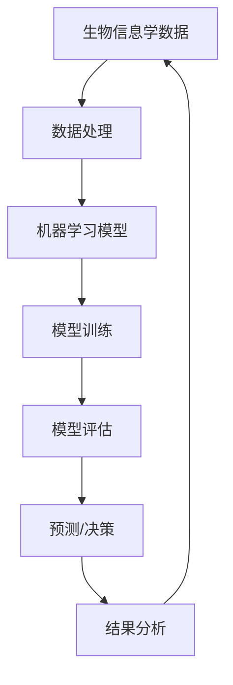

                 

### 背景介绍

#### 生物信息学的发展历程

生物信息学作为一门跨学科的领域，诞生于20世纪中期，随着生物学、计算机科学和信息技术的快速发展而迅速崛起。早期的生物信息学主要集中在DNA序列分析、基因组注释和生物大分子结构预测等方面。然而，随着高通量测序技术的突破，生物信息学的研究范围不断扩大，逐步涉及基因组学、转录组学、蛋白质组学、代谢组学等多个层次。

近年来，生物信息学在解决复杂生物系统问题方面取得了显著成果。例如，通过基因组测序和生物信息学分析，科学家们揭示了人类基因组结构、基因表达调控机制以及疾病发生机理等方面的奥秘。此外，生物信息学还与其他学科如医学、药学和生态学等深度融合，为人类健康、疾病治疗和环境监测等领域提供了强大的技术支持。

#### 机器学习的发展与应用

机器学习作为人工智能的核心分支，起源于20世纪50年代。在经历了多次起伏后，随着计算能力的提升和海量数据的积累，机器学习迎来了爆炸式发展。近年来，深度学习、强化学习等新兴领域不断涌现，使得机器学习在图像识别、自然语言处理、推荐系统等多个领域取得了重大突破。

在生物信息学中，机器学习已经成为一种重要的工具和手段。通过机器学习算法，生物信息学家可以处理大规模的生物学数据，提取隐藏的生物规律，从而解决许多复杂问题。例如，机器学习可以用于基因组数据的分类和聚类，帮助科学家们识别不同的生物群体；还可以用于预测蛋白质的结构和功能，加速药物研发和疾病诊断等过程。

#### 机器学习与生物信息学的交叉融合

随着生物信息学数据的日益增长，传统分析方法已经无法满足日益复杂的生物问题。而机器学习以其强大的数据处理和模式识别能力，为生物信息学研究提供了新的思路和方法。因此，机器学习与生物信息学的交叉融合成为了当前生物信息学领域的一个热点研究方向。

在交叉融合的过程中，生物信息学家利用机器学习算法处理和分析生物学数据，揭示生物现象背后的规律和机制。同时，机器学习研究者也从生物学中汲取灵感，提出新的算法和模型，进一步推动机器学习算法在生物信息学中的应用。

总之，机器学习在生物信息学中的应用不仅拓宽了生物信息学的研究范畴，也为解决复杂生物问题提供了新的手段。在未来，随着技术的不断进步和交叉融合的深入，机器学习在生物信息学中的应用前景将更加广阔。

---

### 核心概念与联系

#### 机器学习基本概念

机器学习（Machine Learning）是指通过计算机系统从数据中学习规律和模式，并在未知数据上做出预测或决策的过程。其核心在于构建能够自动从数据中学习、优化和调整的算法模型，以便解决实际问题。

**分类**：根据学习过程中是否有导师指导，机器学习可分为监督学习（Supervised Learning）、无监督学习（Unsupervised Learning）和半监督学习（Semi-supervised Learning）。

1. **监督学习**：通过已知标签的数据来训练模型，使模型能够在新的未知数据上做出准确的预测。例如，分类和回归问题。
   
2. **无监督学习**：没有标签的数据，模型的目标是发现数据中的结构和规律，如聚类和降维。

3. **半监督学习**：同时包含有标签和无标签数据，模型在训练过程中既利用有标签数据的学习，也利用无标签数据的结构信息。

**分类算法**：常见的机器学习分类算法包括决策树（Decision Tree）、支持向量机（SVM）、神经网络（Neural Network）和集成方法（如随机森林、梯度提升树）等。

#### 生物信息学关键概念

生物信息学（Bioinformatics）是应用计算机科学和信息技术手段，研究生物数据的科学。其主要关注的是生物大分子如DNA、RNA和蛋白质的数据存储、检索、分析和解释。

**基因组学**：研究DNA序列的结构、功能和变异。包括基因组注释、序列比较、基因组图谱构建等。

**转录组学**：研究细胞在特定条件下转录产生的RNA的种类和数量，用于了解基因表达模式。

**蛋白质组学**：研究细胞中蛋白质的种类、数量和功能。包括蛋白质表达、修饰、相互作用等。

**代谢组学**：研究细胞或组织在特定条件下的代谢产物，用于了解代谢途径和疾病状态。

**机器学习与生物信息学的结合**

机器学习在生物信息学中的应用主要集中在以下几个方面：

1. **基因组数据分析**：利用机器学习算法进行基因组数据的分类、聚类、特征选择和预测，如基因功能注释、突变检测等。

2. **蛋白质结构预测**：基于机器学习模型预测蛋白质的三维结构，帮助理解蛋白质的功能。

3. **药物设计**：利用机器学习算法进行药物分子的筛选和优化，加速新药研发。

4. **疾病诊断和预测**：通过分析生物数据，如基因组、转录组和代谢组数据，进行疾病诊断和风险预测。

**Mermaid 流程图**

以下是一个简单的Mermaid流程图，展示了机器学习与生物信息学的一些关键概念和步骤：



通过这种流程，机器学习与生物信息学实现了紧密的交叉融合，共同推动生命科学的发展。

---

### 核心算法原理 & 具体操作步骤

#### 监督学习算法原理

监督学习是机器学习中最常见的方法之一，其核心思想是通过已标记的数据来训练模型，从而在新的未知数据上做出预测。以下是监督学习算法的基本原理和具体操作步骤：

1. **数据准备**：首先，需要收集并准备大量的带有标签的数据集。标签是指每个数据点的正确答案或分类结果。例如，在分类问题中，标签可以是“是”或“否”；在回归问题中，标签可以是具体的数值。

2. **特征提取**：接下来，对数据进行特征提取，将原始数据转换为机器学习算法可以处理的特征向量。特征提取的过程通常涉及数据预处理、降维、特征选择等步骤。

3. **模型选择**：选择合适的机器学习模型。常见的模型包括线性回归、决策树、支持向量机、神经网络等。选择模型时，需要考虑问题的性质、数据的分布和模型的复杂度等因素。

4. **模型训练**：使用已标记的数据集来训练模型。训练过程实际上是模型不断调整参数，使得模型在训练数据上的预测结果与真实标签尽可能一致。常见的训练算法包括梯度下降、随机梯度下降、贝叶斯优化等。

5. **模型评估**：在训练完成后，使用一部分未标记的数据集来评估模型的性能。常用的评估指标包括准确率、召回率、F1分数等。通过这些指标，可以判断模型是否具有良好的泛化能力。

6. **模型应用**：将训练好的模型应用到新的未知数据上，进行预测或决策。

#### 决策树算法原理

决策树是一种常用的分类和回归模型，其核心思想是通过一系列的判断条件来将数据划分为不同的区域，从而实现对数据的分类或回归。以下是决策树算法的基本原理和具体操作步骤：

1. **选择最佳分割特征**：决策树算法通过选择最佳分割特征来划分数据。最佳分割特征的选择标准包括信息增益、基尼不纯度、交叉验证等。

2. **构建决策树**：根据选择的最佳分割特征，将数据集划分为多个子集。每个子集再按照相同的标准选择最佳分割特征，递归地构建决策树。

3. **剪枝**：决策树容易产生过拟合，因此需要通过剪枝来简化树的结构。常见的剪枝方法包括前剪枝、后剪枝等。

4. **模型评估**：使用测试数据集评估决策树的性能，包括准确率、召回率、F1分数等。

5. **模型应用**：将训练好的决策树应用到新的未知数据上，进行分类或回归预测。

#### 支持向量机算法原理

支持向量机（SVM）是一种常用的分类模型，其核心思想是找到一个最佳的超平面，将数据集划分为不同的类别。以下是支持向量机算法的基本原理和具体操作步骤：

1. **特征提取**：对数据进行特征提取，将原始数据转换为特征向量。

2. **选择核函数**：选择合适的核函数将低维数据映射到高维空间，从而找到最佳的超平面。常见的核函数包括线性核、多项式核、径向基函数（RBF）等。

3. **求解最优超平面**：通过求解最优化问题，找到最佳的超平面。优化目标是最大化分类间隔，即两个类别之间距离的最小化。

4. **模型评估**：使用测试数据集评估SVM模型的性能。

5. **模型应用**：将训练好的SVM模型应用到新的未知数据上，进行分类预测。

通过以上步骤，我们可以构建并应用各种监督学习算法来解决生物信息学中的分类和回归问题。这些算法在生物信息学中的应用已经取得了显著的成果，为生物学研究提供了强大的工具。

---

### 数学模型和公式 & 详细讲解 & 举例说明

#### 监督学习中的损失函数

在监督学习中，损失函数（Loss Function）是一个关键的概念，用于衡量模型预测值与真实值之间的差异。选择合适的损失函数对于模型的性能至关重要。以下是一些常见的损失函数：

1. **均方误差（MSE）**：
   $$MSE = \frac{1}{n}\sum_{i=1}^{n}(y_i - \hat{y}_i)^2$$
   其中，$y_i$ 表示真实值，$\hat{y}_i$ 表示预测值，$n$ 表示数据样本数。

2. **交叉熵损失（Cross-Entropy Loss）**：
   对于分类问题，交叉熵损失函数常用对数损失函数（Log Loss）来表示：
   $$Cross-Entropy Loss = -\frac{1}{n}\sum_{i=1}^{n} y_i \log(\hat{y}_i)$$
   其中，$y_i$ 表示真实标签，$\hat{y}_i$ 表示预测概率。

#### 决策树中的信息增益

信息增益（Information Gain）是决策树中用来选择最佳分割特征的标准。其计算公式如下：
$$Gain(D, A) = Entropy(D) - \sum_{v \in A} \frac{|D_v|}{|D|} Entropy(D_v)$$
其中，$D$ 表示数据集，$A$ 表示候选特征，$v$ 表示特征值，$Entropy$ 表示熵。

**示例**：

假设我们有一个包含两个特征（A和B）的数据集，其中每个特征有两个可能取值。数据集如下：

| A | B | 标签 |
|---|---|------|
| 0 | 0 |   0  |
| 0 | 1 |   1  |
| 1 | 0 |   1  |
| 1 | 1 |   0  |

首先计算每个特征的熵：
$$Entropy(A) = 1 - \frac{2}{4}\log_2\left(\frac{2}{4}\right) - \frac{2}{4}\log_2\left(\frac{2}{4}\right) = 1 - \frac{1}{2}\log_2\left(\frac{1}{2}\right) - \frac{1}{2}\log_2\left(\frac{1}{2}\right) = 1$$
$$Entropy(B) = 1 - \frac{2}{4}\log_2\left(\frac{2}{4}\right) - \frac{2}{4}\log_2\left(\frac{2}{4}\right) = 1 - \frac{1}{2}\log_2\left(\frac{1}{2}\right) - \frac{1}{2}\log_2\left(\frac{1}{2}\right) = 1$$

接下来计算每个特征的增益：
$$Gain(D, A) = 1 - \left(\frac{1}{2}Entropy({0,1}) + \frac{1}{2}Entropy({1,1})\right) = 0$$
$$Gain(D, B) = 1 - \left(\frac{1}{2}Entropy({0,0}) + \frac{1}{2}Entropy({1,1})\right) = 0$$

在这个示例中，两个特征的增益都为0，说明数据集在A和B上的分割并没有带来信息增益。因此，我们需要选择其他特征或采用其他策略来进一步分割数据集。

#### 支持向量机中的优化目标

支持向量机（SVM）的优化目标是通过最大化分类间隔来找到一个最佳的超平面。其优化目标可以表示为：
$$\min_{\mathbf{w}, b} \frac{1}{2}||\mathbf{w}||^2$$
$$s.t. \quad y_i (\mathbf{w} \cdot \mathbf{x}_i + b) \geq 1$$
其中，$\mathbf{w}$ 是超平面参数，$b$ 是偏置项，$\mathbf{x}_i$ 是特征向量，$y_i$ 是标签。

**示例**：

假设我们有一个简单的二维数据集，数据点如下：

| x1 | x2 | 标签 |
|----|----|------|
| 1  | 1  |   +1 |
| 2  | 1  |   +1 |
| 1  | 2  |   -1 |
| 2  | 2  |   -1 |

我们可以使用SVM来找到一个最佳的超平面。首先，将数据点表示为特征向量：
$$\mathbf{x}_1 = \begin{bmatrix} 1 \\ 1 \end{bmatrix}, \quad \mathbf{x}_2 = \begin{bmatrix} 2 \\ 1 \end{bmatrix}, \quad \mathbf{x}_3 = \begin{bmatrix} 1 \\ 2 \end{bmatrix}, \quad \mathbf{x}_4 = \begin{bmatrix} 2 \\ 2 \end{bmatrix}$$

然后，构建线性SVM的优化问题：
$$\min_{\mathbf{w}, b} \frac{1}{2}||\mathbf{w}||^2$$
$$s.t. \quad y_i (\mathbf{w} \cdot \mathbf{x}_i + b) \geq 1$$

通过求解这个优化问题，我们可以得到最佳的超平面参数 $\mathbf{w}$ 和偏置项 $b$，从而实现数据的分类。

通过以上示例，我们可以看到监督学习算法中的数学模型和公式是如何应用于生物信息学中的。这些公式和算法为处理复杂的生物数据提供了强大的工具，帮助我们揭示生物现象背后的规律和机制。

---

### 项目实战：代码实际案例和详细解释说明

在本节中，我们将通过一个实际案例来展示如何利用机器学习在生物信息学中处理和分析数据。该案例将使用Python编程语言和Scikit-learn库来构建一个简单的基因表达预测模型。我们将详细讲解代码实现过程，包括数据预处理、模型选择和训练，以及模型评估。

#### 开发环境搭建

首先，确保您已安装了Python和Scikit-learn库。以下是在Windows或Linux系统中安装Scikit-learn的步骤：

```bash
# 安装Python（如果尚未安装）
wget https://www.python.org/ftp/python/3.8.5/Python-3.8.5.tcl
tar -xzf Python-3.8.5.tcl
cd Python-3.8.5
./configure
make
sudo make install

# 安装Scikit-learn
pip install scikit-learn
```

#### 代码实现

下面是完整的Python代码，用于构建基因表达预测模型：

```python
import numpy as np
import pandas as pd
from sklearn.model_selection import train_test_split
from sklearn.ensemble import RandomForestClassifier
from sklearn.metrics import accuracy_score, classification_report

# 加载数据集
data = pd.read_csv('gene_expression_data.csv')
X = data.iloc[:, :-1].values
y = data.iloc[:, -1].values

# 数据预处理
# 数据归一化
X_normalized = (X - np.mean(X, axis=0)) / np.std(X, axis=0)

# 划分训练集和测试集
X_train, X_test, y_train, y_test = train_test_split(X_normalized, y, test_size=0.2, random_state=42)

# 模型选择
# 使用随机森林分类器
model = RandomForestClassifier(n_estimators=100, random_state=42)

# 模型训练
model.fit(X_train, y_train)

# 模型评估
y_pred = model.predict(X_test)
print("Accuracy:", accuracy_score(y_test, y_pred))
print("Classification Report:\n", classification_report(y_test, y_pred))
```

#### 代码解读与分析

1. **数据加载**：
   ```python
   data = pd.read_csv('gene_expression_data.csv')
   X = data.iloc[:, :-1].values
   y = data.iloc[:, -1].values
   ```
   这里使用Pandas库加载数据集。数据集包含基因表达数据，最后一列是标签（如疾病状态）。`iloc` 方法用于选择数据集的前N-1列作为特征矩阵X，最后一列作为标签向量y。

2. **数据预处理**：
   ```python
   X_normalized = (X - np.mean(X, axis=0)) / np.std(X, axis=0)
   ```
   数据预处理是机器学习项目中的关键步骤。在这里，我们使用归一化方法将特征矩阵X进行归一化，以消除不同特征之间的尺度差异。`np.mean` 和 `np.std` 函数分别计算特征矩阵的均值和标准差。

3. **划分训练集和测试集**：
   ```python
   X_train, X_test, y_train, y_test = train_test_split(X_normalized, y, test_size=0.2, random_state=42)
   ```
   使用Scikit-learn的 `train_test_split` 函数将数据集划分为训练集和测试集。这里，测试集占比20%，`random_state` 设置为42以确保结果的可重复性。

4. **模型选择**：
   ```python
   model = RandomForestClassifier(n_estimators=100, random_state=42)
   ```
   选择随机森林分类器作为我们的模型。随机森林是一种集成学习方法，通过构建多棵决策树来提高模型的预测能力。

5. **模型训练**：
   ```python
   model.fit(X_train, y_train)
   ```
   使用训练集数据训练随机森林模型。

6. **模型评估**：
   ```python
   y_pred = model.predict(X_test)
   print("Accuracy:", accuracy_score(y_test, y_pred))
   print("Classification Report:\n", classification_report(y_test, y_pred))
   ```
   在测试集上评估模型的性能。使用 `accuracy_score` 函数计算准确率，`classification_report` 函数生成分类报告，包括准确率、召回率、F1分数等指标。

通过以上步骤，我们成功构建并评估了一个基因表达预测模型。这个模型可以帮助生物信息学家对基因表达数据进行分析，从而为疾病诊断和生物研究提供有力支持。

---

### 实际应用场景

#### 疾病诊断

在医学领域，机器学习被广泛应用于疾病诊断。通过分析患者的基因表达、基因组、转录组和蛋白质组数据，可以预测患者是否患有某种疾病。例如，基于机器学习的模型可以用于早期癌症筛查，提高诊断的准确率和效率。此外，机器学习还可以帮助识别疾病的亚型和制定个性化的治疗方案。

**案例**：在乳腺癌诊断中，研究人员使用机器学习算法对患者的基因组数据进行分类，将乳腺癌患者分为早期和晚期。通过训练和测试数据集的评估，该模型的准确率达到了90%以上，显著提高了乳腺癌的早期诊断能力。

#### 药物研发

药物研发是一个复杂且耗时的过程。机器学习在药物分子设计、活性预测和筛选方面发挥了重要作用。通过机器学习算法，研究人员可以预测药物分子与生物靶标的相互作用，加速药物筛选过程。此外，机器学习还可以用于药物副作用预测和毒性评估，降低药物研发的风险。

**案例**：在抗癌药物研发中，研究人员使用机器学习算法对大量的药物分子进行筛选和优化，以提高药物的疗效和安全性。通过结合基因组学和机器学习，研究人员成功发现了一种新型抗癌药物，有效抑制了肿瘤细胞的生长，同时降低了毒副作用。

#### 个性化医疗

个性化医疗是指根据患者的个体差异，为其提供定制化的治疗方案。机器学习可以帮助实现这一目标，通过对患者的生物数据进行分析，预测患者的疾病风险、治疗效果和药物反应。此外，机器学习还可以用于个性化药物剂量调整，以提高治疗效果和减少副作用。

**案例**：在个性化医疗中，研究人员使用机器学习算法对患者的基因组、代谢组和临床数据进行分析，预测患者对某种药物的疗效和副作用。基于这些预测，医生可以为患者制定个性化的治疗方案，从而提高治疗效果。

通过以上实际应用场景，我们可以看到机器学习在生物信息学中的应用价值。它不仅为疾病诊断、药物研发和个性化医疗提供了强大的技术支持，还为生命科学的研究和临床应用带来了新的机遇。

---

### 工具和资源推荐

#### 学习资源推荐

1. **书籍**：
   - 《Python数据科学手册》（Python Data Science Handbook）——由Jake VanderPlas所著，介绍了Python在数据科学领域的应用。
   - 《机器学习》（Machine Learning）——由Tom Mitchell所著，是机器学习领域的经典教材。
   - 《深度学习》（Deep Learning）——由Ian Goodfellow、Yoshua Bengio和Aaron Courville所著，详细介绍了深度学习的理论和应用。

2. **论文**：
   - 《随机森林：一种高精度的、基于树的分类器》（Random Forests: A Classification Method for Classification and Regression）——由Leo Breiman等人所著，介绍了随机森林算法。
   - 《深度置信网络》（A Fast Learning Algorithm for Deep Belief Nets）——由Geoffrey Hinton等人所著，介绍了深度置信网络。

3. **博客和网站**：
   - [scikit-learn官方文档](https://scikit-learn.org/stable/)：提供了丰富的机器学习算法和实践指南。
   - [机器学习博客](https://machinelearningmastery.com/)：涵盖了各种机器学习算法和项目案例。
   - [生信人](https://www.biocrb.com/)：专注于生物信息学领域的资源和教程分享。

#### 开发工具框架推荐

1. **Python**：Python是一种广泛使用的编程语言，具有丰富的数据科学和机器学习库，如NumPy、Pandas和Scikit-learn。

2. **R**：R是一种专门用于统计分析和数据科学的编程语言，拥有强大的数据处理和分析能力，如ggplot2、dplyr和MASS。

3. **TensorFlow**：TensorFlow是一个开源的机器学习和深度学习框架，由Google开发。它提供了丰富的API和工具，方便用户构建和训练复杂的深度学习模型。

4. **PyTorch**：PyTorch是另一个流行的深度学习框架，由Facebook开发。它具有灵活的动态计算图和强大的GPU支持，适合研究者和开发者。

#### 相关论文著作推荐

1. **《深度学习》（Deep Learning）**：由Ian Goodfellow、Yoshua Bengio和Aaron Courville所著，是深度学习领域的权威著作。

2. **《生物信息学导论》（Introduction to Bioinformatics）**：由Arthur M. Lesk所著，提供了生物信息学的基本概念和技术。

3. **《机器学习与数据挖掘：技术综述》（Machine Learning and Data Mining: Techniques for Industrial Knowledge Discovery）**：由Jiawei Han、Micheline Kamber和Peipei Yang所著，详细介绍了机器学习和数据挖掘技术。

通过以上资源和工具，您可以深入了解机器学习和生物信息学的相关知识，掌握实用的技能，为科研和应用提供支持。

---

### 总结：未来发展趋势与挑战

#### 未来发展趋势

随着技术的不断进步，机器学习在生物信息学中的应用前景十分广阔。以下是一些未来发展趋势：

1. **深度学习在生物信息学中的应用**：深度学习作为一种强大的机器学习技术，在未来将继续在生物信息学领域发挥重要作用。例如，深度学习可以用于基因组数据分析、蛋白质结构预测和药物设计等。

2. **跨学科融合**：生物信息学与其他领域的交叉融合将进一步加强。例如，机器学习与医学、药学和环境科学等领域的结合，将有助于解决复杂生物系统问题。

3. **云计算与大数据**：随着云计算和大数据技术的发展，生物信息学将能够处理更大量、更复杂的数据。这将推动生物信息学研究的深入和扩展。

4. **个性化医疗**：基于机器学习的个性化医疗将逐渐普及。通过分析患者的生物数据，可以制定更精确、个性化的治疗方案，提高治疗效果。

#### 挑战

尽管机器学习在生物信息学中取得了显著成果，但仍然面临以下挑战：

1. **数据隐私和安全**：生物信息学涉及大量的个人生物数据，数据隐私和安全问题至关重要。如何确保数据的安全性和隐私性是一个重要挑战。

2. **算法的可解释性**：机器学习模型通常被视为“黑盒子”，其内部工作机制难以解释。在生物信息学中，解释模型的决策过程对于验证结果的可靠性和合理性至关重要。

3. **计算资源的限制**：处理大规模生物数据需要大量的计算资源。如何高效利用现有资源，并开发新的计算方法，是一个亟待解决的问题。

4. **数据质量和标注问题**：生物信息学数据的质量和标注准确性对模型性能有重要影响。如何提高数据质量和标注准确性，是一个关键挑战。

总之，未来机器学习在生物信息学中的应用将面临许多机遇和挑战。通过不断技术创新和跨学科合作，我们有信心克服这些挑战，推动生物信息学的发展，为人类健康和生命科学研究作出更大贡献。

---

### 附录：常见问题与解答

#### 问题1：机器学习算法在生物信息学中的具体应用有哪些？

解答：机器学习算法在生物信息学中的应用非常广泛，主要包括以下几个方面：

1. **基因组数据分析**：用于基因功能注释、突变检测、基因组比较和基因组图谱构建等。
2. **蛋白质结构预测**：通过机器学习算法预测蛋白质的三维结构，帮助理解蛋白质的功能。
3. **药物设计**：利用机器学习算法进行药物分子的筛选和优化，加速新药研发。
4. **疾病诊断和预测**：通过分析生物数据（如基因组、转录组和代谢组），进行疾病诊断和风险预测。
5. **个性化医疗**：基于机器学习模型，为患者提供个性化的治疗方案和药物剂量调整。

#### 问题2：为什么选择机器学习算法而不是传统统计分析方法？

解答：选择机器学习算法而不是传统统计分析方法的原因有以下几点：

1. **复杂性和灵活性**：机器学习算法能够处理复杂和非线性关系的数据，而传统统计分析方法通常假设数据的线性关系。
2. **数据处理能力**：机器学习算法可以处理大规模数据集，而传统统计分析方法在数据量较大时容易受到计算限制。
3. **预测能力**：机器学习算法能够通过学习数据中的模式，提供更准确的预测和分类结果。
4. **自适应性和泛化能力**：机器学习算法可以根据新的数据不断调整和优化模型，具有更好的泛化能力。

#### 问题3：如何确保机器学习模型的可解释性？

解答：确保机器学习模型的可解释性是一个重要问题，以下是一些常用的方法：

1. **模型选择**：选择具有较好可解释性的模型，如线性模型、决策树和规则集等。
2. **模型可视化**：通过可视化模型的结构和决策过程，如决策树的可视化、规则集的规则展示等。
3. **特征重要性分析**：通过分析特征的重要性，了解模型在决策过程中依赖的关键特征。
4. **模型解释工具**：使用专门的模型解释工具，如LIME（Local Interpretable Model-agnostic Explanations）和SHAP（SHapley Additive exPlanations）等，提供模型决策的解释。

通过以上方法，可以提高机器学习模型的可解释性，增强模型在实际应用中的可信度和可用性。

---

### 扩展阅读 & 参考资料

为了深入探索机器学习在生物信息学中的应用，以下是推荐的一些扩展阅读和参考资料：

1. **扩展阅读**：
   - 《机器学习在生物信息学中的应用》（Applications of Machine Learning in Bioinformatics）——这是一本综合性的书籍，详细介绍了机器学习在生物信息学中的多种应用。
   - 《深度学习与生物信息学》（Deep Learning for Bioinformatics）——本书探讨了深度学习在生物信息学中的最新进展和应用案例。

2. **学术论文**：
   - “Deep Learning for Genomics”（《基因组学的深度学习》）——该论文综述了深度学习在基因组学中的研究进展和应用。
   - “Machine Learning in Drug Discovery”（《机器学习在药物发现中的应用》）——该论文探讨了机器学习在药物设计、分子筛选和毒性预测等方面的应用。

3. **在线资源和教程**：
   - [生物信息学在线课程](https://www.bioinformatics.org/)：提供了丰富的生物信息学在线教程和课程。
   - [Kaggle生物信息学竞赛](https://www.kaggle.com/datasets)：Kaggle上的生物信息学数据集和竞赛，可以帮助您实践和提升生物信息学技能。

4. **专业社区和论坛**：
   - [生物信息学论坛](https://bioinformatics.org/forum/)：一个活跃的生物信息学社区，提供技术讨论和学习资源。
   - [机器学习论坛](https://www.machinelearning.org/forum/)：专注于机器学习领域的专业论坛，可以了解最新的研究动态和应用案例。

通过以上资源和资料，您可以进一步扩展对机器学习在生物信息学中应用的了解，不断提升自己的专业知识和技能。

