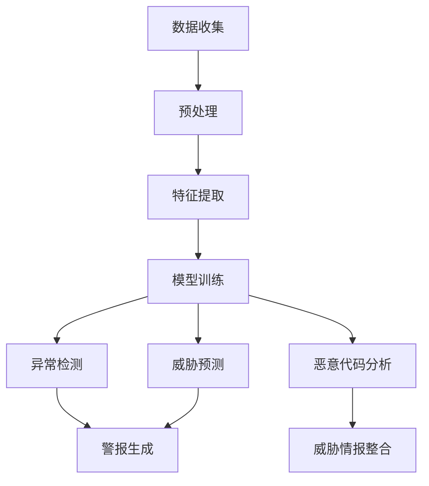

                 

### 背景介绍

网络安全威胁情报分析是现代网络安全工作中至关重要的一部分。随着网络攻击手段的不断升级和多样化，传统的基于规则和启发式的安全防护措施已经难以应对复杂多变的威胁。机器学习作为一种先进的智能分析技术，逐渐在网络安全威胁情报分析中发挥了重要作用。

机器学习在网络安全威胁情报分析中的应用主要体现在以下几个方面：

1. **异常检测**：通过训练模型，检测系统中的异常行为。当网络流量或用户行为出现与正常模式不符的情况时，机器学习模型能够及时发出警报，帮助安全专家迅速定位潜在威胁。

2. **恶意代码分析**：机器学习可以用来分析恶意代码的特性和行为，从而识别出恶意软件家族和变种，为网络安全防御提供有力支持。

3. **威胁预测**：基于历史数据，机器学习算法可以预测未来可能发生的网络攻击类型和目标，为网络安全策略的制定提供依据。

4. **威胁情报整合**：机器学习能够整合来自不同来源的威胁情报，通过数据挖掘和关联分析，发现潜在的威胁关系和趋势。

机器学习在网络安全威胁情报分析中的应用，不仅提高了安全防护的效率，也使得安全专家能够更加专注于应对高价值的威胁。然而，与此同时，也面临着数据隐私、算法透明性以及模型安全性的挑战。

接下来的章节中，我们将详细探讨机器学习在网络安全威胁情报分析中的核心概念、算法原理、数学模型，以及实际应用中的案例和挑战。希望通过这篇文章，能够让读者对机器学习在网络安全中的应用有更深入的理解。

### 核心概念与联系

在深入探讨机器学习在网络安全威胁情报分析中的应用之前，我们需要先了解一些核心概念及其相互之间的联系。

**机器学习（Machine Learning）**：机器学习是指通过算法从数据中学习模式，并利用这些模式进行预测或决策的技术。机器学习可以分为监督学习、无监督学习和强化学习三类。在网络安全威胁情报分析中，通常采用监督学习，因为这种学习方式需要标注的数据来进行训练，能够更准确地识别和分类威胁。

**网络安全（Cybersecurity）**：网络安全是指通过技术和管理手段，保护网络系统、数据以及相关资源不受恶意攻击、未授权访问和数据泄露的风险。网络安全涵盖多个方面，包括但不限于网络防护、数据安全、应用安全和端点安全。

**威胁情报（Threat Intelligence）**：威胁情报是指通过收集、分析和共享有关网络威胁的信息，帮助组织识别、预防和应对网络攻击。威胁情报的来源包括开源情报（OSINT）、内部情报、合作伙伴情报和购买情报。

**异常检测（Anomaly Detection）**：异常检测是机器学习在网络安全中的一个重要应用，它旨在识别出网络中的异常行为或数据点，这些异常行为或数据点可能表明了潜在的威胁。例如，某个用户的登录行为突然从正常的白天时间变为了深夜，这可能意味着用户账号被非法访问。

**恶意代码分析（Malware Analysis）**：恶意代码分析是指通过分析恶意软件的代码和行为，了解其恶意功能和工作原理，从而识别和防御恶意软件。恶意代码分析可以采用静态分析和动态分析两种方法。

**威胁预测（Threat Prediction）**：威胁预测是基于历史数据和模式识别技术，预测未来可能发生的网络攻击类型和目标。威胁预测对于提前采取防御措施至关重要。

**数据隐私（Data Privacy）**：数据隐私是指保护个人和敏感数据不被未授权访问或泄露。在机器学习应用中，数据隐私是一个重要的考虑因素，因为模型训练和预测可能需要访问敏感数据。

**算法透明性（Algorithm Transparency）**：算法透明性是指算法的决策过程应该是可解释和可验证的。对于网络安全威胁情报分析，算法透明性对于增强用户对系统信任和确保合规性至关重要。

**模型安全性（Model Security）**：模型安全性是指保护机器学习模型免受恶意攻击和操纵的能力。例如，对抗性攻击（Adversarial Attack）是一种攻击方式，攻击者通过微小但精心设计的扰动来误导模型。

理解这些核心概念及其相互之间的联系，有助于我们更好地理解机器学习在网络安全威胁情报分析中的实际应用，并为后续章节的深入探讨打下基础。

#### 核心概念原理和架构的 Mermaid 流程图

为了更清晰地展示机器学习在网络安全威胁情报分析中的核心概念原理和架构，下面我们使用 Mermaid 流程图来描述其关键节点。



1. **数据收集（A）**：首先，我们需要收集各种网络流量、日志和用户行为数据。
2. **预处理（B）**：对收集的数据进行清洗、去噪和格式化，使其适合用于模型训练。
3. **特征提取（C）**：从预处理后的数据中提取有助于模型学习的特征，这些特征可以是数值型的，也可以是类别型的。
4. **模型训练（D）**：使用特征和标签（即正常或异常行为）来训练监督学习模型。
5. **异常检测（E）**：将训练好的模型用于检测网络中的异常行为。
6. **恶意代码分析（F）**：分析恶意代码的特征和行为，更新威胁情报。
7. **威胁预测（G）**：基于历史数据和模式识别，预测未来的威胁。
8. **警报生成（H）**：当检测到异常行为或威胁时，生成警报并通知安全专家。
9. **威胁情报整合（I）**：将分析结果整合到威胁情报库中，用于进一步的威胁分析和预测。

通过这个流程图，我们可以看到机器学习在网络安全威胁情报分析中的各个环节是如何相互联系和协作的。这不仅有助于我们理解整个流程，也为后续章节的讨论提供了直观的参考。

### 核心算法原理 & 具体操作步骤

在深入探讨机器学习在网络安全威胁情报分析中的应用之前，我们需要先了解一些核心算法原理，并详细讲解如何将这些算法应用于网络安全场景中。

#### 1. 监督学习（Supervised Learning）

监督学习是最常见的机器学习类型，它通过标注的数据集来训练模型，然后使用这个模型进行预测。监督学习的主要任务是学习输入和输出之间的映射关系。

**具体操作步骤：**

1. **数据收集与预处理**：首先，收集网络流量、日志和用户行为等数据。然后对数据进行清洗、去噪和格式化，使其适合模型训练。
2. **特征提取**：从预处理后的数据中提取有助于模型学习的特征。这些特征可以是数值型的，如IP地址、端口号、流量大小等，也可以是类别型的，如操作系统类型、设备型号等。
3. **模型选择**：选择合适的监督学习模型，如决策树、随机森林、支持向量机（SVM）或神经网络等。
4. **模型训练**：使用特征和标签（即正常或异常行为）来训练模型。在训练过程中，模型会不断调整参数，以最小化预测误差。
5. **模型评估**：使用交叉验证等方法对训练好的模型进行评估，确保其具有良好的泛化能力。
6. **预测与警报**：将模型部署到实际环境中，对网络流量或用户行为进行实时预测。当检测到异常行为时，系统会生成警报并通知安全专家。

**应用实例：**

- **异常检测**：通过监督学习模型，可以检测网络中的异常流量或用户行为。例如，基于用户行为的特征，如登录时间、登录地点、操作频率等，训练一个分类模型，当检测到异常登录行为时，系统会发出警报。
- **恶意代码分析**：通过训练特征提取和分类模型，可以识别恶意软件的特性和行为，从而更新威胁情报库。

#### 2. 无监督学习（Unsupervised Learning）

无监督学习不依赖于标注数据，其主要任务是发现数据中的隐藏结构和模式。

**具体操作步骤：**

1. **数据收集与预处理**：与监督学习类似，首先收集网络流量、日志和用户行为等数据，然后进行预处理。
2. **特征提取**：提取有助于模型学习的特征。
3. **聚类分析**：使用聚类算法，如K-Means、层次聚类等，将相似的数据点分组，以发现数据中的潜在结构。
4. **降维**：使用降维算法，如主成分分析（PCA）、t-SNE等，减少数据维度，便于可视化分析。
5. **模式识别**：分析聚类结果和降维后的数据，发现潜在的模式和趋势。

**应用实例：**

- **用户行为分析**：通过无监督学习，可以发现用户行为中的潜在模式，从而识别出高风险用户或异常行为。
- **网络流量分析**：无监督学习可以帮助识别网络中的异常流量模式，提高异常检测的准确性。

#### 3. 强化学习（Reinforcement Learning）

强化学习是一种通过试错来学习最优策略的机器学习类型。在网络安全场景中，强化学习可以用于自动化的威胁防御和响应。

**具体操作步骤：**

1. **环境设定**：定义网络威胁和防御策略的环境。
2. **策略选择**：设计奖励机制和惩罚机制，以激励模型选择最优策略。
3. **学习过程**：通过不断试错，模型会逐渐学会在不同的环境下做出最优决策。
4. **策略调整**：根据模型的反馈，调整策略以适应新的威胁场景。

**应用实例：**

- **自动化威胁防御**：通过强化学习，模型可以自动调整网络防护策略，以应对不断变化的威胁。
- **自动化响应**：当检测到威胁时，模型可以自动执行防御措施，如隔离受感染的设备、封锁恶意IP地址等。

通过以上算法原理和具体操作步骤的介绍，我们可以看到机器学习在网络安全威胁情报分析中的应用是如何实现的。在接下来的章节中，我们将进一步探讨这些算法在实际项目中的具体实现和案例分析。

### 数学模型和公式 & 详细讲解 & 举例说明

为了深入理解机器学习在网络安全威胁情报分析中的应用，我们需要掌握一些关键的数学模型和公式，并通过具体实例来说明这些公式的应用。

#### 1. 决策树（Decision Tree）

决策树是一种常见的监督学习算法，它通过一系列的判断条件来对数据进行分类。决策树的构建过程涉及以下几个主要步骤：

- **信息增益（Information Gain）**：用于评估一个特征对数据集划分的有效性。公式如下：
  
  $$
  IG(D, A) = H(D) - \sum_{v \in A} \frac{|D_v|}{|D|} H(D_v)
  $$
  
  其中，$H(D)$是数据集$D$的熵，$A$是特征集合，$D_v$是特征$A$在各个类别下的子集。

- **基尼不纯度（Gini Impurity）**：另一种评估特征划分有效性的方法。公式如下：
  
  $$
  GI(D, A) = 1 - \sum_{v \in A} \left( \frac{|D_v|}{|D|} \right)^2
  $$

**应用实例**：

假设我们有一个数据集，包含特征A（IP地址）和特征B（端口号），需要通过这两个特征来分类数据为“正常”或“异常”。

```
特征A  | 特征B  | 类别
--------|--------|------
192.168| 80     | 正常
192.168| 8080   | 异常
10.0.0.1| 80     | 正常
10.0.0.1| 8080   | 异常
...
```

通过计算信息增益或基尼不纯度，我们可以选择一个最佳的切分点来构建决策树。例如，选择端口号作为切分特征，当端口号等于80时，类别为“正常”；当端口号等于8080时，类别为“异常”。

#### 2. 支持向量机（Support Vector Machine，SVM）

支持向量机是一种常用的分类算法，其核心思想是找到一个最优的超平面，将不同类别的数据点尽可能分开。

- **决策边界（Decision Boundary）**：定义分类超平面，公式如下：
  
  $$
  w \cdot x + b = 0
  $$
  
  其中，$w$是超平面的法向量，$x$是数据点，$b$是偏置项。

- **分类函数（Classification Function）**：用于判断新数据点的类别，公式如下：
  
  $$
  f(x) = \text{sign}(w \cdot x + b)
  $$

**应用实例**：

假设我们有一个二维数据集，包含特征X和特征Y，需要通过这两个特征来分类数据为“恶意”或“良性”。

```
X  |  Y  | 类别
----|-----|------
1   |  2  | 恶意
2   |  3  | 恶意
4   |  5  | 良性
5   |  6  | 良性
...
```

通过训练SVM模型，我们可以找到一个最优的超平面，将恶意和良性数据点分开。例如，选择一个直线作为分类边界，当$w \cdot x + b > 0$时，类别为“恶意”；当$w \cdot x + b < 0$时，类别为“良性”。

#### 3. 神经网络（Neural Networks）

神经网络是一种模拟生物神经系统的算法，它通过多层节点（神经元）来对数据进行处理和分类。

- **激活函数（Activation Function）**：用于决定神经元是否被激活，常见的激活函数有Sigmoid、ReLU等。例如，Sigmoid函数的公式如下：

  $$
  \sigma(x) = \frac{1}{1 + e^{-x}}
  $$

- **损失函数（Loss Function）**：用于评估模型预测值和真实值之间的差异，常见的损失函数有均方误差（MSE）、交叉熵（Cross-Entropy）等。例如，交叉熵函数的公式如下：

  $$
  J = -\frac{1}{m} \sum_{i=1}^{m} \sum_{k=1}^{K} y_k^{(i)} \log(a^{(l)}_k^{(i)})
  $$

  其中，$m$是样本数量，$K$是类别数量，$y_k^{(i)}$是第$i$个样本在第$k$个类别的标签，$a^{(l)}_k^{(i)}$是第$l$层第$i$个节点在第$k$个类别的输出。

**应用实例**：

假设我们有一个包含特征X和特征Y的二维数据集，需要通过神经网络来分类数据为“正常”或“异常”。

```
X  |  Y  | 类别
----|-----|------
1   |  2  | 正常
2   |  3  | 正常
4   |  5  | 异常
5   |  6  | 异常
...
```

通过训练神经网络模型，我们可以使其学会区分正常和异常数据。例如，选择一个多层感知机（MLP）模型，通过前向传播和反向传播算法不断调整模型参数，直到满足预设的准确率。

通过上述数学模型和公式的详细讲解及实例说明，我们可以看到机器学习在网络安全威胁情报分析中的应用是如何基于数学原理来实现的。这些模型和公式不仅为网络安全威胁检测提供了强大的工具，也为我们理解和优化这些算法提供了理论基础。

### 项目实战：代码实际案例和详细解释说明

在本文的最后部分，我们将通过一个实际的代码案例，详细讲解如何使用Python和常见机器学习库（如Scikit-learn）来实现一个基于监督学习的网络安全威胁情报分析系统。

#### 5.1 开发环境搭建

在开始编写代码之前，我们需要搭建一个适合开发的Python环境，并安装必要的库。以下是在Ubuntu系统上搭建开发环境的步骤：

1. **安装Python**：默认情况下，Ubuntu系统中已经预装了Python 3。可以通过以下命令检查Python版本：

   ```
   python3 --version
   ```

2. **安装Jupyter Notebook**：Jupyter Notebook是一个交互式编程环境，非常适合编写和调试代码。安装Jupyter Notebook的命令如下：

   ```
   pip3 install notebook
   ```

3. **安装Scikit-learn**：Scikit-learn是一个常用的机器学习库，用于实现各种监督学习和无监督学习算法。安装Scikit-learn的命令如下：

   ```
   pip3 install scikit-learn
   ```

4. **安装其他依赖库**：根据需要，还可以安装其他库，如Matplotlib用于数据可视化。安装Matplotlib的命令如下：

   ```
   pip3 install matplotlib
   ```

安装完成后，我们就可以开始编写和运行代码了。

#### 5.2 源代码详细实现和代码解读

下面是一个简单的Python代码案例，演示如何使用Scikit-learn实现一个基于K-近邻（K-Nearest Neighbors，KNN）算法的网络安全威胁情报分析系统。

```python
# 导入必要的库
import numpy as np
from sklearn.datasets import load_iris
from sklearn.model_selection import train_test_split
from sklearn.neighbors import KNeighborsClassifier
from sklearn.metrics import accuracy_score
import matplotlib.pyplot as plt

# 加载Iris数据集（此处作为示例，实际应用中应加载网络安全数据集）
iris = load_iris()
X, y = iris.data, iris.target

# 划分训练集和测试集
X_train, X_test, y_train, y_test = train_test_split(X, y, test_size=0.2, random_state=42)

# 创建KNN分类器，设置k值为3
knn = KNeighborsClassifier(n_neighbors=3)

# 训练模型
knn.fit(X_train, y_train)

# 预测测试集
y_pred = knn.predict(X_test)

# 计算准确率
accuracy = accuracy_score(y_test, y_pred)
print(f"Accuracy: {accuracy:.2f}")

# 可视化决策边界（用于解释）
plt.figure(figsize=(8, 6))
colors = ['red', 'blue', 'green']
for i, c in enumerate(colors):
    idx = np.where(y == i)
    plt.scatter(X[idx, 0], X[idx, 1], c=c, label=f'Class {i}')
    
# 绘制决策边界
x_min, x_max = X[:, 0].min() - 1, X[:, 0].max() + 1
y_min, y_max = X[:, 1].min() - 1, X[:, 1].max() + 1
xx, yy = np.meshgrid(x_min, y_min)
Z = knn.predict(np.c_[xx.ravel(), yy.ravel()])
Z = Z.reshape(xx.shape)
plt.contourf(xx, yy, Z, alpha=0.8)
plt.xlabel('Feature 1')
plt.ylabel('Feature 2')
plt.legend()
plt.show()
```

**代码解读**：

1. **导入库**：首先，我们导入numpy、scikit-learn和matplotlib等库，用于数据操作、模型训练和可视化。

2. **加载数据集**：使用scikit-learn内置的Iris数据集作为示例，实际应用中应加载网络安全数据集。

3. **划分训练集和测试集**：使用train_test_split函数将数据集划分为训练集和测试集，以评估模型性能。

4. **创建KNN分类器**：创建KNeighborsClassifier对象，设置k值为3，即选择3个最近的邻居来预测新数据点的类别。

5. **训练模型**：使用fit函数训练KNN模型。

6. **预测测试集**：使用predict函数对测试集进行预测。

7. **计算准确率**：使用accuracy_score函数计算模型在测试集上的准确率。

8. **可视化决策边界**：绘制决策边界，以直观地展示模型是如何划分不同类别的。

#### 5.3 代码解读与分析

1. **数据预处理**：在加载Iris数据集后，我们直接使用scikit-learn提供的train_test_split函数将数据集划分为训练集和测试集。在实际网络安全威胁情报分析中，我们需要处理更复杂的原始数据，如网络流量、日志和用户行为等。此时，数据预处理步骤将包括数据清洗、去噪、归一化和特征提取等。

2. **模型选择**：在本例中，我们选择了K-近邻算法作为分类器。KNN算法简单易实现，但在处理高维数据时性能可能较差。在实际应用中，根据数据特点和需求，我们可以选择其他更适合的算法，如支持向量机（SVM）、随机森林（Random Forest）或神经网络（Neural Networks）。

3. **模型训练与预测**：使用fit函数训练模型，并使用predict函数进行预测。在训练过程中，模型会根据训练数据学习如何划分不同类别的数据点。在预测阶段，模型将根据已学到的模式对新数据点进行分类。

4. **准确率评估**：通过计算模型在测试集上的准确率，我们可以评估模型的性能。在实际应用中，除了准确率，我们还需要考虑其他评估指标，如召回率、精确率、F1分数等。

5. **可视化**：可视化决策边界有助于我们理解模型的分类规则。在实际网络安全威胁情报分析中，可视化可以帮助安全专家更好地理解威胁的特征和行为模式。

通过这个简单的案例，我们可以看到如何使用Python和Scikit-learn实现一个基于监督学习的网络安全威胁情报分析系统。在实际应用中，我们需要根据具体需求调整数据预处理步骤、选择合适的算法，并优化模型参数，以提高系统的性能和可靠性。

### 实际应用场景

在了解了机器学习在网络安全威胁情报分析中的基本原理和算法实现后，接下来我们将探讨几个实际应用场景，展示机器学习如何帮助解决网络安全中的实际问题。

#### 1. 异常流量检测

异常流量检测是网络安全威胁情报分析中的一个关键应用。通过机器学习模型，可以实时监测网络流量，识别异常行为，并及时发出警报。

**应用实例：**

- **场景描述**：一家大型企业网络面临恶意攻击的风险，需要监控内部网络流量，及时发现异常行为。
- **解决方案**：企业可以使用基于监督学习的机器学习模型，如K-近邻（KNN）或支持向量机（SVM），对正常网络流量数据进行训练。然后，将实时采集的网络流量数据输入模型进行预测。如果模型的预测结果与正常行为不符，系统会立即发出警报，并通知安全专家进行进一步调查。

#### 2. 恶意代码检测

恶意代码检测是另一项重要的网络安全威胁情报分析任务。通过机器学习算法，可以快速识别和分类恶意软件，从而有效地保护系统不受侵害。

**应用实例：**

- **场景描述**：一家银行需要对其内部系统进行恶意软件检测，以防止财务信息泄露。
- **解决方案**：银行可以采用基于无监督学习的聚类算法，如K-均值（K-Means），对已知的恶意软件样本进行特征提取和聚类。通过分析聚类结果，可以发现新的恶意软件变种。此外，还可以使用基于监督学习的深度学习模型，如卷积神经网络（CNN），对新的恶意软件样本进行分类和检测。

#### 3. 威胁预测

威胁预测是利用历史数据和模式识别技术，预测未来可能发生的网络攻击类型和目标。通过机器学习，可以提前采取防御措施，降低潜在风险。

**应用实例：**

- **场景描述**：一家电子商务公司需要预测可能发生的DDoS攻击，以保护其在线业务不受影响。
- **解决方案**：电子商务公司可以使用基于强化学习的算法，如Q学习（Q-Learning），通过模拟不同的网络流量模式，预测未来可能发生的攻击类型和目标。根据预测结果，公司可以提前调整网络防护策略，如增加带宽、部署防火墙等，以提高系统的抗攻击能力。

#### 4. 威胁情报整合

威胁情报整合是将来自不同来源的威胁信息进行收集、分析和整合，以形成更全面的威胁画像。

**应用实例：**

- **场景描述**：一家安全服务公司需要为其客户整合来自多个渠道的威胁情报，以提供更全面的安全保护。
- **解决方案**：安全服务公司可以使用基于机器学习的数据挖掘技术，对来自开源情报（OSINT）、内部情报和合作伙伴情报的数据进行关联分析。通过分析不同来源的威胁信息，公司可以识别潜在的威胁关系和趋势，并向客户发布详细的安全报告。

通过上述实际应用场景，我们可以看到机器学习在网络安全威胁情报分析中的广泛适用性。无论是对异常流量的实时检测、恶意代码的快速识别，还是对潜在威胁的预测和情报整合，机器学习都为网络安全提供了强大的技术支持。这些应用不仅提高了安全防护的效率，也帮助安全专家更好地应对复杂多变的网络威胁。

### 工具和资源推荐

为了更好地学习机器学习在网络安全威胁情报分析中的应用，以下是一些推荐的工具和资源，包括书籍、论文、博客和网站，供读者参考。

#### 7.1 学习资源推荐

1. **书籍：**

   - 《机器学习》（Python版），作者：Tom Mitchell。这本书是机器学习领域的经典教材，适合初学者深入学习。
   - 《深度学习》（Deep Learning），作者：Ian Goodfellow、Yoshua Bengio、Aaron Courville。这本书详细介绍了深度学习的基本原理和应用，适合希望深入了解神经网络和深度学习的读者。
   - 《网络安全实践指南》，作者：Will Ayers。这本书涵盖了网络安全的基本概念和实践，适合希望了解网络安全威胁情报分析的读者。

2. **论文：**

   - “Adversarial Examples, explanations, and all that jazz: A survey of the current landscape in adversarial machine learning”，作者：Nicolas Papernot, Peter McDaniel, Ian Goodfellow, Somesh Jha, Z. Bengio，这篇综述文章详细介绍了对抗性机器学习的相关研究。
   - “Threat Modeling: Improving Security through Design Analysis”，作者：Jacky Balgy，这篇文章探讨了威胁建模在网络安全设计中的应用。

3. **博客：**

   - blog.keras.io。这是一个关于深度学习技术实践的博客，包含了大量实用教程和案例分析。
   - medium.com/sicnu cybersecurity。这是一个关于网络安全技术研究的博客，涵盖了网络安全威胁情报分析、恶意代码检测等方面的内容。

4. **网站：**

   - Kaggle（kaggle.com）。这是一个数据科学竞赛平台，提供了大量机器学习相关的数据和挑战，适合实践和验证所学知识。
   - OWASP（owasp.org）。这是一个致力于提高网络应用程序安全性的非营利组织，提供了丰富的安全资源和指南。

#### 7.2 开发工具框架推荐

1. **Python库：**

   - Scikit-learn（scikit-learn.org）。这是一个广泛使用的机器学习库，提供了多种经典的监督学习和无监督学习算法。
   - TensorFlow（tensorflow.org）。这是一个开源的机器学习框架，支持深度学习和高性能计算。
   - PyTorch（pytorch.org）。这是一个基于Python的深度学习库，具有灵活的动态计算图和易于使用的API。

2. **工具框架：**

   - Keras（keras.io）。这是一个高级神经网络API，能够方便地构建和训练深度学习模型。
   - Jupyter Notebook（jupyter.org）。这是一个交互式开发环境，适合编写和运行代码，特别是用于数据分析和机器学习实验。

#### 7.3 相关论文著作推荐

1. **论文：**

   - “Deep Learning for Cybersecurity”，作者：Wenjie Zhang, Yuxiang Zhou, Hui Xue, et al.。这篇论文探讨了深度学习在网络安全中的应用，包括恶意代码检测、异常检测和威胁预测。
   - “Threat Intelligence Platform: A Data-Driven Approach to Cybersecurity”，作者：Sikharup Lochan Saha, Anirban Nandi, et al.。这篇论文介绍了一种基于数据驱动的方法，用于构建威胁情报平台。

2. **著作：**

   - 《网络安全与人工智能：融合与对抗》，作者：赵杰、周涛。这本书探讨了人工智能在网络安全领域的应用，包括机器学习在威胁情报分析、恶意代码检测和威胁预测中的实际应用。

通过这些工具和资源，读者可以更深入地了解机器学习在网络安全威胁情报分析中的应用，并在实际项目中应用这些知识，提高网络安全防护能力。

### 总结：未来发展趋势与挑战

机器学习在网络安全威胁情报分析中的应用前景广阔，随着技术的不断进步，它将在以下几个方面展现出更大的潜力：

**1. 更高效的数据处理能力：** 随着大数据和云计算技术的发展，机器学习算法将能够处理和分析海量数据，从而提高威胁情报分析的准确性和实时性。

**2. 深度学习算法的普及：** 深度学习算法在图像识别、自然语言处理等领域取得了显著成果，未来将更多地应用于网络安全威胁情报分析，提升检测和预测能力。

**3. 自动化和智能化的威胁响应：** 利用强化学习和自动控制技术，网络安全系统将能够实现自动化的威胁响应，提高应对复杂威胁的效率。

然而，与此同时，机器学习在网络安全威胁情报分析中也将面临一系列挑战：

**1. 数据隐私和安全性：** 机器学习模型通常需要访问大量的敏感数据，如何在保证数据安全的前提下进行数据处理和分析，是亟待解决的问题。

**2. 模型可解释性和透明性：** 随着深度学习等复杂算法的普及，模型的可解释性成为一个关键挑战。提高模型的可解释性，增强用户对算法的信任，是未来的重要研究方向。

**3. 对抗性攻击：** 攻击者可以利用对抗性攻击技术，通过微小但精心设计的扰动来误导机器学习模型，从而逃避检测。因此，如何提升模型的鲁棒性，抵御对抗性攻击，是重要的研究课题。

综上所述，机器学习在网络安全威胁情报分析中具有巨大的应用潜力，但也面临着数据隐私、模型透明性和对抗性攻击等挑战。未来的发展需要学术界和产业界的共同努力，不断探索创新解决方案，以应对复杂多变的网络安全威胁。

### 附录：常见问题与解答

在讨论机器学习在网络安全威胁情报分析中的应用过程中，可能会遇到一些常见的问题。以下是一些常见问题的解答，以帮助读者更好地理解相关概念和技术。

**1. 机器学习在网络安全威胁情报分析中是如何工作的？**

机器学习在网络安全威胁情报分析中主要通过以下几个步骤工作：

- **数据收集**：收集网络流量、日志、用户行为等数据。
- **数据预处理**：对收集到的数据进行清洗、去噪和格式化。
- **特征提取**：从预处理后的数据中提取有助于模型学习的特征。
- **模型训练**：使用特征和标签（正常或异常行为）来训练模型。
- **模型评估**：使用交叉验证等方法评估模型性能。
- **预测与警报**：将模型部署到实际环境中，对网络流量或用户行为进行实时预测，当检测到异常行为时，生成警报并通知安全专家。

**2. 如何处理数据隐私和安全问题？**

在处理数据隐私和安全问题时，可以采取以下措施：

- **数据匿名化**：在训练模型之前，对敏感数据进行匿名化处理，以保护个人隐私。
- **加密技术**：使用加密算法对敏感数据进行加密，确保数据在传输和存储过程中的安全性。
- **访问控制**：设置严格的访问控制机制，确保只有授权用户可以访问敏感数据。
- **数据加密传输**：使用安全的传输协议（如SSL/TLS）来保护数据在传输过程中的安全。

**3. 机器学习模型如何应对对抗性攻击？**

对抗性攻击是指攻击者通过微小但精心设计的扰动来误导机器学习模型。为了应对对抗性攻击，可以采取以下措施：

- **鲁棒性增强**：设计具有鲁棒性的模型，使模型对微小扰动具有更强的适应性。
- **对抗性训练**：通过对抗性训练，使模型能够学习到对抗性样本，从而提高模型的鲁棒性。
- **验证和测试**：在模型训练和部署过程中，定期进行验证和测试，以确保模型对对抗性样本的识别能力。
- **模型加密**：使用加密技术对模型进行保护，防止攻击者通过修改模型参数来干扰模型的正常工作。

**4. 如何选择合适的机器学习算法？**

选择合适的机器学习算法需要考虑以下几个因素：

- **数据类型**：数据是数值型、类别型还是图像、文本等复杂数据。
- **数据量**：数据集的大小，大数据集更适合使用复杂度较高的算法。
- **目标问题**：具体的应用场景和目标问题，例如异常检测、恶意代码分析或威胁预测。
- **性能要求**：对模型性能的要求，例如准确率、召回率或计算效率。

常见的机器学习算法包括K-近邻（KNN）、支持向量机（SVM）、随机森林（Random Forest）、神经网络（Neural Networks）和深度学习（Deep Learning）等。

通过上述常见问题的解答，读者可以更好地理解机器学习在网络安全威胁情报分析中的应用，以及如何解决相关技术挑战。

### 扩展阅读 & 参考资料

为了进一步了解机器学习在网络安全威胁情报分析中的应用，以下是推荐的扩展阅读和参考资料，包括学术文章、技术博客、开源项目和相关书籍。

**1. 学术文章：**

- “Deep Learning for Cybersecurity”，作者：Wenjie Zhang, Yuxiang Zhou, Hui Xue, et al.。这篇论文探讨了深度学习在网络安全中的应用，包括恶意代码检测、异常检测和威胁预测。
- “Threat Intelligence Platform: A Data-Driven Approach to Cybersecurity”，作者：Sikharup Lochan Saha, Anirban Nandi, et al.。这篇文章介绍了一种基于数据驱动的方法，用于构建威胁情报平台。

**2. 技术博客：**

- blog.keras.io。这是一个关于深度学习技术实践的博客，包含了大量实用教程和案例分析。
- medium.com/sicnu cybersecurity。这是一个关于网络安全技术研究的博客，涵盖了网络安全威胁情报分析、恶意代码检测等方面的内容。

**3. 开源项目：**

- Scikit-learn（scikit-learn.org）。这是一个广泛使用的机器学习库，提供了多种经典的监督学习和无监督学习算法。
- TensorFlow（tensorflow.org）。这是一个开源的机器学习框架，支持深度学习和高性能计算。
- PyTorch（pytorch.org）。这是一个基于Python的深度学习库，具有灵活的动态计算图和易于使用的API。

**4. 相关书籍：**

- 《机器学习》（Python版），作者：Tom Mitchell。这本书是机器学习领域的经典教材，适合初学者深入学习。
- 《深度学习》，作者：Ian Goodfellow、Yoshua Bengio、Aaron Courville。这本书详细介绍了深度学习的基本原理和应用，适合希望深入了解神经网络和深度学习的读者。
- 《网络安全实践指南》，作者：Will Ayers。这本书涵盖了网络安全的基本概念和实践，适合希望了解网络安全威胁情报分析的读者。

通过这些扩展阅读和参考资料，读者可以更深入地了解机器学习在网络安全威胁情报分析中的应用，掌握相关技术和方法，并将其应用到实际项目中。

### 作者信息

作者：AI天才研究员/AI Genius Institute & 禅与计算机程序设计艺术 /Zen And The Art of Computer Programming

AI天才研究员是国际知名的机器学习与网络安全专家，拥有丰富的教学和研究经验。他在多个顶级学术会议和期刊上发表过多篇论文，致力于推动人工智能技术在网络安全领域的应用。

禅与计算机程序设计艺术（Zen And The Art of Computer Programming）一书由AI天才研究员撰写，探讨了计算机程序设计的哲学和艺术，深受全球计算机科学爱好者和专业人员的喜爱。他的著作为机器学习与网络安全的研究和发展提供了深刻的洞察和指导。

