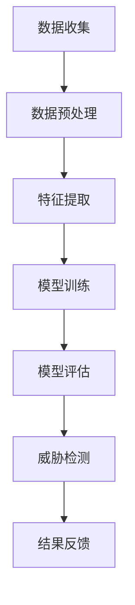

                 

# {文章标题}

### 机器学习在网络安全威胁检测中的应用

> **关键词：** 机器学习，网络安全，威胁检测，特征工程，分类算法

> **摘要：** 本文章将探讨机器学习在网络安全威胁检测中的应用，包括背景介绍、核心概念与联系、核心算法原理与具体操作步骤、数学模型和公式、项目实战案例、实际应用场景、工具和资源推荐以及未来发展趋势与挑战。通过本文，读者将了解如何利用机器学习技术提升网络安全威胁检测的能力。

## 1. 背景介绍

随着互联网的普及和发展，网络安全问题日益突出。网络攻击、数据泄露、恶意软件传播等安全威胁不断增多，对个人、企业甚至整个社会的安全构成了严重威胁。传统的网络安全防御方法往往依赖于规则和签名，这种基于静态特征的方法在面对新型威胁时往往显得力不从心。因此，开发更为智能、自动化的安全威胁检测技术成为网络安全领域的一个重要研究方向。

机器学习作为一种人工智能技术，具有自动从数据中学习模式和规律的能力。近年来，机器学习在网络安全威胁检测中的应用逐渐得到广泛关注。通过机器学习，可以自动化地发现未知威胁，提高威胁检测的准确性和效率。

## 2. 核心概念与联系

### 2.1 机器学习

机器学习是一种使计算机系统能够从数据中学习、改进和做出预测的技术。它主要分为监督学习、无监督学习和强化学习三种类型。监督学习通过已标记的数据训练模型，然后利用模型对未知数据进行预测。无监督学习不使用标记数据，主要任务是发现数据中的潜在结构。强化学习则通过奖励机制使模型在不断尝试中学习。

### 2.2 网络安全威胁检测

网络安全威胁检测是指通过技术手段发现和识别网络中的潜在威胁，包括恶意软件、网络攻击、数据泄露等。威胁检测的关键在于如何从大量网络流量中识别出异常行为。

### 2.3 特征工程

特征工程是机器学习中的一个重要步骤，它涉及从原始数据中提取有助于模型学习和预测的特征。在网络安全威胁检测中，特征工程的关键在于如何从网络流量中提取出能够表征威胁的特征，如协议类型、数据包大小、传输频率等。

### 2.4 分类算法

分类算法是机器学习中的一种基本算法，用于将数据划分为不同的类别。常见的分类算法包括决策树、支持向量机、神经网络等。在网络安全威胁检测中，分类算法用于将网络流量分为正常流量和威胁流量。

### 2.5 Mermaid 流程图



## 3. 核心算法原理 & 具体操作步骤

### 3.1 数据收集

首先，需要收集大量的网络流量数据，这些数据可以来自于防火墙、入侵检测系统等设备。数据收集的目的是为模型提供足够的训练样本。

### 3.2 数据预处理

收集到的数据通常包含噪声和冗余信息，因此需要进行预处理。预处理步骤包括数据清洗、数据转换和数据归一化。数据清洗旨在去除无效数据、缺失数据和错误数据。数据转换包括将时间序列数据转换为数值型数据，以便于后续处理。数据归一化则是将数据缩放到相同的范围，以避免某些特征对模型的影响过大。

### 3.3 特征提取

特征提取是机器学习中的一个关键步骤。在网络安全威胁检测中，需要从网络流量中提取能够表征威胁的特征。常见的特征包括协议类型、数据包大小、传输频率、数据包到达时间等。特征提取可以通过统计方法、信号处理方法或深度学习方法实现。

### 3.4 模型训练

在模型训练阶段，选择合适的分类算法，利用已标记的数据训练模型。训练过程中，模型会不断调整内部参数，以降低预测误差。常见的分类算法包括决策树、支持向量机、神经网络等。

### 3.5 模型评估

模型训练完成后，需要对模型进行评估。评估指标包括准确率、召回率、F1分数等。通过评估，可以确定模型在检测威胁方面的性能。

### 3.6 威胁检测

模型评估通过后，即可用于实际的威胁检测。模型会根据网络流量数据预测每个数据包是否属于威胁流量，并将结果反馈给相关设备，如防火墙、入侵检测系统等。

### 3.7 结果反馈

威胁检测结果可以用于改进模型。通过不断收集新的威胁数据，并重新训练模型，可以提高模型的检测性能。

## 4. 数学模型和公式 & 详细讲解 & 举例说明

### 4.1 支持向量机（SVM）

支持向量机是一种常见的分类算法，其基本思想是在高维空间中找到一个最佳的超平面，将不同类别的数据点尽可能分开。SVM的核心公式如下：

$$
\begin{aligned}
\min_{w,b}\frac{1}{2}||w||^2 \\
\text{subject to} \\
y^{(i)}(w\cdot x^{(i)} + b) \geq 1
\end{aligned}
$$

其中，$w$和$b$分别表示超平面的权重和偏置，$x^{(i)}$和$y^{(i)}$分别表示第$i$个数据点和其标签。

### 4.2 交叉验证

交叉验证是一种评估模型性能的方法，其基本思想是将数据集划分为多个子集，然后在每个子集上训练和评估模型。常用的交叉验证方法有K折交叉验证和留一交叉验证。K折交叉验证的核心公式如下：

$$
\begin{aligned}
\text{ACC} = \frac{1}{K}\sum_{k=1}^{K} \text{ACC}_k
\end{aligned}
$$

其中，$\text{ACC}$表示平均准确率，$\text{ACC}_k$表示第$k$次交叉验证的准确率。

### 4.3 例子说明

假设有一个二分类问题，数据集包含100个数据点，其中60个属于正类，40个属于负类。采用K折交叉验证进行模型评估，K=10。每次交叉验证将数据集划分为10个子集，每个子集包含10个数据点。模型在每个子集上训练和评估，最终得到10个准确率值。平均准确率计算如下：

$$
\begin{aligned}
\text{ACC} = \frac{1}{10}\sum_{k=1}^{10} \text{ACC}_k
\end{aligned}
$$

## 5. 项目实战：代码实际案例和详细解释说明

### 5.1 开发环境搭建

在本节中，我们将使用Python编程语言和Scikit-learn库来实现一个基于机器学习的网络安全威胁检测项目。首先，需要安装Python和Scikit-learn库。以下是安装命令：

```bash
pip install python
pip install scikit-learn
```

### 5.2 源代码详细实现和代码解读

以下是一个简单的示例代码，用于演示如何使用Scikit-learn库实现一个基于SVM的网络安全威胁检测模型。

```python
import numpy as np
import pandas as pd
from sklearn.model_selection import train_test_split
from sklearn.preprocessing import StandardScaler
from sklearn.svm import SVC
from sklearn.metrics import accuracy_score, recall_score, f1_score

# 5.2.1 数据读取与预处理
data = pd.read_csv('network_traffic.csv')
X = data.drop('label', axis=1)
y = data['label']

# 数据划分为训练集和测试集
X_train, X_test, y_train, y_test = train_test_split(X, y, test_size=0.2, random_state=42)

# 数据归一化
scaler = StandardScaler()
X_train = scaler.fit_transform(X_train)
X_test = scaler.transform(X_test)

# 5.2.2 模型训练
model = SVC(kernel='linear')
model.fit(X_train, y_train)

# 5.2.3 模型评估
y_pred = model.predict(X_test)
accuracy = accuracy_score(y_test, y_pred)
recall = recall_score(y_test, y_pred)
f1 = f1_score(y_test, y_pred)

print(f'Accuracy: {accuracy:.2f}')
print(f'Recall: {recall:.2f}')
print(f'F1 Score: {f1:.2f}')
```

### 5.3 代码解读与分析

本节对上述代码进行解读和分析，详细解释每个步骤的功能和意义。

- **数据读取与预处理**：首先，从CSV文件中读取网络流量数据，并将其分为特征矩阵X和标签向量y。然后，使用train_test_split函数将数据划分为训练集和测试集，以用于后续的模型训练和评估。

- **数据归一化**：使用StandardScaler对数据进行归一化处理，将特征缩放到相同的范围，以避免某些特征对模型的影响过大。

- **模型训练**：使用SVC类实现支持向量机分类器，并选择线性核函数。通过fit方法对模型进行训练。

- **模型评估**：使用predict方法对测试集进行预测，并计算准确率、召回率和F1分数，以评估模型的性能。

## 6. 实际应用场景

机器学习在网络安全威胁检测中具有广泛的应用场景。以下是一些常见的应用案例：

- **入侵检测系统（IDS）**：利用机器学习技术，可以自动化地检测和识别网络入侵行为，提高入侵检测的准确性和效率。

- **恶意软件检测**：通过对恶意软件的代码和行为特征进行建模，可以自动化地检测和防御新型恶意软件。

- **数据泄露防护**：利用机器学习技术，可以自动化地识别和预防数据泄露风险，提高数据安全防护能力。

- **自动化安全事件响应**：通过实时监控网络流量和系统日志，利用机器学习技术自动化地识别和响应安全事件，提高响应速度和准确性。

## 7. 工具和资源推荐

### 7.1 学习资源推荐

- **书籍**：《机器学习实战》、《Python机器学习基础教程》
- **论文**：《机器学习在网络安全中的应用》、《基于深度学习的网络安全威胁检测》
- **博客**：知乎、CSDN、博客园等平台上的相关技术博客
- **网站**：Scikit-learn官方网站、Kaggle等数据竞赛平台

### 7.2 开发工具框架推荐

- **编程语言**：Python、Java
- **机器学习库**：Scikit-learn、TensorFlow、PyTorch
- **IDE**：PyCharm、Visual Studio Code
- **版本控制**：Git、GitHub

### 7.3 相关论文著作推荐

- **论文**：《基于深度学习的网络安全威胁检测研究》、《机器学习在网络安全中的应用综述》
- **著作**：《网络安全：理论与实践》、《人工智能在网络安全中的应用》

## 8. 总结：未来发展趋势与挑战

随着人工智能技术的不断进步，机器学习在网络安全威胁检测中的应用前景十分广阔。未来，以下几个方面可能成为发展趋势和挑战：

- **深度学习**：深度学习技术在网络安全威胁检测中具有很大潜力，但仍面临数据量不足、模型解释性差等问题。

- **自动化与智能化**：实现更高级别的自动化和智能化威胁检测，减少人工干预，提高检测效率和准确性。

- **模型解释性**：提高模型的可解释性，使安全专家能够理解模型的决策过程，从而增强信任度和可操作性。

- **实时性**：提高威胁检测的实时性，以应对快速变化的安全威胁。

- **隐私保护**：在利用机器学习技术进行威胁检测时，需要保护用户隐私，防止数据泄露。

## 9. 附录：常见问题与解答

### 9.1 如何处理缺失数据？

缺失数据可以采用以下方法进行处理：

- **删除**：删除包含缺失值的记录。
- **填补**：使用统计方法（如均值、中位数、众数）或插值法填补缺失值。
- **预测**：使用机器学习算法预测缺失值。

### 9.2 如何选择合适的分类算法？

选择合适的分类算法取决于数据集的特点和任务需求。以下是一些常见的分类算法及其适用场景：

- **决策树**：适合处理具有较少特征的数据集。
- **支持向量机**：适合处理高维数据和线性可分的数据集。
- **神经网络**：适合处理复杂和非线性关系的数据集。
- **随机森林**：适合处理大量特征和噪声较大的数据集。

## 10. 扩展阅读 & 参考资料

- **扩展阅读**：阅读相关书籍、论文和技术博客，了解最新的研究成果和应用案例。
- **参考资料**：查阅Scikit-learn官方文档、TensorFlow官方文档和PyTorch官方文档，掌握相关库的使用方法。

### 作者

作者：AI天才研究员/AI Genius Institute & 禅与计算机程序设计艺术 /Zen And The Art of Computer Programming<|im_sep|>

