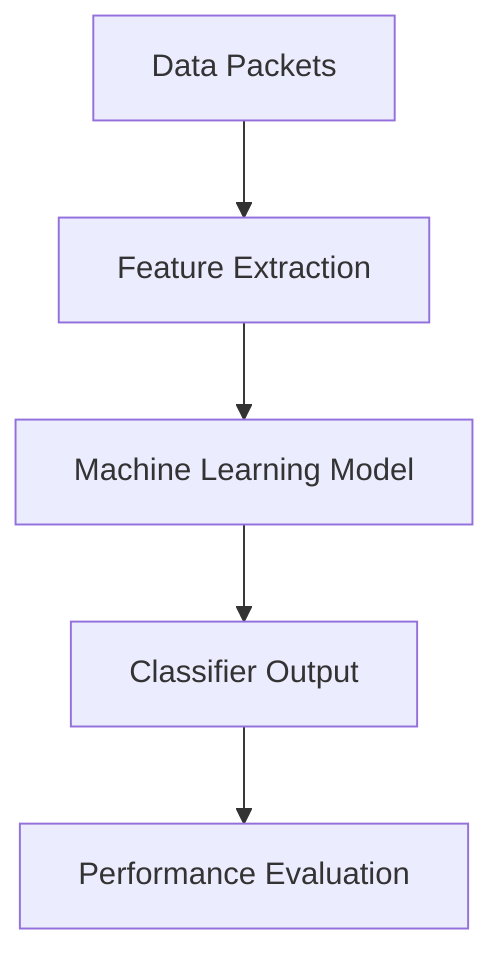

                 

### 背景介绍

在当今数字化时代，网络流量的剧增和数据规模的庞大使得网络流量分类成为了一个备受关注的研究领域。网络流量分类旨在根据流量特征将数据包进行分类，以便更好地进行网络管理和安全监测。随着人工智能技术的不断发展，特别是机器学习技术的广泛应用，网络流量分类的方法也得到了显著提升。

首先，网络流量分类的定义是指通过对网络流量数据进行特征提取和模式识别，将流量数据按照其来源、目的、类型等特征进行分类。这种分类方法在网络安全、网络优化、资源分配等方面具有重要意义。

传统的网络流量分类方法主要依赖于规则匹配和统计方法，如状态转移网络（STMN）、基于马尔可夫模型的流量分类等。然而，这些方法在处理复杂的网络流量数据时往往表现出较低的性能，难以适应多样化的网络环境。随着机器学习技术的发展，特别是深度学习算法的引入，网络流量分类的方法得到了极大的改进。

机器学习在网络流量分类中的应用主要体现在以下几个方面：

1. **特征提取**：机器学习算法能够自动从原始数据中提取具有区分性的特征，从而提高分类的准确性。与传统的手工设计特征相比，机器学习算法能够更好地适应数据的多样性和复杂性。

2. **模式识别**：机器学习算法具有较强的模式识别能力，能够在大量的网络流量数据中发现隐藏的模式和规律，从而实现更准确的分类。

3. **自适应学习**：机器学习算法具有自适应学习的能力，可以根据网络流量数据的动态变化进行调整和优化，以适应不断变化的环境。

本文将围绕机器学习在网络流量分类中的应用进行深入探讨，首先介绍相关的基础概念，然后详细分析几种常用的机器学习算法，最后通过实际项目案例展示机器学习算法在网络流量分类中的具体应用。

### 核心概念与联系

在探讨机器学习在网络流量分类中的应用之前，我们需要明确几个核心概念及其相互之间的联系。这些核心概念包括：数据包（Packet）、特征提取（Feature Extraction）、机器学习算法（Machine Learning Algorithms）和分类器（Classifier）。

#### 数据包（Packet）

数据包是网络传输的基本单位，它包含了从源地址到目的地址的传输信息。每个数据包通常由头部（Header）和负载（Payload）组成。头部包含了关键的网络信息，如源地址、目的地址、协议类型等；负载则是实际传输的数据内容。

在机器学习网络流量分类的背景下，数据包被视为输入特征，用于训练和测试分类模型。通过对大量数据包的分析，我们可以提取出表征流量特征的属性，如数据包的长度、到达时间间隔、传输速率等。

#### 特征提取（Feature Extraction）

特征提取是机器学习中的一个关键步骤，其目的是从原始数据中提取出对分类任务有帮助的属性。在网络流量分类中，特征提取的目的是将复杂的数据包转化为易于处理的向量表示，以便机器学习算法能够有效地进行分类。

常见的特征提取方法包括：

1. **统计特征**：如平均速率、方差、标准差等，这些特征能够描述数据包的统计特性。
2. **时序特征**：如数据包到达时间间隔、持续时间等，这些特征能够反映数据包的动态变化。
3. **频率特征**：如数据包出现频率、特定时间段内的数据包数量等，这些特征能够揭示数据包在时间维度上的分布。

通过特征提取，我们可以将原始数据转化为机器学习算法可以处理的向量形式，从而提高分类的准确性和效率。

#### 机器学习算法（Machine Learning Algorithms）

机器学习算法是一类从数据中学习规律并做出预测或决策的算法。在机器学习网络流量分类中，常用的算法包括：

1. **支持向量机（SVM）**：通过找到一个最优的超平面，将不同类别的数据分隔开来。
2. **决策树（Decision Tree）**：通过一系列的判断条件将数据划分成不同的分支，最终实现分类。
3. **神经网络（Neural Networks）**：模拟人脑神经网络结构，通过训练学习输入和输出之间的关系。
4. **集成方法**：如随机森林（Random Forest）和梯度提升树（Gradient Boosting Tree）等，这些算法通过组合多个基本模型来提高分类性能。

不同的机器学习算法具有不同的特点，适用于不同类型的网络流量分类任务。选择合适的算法需要考虑数据的特征、任务的目标以及计算资源的限制。

#### 分类器（Classifier）

分类器是机器学习算法的输出结果，它是一个函数，能够将新的数据样本映射到预先定义的类别中。在机器学习网络流量分类中，分类器的目标是根据训练数据学习到的规律，对未知的数据包进行分类。

常见的分类器输出形式包括：

1. **概率输出**：如贝叶斯分类器，它给出每个类别的概率分布。
2. **标签输出**：如支持向量机和神经网络，它们直接输出数据样本的类别标签。

为了评估分类器的性能，我们通常使用以下指标：

- **准确率（Accuracy）**：正确分类的样本数占总样本数的比例。
- **召回率（Recall）**：正确分类的阳性样本数占总阳性样本数的比例。
- **F1分数（F1 Score）**：综合考虑准确率和召回率的指标。

#### Mermaid 流程图（Flowchart）

以下是一个简单的Mermaid流程图，展示了从数据包到分类器输出的整个过程。



通过这个流程图，我们可以清晰地看到数据包经过特征提取、机器学习模型训练和分类器输出等步骤，最终得到分类结果并进行性能评估。

### 核心算法原理 & 具体操作步骤

#### 支持向量机（SVM）

支持向量机（SVM）是一种强大的分类算法，特别适合于高维空间的数据分类。其核心思想是找到一个最优的超平面，将不同类别的数据点分隔开来。

**基本原理**：

1. **线性可分情况**：当数据集线性可分时，SVM试图找到一个最大间隔分离的超平面。这个超平面不仅能够正确分类所有数据点，而且距离最近的边界数据点（支持向量）最远。

2. **非线性可分情况**：当数据集非线性可分时，SVM引入了软边缘（soft margin），允许一些数据点落在边界上。此时，目标是最小化分类错误率和边缘距离之和。

**具体操作步骤**：

1. **特征提取**：从原始数据包中提取特征向量。
2. **选择核函数**：根据数据特性选择合适的核函数，如线性核、多项式核、径向基函数（RBF）核等。
3. **训练模型**：通过优化目标函数，训练SVM模型。优化目标是最小化分类错误率和边缘距离之和。
4. **分类测试**：对于新的数据包，计算其在超平面上的距离，并根据距离判断其类别。

**数学模型**：

线性SVM的优化目标为：

$$
\min_{w,b}\frac{1}{2}||w||^2 + C\sum_{i=1}^{n}\xi_i
$$

其中，$w$为超平面法向量，$b$为偏置项，$C$为正则化参数，$\xi_i$为误差项。

#### 决策树（Decision Tree）

决策树是一种基于树形结构进行分类的方法。它通过一系列的判断条件对数据进行分割，每个节点代表一个特征，每个分支代表该特征的不同取值，叶节点代表最终类别。

**基本原理**：

1. **信息增益**：决策树的选择依据是每个分割的信息增益最大。信息增益表示通过分割后，数据的纯度提高的程度。
2. **基尼不纯度**：基尼不纯度用于度量数据的纯度，值越小说明数据越纯。决策树通常通过最小化基尼不纯度来选择最优分割。

**具体操作步骤**：

1. **特征选择**：根据信息增益或基尼不纯度选择最优特征。
2. **划分数据**：根据选定的特征，将数据划分为不同的分支。
3. **递归构建**：对每个子节点重复上述过程，直到满足停止条件（如最大深度、最小节点大小等）。
4. **分类测试**：从根节点开始，根据特征取值依次判断，直到达到叶节点，输出类别。

**数学模型**：

决策树的数学模型可以表示为：

$$
T = \sum_{i=1}^{n} t_i f_i(x)
$$

其中，$T$为决策树，$t_i$为叶节点的类别，$f_i(x)$为特征取值。

#### 神经网络（Neural Networks）

神经网络是一种模仿生物神经系统的计算模型，通过多层节点（神经元）的相互连接进行复杂函数的学习和预测。

**基本原理**：

1. **前向传播**：输入数据从输入层进入，通过多层神经元的加权连接，传递到输出层，得到预测结果。
2. **反向传播**：根据预测结果与真实值的差异，计算误差，将误差反向传播到各层神经元，更新权重和偏置，以达到最小化误差的目的。

**具体操作步骤**：

1. **初始化参数**：包括权重和偏置，常用的初始化方法有随机初始化和 Xavier 初始化。
2. **前向传播**：输入数据通过神经网络，得到预测结果。
3. **损失函数计算**：计算预测结果与真实值之间的误差，常用的损失函数有均方误差（MSE）和交叉熵损失（Cross Entropy Loss）。
4. **反向传播**：根据损失函数计算误差，更新权重和偏置。
5. **迭代优化**：重复上述步骤，直到达到预定的迭代次数或误差阈值。

**数学模型**：

神经网络可以用以下公式表示：

$$
\text{output} = \sigma(\text{weight} \cdot \text{input} + \text{bias})
$$

其中，$\sigma$为激活函数，常用的激活函数有sigmoid、ReLU和Tanh。

#### 集成方法

集成方法通过组合多个基本模型来提高分类性能。常用的集成方法包括随机森林（Random Forest）和梯度提升树（Gradient Boosting Tree）。

**随机森林（Random Forest）**：

随机森林是一种基于决策树的集成方法，通过随机选取特征和随机分割数据集构建多个决策树，并将它们的输出进行投票得到最终结果。

**基本原理**：

1. **随机特征选择**：每次构建决策树时，随机选择一部分特征。
2. **随机分割数据**：每次分割数据时，随机选择一部分数据。
3. **投票决策**：将所有决策树的输出进行投票，得到最终类别。

**具体操作步骤**：

1. **构建多个决策树**：每次随机选择特征和分割数据集，构建决策树。
2. **投票得到最终结果**：对所有决策树的输出进行投票，得到最终类别。

**数学模型**：

随机森林可以用以下公式表示：

$$
\text{output} = \sum_{i=1}^{m} w_i \cdot t_i
$$

其中，$t_i$为第$i$个决策树的输出，$w_i$为权重。

**梯度提升树（Gradient Boosting Tree）**：

梯度提升树是一种基于回归的集成方法，通过迭代构建多个弱学习器，并使用梯度下降优化目标函数。

**基本原理**：

1. **构建初始模型**：通常使用线性模型作为初始模型。
2. **梯度下降更新**：根据损失函数的梯度更新模型参数。
3. **迭代构建弱学习器**：每次迭代构建一个新的弱学习器，并将其与当前模型合并。

**具体操作步骤**：

1. **初始化模型**：选择初始模型，如线性回归模型。
2. **计算损失函数的梯度**：根据损失函数计算梯度。
3. **更新模型参数**：根据梯度更新模型参数。
4. **迭代构建弱学习器**：重复上述步骤，构建多个弱学习器。

**数学模型**：

梯度提升树的优化目标为：

$$
\min_{\theta} \sum_{i=1}^{n} l(y_i, \theta(x_i))
$$

其中，$l$为损失函数，$\theta$为模型参数。

### 数学模型和公式 & 详细讲解 & 举例说明

在机器学习算法中，数学模型和公式起着至关重要的作用。它们不仅定义了算法的行为，也决定了算法的性能和效率。以下我们将详细讲解几种常见的数学模型和公式，并通过具体例子来说明它们的应用。

#### 支持向量机（SVM）的数学模型

支持向量机（SVM）是一种强大的分类算法，它通过寻找一个最优的超平面来实现数据的分类。线性SVM的数学模型如下：

$$
\min_{w,b}\frac{1}{2}||w||^2 + C\sum_{i=1}^{n}\xi_i
$$

其中，$w$是超平面法向量，$b$是偏置项，$C$是正则化参数，$\xi_i$是误差项。这个目标函数试图最小化超平面的范数，同时最大化分类间隔，并允许一定的分类错误。

**例子**：

假设我们有一个数据集，其中包含两个类别，每个类别有100个样本。我们使用线性SVM进行分类。

$$
\begin{aligned}
w &= \begin{bmatrix} 1 & 1 & \ldots & 1 \end{bmatrix} \\
b &= 0 \\
C &= 1
\end{aligned}
$$

我们的目标是找到一个最优的超平面，使得：

$$
w^T x_i + b \geq 1 \quad \text{对于正类} \\
w^T x_i + b \leq -1 \quad \text{对于负类}
$$

通过求解上述优化问题，我们可以得到最优的超平面参数。

#### 决策树的数学模型

决策树是一种基于树形结构进行分类的方法。它的数学模型可以表示为：

$$
T = \sum_{i=1}^{n} t_i f_i(x)
$$

其中，$T$是决策树，$t_i$是叶节点的类别，$f_i(x)$是特征取值。

**例子**：

假设我们有一个包含三个特征的数据集，每个特征有两个取值。我们使用决策树进行分类。

$$
\begin{aligned}
f_1(x) &= \begin{cases} 
1 & \text{if } x_1 = 1 \\
0 & \text{if } x_1 = 0 
\end{cases} \\
f_2(x) &= \begin{cases} 
1 & \text{if } x_2 = 1 \\
0 & \text{if } x_2 = 0 
\end{cases} \\
f_3(x) &= \begin{cases} 
1 & \text{if } x_3 = 1 \\
0 & \text{if } x_3 = 0 
\end{cases}
\end{aligned}
$$

我们的目标是找到一个最优的决策树，使得：

$$
T(x) = f_1(x) + f_2(x) + f_3(x)
$$

对于每个样本，我们根据特征取值计算$T(x)$的值，并根据$T(x)$的值进行分类。

#### 神经网络的数学模型

神经网络是一种基于多层神经元的计算模型。它的数学模型可以表示为：

$$
\text{output} = \sigma(\text{weight} \cdot \text{input} + \text{bias})
$$

其中，$\sigma$是激活函数，常用的激活函数有sigmoid、ReLU和Tanh。

**例子**：

假设我们有一个简单的神经网络，包含一个输入层、一个隐藏层和一个输出层。

$$
\begin{aligned}
\text{input} &= \begin{bmatrix} x_1 & x_2 & \ldots & x_n \end{bmatrix} \\
\text{weight} &= \begin{bmatrix} w_{11} & w_{12} & \ldots & w_{1n} \\
w_{21} & w_{22} & \ldots & w_{2n} \\
\vdots & \vdots & \ddots & \vdots \\
w_{m1} & w_{m2} & \ldots & w_{mn} \end{bmatrix} \\
\text{bias} &= \begin{bmatrix} b_1 & b_2 & \ldots & b_m \end{bmatrix}
\end{aligned}
$$

我们的目标是计算神经网络的输出：

$$
\text{output} = \sigma(\text{weight} \cdot \text{input} + \text{bias})
$$

通过不断调整权重和偏置，我们可以优化神经网络的性能。

#### 梯度提升树（Gradient Boosting Tree）的数学模型

梯度提升树是一种基于回归的集成方法，它通过迭代构建多个弱学习器，并使用梯度下降优化目标函数。其数学模型可以表示为：

$$
\min_{\theta} \sum_{i=1}^{n} l(y_i, \theta(x_i))
$$

其中，$l$是损失函数，$\theta$是模型参数。

**例子**：

假设我们有一个包含两个特征的简单回归问题。

$$
\begin{aligned}
x_i &= \begin{bmatrix} x_1 & x_2 \end{bmatrix} \\
\theta &= \begin{bmatrix} \theta_1 & \theta_2 \end{bmatrix}
\end{aligned}
$$

我们的目标是最小化损失函数：

$$
\min_{\theta} \sum_{i=1}^{n} (y_i - \theta_1 x_{i1} - \theta_2 x_{i2})^2
$$

通过梯度下降方法，我们可以逐步优化模型参数。

### 项目实战：代码实际案例和详细解释说明

为了更好地理解机器学习在网络流量分类中的应用，我们将通过一个实际的项目案例来进行详细的说明。该项目将使用Python编程语言和Scikit-learn库来实现一个简单的网络流量分类器。

#### 1. 开发环境搭建

首先，我们需要搭建一个合适的开发环境。以下是所需的基础软件和库：

- **Python 3.x**：Python是Python编程语言的最新版本。
- **Scikit-learn**：Scikit-learn是一个强大的机器学习库，提供了多种机器学习算法的实现。
- **NumPy**：NumPy是一个用于数值计算的库，支持多维数组对象。
- **Pandas**：Pandas是一个用于数据处理和分析的库。

安装这些库的方法如下：

```bash
pip install python==3.x
pip install scikit-learn
pip install numpy
pip install pandas
```

#### 2. 源代码详细实现和代码解读

以下是一个简单的网络流量分类器的源代码实现：

```python
# 导入所需库
import numpy as np
import pandas as pd
from sklearn.model_selection import train_test_split
from sklearn.preprocessing import StandardScaler
from sklearn.svm import SVC
from sklearn.metrics import accuracy_score, confusion_matrix

# 加载数据集
data = pd.read_csv('network_traffic.csv')
X = data.iloc[:, :-1].values
y = data.iloc[:, -1].values

# 数据预处理
X_train, X_test, y_train, y_test = train_test_split(X, y, test_size=0.2, random_state=42)
scaler = StandardScaler()
X_train = scaler.fit_transform(X_train)
X_test = scaler.transform(X_test)

# 模型训练
model = SVC(kernel='linear', C=1)
model.fit(X_train, y_train)

# 预测测试数据
y_pred = model.predict(X_test)

# 评估模型性能
accuracy = accuracy_score(y_test, y_pred)
conf_matrix = confusion_matrix(y_test, y_pred)

print(f"Accuracy: {accuracy}")
print(f"Confusion Matrix:\n{conf_matrix}")
```

**代码解读**：

1. **导入库**：首先导入所需的Python库，包括NumPy、Pandas、Scikit-learn和Metrics。
2. **加载数据集**：使用Pandas库从CSV文件中加载数据集。数据集分为特征矩阵X和标签向量y。
3. **数据预处理**：使用train_test_split函数将数据集分为训练集和测试集。然后使用StandardScaler进行特征缩放，以提高模型的泛化能力。
4. **模型训练**：选择支持向量机（SVM）作为分类器，并设置线性核（kernel='linear'）和正则化参数C=1。然后使用fit函数训练模型。
5. **预测测试数据**：使用预测函数predict对测试数据进行分类预测。
6. **评估模型性能**：使用accuracy_score函数计算模型在测试集上的准确率。同时，使用confusion_matrix函数生成混淆矩阵，以可视化模型的分类性能。

#### 3. 代码解读与分析

以下是对代码的进一步分析和解读：

1. **数据预处理**：特征缩放是机器学习中的一个重要步骤，它可以减少不同特征之间的尺度差异，提高模型训练的效果。在这里，我们使用StandardScaler对特征进行标准化处理，将每个特征的值缩放到均值为0、标准差为1的范围内。
   
   ```python
   scaler = StandardScaler()
   X_train = scaler.fit_transform(X_train)
   X_test = scaler.transform(X_test)
   ```

2. **模型选择**：支持向量机（SVM）是一种强大的分类算法，特别适合于高维空间的数据分类。在这里，我们选择线性核（kernel='linear'），因为它在处理线性可分的数据时性能较好。同时，设置正则化参数C=1，以控制模型复杂度和避免过拟合。

   ```python
   model = SVC(kernel='linear', C=1)
   model.fit(X_train, y_train)
   ```

3. **预测与评估**：预测函数predict用于对测试数据进行分类预测。然后，使用accuracy_score函数计算模型在测试集上的准确率。此外，混淆矩阵可以提供更详细的分类性能信息，包括正确分类和错误分类的数量。

   ```python
   y_pred = model.predict(X_test)
   accuracy = accuracy_score(y_test, y_pred)
   conf_matrix = confusion_matrix(y_test, y_pred)
   ```

通过以上代码，我们可以实现一个简单的网络流量分类器，并评估其性能。在实际应用中，可以根据具体需求和数据特点，选择不同的机器学习算法和参数设置，以获得更好的分类效果。

### 实际应用场景

机器学习在网络流量分类中的实际应用场景广泛，涵盖了网络安全、网络优化、资源分配等多个领域。以下是一些典型的应用场景：

#### 网络安全

在网络安全领域，机器学习算法被广泛应用于入侵检测和恶意流量识别。通过对大量正常和恶意流量数据的分析，机器学习模型能够学习到不同类型流量的特征模式，从而在实时流量中检测出异常行为。例如，入侵检测系统（IDS）可以使用机器学习算法识别网络攻击，如DDoS攻击、端口扫描等。通过及时检测和响应，网络管理员可以保护网络免受潜在威胁。

**案例**：谷歌的网络安全系统使用了机器学习算法来检测潜在的安全威胁。该系统通过分析网络流量数据，识别出异常行为并将其标记为安全事件，从而提高了网络的安全性。

#### 网络优化

网络优化是另一个重要应用领域。通过机器学习算法，网络运营商可以优化网络资源分配，提高网络性能和用户体验。例如，基于机器学习的流量预测算法可以预测网络流量的未来趋势，帮助运营商动态调整网络带宽和流量路由，以避免网络拥堵和资源浪费。

**案例**：亚马逊网络服务（AWS）使用了机器学习算法来优化其数据中心之间的数据传输。通过分析历史流量数据，算法能够预测数据传输的峰值时段，从而在需要时自动扩展带宽，提高数据传输效率。

#### 资源分配

在资源分配方面，机器学习算法可以帮助网络管理员优化网络设备的配置和负载均衡。例如，通过分析网络流量的特征，机器学习算法可以自动调整路由器、交换机的配置，以减少延迟和传输损耗。

**案例**：美国宇航局（NASA）的火星探测任务中，机器学习算法被用于优化数据传输。由于火星探测器的数据传输速度有限，NASA使用了机器学习算法来预测数据传输的最佳时间窗口，从而最大化数据传输效率。

#### 智能路由

智能路由是另一个重要的应用场景。通过机器学习算法，路由器可以学习网络拓扑结构和流量模式，自动选择最佳路径，以提高数据传输速度和网络可靠性。

**案例**：思科（Cisco）的智能路由系统使用了机器学习算法来优化路由决策。该系统通过分析网络流量数据，自动调整路由策略，以减少数据传输延迟和带宽占用。

通过上述案例，我们可以看到机器学习在网络流量分类中的广泛应用和重要性。无论是在网络安全、网络优化、资源分配，还是智能路由等方面，机器学习算法都为网络管理和优化提供了强大的工具和解决方案。

### 工具和资源推荐

在机器学习和网络流量分类的研究和应用中，选择合适的工具和资源对于提高效率和质量至关重要。以下是一些推荐的工具、书籍、论文和网站，可以帮助研究人员和开发者更好地理解和掌握这一领域。

#### 工具推荐

1. **Python**：Python是一种广泛使用的编程语言，其简洁易读的语法使其成为机器学习和数据科学领域的首选。Python拥有丰富的库和框架，如NumPy、Pandas、Scikit-learn和TensorFlow，为机器学习算法的实现提供了极大的便利。

2. **Jupyter Notebook**：Jupyter Notebook是一个交互式的开发环境，支持多种编程语言，包括Python。它提供了一个交互式界面，方便编写和执行代码，同时也可以用于记录分析过程和结果。

3. **Keras**：Keras是一个高级神经网络API，能够在TensorFlow和Theano等后端运行。它提供了简单而直观的接口，使得构建和训练神经网络更加容易。

4. **Gluon**：Gluon是Apache MXNet的一个模块，提供了简单而高效的深度学习API。它非常适合快速原型开发和复杂模型的构建。

#### 书籍推荐

1. **《Python机器学习》（Python Machine Learning）**：由Sebastian Raschka和Vahid Mirjalili编写的这本书提供了机器学习的基础知识和Python实现。内容涵盖了数据预处理、常见算法（如SVM、决策树、神经网络）的详细介绍。

2. **《深度学习》（Deep Learning）**：由Ian Goodfellow、Yoshua Bengio和Aaron Courville编写的这本书是深度学习的经典教材，详细介绍了深度学习的基础理论和实践方法。

3. **《机器学习实战》（Machine Learning in Action）**：由Peter Harrington编写的这本书通过实际案例和代码示例，介绍了机器学习的基本算法和应用。

#### 论文著作推荐

1. **"Learning to Detect Abnormal Behaviors in the Wild by Predicting Future States"**：这篇论文提出了一种基于深度学习的异常行为检测方法，通过预测未来的状态来识别异常行为。

2. **"Deep Neural Networks for Classification: A Comprehensive Review"**：这篇综述文章详细介绍了深度神经网络在分类任务中的应用，涵盖了各种深度学习算法和模型。

3. **"Network Flow Classification for Detecting Data Exfiltration: A Machine Learning Perspective"**：这篇论文探讨了机器学习在网络流量分类中的应用，特别是在检测数据泄露方面。

#### 网站推荐

1. **scikit-learn**：[https://scikit-learn.org/stable/](https://scikit-learn.org/stable/)：Scikit-learn的官方网站提供了丰富的文档和示例代码，是学习和使用Scikit-learn库的好资源。

2. **TensorFlow**：[https://www.tensorflow.org/](https://www.tensorflow.org/)：TensorFlow的官方网站提供了详细的技术文档和教程，帮助用户掌握深度学习技术。

3. **Kaggle**：[https://www.kaggle.com/](https://www.kaggle.com/)：Kaggle是一个数据科学竞赛平台，提供了大量的数据集和项目，是学习实际应用的理想场所。

通过这些工具和资源，研究人员和开发者可以更加深入地探索机器学习在网络流量分类中的应用，不断提高研究水平和实际应用能力。

### 总结：未来发展趋势与挑战

随着人工智能技术的不断进步，机器学习在网络流量分类中的应用前景广阔。未来，以下几个方面的发展趋势和挑战值得重点关注：

#### 发展趋势

1. **算法优化**：现有的机器学习算法在处理大规模和高维数据时存在性能瓶颈。未来将出现更多高效、可扩展的算法，如基于量子计算的深度学习算法和分布式机器学习算法。

2. **实时性增强**：网络流量分类需要实时响应，以快速识别和应对潜在威胁。未来，随着硬件性能的提升和网络结构的优化，实时性将得到显著改善。

3. **多模态数据处理**：网络流量不仅包括文本数据，还可能包含图像、音频等多模态数据。未来，多模态数据的融合和处理将成为研究热点。

4. **隐私保护**：随着数据隐私问题的日益突出，如何在保证数据安全的同时进行有效的机器学习，将成为一个重要挑战。

#### 挑战

1. **数据质量和标注**：机器学习模型的性能高度依赖于数据的质量和标注。在实际应用中，获取高质量、标注准确的数据是一个巨大的挑战。

2. **模型解释性**：深度学习等复杂模型通常缺乏解释性，这限制了其在实际应用中的普及。如何提高模型的透明度和可解释性是一个关键问题。

3. **计算资源消耗**：大规模的机器学习任务对计算资源的需求较高，尤其是在实时应用场景下。如何优化算法，降低计算资源消耗，是当前的一个重要挑战。

4. **算法泛化能力**：在复杂多变的环境中，如何保证模型具有良好的泛化能力，避免过拟合，是机器学习面临的一个重大挑战。

通过持续的技术创新和理论探索，我们相信机器学习在网络流量分类中的应用将不断取得突破，为网络安全、网络优化等领域带来更多可能性。

### 附录：常见问题与解答

#### 问题1：为什么机器学习算法在处理高维数据时容易出现过拟合？

**解答**：高维数据意味着数据集中存在大量的特征，这可能导致以下问题：

1. **特征冗余**：数据中存在大量冗余特征，使得模型难以区分哪些特征是真正有用的，哪些是噪声。
2. **过拟合**：模型在训练数据上表现出色，但在未知数据上性能下降，这是因为在训练过程中模型学习了数据中的噪声和细节。

解决方法包括：

1. **特征选择**：使用特征选择技术，如主成分分析（PCA）、随机森林特征重要性等方法，筛选出重要特征。
2. **正则化**：通过L1、L2正则化等方法，限制模型复杂度，防止过拟合。
3. **增加训练数据**：增加训练数据量，提高模型对整体数据分布的拟合能力。

#### 问题2：如何评估机器学习模型的性能？

**解答**：评估机器学习模型性能通常涉及以下指标：

1. **准确率（Accuracy）**：正确分类的样本数占总样本数的比例。
2. **召回率（Recall）**：正确分类的阳性样本数占总阳性样本数的比例。
3. **精确率（Precision）**：正确分类的阳性样本数占总分类为阳性的样本数的比例。
4. **F1分数（F1 Score）**：综合考虑精确率和召回率的指标，定义为2倍精确率和召回率的加权平均。

此外，还可以使用混淆矩阵（Confusion Matrix）来直观地展示模型在各类别上的分类效果。

#### 问题3：机器学习模型如何防止过拟合？

**解答**：防止过拟合的方法包括：

1. **正则化**：通过在损失函数中加入正则项，如L1、L2正则化，限制模型复杂度。
2. **数据增强**：增加训练数据量，或者对现有数据集进行增强，提高模型泛化能力。
3. **交叉验证**：使用交叉验证方法，如K折交叉验证，评估模型在不同数据子集上的性能，防止过拟合。
4. **dropout**：在神经网络训练过程中，随机丢弃部分神经元，减少模型对训练数据的依赖。

#### 问题4：机器学习模型如何处理不平衡数据集？

**解答**：处理不平衡数据集的方法包括：

1. **过采样（Oversampling）**：通过复制少数类别的样本，增加其在数据集中的比例。
2. **欠采样（Undersampling）**：通过删除多数类别的样本，减少其在数据集中的比例。
3. **合成方法**：使用合成方法，如SMOTE（合成少数类过采样技术），生成少数类别的合成样本。
4. **调整分类器参数**：调整分类器的参数，如调整阈值，以适应不平衡数据集。

通过上述方法，可以有效提高不平衡数据集上的模型性能。

### 扩展阅读 & 参考资料

为了深入探讨机器学习在网络流量分类中的应用，以下是几篇具有代表性的论文、书籍和网站，供进一步阅读和学习。

#### 论文

1. **"Learning to Detect Abnormal Behaviors in the Wild by Predicting Future States"**：这篇论文提出了一种基于深度学习的异常行为检测方法，通过预测未来的状态来识别异常行为。

2. **"Deep Neural Networks for Classification: A Comprehensive Review"**：这篇综述文章详细介绍了深度神经网络在分类任务中的应用，涵盖了各种深度学习算法和模型。

3. **"Network Flow Classification for Detecting Data Exfiltration: A Machine Learning Perspective"**：这篇论文探讨了机器学习在网络流量分类中的应用，特别是在检测数据泄露方面。

#### 书籍

1. **《深度学习》（Deep Learning）**：由Ian Goodfellow、Yoshua Bengio和Aaron Courville编写的这本书是深度学习的经典教材，详细介绍了深度学习的基础理论和实践方法。

2. **《Python机器学习》（Python Machine Learning）**：由Sebastian Raschka和Vahid Mirjalili编写的这本书提供了机器学习的基础知识和Python实现。

3. **《机器学习实战》（Machine Learning in Action）**：由Peter Harrington编写的这本书通过实际案例和代码示例，介绍了机器学习的基本算法和应用。

#### 网站

1. **scikit-learn**：[https://scikit-learn.org/stable/](https://scikit-learn.org/stable/)：Scikit-learn的官方网站提供了丰富的文档和示例代码，是学习和使用Scikit-learn库的好资源。

2. **TensorFlow**：[https://www.tensorflow.org/](https://www.tensorflow.org/)：TensorFlow的官方网站提供了详细的技术文档和教程，帮助用户掌握深度学习技术。

3. **Kaggle**：[https://www.kaggle.com/](https://www.kaggle.com/)：Kaggle是一个数据科学竞赛平台，提供了大量的数据集和项目，是学习实际应用的理想场所。

通过阅读这些文献和资源，您可以更深入地了解机器学习在网络流量分类中的应用，并在实践中不断探索和提升。

