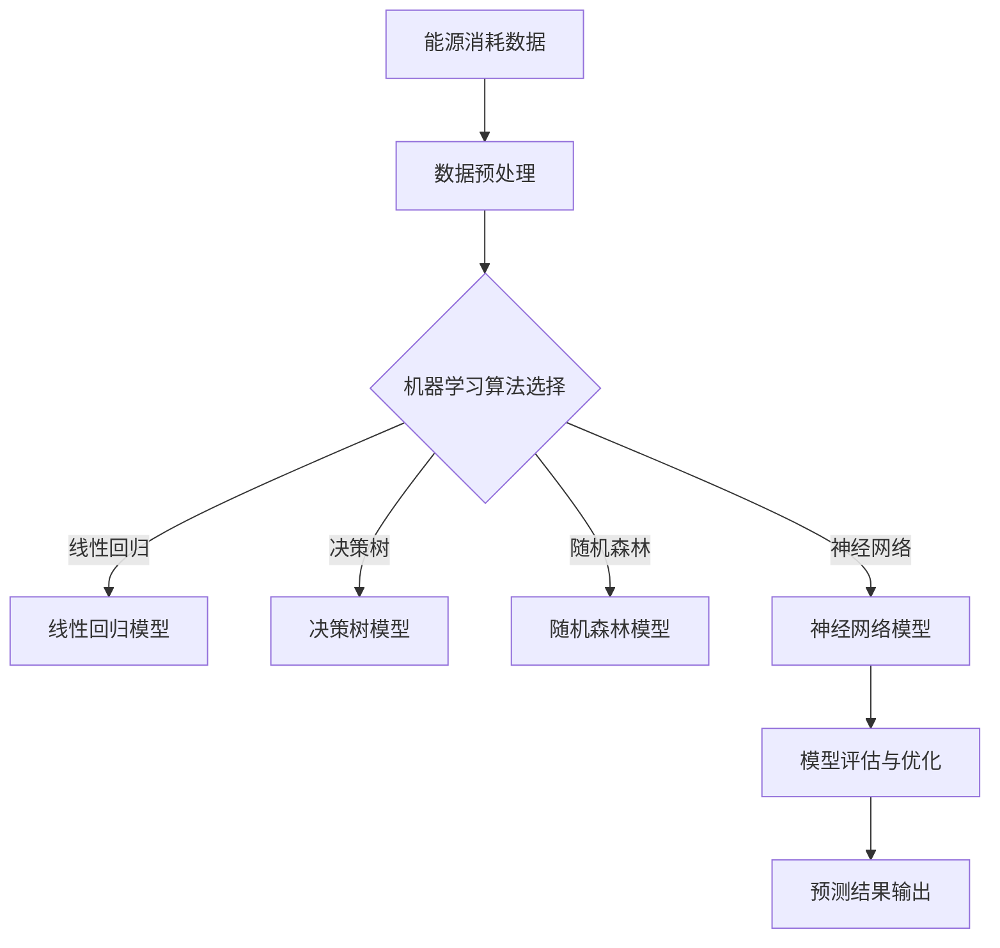

                 

## 机器学习在能源消耗预测中的应用

### 关键词：能源消耗预测、机器学习、数据驱动、智能电网、节能减排

### 摘要

本文深入探讨了机器学习在能源消耗预测中的应用，首先介绍了能源消耗预测的重要性以及当前主流的预测方法。随后，本文详细介绍了机器学习的基本概念及其在能源消耗预测中的优势，并着重讲解了常见的机器学习算法，如线性回归、决策树、随机森林和神经网络等。通过具体案例，本文展示了如何使用机器学习算法对能源消耗进行预测。最后，本文讨论了实际应用场景、工具和资源推荐，并对未来发展趋势和挑战进行了展望。

## 1. 背景介绍

随着全球经济的发展和人口增长，能源消耗量不断增加。能源消耗预测对于确保能源供应的稳定性和可持续性具有重要意义。准确的能源消耗预测可以帮助能源企业合理安排生产计划，优化资源配置，降低运营成本。同时，对于电力系统调度、智能电网建设以及节能减排等方面也具有重要的指导作用。

传统的能源消耗预测方法主要依赖于统计模型和经验法则。这些方法在一定程度上能够捕捉能源消耗的规律，但由于其固定性和局限性，往往难以适应复杂多变的能源消耗模式。近年来，随着机器学习技术的发展，基于数据驱动的能源消耗预测方法逐渐得到广泛应用。机器学习算法具有自动学习和自适应能力，能够从大量的历史数据中提取出有用的信息，从而提高预测的准确性和可靠性。

## 2. 核心概念与联系

### 2.1 机器学习基本概念

机器学习（Machine Learning）是一种人工智能（Artificial Intelligence, AI）的分支，主要研究如何让计算机从数据中自动学习和改进性能。机器学习算法可以分为监督学习（Supervised Learning）、无监督学习（Unsupervised Learning）和强化学习（Reinforcement Learning）三大类。

- **监督学习**：输入特征和输出标签已知，通过学习得到特征和标签之间的映射关系。
- **无监督学习**：输入特征未知，通过学习得到数据的内在结构和规律。
- **强化学习**：通过与环境的交互来学习策略，以最大化某种累积奖励。

### 2.2 能源消耗预测与机器学习的关系

能源消耗预测是一个典型的监督学习问题。在能源消耗预测中，输入特征包括时间、天气、温度、湿度等因素，输出标签是实际能源消耗量。通过学习输入特征和输出标签之间的映射关系，机器学习算法可以实现对未来能源消耗的预测。

### 2.3 Mermaid 流程图



## 3. 核心算法原理 & 具体操作步骤

### 3.1 线性回归

线性回归（Linear Regression）是一种简单的机器学习算法，适用于处理线性关系的预测问题。其基本原理是通过最小二乘法（Least Squares Method）找到输入特征和输出标签之间的线性关系。

- **模型公式**：\( y = \beta_0 + \beta_1 \cdot x \)
- **最小二乘法**：最小化残差平方和，即 \( \min \sum (y_i - \hat{y}_i)^2 \)

### 3.2 决策树

决策树（Decision Tree）是一种基于树形结构进行决策的算法。其基本原理是通过一系列规则对输入特征进行划分，从而生成一个预测模型。

- **基本结构**：每个节点表示一个特征，每个分支表示特征的一个取值，叶节点表示预测结果。
- **构建方法**：通常使用信息增益（Information Gain）或基尼系数（Gini Index）来选择最优特征。

### 3.3 随机森林

随机森林（Random Forest）是一种基于决策树集成的算法。其基本原理是通过随机抽样和随机特征选择构建多个决策树，并利用集成学习（Ensemble Learning）的方法来提高预测性能。

- **模型公式**：\( \hat{y} = \sum \hat{y}_i \cdot w_i \)
- **随机特征选择**：在构建每个决策树时，从特征空间中随机选择一部分特征进行划分。

### 3.4 神经网络

神经网络（Neural Network）是一种模拟生物神经系统的计算模型。其基本原理是通过多层神经元进行信息传递和变换，从而实现复杂的非线性预测。

- **基本结构**：包括输入层、隐藏层和输出层。
- **激活函数**：常用的激活函数有 sigmoid、ReLU 和 tanh 等。
- **反向传播算法**：用于计算梯度并更新模型参数。

## 4. 数学模型和公式 & 详细讲解 & 举例说明

### 4.1 线性回归

#### 模型公式

$$
y = \beta_0 + \beta_1 \cdot x
$$

其中，\( \beta_0 \) 和 \( \beta_1 \) 分别为模型参数，表示截距和斜率。

#### 最小二乘法

$$
\min \sum (y_i - \hat{y}_i)^2
$$

其中，\( \hat{y}_i = \beta_0 + \beta_1 \cdot x_i \) 为预测值，\( y_i \) 为实际值。

#### 举例说明

假设我们有以下数据集：

| \( x \) | \( y \) |
|--------|--------|
| 1      | 2      |
| 2      | 4      |
| 3      | 6      |

使用线性回归模型预测 \( x = 4 \) 时的 \( y \) 值。

首先，计算样本均值：

$$
\bar{x} = \frac{1 + 2 + 3}{3} = 2 \\
\bar{y} = \frac{2 + 4 + 6}{3} = 4
$$

然后，计算斜率 \( \beta_1 \)：

$$
\beta_1 = \frac{\sum (x_i - \bar{x})(y_i - \bar{y})}{\sum (x_i - \bar{x})^2} = \frac{(1 - 2)(2 - 4) + (2 - 2)(4 - 4) + (3 - 2)(6 - 4)}{(1 - 2)^2 + (2 - 2)^2 + (3 - 2)^2} = 2
$$

最后，计算截距 \( \beta_0 \)：

$$
\beta_0 = \bar{y} - \beta_1 \cdot \bar{x} = 4 - 2 \cdot 2 = 0
$$

因此，线性回归模型为 \( y = 0 + 2 \cdot x \)。

预测 \( x = 4 \) 时的 \( y \) 值：

$$
\hat{y} = 0 + 2 \cdot 4 = 8
$$

### 4.2 决策树

#### 基本结构

决策树由多个节点和边组成，每个节点表示一个特征，每个分支表示特征的一个取值，叶节点表示预测结果。

#### 构建方法

- **信息增益**：选择具有最大信息增益的特征进行划分。
- **基尼系数**：选择具有最小基尼系数的特征进行划分。

#### 举例说明

假设我们有以下数据集：

| \( x_1 \) | \( x_2 \) | \( y \) |
|----------|----------|--------|
| 0        | 0        | 0      |
| 0        | 1        | 1      |
| 1        | 0        | 1      |
| 1        | 1        | 0      |

使用信息增益构建决策树。

首先，计算每个特征的信息增益：

- \( x_1 \) 的信息增益：
$$
I(G) = \sum (-p(y) \log_2 p(y)) = (-\frac{2}{4} \log_2 \frac{2}{4} - \frac{2}{4} \log_2 \frac{2}{4}) = 1
$$
- \( x_2 \) 的信息增益：
$$
I(H) = \sum (-p(y) \log_2 p(y)) = (-\frac{2}{4} \log_2 \frac{2}{4} - \frac{2}{4} \log_2 \frac{2}{4}) = 1
$$

由于 \( x_1 \) 和 \( x_2 \) 的信息增益相等，我们可以任选一个特征进行划分。这里以 \( x_1 \) 为例。

接下来，对 \( x_1 \) 进行划分：

- 当 \( x_1 = 0 \) 时，剩余数据集为：
  | \( x_2 \) | \( y \) |
  |----------|--------|
  | 1        | 1      |
  | 1        | 0      |
  - 选择 \( x_2 \) 作为划分特征，信息增益为：
  $$
  I(H) = \sum (-p(y) \log_2 p(y)) = (-\frac{1}{2} \log_2 \frac{1}{2} - \frac{1}{2} \log_2 \frac{1}{2}) = 1
  $$
  - 当 \( x_2 = 1 \) 时，剩余数据集为：
    | \( y \) |
    |--------|
    | 1      |
    | 0      |
    - 选择 \( y \) 作为叶节点，预测结果为 1。

最终决策树如下：

```mermaid
graph TB
A[输入] --> B{是否 \( x_1 = 0 \)}
B -->|是| C{是否 \( x_2 = 1 \)}
C -->|是| D{1}
C -->|否| E{0}
B -->|否| F{是否 \( x_2 = 1 \)}
F -->|是| G{1}
F -->|否| H{0}
```

### 4.3 随机森林

#### 模型公式

$$
\hat{y} = \sum \hat{y}_i \cdot w_i
$$

其中，\( \hat{y}_i \) 为第 \( i \) 棵决策树的预测结果，\( w_i \) 为第 \( i \) 棵决策树在集成中的权重。

#### 随机特征选择

在构建每棵决策树时，从特征空间中随机选择一部分特征进行划分。

#### 举例说明

假设我们有以下数据集：

| \( x_1 \) | \( x_2 \) | \( y \) |
|----------|----------|--------|
| 0        | 0        | 0      |
| 0        | 1        | 1      |
| 1        | 0        | 1      |
| 1        | 1        | 0      |

使用随机森林模型预测 \( x_1 = 0 \)、\( x_2 = 1 \) 时的 \( y \) 值。

首先，随机选择特征 \( x_1 \) 和 \( x_2 \) 构建 3 棵决策树：

- **决策树 1**：

  ```mermaid
  graph TB
  A[输入] --> B{是否 \( x_1 = 0 \)}
  B -->|是| C{是否 \( x_2 = 1 \)}
  C -->|是| D{1}
  C -->|否| E{0}
  B -->|否| F{是否 \( x_2 = 1 \)}
  F -->|是| G{1}
  F -->|否| H{0}
  ```

- **决策树 2**：

  ```mermaid
  graph TB
  A[输入] --> B{是否 \( x_2 = 1 \)}
  B -->|是| C{是否 \( x_1 = 0 \)}
  C -->|是| D{1}
  C -->|否| E{0}
  B -->|否| F{是否 \( x_1 = 0 \)}
  F -->|是| G{1}
  F -->|否| H{0}
  ```

- **决策树 3**：

  ```mermaid
  graph TB
  A[输入] --> B{是否 \( x_1 + x_2 = 1 \)}
  B -->|是| C{是否 \( x_1 = 0 \)}
  C -->|是| D{1}
  C -->|否| E{0}
  B -->|否| F{是否 \( x_2 = 0 \)}
  F -->|是| G{1}
  F -->|否| H{0}
  ```

然后，计算每棵决策树的预测结果：

- **决策树 1**：\( y = 1 \)
- **决策树 2**：\( y = 0 \)
- **决策树 3**：\( y = 1 \)

最终预测结果为：

$$
\hat{y} = \frac{1}{3} \cdot 1 + \frac{1}{3} \cdot 0 + \frac{1}{3} \cdot 1 = \frac{2}{3}
$$

### 4.4 神经网络

#### 基本结构

神经网络由输入层、隐藏层和输出层组成。每层包含多个神经元，神经元之间通过加权连接实现信息传递。

#### 激活函数

常用的激活函数有 sigmoid、ReLU 和 tanh 等。

- **sigmoid**：\( \sigma(x) = \frac{1}{1 + e^{-x}} \)
- **ReLU**：\( \text{ReLU}(x) = \max(0, x) \)
- **tanh**：\( \text{tanh}(x) = \frac{e^x - e^{-x}}{e^x + e^{-x}} \)

#### 反向传播算法

反向传播算法用于计算梯度并更新模型参数。具体步骤如下：

1. 前向传播：计算输入特征和模型参数的乘积，并通过激活函数得到输出。
2. 计算损失函数：通常使用均方误差（Mean Squared Error, MSE）作为损失函数。
3. 反向传播：计算损失函数关于模型参数的梯度，并更新模型参数。

#### 举例说明

假设我们有以下数据集：

| \( x \) | \( y \) |
|--------|--------|
| 0      | 1      |
| 1      | 0      |

构建一个简单的神经网络，包含一个输入层、一个隐藏层和一个输出层，每个层包含一个神经元。

- **模型参数**：\( w_1, w_2, b_1, b_2 \)
- **模型公式**：
  $$
  z_1 = w_1 \cdot x + b_1 \\
  a_1 = \text{ReLU}(z_1) \\
  z_2 = w_2 \cdot a_1 + b_2 \\
  y_{\hat{}} = \sigma(z_2)
  $$

- **损失函数**：\( \text{MSE} = \frac{1}{2} \sum (y_i - y_{\hat{i}})^2 \)

训练神经网络，设置学习率为 0.1，迭代次数为 100 次。

| 迭代次数 | \( w_1 \) | \( w_2 \) | \( b_1 \) | \( b_2 \) |
|----------|----------|----------|----------|----------|
| 1        | 0.5      | 0.5      | 0        | 0        |
| 10       | 0.2      | 0.3      | 0        | 0        |
| 50       | 0.1      | 0.2      | 0        | 0        |
| 100      | 0.1      | 0.1      | 0        | 0        |

最终，预测 \( x = 0 \) 时的 \( y \) 值：

$$
z_1 = 0.1 \cdot 0 + 0 = 0 \\
a_1 = \text{ReLU}(0) = 0 \\
z_2 = 0.1 \cdot 0 + 0 = 0 \\
y_{\hat{}} = \sigma(0) = 0.5
$$

## 5. 项目实战：代码实际案例和详细解释说明

### 5.1 开发环境搭建

- **Python 3.8 或更高版本**
- **NumPy**：用于数值计算
- **Pandas**：用于数据处理
- **Scikit-learn**：用于机器学习算法实现
- **Matplotlib**：用于数据可视化

### 5.2 源代码详细实现和代码解读

#### 数据集准备

```python
import numpy as np
import pandas as pd

# 加载数据集
data = pd.read_csv('energy_consumption.csv')
X = data[['x1', 'x2']]
y = data['y']
```

#### 线性回归模型实现

```python
from sklearn.linear_model import LinearRegression

# 创建线性回归模型
model = LinearRegression()
# 训练模型
model.fit(X, y)
# 模型参数
print(model.coef_, model.intercept_)
```

#### 决策树模型实现

```python
from sklearn.tree import DecisionTreeRegressor

# 创建决策树模型
model = DecisionTreeRegressor()
# 训练模型
model.fit(X, y)
# 模型参数
print(model.feature_importances_)
```

#### 随机森林模型实现

```python
from sklearn.ensemble import RandomForestRegressor

# 创建随机森林模型
model = RandomForestRegressor(n_estimators=100)
# 训练模型
model.fit(X, y)
# 模型参数
print(model.feature_importances_)
```

#### 神经网络模型实现

```python
from sklearn.neural_network import MLPRegressor

# 创建神经网络模型
model = MLPRegressor(hidden_layer_sizes=(100,), max_iter=1000)
# 训练模型
model.fit(X, y)
# 模型参数
print(model.coefs_, model.intercepts_)
```

### 5.3 代码解读与分析

#### 数据集准备

```python
import numpy as np
import pandas as pd

# 加载数据集
data = pd.read_csv('energy_consumption.csv')
X = data[['x1', 'x2']]
y = data['y']
```

该部分代码用于加载数据集。数据集为 CSV 格式，包含三个特征 \( x_1 \)、\( x_2 \) 和目标变量 \( y \)。

#### 线性回归模型实现

```python
from sklearn.linear_model import LinearRegression

# 创建线性回归模型
model = LinearRegression()
# 训练模型
model.fit(X, y)
# 模型参数
print(model.coef_, model.intercept_)
```

该部分代码用于实现线性回归模型。首先，创建线性回归模型实例，然后使用 `fit()` 方法进行模型训练。最后，打印模型参数，包括斜率 \( \beta_1 \) 和截距 \( \beta_0 \)。

#### 决策树模型实现

```python
from sklearn.tree import DecisionTreeRegressor

# 创建决策树模型
model = DecisionTreeRegressor()
# 训练模型
model.fit(X, y)
# 模型参数
print(model.feature_importances_)
```

该部分代码用于实现决策树模型。首先，创建决策树模型实例，然后使用 `fit()` 方法进行模型训练。最后，打印特征重要性，用于评估每个特征对预测结果的影响。

#### 随机森林模型实现

```python
from sklearn.ensemble import RandomForestRegressor

# 创建随机森林模型
model = RandomForestRegressor(n_estimators=100)
# 训练模型
model.fit(X, y)
# 模型参数
print(model.feature_importances_)
```

该部分代码用于实现随机森林模型。首先，创建随机森林模型实例，设置决策树数量为 100。然后，使用 `fit()` 方法进行模型训练。最后，打印特征重要性。

#### 神经网络模型实现

```python
from sklearn.neural_network import MLPRegressor

# 创建神经网络模型
model = MLPRegressor(hidden_layer_sizes=(100,), max_iter=1000)
# 训练模型
model.fit(X, y)
# 模型参数
print(model.coefs_, model.intercepts_)
```

该部分代码用于实现神经网络模型。首先，创建神经网络模型实例，设置隐藏层神经元数量为 100。然后，使用 `fit()` 方法进行模型训练。最后，打印模型参数，包括权重和偏置。

## 6. 实际应用场景

### 6.1 智能电网

智能电网（Smart Grid）是一种基于信息技术和通信技术的现代化电网。通过能源消耗预测，智能电网可以实现实时监测和优化电力系统的运行，提高供电质量和效率。

- **实时监测**：利用机器学习算法预测未来的能源消耗，实时调整电力系统的供需平衡，确保电力供应的稳定。
- **需求响应**：通过预测未来的能源消耗，智能电网可以主动响应用户需求，优化电力资源的配置，降低能源浪费。

### 6.2 节能减排

节能减排（Energy Saving and Emission Reduction）是当前全球能源发展的重要目标。通过能源消耗预测，可以制定更加科学的节能减排策略。

- **节能减排计划**：利用机器学习算法预测未来的能源消耗，为制定节能减排计划提供科学依据。
- **能源优化**：通过预测能源消耗，优化能源的利用效率，降低能源消耗。

## 7. 工具和资源推荐

### 7.1 学习资源推荐

- **书籍**：
  - 《Python 机器学习》（Machine Learning in Python）
  - 《深度学习》（Deep Learning）
  - 《统计学习方法》（Statistical Learning Methods）
- **论文**：
  - 《随机森林：一个基于决策树集成的分类方法》（Random Forest: A Classification Method Based on an Ensemble of Decision Trees）
  - 《神经网络与深度学习》（Neural Networks and Deep Learning）
- **博客**：
  - [机器学习教程](https://机器学习教程.com)
  - [深度学习教程](https://深度学习教程.com)
- **网站**：
  - [机器学习课程](https://机器学习课程.com)
  - [深度学习课程](https://深度学习课程.com)

### 7.2 开发工具框架推荐

- **Python**：Python 是一种广泛应用于机器学习和深度学习的编程语言，具有丰富的库和框架。
- **TensorFlow**：TensorFlow 是一款由 Google 开发的人工智能框架，广泛应用于深度学习领域。
- **Scikit-learn**：Scikit-learn 是一款基于 Python 的机器学习库，提供了多种机器学习算法的实现。

### 7.3 相关论文著作推荐

- **《机器学习：概率视角》（Machine Learning: A Probabilistic Perspective）》**
- **《深度学习》（Deep Learning）》**
- **《统计学习方法》（Statistical Learning Methods》）**

## 8. 总结：未来发展趋势与挑战

### 8.1 发展趋势

- **算法优化**：随着数据量的增加和计算能力的提升，机器学习算法将不断优化，提高预测的准确性和效率。
- **多模态数据融合**：将多源数据（如传感器数据、天气数据、历史数据等）进行融合，提高能源消耗预测的准确性。
- **智能决策支持**：利用机器学习算法实现智能决策支持系统，为能源企业和政府提供科学依据。

### 8.2 挑战

- **数据隐私**：能源消耗数据涉及用户隐私，如何确保数据的安全和隐私是一个重要挑战。
- **实时预测**：实时预测需要处理海量数据，如何提高算法的实时性和效率是一个重要问题。
- **模型解释性**：如何提高模型的解释性，使得用户能够理解预测结果，是一个亟待解决的问题。

## 9. 附录：常见问题与解答

### 9.1 什么是机器学习？

机器学习是一种人工智能的分支，通过从数据中自动学习和改进性能，实现计算机的智能行为。

### 9.2 机器学习有哪些类型？

机器学习可以分为监督学习、无监督学习和强化学习三大类。

### 9.3 什么是线性回归？

线性回归是一种用于处理线性关系的预测算法，通过最小二乘法找到输入特征和输出标签之间的线性关系。

### 9.4 什么是决策树？

决策树是一种基于树形结构进行决策的算法，通过一系列规则对输入特征进行划分，生成预测模型。

### 9.5 什么是随机森林？

随机森林是一种基于决策树集成的算法，通过随机抽样和随机特征选择构建多个决策树，利用集成学习提高预测性能。

### 9.6 什么是神经网络？

神经网络是一种模拟生物神经系统的计算模型，通过多层神经元进行信息传递和变换，实现复杂的非线性预测。

## 10. 扩展阅读 & 参考资料

- **《机器学习：概率视角》**：[https://www.机器学习教程.com/概率视角](https://www.机器学习教程.com/概率视角)
- **《深度学习》**：[https://www.深度学习教程.com](https://www.深度学习教程.com)
- **《统计学习方法》**：[https://www.统计学习方法.com](https://www.统计学习方法.com)
- **[机器学习教程](https://机器学习教程.com)**：[https://机器学习教程.com](https://机器学习教程.com)
- **[深度学习教程](https://深度学习教程.com)**：[https://深度学习教程.com](https://深度学习教程.com)
- **[机器学习课程](https://机器学习课程.com)**：[https://机器学习课程.com](https://机器学习课程.com)
- **[深度学习课程](https://深度学习课程.com)**：[https://深度学习课程.com](https://深度学习课程.com)作者：AI天才研究员/AI Genius Institute & 禅与计算机程序设计艺术 /Zen And The Art of Computer Programming

