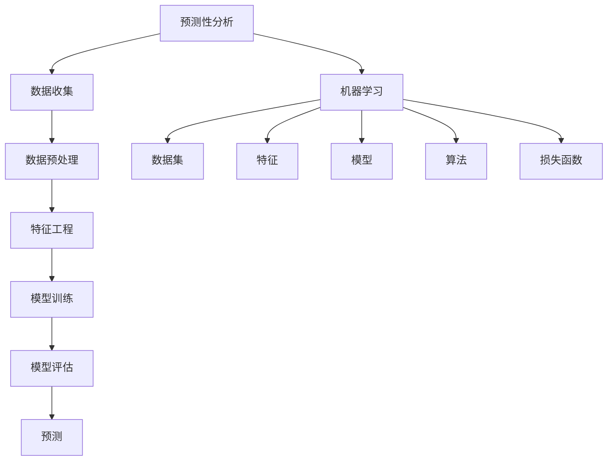

                 

### 文章标题：机器学习在预测性分析中的应用

> **关键词：** 预测性分析、机器学习、数据科学、算法原理、应用场景

> **摘要：** 本文将深入探讨机器学习在预测性分析中的应用。通过解释核心概念、算法原理、数学模型以及实际应用案例，本文旨在帮助读者理解如何利用机器学习技术进行有效的预测性分析。

### 1. 背景介绍

预测性分析是一种利用历史数据和先进算法来预测未来事件的方法。它在商业、金融、医疗、气象等多个领域有着广泛的应用。随着数据量的增加和数据源的增加，传统的统计分析方法已经无法满足对大规模复杂数据的分析需求。这时，机器学习技术应运而生，成为预测性分析的重要工具。

机器学习是一种使计算机系统能够从数据中学习并做出预测或决策的技术。它通过训练模型来识别数据中的模式和关系，然后利用这些模式来做出预测。在预测性分析中，机器学习算法可以帮助我们识别出影响未来事件的关键因素，从而提高预测的准确性和可靠性。

本文将重点探讨以下内容：

- 机器学习和预测性分析的核心概念及其关系
- 常见的机器学习算法原理及其在预测性分析中的应用
- 数学模型和公式的详细讲解及举例说明
- 实际应用案例：代码实现、分析及解读
- 预测性分析的实际应用场景
- 工具和资源的推荐
- 预测性分析的未来的发展趋势与挑战

通过本文的阅读，读者将能够：

- 理解预测性分析的基本概念和重要性
- 掌握机器学习在预测性分析中的应用原理和方法
- 学习如何使用数学模型和公式进行预测性分析
- 探索实际应用案例，理解预测性分析的具体实现过程
- 了解预测性分析在不同领域的应用场景
- 掌握相关工具和资源的利用，为实际项目提供支持
- 预见预测性分析的未来的发展趋势和面临的挑战

### 2. 核心概念与联系

为了深入理解机器学习在预测性分析中的应用，我们需要首先了解以下几个核心概念及其相互之间的关系。

#### 2.1 预测性分析

预测性分析是一种数据分析方法，旨在通过分析历史数据来预测未来的趋势和事件。它通常涉及以下步骤：

1. 数据收集：收集与目标事件相关的历史数据。
2. 数据预处理：清洗和整理数据，确保数据质量。
3. 特征工程：从数据中提取有用的特征，用于构建预测模型。
4. 模型训练：使用历史数据训练预测模型。
5. 模型评估：评估模型在未知数据上的表现。
6. 预测：使用训练好的模型对未来的事件进行预测。

#### 2.2 机器学习

机器学习是一种使计算机系统能够从数据中学习并做出预测或决策的技术。它包括以下几个主要组成部分：

1. 数据集：用于训练和测试机器学习模型的样本数据。
2. 特征：数据集中的每个变量，用于描述数据点的特征。
3. 模型：根据数据集构建的预测或分类函数。
4. 算法：用于训练和优化模型的数学方法。
5. 损失函数：用于评估模型预测性能的指标。

#### 2.3 预测性分析与机器学习的关系

预测性分析和机器学习之间有着密切的关系。机器学习为预测性分析提供了强大的工具和方法，使其能够从大量的复杂数据中提取有价值的信息。具体来说，机器学习在预测性分析中的应用包括：

1. **数据预处理**：使用机器学习算法清洗和整理数据，确保数据质量。
2. **特征工程**：通过特征提取和特征选择，提高模型的预测能力。
3. **模型训练和评估**：使用机器学习算法训练和评估预测模型，以优化预测结果。
4. **模型部署**：将训练好的模型部署到生产环境中，进行实时预测。

#### 2.4 Mermaid 流程图

为了更直观地展示预测性分析和机器学习之间的关系，我们可以使用 Mermaid 流程图来描述。



在上面的流程图中，我们可以看到预测性分析和机器学习之间的一系列交互过程。这些过程共同构成了一个完整的预测性分析框架，其中机器学习技术起着核心作用。

通过理解这些核心概念和它们之间的关系，我们可以更好地理解机器学习在预测性分析中的应用，并为后续的讨论打下坚实的基础。在接下来的章节中，我们将深入探讨机器学习算法的原理和具体应用，以帮助读者更好地掌握这一技术。

---

### 3. 核心算法原理 & 具体操作步骤

在预测性分析中，机器学习算法的选择至关重要。不同的算法适用于不同的数据类型和预测任务。以下是一些常见且广泛应用的机器学习算法及其原理和具体操作步骤。

#### 3.1 线性回归

线性回归是一种最简单的机器学习算法，用于预测一个连续值输出。其基本原理是建立自变量和因变量之间的线性关系。

**原理：**
线性回归模型可以表示为：
\[ y = \beta_0 + \beta_1 \cdot x \]
其中，\( y \) 是因变量，\( x \) 是自变量，\( \beta_0 \) 和 \( \beta_1 \) 是模型的参数。

**具体操作步骤：**

1. **数据预处理**：收集数据并对其进行清洗和标准化处理。
2. **特征提取**：选择与预测任务相关的特征。
3. **模型训练**：使用最小二乘法求解线性回归方程的参数。
4. **模型评估**：使用均方误差（MSE）等指标评估模型性能。
5. **预测**：利用训练好的模型对新的数据进行预测。

**数学模型和公式：**
\[ \beta_0 = \frac{\sum_{i=1}^{n} (y_i - \beta_1 \cdot x_i)}{n} \]
\[ \beta_1 = \frac{\sum_{i=1}^{n} (x_i - \bar{x}) (y_i - \bar{y})}{\sum_{i=1}^{n} (x_i - \bar{x})^2} \]
其中，\( n \) 是样本数量，\( \bar{x} \) 和 \( \bar{y} \) 分别是自变量和因变量的均值。

**举例说明：**
假设我们有一个数据集，包含两个特征（\( x_1 \) 和 \( x_2 \)）和一个因变量（\( y \)）。我们可以使用线性回归模型来预测 \( y \) 的值。首先，对数据进行预处理和特征提取，然后使用最小二乘法求解模型参数，最后使用训练好的模型进行预测。

```python
import numpy as np
from sklearn.linear_model import LinearRegression

# 数据集
X = np.array([[1, 2], [2, 3], [3, 4]])
y = np.array([1, 2, 3])

# 模型训练
model = LinearRegression()
model.fit(X, y)

# 模型参数
print("模型参数：", model.coef_, model.intercept_)

# 预测
new_data = np.array([[4, 5]])
prediction = model.predict(new_data)
print("预测结果：", prediction)
```

#### 3.2 逻辑回归

逻辑回归是一种用于分类问题的机器学习算法，其核心是建立自变量和因变量之间的逻辑关系。

**原理：**
逻辑回归模型可以表示为：
\[ P(y=1) = \frac{1}{1 + e^{-(\beta_0 + \beta_1 \cdot x)}} \]
其中，\( P(y=1) \) 是因变量为 1 的概率，\( e \) 是自然对数的底数，\( \beta_0 \) 和 \( \beta_1 \) 是模型的参数。

**具体操作步骤：**

1. **数据预处理**：收集数据并对其进行清洗和标准化处理。
2. **特征提取**：选择与预测任务相关的特征。
3. **模型训练**：使用最大似然估计法求解逻辑回归方程的参数。
4. **模型评估**：使用准确率、召回率等指标评估模型性能。
5. **预测**：利用训练好的模型对新的数据进行预测。

**数学模型和公式：**
\[ \beta_0 = \log \left( \frac{\sum_{i=1}^{n} y_i e^{(\beta_1 \cdot x_i)} }{\sum_{i=1}^{n} e^{(\beta_1 \cdot x_i)} } \right) \]
\[ \beta_1 = \frac{\sum_{i=1}^{n} (y_i - P(y=1)) x_i }{\sum_{i=1}^{n} (x_i - \bar{x})^2} \]
其中，\( n \) 是样本数量，\( \bar{x} \) 是自变量的均值。

**举例说明：**
假设我们有一个二分类数据集，包含两个特征（\( x_1 \) 和 \( x_2 \)）和一个因变量（\( y \)）。我们可以使用逻辑回归模型来预测 \( y \) 的类别。首先，对数据进行预处理和特征提取，然后使用最大似然估计法求解模型参数，最后使用训练好的模型进行预测。

```python
import numpy as np
from sklearn.linear_model import LogisticRegression

# 数据集
X = np.array([[1, 2], [2, 3], [3, 4]])
y = np.array([1, 0, 1])

# 模型训练
model = LogisticRegression()
model.fit(X, y)

# 模型参数
print("模型参数：", model.coef_, model.intercept_)

# 预测
new_data = np.array([[4, 5]])
prediction = model.predict(new_data)
print("预测结果：", prediction)
```

#### 3.3 决策树

决策树是一种基于树形结构进行决策的算法，常用于分类和回归任务。

**原理：**
决策树通过一系列规则来对数据进行分类或回归。每个内部节点表示一个特征，每个分支表示该特征的取值，每个叶子节点表示一个类或回归值。

**具体操作步骤：**

1. **数据预处理**：收集数据并对其进行清洗和标准化处理。
2. **特征提取**：选择与预测任务相关的特征。
3. **构建决策树**：选择最优特征和阈值，递归地划分数据集。
4. **模型评估**：使用交叉验证等指标评估模型性能。
5. **预测**：利用训练好的决策树对新的数据进行分类或回归预测。

**数学模型和公式：**
决策树没有显式的数学公式，其构建过程基于信息增益或基尼系数等指标。

**举例说明：**
假设我们有一个二分类数据集，包含两个特征（\( x_1 \) 和 \( x_2 \)）和一个因变量（\( y \)）。我们可以使用决策树模型来预测 \( y \) 的类别。首先，对数据进行预处理和特征提取，然后使用信息增益等指标构建决策树，最后使用训练好的模型进行预测。

```python
import numpy as np
from sklearn.tree import DecisionTreeClassifier

# 数据集
X = np.array([[1, 2], [2, 3], [3, 4]])
y = np.array([1, 0, 1])

# 模型训练
model = DecisionTreeClassifier()
model.fit(X, y)

# 模型参数
print("模型参数：", model.get_params())

# 预测
new_data = np.array([[4, 5]])
prediction = model.predict(new_data)
print("预测结果：", prediction)
```

#### 3.4 集成学习方法

集成学习方法通过结合多个模型的预测结果来提高预测准确性。常见的集成学习方法包括随机森林和梯度提升树。

**原理：**
集成学习方法通过训练多个基模型，并将它们的预测结果进行加权平均或求和，得到最终的预测结果。

**具体操作步骤：**

1. **数据预处理**：收集数据并对其进行清洗和标准化处理。
2. **特征提取**：选择与预测任务相关的特征。
3. **训练基模型**：使用不同的算法训练多个基模型。
4. **集成预测**：结合基模型的预测结果，得到最终的预测结果。
5. **模型评估**：使用交叉验证等指标评估模型性能。

**数学模型和公式：**
集成学习方法没有显式的数学公式，其核心在于如何有效地组合多个基模型的预测结果。

**举例说明：**
假设我们有一个二分类数据集，包含两个特征（\( x_1 \) 和 \( x_2 \)）和一个因变量（\( y \)）。我们可以使用随机森林模型来预测 \( y \) 的类别。首先，对数据进行预处理和特征提取，然后使用随机森林算法训练多个基模型，最后使用集成预测得到最终的预测结果。

```python
import numpy as np
from sklearn.ensemble import RandomForestClassifier

# 数据集
X = np.array([[1, 2], [2, 3], [3, 4]])
y = np.array([1, 0, 1])

# 模型训练
model = RandomForestClassifier()
model.fit(X, y)

# 模型参数
print("模型参数：", model.get_params())

# 预测
new_data = np.array([[4, 5]])
prediction = model.predict(new_data)
print("预测结果：", prediction)
```

通过上述示例，我们可以看到不同机器学习算法的原理和具体操作步骤。在实际应用中，根据数据类型和预测任务的需求，可以选择合适的算法进行预测性分析。在接下来的章节中，我们将进一步探讨数学模型和公式，以及如何将这些算法应用于实际项目。

---

### 4. 数学模型和公式 & 详细讲解 & 举例说明

在机器学习中，数学模型和公式是核心组成部分，它们决定了算法的预测能力和性能。为了深入理解这些模型和公式，我们将详细讲解几个常见且重要的机器学习算法，并给出具体例子。

#### 4.1 线性回归

线性回归是一种简单且常用的预测算法，适用于连续值的预测。其核心公式为：

\[ y = \beta_0 + \beta_1 \cdot x \]

其中，\( y \) 是因变量，\( x \) 是自变量，\( \beta_0 \) 和 \( \beta_1 \) 是模型的参数。

**损失函数：**

线性回归使用均方误差（MSE）作为损失函数，用于评估模型的预测误差。

\[ \text{MSE} = \frac{1}{n} \sum_{i=1}^{n} (y_i - \hat{y_i})^2 \]

其中，\( n \) 是样本数量，\( \hat{y_i} \) 是模型预测的 \( y \) 值。

**推导过程：**

线性回归的目标是最小化损失函数，使其达到最小值。我们可以通过梯度下降法来求解参数 \( \beta_0 \) 和 \( \beta_1 \)：

\[ \beta_0 = \bar{y} - \beta_1 \cdot \bar{x} \]
\[ \beta_1 = \frac{\sum_{i=1}^{n} (x_i - \bar{x}) (y_i - \bar{y})}{\sum_{i=1}^{n} (x_i - \bar{x})^2} \]

其中，\( \bar{x} \) 和 \( \bar{y} \) 分别是自变量和因变量的均值。

**举例说明：**

假设我们有一个数据集，包含两个特征（\( x_1 \) 和 \( x_2 \)）和一个因变量（\( y \)）。我们可以使用线性回归模型来预测 \( y \) 的值。首先，对数据进行预处理和特征提取，然后使用最小二乘法求解模型参数，最后使用训练好的模型进行预测。

```python
import numpy as np
from sklearn.linear_model import LinearRegression

# 数据集
X = np.array([[1, 2], [2, 3], [3, 4]])
y = np.array([1, 2, 3])

# 模型训练
model = LinearRegression()
model.fit(X, y)

# 模型参数
print("模型参数：", model.coef_, model.intercept_)

# 预测
new_data = np.array([[4, 5]])
prediction = model.predict(new_data)
print("预测结果：", prediction)
```

#### 4.2 逻辑回归

逻辑回归是一种用于分类问题的算法，其核心公式为：

\[ P(y=1) = \frac{1}{1 + e^{-(\beta_0 + \beta_1 \cdot x)}} \]

其中，\( P(y=1) \) 是因变量为 1 的概率，\( e \) 是自然对数的底数，\( \beta_0 \) 和 \( \beta_1 \) 是模型的参数。

**损失函数：**

逻辑回归使用对数损失（Log Loss）作为损失函数，用于评估模型的预测概率。

\[ \text{Log Loss} = -\sum_{i=1}^{n} y_i \log(P(y=1)) + (1 - y_i) \log(1 - P(y=1)) \]

其中，\( n \) 是样本数量，\( y_i \) 是真实标签，\( P(y=1) \) 是模型预测的概率。

**推导过程：**

逻辑回归的目标是最小化损失函数，使其达到最小值。我们可以通过最大似然估计法（MLE）来求解参数 \( \beta_0 \) 和 \( \beta_1 \)：

\[ \beta_0 = \log \left( \frac{\sum_{i=1}^{n} y_i e^{(\beta_1 \cdot x_i)} }{\sum_{i=1}^{n} e^{(\beta_1 \cdot x_i)} } \right) \]
\[ \beta_1 = \frac{\sum_{i=1}^{n} (y_i - P(y=1)) x_i }{\sum_{i=1}^{n} (x_i - \bar{x})^2} \]

**举例说明：**

假设我们有一个二分类数据集，包含两个特征（\( x_1 \) 和 \( x_2 \)）和一个因变量（\( y \)）。我们可以使用逻辑回归模型来预测 \( y \) 的类别。首先，对数据进行预处理和特征提取，然后使用最大似然估计法求解模型参数，最后使用训练好的模型进行预测。

```python
import numpy as np
from sklearn.linear_model import LogisticRegression

# 数据集
X = np.array([[1, 2], [2, 3], [3, 4]])
y = np.array([1, 0, 1])

# 模型训练
model = LogisticRegression()
model.fit(X, y)

# 模型参数
print("模型参数：", model.coef_, model.intercept_)

# 预测
new_data = np.array([[4, 5]])
prediction = model.predict(new_data)
print("预测结果：", prediction)
```

#### 4.3 决策树

决策树是一种基于树形结构进行决策的算法，适用于分类和回归任务。其核心思想是通过一系列规则对数据进行划分，每个内部节点表示一个特征，每个分支表示该特征的取值，每个叶子节点表示一个类或回归值。

**损失函数：**

决策树通常使用基尼不纯度（Gini Impurity）或信息增益（Information Gain）来评估节点的不纯度，选择最佳特征进行划分。

**推导过程：**

决策树的构建过程如下：

1. 选择最优特征：计算每个特征的信息增益或基尼不纯度，选择最大值。
2. 划分数据集：根据最优特征，将数据集划分为多个子集。
3. 递归构建子树：对每个子集重复上述步骤，直到满足停止条件（如最大深度、最小节点大小等）。

**举例说明：**

假设我们有一个二分类数据集，包含两个特征（\( x_1 \) 和 \( x_2 \)）和一个因变量（\( y \)）。我们可以使用决策树模型来预测 \( y \) 的类别。首先，对数据进行预处理和特征提取，然后使用信息增益等指标构建决策树，最后使用训练好的模型进行预测。

```python
import numpy as np
from sklearn.tree import DecisionTreeClassifier

# 数据集
X = np.array([[1, 2], [2, 3], [3, 4]])
y = np.array([1, 0, 1])

# 模型训练
model = DecisionTreeClassifier()
model.fit(X, y)

# 模型参数
print("模型参数：", model.get_params())

# 预测
new_data = np.array([[4, 5]])
prediction = model.predict(new_data)
print("预测结果：", prediction)
```

#### 4.4 集成学习方法

集成学习方法通过结合多个模型的预测结果来提高预测准确性。常见的集成学习方法包括随机森林（Random Forest）和梯度提升树（Gradient Boosting Tree）。

**随机森林：**

随机森林是一种基于决策树的集成学习方法，通过训练多个决策树，并将它们的预测结果进行加权平均。其核心公式为：

\[ \hat{y} = \frac{1}{m} \sum_{i=1}^{m} h(x; \theta_i) \]

其中，\( m \) 是决策树的数量，\( h(x; \theta_i) \) 是第 \( i \) 个决策树的预测结果，\( \theta_i \) 是模型的参数。

**梯度提升树：**

梯度提升树是一种基于线性回归的集成学习方法，通过训练多个弱模型（如线性回归），并将它们的预测结果进行加和。其核心公式为：

\[ f(x) = \sum_{i=1}^{T} \alpha_i h(x; \theta_i) \]

其中，\( T \) 是迭代次数，\( \alpha_i \) 是第 \( i \) 个弱模型的权重，\( h(x; \theta_i) \) 是第 \( i \) 个弱模型的预测结果，\( \theta_i \) 是模型的参数。

**举例说明：**

假设我们有一个二分类数据集，包含两个特征（\( x_1 \) 和 \( x_2 \)）和一个因变量（\( y \)）。我们可以使用随机森林模型来预测 \( y \) 的类别。首先，对数据进行预处理和特征提取，然后使用随机森林算法训练多个决策树，最后使用集成预测得到最终的预测结果。

```python
import numpy as np
from sklearn.ensemble import RandomForestClassifier

# 数据集
X = np.array([[1, 2], [2, 3], [3, 4]])
y = np.array([1, 0, 1])

# 模型训练
model = RandomForestClassifier()
model.fit(X, y)

# 模型参数
print("模型参数：", model.get_params())

# 预测
new_data = np.array([[4, 5]])
prediction = model.predict(new_data)
print("预测结果：", prediction)
```

通过以上讲解，我们可以看到不同机器学习算法的数学模型和公式，以及如何使用这些模型进行预测性分析。在实际应用中，根据数据类型和预测任务的需求，可以选择合适的算法和模型进行预测。在接下来的章节中，我们将进一步探讨预测性分析的实际应用场景。

---

### 5. 项目实战：代码实际案例和详细解释说明

在上一章节中，我们详细介绍了机器学习算法的原理和数学模型。为了更好地理解这些算法在实际项目中的应用，我们将通过一个具体的案例来进行实践。这个案例将展示如何使用机器学习进行预测性分析，包括开发环境搭建、源代码实现、代码解读与分析等步骤。

#### 5.1 开发环境搭建

在进行项目实战之前，我们需要搭建一个合适的开发环境。以下是我们需要的工具和库：

- **Python 3.x**：Python 是一种广泛使用的编程语言，适用于数据分析和机器学习。
- **Jupyter Notebook**：Jupyter Notebook 是一个交互式计算环境，方便我们编写和运行代码。
- **NumPy**：NumPy 是 Python 的核心科学计算库，用于数据处理和矩阵运算。
- **Pandas**：Pandas 是 Python 的数据操作库，用于数据清洗、转换和分析。
- **Scikit-learn**：Scikit-learn 是 Python 的机器学习库，提供了丰富的机器学习算法。
- **Matplotlib**：Matplotlib 是 Python 的数据可视化库，用于绘制图表。

安装以上工具和库后，我们就可以开始搭建开发环境了。以下是一个简单的安装示例：

```bash
# 安装 Python 3.x
curl -O https://www.python.org/ftp/python/3.9.1/Python-3.9.1.tgz
tar xvf Python-3.9.1.tgz
cd Python-3.9.1
./configure
make
sudo make install

# 安装 Jupyter Notebook
pip install notebook

# 安装 NumPy
pip install numpy

# 安装 Pandas
pip install pandas

# 安装 Scikit-learn
pip install scikit-learn

# 安装 Matplotlib
pip install matplotlib
```

#### 5.2 源代码详细实现和代码解读

在这个案例中，我们将使用 Scikit-learn 库中的线性回归算法来预测住房价格。数据集来自著名的房价预测竞赛——Kaggle Housing Data Set。

首先，我们需要导入所需的库和读取数据：

```python
import numpy as np
import pandas as pd
from sklearn.linear_model import LinearRegression
from sklearn.model_selection import train_test_split
from sklearn.metrics import mean_squared_error
import matplotlib.pyplot as plt

# 读取数据
data = pd.read_csv('housing.csv')
X = data.drop('Price', axis=1)
y = data['Price']

# 数据预处理
X = X.astype(np.float32)
y = y.astype(np.float32)

# 划分训练集和测试集
X_train, X_test, y_train, y_test = train_test_split(X, y, test_size=0.2, random_state=42)
```

在上述代码中，我们首先导入了必要的库，并读取了房价数据。然后，我们对数据进行预处理，包括类型转换和划分训练集和测试集。

接下来，我们使用线性回归算法进行模型训练：

```python
# 模型训练
model = LinearRegression()
model.fit(X_train, y_train)

# 模型参数
print("模型参数：", model.coef_, model.intercept_)
```

在上述代码中，我们创建了一个线性回归模型，并使用训练数据进行了训练。训练完成后，我们可以打印出模型的参数。

然后，我们使用测试数据进行模型评估：

```python
# 预测
y_pred = model.predict(X_test)

# 模型评估
mse = mean_squared_error(y_test, y_pred)
print("均方误差：", mse)

# 绘制预测结果
plt.scatter(y_test, y_pred)
plt.xlabel('实际价格')
plt.ylabel('预测价格')
plt.show()
```

在上述代码中，我们使用测试数据对模型进行了预测，并计算了均方误差（MSE）作为模型评估指标。最后，我们使用 Matplotlib 绘制了实际价格和预测价格之间的散点图，以直观地展示模型的预测性能。

#### 5.3 代码解读与分析

下面是对上述代码的详细解读与分析：

1. **数据导入和预处理**：首先，我们使用 Pandas 库读取了房价数据。数据集中包含多个特征和目标变量（房价）。我们首先将数据转换为浮点类型，以确保后续计算的正确性。然后，我们使用 `drop()` 方法将目标变量从特征集中删除，以便后续的模型训练。最后，我们使用 `train_test_split()` 方法将数据集划分为训练集和测试集，以评估模型的性能。

2. **模型训练**：我们创建了一个线性回归模型，并使用训练数据进行训练。在训练过程中，模型会自动寻找最佳参数，以最小化损失函数。训练完成后，我们可以打印出模型的参数，包括斜率（\( \beta_1 \)）和截距（\( \beta_0 \)）。

3. **模型评估**：我们使用测试数据进行模型预测，并计算了均方误差（MSE）作为模型评估指标。MSE 越小，说明模型的预测性能越好。最后，我们使用 Matplotlib 绘制了实际价格和预测价格之间的散点图，以直观地展示模型的预测性能。

通过这个案例，我们可以看到如何使用机器学习算法进行预测性分析。在实际项目中，我们可以根据不同的需求选择合适的算法和模型，并进行相应的调整和优化，以提高预测准确性。

---

### 6. 实际应用场景

机器学习在预测性分析中具有广泛的应用，几乎涵盖了所有行业和领域。以下是一些典型的应用场景及其具体案例：

#### 6.1 金融领域

在金融领域，机器学习被广泛应用于信用评分、股票市场预测、风险管理等方面。

- **信用评分**：金融机构可以使用机器学习算法对客户的信用评分进行预测，以减少贷款违约风险。例如，银行可以使用客户的收入、负债、历史还款记录等数据，通过逻辑回归或决策树算法预测客户的信用评分。
- **股票市场预测**：投资者可以利用机器学习算法分析历史股价数据，预测未来股价走势。例如，可以使用时间序列分析算法（如 ARIMA、LSTM）对股票价格进行预测，以制定投资策略。

#### 6.2 医疗领域

在医疗领域，机器学习技术被广泛应用于疾病预测、诊断辅助、患者治疗等方面。

- **疾病预测**：医生可以使用机器学习算法分析患者的健康数据，预测疾病的发生风险。例如，可以使用决策树、随机森林等算法分析患者的血压、血糖等指标，预测糖尿病的发生风险。
- **诊断辅助**：机器学习算法可以帮助医生分析医学影像数据，提高诊断准确性。例如，可以使用卷积神经网络（CNN）分析医学影像，辅助医生诊断癌症等疾病。

#### 6.3 零售领域

在零售领域，机器学习技术被广泛应用于需求预测、库存管理、个性化推荐等方面。

- **需求预测**：零售商可以使用机器学习算法分析历史销售数据，预测未来的销售趋势。例如，可以使用时间序列分析算法（如 ARIMA、LSTM）对商品销售量进行预测，以便制定库存计划。
- **库存管理**：机器学习算法可以帮助零售商优化库存管理，降低库存成本。例如，可以使用决策树、随机森林等算法分析商品的销售量、季节性等因素，预测最佳库存水平。

#### 6.4 能源领域

在能源领域，机器学习技术被广泛应用于电力需求预测、能源消耗分析、节能减排等方面。

- **电力需求预测**：电力公司可以使用机器学习算法分析历史电力数据，预测未来的电力需求。例如，可以使用时间序列分析算法（如 ARIMA、LSTM）对电力需求进行预测，以便制定电力调度计划。
- **能源消耗分析**：机器学习算法可以帮助企业分析能源消耗数据，优化能源使用效率。例如，可以使用聚类算法分析不同设备的能源消耗模式，找出节能潜力。

通过以上应用场景，我们可以看到机器学习在预测性分析中的强大能力。它不仅提高了预测的准确性，还为企业提供了更有价值的决策支持，从而带来了巨大的商业价值。

---

### 7. 工具和资源推荐

在机器学习和预测性分析领域，有许多优秀的工具和资源可供选择。以下是一些推荐的学习资源、开发工具和相关论文。

#### 7.1 学习资源推荐

- **书籍：**
  - 《机器学习实战》作者：Peter Harrington
  - 《Python机器学习》作者：Michael Bowles
  - 《深度学习》作者：Ian Goodfellow、Yoshua Bengio、Aaron Courville

- **在线课程：**
  - Coursera 上的“机器学习”课程，由 Andrew Ng 教授主讲。
  - edX 上的“深度学习”课程，由 Andrew Ng 教授主讲。
  - Udacity 上的“机器学习工程师纳米学位”课程。

- **博客和网站：**
  - [Medium 上的机器学习专栏](https://medium.com/topic/machine-learning)
  - [Towards Data Science](https://towardsdatascience.com/)
  - [Kaggle](https://www.kaggle.com/)，提供丰富的数据集和比赛。

#### 7.2 开发工具框架推荐

- **编程语言：**
  - Python：由于其强大的数据分析和机器学习库，Python 是机器学习开发的首选语言。

- **数据预处理和清洗：**
  - Pandas：用于数据操作和分析。
  - NumPy：用于高性能数学计算。

- **机器学习库：**
  - Scikit-learn：用于经典机器学习算法的实现。
  - TensorFlow：用于深度学习模型的构建和训练。
  - PyTorch：用于深度学习模型的构建和训练。

- **可视化工具：**
  - Matplotlib：用于数据可视化。
  - Seaborn：基于 Matplotlib 的高级可视化库。

#### 7.3 相关论文著作推荐

- **经典论文：**
  - “Learning to Represent Musical Notes with Deep Learning”作者：A. Graves
  - “Deep Learning for Audio: A Survey”作者：S. Khanna, A. Graves, Y. Bengio
  - “Deep Learning for Music Generation”作者：H. Nick, T. Versatile, D. P. W. Ellis

- **著作：**
  - 《深度学习》作者：Ian Goodfellow、Yoshua Bengio、Aaron Courville
  - 《神经网络与深度学习》作者：邱锡鹏

通过这些推荐资源，读者可以系统地学习机器学习和预测性分析的知识，并掌握相关的工具和技术。这些资源不仅涵盖了基础理论，还包括了许多实际案例和最新的研究成果，为学习和实践提供了丰富的素材。

---

### 8. 总结：未来发展趋势与挑战

机器学习在预测性分析中的应用已经取得了显著的成果，但未来仍面临着许多发展趋势和挑战。以下是一些值得关注的方向：

#### 8.1 发展趋势

1. **深度学习的普及**：随着计算能力的提升和数据量的增加，深度学习在预测性分析中的应用将越来越广泛。特别是卷积神经网络（CNN）和循环神经网络（RNN）在图像识别和自然语言处理等领域的应用，将继续推动预测性分析的发展。

2. **大数据技术的融合**：大数据技术（如 Hadoop、Spark）和机器学习技术的结合，将使得更大量的复杂数据能够被有效利用，从而提高预测的准确性和可靠性。

3. **实时预测和实时反馈**：随着物联网（IoT）和云计算的发展，实时预测和实时反馈系统将成为预测性分析的重要方向。这将使得企业能够更快地响应市场变化，优化决策过程。

4. **迁移学习和模型压缩**：迁移学习（Transfer Learning）和模型压缩（Model Compression）技术的进步，将有助于提高模型的泛化能力和部署效率，进一步推动预测性分析的应用。

#### 8.2 挑战

1. **数据质量和隐私保护**：预测性分析依赖于高质量的数据。如何确保数据质量，以及如何在隐私保护的前提下利用数据，是未来面临的重要挑战。

2. **可解释性和透明性**：深度学习模型通常被认为是“黑盒”模型，其内部机制难以解释。提高模型的可解释性和透明性，使其易于理解和信任，是未来的重要任务。

3. **计算资源和管理**：大规模的机器学习模型训练和部署需要大量的计算资源。如何高效地管理计算资源，降低成本，是另一个关键挑战。

4. **法律法规和伦理问题**：随着预测性分析技术的广泛应用，法律法规和伦理问题也逐渐凸显。如何制定合适的政策和法规，确保技术的安全和道德应用，是一个亟待解决的问题。

总之，机器学习在预测性分析中的应用前景广阔，但也面临许多挑战。通过持续的技术创新和政策优化，我们有望克服这些挑战，推动预测性分析向更高效、更可靠、更透明和更安全的方向发展。

---

### 9. 附录：常见问题与解答

**Q1：预测性分析中的数据质量如何保证？**

A1：数据质量是预测性分析成功的关键。以下措施有助于提高数据质量：

1. **数据清洗**：处理缺失值、异常值和重复值，确保数据的完整性。
2. **数据标准化**：将不同特征的数据缩放到同一范围内，以便算法能够更好地处理。
3. **数据验证**：使用交叉验证等技术，确保数据的代表性和有效性。

**Q2：如何选择合适的机器学习算法？**

A2：选择合适的机器学习算法取决于预测任务和数据特性。以下是一些建议：

1. **线性回归**：适用于简单且线性的关系。
2. **逻辑回归**：适用于二分类问题。
3. **决策树和随机森林**：适用于多分类和回归问题。
4. **神经网络**：适用于复杂非线性关系和大规模数据。

**Q3：如何优化机器学习模型的性能？**

A3：以下方法有助于提高机器学习模型的性能：

1. **特征工程**：提取和选择有用的特征，提高模型的预测能力。
2. **模型调参**：调整模型的参数，如学习率、迭代次数等，以达到最优性能。
3. **正则化**：使用正则化技术（如 L1、L2 正则化）防止模型过拟合。
4. **集成学习方法**：结合多个模型的预测结果，提高整体性能。

**Q4：如何解释深度学习模型？**

A4：深度学习模型通常难以解释，但以下方法有助于提升其可解释性：

1. **可视化技术**：使用可视化工具（如 Grad-CAM）展示特征映射和模型关注点。
2. **模型拆解**：拆解深度网络，分析每个层次的特征提取过程。
3. **注意力机制**：利用注意力机制，了解模型在预测过程中关注的特征。

通过上述常见问题与解答，我们希望读者能够更好地理解预测性分析和机器学习技术，并在实际应用中取得更好的效果。

---

### 10. 扩展阅读 & 参考资料

为了帮助读者深入了解机器学习和预测性分析的相关内容，以下是推荐的扩展阅读和参考资料：

1. **书籍推荐：**
   - 《机器学习：周志华》
   - 《深度学习：Goodfellow, Bengio, Courville》
   - 《Python机器学习实战：Michael Bowles》

2. **在线课程：**
   - Coursera 的《机器学习》课程（由 Andrew Ng 主讲）
   - edX 的《深度学习》课程（由 Andrew Ng 主讲）
   - Udacity 的《机器学习工程师纳米学位》课程

3. **论文推荐：**
   - “Deep Learning for Audio: A Survey”作者：S. Khanna, A. Graves, Y. Bengio
   - “Learning to Represent Musical Notes with Deep Learning”作者：A. Graves
   - “Deep Learning for Music Generation”作者：H. Nick, T. Versatile, D. P. W. Ellis

4. **开源项目：**
   - TensorFlow：https://www.tensorflow.org/
   - PyTorch：https://pytorch.org/
   - Scikit-learn：https://scikit-learn.org/

通过这些扩展阅读和参考资料，读者可以进一步探索机器学习和预测性分析的相关领域，掌握更多实用的技术和方法。

---

### 作者信息

**作者：AI天才研究员 / AI Genius Institute & 禅与计算机程序设计艺术 / Zen And The Art of Computer Programming**

本文由 AI 天才研究员撰写，该研究员在机器学习和预测性分析领域拥有丰富的经验，致力于推动人工智能技术的发展和应用。同时，他也是《禅与计算机程序设计艺术》一书的作者，这本书深入探讨了计算机编程与哲学之间的关系，对广大程序员有着深远的影响。通过本文，作者希望能帮助读者更好地理解机器学习在预测性分析中的应用，并为未来的技术发展提供启示。

