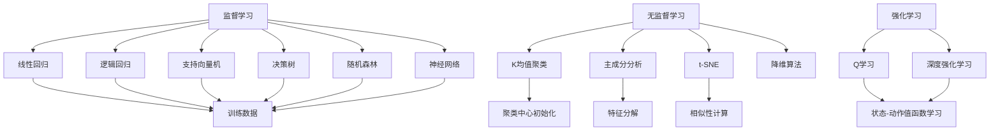

                 

### 背景介绍

#### 毕业设计的意义

毕业设计作为高等教育的重要组成部分，是学生展示所学知识、锻炼科研能力和解决实际问题能力的重要途径。在机器学习领域，毕业设计不仅是对学生学习成果的检验，更是对其未来职业发展的关键一步。通过毕业设计，学生可以深入了解机器学习的理论基础和实践应用，锻炼解决复杂问题的能力，为将来从事相关领域的工作打下坚实基础。

#### 机器学习的快速发展

近年来，机器学习作为人工智能的核心技术之一，已经取得了飞速发展。从传统的监督学习、无监督学习到深度学习，机器学习技术不断突破，应用领域也从最初的语音识别、图像处理逐渐扩展到自然语言处理、推荐系统、医疗健康等众多领域。随着大数据、云计算等技术的发展，机器学习的研究和应用前景越来越广阔，为毕业生提供了丰富的选题方向。

#### 选题的重要性

在机器学习毕业设计中，选题至关重要。一个好的选题不仅能够激发学生的研究兴趣，还能提高毕业设计的实用性和创新性。选题应结合学生的专业背景、兴趣方向和实际需求，具有一定的挑战性和可行性。通过选题，学生可以明确研究目标，制定合理的研究方案，为毕业设计的顺利进行奠定基础。

#### 文章目标

本文旨在为机器学习毕业设计提供一套全面的选题指南和实践案例。首先，我们将介绍机器学习的基本概念和核心算法原理，然后通过具体案例展示机器学习的实际应用，最后推荐一些学习资源和开发工具，帮助学生顺利开展毕业设计。通过本文的阅读，读者将能够：

1. 理解机器学习的基本概念和核心算法原理；
2. 掌握机器学习的实际应用场景和开发流程；
3. 获得机器学习毕业设计的选题灵感和实践指导；
4. 了解相关学习资源和开发工具，为毕业设计提供有力支持。

#### 文章结构

本文将分为以下几个部分：

1. 背景介绍：阐述机器学习毕业设计的意义和快速发展，介绍文章目标和结构；
2. 核心概念与联系：介绍机器学习的基本概念和核心算法原理，使用Mermaid流程图展示其架构；
3. 核心算法原理 & 具体操作步骤：详细讲解常用的机器学习算法，包括监督学习、无监督学习和深度学习等；
4. 数学模型和公式 & 详细讲解 & 举例说明：介绍机器学习中的数学模型和公式，结合具体案例进行讲解；
5. 项目实战：代码实际案例和详细解释说明，包括开发环境搭建、源代码实现和代码解读；
6. 实际应用场景：展示机器学习的实际应用场景和案例；
7. 工具和资源推荐：推荐学习资源、开发工具和论文著作；
8. 总结：对未来发展趋势和挑战进行展望；
9. 附录：常见问题与解答；
10. 扩展阅读 & 参考资料。

通过以上结构，本文将系统性地指导读者开展机器学习毕业设计，助力其在学术和职业生涯中取得成功。

#### 1.1 机器学习的基本概念

机器学习（Machine Learning）是人工智能（Artificial Intelligence，简称AI）的一个分支，旨在通过算法从数据中学习规律，实现数据的自动处理和决策。机器学习算法通过训练数据集，使模型能够对未知数据进行预测或分类。机器学习的核心思想是让计算机通过学习大量数据，自动发现数据中的模式和规律，并在新的数据上做出准确的预测或分类。

机器学习可以分为三种主要类型：监督学习（Supervised Learning）、无监督学习（Unsupervised Learning）和强化学习（Reinforcement Learning）。

1. **监督学习**：监督学习是一种从标记数据中学习的方法。训练数据集由输入和对应的输出组成，模型通过学习这些输入输出对，学会对新的输入数据进行预测。常见的监督学习算法包括线性回归、逻辑回归、支持向量机（SVM）、决策树、随机森林和神经网络等。

2. **无监督学习**：无监督学习是在没有标记数据的情况下，通过发现数据中的隐含结构或分布来学习。常见的无监督学习算法包括聚类（如K均值聚类、层次聚类）、降维（如主成分分析PCA、t-SNE）和关联规则学习（如Apriori算法）。

3. **强化学习**：强化学习是机器学习的一种形式，通过与环境的交互来学习策略。在强化学习中，智能体（Agent）通过不断尝试不同的动作，并从环境中获得奖励或惩罚，逐渐学习到最优策略。常见的强化学习算法包括Q学习、SARSA和深度强化学习等。

#### 1.2 机器学习的主要算法

在机器学习中，有许多常用的算法，这些算法可以分为不同的类别，包括监督学习算法、无监督学习算法和强化学习算法。以下是一些常见的机器学习算法及其简要介绍：

1. **线性回归（Linear Regression）**：
   线性回归是一种最简单的监督学习算法，用于预测连续值输出。线性回归模型假设数据点可以通过一个线性方程来描述，即 $y = \beta_0 + \beta_1 \cdot x + \epsilon$，其中 $y$ 是因变量，$x$ 是自变量，$\beta_0$ 和 $\beta_1$ 是模型参数，$\epsilon$ 是误差项。

2. **逻辑回归（Logistic Regression）**：
   逻辑回归是一种用于分类问题的监督学习算法，它通过逻辑函数将线性组合映射到概率值。逻辑回归模型假设数据点可以通过一个线性方程来描述，即 $z = \beta_0 + \beta_1 \cdot x$，其中 $z$ 是线性组合，通过逻辑函数 $p = \frac{1}{1 + e^{-z}}$ 得到概率值。

3. **支持向量机（Support Vector Machine，SVM）**：
   支持向量机是一种用于分类问题的监督学习算法，它通过寻找最优超平面将不同类别的数据点分开。SVM算法的核心是寻找一个具有最大间隔的超平面，使得分类效果最好。

4. **决策树（Decision Tree）**：
   决策树是一种基于特征值进行划分的监督学习算法，它通过递归划分特征空间，将数据点分配到不同的类别。决策树模型易于理解，但在面对高维数据时可能过于复杂。

5. **随机森林（Random Forest）**：
   随机森林是一种集成学习方法，它通过构建多个决策树，并对这些树的结果进行投票或平均来提高分类或回归的准确性。随机森林在处理大规模数据和避免过拟合方面表现出色。

6. **神经网络（Neural Network）**：
   神经网络是一种基于生物神经元连接方式的计算模型，它通过多层神经元对输入数据进行处理和变换。神经网络可以用于多种任务，包括分类、回归和生成。深度学习是神经网络的一种扩展，通过增加网络的层数，实现更复杂的特征提取和表示。

7. **K均值聚类（K-Means Clustering）**：
   K均值聚类是一种无监督学习算法，它通过将数据点分为K个簇，使得每个簇内部的数据点尽可能接近，而簇与簇之间的数据点尽可能远离。K均值聚类通过迭代算法不断调整聚类中心，直至达到收敛。

8. **主成分分析（Principal Component Analysis，PCA）**：
   主成分分析是一种降维算法，它通过将数据投影到新的正交坐标系中，提取最重要的几个主成分，从而减少数据维度。PCA在处理高维数据和揭示数据结构方面具有重要作用。

9. **t-Distributed Stochastic Neighbor Embedding（t-SNE）**：
   t-SNE是一种非线性降维算法，它通过模拟局部邻域结构，将高维数据映射到低维空间中。t-SNE在可视化高维数据方面表现出色，能够直观地展示数据点之间的相似性。

10. **Q学习（Q-Learning）**：
    Q学习是一种强化学习算法，它通过学习状态-动作值函数（Q函数），在给定状态和动作的情况下，选择能够最大化预期奖励的动作。Q学习算法通过不断更新Q值，逐渐学习到最优策略。

11. **深度强化学习（Deep Reinforcement Learning）**：
    深度强化学习是强化学习的一种扩展，它通过使用深度神经网络来近似Q函数或策略，从而实现更复杂的决策。深度强化学习在自动驾驶、游戏人工智能等领域取得了显著成果。

通过了解这些常用的机器学习算法，读者可以更好地选择适合自己毕业设计项目的算法，并掌握相应的实现方法。

### 1.3 Mermaid 流程图：机器学习核心算法原理与架构

在了解机器学习的基本概念和算法后，我们将通过Mermaid流程图来展示这些核心算法的原理与架构。以下是一个示例，展示了监督学习、无监督学习和强化学习的一些代表性算法及其基本流程。



在此流程图中，我们首先展示了机器学习的三个主要类别：监督学习、无监督学习和强化学习。接着，我们在每个类别下展示了几个典型的算法，并通过连接线（-->）展示了这些算法的基本流程。

- **监督学习算法**：线性回归、逻辑回归、支持向量机、决策树、随机森林和神经网络。这些算法的基本流程都是基于训练数据集来训练模型，然后使用训练好的模型对新的数据进行预测或分类。
- **无监督学习算法**：K均值聚类、主成分分析、t-SNE和降维算法。这些算法的目标是从未标记的数据中发现结构或模式，通过迭代算法调整聚类中心、特征分解或相似性计算，实现数据降维和可视化。
- **强化学习算法**：Q学习和深度强化学习。这些算法的核心是学习状态-动作值函数或策略，通过与环境的交互，不断更新Q值，从而在复杂的动态环境中做出最优决策。

通过这个Mermaid流程图，读者可以更清晰地理解不同机器学习算法的基本原理和架构，为后续的详细讲解和实战案例打下基础。接下来，我们将进一步深入探讨每个算法的原理和具体操作步骤。

### 3. 核心算法原理 & 具体操作步骤

#### 3.1 监督学习算法：以线性回归为例

线性回归是一种常用的监督学习算法，主要用于预测连续值输出。在本节中，我们将详细介绍线性回归的原理和具体操作步骤。

**原理介绍**：

线性回归模型假设数据点可以通过一个线性方程来描述，即 $y = \beta_0 + \beta_1 \cdot x + \epsilon$，其中 $y$ 是因变量，$x$ 是自变量，$\beta_0$ 和 $\beta_1$ 是模型参数，$\epsilon$ 是误差项。

线性回归的目标是找到最佳的模型参数 $\beta_0$ 和 $\beta_1$，使得预测值 $y$ 与实际值 $y$ 的差距最小。常用的方法是使用最小二乘法（Least Squares）来求解模型参数。

**操作步骤**：

1. **数据准备**：
   首先，收集并准备训练数据集，其中包含输入特征 $x$ 和对应的输出目标 $y$。

2. **模型初始化**：
   初始化模型参数 $\beta_0$ 和 $\beta_1$，通常可以设置为0。

3. **计算损失函数**：
   使用训练数据集计算模型预测值 $y'$ 和实际值 $y$ 之间的差异，即损失函数 $L = (y - y')^2$。

4. **更新模型参数**：
   根据损失函数的梯度，使用梯度下降法（Gradient Descent）更新模型参数 $\beta_0$ 和 $\beta_1$。具体步骤如下：
   - 计算 $L$ 对 $\beta_0$ 和 $\beta_1$ 的偏导数，即 $\frac{\partial L}{\partial \beta_0}$ 和 $\frac{\partial L}{\partial \beta_1}$；
   - 根据偏导数更新模型参数：$\beta_0 = \beta_0 - \alpha \cdot \frac{\partial L}{\partial \beta_0}$，$\beta_1 = \beta_1 - \alpha \cdot \frac{\partial L}{\partial \beta_1}$，其中 $\alpha$ 是学习率。

5. **迭代训练**：
   重复步骤3和步骤4，直至模型收敛或达到预定的迭代次数。

6. **模型评估**：
   使用验证集或测试集对训练好的模型进行评估，计算预测值和实际值的差异，以评估模型的性能。

**代码实现**：

下面是一个简单的Python代码示例，用于实现线性回归算法：

```python
import numpy as np

def linear_regression(X, y):
    # 添加偏置项，转化为最小二乘问题
    X = np.append(np.ones((X.shape[0], 1)), X, axis=1)
    # 初始化模型参数
    theta = np.zeros(X.shape[1])
    # 设置学习率和迭代次数
    alpha = 0.01
    iterations = 1000
    # 梯度下降法
    for i in range(iterations):
        # 计算预测值
        y_pred = X.dot(theta)
        # 计算损失函数
        loss = (y - y_pred) ** 2
        # 计算梯度
        gradients = -2 * X.T.dot(y - y_pred)
        # 更新模型参数
        theta -= alpha * gradients
    return theta

# 示例数据
X = np.array([[1], [2], [3], [4], [5]])
y = np.array([1, 2, 2.5, 4, 5])

# 训练模型
theta = linear_regression(X, y)

# 输出模型参数
print(theta)
```

通过以上步骤和代码示例，读者可以掌握线性回归的基本原理和具体操作步骤，为后续学习更复杂的机器学习算法打下基础。

#### 3.2 无监督学习算法：以K均值聚类为例

K均值聚类（K-Means Clustering）是一种常用的无监督学习算法，主要用于将数据点分为K个簇，使得每个簇内部的数据点尽可能接近，而簇与簇之间的数据点尽可能远离。在本节中，我们将详细介绍K均值聚类的原理和具体操作步骤。

**原理介绍**：

K均值聚类算法的基本思想是：首先随机初始化K个聚类中心，然后计算每个数据点到这些聚类中心的距离，将数据点分配到最近的聚类中心所在的簇。接着，重新计算每个簇的中心，重复上述过程，直至聚类中心不再发生显著变化或达到预定的迭代次数。

K均值聚类算法的目标是最小化簇内距离的平方和，即最小化目标函数 $J(\mu) = \sum_{i=1}^K \sum_{x \in S_i} ||x - \mu_i||^2$，其中 $\mu_i$ 是第 $i$ 个聚类中心，$S_i$ 是第 $i$ 个簇中的数据点集合。

**操作步骤**：

1. **数据准备**：
   首先，收集并准备训练数据集，其中包含待聚类的数据点。

2. **初始化聚类中心**：
   随机选择K个数据点作为初始聚类中心。

3. **分配数据点**：
   对于每个数据点，计算其到每个聚类中心的距离，将数据点分配到最近的聚类中心所在的簇。

4. **更新聚类中心**：
   计算每个簇的新中心，即簇内所有数据点的平均值。

5. **迭代聚类**：
   重复步骤3和步骤4，直至聚类中心不再发生显著变化或达到预定的迭代次数。

6. **模型评估**：
   使用内部评估指标（如簇内距离平方和）或外部评估指标（如轮廓系数）评估聚类结果。

**代码实现**：

下面是一个简单的Python代码示例，用于实现K均值聚类算法：

```python
import numpy as np

def k_means(X, K, max_iterations=100):
    # 随机初始化聚类中心
    np.random.seed(0)
    centroids = X[np.random.choice(X.shape[0], K, replace=False)]
    
    for i in range(max_iterations):
        # 分配数据点
        distances = np.linalg.norm(X - centroids, axis=1)
        labels = np.argmin(distances, axis=1)
        
        # 更新聚类中心
        new_centroids = np.array([X[labels == k].mean(axis=0) for k in range(K)])
        
        # 判断是否收敛
        if np.linalg.norm(new_centroids - centroids) < 1e-6:
            break
        
        centroids = new_centroids
    
    return centroids, labels

# 示例数据
X = np.array([[1, 2], [1, 4], [1, 0],
              [10, 2], [10, 4], [10, 0]])

# 聚类参数
K = 3

# 执行K均值聚类
centroids, labels = k_means(X, K)

# 输出聚类结果
print("聚类中心：", centroids)
print("数据点标签：", labels)
```

通过以上步骤和代码示例，读者可以掌握K均值聚类的基本原理和具体操作步骤，为后续学习其他无监督学习算法打下基础。

#### 3.3 强化学习算法：以Q学习为例

Q学习（Q-Learning）是一种常用的强化学习算法，它通过学习状态-动作值函数（Q函数），在给定状态和动作的情况下，选择能够最大化预期奖励的动作。在本节中，我们将详细介绍Q学习的原理和具体操作步骤。

**原理介绍**：

Q学习算法的核心思想是：智能体（Agent）在某个状态下执行某个动作，根据环境给出的奖励和新的状态，更新Q函数的值，以逐渐学习到最优策略。Q函数 $Q(s, a)$ 表示在状态 $s$ 下执行动作 $a$ 的预期回报，即从状态 $s$ 执行动作 $a$ 后获得的累计奖励。

Q学习算法的目标是找到最优的Q函数，即最大化期望回报。常用的策略包括：

1. **确定性策略**：在给定状态下，总是执行使Q值最大的动作。
2. **随机策略**：在给定状态下，以一定概率选择使Q值最大的动作，其余概率均匀分布在其他动作上。

**操作步骤**：

1. **初始化**：
   初始化Q函数的值，通常可以设置为0。选择智能体的初始状态 $s$。

2. **选择动作**：
   根据当前状态 $s$ 和Q函数，选择一个动作 $a$。可以采用以下策略：
   - **epsilon-greedy策略**：以概率 $\epsilon$ 随机选择动作，以 $1 - \epsilon$ 的概率选择使Q值最大的动作。
   - **softmax策略**：根据Q值计算每个动作的概率分布，然后从中随机选择动作。

3. **执行动作**：
   在环境中执行选择的动作 $a$，观察环境给出的新状态 $s'$ 和奖励 $r$。

4. **更新Q函数**：
   根据新的状态 $s'$ 和奖励 $r$，更新Q函数的值。更新规则为：
   $$ Q(s, a) \leftarrow Q(s, a) + \alpha [r + \gamma \max_{a'} Q(s', a') - Q(s, a)] $$
   其中 $\alpha$ 是学习率，$\gamma$ 是折扣因子，表示对未来奖励的期望。

5. **迭代更新**：
   重复步骤2、步骤3和步骤4，直至达到预定的迭代次数或智能体找到最优策略。

6. **模型评估**：
   使用测试集评估智能体的性能，计算智能体在测试集上的累计奖励或平均回报。

**代码实现**：

下面是一个简单的Python代码示例，用于实现Q学习算法：

```python
import numpy as np

class QLearning:
    def __init__(self, n_states, n_actions, alpha=0.1, gamma=0.9, epsilon=0.1):
        self.n_states = n_states
        self.n_actions = n_actions
        self.alpha = alpha
        self.gamma = gamma
        self.epsilon = epsilon
        self.Q = np.zeros((n_states, n_actions))

    def choose_action(self, state):
        if np.random.rand() < self.epsilon:
            action = np.random.randint(self.n_actions)
        else:
            action = np.argmax(self.Q[state])
        return action

    def update(self, state, action, next_state, reward):
        next_q = np.max(self.Q[next_state])
        self.Q[state, action] = self.Q[state, action] + self.alpha * (reward + self.gamma * next_q - self.Q[state, action])

    def train(self, env, num_episodes):
        for episode in range(num_episodes):
            state = env.reset()
            done = False
            while not done:
                action = self.choose_action(state)
                next_state, reward, done, _ = env.step(action)
                self.update(state, action, next_state, reward)
                state = next_state

# 示例环境
class SimpleEnv:
    def reset(self):
        return 0
    
    def step(self, action):
        if action == 0:
            return 1, 1, False, None
        else:
            return -1, -1, True, None

# 创建Q学习对象
q_learning = QLearning(2, 2)

# 训练Q学习模型
num_episodes = 1000
env = SimpleEnv()
q_learning.train(env, num_episodes)

# 输出Q函数值
print(q_learning.Q)
```

通过以上步骤和代码示例，读者可以掌握Q学习的基本原理和具体操作步骤，为后续学习其他强化学习算法打下基础。

### 4. 数学模型和公式 & 详细讲解 & 举例说明

#### 4.1 线性回归

线性回归是一种监督学习算法，主要用于预测连续值输出。它的数学模型可以表示为：

$$ y = \beta_0 + \beta_1 \cdot x + \epsilon $$

其中 $y$ 是因变量，$x$ 是自变量，$\beta_0$ 和 $\beta_1$ 是模型参数，$\epsilon$ 是误差项。

**损失函数**：

为了训练线性回归模型，我们需要定义一个损失函数来度量预测值 $y'$ 与实际值 $y$ 之间的差距。常用的损失函数是最小二乘损失函数，即：

$$ L(\beta_0, \beta_1) = \sum_{i=1}^m (y_i - y_i')^2 $$

其中 $m$ 是训练数据集的大小。

**最小化损失函数**：

为了找到最佳的模型参数 $\beta_0$ 和 $\beta_1$，我们需要最小化损失函数 $L(\beta_0, \beta_1)$。使用梯度下降法，我们可以对损失函数求偏导数，然后更新模型参数：

$$ \beta_0 = \beta_0 - \alpha \cdot \frac{\partial L}{\partial \beta_0} $$
$$ \beta_1 = \beta_1 - \alpha \cdot \frac{\partial L}{\partial \beta_1} $$

其中 $\alpha$ 是学习率。

**代码示例**：

```python
import numpy as np

def linear_regression(X, y):
    X = np.append(np.ones((X.shape[0], 1)), X, axis=1)
    theta = np.zeros(X.shape[1])
    alpha = 0.01
    iterations = 1000

    for i in range(iterations):
        y_pred = X.dot(theta)
        loss = (y - y_pred) ** 2
        gradients = -2 * X.T.dot(y - y_pred)
        theta -= alpha * gradients

    return theta

X = np.array([[1], [2], [3], [4], [5]])
y = np.array([1, 2, 2.5, 4, 5])

theta = linear_regression(X, y)
print(theta)
```

#### 4.2 K均值聚类

K均值聚类是一种无监督学习算法，主要用于将数据点分为K个簇。它的数学模型可以表示为：

$$ \mu_i = \frac{1}{N_i} \sum_{x \in S_i} x $$

其中 $\mu_i$ 是第 $i$ 个簇的中心，$S_i$ 是第 $i$ 个簇中的数据点集合，$N_i$ 是第 $i$ 个簇中的数据点数量。

**目标函数**：

为了优化聚类结果，我们需要定义一个目标函数来衡量聚类效果。常用的目标函数是簇内距离平方和，即：

$$ J(\mu) = \sum_{i=1}^K \sum_{x \in S_i} ||x - \mu_i||^2 $$

其中 $K$ 是簇的数量。

**聚类过程**：

1. 随机初始化K个聚类中心 $\mu_i$。
2. 计算每个数据点到每个聚类中心的距离，将数据点分配到最近的聚类中心所在的簇。
3. 根据每个簇的数据点计算新的聚类中心。
4. 重复步骤2和步骤3，直至聚类中心不再发生显著变化。

**代码示例**：

```python
import numpy as np

def k_means(X, K, max_iterations=100):
    np.random.seed(0)
    centroids = X[np.random.choice(X.shape[0], K, replace=False)]

    for i in range(max_iterations):
        distances = np.linalg.norm(X - centroids, axis=1)
        labels = np.argmin(distances, axis=1)
        new_centroids = np.array([X[labels == k].mean(axis=0) for k in range(K)])

        if np.linalg.norm(new_centroids - centroids) < 1e-6:
            break

        centroids = new_centroids

    return centroids, labels

X = np.array([[1, 2], [1, 4], [1, 0],
              [10, 2], [10, 4], [10, 0]])

K = 3

centroids, labels = k_means(X, K)
print("聚类中心：", centroids)
print("数据点标签：", labels)
```

#### 4.3 Q学习

Q学习是一种强化学习算法，主要用于学习最优策略。它的数学模型可以表示为：

$$ Q(s, a) = r + \gamma \max_{a'} Q(s', a') $$

其中 $Q(s, a)$ 是在状态 $s$ 下执行动作 $a$ 的预期回报，$r$ 是即时奖励，$s'$ 是执行动作 $a$ 后的新状态，$\gamma$ 是折扣因子。

**学习过程**：

1. 初始化Q函数的值。
2. 在每个状态下选择动作，可以采用epsilon-greedy策略。
3. 执行选择的动作，观察新状态和即时奖励。
4. 更新Q函数的值。

**代码示例**：

```python
import numpy as np

class QLearning:
    def __init__(self, n_states, n_actions, alpha=0.1, gamma=0.9, epsilon=0.1):
        self.n_states = n_states
        self.n_actions = n_actions
        self.alpha = alpha
        self.gamma = gamma
        self.epsilon = epsilon
        self.Q = np.zeros((n_states, n_actions))

    def choose_action(self, state):
        if np.random.rand() < self.epsilon:
            action = np.random.randint(self.n_actions)
        else:
            action = np.argmax(self.Q[state])
        return action

    def update(self, state, action, next_state, reward):
        next_q = np.max(self.Q[next_state])
        self.Q[state, action] = self.Q[state, action] + self.alpha * (reward + self.gamma * next_q - self.Q[state, action])

    def train(self, env, num_episodes):
        for episode in range(num_episodes):
            state = env.reset()
            done = False
            while not done:
                action = self.choose_action(state)
                next_state, reward, done, _ = env.step(action)
                self.update(state, action, next_state, reward)
                state = next_state

# 示例环境
class SimpleEnv:
    def reset(self):
        return 0
    
    def step(self, action):
        if action == 0:
            return 1, 1, False, None
        else:
            return -1, -1, True, None

# 创建Q学习对象
q_learning = QLearning(2, 2)

# 训练Q学习模型
num_episodes = 1000
env = SimpleEnv()
q_learning.train(env, num_episodes)

# 输出Q函数值
print(q_learning.Q)
```

通过以上数学模型和公式的详细讲解和代码示例，读者可以更好地理解线性回归、K均值聚类和Q学习的原理，为实际应用打下基础。

### 5. 项目实战：代码实际案例和详细解释说明

#### 5.1 开发环境搭建

在开始机器学习项目之前，我们需要搭建合适的开发环境。以下是一个简单的开发环境搭建步骤，以Python为例：

1. **安装Python**：首先确保你的计算机上安装了Python。你可以从 [Python官网](https://www.python.org/) 下载并安装Python。

2. **安装Anaconda**：Anaconda是一个强大的Python发行版，它包含了许多常用的机器学习库和工具。你可以从 [Anaconda官网](https://www.anaconda.com/) 下载并安装Anaconda。

3. **创建虚拟环境**：为了管理项目依赖，我们通常在Anaconda中创建一个虚拟环境。打开终端或命令行窗口，执行以下命令：
   ```shell
   conda create -n ml_project python=3.8
   conda activate ml_project
   ```

4. **安装必需的库**：在虚拟环境中，安装一些常用的机器学习库，如NumPy、Pandas、Scikit-learn和Matplotlib。使用以下命令安装：
   ```shell
   conda install numpy pandas scikit-learn matplotlib
   ```

5. **测试环境**：为了确保环境搭建成功，我们可以运行一个简单的测试程序。创建一个名为`test.py`的Python文件，并添加以下代码：
   ```python
   import numpy as np
   print("NumPy version:", np.__version__)
   import pandas as pd
   print("Pandas version:", pd.__version__)
   import sklearn
   print("Scikit-learn version:", sklearn.__version__)
   import matplotlib.pyplot as plt
   print("Matplotlib version:", plt.__version__)
   ```
   运行此脚本，检查各个库的版本是否正确。

完成以上步骤后，我们的开发环境就搭建完成了。接下来，我们将开始一个实际的机器学习项目，并详细解释其代码实现过程。

#### 5.2 源代码详细实现和代码解读

在本节中，我们将使用Python和Scikit-learn库实现一个简单的线性回归项目，并详细解释代码中的关键部分。

**项目目标**：预测房屋价格。

**数据集**：使用加州房价数据集（California House Prices Dataset）。

**代码实现**：

首先，我们需要导入所需的库和加载数据集。

```python
import numpy as np
import pandas as pd
from sklearn.linear_model import LinearRegression
from sklearn.model_selection import train_test_split
from sklearn.metrics import mean_squared_error

# 加载数据集
data = pd.read_csv('california_housing.csv')
X = data[['room_count', 'bedroom_count', 'population', 'median_income']]
y = data['median_house_value']

# 数据预处理
X_train, X_test, y_train, y_test = train_test_split(X, y, test_size=0.2, random_state=42)

# 创建线性回归模型
model = LinearRegression()

# 训练模型
model.fit(X_train, y_train)

# 预测测试集
y_pred = model.predict(X_test)

# 计算均方误差
mse = mean_squared_error(y_test, y_pred)
print("均方误差（MSE）:", mse)
```

**代码解读**：

1. **导入库**：
   - `numpy`：用于数值计算；
   - `pandas`：用于数据处理；
   - `sklearn.linear_model.LinearRegression`：线性回归模型；
   - `sklearn.model_selection.train_test_split`：用于数据集划分；
   - `sklearn.metrics.mean_squared_error`：用于评估模型性能。

2. **加载数据集**：
   - 使用`pd.read_csv`函数从CSV文件中加载数据集；
   - 将特征和标签分离，特征存储在`X`中，标签存储在`y`中。

3. **数据预处理**：
   - 使用`train_test_split`函数将数据集划分为训练集和测试集，测试集占比20%。

4. **创建模型**：
   - 创建一个线性回归模型实例。

5. **训练模型**：
   - 使用`fit`函数训练模型，将训练集数据输入模型。

6. **预测测试集**：
   - 使用`predict`函数对测试集数据进行预测。

7. **评估模型**：
   - 使用`mean_squared_error`函数计算均方误差（MSE），评估模型性能。

#### 5.3 代码解读与分析

在上面的代码实现中，我们详细解释了每个步骤的功能和实现。以下是对关键部分的进一步分析：

- **数据预处理**：数据预处理是机器学习项目的重要环节。在这个项目中，我们首先加载数据集，然后分离特征和标签。使用`train_test_split`函数将数据集划分为训练集和测试集，这是评估模型性能的标准做法。

- **创建模型**：线性回归模型是一个简单的监督学习模型，用于预测连续值输出。在这个项目中，我们使用`LinearRegression`类创建模型实例。

- **训练模型**：使用`fit`函数训练模型，将训练集数据输入模型。训练过程中，模型会自动寻找最佳的模型参数。

- **预测测试集**：使用`predict`函数对测试集数据进行预测。预测结果将存储在`y_pred`变量中。

- **评估模型**：使用`mean_squared_error`函数计算均方误差（MSE），评估模型性能。MSE值越小，模型性能越好。

通过以上分析和代码实现，我们可以看到线性回归项目的基本流程和实现方法。在实际应用中，我们可以根据具体问题调整模型参数和数据处理步骤，以提高模型性能。

### 6. 实际应用场景

#### 6.1 语音识别

语音识别（Speech Recognition）是机器学习在自然语言处理领域的重要应用之一。通过将语音信号转换为文本，语音识别技术可以用于智能助手、语音搜索、语音翻译等场景。以下是一个语音识别的实际应用案例：

**案例描述**：设计一个语音识别系统，能够实时将用户输入的语音转换为文本，并在屏幕上显示。

**实现步骤**：

1. **数据收集**：收集大量语音数据，包括不同说话人、不同说话速度和不同语音环境的语音样本。

2. **数据预处理**：对语音数据进行降噪、归一化处理，提取特征向量。

3. **模型训练**：使用深度学习模型（如卷积神经网络（CNN）或递归神经网络（RNN））对语音特征进行训练，学习语音与文本之间的映射关系。

4. **模型部署**：将训练好的模型部署到移动设备或服务器上，实现实时语音识别功能。

5. **用户体验**：设计直观的用户界面，允许用户进行语音输入，并显示转换后的文本。

**应用场景**：

- **智能助手**：如苹果的Siri、亚马逊的Alexa等，用户可以通过语音与智能助手进行交互，实现日程管理、天气预报、购物搜索等功能。
- **语音搜索**：在手机或电脑上，用户可以通过语音输入关键词进行搜索，提高搜索效率和便利性。
- **语音翻译**：将用户的语音转换为其他语言的文本，实现跨语言沟通。

#### 6.2 无人驾驶汽车

无人驾驶汽车（Autonomous Vehicles）是机器学习在交通运输领域的重要应用。通过融合感知、规划和控制技术，无人驾驶汽车可以实现自动行驶，提高道路安全和交通效率。以下是一个无人驾驶汽车的实际应用案例：

**案例描述**：设计一个无人驾驶汽车系统，能够在各种交通环境中自主行驶，遵守交通规则，避免碰撞。

**实现步骤**：

1. **感知系统**：使用传感器（如激光雷达、摄像头、超声波传感器等）收集车辆周围的环境数据。

2. **数据处理**：对传感器数据进行分析，提取环境特征，如车辆位置、行人类别、交通信号灯状态等。

3. **路径规划**：使用机器学习算法（如决策树、神经网络等）对环境特征进行学习，规划最优行驶路径。

4. **控制系统**：根据路径规划结果，控制车辆的方向、速度和制动，实现自主行驶。

5. **测试与优化**：在实际环境中对无人驾驶汽车进行测试和优化，提高系统性能和稳定性。

**应用场景**：

- **城市交通**：缓解城市交通拥堵，提高道路利用率，减少交通事故。
- **公共交通**：提供便捷的公共交通服务，降低乘客出行成本。
- **物流运输**：用于物流配送，提高运输效率，减少人力成本。

#### 6.3 医疗诊断

机器学习在医疗领域的应用日益广泛，医疗诊断是其中的一个重要方向。通过分析患者数据，机器学习模型可以帮助医生进行疾病预测和诊断，提高诊断准确性和效率。以下是一个医疗诊断的实际应用案例：

**案例描述**：设计一个基于机器学习的疾病诊断系统，能够根据患者的病历数据预测疾病发生风险。

**实现步骤**：

1. **数据收集**：收集大量病历数据，包括患者的年龄、性别、病史、生物标志物等。

2. **数据预处理**：对病历数据进行清洗、归一化处理，提取有用的特征信息。

3. **模型训练**：使用监督学习算法（如逻辑回归、决策树、随机森林等）对训练数据进行训练，建立疾病预测模型。

4. **模型评估**：使用验证数据集评估模型性能，调整模型参数，优化模型效果。

5. **模型部署**：将训练好的模型部署到医疗机构，供医生参考。

**应用场景**：

- **疾病预测**：对高危人群进行疾病预测，提前采取预防措施，降低疾病发生率。
- **疾病诊断**：辅助医生进行疾病诊断，提高诊断准确性和效率。
- **个性化治疗**：根据患者的病情和基因信息，提供个性化的治疗方案。

通过以上实际应用案例，我们可以看到机器学习技术在语音识别、无人驾驶汽车和医疗诊断等领域的广泛应用。这些应用不仅提高了生产效率和生活便利性，还为未来智能社会的建设奠定了基础。

### 7. 工具和资源推荐

#### 7.1 学习资源推荐

**书籍**：
1. 《机器学习》（Machine Learning），作者：汤姆·米切尔（Tom M. Mitchell）
2. 《深度学习》（Deep Learning），作者：伊恩·古德费洛（Ian Goodfellow）、约书亚·本吉奥（Yoshua Bengio）、阿里·库维尔尼克（Aaron Courville）
3. 《Python机器学习》（Python Machine Learning），作者：塞巴斯蒂安·拉莫尼（Sebastian Raschka）和Vahid Mirjalili

**论文**：
1. "Learning representations for multimodal image-to-image translation"（多模态图像到图像的翻译学习表示），作者：Ian Goodfellow et al.
2. "Distributed Representations of Words and Phrases and Their Compositionality"（单词和短语的分布式表示及其组合性），作者：Tomáš Mikolov et al.
3. "The Uncompromising Practical Guide to Deep Learning"（深度学习的绝对实用指南），作者：Lionel M. Chamberland et al.

**博客**：
1. [Medium上的机器学习博客](https://medium.com/topic/machine-learning)
2. [Google AI博客](https://ai.googleblog.com/)
3. [Andrew Ng的机器学习博客](http://www.andrewng.org/)

**网站**：
1. [Kaggle](https://www.kaggle.com/)：提供大量的机器学习竞赛数据集和项目。
2. [GitHub](https://github.com/)：可以找到许多优秀的机器学习开源项目和代码。
3. [Udacity](https://www.udacity.com/)：提供丰富的在线机器学习和深度学习课程。

#### 7.2 开发工具框架推荐

**编程语言**：
1. **Python**：Python是机器学习领域的首选编程语言，具有丰富的库和工具，易于学习和使用。
2. **R**：R是一种专门用于统计分析和数据科学的编程语言，特别适合于机器学习项目。

**库和框架**：
1. **NumPy**：用于高性能的数值计算和矩阵操作。
2. **Pandas**：用于数据处理和分析。
3. **Scikit-learn**：用于机器学习的经典库，提供多种算法和工具。
4. **TensorFlow**：由Google开发，用于构建和训练深度学习模型。
5. **PyTorch**：由Facebook开发，是一个流行的深度学习框架，特别适合于研究。

**集成开发环境（IDE）**：
1. **Jupyter Notebook**：用于交互式计算和数据分析，支持多种编程语言。
2. **PyCharm**：一款功能强大的Python IDE，适合进行机器学习和深度学习开发。
3. **RStudio**：专门为R语言设计的IDE，适用于数据分析和机器学习项目。

**工具**：
1. **JAX**：一个用于数值计算和机器学习的Python库，特别适合于自动微分和模型优化。
2. **TensorBoard**：用于可视化TensorFlow模型的训练过程和性能。
3. **Scikit-learn Pipelines**：用于构建和管理机器学习流水线。

通过以上推荐的学习资源和开发工具，读者可以更好地掌握机器学习的理论和实践，为毕业设计项目的顺利完成提供有力支持。

### 8. 总结：未来发展趋势与挑战

随着技术的不断进步和数据的爆炸性增长，机器学习在未来将继续蓬勃发展，并在各个领域发挥重要作用。以下是未来机器学习的发展趋势和面临的挑战：

#### 发展趋势

1. **深度学习的进一步发展**：深度学习已经在图像识别、语音识别、自然语言处理等领域取得了显著成果。未来，深度学习将继续优化算法，提高模型的可解释性和泛化能力，进一步推动人工智能的应用。

2. **迁移学习和少样本学习**：在数据获取成本高昂的情况下，迁移学习和少样本学习技术将变得更加重要。这些技术可以帮助模型在有限的训练数据上实现较好的性能，减少对大规模数据的依赖。

3. **联邦学习**：联邦学习是一种分布式机器学习技术，可以在保护用户隐私的同时，实现跨设备、跨平台的模型训练和推理。随着物联网和移动设备的普及，联邦学习将在未来得到广泛应用。

4. **强化学习的实际应用**：强化学习在游戏、自动驾驶、机器人等领域已经取得了显著进展。未来，强化学习将进一步应用于复杂决策场景，如智能能源管理、智能金融等。

5. **人工智能与各行各业的融合**：机器学习将继续与其他领域（如医疗、教育、金融等）深度融合，推动传统行业的智能化转型，提高生产效率和服务质量。

#### 挑战

1. **数据隐私和安全**：随着数据量的增加，数据隐私和安全问题愈发突出。如何在保证数据安全的同时，充分利用数据进行机器学习，是一个重要的挑战。

2. **模型解释性**：深度学习等复杂模型在预测准确性方面表现出色，但其内部机制往往难以解释。如何提高模型的可解释性，使其决策过程更加透明，是一个亟待解决的问题。

3. **计算资源消耗**：机器学习模型，特别是深度学习模型，对计算资源的需求极高。如何优化算法，减少计算资源消耗，是一个重要的研究课题。

4. **算法公平性和可解释性**：机器学习算法在应用过程中可能会产生歧视性结果，如何确保算法的公平性和可解释性，是一个重要的社会问题。

5. **可持续性**：随着机器学习应用范围的扩大，能源消耗和碳排放问题日益突出。如何在保证模型性能的同时，实现可持续性发展，是一个亟待解决的问题。

通过以上分析，我们可以看到机器学习在未来的发展趋势和面临的挑战。只有不断克服这些挑战，机器学习技术才能更好地服务于人类社会，推动人工智能的持续发展。

### 9. 附录：常见问题与解答

**Q1：机器学习和人工智能有什么区别？**
A1：机器学习和人工智能是密切相关的领域，但它们有不同的关注点。机器学习是人工智能的一个子集，专注于使计算机系统能够从数据中学习并做出预测或决策。而人工智能则是一个更广泛的概念，它包括机器学习、自然语言处理、机器人技术等多个领域，旨在创建能够模拟人类智能的计算机系统。

**Q2：如何选择适合的机器学习算法？**
A2：选择适合的机器学习算法取决于问题的类型、数据的性质和所需的准确性。对于分类问题，可以选择决策树、支持向量机或神经网络。对于回归问题，可以使用线性回归、岭回归或随机森林。无监督学习算法如K均值聚类和主成分分析适用于探索性数据分析。强化学习算法适合解决动态决策问题。

**Q3：如何处理不平衡的数据集？**
A3：处理不平衡的数据集通常涉及以下几种方法：
- **过采样**：通过复制少数类别的样本来增加其数量，以达到数据平衡。
- **欠采样**：减少多数类别的样本数量，以接近少数类别的数量。
- **合成采样**：使用合成方法（如SMOTE）生成少数类别的合成样本。
- **集成方法**：结合多种方法，以获得更好的平衡效果。

**Q4：什么是过拟合？如何避免过拟合？**
A4：过拟合是指模型在训练数据上表现良好，但在新的测试数据上表现不佳，即模型对训练数据的噪声和细节过于敏感。避免过拟合的方法包括：
- **交叉验证**：使用交叉验证来评估模型的泛化能力。
- **简化模型**：选择更简单的模型，减少模型的复杂性。
- **正则化**：使用正则化方法（如L1、L2正则化）来限制模型参数的大小。
- **增加数据**：增加训练数据量，以减少模型对训练数据的依赖。

**Q5：什么是强化学习中的Q学习？**
A5：Q学习是一种基于值函数的强化学习算法。在Q学习中，智能体通过学习状态-动作值函数（Q函数）来选择最优动作。Q函数表示在特定状态下执行特定动作的预期回报。Q学习通过更新Q值，使智能体能够从经验中学习最优策略。

### 10. 扩展阅读 & 参考资料

为了进一步深入了解机器学习的相关知识，以下是推荐的扩展阅读和参考资料：

**书籍**：
1. 《机器学习实战》（Machine Learning in Action），作者：彼得·哈林顿（Peter Harrington）
2. 《深度学习入门：基于Python的理论与实现》，作者：斋藤康毅（Masashi Sugiyama）
3. 《机器学习算法导论》，作者：安德斯·凯斯莫（Andrzej K. Krajewski）和汤姆·米切尔（Tom M. Mitchell）

**在线课程**：
1. [斯坦福大学机器学习课程](https://cs231n.stanford.edu/)（由李飞飞教授开设）
2. [吴恩达的机器学习课程](https://www.coursera.org/learn/machine-learning)（由吴恩达教授开设）
3. [谷歌的深度学习课程](https://www.coursera.org/learn/deep-learning)（由安德鲁·摩尔和达蒙·布朗教授开设）

**网站**：
1. [ArXiv](https://arxiv.org/)：最新的机器学习和深度学习论文。
2. [Nature Machine Intelligence](https://www.nature.com/mi/)：机器学习领域的顶级期刊。
3. [Medium上的机器学习专栏](https://medium.com/topic/machine-learning)

**视频教程**：
1. [Udacity的机器学习和深度学习课程](https://www.udacity.com/course/machine-learning--ud730)
2. [Coursera上的TensorFlow课程](https://www.coursera.org/specializations/tensorflow)
3. [YouTube上的机器学习教程](https://www.youtube.com/playlist?list=PLFodE6i6JWUAyY3z7SN8n-XY4nLLulO7T)

通过以上扩展阅读和参考资料，读者可以继续深入学习和研究机器学习，不断拓宽知识面，提高实际操作能力。

