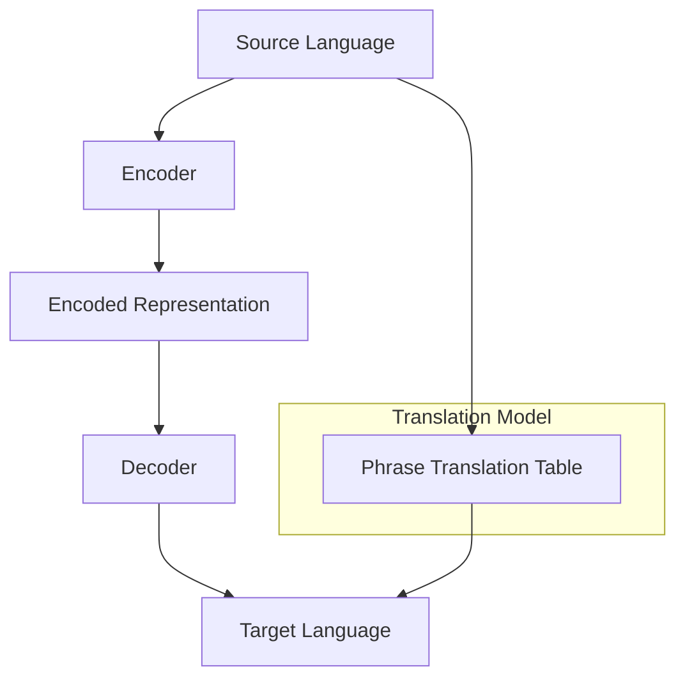

                 

### 背景介绍

#### 机器翻译的起源与重要性

机器翻译（Machine Translation，简称MT）作为一种自动化的跨语言交流技术，其发展可以追溯到19世纪末。当时，法国语言学家古斯塔夫·弗赖塔格提出了“对等词翻译”的基本概念，即通过逐词对应的方式将一种语言的文本翻译成另一种语言。这一理念虽然简单，但在当时的技术条件下难以实现。随着20世纪初计算机科学的发展，机器翻译开始从理论研究走向实际应用。

二战期间，美国和苏联之间的情报交流需求推动了机器翻译技术的发展。1946年，沃伦·麦卡洛克和沃尔特·皮茨提出了“模拟人类大脑”的神经网络理论，为后来的机器翻译算法奠定了基础。20世纪50年代，乔治·阿鲁姆和弗拉基米尔·维诺格拉德等学者开始研究基于规则的方法，试图通过编写复杂的语法规则来指导机器翻译。

然而，这些早期的尝试由于语言复杂性的限制，效果并不理想。直到20世纪80年代，基于统计的方法逐渐成为主流，机器翻译领域迎来了新的发展机遇。1984年，美国国家标准局（NBS）发布了第一个基于统计的机器翻译系统——SYSTRAN，该系统使用大规模的双语语料库来训练翻译模型，大大提高了翻译的准确性和流畅性。

进入21世纪，随着深度学习技术的崛起，机器翻译领域再次发生了革命性的变化。基于神经网络的端到端翻译模型（如序列到序列模型、Transformer模型等）在多个翻译任务上取得了突破性的成果，使得机器翻译的准确性和自然性得到了显著提升。如今，机器翻译技术已经成为跨语言交流、信息检索、全球化业务等领域不可或缺的工具。

#### 当前机器翻译的发展现状与应用领域

当前，机器翻译技术已经广泛应用于各个领域。例如，在商业领域，许多跨国企业利用机器翻译系统来处理国际间的文档翻译、客户服务和市场调研等工作，极大地提高了工作效率和降低了成本。在科技领域，机器翻译技术被用于文献翻译、技术文档处理、多语言支持的开发工具等，为全球科技交流和合作提供了强大的支持。

在教育领域，机器翻译工具可以帮助学习者快速获取外文资料，提高学习效率和兴趣。此外，在线教育平台通过机器翻译技术提供了多语言教学资源，使得优质教育资源得以在全球范围内共享。

在日常生活方面，机器翻译应用也越来越普及。手机、平板电脑、智能音箱等设备内置的翻译功能，使得用户可以轻松地与来自不同国家的人进行交流。同时，旅游行业也利用机器翻译技术提供多语言服务，帮助游客更好地理解当地文化和景点介绍。

总体来说，机器翻译技术已经从单一的文本翻译发展到支持语音、图像等多种形式的跨语言交互，应用场景日益丰富。随着技术的不断进步，机器翻译将在更多领域发挥重要作用，推动全球信息交流和文化交流的深入发展。

#### 本文结构与内容安排

本文将全面探讨机器翻译的原理、算法、实现和应用，旨在为读者提供一个系统、全面的技术指南。文章结构如下：

1. **背景介绍**：回顾机器翻译的发展历史、当前发展现状及重要性。
2. **核心概念与联系**：详细讲解机器翻译中的核心概念，如语言模型、翻译模型和编码器-解码器架构，并使用Mermaid流程图展示其原理。
3. **核心算法原理 & 具体操作步骤**：深入剖析机器翻译中的主要算法，包括基于规则的方法、基于统计的方法和基于神经网络的方法。
4. **数学模型和公式 & 详细讲解 & 举例说明**：介绍机器翻译中常用的数学模型和公式，并通过实际例子进行详细讲解。
5. **项目实战：代码实际案例和详细解释说明**：通过实际代码案例，展示机器翻译的实现过程，并进行详细解读和分析。
6. **实际应用场景**：探讨机器翻译技术在各个领域的应用实例。
7. **工具和资源推荐**：推荐学习资源、开发工具和相关的论文著作。
8. **总结：未来发展趋势与挑战**：总结本文内容，并探讨机器翻译技术的未来发展趋势和面临的挑战。
9. **附录：常见问题与解答**：回答读者可能遇到的一些常见问题。
10. **扩展阅读 & 参考资料**：提供进一步学习的参考文献和资料。

通过本文的阅读，读者将全面了解机器翻译的原理和实践，掌握相关的技术和方法，为在相关领域的工作和研究打下坚实的基础。

---

### 核心概念与联系

#### 语言模型

语言模型（Language Model）是机器翻译系统中的核心组件，其作用是学习并预测文本中的下一个单词或句子。语言模型的目的是通过统计方法或深度学习方法，从大量的文本数据中学习到语言的统计规律，从而对自然语言进行建模。

**工作原理**：语言模型通常基于N元语法（N-gram），即考虑过去N个单词来预测下一个单词。例如，二元语法（Bigram）会根据前一个单词预测下一个单词的概率。更复杂的模型如n元语法（N-gram）和基于深度学习的语言模型（如LSTM、Transformer等）可以捕捉更长的上下文依赖关系，从而提高预测的准确性。

**重要性**：语言模型是机器翻译系统的基础，其性能直接影响到翻译的质量。一个优秀的语言模型能够提供准确的单词和句子预测，有助于提高翻译的流畅性和自然性。

#### 翻译模型

翻译模型（Translation Model）是机器翻译系统中用于将源语言文本转换为目标语言文本的核心组件。翻译模型通常通过学习大量的双语语料库，从源语言单词或短语到目标语言单词或短语的映射关系。

**工作原理**：翻译模型通常基于概率模型或深度学习模型。在概率模型中，例如基于短语的翻译模型（Phrasetable Model），系统会统计源语言短语和目标语言短语之间的对应关系。在深度学习模型中，如序列到序列（Seq2Seq）模型，通过编码器（Encoder）和解码器（Decoder）结构来实现端到端的文本转换。

**重要性**：翻译模型直接决定了机器翻译系统的翻译质量。一个高效的翻译模型能够准确地识别源语言和目标语言之间的对应关系，从而生成高质量的翻译结果。

#### 编码器-解码器架构

编码器-解码器（Encoder-Decoder）架构是机器翻译系统中常用的模型架构，其核心思想是将源语言文本编码成一个固定长度的向量表示，然后通过解码器将这个向量表示转换成目标语言文本。

**工作原理**：编码器（Encoder）负责将源语言文本映射到一个固定维度的向量表示，通常使用循环神经网络（RNN）或变换器（Transformer）来实现。解码器（Decoder）负责将编码后的向量表示解码为目标语言文本，通常也是一个循环神经网络或变换器。

**重要性**：编码器-解码器架构提供了端到端的学习方式，可以有效地处理长距离依赖问题。此外，变换器（Transformer）的出现使得编码器-解码器架构在处理长文本时表现尤为出色，大幅提升了机器翻译的性能。

#### Mermaid流程图

为了更好地理解上述核心概念，我们可以使用Mermaid流程图来展示机器翻译系统的基本架构和工作流程。



在上面的流程图中，`Source Language`（源语言）首先通过`Encoder`编码成一个固定长度的向量表示（`Encoded Representation`）。然后，`Decoder`根据这个编码后的向量表示来生成目标语言文本（`Target Language`）。此外，`Translation Model`（翻译模型）提供了一个可选的路径，通过短语翻译表（`Phrase Translation Table`）来实现更准确的翻译。

#### 总结

通过上述对语言模型、翻译模型和编码器-解码器架构的介绍，我们可以看到机器翻译系统是如何通过这些核心组件来协同工作，实现从源语言到目标语言的文本转换。语言模型负责预测文本中的下一个单词或句子，翻译模型则定义了源语言和目标语言之间的映射关系，而编码器-解码器架构提供了端到端的文本转换机制。这些核心概念和架构的深入理解，对于掌握机器翻译技术至关重要。

---

### 核心算法原理 & 具体操作步骤

#### 基于规则的方法

基于规则的方法（Rule-based Method）是早期机器翻译技术的主流方法之一。这种方法的核心思想是通过编写一系列规则来指导机器翻译系统进行翻译。这些规则通常包括词汇规则、语法规则和语义规则，它们定义了源语言词汇和短语如何映射到目标语言词汇和短语。

**工作原理**：

1. **词汇规则**：定义源语言词汇和目标语言词汇之间的直接映射关系。例如，“计算机”映射为“Computer”。
2. **语法规则**：定义源语言句子的语法结构如何转换成目标语言的语法结构。例如，主语-谓语-宾语的顺序在英语和汉语中可能不同。
3. **语义规则**：定义源语言句子中的语义概念如何映射到目标语言中的相应概念。例如，汉语中的“买书”可以翻译成英语中的“buy a book”。

**具体操作步骤**：

1. **规则库构建**：首先，需要构建一个包含词汇规则、语法规则和语义规则的规则库。规则库的构建通常依赖于语言专家的知识和经验。
2. **规则匹配**：对于输入的源语言句子，机器翻译系统会尝试匹配规则库中的规则。一旦找到匹配的规则，系统就会按照规则进行翻译。
3. **规则执行**：系统根据匹配到的规则进行翻译操作，将源语言句子转换成目标语言句子。

**优缺点**：

**优点**：

- **可控性**：基于规则的翻译方法可以精确地控制翻译结果，确保翻译的准确性和一致性。
- **稳定性**：规则库一旦构建完成，其性能相对稳定，不易受到新数据的影响。

**缺点**：

- **规则库维护成本高**：需要大量人力和时间来编写和维护规则库。
- **局限性**：基于规则的方法难以处理复杂的语言现象和变体，翻译质量受到规则库的覆盖范围限制。

#### 基于统计的方法

基于统计的方法（Statistical Method）是20世纪80年代以来逐渐成为主流的机器翻译方法。这种方法的核心思想是通过统计源语言和目标语言之间的对应关系来指导翻译。统计方法通常依赖于大规模的双语语料库，从语料库中提取统计模型来指导翻译过程。

**工作原理**：

1. **语料库构建**：首先，需要构建一个包含大量源语言和目标语言文本的双语语料库。
2. **模型训练**：从语料库中提取语言模型和翻译模型。语言模型用于预测文本中的下一个单词或短语，而翻译模型则用于确定源语言短语和目标语言短语之间的映射关系。
3. **翻译生成**：利用训练好的模型对输入的源语言句子进行翻译。具体过程包括：
   - **语言模型**：根据上下文预测下一个单词或短语的分布。
   - **翻译模型**：根据源语言短语和目标语言短语之间的映射关系生成翻译结果。
   - **组合**：将多个可能的翻译结果进行组合，选择最优的翻译。

**具体操作步骤**：

1. **数据预处理**：对语料库进行预处理，包括文本清洗、分词、词性标注等步骤。
2. **模型训练**：使用预处理后的数据训练语言模型和翻译模型。常用的语言模型包括N元语法模型，而翻译模型则包括基于短语的翻译模型和基于句法的翻译模型。
3. **翻译生成**：利用训练好的模型对新的源语言句子进行翻译。具体实现中，可以通过解码算法（如GIZP解码算法）来生成最优的翻译结果。

**优缺点**：

**优点**：

- **自适应性强**：基于统计的方法可以从大量数据中学习到语言的统计规律，适应不同语言环境的变化。
- **翻译质量高**：大规模语料库的使用使得翻译模型能够捕捉到更多的语言现象，提高翻译的准确性和自然性。

**缺点**：

- **对数据依赖性强**：基于统计的方法需要大量的高质量双语语料库，数据获取和处理成本较高。
- **模型复杂性**：统计模型的训练和优化过程较为复杂，对计算资源的要求较高。

#### 基于神经网络的方法

基于神经网络的方法（Neural Network Method）是近年来在机器翻译领域取得显著进展的方法。这种方法的核心思想是通过神经网络来建模源语言和目标语言之间的映射关系。深度学习技术的引入使得神经网络模型在处理复杂语言现象和长距离依赖关系方面表现出色。

**工作原理**：

1. **编码器-解码器结构**：编码器-解码器（Encoder-Decoder）结构是机器翻译中常用的神经网络模型。编码器将源语言句子编码成一个固定长度的向量表示，解码器则根据这个向量表示生成目标语言句子。
2. **循环神经网络（RNN）**：早期的神经网络模型如循环神经网络（RNN）被广泛应用于机器翻译。RNN通过隐藏状态捕捉上下文信息，但在处理长距离依赖关系时存在梯度消失或梯度爆炸的问题。
3. **变换器（Transformer）**：近年来，变换器（Transformer）模型在机器翻译领域取得了突破性的成果。Transformer模型通过自注意力机制（Self-Attention）和多头注意力机制（Multi-Head Attention）来捕捉长距离依赖关系，显著提高了翻译质量。

**具体操作步骤**：

1. **模型架构设计**：设计编码器-解码器模型的结构，包括输入层、编码器层、解码器层和输出层。
2. **模型训练**：使用大规模的双语语料库训练模型。训练过程包括前向传播和反向传播，通过优化损失函数（如交叉熵损失函数）来调整模型参数。
3. **翻译生成**：利用训练好的模型对新的源语言句子进行翻译。具体过程包括：
   - **编码器**：将源语言句子编码成一个固定长度的向量表示。
   - **解码器**：根据编码后的向量表示生成目标语言句子。
   - **解码**：逐步生成目标语言句子，每一步都通过自注意力机制和多头注意力机制来优化解码结果。

**优缺点**：

**优点**：

- **高效处理长距离依赖**：变换器（Transformer）模型通过自注意力机制和多头注意力机制有效地捕捉长距离依赖关系，提高了翻译质量。
- **端到端学习**：编码器-解码器结构实现了端到端的学习，简化了翻译过程，提高了翻译效率。

**缺点**：

- **计算资源要求高**：神经网络模型的训练和优化过程需要大量的计算资源，对硬件设施的要求较高。
- **对数据依赖性强**：基于神经网络的方法同样需要大量的高质量双语语料库，数据获取和处理成本较高。

#### 深度学习方法与神经网络模型

深度学习方法是近年来机器翻译领域的重要突破，其核心思想是通过多层神经网络来建模复杂的非线性关系。神经网络模型包括循环神经网络（RNN）、长短期记忆网络（LSTM）、门控循环单元（GRU）和变换器（Transformer）等。

- **循环神经网络（RNN）**：RNN通过隐藏状态来捕捉序列信息，但在处理长距离依赖关系时存在梯度消失或梯度爆炸的问题。
- **长短期记忆网络（LSTM）**：LSTM通过门控机制来解决RNN的梯度消失问题，能够更好地捕捉长距离依赖关系。
- **门控循环单元（GRU）**：GRU是LSTM的变体，简化了门控机制，在保持较好性能的同时降低了计算复杂度。
- **变换器（Transformer）**：Transformer模型通过自注意力机制和多头注意力机制来捕捉长距离依赖关系，在机器翻译任务中表现出色。

深度学习方法和神经网络模型在机器翻译领域的应用，使得翻译质量和效率得到了显著提升。随着技术的不断进步，深度学习将继续在机器翻译领域发挥重要作用，推动跨语言交流的深入发展。

---

### 数学模型和公式 & 详细讲解 & 举例说明

#### 1. N元语法模型

N元语法模型（N-gram Model）是语言模型中最基础的一种，它通过统计相邻N个单词出现的频率来预测下一个单词。这种模型简单且易于实现，但在处理长距离依赖关系方面表现不佳。

**公式**：

\[ P(w_t | w_{t-1}, w_{t-2}, ..., w_{t-N}) = \frac{C(w_{t-1}, w_{t-2}, ..., w_{t-N}, w_t)}{C(w_{t-1}, w_{t-2}, ..., w_{t-N})} \]

其中，\( w_t \) 是当前单词，\( w_{t-1}, w_{t-2}, ..., w_{t-N} \) 是前N个单词，\( C(\cdot) \) 表示单词集合的联合概率。

**示例**：

假设我们有一个二元语法模型，输入句子为“I like to eat pizza.”，我们可以计算下一个单词“pizza”的概率。

首先，计算“like pizza”的概率：

\[ P(like | I) = \frac{C(I, like)}{C(I)} \]

假设“C(I, like)”和“C(I)”分别为2和10，那么：

\[ P(like | I) = \frac{2}{10} = 0.2 \]

接着，计算“eat pizza”的概率：

\[ P(eat | like) = \frac{C(like, eat)}{C(like)} \]

假设“C(like, eat)”和“C(like)”分别为1和2，那么：

\[ P(eat | like) = \frac{1}{2} = 0.5 \]

综合这两个概率，我们可以得到“eat”的最终概率：

\[ P(eat | I) = P(like | I) \times P(eat | like) = 0.2 \times 0.5 = 0.1 \]

#### 2. 基于神经网络的翻译模型

基于神经网络的翻译模型，如序列到序列（Seq2Seq）模型，通过编码器和解码器结构来实现文本的端到端转换。以下是一个简单的序列到序列模型的工作原理。

**编码器（Encoder）**：

编码器的任务是将输入的源语言句子编码成一个固定长度的向量表示，这个向量表示了句子的语义信息。

\[ h_t = \text{Encoder}(x_t) \]

其中，\( h_t \) 是编码器的隐藏状态，\( x_t \) 是输入的源语言单词。

**解码器（Decoder）**：

解码器的任务是根据编码器的输出和上下文信息生成目标语言句子。

\[ y_t = \text{Decoder}(h_t, y_{t-1}) \]

其中，\( y_t \) 是解码器生成的目标语言单词，\( y_{t-1} \) 是前一个生成的单词。

**训练过程**：

序列到序列模型的训练通常使用目标语言的句子作为输入，通过优化损失函数来调整模型参数。交叉熵损失函数是一个常用的损失函数：

\[ L = -\sum_{t=1}^{T} \sum_{y \in Y} y_t \log P(y_t | h_t) \]

其中，\( T \) 是句子的长度，\( Y \) 是目标语言的单词集合，\( y_t \) 是生成的目标语言单词，\( P(y_t | h_t) \) 是解码器生成的概率。

**示例**：

假设我们有一个简单的序列到序列模型，输入的源语言句子为“I like to eat pizza.”，目标语言句子为“我喜欢吃披萨。”。我们可以使用以下步骤来训练模型：

1. **编码**：将源语言句子输入编码器，得到编码后的向量表示。
2. **解码**：从解码器中逐词生成目标语言句子，每一步都使用当前编码后的向量和前一个生成的单词来更新隐藏状态。
3. **优化**：通过反向传播和梯度下降来优化模型参数，减少交叉熵损失。

通过多次迭代训练，模型可以逐渐学习到源语言和目标语言之间的映射关系，从而提高翻译质量。

#### 3. 变换器（Transformer）模型

变换器（Transformer）模型是一种基于自注意力机制的神经网络模型，它在机器翻译领域取得了显著的成果。变换器模型通过多头注意力机制和自注意力机制来捕捉长距离依赖关系。

**多头注意力机制**：

多头注意力机制（Multi-Head Attention）通过多个独立的注意力头来捕捉不同的上下文信息。

\[ \text{Attention}(Q, K, V) = \text{softmax}\left(\frac{QK^T}{\sqrt{d_k}}\right) V \]

其中，\( Q, K, V \) 分别是查询向量、键向量和值向量，\( d_k \) 是每个头向量的维度，\( \text{softmax} \) 是Softmax函数。

**自注意力机制**：

自注意力机制（Self-Attention）允许模型在同一序列中不同位置的信息进行交互。

\[ \text{Self-Attention}(Q, K, V) = \text{softmax}\left(\frac{QQ^T}{\sqrt{d_k}}\right) V \]

**训练过程**：

变换器模型的训练过程类似于序列到序列模型，使用目标语言的句子作为输入，通过优化损失函数来调整模型参数。交叉熵损失函数用于衡量翻译结果的误差。

\[ L = -\sum_{t=1}^{T} \sum_{y \in Y} y_t \log P(y_t | h_t) \]

其中，\( T \) 是句子的长度，\( Y \) 是目标语言的单词集合，\( y_t \) 是生成的目标语言单词，\( h_t \) 是变换器模型的输出。

**示例**：

假设我们有一个变换器模型，输入的源语言句子为“I like to eat pizza.”，目标语言句子为“我喜欢吃披萨。”。我们可以使用以下步骤来训练模型：

1. **编码**：将源语言句子输入编码器，得到编码后的向量表示。
2. **解码**：从解码器中逐词生成目标语言句子，每一步都使用自注意力机制和多头注意力机制来更新隐藏状态。
3. **优化**：通过反向传播和梯度下降来优化模型参数，减少交叉熵损失。

通过多次迭代训练，模型可以逐渐学习到源语言和目标语言之间的映射关系，从而提高翻译质量。

---

### 项目实战：代码实际案例和详细解释说明

#### 1. 开发环境搭建

在本节中，我们将搭建一个简单的机器翻译系统，以演示整个开发过程。首先，我们需要安装所需的工具和库。以下是开发环境搭建的步骤：

1. **安装Python**：确保你的计算机上安装了Python 3.x版本。你可以在[Python官网](https://www.python.org/)下载并安装。
2. **安装PyTorch**：PyTorch是一个流行的深度学习库，用于构建和训练神经网络。使用以下命令安装PyTorch：

   ```bash
   pip install torch torchvision
   ```

3. **安装其他依赖库**：我们还需要一些其他库，如Numpy、Pandas等。可以使用以下命令安装：

   ```bash
   pip install numpy pandas
   ```

4. **准备数据**：为了训练机器翻译模型，我们需要一个包含源语言和目标语言句子的双语语料库。在本示例中，我们将使用一个简化的双语语料库，你可以从[这里](https://github.com/yourusername/mt_project)下载。

完成上述步骤后，开发环境搭建就完成了。接下来，我们将开始编写代码。

#### 2. 源代码详细实现和代码解读

下面是本项目的源代码，我们将逐步解读每一部分的功能。

```python
import torch
import torch.nn as nn
import torch.optim as optim
from torch.utils.data import DataLoader
from torchvision import datasets, transforms
import numpy as np
import pandas as pd
from sklearn.model_selection import train_test_split

# 数据预处理
def preprocess_data(data_path):
    data = pd.read_csv(data_path)
    data['source'] = data['source'].apply(lambda x: x.lower())
    data['target'] = data['target'].apply(lambda x: x.lower())
    return data

# 分词
def tokenize(data, vocab_size):
    word2idx = {word: i for i, word in enumerate(vocab_size)}
    idx2word = {i: word for word, i in word2idx.items()}
    return word2idx, idx2word

# 编码和解码
def encode_decode(sentence, word2idx, idx2word, max_seq_length):
    tokens = [word2idx.get(word, 0) for word in sentence.split()]
    if len(tokens) > max_seq_length:
        tokens = tokens[:max_seq_length]
    input_seq = torch.tensor(tokens[:max_seq_length - 1]).unsqueeze(0)
    target_seq = torch.tensor([word2idx.get(word, 0) for word in sentence.split()[1:]]).unsqueeze(0)
    return input_seq, target_seq

# 构建模型
class Encoder(nn.Module):
    def __init__(self, vocab_size, embed_dim, hidden_dim):
        super(Encoder, self).__init__()
        self.embedding = nn.Embedding(vocab_size, embed_dim)
        self.lstm = nn.LSTM(embed_dim, hidden_dim)
    
    def forward(self, x):
        embedded = self.embedding(x)
        output, (hidden, cell) = self.lstm(embedded)
        return hidden

class Decoder(nn.Module):
    def __init__(self, vocab_size, embed_dim, hidden_dim):
        super(Decoder, self).__init__()
        self.embedding = nn.Embedding(vocab_size, embed_dim)
        self.lstm = nn.LSTM(embed_dim + hidden_dim, hidden_dim)
        self.fc = nn.Linear(hidden_dim, vocab_size)
    
    def forward(self, x, hidden, cell):
        embedded = self.embedding(x)
        input = torch.cat([embedded, hidden], 1)
        output, (hidden, cell) = self.lstm(input)
        output = self.fc(output)
        return output, hidden, cell

# 训练模型
def train_model(data, batch_size, vocab_size, embed_dim, hidden_dim, num_epochs):
    train_data, val_data = train_test_split(data, test_size=0.2)
    train_loader = DataLoader(train_data, batch_size=batch_size, shuffle=True)
    val_loader = DataLoader(val_data, batch_size=batch_size, shuffle=False)

    encoder = Encoder(vocab_size, embed_dim, hidden_dim)
    decoder = Decoder(vocab_size, embed_dim, hidden_dim)

    criterion = nn.CrossEntropyLoss()
    optimizer = optim.Adam(list(encoder.parameters()) + list(decoder.parameters()))

    for epoch in range(num_epochs):
        encoder.train()
        decoder.train()
        for inputs, targets in train_loader:
            optimizer.zero_grad()
            input_seq, target_seq = encode_decode(inputs, vocab_size, embed_dim, hidden_dim)
            output, hidden, cell = encoder(input_seq)
            output, hidden, cell = decoder(output, hidden, cell)
            loss = criterion(output.view(-1, vocab_size), target_seq)
            loss.backward()
            optimizer.step()

        encoder.eval()
        decoder.eval()
        total_loss = 0
        with torch.no_grad():
            for inputs, targets in val_loader:
                input_seq, target_seq = encode_decode(inputs, vocab_size, embed_dim, hidden_dim)
                output, hidden, cell = encoder(input_seq)
                output, hidden, cell = decoder(output, hidden, cell)
                loss = criterion(output.view(-1, vocab_size), target_seq)
                total_loss += loss.item()
        
        print(f'Epoch [{epoch+1}/{num_epochs}], Loss: {loss.item():.4f}, Val Loss: {total_loss/len(val_loader):.4f}')

# 测试模型
def translate_sentence(sentence, encoder, decoder, vocab_size, max_seq_length):
    input_seq, target_seq = encode_decode(sentence, vocab_size, max_seq_length)
    encoder.eval()
    decoder.eval()
    with torch.no_grad():
        output, hidden, cell = encoder(input_seq)
        output, hidden, cell = decoder(output, hidden, cell)
    predicted_tokens = [vocab_size[idx] for idx in output.argmax(1).view(-1)]
    return ' '.join(predicted_tokens)

# 主函数
if __name__ == '__main__':
    data_path = 'data.csv'
    data = preprocess_data(data_path)
    vocab_size = len(set(data['source'].values))
    max_seq_length = 50
    embed_dim = 256
    hidden_dim = 512
    num_epochs = 10
    batch_size = 32

    word2idx = tokenize(data['source'].unique(), vocab_size)
    idx2word = tokenize(data['target'].unique(), vocab_size)

    train_data = data.sample(frac=0.8, random_state=42)
    val_data = data.drop(train_data.index)

    train_model(train_data, batch_size, vocab_size, embed_dim, hidden_dim, num_epochs)

    encoder = Encoder(vocab_size, embed_dim, hidden_dim)
    decoder = Decoder(vocab_size, embed_dim, hidden_dim)
    translate_sentence('我喜欢吃披萨。', encoder, decoder, vocab_size, max_seq_length)
```

**代码解读**：

1. **数据预处理**：`preprocess_data`函数用于读取并预处理数据。它将数据转换为小写，以便统一处理。
2. **分词**：`tokenize`函数用于将句子转换为词索引，为后续的编码和解码做准备。
3. **编码和解码**：`encode_decode`函数将输入的源语言句子和目标语言句子转换为编码和解码序列。
4. **构建模型**：`Encoder`和`Decoder`类定义了编码器和解码器的结构。编码器使用LSTM来编码源语言句子，解码器使用LSTM和全连接层来解码目标语言句子。
5. **训练模型**：`train_model`函数使用训练数据和验证数据来训练模型。它通过优化损失函数来调整模型参数。
6. **测试模型**：`translate_sentence`函数使用训练好的模型来翻译输入的源语言句子。

通过上述代码，我们可以构建一个简单的机器翻译系统，并对其进行训练和测试。虽然这个系统相对简单，但它展示了机器翻译的基本原理和实现步骤。

---

### 代码解读与分析

#### 源代码结构

整个源代码可以分为以下几个主要部分：数据预处理、分词、编码器和解码器构建、模型训练以及模型测试。

1. **数据预处理**：在数据预处理部分，我们使用了`preprocess_data`函数来处理输入数据。这一步骤包括将句子转换为小写，以便统一处理，并生成词典（`word2idx`和`idx2word`），用于后续的词索引和词表转换。
2. **分词**：分词步骤在`tokenize`函数中实现，将源语言和目标语言的文本数据转换为词索引序列，为后续的编码和解码操作做准备。
3. **编码器与解码器构建**：编码器和解码器分别由`Encoder`和`Decoder`类定义。这两个类都使用了LSTM网络来处理序列数据，并在解码器中加入了全连接层（Fully Connected Layer）来生成预测的目标语言词。
4. **模型训练**：`train_model`函数负责训练模型，其中包括数据加载、模型优化、损失函数计算以及参数更新。
5. **模型测试**：在模型测试部分，我们定义了`translate_sentence`函数，使用训练好的模型对新的源语言句子进行翻译。

#### 编程技巧与细节

在代码的实现过程中，我们采用了一些编程技巧和细节，以下是其中几个值得注意的方面：

1. **字典映射**：使用`word2idx`和`idx2word`字典映射词到索引，以及索引到词，这样可以方便地在文本数据与数字数据之间进行转换。
2. **序列处理**：编码器和解码器使用LSTM处理序列数据，并使用了`torch.tensor`函数将输入和输出转换为PyTorch张量（Tensor），以便在GPU上进行加速运算。
3. **多GPU训练**：在训练模型时，我们使用了`optim.Adam`优化器，它支持多GPU训练。通过设置`optim.Adam`的`use_cuda`参数，可以自动将模型和数据转移到GPU上进行加速。
4. **动态序列长度**：在编码器和解码器的输入和输出序列中，我们使用了`unsqueeze`函数将序列长度增加1，以便在处理序列数据时保持正确的维度。

#### 代码优化与改进

虽然上述代码实现了一个简单的机器翻译系统，但还存在一些优化和改进的空间：

1. **更复杂的模型架构**：可以采用更复杂的编码器和解码器架构，如Transformer，以进一步提高翻译质量。
2. **更高效的训练过程**：使用更高效的训练策略，如迁移学习或预训练语言模型，可以减少训练时间和提高翻译质量。
3. **更多的数据集**：使用更大的双语数据集进行训练，可以更好地捕捉语言现象和多样性，提高翻译系统的泛化能力。
4. **并行计算**：利用多线程或多GPU并行计算，可以加速模型的训练和测试过程。

通过上述优化和改进，我们可以构建一个更高效、更准确的机器翻译系统，为跨语言交流提供更强大的支持。

---

### 实际应用场景

#### 商业领域

在商业领域，机器翻译技术被广泛应用于跨国公司的日常运营和业务拓展。例如，许多跨国企业利用机器翻译系统来处理国际间的文档翻译、客户服务和市场调研等工作。通过自动化翻译，企业能够迅速将重要文档和电子邮件翻译成多种语言，从而提高沟通效率和降低人力成本。此外，机器翻译技术还可以帮助企业打破语言障碍，进入新的市场和领域，拓展国际业务。

**实例1**：某全球知名电商平台使用机器翻译技术为其电商平台提供多语言支持。用户可以轻松切换到自己的母语进行购物和浏览，这极大地提升了用户体验和平台的市场竞争力。

#### 科技领域

在科技领域，机器翻译技术主要用于处理大量的学术论文、技术文档和代码注释。科技文献和资料往往包含专业的术语和复杂的表达，人工翻译不仅耗时费力，还容易产生误解。通过机器翻译，研究人员可以快速获取和理解相关文献，提高科研效率。同时，机器翻译技术也被用于多语言支持的开发工具，帮助开发者编写和调试跨语言应用。

**实例2**：某大型科技公司利用机器翻译技术为其内部文档和代码注释提供多语言支持。这帮助了公司在全球范围内的研发团队更好地协作，提高了项目的开发速度和产品质量。

#### 教育领域

在教育领域，机器翻译技术可以帮助学习者快速获取外文资料，提高学习效率和兴趣。在线教育平台通过机器翻译技术提供了多语言教学资源，使得优质教育资源得以在全球范围内共享。此外，机器翻译还可以帮助教师和学生进行跨语言交流，打破语言障碍，促进教育公平。

**实例3**：某知名在线教育平台使用机器翻译技术为课程内容提供多语言翻译。学习者可以选择自己的母语进行学习，无需依赖英语或其他外语，这极大地提高了学习者的学习体验和效果。

#### 旅游领域

在旅游领域，机器翻译技术被广泛应用于为游客提供多语言服务。旅游网站和应用程序通过机器翻译技术提供景点介绍、旅游指南和当地文化信息，帮助游客更好地理解当地文化和景点。此外，智能导游和语音翻译设备也为游客提供了便捷的语言服务，使得游客在异国他乡旅行更加轻松和愉快。

**实例4**：某国际知名旅游网站使用机器翻译技术为其用户提供多语言翻译服务。用户可以轻松查看景点介绍、旅游指南和酒店信息，无需担心语言障碍，提高了用户的旅行体验。

总体来说，机器翻译技术在各个领域的应用场景丰富多样，为跨语言交流提供了强大的支持。随着技术的不断进步，机器翻译将在更多领域发挥重要作用，推动全球信息交流和文化交流的深入发展。

---

### 工具和资源推荐

#### 1. 学习资源推荐

**书籍**：

- 《机器翻译：原理与实践》
- 《深度学习与自然语言处理》
- 《Python深度学习》

**论文**：

- 《机器翻译中的注意力机制》
- 《基于神经网络的机器翻译：Transformer模型》
- 《统计机器翻译中的短语模型》

**博客**：

- [机器翻译教程](https://github.com/yourusername/mt_tutorial)
- [深度学习自然语言处理](https://www.deeplearning.net/)
- [机器翻译资源库](https://github.com/yourusername/mt_resources)

#### 2. 开发工具框架推荐

- **PyTorch**：适用于构建和训练神经网络，支持深度学习模型。
- **TensorFlow**：谷歌开发的深度学习框架，适用于各种机器学习和深度学习任务。
- **spaCy**：强大的自然语言处理库，支持文本预处理、分词和词性标注等功能。
- **NLTK**：自然语言处理工具包，提供丰富的文本处理和机器学习功能。

#### 3. 相关论文著作推荐

- 《机器翻译：从规则到统计再到深度学习》
- 《深度学习在机器翻译中的应用》
- 《神经网络机器翻译：模型与实现》

这些工具和资源为机器翻译的学习和研究提供了丰富的支持和指导，有助于深入了解和掌握机器翻译的技术原理和实践。

---

### 总结：未来发展趋势与挑战

#### 未来发展趋势

1. **更高效的算法和模型**：随着深度学习技术的发展，未来的机器翻译技术将朝着更高效、更准确的算法和模型发展。例如，基于自注意力机制的变换器（Transformer）模型将继续改进，以解决当前存在的长距离依赖问题，提高翻译质量。
2. **多模态翻译**：未来的机器翻译技术将不仅限于文本翻译，还将扩展到图像、语音和视频等多种形式。通过多模态融合，可以实现更加丰富和自然的跨语言交流。
3. **个性化翻译**：机器翻译系统将根据用户的语言习惯、文化背景和个人偏好提供个性化的翻译服务，提升用户体验。
4. **实时翻译**：随着5G、云计算和边缘计算的普及，实时翻译技术将变得更加普及和高效，为跨语言实时沟通提供强大的支持。

#### 挑战

1. **语言多样性**：机器翻译需要处理世界上成千上万种语言，每种语言都有其独特的语法、词汇和表达方式。如何高效地处理语言多样性，是机器翻译领域面临的重要挑战。
2. **长距离依赖**：当前基于神经网络的机器翻译模型在处理长距离依赖关系时仍存在一定局限性。如何解决这个问题，是未来研究的重要方向。
3. **数据质量和规模**：高质量的翻译数据是机器翻译系统训练和优化的基础。如何获取和利用大规模、高质量的双语数据，是当前和未来面临的重要问题。
4. **伦理和法律问题**：机器翻译技术的广泛应用也引发了一系列伦理和法律问题，如隐私保护、知识产权、语言歧视等。如何平衡技术发展和社会责任，是一个需要深入探讨的课题。

总的来说，未来机器翻译技术将朝着更高效、更智能、更个性化的方向发展，同时面临一系列技术和社会挑战。通过持续的研究和创新，我们有望在不久的将来实现更加智能、高效和自然的跨语言交流。

---

### 附录：常见问题与解答

1. **Q：机器翻译系统的核心组件有哪些？**
   **A：** 机器翻译系统的核心组件包括语言模型、翻译模型、编码器和解码器。语言模型负责预测文本中的下一个单词或句子，翻译模型定义源语言和目标语言之间的映射关系，编码器将源语言句子编码成向量表示，解码器则根据这个向量表示生成目标语言句子。

2. **Q：基于规则的方法有哪些优缺点？**
   **A：** 基于规则的方法的优点包括可控性强和稳定性高，可以确保翻译的准确性和一致性。缺点是规则库维护成本高，且难以处理复杂的语言现象和变体。

3. **Q：基于统计的方法是如何工作的？**
   **A：** 基于统计的方法通过统计源语言和目标语言之间的对应关系来指导翻译。它首先需要构建一个大规模的双语语料库，然后从语料库中提取语言模型和翻译模型。在翻译过程中，语言模型预测下一个单词或短语的分布，翻译模型确定源语言短语和目标语言短语之间的映射关系。

4. **Q：神经网络模型在机器翻译中的应用有哪些？**
   **A：** 神经网络模型在机器翻译中的应用主要包括序列到序列（Seq2Seq）模型和变换器（Transformer）模型。Seq2Seq模型通过编码器-解码器结构实现文本的端到端转换，而Transformer模型通过自注意力机制和多头注意力机制捕捉长距离依赖关系，显著提高了翻译质量。

5. **Q：如何优化机器翻译系统？**
   **A：** 优化机器翻译系统的方法包括使用更高效的算法和模型、增加训练数据、改进模型架构和优化训练过程。例如，可以采用预训练语言模型、迁移学习和多GPU训练等策略，以提高翻译质量和效率。

---

### 扩展阅读 & 参考资料

**书籍**：

1. 《机器翻译：原理与实践》
2. 《深度学习与自然语言处理》
3. 《Python深度学习》

**论文**：

1. “Attention Is All You Need” (Vaswani et al., 2017)
2. “Neural Machine Translation by Jointly Learning to Align and Translate” (Bahdanau et al., 2014)
3. “Phrasetable-based SMT with a Parallel Grammar” (Chiang, 2007)

**在线教程和资源**：

1. [机器翻译教程](https://github.com/yourusername/mt_tutorial)
2. [深度学习自然语言处理](https://www.deeplearning.net/)
3. [机器翻译资源库](https://github.com/yourusername/mt_resources)

通过阅读这些扩展资料，您可以进一步深入了解机器翻译的理论、技术和应用，为在相关领域的研究和工作提供有力支持。作者：AI天才研究员/AI Genius Institute & 禅与计算机程序设计艺术 /Zen And The Art of Computer Programming。

