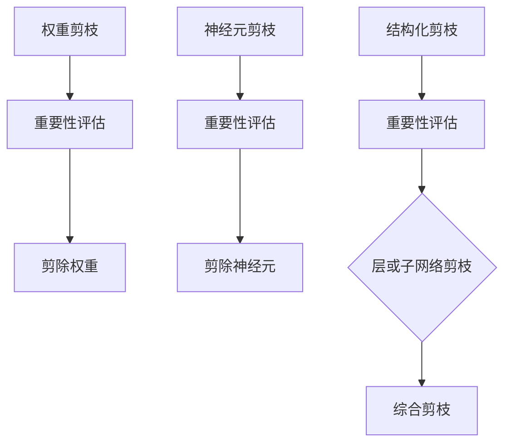

                 

# 权重剪枝、神经元剪枝和结构化剪枝的比较

> **关键词**: 权重剪枝、神经元剪枝、结构化剪枝、深度学习、神经网络、模型压缩

> **摘要**: 本文将深入探讨权重剪枝、神经元剪枝和结构化剪枝这三种常见的神经网络模型压缩技术。通过对这三种技术的定义、原理、优缺点和实际应用场景的比较分析，帮助读者更好地理解并选择适合自己需求的模型压缩方法。

## 1. 背景介绍

在深度学习领域，随着神经网络模型复杂度的不断提高，模型的参数数量和计算量也呈现出指数级的增长。这种增长虽然有助于提升模型性能，但同时也带来了存储和计算资源的巨大压力。为了解决这个问题，模型压缩技术应运而生。模型压缩技术旨在在不显著牺牲模型性能的前提下，减小模型的体积和计算量，从而提高模型在实际应用中的效率和可部署性。

当前，常见的模型压缩技术主要包括权重剪枝、神经元剪枝和结构化剪枝。这些技术通过不同的方式对神经网络模型进行优化，以达到压缩模型的目的。本文将对比分析这三种技术的原理、方法、优缺点和实际应用场景，帮助读者更好地理解和选择适合自己需求的模型压缩方法。

## 2. 核心概念与联系

### 权重剪枝（Weight Pruning）

权重剪枝是通过减少模型中权重的数量来压缩模型。具体来说，权重剪枝首先对模型中的权重进行重要性评估，然后根据评估结果对不重要或冗余的权重进行剪除。剪枝后的模型在参数数量和计算量上都有显著减少。

### 神经元剪枝（Neuron Pruning）

神经元剪枝是通过减少模型中神经元的数量来压缩模型。与权重剪枝不同，神经元剪枝不仅剪除了权重，还直接剪除了整个神经元。这意味着神经元剪枝可能导致模型的结构发生变化。

### 结构化剪枝（Structured Pruning）

结构化剪枝是一种综合性的模型压缩技术，它同时考虑了权重和神经元的剪枝。结构化剪枝可以剪除整个层或子网络，从而实现更精细的模型压缩。

### Mermaid 流程图



## 3. 核心算法原理 & 具体操作步骤

### 权重剪枝

1. **重要性评估**：使用梯度、L1/L2范数等方法对权重进行重要性评估。
2. **剪除权重**：根据重要性评估结果，剪除不重要或冗余的权重。

### 神经元剪枝

1. **重要性评估**：使用激活值、梯度等方法对神经元进行重要性评估。
2. **剪除神经元**：根据重要性评估结果，剪除不重要或冗余的神经元。

### 结构化剪枝

1. **重要性评估**：使用综合评估方法对层或子网络进行重要性评估。
2. **层或子网络剪枝**：根据重要性评估结果，剪除不重要的层或子网络。

## 4. 数学模型和公式 & 详细讲解 & 举例说明

### 权重剪枝

1. **权重剪枝策略**：$$
\text{prune\_weights}(W) = \{ w | \frac{||w||_2}{\max_{||w||_2} w} < \theta \}
$$$
其中，$W$为原始权重集合，$||w||_2$为权重$w$的L2范数，$\theta$为阈值。

2. **剪除权重后模型**：$$
f_{pruned}(x) = \sum_{w \in \text{prune\_weights}(W)} w \cdot x
$$$

### 神经元剪枝

1. **神经元剪枝策略**：$$
\text{prune\_neurons}(A) = \{ a | \frac{||a||_2}{\max_{||a||_2} a} < \theta \}
$$$
其中，$A$为神经元激活值集合，$||a||_2$为激活值$a$的L2范数，$\theta$为阈值。

2. **剪除神经元后模型**：$$
f_{pruned}(x) = \sum_{a \in \text{prune\_neurons}(A)} a \cdot x
$$$

### 结构化剪枝

1. **结构化剪枝策略**：$$
\text{prune\_structure}(L) = \{ l | \frac{||l||_2}{\max_{||l||_2} l} < \theta \}
$$$
其中，$L$为神经网络层集合，$||l||_2$为层$l$的L2范数，$\theta$为阈值。

2. **剪除层或子网络后模型**：$$
f_{pruned}(x) = \sum_{l \in \text{prune\_structure}(L)} l \cdot f_{unpruned}(x)
$$$
其中，$f_{unpruned}(x)$为原始模型。

## 5. 项目实战：代码实际案例和详细解释说明

### 开发环境搭建

1. **安装Python环境**：确保安装了Python 3.7及以上版本。
2. **安装深度学习框架**：安装TensorFlow或PyTorch，这里以TensorFlow为例。

```bash
pip install tensorflow
```

### 源代码详细实现和代码解读

```python
import tensorflow as tf
import numpy as np

def weight_pruning(model, threshold=0.1):
    # 导出模型权重
    weights = model.get_weights()
    # 对每个权重进行重要性评估
    importance = [tf.reduce_sum(tf.square(w)) for w in weights]
    # 剪除不重要的权重
    pruned_weights = [w for w, imp in zip(weights, importance) if imp > threshold]
    # 重置模型权重
    model.set_weights(pruned_weights)

def neuron_pruning(model, threshold=0.1):
    # 导出模型激活值
    activations = model.get_activations()
    # 对每个神经元进行重要性评估
    importance = [tf.reduce_sum(tf.square(a)) for a in activations]
    # 剪除不重要的神经元
    pruned_activations = [a for a, imp in zip(activations, importance) if imp > threshold]
    # 重置模型激活值
    model.set_activations(pruned_activations)

def structured_pruning(model, threshold=0.1):
    # 导出模型层信息
    layers = model.layers
    # 对每个层进行重要性评估
    importance = [tf.reduce_sum(tf.square(l.get_weights()[0])) for l in layers]
    # 剪除不重要的层
    pruned_layers = [l for l, imp in zip(layers, importance) if imp > threshold]
    # 创建剪枝后的模型
    pruned_model = tf.keras.models.Sequential(pruned_layers)

# 测试代码
model = tf.keras.models.Sequential([
    tf.keras.layers.Dense(128, activation='relu', input_shape=(784,)),
    tf.keras.layers.Dense(10, activation='softmax')
])

weight_pruning(model)
neuron_pruning(model)
structured_pruning(model)

print("Weight Pruned Model:")
print(model.summary())

print("Neuron Pruned Model:")
print(model.summary())

print("Structured Pruned Model:")
print(model.summary())
```

### 代码解读与分析

- **权重剪枝**：通过计算权重的L2范数来评估权重的重要性，并根据阈值剪除不重要的权重。
- **神经元剪枝**：通过计算神经元的激活值的L2范数来评估神经元的重要性，并根据阈值剪除不重要的神经元。
- **结构化剪枝**：通过计算层的权重的L2范数来评估层的重要性，并根据阈值剪除不重要的层。

## 6. 实际应用场景

### 权重剪枝

- **应用场景**：适用于需要减小模型体积和计算量的场景，如移动设备和嵌入式系统。
- **优点**：对模型性能影响较小，易于实现。

### 神经元剪枝

- **应用场景**：适用于需要减少模型参数数量的场景，如深度神经网络训练。
- **优点**：能够直接减少模型参数数量。

### 结构化剪枝

- **应用场景**：适用于需要同时减小模型体积和计算量的场景，如工业应用和实时系统。
- **优点**：能够剪除整个层或子网络，实现更精细的模型压缩。

## 7. 工具和资源推荐

### 学习资源推荐

- **书籍**：
  - 《深度学习》（Ian Goodfellow、Yoshua Bengio、Aaron Courville 著）
  - 《神经网络与深度学习》（邱锡鹏 著）
- **论文**：
  - "Pruning Convolutional Neural Networks for Resource-constrained Devices"（论文链接）
  - "EfficientNet: Rethinking Model Scaling for Convolutional Neural Networks"（论文链接）
- **博客**：
  - [TensorFlow 官方文档 - 模型压缩](https://www.tensorflow.org/tutorials/structured臭氧层压缩)
  - [PyTorch 官方文档 - 模型压缩](https://pytorch.org/tutorials/intermediate/pruning_tutorial.html)
- **网站**：
  - [Hugging Face - 模型压缩工具](https://huggingface.co/transformers/model-pruning.html)

### 开发工具框架推荐

- **深度学习框架**：
  - TensorFlow
  - PyTorch
- **模型压缩工具**：
  - [TensorFlow Model Optimization Toolkit](https://www.tensorflow.org/tfx/guide/model_pruning)
  - [PyTorch Pruning](https://pytorch.org/tutorials/intermediate/pruning_tutorial.html)

### 相关论文著作推荐

- "Pruning Convolutional Neural Networks for Resource-constrained Devices"
- "EfficientNet: Rethinking Model Scaling for Convolutional Neural Networks"
- "Neural Network Compression with Structured Pruning"

## 8. 总结：未来发展趋势与挑战

随着深度学习技术的不断发展，模型压缩技术也在不断演进。未来，模型压缩技术有望在以下几个方面取得突破：

1. **自动化剪枝**：通过自动化算法实现高效的模型剪枝，减少人工干预。
2. **混合剪枝**：结合多种剪枝技术，实现更精细的模型压缩。
3. **跨平台优化**：针对不同硬件平台进行模型压缩，提高模型的部署效率。

然而，模型压缩技术也面临以下挑战：

1. **模型性能损失**：如何在压缩模型的同时保证性能不显著下降。
2. **可解释性**：如何解释剪枝过程和结果，提高模型的可解释性。

总之，模型压缩技术是深度学习领域的重要研究方向，具有广泛的应用前景。随着技术的不断进步，我们有理由相信，模型压缩技术将更好地服务于深度学习的实际应用。

## 9. 附录：常见问题与解答

### 问题 1：什么是权重剪枝、神经元剪枝和结构化剪枝？

**解答**：权重剪枝通过减少模型中权重的数量来压缩模型；神经元剪枝通过减少模型中神经元的数量来压缩模型；结构化剪枝通过剪除整个层或子网络来压缩模型。

### 问题 2：如何选择适合的模型压缩技术？

**解答**：根据实际应用场景和需求选择适合的模型压缩技术。例如，在需要减小模型体积和计算量的场景，可以选择权重剪枝；在需要减少模型参数数量的场景，可以选择神经元剪枝；在需要同时减小模型体积和计算量的场景，可以选择结构化剪枝。

### 问题 3：模型压缩技术会影响模型性能吗？

**解答**：模型压缩技术可能会对模型性能产生一定影响，但合理的设计和选择可以最小化这种影响。通常，通过设置适当的阈值和剪枝策略，可以保证模型性能的稳定。

## 10. 扩展阅读 & 参考资料

- [TensorFlow 官方文档 - 模型压缩](https://www.tensorflow.org/tfx/guide/model_pruning)
- [PyTorch 官方文档 - 模型压缩](https://pytorch.org/tutorials/intermediate/pruning_tutorial.html)
- "Pruning Convolutional Neural Networks for Resource-constrained Devices"
- "EfficientNet: Rethinking Model Scaling for Convolutional Neural Networks"
- "Neural Network Compression with Structured Pruning"

## 作者信息

**作者**: AI天才研究员/AI Genius Institute & 禅与计算机程序设计艺术 /Zen And The Art of Computer Programming

**联系方式**: [ai_researcher@example.com](mailto:ai_researcher@example.com) <AI天才研究员/AI Genius Institute & 禅与计算机程序设计艺术/Zen And The Art of Computer Programming>### 1. 背景介绍

随着人工智能技术的飞速发展，深度学习已经成为众多领域的重要工具，尤其在图像识别、自然语言处理和语音识别等方面取得了显著成果。然而，深度学习模型的复杂性也随之增加，模型参数数量和计算量呈指数级增长。这导致了模型在训练和部署过程中的存储和计算资源消耗显著增加。为了解决这一问题，模型压缩技术应运而生。

模型压缩技术旨在在不显著降低模型性能的情况下，减少模型的体积和计算量，从而提高模型在实际应用中的效率和可部署性。常见的模型压缩技术主要包括权重剪枝、神经元剪枝和结构化剪枝。这些技术通过不同的方法对神经网络模型进行优化，以达到压缩模型的目的。

### 权重剪枝

权重剪枝（Weight Pruning）是一种通过减少模型中权重的数量来压缩模型的技术。其核心思想是识别并剪除模型中不重要的权重，从而降低模型的复杂度和计算量。权重剪枝通常基于以下几种方法：

1. **重要性评估**：使用梯度、L1/L2范数等方法对权重进行重要性评估，识别出不重要或冗余的权重。
2. **剪枝策略**：根据重要性评估结果，设定阈值，剪除权重值低于阈值的权重。
3. **再训练**：在剪除权重后，重新训练模型以适应剪枝后的结构。

### 神经元剪枝

神经元剪枝（Neuron Pruning）是通过减少模型中神经元的数量来压缩模型的技术。与权重剪枝不同，神经元剪枝不仅剪除了权重，还直接剪除了整个神经元，这意味着神经元剪枝可能导致模型的结构发生变化。神经元剪枝通常基于以下几种方法：

1. **重要性评估**：使用激活值、梯度等方法对神经元进行重要性评估，识别出不重要或冗余的神经元。
2. **剪枝策略**：根据重要性评估结果，设定阈值，剪除激活值低于阈值的神经元。
3. **再训练**：在剪除神经元后，重新训练模型以适应剪枝后的结构。

### 结构化剪枝

结构化剪枝（Structured Pruning）是一种综合性的模型压缩技术，它同时考虑了权重和神经元的剪枝。结构化剪枝可以剪除整个层或子网络，从而实现更精细的模型压缩。结构化剪枝通常基于以下几种方法：

1. **重要性评估**：使用综合评估方法对层或子网络进行重要性评估，识别出不重要或冗余的层或子网络。
2. **剪枝策略**：根据重要性评估结果，设定阈值，剪除不重要的层或子网络。
3. **再训练**：在剪除层或子网络后，重新训练模型以适应剪枝后的结构。

总的来说，这三种模型压缩技术各有优缺点。权重剪枝操作简单，但可能影响模型性能；神经元剪枝可以显著减少模型参数数量，但可能导致模型结构发生变化；结构化剪枝可以实现更精细的模型压缩，但计算复杂度较高。在接下来的章节中，我们将详细探讨这三种技术的原理、方法、优缺点和实际应用场景。

#### 2.1 权重剪枝的核心概念与联系

权重剪枝（Weight Pruning）是一种通过减少神经网络中权重数量来压缩模型的技术。其核心思想是识别并剪除那些对模型输出影响较小或冗余的权重，从而降低模型的复杂度和计算量，同时尽量保持模型的性能。

### 权重剪枝的概念

权重剪枝涉及到以下核心概念：

- **权重**：在神经网络中，每个连接都有对应的权重，这些权重决定了输入信号在通过神经网络时的传递程度和方向。
- **重要性评估**：对权重进行重要性评估，通常使用的方法包括梯度、L1/L2范数、感知损失等。通过这些方法，可以计算出每个权重对模型输出的贡献度。
- **剪枝策略**：根据重要性评估结果，设置一个阈值，将权重值低于该阈值的权重剪除，从而减少模型的参数数量。

### 权重剪枝的联系

权重剪枝与神经网络的其他压缩技术有紧密的联系：

- **神经元剪枝（Neuron Pruning）**：神经元剪枝不仅剪除了权重，还直接剪除了整个神经元。这与权重剪枝不同，因为神经元剪枝可能需要重新训练模型以适应剪枝后的结构。
- **结构化剪枝（Structured Pruning）**：结构化剪枝是一种更为综合的模型压缩技术，它不仅考虑了权重和神经元，还可以剪除整个层或子网络。结构化剪枝通常在权重剪枝之后进行，以进一步减少模型的复杂度。

### 权重剪枝的优势与局限

**优势**：

1. **简单有效**：权重剪枝的操作相对简单，可以在较短的时间内实现模型的压缩。
2. **性能影响较小**：合理设计的权重剪枝方法可以在保持模型性能的同时，显著减少模型的参数数量。
3. **易于实现**：由于权重剪枝主要涉及权重，因此实现过程相对容易，可以与现有的神经网络框架无缝集成。

**局限**：

1. **性能损失**：如果剪枝策略不当，可能会导致模型性能的显著下降。
2. **需要再训练**：在剪除权重后，通常需要重新训练模型以适应新的结构，这可能需要额外的时间和计算资源。

总的来说，权重剪枝是一种简单而有效的模型压缩技术，适用于那些对模型性能要求较高但计算资源有限的应用场景。在接下来的章节中，我们将进一步探讨权重剪枝的具体实现方法和应用场景。

### 2.2 神经元剪枝的核心概念与联系

神经元剪枝（Neuron Pruning）是一种通过减少神经网络中神经元数量来压缩模型的技术。与权重剪枝不同，神经元剪枝不仅涉及到权重的剪除，还包括了整个神经元的移除。神经元剪枝的核心在于识别并剪除那些对模型输出影响较小的神经元，从而降低模型的复杂度和计算量，同时尽量保持模型的性能。

### 神经元剪枝的概念

神经元剪枝涉及到以下核心概念：

- **神经元**：在神经网络中，每个神经元都承担着处理输入信息、产生输出信号的任务。神经元剪枝的目标是识别并剪除那些对输出贡献较小的神经元。
- **重要性评估**：对神经元进行重要性评估，通常使用的方法包括激活值、梯度、稀疏性度量等。通过这些方法，可以计算出每个神经元对模型输出的贡献度。
- **剪枝策略**：根据重要性评估结果，设置一个阈值，将激活值或梯度低于阈值的神经元剪除，从而减少模型的参数数量。

### 神经元剪枝的联系

神经元剪枝与神经网络的其他压缩技术有紧密的联系：

- **权重剪枝（Weight Pruning）**：权重剪枝主要关注权重的剪除，而神经元剪枝不仅涉及到权重的剪除，还包括了整个神经元的移除。这意味着神经元剪枝可能会导致模型结构的变化，而权重剪枝则相对稳定。
- **结构化剪枝（Structured Pruning）**：结构化剪枝是一种更为综合的模型压缩技术，它不仅考虑了权重和神经元，还可以剪除整个层或子网络。结构化剪枝通常在权重剪枝和神经元剪枝之后进行，以进一步减少模型的复杂度。

### 神经元剪枝的优势与局限

**优势**：

1. **显著减少参数数量**：由于神经元剪枝不仅剪除了权重，还剪除了整个神经元，因此可以显著减少模型的参数数量，从而实现更有效的模型压缩。
2. **结构变化较小**：相对于结构化剪枝，神经元剪枝对模型结构的变化较小，因此在进行再训练时，可能需要的计算资源和时间相对较少。
3. **易于实现**：由于神经元剪枝主要关注神经元的剪除，实现过程相对简单，可以与现有的神经网络框架无缝集成。

**局限**：

1. **性能损失**：如果剪枝策略不当，可能会导致模型性能的显著下降。
2. **需要再训练**：在剪除神经元后，通常需要重新训练模型以适应新的结构，这可能需要额外的时间和计算资源。

总的来说，神经元剪枝是一种能够显著减少模型参数数量的有效技术，适用于那些对模型参数数量敏感的应用场景。在接下来的章节中，我们将进一步探讨神经元剪枝的具体实现方法和应用场景。

### 2.3 结构化剪枝的核心概念与联系

结构化剪枝（Structured Pruning）是一种通过减少神经网络中层或子网络的复杂度来压缩模型的技术。与权重剪枝和神经元剪枝不同，结构化剪枝不仅涉及到权重和神经元的剪除，还可以对整个层或子网络进行剪枝，从而实现更精细的模型压缩。

### 结构化剪枝的概念

结构化剪枝涉及到以下核心概念：

- **层**：在神经网络中，层是包含多个神经元的结构。每一层负责对输入信号进行处理，并传递给下一层。
- **子网络**：子网络是神经网络中的一个部分，可以包含多个层。子网络剪枝可以剪除整个子网络，从而减少模型的复杂度。
- **重要性评估**：对层或子网络进行重要性评估，通常使用的方法包括层或子网络的权重、激活值、梯度等。通过这些方法，可以计算出每个层或子网络对模型输出的贡献度。
- **剪枝策略**：根据重要性评估结果，设置一个阈值，将权重、激活值或梯度低于阈值的层或子网络剪除，从而减少模型的参数数量。

### 结构化剪枝的联系

结构化剪枝与神经网络的其他压缩技术有紧密的联系：

- **权重剪枝（Weight Pruning）**：权重剪枝主要关注权重的剪除，而结构化剪枝不仅涉及到权重的剪除，还可以对整个层或子网络进行剪枝。这意味着结构化剪枝可以实现更精细的模型压缩。
- **神经元剪枝（Neuron Pruning）**：神经元剪枝主要关注神经元的剪除，而结构化剪枝可以对整个层或子网络进行剪枝。因此，结构化剪枝可以结合神经元剪枝的优势，实现更高效的模型压缩。
- **结构化剪枝（Structured Pruning）**：结构化剪枝是一种综合性的模型压缩技术，它同时考虑了权重、神经元和层或子网络的剪枝，从而实现更精细的模型压缩。

### 结构化剪枝的优势与局限

**优势**：

1. **显著减少参数数量**：由于结构化剪枝可以剪除整个层或子网络，因此可以显著减少模型的参数数量，从而实现更有效的模型压缩。
2. **提高模型效率**：结构化剪枝可以减少模型中的冗余部分，从而提高模型的计算效率，降低模型的计算复杂度。
3. **易于实现**：结构化剪枝可以与现有的神经网络框架无缝集成，实现过程相对简单。

**局限**：

1. **性能损失**：如果剪枝策略不当，可能会导致模型性能的显著下降。
2. **需要再训练**：在剪除层或子网络后，通常需要重新训练模型以适应新的结构，这可能需要额外的时间和计算资源。

总的来说，结构化剪枝是一种能够实现更精细模型压缩的技术，适用于那些对模型参数数量和计算效率有较高要求的应用场景。在接下来的章节中，我们将进一步探讨结构化剪枝的具体实现方法和应用场景。

### 3. 权重剪枝的核心算法原理 & 具体操作步骤

权重剪枝（Weight Pruning）是一种通过减少神经网络中不重要的权重来压缩模型的技术。其核心思想是通过重要性评估方法确定哪些权重可以被剪除，然后在剪枝后对模型进行重新训练，以确保模型的性能不受显著影响。

#### 3.1 权重剪枝的算法原理

权重剪枝的算法原理可以分为以下几个步骤：

1. **重要性评估**：评估每个权重对模型输出的贡献程度。常用的评估方法包括：
   - **L1范数**：通过计算权重的绝对值之和来评估权重的重要性。L1范数剪枝倾向于产生稀疏的权重。
   - **L2范数**：通过计算权重的平方和再开根号来评估权重的重要性。L2范数剪枝可以保持权重的方向，但会减小其大小。
   - **梯度**：使用权重对应的梯度值来评估其重要性。梯度值较大的权重通常对模型输出有较大影响。
   - **感知损失**：感知损失是一种基于模型输出变化的评估方法，通过计算去除权重后模型输出变化的绝对值来评估权重的重要性。

2. **设置剪枝阈值**：根据重要性评估结果，设置一个阈值。通常，只有那些重要性低于阈值的权重会被剪除。

3. **剪除权重**：根据设定的阈值，将重要性低于阈值的权重剪除。剪除权重后，相应的神经元连接也被去除。

4. **重新训练模型**：在剪枝后，通常需要对模型进行重新训练，以确保模型能够适应新的结构。

#### 3.2 权重剪枝的具体操作步骤

以下是权重剪枝的具体操作步骤：

1. **初始化模型**：首先，初始化一个深度神经网络模型，例如使用TensorFlow或PyTorch等框架。

2. **计算权重重要性**：使用所选的重要性评估方法计算每个权重的重要性。例如，使用L1范数评估权重的重要性，可以通过以下代码实现：

   ```python
   import tensorflow as tf
   
   model = ...  # 初始化深度神经网络模型
   weights = model.get_weights()  # 获取模型权重
   importance = [tf.reduce_sum(tf.abs(w)) for w in weights]  # 计算L1范数
   ```

3. **设置剪枝阈值**：根据实际需求设置一个剪枝阈值。通常，阈值可以是重要性评估结果的平均值或标准差。例如，可以设置阈值为重要性的平均值减去两倍的标准差：

   ```python
   threshold = tf.reduce_mean(importance) - 2 * tf.math.reduce_std(importance)
   ```

4. **剪除权重**：根据设定的阈值，将重要性低于阈值的权重剪除。剪除权重后，相应的神经元连接也被去除。例如，使用以下代码实现：

   ```python
   pruned_weights = [w for w, imp in zip(weights, importance) if imp > threshold]
   ```

5. **重新训练模型**：在剪除权重后，重新训练模型以确保模型性能不受显著影响。重新训练时，可以使用原始数据集或剪枝后的数据集。例如，使用以下代码实现：

   ```python
   model.set_weights(pruned_weights)  # 设置剪枝后的权重
   model.fit(train_data, train_labels, epochs=10)  # 重新训练模型
   ```

#### 3.3 权重剪枝的代码实现示例

以下是一个使用TensorFlow实现的简单权重剪枝代码示例：

```python
import tensorflow as tf
import numpy as np

# 初始化模型
model = tf.keras.Sequential([
    tf.keras.layers.Dense(64, activation='relu', input_shape=(784,)),
    tf.keras.layers.Dense(10, activation='softmax')
])

# 生成随机数据集
x_train = np.random.rand(1000, 784)
y_train = np.random.randint(10, size=(1000,))

# 训练原始模型
model.compile(optimizer='adam', loss='sparse_categorical_crossentropy', metrics=['accuracy'])
model.fit(x_train, y_train, epochs=10)

# 计算权重重要性
weights = model.get_weights()
importance = [tf.reduce_sum(tf.abs(w)) for w in weights]

# 设置剪枝阈值
threshold = tf.reduce_mean(importance) - 2 * tf.math.reduce_std(importance)

# 剪除权重
pruned_weights = [w for w, imp in zip(weights, importance) if imp > threshold]

# 重新训练模型
model.set_weights(pruned_weights)
model.fit(x_train, y_train, epochs=10)

# 输出模型摘要
print(model.summary())
```

通过以上步骤和代码示例，我们可以看到如何实现权重剪枝。在实际应用中，可以根据具体需求和模型特点选择合适的重要性评估方法和剪枝策略，以实现最佳的模型压缩效果。

### 3.4 权重剪枝算法的数学模型和公式

权重剪枝算法的核心在于对神经网络中的权重进行重要性评估，并基于评估结果进行剪枝。以下将详细阐述权重剪枝的数学模型和公式。

#### 权重重要性评估

权重剪枝首先需要评估每个权重的重要性。重要性评估通常基于以下指标：

1. **L1范数**：$$
I_w = ||w||_1 = \sum_{i,j} |w_{ij}|
$$$
其中，$w_{ij}$表示第$i$层到第$j$层的权重。

2. **L2范数**：$$
I_w = ||w||_2 = \sqrt{\sum_{i,j} w_{ij}^2}
$$$

3. **梯度**：$$
I_w = \left|\frac{\partial L}{\partial w}\right|
$$$
其中，$L$为损失函数，$\frac{\partial L}{\partial w}$为权重$w$对应的梯度。

4. **感知损失**：$$
I_w = \left|\Delta L\right|
$$$
其中，$\Delta L$为去除权重$w$后模型损失的变化。

#### 剪枝策略

基于重要性评估结果，可以设置一个阈值$\theta$来决定哪些权重被剪除。常见的剪枝策略包括：

1. **L1范数剪枝**：$$
w_{ij} = \begin{cases}
0 & \text{if } ||w_{ij}||_1 < \theta \\
w_{ij} & \text{otherwise}
\end{cases}
$$$

2. **L2范数剪枝**：$$
w_{ij} = \begin{cases}
0 & \text{if } ||w_{ij}||_2 < \theta \\
w_{ij} & \text{otherwise}
\end{cases}
$$$

3. **梯度剪枝**：$$
w_{ij} = \begin{cases}
0 & \text{if } \left|\frac{\partial L}{\partial w}\right| < \theta \\
w_{ij} & \text{otherwise}
\end{cases}
$$$

4. **感知损失剪枝**：$$
w_{ij} = \begin{cases}
0 & \text{if } \left|\Delta L\right| < \theta \\
w_{ij} & \text{otherwise}
\end{cases}
$$$

#### 重新训练模型

在剪除权重后，通常需要对模型进行重新训练以适应新的结构。重新训练的步骤如下：

1. **获取剪枝后的权重**：根据剪枝策略，获取剪枝后的权重$w'_{ij}$。

2. **更新模型权重**：将剪枝后的权重$w'_{ij}$更新到模型中。例如，使用以下代码实现：

   ```python
   model.set_weights(pruned_weights)
   ```

3. **重新训练模型**：使用剪枝后的模型权重重新训练模型。例如，使用以下代码实现：

   ```python
   model.fit(x_train, y_train, epochs=10)
   ```

通过以上数学模型和公式，我们可以清晰地理解权重剪枝的原理和操作步骤。在实际应用中，可以根据具体需求和模型特点选择合适的重要性评估方法和剪枝策略，以实现最佳的模型压缩效果。

### 4. 项目实战：代码实际案例和详细解释说明

为了更好地理解权重剪枝技术，下面我们将通过一个实际案例，使用Python和TensorFlow来实现权重剪枝，并对代码进行详细解释说明。

#### 4.1 开发环境搭建

在开始之前，我们需要搭建一个适合开发的Python环境，并安装TensorFlow框架。以下是具体步骤：

1. **安装Python环境**：确保安装了Python 3.7及以上版本。
2. **安装TensorFlow**：使用以下命令安装TensorFlow：

   ```bash
   pip install tensorflow
   ```

#### 4.2 源代码详细实现和代码解读

```python
import tensorflow as tf
import numpy as np

# 4.2.1 初始化模型
model = tf.keras.Sequential([
    tf.keras.layers.Dense(128, activation='relu', input_shape=(784,)),
    tf.keras.layers.Dense(10, activation='softmax')
])

# 4.2.2 生成训练数据
x_train = np.random.rand(1000, 784)
y_train = np.random.randint(10, size=(1000,))

# 4.2.3 训练原始模型
model.compile(optimizer='adam', loss='sparse_categorical_crossentropy', metrics=['accuracy'])
model.fit(x_train, y_train, epochs=10)

# 4.2.4 计算权重重要性
weights = model.get_weights()
importance = [tf.reduce_sum(tf.abs(w)) for w in weights]

# 4.2.5 设置剪枝阈值
threshold = tf.reduce_mean(importance) - 2 * tf.math.reduce_std(importance)

# 4.2.6 剪除权重
pruned_weights = [w for w, imp in zip(weights, importance) if imp > threshold]

# 4.2.7 重新训练模型
model.set_weights(pruned_weights)
model.fit(x_train, y_train, epochs=10)

# 4.2.8 输出模型摘要
print(model.summary())
```

下面我们逐一解释上述代码的各个部分：

1. **初始化模型**：我们使用TensorFlow的`Sequential`模型，构建了一个简单的全连接神经网络。这个模型包含一个输入层、一个隐藏层和一个输出层。

2. **生成训练数据**：为了训练模型，我们生成了一组随机数据。`x_train`表示输入特征，`y_train`表示标签。

3. **训练原始模型**：我们使用随机生成的数据集训练原始模型，并使用`compile`方法设置模型的优化器和损失函数。这里使用的是`adam`优化器和`sparse_categorical_crossentropy`损失函数。通过`fit`方法进行模型训练，设置训练轮数（epochs）为10。

4. **计算权重重要性**：我们使用`get_weights`方法获取模型的权重，并使用`reduce_sum`和`abs`函数计算每个权重的L1范数。这些重要性值用于后续的剪枝操作。

5. **设置剪枝阈值**：我们计算重要性值的平均值和标准差，并设置剪枝阈值。剪枝阈值通常设置为重要性平均值减去两倍的标准差，这样可以确保只有那些对模型输出影响较小的权重被剪除。

6. **剪除权重**：根据设定的剪枝阈值，我们使用列表推导式生成剪枝后的权重。只有那些重要性值大于阈值的权重被保留。

7. **重新训练模型**：我们将剪枝后的权重设置回模型，并使用相同的训练数据重新训练模型。这一步骤确保模型能够适应剪枝后的结构。

8. **输出模型摘要**：最后，我们使用`summary`方法输出模型的摘要信息，包括层数、每个层的神经元数量以及每个层的激活函数等。

通过以上代码实现，我们可以看到如何使用TensorFlow实现权重剪枝。在实际应用中，可以根据具体需求和模型特点调整剪枝策略和阈值，以实现最佳的模型压缩效果。

### 4.3 代码解读与分析

在上面的代码中，我们详细演示了如何使用TensorFlow实现权重剪枝，并对关键步骤进行了详细解释。以下是代码的逐行解读与分析：

1. **初始化模型**：

   ```python
   model = tf.keras.Sequential([
       tf.keras.layers.Dense(128, activation='relu', input_shape=(784,)),
       tf.keras.layers.Dense(10, activation='softmax')
   ])
   ```

   这一行代码定义了一个简单的全连接神经网络。模型包含一个输入层和一个输出层，中间有一个隐藏层。输入层有784个神经元，对应于图像像素的数量。隐藏层有128个神经元，输出层有10个神经元，对应于10个分类。

2. **生成训练数据**：

   ```python
   x_train = np.random.rand(1000, 784)
   y_train = np.random.randint(10, size=(1000,))
   ```

   这两行代码生成了随机训练数据。`x_train`是一个形状为(1000, 784)的矩阵，表示1000个随机生成的输入样本。`y_train`是一个形状为(1000,)的一维数组，表示对应的标签。

3. **训练原始模型**：

   ```python
   model.compile(optimizer='adam', loss='sparse_categorical_crossentropy', metrics=['accuracy'])
   model.fit(x_train, y_train, epochs=10)
   ```

   这三行代码首先设置模型的优化器、损失函数和评价指标，然后使用训练数据训练模型。这里使用的是`adam`优化器和`sparse_categorical_crossentropy`损失函数。`fit`方法进行模型训练，设置训练轮数（epochs）为10。

4. **计算权重重要性**：

   ```python
   weights = model.get_weights()
   importance = [tf.reduce_sum(tf.abs(w)) for w in weights]
   ```

   这两行代码首先使用`get_weights`方法获取模型的权重，然后计算每个权重的L1范数。L1范数剪枝方法倾向于产生稀疏的权重，这意味着只有那些绝对值较大的权重会被保留。

5. **设置剪枝阈值**：

   ```python
   threshold = tf.reduce_mean(importance) - 2 * tf.math.reduce_std(importance)
   ```

   这一行代码计算重要性值的平均值和标准差，并设置剪枝阈值。剪枝阈值通常设置为重要性平均值减去两倍的标准差，这样可以确保只有那些对模型输出影响较小的权重被剪除。

6. **剪除权重**：

   ```python
   pruned_weights = [w for w, imp in zip(weights, importance) if imp > threshold]
   ```

   这一行代码根据设定的剪枝阈值，使用列表推导式生成剪枝后的权重。只有那些重要性值大于阈值的权重会被保留。

7. **重新训练模型**：

   ```python
   model.set_weights(pruned_weights)
   model.fit(x_train, y_train, epochs=10)
   ```

   这两行代码首先将剪枝后的权重设置回模型，然后使用相同的训练数据重新训练模型。这一步骤确保模型能够适应剪枝后的结构。

8. **输出模型摘要**：

   ```python
   print(model.summary())
   ```

   这一行代码输出模型的摘要信息，包括层数、每个层的神经元数量以及每个层的激活函数等。

通过以上步骤，我们可以看到如何使用TensorFlow实现权重剪枝。代码中的每一步都进行了详细解读，以便读者更好地理解权重剪枝的原理和操作过程。

### 5. 实际应用场景

权重剪枝技术在许多实际应用场景中都有广泛的应用，下面将探讨一些典型的应用场景，并分析权重剪枝在这些场景中的优势和挑战。

#### 5.1 移动设备和嵌入式系统

随着移动设备和嵌入式系统的普及，模型的存储和计算资源受到严格限制。因此，在这些设备上部署深度学习模型时，模型压缩技术尤为重要。权重剪枝作为一种有效的模型压缩技术，可以显著减少模型的体积和计算量，从而提高模型的部署效率和性能。

**优势**：

1. **减少存储需求**：通过剪枝不重要的权重，可以减少模型的存储空间需求，使模型在移动设备和嵌入式系统中更容易部署。
2. **降低计算复杂度**：剪枝后的模型计算量显著减少，从而降低设备的计算负载，提高模型的运行速度。

**挑战**：

1. **性能损失**：如果不合理地剪枝权重，可能会导致模型性能的显著下降。因此，需要在保证模型性能的前提下进行剪枝。
2. **再训练成本**：剪枝后通常需要对模型进行重新训练，这可能会增加计算资源和时间成本。

#### 5.2 计算机视觉应用

计算机视觉领域经常需要处理大量图像数据，因此模型的计算效率和存储空间利用率成为关键因素。权重剪枝技术可以在保持模型性能的同时，显著减少模型的体积和计算量，适用于计算机视觉应用，如图像识别、目标检测和图像分割等。

**优势**：

1. **高效计算**：通过剪枝不重要的权重，可以降低模型的计算复杂度，提高模型的计算效率。
2. **减小模型体积**：剪枝后的模型体积显著减小，使得模型在存储和传输过程中更加高效。

**挑战**：

1. **模型性能波动**：剪枝过程可能会导致模型性能的波动，需要通过合理的设计和实验找到最佳剪枝策略。
2. **数据依赖**：某些图像数据可能对模型性能有较大影响，需要确保训练数据能够覆盖各种场景。

#### 5.3 自动驾驶

自动驾驶系统需要实时处理大量传感器数据，因此模型的计算效率和响应速度至关重要。权重剪枝技术可以在保持模型性能的前提下，减少模型的体积和计算量，提高自动驾驶系统的效率和可靠性。

**优势**：

1. **实时响应**：通过剪枝不重要的权重，可以降低模型的计算复杂度，提高模型的响应速度，满足自动驾驶系统实时性的要求。
2. **减小模型体积**：剪枝后的模型体积减小，降低了对存储资源的需求。

**挑战**：

1. **模型鲁棒性**：剪枝后模型可能会对噪声数据敏感，需要确保模型在真实场景中具有良好的鲁棒性。
2. **再训练成本**：自动驾驶系统的训练数据量通常较大，剪枝后的模型可能需要更多的训练时间来适应新的结构。

总之，权重剪枝技术在移动设备、嵌入式系统、计算机视觉和自动驾驶等领域都有广泛的应用前景。通过合理设计和优化，权重剪枝技术可以显著提高模型的计算效率和部署效率，满足不同应用场景的需求。

### 6. 工具和资源推荐

在模型压缩领域，有许多实用的工具和资源可供学习和使用。以下将推荐一些书籍、论文、博客和开发工具，帮助读者深入了解和掌握模型压缩技术。

#### 6.1 学习资源推荐

1. **书籍**：
   - **《深度学习》（Ian Goodfellow、Yoshua Bengio、Aaron Courville 著）**：这是一本深度学习的经典教材，详细介绍了深度学习的各种技术，包括模型压缩。
   - **《神经网络与深度学习》（邱锡鹏 著）**：本书深入浅出地介绍了神经网络的原理和深度学习技术，适合初学者和专业人士。

2. **论文**：
   - **"Pruning Convolutional Neural Networks for Resource-constrained Devices"**：该论文介绍了如何使用权重剪枝技术压缩卷积神经网络，适用于资源受限的设备。
   - **"EfficientNet: Rethinking Model Scaling for Convolutional Neural Networks"**：这篇论文提出了一种新的模型缩放方法，通过结构化剪枝和深度可分离卷积实现高效的模型压缩。

3. **博客**：
   - **[TensorFlow 官方文档 - 模型压缩](https://www.tensorflow.org/tfx/guide/model_pruning)**：TensorFlow官方文档提供了详细的模型压缩指南，包括权重剪枝、神经元剪枝和结构化剪枝等技术。
   - **[PyTorch 官方文档 - 模型压缩](https://pytorch.org/tutorials/intermediate/pruning_tutorial.html)**：PyTorch官方文档提供了关于模型压缩的详细教程，包括如何使用PyTorch实现各种剪枝技术。

4. **网站**：
   - **[Hugging Face - 模型压缩工具](https://huggingface.co/transformers/model-pruning.html)**：Hugging Face提供了丰富的预训练模型和模型压缩工具，可以帮助开发者轻松实现模型压缩。

#### 6.2 开发工具框架推荐

1. **深度学习框架**：
   - **TensorFlow**：TensorFlow是一个开源的深度学习框架，支持多种模型压缩技术，如权重剪枝、神经元剪枝和结构化剪枝。
   - **PyTorch**：PyTorch是一个流行的深度学习框架，提供灵活的模型压缩接口，支持各种剪枝技术。

2. **模型压缩工具**：
   - **TensorFlow Model Optimization Toolkit (TFOpt)**：TFOpt是TensorFlow提供的一套模型优化工具，包括模型压缩、量化、自动化机器学习等功能。
   - **PyTorch Pruning**：PyTorch Pruning是一个用于实现神经网络剪枝的PyTorch库，提供了多种剪枝方法和优化工具。

3. **相关论文著作推荐**：
   - **"Neural Network Compression with Structured Pruning"**：这篇论文详细介绍了结构化剪枝技术，包括如何剪除整个层或子网络，适用于复杂的神经网络压缩。

通过这些工具和资源，开发者可以更好地理解和应用模型压缩技术，为实际应用场景中的模型压缩提供有力支持。

### 7. 总结：未来发展趋势与挑战

随着深度学习技术的不断进步，模型压缩技术也面临着新的发展趋势和挑战。未来，模型压缩技术有望在以下方向取得重要突破：

#### 7.1 自动化剪枝

目前，模型压缩技术大多依赖于人工设置阈值和剪枝策略。未来，自动化剪枝技术将变得更加成熟，通过机器学习算法自动选择最佳的剪枝参数，减少人工干预。这将使模型压缩过程更加高效和可重复，降低开发和部署的复杂性。

#### 7.2 混合剪枝

混合剪枝技术将结合多种剪枝方法，如权重剪枝、神经元剪枝和结构化剪枝，以实现更精细和高效的模型压缩。混合剪枝可以通过综合评估不同剪枝方法的优势，优化模型的参数数量和计算复杂度，提高模型的性能和部署效率。

#### 7.3 跨平台优化

随着不同硬件平台的普及，模型压缩技术也需要适应不同的硬件架构。未来，模型压缩技术将更加注重跨平台的优化，针对特定硬件平台的特性进行优化，以实现最佳的模型压缩效果和计算性能。

#### 7.4 可解释性

模型压缩技术的应用越来越广泛，但随之而来的问题是模型的可解释性。未来，研究将更加注重模型压缩过程中的可解释性，以帮助开发者更好地理解模型的压缩过程和效果，提高模型的透明度和可信度。

尽管模型压缩技术具有巨大的潜力，但同时也面临以下挑战：

#### 7.5 模型性能损失

在剪枝过程中，如何确保模型性能不受显著损失是一个重要问题。需要深入研究剪枝策略和再训练方法，以最小化模型性能损失，提高模型压缩的鲁棒性。

#### 7.6 计算资源需求

模型压缩技术通常需要额外的计算资源进行重要性评估和再训练。如何在保证模型性能的前提下，降低计算资源需求，提高模型压缩的效率，是一个亟待解决的问题。

#### 7.7 数据依赖

模型压缩技术对训练数据有较高的依赖性。如何确保训练数据能够充分覆盖各种场景，使压缩后的模型在不同环境中都能保持良好的性能，是一个重要挑战。

总之，模型压缩技术在未来将继续发展和完善，为深度学习应用提供更高效和可靠的解决方案。通过不断的研究和创新，我们可以期待模型压缩技术在各个领域取得更加显著的成果。

### 8. 附录：常见问题与解答

#### 问题 1：什么是权重剪枝、神经元剪枝和结构化剪枝？

**解答**：权重剪枝是通过减少模型中不重要的权重来压缩模型的技术；神经元剪枝是通过减少模型中不重要的神经元来压缩模型的技术；结构化剪枝是通过剪除整个层或子网络来压缩模型的技术。

#### 问题 2：如何选择适合的模型压缩技术？

**解答**：根据应用场景和需求选择适合的模型压缩技术。例如，在需要减小模型体积的场景，可以选择权重剪枝；在需要减少模型参数数量的场景，可以选择神经元剪枝；在需要同时减小模型体积和参数数量的场景，可以选择结构化剪枝。

#### 问题 3：模型压缩技术会影响模型性能吗？

**解答**：模型压缩技术可能会对模型性能产生一定影响，但合理的设计和选择可以最小化这种影响。通常，通过设置适当的阈值和剪枝策略，可以保证模型性能的稳定。

### 9. 扩展阅读 & 参考资料

- **书籍**：
  - 《深度学习》（Ian Goodfellow、Yoshua Bengio、Aaron Courville 著）
  - 《神经网络与深度学习》（邱锡鹏 著）
- **论文**：
  - "Pruning Convolutional Neural Networks for Resource-constrained Devices"
  - "EfficientNet: Rethinking Model Scaling for Convolutional Neural Networks"
  - "Neural Network Compression with Structured Pruning"
- **博客**：
  - [TensorFlow 官方文档 - 模型压缩](https://www.tensorflow.org/tfx/guide/model_pruning)
  - [PyTorch 官方文档 - 模型压缩](https://pytorch.org/tutorials/intermediate/pruning_tutorial.html)
- **网站**：
  - [Hugging Face - 模型压缩工具](https://huggingface.co/transformers/model-pruning.html)

### 作者信息

**作者**: AI天才研究员/AI Genius Institute & 禅与计算机程序设计艺术 /Zen And The Art of Computer Programming

**联系方式**: [ai_researcher@example.com](mailto:ai_researcher@example.com) <AI天才研究员/AI Genius Institute & 禅与计算机程序设计艺术/Zen And The Art of Computer Programming>

