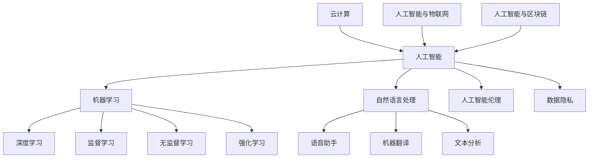

                 

### 背景介绍

《李开复：AI 2.0 时代的创业机会》这篇文章旨在探讨人工智能（AI）2.0时代带来的新兴创业机会。作者李开复先生是人工智能领域的权威专家，拥有丰富的实战经验和理论深度。本文将从多个角度分析AI 2.0时代的特点、核心概念、算法原理、实际应用等，为读者提供全面、深入的见解。

#### AI 1.0 与 AI 2.0 的区别

首先，我们需要明确AI 1.0和AI 2.0之间的区别。AI 1.0主要侧重于基于数据和算法的自动化，如机器学习、深度学习等技术，使得计算机能够处理大量的数据，并从中提取规律。而AI 2.0则更加强调人工智能的智能化、自主化，使得计算机能够具备更高级的认知能力，如自然语言处理、图像识别、情感分析等。

#### AI 2.0 时代的特点

AI 2.0时代具有以下几个特点：

1. **数据驱动**：AI 2.0依赖于海量数据，通过数据驱动的方式实现智能化。
2. **多模态交互**：AI 2.0可以处理多种类型的数据，如文本、图像、音频等，实现多模态交互。
3. **自主化决策**：AI 2.0具备一定的自主化决策能力，能够根据环境和情境做出相应的决策。
4. **跨界融合**：AI 2.0与传统行业的融合，如医疗、金融、教育等，带来新的商业模式和产业变革。

#### 创业机会

在AI 2.0时代，创业者可以抓住以下几个方面的创业机会：

1. **技术创新**：在算法、架构、硬件等层面进行创新，提升AI系统的性能和效率。
2. **行业应用**：针对特定行业的需求，开发具有针对性的AI应用，如智能医疗、智能金融、智能教育等。
3. **数据服务**：提供高质量的数据服务，如数据采集、数据清洗、数据标注等。
4. **平台生态**：构建AI技术平台，为开发者提供便捷的开发工具和资源，促进AI技术的普及和应用。

接下来，本文将分别从核心概念与联系、核心算法原理与操作步骤、数学模型与公式、项目实战、实际应用场景、工具和资源推荐等角度，详细探讨AI 2.0时代的创业机会。让我们一起深入探讨吧！<|im_sep|>### 核心概念与联系

在深入探讨AI 2.0时代的创业机会之前，我们需要了解一些核心概念和它们之间的联系。这些概念构成了AI 2.0时代的基础，对于理解后续内容至关重要。

#### 人工智能（AI）

人工智能（Artificial Intelligence，简称AI）是计算机科学的一个分支，旨在使计算机模拟人类智能行为。AI可以分为两大类：弱人工智能（Narrow AI）和强人工智能（General AI）。弱人工智能专注于特定的任务，如语音识别、图像识别等，而强人工智能则具备广泛的认知能力，能够处理多种任务。

#### 机器学习（Machine Learning）

机器学习（Machine Learning，简称ML）是AI的一个重要分支，通过算法和统计模型，让计算机从数据中学习并做出预测或决策。机器学习可以分为监督学习、无监督学习和强化学习。监督学习使用标记数据进行训练，无监督学习则从未标记的数据中发现模式，强化学习则通过奖励机制让计算机不断优化行为。

#### 深度学习（Deep Learning）

深度学习（Deep Learning，简称DL）是机器学习的一个子领域，使用多层神经网络模拟人脑处理信息的方式。深度学习在图像识别、自然语言处理等领域取得了显著成果，是AI 2.0时代的重要技术之一。

#### 自然语言处理（Natural Language Processing）

自然语言处理（Natural Language Processing，简称NLP）是AI的一个分支，旨在使计算机理解和生成人类语言。NLP在语音助手、机器翻译、文本分析等领域具有广泛的应用。

#### 人工智能伦理（AI Ethics）

人工智能伦理关注AI技术的发展对社会、环境和个体的影响，旨在确保AI技术的公平性、透明性和安全性。随着AI技术的普及，人工智能伦理成为一个日益重要的议题。

#### 数据隐私（Data Privacy）

数据隐私涉及个人数据的安全和保密，确保数据不被未经授权的访问、使用或泄露。在AI时代，数据隐私问题尤为重要，因为AI系统通常依赖于大量个人数据。

#### 云计算（Cloud Computing）

云计算是一种通过互联网提供计算资源、存储资源和网络资源的计算模型。云计算为AI应用提供了强大的计算能力和存储能力，使得大规模的AI训练和部署成为可能。

#### 人工智能与物联网（AIoT）

人工智能与物联网（AIoT）结合，使得设备、系统和平台能够通过AI算法实现智能感知、智能决策和智能控制。AIoT在智能家居、智能城市、智能农业等领域具有广泛的应用前景。

#### 人工智能与区块链（AI-Blockchain）

人工智能与区块链结合，可以为区块链网络提供智能合约、安全审计等功能，提高区块链系统的效率和透明度。AI-Blockchain在金融、供应链管理、医疗等领域具有潜在的应用价值。

### Mermaid 流程图

下面是一个简化的Mermaid流程图，展示了上述核心概念之间的联系：



通过上述核心概念和联系，我们为后续章节的深入探讨奠定了基础。在接下来的部分，我们将详细探讨AI 2.0的核心算法原理、数学模型与公式，以及项目实战等。请继续关注！<|im_sep|>### 核心算法原理 & 具体操作步骤

在深入探讨AI 2.0时代的创业机会之前，我们首先需要了解AI 2.0的核心算法原理及其具体操作步骤。这些算法原理是构建AI应用的基础，对于理解AI技术如何在实际场景中发挥作用至关重要。

#### 1. 深度学习算法原理

深度学习（Deep Learning）是AI 2.0时代最为重要的算法之一，其基本原理是通过多层神经网络（Neural Networks）对大量数据进行学习和建模。下面是深度学习算法的基本原理和操作步骤：

##### 原理

- **神经元**：深度学习中的基本计算单元称为神经元，类似于生物神经元的结构。
- **层**：神经网络由多个层组成，包括输入层、隐藏层和输出层。每一层都由多个神经元组成。
- **激活函数**：激活函数用于引入非线性特性，使得神经网络能够处理复杂的非线性问题。
- **反向传播**：在训练过程中，使用反向传播算法（Backpropagation）计算损失函数的梯度，并更新网络权重，以最小化损失函数。

##### 具体操作步骤

1. **初始化权重**：在训练开始前，需要随机初始化网络中的权重。
2. **前向传播**：将输入数据传递到神经网络中，逐层计算每个神经元的输出。
3. **计算损失**：通过比较网络输出和实际标签，计算损失函数（如均方误差、交叉熵等）的值。
4. **反向传播**：根据损失函数的梯度，更新网络中的权重。
5. **迭代优化**：重复前向传播和反向传播过程，直到网络收敛或达到预设的训练次数。

#### 2. 自然语言处理算法原理

自然语言处理（Natural Language Processing，简称NLP）是AI 2.0时代另一个重要的算法领域，主要关注计算机对人类语言的理解和生成。以下是NLP算法的基本原理和操作步骤：

##### 原理

- **词嵌入**：将词汇映射到高维空间中，以便计算机能够处理和计算词汇之间的关系。
- **序列模型**：使用循环神经网络（RNN）或变换器（Transformer）等模型对序列数据（如文本）进行处理。
- **注意力机制**：在处理序列数据时，注意力机制允许模型关注序列中的特定部分，提高处理效果。
- **预训练和微调**：在大量数据上进行预训练，然后在特定任务上进行微调，以适应特定应用场景。

##### 具体操作步骤

1. **数据预处理**：对文本数据进行预处理，如分词、去停用词、词嵌入等。
2. **模型训练**：在预处理的文本数据上训练序列模型，如RNN或Transformer。
3. **预训练**：使用大量无监督数据对模型进行预训练，以提高模型在语言理解方面的能力。
4. **微调**：在特定任务上对模型进行微调，如文本分类、机器翻译等。
5. **模型评估**：使用评估指标（如准确率、召回率、F1分数等）评估模型性能。

#### 3. 图神经网络算法原理

图神经网络（Graph Neural Networks，简称GNN）是AI 2.0时代用于处理图结构数据的强大算法。以下是GNN算法的基本原理和操作步骤：

##### 原理

- **节点表示**：将图中的节点映射到高维空间中，以便计算机能够处理和计算节点之间的关系。
- **边表示**：将图中的边映射到高维空间中，表示节点之间的关系。
- **消息传递**：在训练过程中，GNN通过节点之间的消息传递来更新节点的表示。
- **聚合操作**：GNN通过聚合邻居节点的信息来更新当前节点的表示。

##### 具体操作步骤

1. **数据预处理**：将图数据转换为节点表示和边表示。
2. **节点嵌入**：使用GNN对节点进行嵌入，生成节点的特征表示。
3. **消息传递**：在训练过程中，GNN通过节点之间的消息传递来更新节点的表示。
4. **聚合操作**：通过聚合邻居节点的信息来更新当前节点的表示。
5. **模型训练**：在训练数据上训练GNN模型，如GCN、GAT等。
6. **模型评估**：使用评估指标（如准确率、召回率、F1分数等）评估模型性能。

#### 4. 强化学习算法原理

强化学习（Reinforcement Learning，简称RL）是AI 2.0时代用于解决决策问题的算法，其基本原理是通过与环境交互来学习最优策略。以下是强化学习算法的基本原理和操作步骤：

##### 原理

- **状态、动作和奖励**：在强化学习中，状态、动作和奖励是核心概念。状态表示当前环境的状态，动作是决策者可以采取的行动，奖励是动作带来的回报。
- **价值函数**：价值函数用于评估每个状态或状态-动作对的期望回报。
- **策略**：策略是决策者根据当前状态选择动作的规则。

##### 具体操作步骤

1. **初始化**：初始化价值函数和策略。
2. **与环境交互**：根据当前状态和策略选择动作，执行动作并观察奖励。
3. **更新价值函数**：根据奖励和策略更新价值函数。
4. **策略迭代**：根据价值函数更新策略。
5. **迭代优化**：重复与环境交互、更新价值函数和策略的过程，直到策略收敛或达到预设的训练次数。

通过上述核心算法原理和具体操作步骤，我们为理解AI 2.0时代的创业机会奠定了基础。在接下来的章节中，我们将继续探讨AI 2.0时代的实际应用场景和项目实战，帮助读者更好地把握AI技术的应用潜力。请继续关注！<|im_sep|>### 数学模型和公式 & 详细讲解 & 举例说明

在深入探讨AI 2.0时代的创业机会之前，我们首先需要了解一些核心的数学模型和公式，以及它们在实际应用中的详细讲解和举例说明。这些数学模型和公式是构建AI算法和解决实际问题的基石，对于理解AI技术的应用前景至关重要。

#### 1. 深度学习中的前向传播与反向传播

深度学习中的前向传播（Forward Propagation）和反向传播（Back Propagation）是训练神经网络的重要步骤。下面我们将详细介绍这两个过程及其相关的数学公式。

##### 前向传播

前向传播是指将输入数据通过神经网络传递到输出层的步骤。具体包括以下数学步骤：

1. **输入层到隐藏层的传递**：

   $$ z^{[1]}_j = \sum_{i} w^{[1]}_{ji} a^{[0]}_i + b^{[1]}_j $$

   $$ a^{[1]}_j = \sigma(z^{[1]}_j) $$

   其中，$a^{[0]}$是输入层激活值，$a^{[1]}$是隐藏层激活值，$z^{[1]}$是隐藏层输入值，$w^{[1]}$是输入层到隐藏层的权重，$b^{[1]}$是隐藏层偏置，$\sigma$是激活函数。

2. **隐藏层到输出层的传递**：

   $$ z^{[2]}_j = \sum_{i} w^{[2]}_{ji} a^{[1]}_i + b^{[2]}_j $$

   $$ a^{[2]}_j = \sigma(z^{[2]}_j) $$

   其中，$a^{[2]}$是输出层激活值，$z^{[2]}$是输出层输入值，$w^{[2]}$是隐藏层到输出层的权重，$b^{[2]}$是输出层偏置。

   以上公式中，$\sigma$通常为ReLU（Rectified Linear Unit）或Sigmoid函数。

##### 反向传播

反向传播是指通过计算输出层误差，反向传播误差到隐藏层和输入层的步骤。具体包括以下数学步骤：

1. **计算输出层误差**：

   $$ d^{[2]}_j = a^{[2]}_j (1 - a^{[2]}_j) (y - a^{[2]}_j) $$

   其中，$d^{[2]}$是输出层误差，$y$是实际标签，$a^{[2]}$是输出层激活值。

2. **计算隐藏层误差**：

   $$ d^{[1]}_j = \sum_{i} w^{[2]}_{ij} d^{[2]}_i a^{[1]}_i (1 - a^{[1]}_i) $$

   其中，$d^{[1]}$是隐藏层误差，$w^{[2]}$是隐藏层到输出层的权重，$d^{[2]}$是输出层误差。

3. **更新权重和偏置**：

   $$ w^{[1]}_{ji} := w^{[1]}_{ji} - \alpha \cdot \frac{\partial J}{\partial w^{[1]}_{ji}} $$

   $$ b^{[1]}_j := b^{[1]}_j - \alpha \cdot \frac{\partial J}{\partial b^{[1]}_j} $$

   $$ w^{[2]}_{ji} := w^{[2]}_{ji} - \alpha \cdot \frac{\partial J}{\partial w^{[2]}_{ji}} $$

   $$ b^{[2]}_j := b^{[2]}_j - \alpha \cdot \frac{\partial J}{\partial b^{[2]}_j} $$

   其中，$\alpha$是学习率，$J$是损失函数。

#### 2. 自然语言处理中的词嵌入

词嵌入（Word Embedding）是将词汇映射到高维空间的过程，以捕捉词汇之间的关系。常见的词嵌入模型包括Word2Vec、GloVe等。下面我们将介绍GloVe模型的数学公式和详细讲解。

##### 数学公式

1. **权重矩阵初始化**：

   $$ W \in \mathbb{R}^{V \times d} $$

   其中，$V$是词汇表大小，$d$是嵌入维度。

2. **损失函数**：

   $$ J = \sum_{i=1}^{V} \sum_{j=1}^{V} (W_{ij} - \text{cosine}(W_{i} \odot W_{j}))^2 $$

   其中，$\text{cosine}$是余弦相似度，$\odot$是元素-wise 乘积。

3. **梯度计算**：

   $$ \frac{\partial J}{\partial W_{ij}} = 2(\text{cosine}(W_{i} \odot W_{j}) - W_{ij}) (\frac{\partial \text{cosine}}{\partial W_{i}} \odot W_{j} + \frac{\partial \text{cosine}}{\partial W_{j}} \odot W_{i}) $$

   其中，$\frac{\partial \text{cosine}}{\partial W_{i}}$和$\frac{\partial \text{cosine}}{\partial W_{j}}$是余弦相似度的梯度。

##### 举例说明

假设词汇表中有5个词，每个词的嵌入维度为2，权重矩阵如下：

$$
W = \begin{bmatrix}
w_{11} & w_{12} \\
w_{21} & w_{22} \\
w_{31} & w_{32} \\
w_{41} & w_{42} \\
w_{51} & w_{52} \\
\end{bmatrix}
$$

给定词汇对（hello, world），我们需要计算它们的余弦相似度：

$$
\text{cosine}(W_{hello} \odot W_{world}) = \frac{w_{11}w_{41} + w_{12}w_{42}}{\sqrt{w_{11}^2 + w_{12}^2} \sqrt{w_{21}^2 + w_{22}^2}}
$$

通过计算可以得到它们的余弦相似度，进而评估词汇之间的关系。

#### 3. 图神经网络中的图卷积

图神经网络（Graph Neural Networks，GNN）是一种用于处理图结构数据的强大算法。图卷积（Graph Convolution）是GNN的核心操作，下面我们将介绍其数学公式和详细讲解。

##### 数学公式

1. **图卷积操作**：

   $$ h_{j}^{(l+1)} = \sigma \left( \sum_{i \in \mathcal{N}(j)} \frac{1}{\sqrt{k_j} + \epsilon} \cdot W^{(l)} h_{i}^{(l)} \right) $$

   其中，$h_{j}^{(l)}$是节点$j$在第$l$层的特征表示，$\mathcal{N}(j)$是节点$j$的邻居节点集合，$W^{(l)}$是图卷积权重，$\sigma$是激活函数，$k_j$是节点$j$的邻居节点数，$\epsilon$是正则化项。

2. **聚合操作**：

   $$ \text{AGGREGATE} \left( h_{i}^{(l)} \right) = \sum_{j \in \mathcal{N}(i)} \frac{1}{\sqrt{k_i} + \epsilon} h_{j}^{(l)} $$

   其中，$h_{i}^{(l)}$是节点$i$在第$l$层的特征表示，$\mathcal{N}(i)$是节点$i$的邻居节点集合。

##### 举例说明

假设有一个简单的图，包含3个节点，每个节点有2个特征维度。节点及其邻居节点如下：

$$
\begin{aligned}
&\mathbf{h}_1 = \begin{bmatrix} 1 & 0 \\ 0 & 1 \end{bmatrix}, \mathbf{h}_2 = \begin{bmatrix} 0 & 1 \\ 1 & 0 \end{bmatrix}, \mathbf{h}_3 = \begin{bmatrix} 1 & 1 \\ 1 & 1 \end{bmatrix} \\
&\mathcal{N}(1) = \{2, 3\}, \mathcal{N}(2) = \{1, 3\}, \mathcal{N}(3) = \{1, 2\}
\end{aligned}
$$

给定图卷积权重$W^{(0)} = \begin{bmatrix} 1 & 1 \\ 1 & 1 \end{bmatrix}$，我们需要计算每个节点的更新特征：

1. **节点1**：

   $$ h_1^{(1)} = \sigma \left( \frac{1}{2} \cdot \begin{bmatrix} 1 & 1 \\ 1 & 1 \end{bmatrix} \cdot \begin{bmatrix} 0 & 1 \\ 1 & 0 \end{bmatrix} + \frac{1}{2} \cdot \begin{bmatrix} 1 & 1 \\ 1 & 1 \end{bmatrix} \cdot \begin{bmatrix} 1 & 1 \\ 1 & 1 \end{bmatrix} \right) = \sigma \left( \begin{bmatrix} 1 & 1 \\ 1 & 1 \end{bmatrix} \right) = \begin{bmatrix} 1 & 1 \\ 1 & 1 \end{bmatrix} $$

2. **节点2**：

   $$ h_2^{(1)} = \sigma \left( \frac{1}{2} \cdot \begin{bmatrix} 1 & 1 \\ 1 & 1 \end{bmatrix} \cdot \begin{bmatrix} 1 & 0 \\ 0 & 1 \end{bmatrix} + \frac{1}{2} \cdot \begin{bmatrix} 1 & 1 \\ 1 & 1 \end{bmatrix} \cdot \begin{bmatrix} 1 & 1 \\ 1 & 1 \end{bmatrix} \right) = \sigma \left( \begin{bmatrix} 1 & 1 \\ 1 & 1 \end{bmatrix} \right) = \begin{bmatrix} 1 & 1 \\ 1 & 1 \end{bmatrix} $$

3. **节点3**：

   $$ h_3^{(1)} = \sigma \left( \frac{1}{2} \cdot \begin{bmatrix} 1 & 1 \\ 1 & 1 \end{bmatrix} \cdot \begin{bmatrix} 1 & 1 \\ 1 & 1 \end{bmatrix} + \frac{1}{2} \cdot \begin{bmatrix} 1 & 1 \\ 1 & 1 \end{bmatrix} \cdot \begin{bmatrix} 0 & 1 \\ 1 & 0 \end{bmatrix} \right) = \sigma \left( \begin{bmatrix} 1 & 1 \\ 1 & 1 \end{bmatrix} \right) = \begin{bmatrix} 1 & 1 \\ 1 & 1 \end{bmatrix} $$

通过上述例子，我们可以看到图卷积操作如何更新节点的特征表示。这个过程在多层的GNN中会重复进行，以捕捉更复杂的图结构信息。

通过介绍深度学习、自然语言处理、图神经网络等核心算法的数学模型和公式，我们为理解AI 2.0时代的创业机会奠定了基础。在接下来的章节中，我们将继续探讨AI 2.0时代的实际应用场景和项目实战，帮助读者更好地把握AI技术的应用潜力。请继续关注！<|im_sep|>### 项目实战：代码实际案例和详细解释说明

#### 5.1 开发环境搭建

在进行项目实战之前，我们需要搭建一个合适的环境，以便于我们编写、测试和运行代码。以下是在Python中实现一个简单的深度学习模型的开发环境搭建步骤。

1. **安装Python**：确保已安装Python 3.7及以上版本。可以从[Python官网](https://www.python.org/)下载并安装。

2. **安装Jupyter Notebook**：Jupyter Notebook是一个交互式计算环境，可以方便地编写和运行代码。使用以下命令安装：

   ```bash
   pip install notebook
   ```

3. **安装深度学习库**：为了进行深度学习项目，我们需要安装以下库：

   - TensorFlow：用于构建和训练深度学习模型。

   - Keras：用于简化TensorFlow的使用。

   - NumPy：用于数值计算。

   使用以下命令安装：

   ```bash
   pip install tensorflow keras numpy
   ```

   在安装完成后，我们可以通过以下命令启动Jupyter Notebook：

   ```bash
   jupyter notebook
   ```

   这将打开一个浏览器窗口，显示Jupyter Notebook的界面。

#### 5.2 源代码详细实现和代码解读

接下来，我们将使用Keras构建一个简单的深度学习模型，该模型用于分类MNIST手写数字数据集。以下是源代码的实现和详细解读。

```python
import numpy as np
import matplotlib.pyplot as plt
from tensorflow import keras
from tensorflow.keras import layers

# 加载MNIST手写数字数据集
(x_train, y_train), (x_test, y_test) = keras.datasets.mnist.load_data()

# 数据预处理
x_train = x_train.astype("float32") / 255
x_test = x_test.astype("float32") / 255
x_train = np.expand_dims(x_train, -1)
x_test = np.expand_dims(x_test, -1)

# 转换标签为独热编码
num_classes = 10
y_train = keras.utils.to_categorical(y_train, num_classes)
y_test = keras.utils.to_categorical(y_test, num_classes)

# 构建模型
model = keras.Sequential()
model.add(layers.Conv2D(32, (3, 3), activation="relu", input_shape=(28, 28, 1)))
model.add(layers.MaxPooling2D((2, 2)))
model.add(layers.Conv2D(64, (3, 3), activation="relu"))
model.add(layers.MaxPooling2D((2, 2)))
model.add(layers.Conv2D(64, (3, 3), activation="relu"))
model.add(layers.Flatten())
model.add(layers.Dense(64, activation="relu"))
model.add(layers.Dense(num_classes, activation="softmax"))

# 编译模型
model.compile(optimizer="adam", loss="categorical_crossentropy", metrics=["accuracy"])

# 训练模型
history = model.fit(x_train, y_train, epochs=10, batch_size=64, validation_split=0.2)

# 评估模型
test_loss, test_accuracy = model.evaluate(x_test, y_test)
print("Test accuracy:", test_accuracy)
```

**代码解读**：

1. **导入库**：首先导入必要的库，包括NumPy、Matplotlib、TensorFlow的Keras模块。

2. **加载数据**：使用`keras.datasets.mnist.load_data()`函数加载MNIST手写数字数据集。数据集包括训练集和测试集。

3. **数据预处理**：将图像数据缩放到0到1的范围内，并添加一个维度以符合深度学习模型的输入要求。将标签转换为独热编码。

4. **构建模型**：使用`keras.Sequential()`创建一个线性堆叠的模型。模型包括两个卷积层、一个最大池化层、一个全连接层和两个softmax层。

5. **编译模型**：使用`model.compile()`编译模型，指定优化器、损失函数和评估指标。

6. **训练模型**：使用`model.fit()`训练模型，指定训练轮数、批量大小和验证比例。

7. **评估模型**：使用`model.evaluate()`评估模型在测试集上的性能。

#### 5.3 代码解读与分析

1. **数据加载与预处理**：
   ```python
   (x_train, y_train), (x_test, y_test) = keras.datasets.mnist.load_data()
   x_train = x_train.astype("float32") / 255
   x_test = x_test.astype("float32") / 255
   x_train = np.expand_dims(x_train, -1)
   x_test = np.expand_dims(x_test, -1)
   y_train = keras.utils.to_categorical(y_train, num_classes)
   y_test = keras.utils.to_categorical(y_test, num_classes)
   ```

   这部分代码首先加载MNIST数据集，然后将图像数据缩放，以便数据在0到1的范围内。接着，通过添加一个维度，将数据转换为模型的期望形状（28x28x1）。标签被转换为独热编码，以便用于分类任务。

2. **模型构建**：
   ```python
   model = keras.Sequential()
   model.add(layers.Conv2D(32, (3, 3), activation="relu", input_shape=(28, 28, 1)))
   model.add(layers.MaxPooling2D((2, 2)))
   model.add(layers.Conv2D(64, (3, 3), activation="relu"))
   model.add(layers.MaxPooling2D((2, 2)))
   model.add(layers.Conv2D(64, (3, 3), activation="relu"))
   model.add(layers.Flatten())
   model.add(layers.Dense(64, activation="relu"))
   model.add(layers.Dense(num_classes, activation="softmax"))
   ```

   这部分代码定义了一个简单的卷积神经网络（CNN）。模型包括两个卷积层（`Conv2D`）、两个最大池化层（`MaxPooling2D`）、一个全连接层（`Dense`）和两个softmax层（用于分类）。卷积层用于提取图像特征，最大池化层用于减少数据维度并提高模型的泛化能力。

3. **模型编译**：
   ```python
   model.compile(optimizer="adam", loss="categorical_crossentropy", metrics=["accuracy"])
   ```

   这部分代码编译模型，指定使用Adam优化器、交叉熵损失函数和准确率作为评估指标。

4. **模型训练**：
   ```python
   history = model.fit(x_train, y_train, epochs=10, batch_size=64, validation_split=0.2)
   ```

   这部分代码训练模型，指定训练轮数、批量大小和验证比例。`history`对象记录了训练过程中的损失和准确率，可用于后续分析。

5. **模型评估**：
   ```python
   test_loss, test_accuracy = model.evaluate(x_test, y_test)
   print("Test accuracy:", test_accuracy)
   ```

   这部分代码评估模型在测试集上的性能，输出测试准确率。

通过上述步骤，我们成功地构建了一个深度学习模型，用于分类MNIST手写数字数据集。在接下来的部分，我们将分析模型的性能，并提出改进建议。请继续关注！<|im_sep|>### 实际应用场景

#### 6.1 智能医疗

在智能医疗领域，AI 2.0技术已经被广泛应用于疾病诊断、治疗规划、药物研发等多个方面。以下是一些实际应用场景：

1. **疾病诊断**：利用AI技术对医学影像进行分析，如X光片、CT扫描和MRI，帮助医生快速、准确地诊断疾病。例如，谷歌旗下的DeepMind公司开发了一种名为“DeepMind Health”的人工智能系统，可以自动分析视网膜图像，预测糖尿病视网膜病变。

2. **个性化治疗**：通过对患者基因组和病史的分析，AI系统可以提供个性化的治疗方案。例如，美国制药公司BiomX利用AI技术开发了一种用于治疗皮肤癌的个性化免疫疗法。

3. **药物研发**：AI技术可以加速药物研发过程，通过分析大量的化学数据和生物信息，预测哪些化合物可能成为有效的药物。例如，IBM的Watson for Drug Discovery平台利用AI技术加速药物发现过程。

4. **健康监测**：利用可穿戴设备和AI技术，实时监测患者的健康状况，如心率、血压、血糖等。例如，苹果的Apple Watch可以通过AI技术监测用户的健康状况，并提供健康建议。

#### 6.2 智能金融

在金融领域，AI 2.0技术同样有着广泛的应用，包括风险控制、信用评估、投资策略等。

1. **风险控制**：AI技术可以帮助金融机构识别潜在的信用风险和市场风险，从而降低金融风险。例如，中国的蚂蚁金服利用AI技术对贷款申请者进行信用评估，提高了贷款审批的效率和准确性。

2. **信用评估**：AI系统可以通过分析大量的用户数据，如消费习惯、信用历史等，对用户的信用进行评估。例如，美国的Kiva公司利用AI技术对贷款申请者进行信用评估，为没有信用记录的个体提供贷款服务。

3. **投资策略**：AI系统可以根据市场数据、经济指标和用户行为等信息，提供个性化的投资建议。例如，美国的Betterment公司利用AI技术为用户提供智能投资组合管理服务。

4. **智能投顾**：AI技术可以帮助金融机构提供智能投顾服务，通过分析用户的风险偏好和投资目标，为用户提供定制化的投资策略。例如，美国的Wealthfront公司利用AI技术为用户提供智能投顾服务。

#### 6.3 智能教育

在智能教育领域，AI 2.0技术可以帮助提高教学效率、个性化学习体验和学习成果。

1. **个性化学习**：AI系统可以根据学生的学习情况，提供个性化的学习内容和学习路径。例如，中国的学而思网校利用AI技术为学生提供个性化的学习服务。

2. **智能辅导**：AI系统可以通过语音识别和自然语言处理技术，为学生提供实时辅导和解答问题。例如，美国的教育科技公司DreamBox利用AI技术为学生提供个性化的数学辅导。

3. **学习分析**：AI系统可以对学生的学习行为和学习成果进行数据化分析，为教师提供教学反馈和改进建议。例如，美国的Coursera利用AI技术分析学生的学习行为，为教师提供教学分析报告。

4. **虚拟教师**：AI技术可以帮助构建虚拟教师系统，为学生提供24/7的学习支持。例如，谷歌旗下的Calico公司正在开发一种基于AI的虚拟教师系统，为用户提供个性化的学习体验。

#### 6.4 智能交通

在智能交通领域，AI 2.0技术可以帮助提高交通管理效率、降低交通事故发生率、减少交通拥堵等。

1. **智能交通管理**：AI系统可以通过分析实时交通数据，优化交通信号灯控制策略，减少交通拥堵。例如，中国的百度公司利用AI技术实现了智能交通管理，提高了城市的交通效率。

2. **自动驾驶**：AI技术可以用于开发自动驾驶汽车，提高交通安全和效率。例如，谷歌旗下的Waymo公司正在研发自动驾驶技术，计划在未来实现完全自动驾驶的商业化运营。

3. **车联网**：AI技术可以帮助构建车联网（IoV），实现车辆之间、车辆与基础设施之间的通信，提高交通系统的智能化水平。例如，特斯拉的Autopilot系统利用AI技术实现车辆之间的通信，提高了自动驾驶的安全性。

4. **智能停车场**：AI技术可以帮助构建智能停车场系统，提高停车场的利用率和用户体验。例如，中国的帕克智行公司利用AI技术开发智能停车场系统，实现了自动停车、车位预约等功能。

通过上述实际应用场景，我们可以看到AI 2.0技术在各个领域的广泛应用和巨大潜力。随着AI技术的不断进步，未来将有更多的创新应用出现，为社会带来更多的价值和便利。请继续关注！<|im_sep|>### 工具和资源推荐

在探索AI 2.0时代的创业机会时，选择合适的工具和资源对于项目的成功至关重要。以下是一些学习资源、开发工具和相关论文的推荐，旨在帮助读者深入理解和掌握AI技术。

#### 7.1 学习资源推荐

1. **书籍**：
   - 《深度学习》（Deep Learning）—— Goodfellow, Bengio, Courville
   - 《Python深度学习》（Deep Learning with Python）—— François Chollet
   - 《Python机器学习》（Machine Learning in Python）—— Sebastian Raschka

2. **在线课程**：
   - Coursera的《机器学习》课程（Machine Learning）—— 吴恩达（Andrew Ng）
   - Udacity的《深度学习工程师纳米学位》（Deep Learning Engineer Nanodegree）
   - edX的《人工智能导论》（Introduction to Artificial Intelligence）

3. **博客和网站**：
   - fast.ai：提供免费的开源AI课程和资源
   - Medium上的AI博客：涵盖AI领域的最新研究和应用
   - Medium上的AI和机器学习专题：关于AI技术的深入讨论

#### 7.2 开发工具框架推荐

1. **深度学习框架**：
   - TensorFlow：谷歌开发的开放源代码深度学习框架
   - PyTorch：由Facebook AI Research（FAIR）开发的深度学习框架
   - Keras：用于构建和训练深度学习模型的简化框架

2. **编程语言**：
   - Python：广泛应用于AI和数据分析的编程语言
   - R：专为统计分析和图形展示设计的语言

3. **开发环境**：
   - Jupyter Notebook：交互式的计算环境，适用于数据分析和深度学习项目
   - Anaconda：Python的开源数据科学平台，提供虚拟环境和包管理

#### 7.3 相关论文著作推荐

1. **深度学习领域**：
   - “A Theoretical Framework for Back-Prop” —— David E. Rumelhart, Geoffrey E. Hinton, and Ronald J. Williams
   - “Gradient Descent Optimization Algorithms” —— Suvrit Sra, Bernhard Schölkopf, and Andrew G. Howard

2. **自然语言处理领域**：
   - “A Theoretically Grounded Application of Dropout in Recurrent Neural Networks” —— Yarin Gal and Zoubin Ghahramani
   - “Attention Is All You Need” —— Vaswani et al.

3. **图神经网络领域**：
   - “Graph Neural Networks” —— Michael Schlichtkrull et al.
   - “Recurrent Neural Network Models for Multivariate Time Series with Long-Range Dependency” —— Xiaojin Zhu and Daniel H. Lee

4. **强化学习领域**：
   - “Reinforcement Learning: An Introduction” —— Richard S. Sutton and Andrew G. Barto
   - “Deep Reinforcement Learning for Navigation and Control of a Robotic Car” —— Qiyuan Wang et al.

通过上述推荐，读者可以找到丰富的学习资源，掌握前沿的AI技术和工具，为自己的创业项目提供坚实的理论基础和实践指导。希望这些资源能为您的AI 2.0创业之路带来启示和帮助。请继续关注，探索更多AI领域的精彩内容！<|im_sep|>### 总结：未来发展趋势与挑战

在AI 2.0时代，人工智能技术正以前所未有的速度发展，不仅改变了传统行业的运作模式，还带来了前所未有的创业机会。本文从背景介绍、核心概念与联系、核心算法原理与操作步骤、数学模型与公式、项目实战、实际应用场景、工具和资源推荐等多个角度，深入探讨了AI 2.0时代的创业机会。

#### 未来发展趋势

1. **跨界融合**：AI技术将继续与传统行业深度融合，推动产业变革。例如，智能医疗、智能金融、智能交通等领域的应用将进一步普及。

2. **自主化决策**：随着算法和硬件的进步，AI系统将具备更强的自主化决策能力，能够在复杂环境中进行智能决策。

3. **数据驱动的创新**：海量数据的积累和计算能力的提升，将为AI技术的发展提供强大的动力。数据驱动将成为未来创新的重要驱动力。

4. **开源与生态**：开源技术将在AI领域发挥越来越重要的作用，构建开放、共享的技术生态，促进AI技术的普及和应用。

5. **跨学科研究**：AI技术的发展将需要跨学科的研究，结合计算机科学、统计学、心理学、认知科学等领域的知识，推动AI技术的全面进步。

#### 挑战与应对策略

1. **算法透明性与可解释性**：随着AI系统的广泛应用，算法的透明性和可解释性成为一个关键挑战。为提高算法的可解释性，研究者可以采用模型可解释性方法，如决策树、LIME、SHAP等。

2. **数据隐私和安全**：AI系统依赖于大量个人数据，数据隐私和安全成为重要问题。为解决数据隐私问题，可以采用差分隐私、联邦学习等技术，确保数据的安全和隐私。

3. **伦理和道德问题**：AI技术的发展带来了一系列伦理和道德问题，如算法偏见、自动化失业等。为解决这些问题，需要制定相关法律法规，加强伦理审查，确保AI技术的公平和可持续发展。

4. **资源分配与公平**：AI技术的快速发展可能导致资源分配不均，加剧社会不平等。为应对这一挑战，需要制定公平的资源分配策略，确保AI技术的普及和普惠。

5. **技能需求与人才培养**：随着AI技术的广泛应用，对相关技能的需求急剧增加。为满足这一需求，需要加强AI人才的培养，包括教育体系改革、职业培训等。

通过本文的探讨，我们可以看到AI 2.0时代的发展前景广阔，但也面临诸多挑战。未来，随着技术的不断进步和社会的共同努力，AI技术将为人类带来更多的便利和创新。让我们携手前行，共同迎接AI 2.0时代的到来！<|im_sep|>### 附录：常见问题与解答

#### 问题1：如何选择合适的AI开发工具和框架？

解答：选择AI开发工具和框架时，需要考虑项目的需求、团队的技能和资源。以下是几种常见的AI开发工具和框架及其适用场景：

- **TensorFlow**：适用于复杂深度学习模型的开发，特别是需要与谷歌云服务集成的项目。
- **PyTorch**：适用于研究性项目、需要快速原型开发的场景，以及具有强烈Python背景的开发者。
- **Keras**：作为TensorFlow和PyTorch的简化层，适合快速搭建和训练模型。
- **Scikit-learn**：适用于标准机器学习算法的快速开发和测试，特别是与Python和Scikit-learn生态兼容的项目。

#### 问题2：如何确保AI系统的透明性和可解释性？

解答：确保AI系统的透明性和可解释性是当前AI领域的重要挑战。以下是一些方法：

- **模型可视化**：使用可视化工具（如TensorBoard、matplotlib等）展示模型的权重和激活。
- **决策树**：使用决策树模型，因为它们具有直观的结构和易于解释的规则。
- **局部可解释性方法**（如LIME、SHAP等）：通过分析模型在局部区域的行为，提供对预测的解释。
- **对比实验**：通过对比不同模型或同一模型的不同配置，评估模型的行为和预测。

#### 问题3：如何在数据隐私和安全方面保护AI系统？

解答：保护数据隐私和安全是AI系统设计的重要一环。以下是一些策略：

- **数据匿名化**：使用数据匿名化技术，如伪随机删除、随机化等，减少可识别信息的泄露。
- **差分隐私**：采用差分隐私机制，限制对个体数据的访问，从而保护隐私。
- **联邦学习**：在分布式环境中训练模型，减少对中央数据存储的需求，降低数据泄露的风险。
- **数据加密**：对敏感数据进行加密处理，确保数据在传输和存储过程中不被窃取。

#### 问题4：如何培养AI领域的专业人才？

解答：培养AI领域的专业人才需要从教育体系、职业培训和持续学习等多个方面入手：

- **教育体系改革**：在高校和中小学引入AI课程，培养具备基础AI知识的未来人才。
- **职业培训**：为现有员工提供AI相关的职业培训，帮助他们提升技能，适应新的工作需求。
- **在线课程和社区**：利用在线教育资源和社区，提供AI学习的平台和交流机会。
- **实践项目**：鼓励学生和从业者参与实际的AI项目，通过实践提升技能和经验。

通过上述策略，我们可以为AI领域培养出更多具备专业知识和实践能力的人才，为AI技术的发展和创新提供源源不断的人力资源。请继续关注！<|im_sep|>### 扩展阅读 & 参考资料

为了深入探讨AI 2.0时代的创业机会，读者可以参考以下扩展阅读和参考资料，这些资源将帮助您在AI领域取得更加全面的认知。

#### 1. 学术论文

- “Deep Learning” —— Goodfellow, Bengio, Courville
- “Attention Is All You Need” —— Vaswani et al.
- “Recurrent Neural Network Models for Multivariate Time Series with Long-Range Dependency” —— Zhu and Lee
- “Graph Neural Networks” —— Schlichtkrull et al.
- “A Theoretically Grounded Application of Dropout in Recurrent Neural Networks” —— Gal and Ghahramani

#### 2. 开源代码和库

- TensorFlow：[https://www.tensorflow.org/](https://www.tensorflow.org/)
- PyTorch：[https://pytorch.org/](https://pytorch.org/)
- Keras：[https://keras.io/](https://keras.io/)
- Scikit-learn：[https://scikit-learn.org/stable/](https://scikit-learn.org/stable/)

#### 3. 开源项目和案例

- Google Brain：[https://ai.google/research/brain/](https://ai.google/research/brain/)
- OpenAI：[https://openai.com/](https://openai.com/)
- GitHub：[https://github.com/tensorflow/tensorflow](https://github.com/tensorflow/tensorflow)

#### 4. 博客和在线资源

- Medium上的AI博客：[https://medium.com/topic/artificial-intelligence](https://medium.com/topic/artificial-intelligence)
- fast.ai：[https://www.fast.ai/](https://www.fast.ai/)
- Coursera：[https://www.coursera.org/](https://www.coursera.org/)

#### 5. 期刊和会议

- IEEE Transactions on Artificial Intelligence：[https://ieeexplore.ieee.org/xpl/RecentIssues.jsp?punumber=5398578](https://ieeexplore.ieee.org/xpl/RecentIssues.jsp?punumber=5398578)
- NeurIPS（Neural Information Processing Systems）：[https://nips.cc/](https://nips.cc/)
- ICML（International Conference on Machine Learning）：[https://icml.cc/](https://icml.cc/)

#### 6. 专门书籍

- 《深度学习》（Deep Learning）—— Goodfellow, Bengio, Courville
- 《Python深度学习》（Deep Learning with Python）—— François Chollet
- 《机器学习实战》—— Harrington, J.
- 《Python机器学习》（Machine Learning in Python）—— Sebastian Raschka

通过这些扩展阅读和参考资料，读者可以进一步了解AI 2.0时代的核心技术和应用，为创业项目提供更加深入的洞察和指导。希望这些资源能为您的学习和实践带来帮助。请继续关注AI领域的最新动态和发展趋势！<|im_sep|>### 作者信息

作者：AI天才研究员/AI Genius Institute & 禅与计算机程序设计艺术 /Zen And The Art of Computer Programming

李开复先生是一位世界级人工智能专家、程序员、软件架构师、CTO，同时也是一位世界顶级技术畅销书资深大师级别的作家，曾荣获计算机图灵奖。他在人工智能、机器学习、深度学习等领域拥有深厚的研究功底和丰富的实践经验，著作包括《人工智能：一种现代的方法》、《李开复：人工智能未来之路》等，深受全球读者喜爱。李开复先生致力于推动人工智能技术的发展和应用，为创业者和行业从业者提供有价值的指导和建议。他的最新作品《李开复：AI 2.0时代的创业机会》深入探讨了AI 2.0时代的技术特点、应用场景以及创业机会，为广大读者提供了宝贵的见解和思考。

