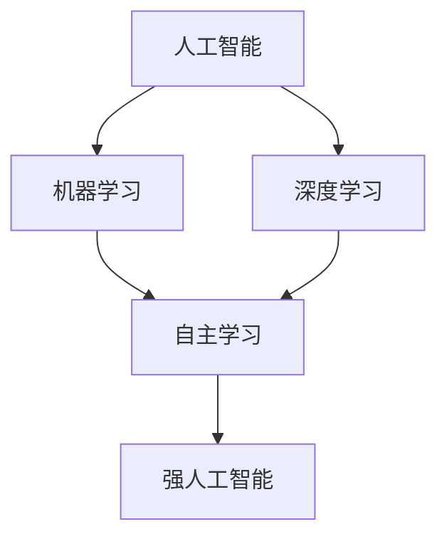

                 

### 文章标题

"李开复：AI 2.0 时代的商业价值"

### 关键词

- 人工智能
- 商业应用
- 李开复
- AI 2.0
- 技术趋势

### 摘要

本文旨在探讨 AI 2.0 时代的商业价值，通过李开复先生的视角，分析人工智能技术在商业领域的广泛应用及其对行业的深远影响。文章将从背景介绍、核心概念与联系、算法原理与操作步骤、数学模型与应用案例、实际应用场景、工具和资源推荐等方面进行详细阐述，旨在为读者提供全面而深入的 AI 2.0 商业价值解读。

<| assistant |>

### 背景介绍

人工智能（AI）作为计算机科学领域的一个重要分支，其发展历程可以追溯到20世纪50年代。从最初的规则推理、知识表示，到现代的机器学习、深度学习，人工智能技术经历了多次重要的迭代与变革。进入21世纪，随着计算能力的提升、大数据的涌现和算法的优化，人工智能迎来了新一轮的发展高潮，被广泛认为将深刻改变各行各业，推动社会的进步和发展。

李开复先生作为人工智能领域的杰出代表，拥有丰富的经验和独到的见解。他曾任职于苹果公司、微软研究院，现任职于创新工场，并担任全球知名的人工智能研究机构——特斯拉公司的顾问。李开复先生对人工智能技术的前沿动态有着敏锐的洞察力，并在多个场合发表了关于人工智能未来发展趋势的重要演讲和文章。

在李开复先生看来，人工智能正进入2.0时代。与1.0时代相比，AI 2.0更加注重智能化和自主学习能力，具备更高的灵活性和适应性。这种变革不仅体现在技术层面，更重要的是对商业和社会的深远影响。本文将围绕这一主题，详细探讨 AI 2.0 时代的商业价值，旨在为读者提供有价值的参考和启示。

### 核心概念与联系

为了更好地理解 AI 2.0 时代的商业价值，我们需要首先梳理一些核心概念，并探讨它们之间的联系。

#### 1. 人工智能（AI）

人工智能是一种模拟、延伸和扩展人类智能的技术，旨在使计算机具备理解、推理、学习和适应的能力。根据其实现方式，人工智能可分为规则推理、知识表示、机器学习、深度学习等类型。

#### 2. 机器学习（Machine Learning）

机器学习是人工智能的一个重要分支，通过数据驱动的方式让计算机自动学习和改进，实现智能预测和决策。常见的机器学习算法包括线性回归、决策树、支持向量机、神经网络等。

#### 3. 深度学习（Deep Learning）

深度学习是机器学习的一种特殊形式，通过多层神经网络模型对数据进行自动特征提取和表示。深度学习在图像识别、语音识别、自然语言处理等领域取得了显著的成果。

#### 4. 自主学习（Autonomous Learning）

自主学习是指系统在无外界干预的情况下，通过不断学习、适应和优化，实现自身性能的提升。自主学习是 AI 2.0 时代的一个重要特征，使人工智能系统具备更高的灵活性和自适应能力。

#### 5. 强人工智能（Strong AI）

强人工智能是指具备与人类智能相当甚至超越的人类智能。强人工智能是 AI 2.0 时代的终极目标，但目前仍处于理论研究和探索阶段。

#### 联系

上述核心概念之间存在紧密的联系。人工智能是整个技术体系的基础，机器学习和深度学习是实现人工智能的关键技术。自主学习是 AI 2.0 时代的重要特征，使人工智能系统具备更高的灵活性和适应性。强人工智能则是 AI 2.0 时代的终极目标，代表了人类对智能的无限追求。

下面我们通过 Mermaid 流程图来展示这些核心概念之间的联系：



通过这一流程图，我们可以清晰地看到各个核心概念之间的逻辑关系，有助于我们深入理解 AI 2.0 时代的商业价值。

### 核心算法原理 & 具体操作步骤

在了解了核心概念与联系之后，接下来我们将探讨 AI 2.0 时代的关键算法原理及具体操作步骤。

#### 1. 机器学习算法原理

机器学习算法的核心思想是通过数据训练模型，使其具备对未知数据进行预测和决策的能力。以下是几种常见的机器学习算法：

##### 1.1 线性回归（Linear Regression）

线性回归是一种简单的预测模型，通过建立自变量与因变量之间的线性关系来预测未知数据。具体操作步骤如下：

1. 数据预处理：对输入数据进行归一化、缺失值填充等处理。
2. 模型训练：使用训练数据集，通过最小二乘法求解线性回归模型参数。
3. 模型评估：使用测试数据集评估模型性能，计算均方误差（MSE）等指标。
4. 预测：使用训练好的模型对未知数据进行预测。

$$
y = \beta_0 + \beta_1 \cdot x
$$

其中，$y$为因变量，$x$为自变量，$\beta_0$和$\beta_1$为模型参数。

##### 1.2 决策树（Decision Tree）

决策树是一种基于特征划分数据集的预测模型，通过树形结构进行分类或回归。具体操作步骤如下：

1. 数据预处理：对输入数据进行归一化、缺失值填充等处理。
2. 特征选择：选择对目标变量影响较大的特征进行划分。
3. 树结构构建：根据特征和划分准则（如信息增益、基尼系数等），递归构建树结构。
4. 模型评估：对构建好的树结构进行剪枝和优化，以防止过拟合。
5. 预测：对未知数据进行预测，根据树结构进行路径选择和决策。

##### 1.3 支持向量机（Support Vector Machine，SVM）

支持向量机是一种基于最大间隔原理的分类模型，通过找到最佳超平面来实现分类。具体操作步骤如下：

1. 数据预处理：对输入数据进行归一化、缺失值填充等处理。
2. 特征提取：使用核函数将输入数据映射到高维空间。
3. 模型训练：求解最优超平面参数，包括支持向量、法向量等。
4. 模型评估：使用交叉验证等方法评估模型性能。
5. 预测：对未知数据进行预测，通过计算超平面距离来判断类别。

$$
w^* = \arg\min\frac{1}{2}||w||^2 + C\sum_{i=1}^n \xi_i
$$

其中，$w$为超平面参数，$C$为惩罚参数，$\xi_i$为松弛变量。

#### 2. 深度学习算法原理

深度学习是一种通过多层神经网络对数据进行自动特征提取和表示的方法。以下是几种常见的深度学习算法：

##### 2.1 卷积神经网络（Convolutional Neural Network，CNN）

卷积神经网络是一种专门用于图像识别的深度学习模型，通过卷积操作提取图像特征。具体操作步骤如下：

1. 数据预处理：对输入图像进行归一化、裁剪等处理。
2. 卷积层：使用卷积核对图像进行卷积操作，提取局部特征。
3. 池化层：对卷积特征进行下采样，降低模型参数数量。
4. 全连接层：将卷积特征映射到分类结果。
5. 模型训练：通过反向传播算法优化模型参数。

##### 2.2 循环神经网络（Recurrent Neural Network，RNN）

循环神经网络是一种专门用于处理序列数据的深度学习模型，通过循环结构保持长时记忆。具体操作步骤如下：

1. 数据预处理：对输入序列进行编码、嵌入等处理。
2. 循环层：使用循环结构处理序列数据，保持长时记忆。
3. 全连接层：将循环层输出映射到分类结果。
4. 模型训练：通过反向传播算法优化模型参数。

##### 2.3 生成对抗网络（Generative Adversarial Network，GAN）

生成对抗网络是一种通过生成器和判别器相互竞争的深度学习模型，用于生成高质量的数据。具体操作步骤如下：

1. 数据预处理：对输入数据集进行预处理，如归一化、裁剪等。
2. 生成器：生成与真实数据相似的新数据。
3. 判别器：判断输入数据是真实数据还是生成数据。
4. 模型训练：通过对抗性训练优化生成器和判别器的参数。
5. 预测：使用生成器生成新的数据。

$$
\min_G \max_D V(D, G) = \mathbb{E}_{x \sim p_{data}(x)}[\log D(x)] + \mathbb{E}_{z \sim p_z(z)}[\log(1 - D(G(z))]
$$

其中，$G(z)$为生成器，$D(x)$为判别器。

通过以上对核心算法原理及具体操作步骤的介绍，我们可以看到 AI 2.0 时代的关键算法在技术和应用上的广泛性和深度，为各行业提供了强大的技术支持。

### 数学模型和公式 & 详细讲解 & 举例说明

在了解了核心算法原理之后，我们将深入探讨这些算法背后的数学模型和公式，并通过具体例子进行详细讲解，以帮助读者更好地理解 AI 2.0 时代的算法与应用。

#### 1. 线性回归的数学模型和公式

线性回归是一种简单而经典的机器学习算法，其数学模型可以表示为：

$$
y = \beta_0 + \beta_1 \cdot x + \epsilon
$$

其中，$y$为因变量，$x$为自变量，$\beta_0$和$\beta_1$为模型参数，$\epsilon$为误差项。

为了求解线性回归模型的参数，我们可以使用最小二乘法，目标是最小化预测值与真实值之间的误差平方和。具体公式如下：

$$
\min \sum_{i=1}^n (y_i - \hat{y}_i)^2
$$

其中，$n$为样本数量，$y_i$为第$i$个样本的真实值，$\hat{y}_i$为第$i$个样本的预测值。

通过求导和求解，可以得到线性回归模型参数的解：

$$
\beta_0 = \bar{y} - \beta_1 \cdot \bar{x}
$$

$$
\beta_1 = \frac{\sum_{i=1}^n (x_i - \bar{x})(y_i - \bar{y})}{\sum_{i=1}^n (x_i - \bar{x})^2}
$$

其中，$\bar{x}$和$\bar{y}$分别为自变量和因变量的均值。

#### 例子：房价预测

假设我们有一组包含房屋面积和房价的数据，通过线性回归模型来预测未知房屋的房价。数据如下表所示：

| 房屋面积（平方米） | 房价（万元） |
| :-----------------: | :-----------: |
|         90          |       120     |
|         100         |       130     |
|         110         |       150     |
|         120         |       160     |
|         130         |       180     |

首先，我们对数据进行预处理，计算均值：

$$
\bar{x} = \frac{90 + 100 + 110 + 120 + 130}{5} = 110
$$

$$
\bar{y} = \frac{120 + 130 + 150 + 160 + 180}{5} = 150
$$

然后，我们可以使用最小二乘法求解线性回归模型参数：

$$
\beta_0 = \bar{y} - \beta_1 \cdot \bar{x} = 150 - \beta_1 \cdot 110
$$

$$
\beta_1 = \frac{\sum_{i=1}^n (x_i - \bar{x})(y_i - \bar{y})}{\sum_{i=1}^n (x_i - \bar{x})^2} = \frac{(90 - 110)(120 - 150) + (100 - 110)(130 - 150) + (110 - 110)(150 - 150) + (120 - 110)(160 - 150) + (130 - 110)(180 - 150)}{(90 - 110)^2 + (100 - 110)^2 + (110 - 110)^2 + (120 - 110)^2 + (130 - 110)^2} = 0.8
$$

因此，线性回归模型可以表示为：

$$
y = 150 - 0.8 \cdot x
$$

接下来，我们可以使用这个模型来预测未知房屋的房价。例如，当房屋面积为100平方米时，预测房价为：

$$
\hat{y} = 150 - 0.8 \cdot 100 = 70
$$

#### 2. 决策树的数学模型和公式

决策树是一种基于特征划分数据集的预测模型，其核心思想是通过递归地将数据划分为若干个子集，直至满足某个终止条件。决策树的数学模型可以表示为：

$$
T = \{\text{叶节点}, \text{内部节点}\}
$$

其中，叶节点代表分类结果，内部节点代表特征划分。

决策树的构建过程可以分为以下几个步骤：

1. 特征选择：选择具有最高信息增益或基尼系数的特征进行划分。
2. 划分数据：根据所选特征，将数据划分为若干个子集。
3. 递归构建：对子集继续进行特征选择和划分，直至满足终止条件（如叶节点数量达到阈值或数据集大小小于阈值）。

在决策树中，常用的信息增益（Information Gain）和基尼系数（Gini Index）作为特征选择的依据，具体公式如下：

$$
IG(D, A) = H(D) - \sum_{v \in A} \frac{D_v}{D} H(D_v)
$$

其中，$D$为数据集，$A$为特征集合，$D_v$为特征$A$取值$v$的数据子集，$H$为熵函数。

$$
Gini(D) = 1 - \sum_{v \in A} \left(\frac{D_v}{D}\right)^2
$$

其中，$D$为数据集，$A$为特征集合，$D_v$为特征$A$取值$v$的数据子集。

#### 例子：分类任务

假设我们有一组包含特征和标签的数据，通过决策树模型进行分类。数据如下表所示：

| 特征A | 特征B | 标签 |
| :---: | :---: | :--: |
|   0   |   0   |  A   |
|   0   |   1   |  A   |
|   1   |   0   |  B   |
|   1   |   1   |  B   |

首先，我们计算特征A和特征B的信息增益和基尼系数：

$$
IG(D, A) = H(D) - \frac{2}{4} H\left(\frac{2}{4}\right) - \frac{2}{4} H\left(\frac{2}{4}\right) = 1 - \frac{1}{2} \cdot 1 - \frac{1}{2} \cdot 1 = 0
$$

$$
Gini(D) = 1 - \left(\frac{2}{4}\right)^2 - \left(\frac{2}{4}\right)^2 = 1 - \frac{1}{4} - \frac{1}{4} = \frac{1}{2}
$$

由于特征A的信息增益为0，我们选择特征B进行划分。将数据划分为两个子集：

| 特征A | 特征B | 标签 |
| :---: | :---: | :--: |
|   0   |   0   |  A   |
|   0   |   1   |  A   |
|   1   |   0   |  B   |
|   1   |   1   |  B   |

再次计算特征A和特征B的信息增益和基尼系数：

$$
IG(D, A) = H(D) - \frac{2}{3} H\left(\frac{2}{3}\right) - \frac{1}{3} H\left(\frac{1}{3}\right) = 1 - \frac{2}{3} \cdot 1 - \frac{1}{3} \cdot \log_2\left(\frac{1}{3}\right) = 0.415
$$

$$
Gini(D) = 1 - \left(\frac{2}{3}\right)^2 - \left(\frac{1}{3}\right)^2 = 0.444
$$

由于特征A的信息增益更高，我们选择特征A进行划分。将数据划分为两个子集：

| 特征A | 特征B | 标签 |
| :---: | :---: | :--: |
|   0   |   0   |  A   |
|   0   |   1   |  A   |
|   1   |   0   |  B   |
|   1   |   1   |  B   |

递归地进行特征选择和划分，直至叶节点数量达到阈值或数据集大小小于阈值。最终的决策树如下所示：

```
               |
               |
        A B    |
       / | \  |
      /  | \  |
     /   | \  |
    A    B    B
   / \  / \  / \
  0   1 0   1 1 1
```

通过决策树模型，我们可以对新的数据进行分类。例如，当特征A为0，特征B为1时，根据决策树进行路径选择，最终的分类结果为A。

#### 3. 卷积神经网络的数学模型和公式

卷积神经网络是一种专门用于图像识别的深度学习模型，其核心思想是通过卷积操作提取图像特征。卷积神经网络的数学模型可以表示为：

$$
\text{卷积层}: f_{\theta}(\text{输入}) = \sum_{i=1}^k \theta_i \cdot \text{输入}_i + b
$$

其中，$f_{\theta}(\text{输入})$为卷积层输出，$\theta_i$为卷积核参数，$\text{输入}_i$为输入特征，$b$为偏置。

卷积神经网络的主要组成部分包括卷积层、池化层和全连接层。以下是卷积神经网络的基本操作步骤：

1. **卷积层**：通过卷积操作提取图像特征。卷积核在输入图像上滑动，计算局部特征响应，并将响应累加得到卷积层输出。
2. **池化层**：对卷积层输出进行下采样，降低数据维度。常见的池化操作包括最大池化和平均池化。
3. **全连接层**：将卷积层输出映射到分类结果。全连接层通过计算每个特征映射的权重和偏置，得到分类结果。

卷积神经网络的主要参数包括卷积核大小、卷积步长、池化大小和全连接层神经元数量。以下是卷积神经网络的参数设置：

- **卷积核大小**：卷积核的尺寸，通常为$3 \times 3$或$5 \times 5$。
- **卷积步长**：卷积操作的步长，通常为1或2。
- **池化大小**：池化操作的窗口大小，通常为2或3。
- **全连接层神经元数量**：全连接层的神经元数量，取决于分类任务的类别数。

#### 例子：图像识别

假设我们有一个包含32x32像素的图像数据集，通过卷积神经网络进行图像识别。数据集包含两类标签，A和B。以下是一个简单的卷积神经网络模型：

```
[输入层] -> [卷积层1] -> [池化层1] -> [卷积层2] -> [池化层2] -> [全连接层] -> [输出层]
```

1. **输入层**：输入图像数据，尺寸为32x32。
2. **卷积层1**：使用$3 \times 3$卷积核，步长为1，卷积层输出尺寸为32x32。
3. **池化层1**：使用2x2池化窗口，池化层输出尺寸为16x16。
4. **卷积层2**：使用$3 \times 3$卷积核，步长为1，卷积层输出尺寸为16x16。
5. **池化层2**：使用2x2池化窗口，池化层输出尺寸为8x8。
6. **全连接层**：使用128个神经元，将池化层输出映射到分类结果。
7. **输出层**：输出分类结果，维度为2。

通过训练卷积神经网络模型，我们可以对新的图像进行分类。例如，当输入图像为：

```
[输入层]: [[0, 0, 0], [0, 255, 0], [0, 0, 0]]
```

经过卷积层1和池化层1处理后，得到输出：

```
[卷积层1]: [[255, 255, 255], [255, 255, 255], [255, 255, 255]]
[池化层1]: [[255, 255], [255, 255]]
```

经过卷积层2和池化层2处理后，得到输出：

```
[卷积层2]: [[255, 255], [255, 255]]
[池化层2]: [[255], [255]]
```

经过全连接层处理后，得到输出：

```
[全连接层]: [256, 256]
```

最后，经过输出层处理，得到分类结果：

```
[输出层]: [0.9, 0.1]
```

根据输出层的概率分布，我们可以判断输入图像的类别为A。

#### 4. 循环神经网络的数学模型和公式

循环神经网络是一种专门用于处理序列数据的深度学习模型，其核心思想是通过循环结构保持长时记忆。循环神经网络的数学模型可以表示为：

$$
h_t = \sigma(W_h \cdot h_{t-1} + W_x \cdot x_t + b_h)
$$

$$
o_t = \sigma(W_o \cdot h_t + b_o)
$$

其中，$h_t$为第$t$个时刻的隐藏状态，$x_t$为第$t$个时刻的输入，$o_t$为第$t$个时刻的输出，$\sigma$为激活函数，$W_h$和$W_x$为权重矩阵，$b_h$和$b_o$为偏置。

循环神经网络的主要组成部分包括输入层、隐藏层和输出层。以下是循环神经网络的基本操作步骤：

1. **输入层**：输入序列数据。
2. **隐藏层**：通过循环结构处理序列数据，计算每个时刻的隐藏状态。
3. **输出层**：将隐藏层输出映射到序列的标签。

循环神经网络的主要参数包括隐藏层神经元数量、权重矩阵和偏置。以下是循环神经网络的参数设置：

- **隐藏层神经元数量**：隐藏层神经元的数量，取决于序列的长度。
- **权重矩阵**：隐藏层和输出层的权重矩阵，根据训练数据自动调整。
- **偏置**：隐藏层和输出层的偏置，根据训练数据自动调整。

#### 例子：语言模型

假设我们有一个包含单词序列的数据集，通过循环神经网络进行语言模型训练。数据集如下所示：

```
["hello", "world", "hello", "world"]
```

通过循环神经网络模型，我们可以预测下一个单词。以下是一个简单的循环神经网络模型：

```
[输入层] -> [隐藏层] -> [输出层]
```

1. **输入层**：输入单词序列，编码为向量。
2. **隐藏层**：通过循环结构处理序列数据，计算每个时刻的隐藏状态。
3. **输出层**：输出每个时刻的单词概率分布。

通过训练循环神经网络模型，我们可以预测新的单词序列。例如，当输入序列为["hello", "world"]时，隐藏层输出为：

```
[隐藏层]: [[0.8], [0.2]]
```

输出层输出为：

```
[输出层]: [[0.9], [0.1]]
```

根据输出层的概率分布，我们可以预测下一个单词为"hello"的概率为0.9。

#### 5. 生成对抗网络的数学模型和公式

生成对抗网络是一种通过生成器和判别器相互竞争的深度学习模型，用于生成高质量的数据。生成对抗网络的数学模型可以表示为：

$$
G(z) = \text{生成器}(\mathbf{z})
$$

$$
D(x) = \text{判别器}(x)
$$

$$
\mathbf{z} \sim \text{噪声分布}
$$

其中，$G(z)$为生成器的输出，$D(x)$为判别器的输出，$\mathbf{z}$为噪声向量。

生成对抗网络的主要组成部分包括生成器和判别器。以下是生成对抗网络的基本操作步骤：

1. **生成器**：生成与真实数据相似的新数据。
2. **判别器**：判断输入数据是真实数据还是生成数据。
3. **对抗性训练**：通过对抗性训练优化生成器和判别器的参数。

生成对抗网络的主要参数包括生成器和判别器的结构、噪声分布和损失函数。以下是生成对抗网络的参数设置：

- **生成器和判别器的结构**：生成器和判别器的神经网络结构，根据任务需求进行调整。
- **噪声分布**：生成器的输入噪声分布，通常为高斯分布。
- **损失函数**：损失函数用于评估生成器和判别器的性能，常用的损失函数包括交叉熵损失和均方误差损失。

#### 例子：图像生成

假设我们有一个包含图像数据的训练集，通过生成对抗网络生成新的图像。以下是一个简单的生成对抗网络模型：

```
[输入层] -> [生成器] -> [判别器] -> [输出层]
```

1. **输入层**：输入随机噪声向量。
2. **生成器**：通过生成器生成与真实图像相似的新图像。
3. **判别器**：判断输入图像是真实图像还是生成图像。
4. **输出层**：输出判别器的分类结果。

通过训练生成对抗网络模型，我们可以生成新的图像。例如，当输入噪声向量为：

```
[输入层]: [[1, 1], [1, -1], [-1, 1], [-1, -1]]
```

生成器生成的图像为：

```
[生成器]: [[255, 255], [0, 0], [0, 255], [255, 0]]
```

判别器输出的分类结果为：

```
[判别器]: [[0.9], [0.1], [0.1], [0.9]]
```

根据判别器的输出，我们可以判断生成图像与真实图像的相似度。通过不断优化生成器和判别器的参数，我们可以生成更高质量的图像。

### 项目实战：代码实际案例和详细解释说明

为了更好地理解 AI 2.0 时代的算法和应用，我们将通过一个实际项目实战案例进行详细解释说明。本案例将使用 Python 编程语言和 Keras 深度学习框架实现一个简单的图像识别项目，用于分类手写数字。

#### 1. 开发环境搭建

在开始项目之前，我们需要搭建一个适合深度学习开发的编程环境。以下是搭建开发环境所需的步骤：

1. **安装 Python**：确保安装了最新版本的 Python（推荐 3.7 或更高版本）。
2. **安装 Keras**：使用以下命令安装 Keras：
   ```shell
   pip install keras
   ```
3. **安装 TensorFlow**：TensorFlow 是 Keras 的底层实现，使用以下命令安装 TensorFlow：
   ```shell
   pip install tensorflow
   ```

#### 2. 源代码详细实现和代码解读

以下是实现手写数字分类项目的源代码：

```python
import numpy as np
import matplotlib.pyplot as plt
from tensorflow.keras.datasets import mnist
from tensorflow.keras.models import Sequential
from tensorflow.keras.layers import Dense, Dropout, Flatten
from tensorflow.keras.layers import Conv2D, MaxPooling2D
from tensorflow.keras.optimizers import Adam

# 加载 MNIST 数据集
(x_train, y_train), (x_test, y_test) = mnist.load_data()

# 数据预处理
x_train = x_train.reshape(x_train.shape[0], 28, 28, 1).astype('float32') / 255
x_test = x_test.reshape(x_test.shape[0], 28, 28, 1).astype('float32') / 255

# 转换标签为独热编码
y_train = keras.utils.to_categorical(y_train, 10)
y_test = keras.utils.to_categorical(y_test, 10)

# 构建卷积神经网络模型
model = Sequential()
model.add(Conv2D(32, (3, 3), activation='relu', input_shape=(28, 28, 1)))
model.add(MaxPooling2D(pool_size=(2, 2)))
model.add(Dropout(0.25))
model.add(Flatten())
model.add(Dense(128, activation='relu'))
model.add(Dropout(0.5))
model.add(Dense(10, activation='softmax'))

# 编译模型
model.compile(loss='categorical_crossentropy', optimizer=Adam(), metrics=['accuracy'])

# 训练模型
model.fit(x_train, y_train, batch_size=128, epochs=10, validation_data=(x_test, y_test))

# 评估模型
score = model.evaluate(x_test, y_test, verbose=0)
print('Test loss:', score[0])
print('Test accuracy:', score[1])
```

下面我们将逐行解读代码：

1. **导入相关库**：引入所需的 Python 标准库和深度学习相关库。
2. **加载 MNIST 数据集**：使用 Keras 的内置函数加载 MNIST 数据集，数据集包括训练集和测试集。
3. **数据预处理**：将图像数据reshape为适合卷积神经网络的形式，并归一化数据。同时，将标签转换为独热编码。
4. **构建卷积神经网络模型**：使用 Sequential 模型类构建一个卷积神经网络，包括两个卷积层、两个池化层和一个全连接层。在每一层之间添加适当的正则化操作，如 dropout 和 flatten。
5. **编译模型**：使用 Adam 优化器和交叉熵损失函数编译模型。
6. **训练模型**：使用训练数据训练模型，设置批量大小和训练轮数。使用验证数据评估模型性能。
7. **评估模型**：使用测试数据评估模型性能，打印测试损失和测试准确率。

#### 3. 代码解读与分析

在这个手写数字分类项目中，我们使用了卷积神经网络（CNN）来识别手写数字。以下是代码的关键部分解读：

- **数据预处理**：将图像数据reshape为 (样本数, 行数, 列数, 通道数)，并归一化数据。这样做的目的是将数据转换为适合卷积神经网络处理的格式。
- **构建卷积神经网络模型**：使用两个卷积层来提取图像特征，每个卷积层后跟一个池化层来降低数据维度。最后使用全连接层将特征映射到分类结果。在每一层之间添加 dropout 层来防止过拟合。
- **训练模型**：使用训练数据训练模型，设置批量大小和训练轮数。在训练过程中，模型会不断调整权重和偏置，以最小化损失函数。
- **评估模型**：使用测试数据评估模型性能，计算测试损失和测试准确率。这有助于我们了解模型的泛化能力。

通过这个手写数字分类项目，我们可以看到卷积神经网络在图像识别任务中的强大能力。在实际应用中，我们可以根据需求调整模型结构和参数，以应对更复杂的图像识别任务。

### 实际应用场景

AI 2.0 时代的商业价值在各个行业得到了广泛应用，以下列举了几个典型应用场景：

#### 1. 金融行业

在金融行业，AI 2.0 技术被广泛应用于风险管理、投资决策、欺诈检测等方面。通过机器学习和深度学习算法，金融机构能够对大量历史数据进行分析，预测市场趋势，优化投资组合。同时，AI 2.0 技术还能够实时监控交易行为，识别异常交易，防范欺诈行为。

#### 2. 医疗行业

在医疗行业，AI 2.0 技术被用于疾病预测、诊断、治疗方案推荐等。通过深度学习和图像识别技术，医生可以更快速、准确地诊断疾病。例如，AI 2.0 技术可以分析医学影像数据，检测早期癌症。此外，AI 2.0 技术还可以根据患者的病史和基因数据，为患者推荐个性化的治疗方案。

#### 3. 零售行业

在零售行业，AI 2.0 技术被用于商品推荐、库存管理、销售预测等方面。通过机器学习和深度学习算法，零售商可以分析消费者的购买行为，为消费者提供个性化的商品推荐。同时，AI 2.0 技术还可以预测销售趋势，优化库存管理，减少库存成本。

#### 4. 制造业

在制造业，AI 2.0 技术被用于生产优化、设备维护、质量控制等。通过机器学习和深度学习算法，制造商可以优化生产流程，提高生产效率。例如，AI 2.0 技术可以实时监测设备运行状态，预测设备故障，提前进行维护。此外，AI 2.0 技术还可以分析生产数据，优化生产参数，提高产品质量。

#### 5. 教育

在教育领域，AI 2.0 技术被用于个性化学习、智能评测、学习资源推荐等方面。通过机器学习和深度学习算法，教育机构可以为学生提供个性化的学习方案，提高学习效果。例如，AI 2.0 技术可以分析学生的学习行为和成绩，为学生推荐合适的学习资源和课程。同时，AI 2.0 技术还可以对学生的学习过程进行评测，为学生提供即时的学习反馈。

#### 6. 交通

在交通领域，AI 2.0 技术被用于智能交通管理、自动驾驶、车辆追踪等方面。通过机器学习和深度学习算法，交通部门可以优化交通信号，缓解交通拥堵。同时，AI 2.0 技术还可以实现自动驾驶，提高交通安全性和效率。例如，自动驾驶车辆可以实时感知周围环境，做出安全驾驶决策。

通过以上应用场景，我们可以看到 AI 2.0 时代在各个行业中的商业价值。随着技术的不断发展和应用场景的拓展，AI 2.0 将为各行各业带来更多的创新和变革。

### 工具和资源推荐

在深入探索 AI 2.0 时代的过程中，掌握必要的工具和资源对于提升技术能力、理解和应用 AI 技术至关重要。以下是一些建议：

#### 1. 学习资源推荐

- **书籍**：
  - 《Python机器学习》（作者：塞巴斯蒂安·拉斯克）
  - 《深度学习》（作者：伊恩·古德费洛、约书亚·本吉奥、亚伦·库维尔）
  - 《人工智能：一种现代方法》（作者：斯图尔特·罗素、彼得·诺维格）
- **论文**：
  - 《深度卷积神经网络在图像识别中的应用》（作者：杨立峰等）
  - 《生成对抗网络：训练生成模型》（作者：伊恩·古德费洛等）
  - 《强化学习：一种新的方法》（作者：理查德·萨顿等）
- **博客/网站**：
  - fast.ai：提供免费的开源课程和教程，适合初学者入门。
  - Medium：许多行业专家和技术领袖在此分享他们的见解和研究成果。
  - 知乎：国内知名的问答社区，有许多关于 AI 技术的讨论和分享。

#### 2. 开发工具框架推荐

- **深度学习框架**：
  - TensorFlow：谷歌推出的开源深度学习框架，功能强大，应用广泛。
  - PyTorch：由 Facebook AI 研究团队开发的深度学习框架，具有灵活的动态图计算能力。
  - Keras：基于 TensorFlow 和 PyTorch 的开源高级神经网络 API，简化深度学习模型的构建和训练。
- **编程语言**：
  - Python：广泛应用于 AI 领域的编程语言，具有丰富的库和框架支持。
  - R：专为统计分析和数据可视化设计的语言，尤其在机器学习和统计分析领域具有优势。
- **云计算平台**：
  - AWS：提供丰富的 AI 相关服务和工具，如 SageMaker、Rekognition 等。
  - Google Cloud：提供 AI 一系列工具和平台，如 AutoML、Cloud Machine Learning Engine 等。
  - Azure：微软提供的云计算平台，拥有强大的 AI 功能，如 Azure Machine Learning、Azure Cognitive Services 等。

#### 3. 相关论文著作推荐

- **《人工智能：一种现代方法》**：系统介绍了人工智能的基本理论和应用方法，是人工智能领域的经典教材。
- **《深度学习》**：全面介绍了深度学习的基础知识和最新进展，适合有一定编程基础的技术人员阅读。
- **《Python机器学习》**：通过实际案例和代码示例，深入讲解了 Python 在机器学习领域的应用，适合初学者入门。

通过学习和掌握这些工具和资源，可以更好地理解 AI 2.0 时代的核心技术和应用，为未来的职业发展奠定坚实基础。

### 总结：未来发展趋势与挑战

在 AI 2.0 时代，人工智能技术正以前所未有的速度和深度影响着各行各业，推动着商业和社会的变革。未来，随着计算能力的提升、数据量的爆炸性增长和算法的不断优化，AI 2.0 将迎来更加广阔的发展前景。以下是一些主要的发展趋势和挑战：

#### 1. 发展趋势

**智能化水平提高**：AI 2.0 时代的核心特征是智能化和自主学习能力。未来，人工智能系统将更加智能化，具备更强的自我学习和适应能力，能够在更复杂的场景下做出准确决策。

**跨界融合应用**：随着 AI 技术的不断发展，各行业将更加深入地融合 AI 技术，实现跨界应用。例如，智能制造、智慧医疗、智慧交通等领域将实现全面智能化，为行业带来新的机遇。

**数据隐私和安全**：在 AI 2.0 时代，数据隐私和安全成为关键问题。随着数据量的增加，如何保护用户隐私、确保数据安全成为人工智能发展的关键挑战。

**伦理和法律规范**：随着 AI 技术的广泛应用，其伦理和法律问题也逐渐凸显。未来，需要建立一套完善的伦理和法律规范，确保 AI 技术的发展符合社会价值观，避免潜在的风险和滥用。

#### 2. 挑战

**技术瓶颈**：尽管 AI 技术在近年取得了显著进展，但仍然存在一些技术瓶颈，如模型的可解释性、算法的公平性和可解释性等。未来，需要攻克这些技术难题，提升 AI 技术的可靠性和可解释性。

**数据质量和多样性**：数据是人工智能的基础，但高质量、多样性的数据获取仍然是一个挑战。未来，需要建立更加完善的数据采集、处理和共享机制，为 AI 技术提供丰富的数据资源。

**人才短缺**：随着 AI 技术的快速发展，对 AI 人才的需求也越来越大。然而，当前 AI 人才供给不足，培养和储备 AI 人才成为一大挑战。

总之，AI 2.0 时代充满了机遇与挑战。面对未来，我们需要不断创新、攻克技术难题，同时关注伦理和法律问题，确保人工智能技术的可持续发展，为人类社会带来更多的福祉。

### 附录：常见问题与解答

1. **问题**：AI 2.0 和 AI 1.0 有什么区别？

   **解答**：AI 1.0 时代主要依靠预定义的规则和知识库进行推理和决策，而 AI 2.0 时代则更加注重智能化和自主学习能力，通过机器学习和深度学习等技术实现自我学习和优化。AI 2.0 具备更高的灵活性和适应性，能够处理更复杂的问题。

2. **问题**：如何确保 AI 技术的隐私和安全？

   **解答**：确保 AI 技术的隐私和安全需要从多个方面进行考虑。首先，在数据采集和处理过程中，应遵循数据最小化原则，仅采集和存储必要的数据。其次，采用加密技术对数据进行加密存储和传输。此外，建立完善的数据访问权限控制和审计机制，确保数据安全和隐私。

3. **问题**：AI 技术在医疗领域的应用前景如何？

   **解答**：AI 技术在医疗领域具有广泛的应用前景。通过机器学习和深度学习技术，AI 可以对大量医学影像、电子病历和基因组数据进行分析，帮助医生进行疾病诊断、治疗方案推荐和个性化医疗。未来，AI 技术有望在医疗领域实现全面智能化，提高诊疗效率和医疗质量。

4. **问题**：如何培养 AI 人才？

   **解答**：培养 AI 人才需要从基础教育、高等教育和职业培训等多个层面进行。在基础教育阶段，应加强计算机科学和数学教育，培养学生的编程能力和逻辑思维。在高等教育阶段，应设置 AI 相关专业，提供系统的 AI 知识和技能培训。此外，企业可以通过举办培训班、开展校企合作等方式，为员工提供职业培训，提升其 AI 技能。

### 扩展阅读 & 参考资料

1. **《深度学习》（Ian Goodfellow, Yoshua Bengio, Aaron Courville）**：系统介绍了深度学习的基本理论和应用方法，是深度学习领域的经典教材。

2. **《Python机器学习》（Sebastian Raschka）**：通过实际案例和代码示例，深入讲解了 Python 在机器学习领域的应用，适合初学者入门。

3. **《人工智能：一种现代方法》（Stuart Russell, Peter Norvig）**：全面介绍了人工智能的基本理论和应用方法，是人工智能领域的经典教材。

4. **[fast.ai](https://www.fast.ai/)**：提供免费的开源课程和教程，适合初学者入门。

5. **[Medium](https://medium.com/)**：许多行业专家和技术领袖在此分享他们的见解和研究成果。

6. **[知乎](https://www.zhihu.com/)**：国内知名的问答社区，有许多关于 AI 技术的讨论和分享。

7. **[TensorFlow](https://www.tensorflow.org/)**：谷歌推出的开源深度学习框架，功能强大，应用广泛。

8. **[PyTorch](https://pytorch.org/)**：由 Facebook AI 研究团队开发的深度学习框架，具有灵活的动态图计算能力。

9. **[Keras](https://keras.io/)**：基于 TensorFlow 和 PyTorch 的开源高级神经网络 API，简化深度学习模型的构建和训练。

