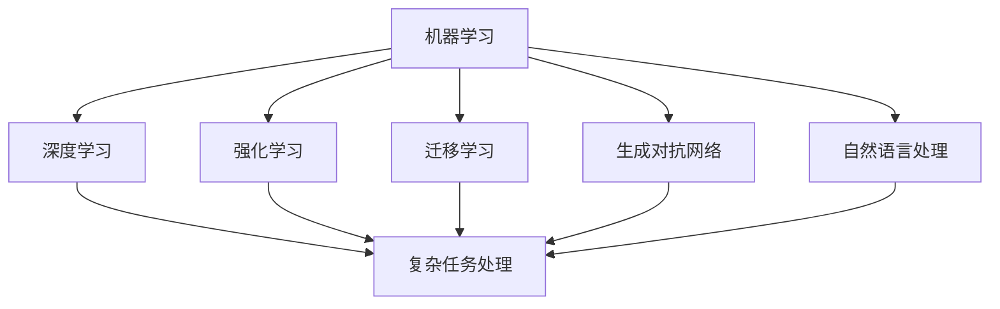

                 

### 文章标题

"李开复：AI 2.0 时代的商业价值"

### 关键词

- AI 2.0
- 商业价值
- 技术创新
- 未来趋势
- 应用案例

### 摘要

本文深入探讨了AI 2.0时代的商业价值，分析了AI技术在商业领域的广泛应用和潜在影响。通过李开复的视角，我们了解到AI 2.0时代的核心概念、算法原理、应用场景，以及未来发展趋势和挑战。文章旨在为读者提供全面、清晰的认识，帮助理解AI技术如何重塑商业格局，并指导企业如何应对这一变革。

## 1. 背景介绍

随着人工智能（AI）技术的飞速发展，我们正步入一个全新的时代——AI 2.0时代。与早期的人工智能（AI 1.0）相比，AI 2.0具备更高的智能水平，能够实现更复杂的任务和决策。李开复认为，AI 2.0时代的到来将引发一系列深远的变化，对商业领域的影响尤为显著。

在过去几十年里，人工智能经历了多个阶段的发展。从最初的规则推理系统，到基于统计学习的方法，再到深度学习和神经网络，人工智能技术不断突破，性能显著提升。AI 2.0则是在这一基础上，通过强化学习、迁移学习、生成对抗网络（GAN）等创新技术，实现了更为智能化和自适应化的应用。

AI 2.0时代的商业价值在于其能够解决传统方法难以应对的复杂问题，提高生产效率，降低成本，创造新的商业模式和机会。在这个时代，企业和组织需要把握机遇，积极拥抱变革，才能在竞争中获得优势。

## 2. 核心概念与联系

在探讨AI 2.0时代的商业价值之前，我们首先需要理解其中的核心概念和相互关系。以下是几个关键概念及其简要解释：

### 2.1 机器学习与深度学习

- **机器学习**：通过算法让计算机从数据中学习，逐步提高其性能和预测能力。
- **深度学习**：一种基于神经网络的学习方法，能够自动提取特征并实现复杂任务。

### 2.2 强化学习

- **强化学习**：通过与环境的交互，学习最优策略以实现特定目标。

### 2.3 迁移学习

- **迁移学习**：利用已有的模型和数据，在新任务上快速获得良好的性能。

### 2.4 生成对抗网络（GAN）

- **生成对抗网络**：一种由生成器和判别器组成的模型，用于生成高质量的数据。

### 2.5 自然语言处理（NLP）

- **自然语言处理**：使计算机能够理解和处理人类语言的技术。

这些核心概念相互联系，共同构成了AI 2.0时代的基石。通过这些技术，AI系统能够实现更高水平的智能，从而在商业领域发挥更大的作用。

#### 2.6 Mermaid 流程图

以下是一个简单的Mermaid流程图，展示了上述核心概念之间的联系：



在这个流程图中，我们可以看到机器学习作为基础，通过深度学习、强化学习、迁移学习、生成对抗网络和自然语言处理等技术，共同推动AI系统在复杂任务处理方面取得突破。

## 3. 核心算法原理 & 具体操作步骤

### 3.1 机器学习算法原理

机器学习算法的核心在于通过学习数据中的规律，从而实现对未知数据的预测和分类。以下是一个简单的线性回归算法原理：

#### 线性回归算法原理

1. **假设**：假设输出变量 \(y\) 与输入变量 \(x\) 之间存在线性关系，即 \(y = wx + b\)。
2. **损失函数**：选择损失函数（如均方误差）来衡量预测值与真实值之间的差距。
3. **优化方法**：通过梯度下降法等优化方法，调整参数 \(w\) 和 \(b\)，使损失函数值最小。

#### 线性回归算法具体操作步骤

1. **数据预处理**：对输入数据进行归一化或标准化处理，使其在相似尺度上。
2. **初始化参数**：随机初始化参数 \(w\) 和 \(b\)。
3. **计算损失函数**：对每个样本计算预测值与真实值之间的差距。
4. **更新参数**：根据梯度下降法，调整参数 \(w\) 和 \(b\)。
5. **重复步骤 3-4**，直至损失函数收敛。

### 3.2 深度学习算法原理

深度学习算法通过多层神经网络进行数据建模，能够自动提取特征并实现复杂任务。以下是一个简单的卷积神经网络（CNN）算法原理：

#### 卷积神经网络算法原理

1. **输入层**：接收输入数据。
2. **卷积层**：通过卷积运算提取特征。
3. **池化层**：对特征进行降采样，减少参数数量。
4. **全连接层**：将特征映射到输出。
5. **激活函数**：引入非线性变换，提高模型表达能力。

#### 卷积神经网络算法具体操作步骤

1. **数据预处理**：对输入图像进行归一化或标准化处理。
2. **构建网络结构**：定义卷积层、池化层和全连接层的参数。
3. **初始化参数**：随机初始化卷积核、池化窗口和全连接层的参数。
4. **前向传播**：计算输入数据在各个层的输出。
5. **反向传播**：计算损失函数对参数的梯度，并更新参数。
6. **重复步骤 4-5**，直至模型收敛。

### 3.3 强化学习算法原理

强化学习算法通过与环境交互，学习最优策略以实现特定目标。以下是一个简单的Q-学习算法原理：

#### Q-学习算法原理

1. **状态-动作价值函数**：定义 \(Q(s, a)\) 为在状态 \(s\) 下执行动作 \(a\) 的预期回报。
2. **目标函数**：选择目标函数（如贝尔曼方程）来更新状态-动作价值函数。
3. **策略**：根据状态-动作价值函数选择最优动作。

#### Q-学习算法具体操作步骤

1. **初始化**：随机初始化状态-动作价值函数 \(Q(s, a)\) 和策略 \(\pi(a|s)\)。
2. **选择动作**：在当前状态下，根据策略选择动作。
3. **执行动作**：执行所选动作，并获得反馈。
4. **更新价值函数**：根据反馈更新状态-动作价值函数。
5. **更新策略**：根据更新后的价值函数，更新策略。
6. **重复步骤 2-5**，直至策略收敛。

### 3.4 迁移学习算法原理

迁移学习算法通过利用已有模型和数据，在新任务上快速获得良好的性能。以下是一个简单的迁移学习算法原理：

#### 迁移学习算法原理

1. **预训练模型**：在源任务上预训练一个模型。
2. **微调模型**：在目标任务上对预训练模型进行微调。
3. **目标函数**：选择目标函数（如损失函数）来评估模型在目标任务上的性能。

#### 迁移学习算法具体操作步骤

1. **选择预训练模型**：在公开数据集上预训练一个模型。
2. **准备目标数据集**：收集并预处理目标数据集。
3. **微调模型参数**：在目标数据集上对预训练模型进行微调。
4. **评估模型性能**：在目标数据集上评估模型性能。
5. **迭代优化**：根据评估结果，调整模型参数，直至性能满足要求。

### 3.5 生成对抗网络（GAN）算法原理

生成对抗网络（GAN）通过生成器和判别器之间的对抗训练，生成高质量的数据。以下是一个简单的GAN算法原理：

#### GAN算法原理

1. **生成器**：生成虚假数据。
2. **判别器**：区分真实数据和虚假数据。
3. **损失函数**：选择损失函数（如反对抗损失函数）来衡量生成器和判别器的性能。

#### GAN算法具体操作步骤

1. **初始化**：随机初始化生成器和判别器的参数。
2. **生成虚假数据**：生成器生成虚假数据。
3. **训练判别器**：使用真实数据和虚假数据训练判别器。
4. **训练生成器**：使用判别器的输出，调整生成器的参数。
5. **重复步骤 2-4**，直至生成器生成的虚假数据难以区分。

### 3.6 自然语言处理（NLP）算法原理

自然语言处理（NLP）算法通过机器学习技术，使计算机能够理解和处理人类语言。以下是一个简单的循环神经网络（RNN）算法原理：

#### RNN算法原理

1. **输入序列**：接收输入序列（如单词序列）。
2. **隐藏层**：对输入序列进行编码，提取特征。
3. **输出序列**：生成输出序列（如预测序列）。

#### RNN算法具体操作步骤

1. **初始化**：随机初始化网络参数。
2. **前向传播**：对输入序列进行编码。
3. **计算输出**：生成输出序列。
4. **反向传播**：计算损失函数，并更新参数。
5. **重复步骤 2-4**，直至模型收敛。

## 4. 数学模型和公式 & 详细讲解 & 举例说明

### 4.1 线性回归算法的数学模型和公式

线性回归算法的数学模型可以表示为：

\[ y = wx + b \]

其中，\(y\) 为输出变量，\(x\) 为输入变量，\(w\) 为权重，\(b\) 为偏置。

损失函数通常选择均方误差（MSE）：

\[ J = \frac{1}{2n} \sum_{i=1}^{n} (wx_i + b - y_i)^2 \]

其中，\(n\) 为样本数量。

梯度下降法用于更新参数：

\[ w = w - \alpha \frac{\partial J}{\partial w} \]
\[ b = b - \alpha \frac{\partial J}{\partial b} \]

其中，\(\alpha\) 为学习率。

#### 举例说明

假设我们有一个简单的线性回归问题，输入变量为年龄（\(x\)），输出变量为收入（\(y\)）。我们收集了以下数据：

| 年龄（\(x\)） | 收入（\(y\)） |
|--------------|--------------|
| 20           | 30,000       |
| 25           | 35,000       |
| 30           | 40,000       |

我们假设线性回归模型为：

\[ y = wx + b \]

初始参数为 \(w = 0\)，\(b = 0\)。

前向传播：

\[ y_1 = 0 \times 20 + 0 = 0 \]
\[ y_2 = 0 \times 25 + 0 = 0 \]
\[ y_3 = 0 \times 30 + 0 = 0 \]

计算损失函数：

\[ J = \frac{1}{2 \times 3} ((0 - 30,000)^2 + (0 - 35,000)^2 + (0 - 40,000)^2) \]
\[ J = 35,000,000 \]

反向传播：

\[ \frac{\partial J}{\partial w} = -2 \times 3 \times (0 - 30,000) = 180,000 \]
\[ \frac{\partial J}{\partial b} = -2 \times 3 \times (0 - 30,000) = 180,000 \]

更新参数：

\[ w = 0 - 0.01 \times 180,000 = -1,800 \]
\[ b = 0 - 0.01 \times 180,000 = -1,800 \]

重复前向传播和反向传播，直至损失函数收敛。

### 4.2 卷积神经网络（CNN）算法的数学模型和公式

卷积神经网络（CNN）的核心操作是卷积和池化。以下是一个简单的2D卷积操作的数学模型和公式：

\[ \text{卷积}:\; f(x) = \sum_{i=1}^{k} w_i * x_i + b \]

其中，\(f(x)\) 为卷积操作的结果，\(w_i\) 为卷积核（滤波器），\(x_i\) 为输入数据，\(b\) 为偏置。

卷积操作的输出可以表示为：

\[ \text{输出} = \text{卷积}(\text{输入}, \text{卷积核}) + \text{偏置} \]

池化操作通常采用最大值池化或平均值池化。以下是一个简单的最大值池化的数学模型和公式：

\[ \text{池化}:\; g(y) = \max_{i \in \Omega} y_i \]

其中，\(g(y)\) 为池化操作的结果，\(\Omega\) 为池化窗口的索引集，\(y_i\) 为窗口内的元素。

#### 举例说明

假设我们有一个2D输入矩阵：

\[ \text{输入} = \begin{bmatrix} 1 & 2 \\ 3 & 4 \end{bmatrix} \]

卷积核为：

\[ \text{卷积核} = \begin{bmatrix} 1 & 0 \\ 0 & 1 \end{bmatrix} \]

偏置为 \(b = 0\)。

卷积操作：

\[ f(x) = 1 \times 1 + 0 \times 2 + 1 \times 3 + 0 \times 4 = 4 \]

池化操作（最大值池化）：

\[ g(y) = \max(1, 2, 3, 4) = 4 \]

卷积神经网络通过多次卷积和池化操作，逐层提取特征，最终实现图像分类或识别任务。

### 4.3 强化学习算法的数学模型和公式

强化学习算法的核心是状态-动作价值函数和策略。以下是一个简单的Q-学习算法的数学模型和公式：

\[ Q(s, a) = r + \gamma \max_{a'} Q(s', a') \]

其中，\(Q(s, a)\) 为在状态 \(s\) 下执行动作 \(a\) 的预期回报，\(r\) 为即时奖励，\(\gamma\) 为折扣因子，\(s'\) 为状态，\(a'\) 为动作。

策略 \(\pi(a|s)\) 可以表示为：

\[ \pi(a|s) = \begin{cases} 1, & \text{if } a = \arg\max_a Q(s, a) \\ 0, & \text{otherwise} \end{cases} \]

#### 举例说明

假设我们有一个简单的环境，有两个状态 \(s_1\) 和 \(s_2\)，以及两个动作 \(a_1\) 和 \(a_2\)。奖励函数为：

\[ r(s_1, a_1) = 10, \; r(s_1, a_2) = -10, \; r(s_2, a_1) = -10, \; r(s_2, a_2) = 10 \]

初始状态为 \(s_1\)，策略为 \(\pi(a_1|s_1) = 1\)，\(\pi(a_2|s_1) = 0\)。

第一步：

\[ Q(s_1, a_1) = 10 + 0.9 \max(Q(s_2, a_1), Q(s_2, a_2)) = 10 + 0.9(-10) = 0 \]

第二步：

\[ Q(s_1, a_2) = -10 + 0.9 \max(Q(s_2, a_1), Q(s_2, a_2)) = -10 + 0.9(10) = 0 \]

更新策略：

\[ \pi(a_1|s_1) = 0, \; \pi(a_2|s_1) = 1 \]

重复上述步骤，直至策略收敛。

### 4.4 迁移学习算法的数学模型和公式

迁移学习算法的核心是预训练模型和目标任务的适应。以下是一个简单的迁移学习算法的数学模型和公式：

\[ \text{目标模型} = \text{预训练模型} + \text{微调模型} \]

其中，预训练模型在源任务上已获得良好的性能，微调模型用于适应目标任务。

目标函数通常选择交叉熵损失函数：

\[ J = -\sum_{i=1}^{n} y_i \log(\hat{y}_i) \]

其中，\(y_i\) 为目标标签，\(\hat{y}_i\) 为预测标签。

#### 举例说明

假设我们有一个在公开数据集上预训练的图像分类模型，目标任务是手写数字识别。我们收集了以下数据：

| 标签（\(y\)） | 预测标签（\(\hat{y}\)） |
|--------------|-----------------------|
| 0            | 0.9                   |
| 1            | 0.1                   |
| 2            | 0.2                   |
| ...          | ...                   |
| 9            | 0.1                   |

交叉熵损失函数为：

\[ J = -0.9 \log(0.9) - 0.1 \log(0.1) - 0.2 \log(0.2) - ... - 0.1 \log(0.1) \]

微调模型参数，直至损失函数收敛。

### 4.5 生成对抗网络（GAN）算法的数学模型和公式

生成对抗网络（GAN）的核心是生成器和判别器之间的对抗训练。以下是一个简单的GAN算法的数学模型和公式：

\[ \text{生成器}:\; G(z) = \text{ReLu}(\text{卷积}(z)) \]
\[ \text{判别器}:\; D(x) = \text{ReLu}(\text{卷积}(x)) \]

其中，\(G(z)\) 为生成器，\(D(x)\) 为判别器，\(z\) 为随机噪声，\(x\) 为真实数据。

生成器的目标是最小化损失函数：

\[ J_G = -\log(D(G(z))) \]

判别器的目标是最小化损失函数：

\[ J_D = -\log(D(x)) - \log(1 - D(G(z))) \]

#### 举例说明

假设我们有一个生成对抗网络，用于生成手写数字图像。生成器生成随机噪声 \(z\)，并将其转换为手写数字图像 \(G(z)\)。判别器接收真实数据 \(x\) 和生成器生成的数据 \(G(z)\)，并判断其真实性。

第一步：

生成器生成随机噪声 \(z\)，生成手写数字图像 \(G(z)\)。

第二步：

判别器判断真实数据 \(x\) 和生成器生成的数据 \(G(z)\) 的真实性，并计算损失函数。

第三步：

生成器根据损失函数，调整参数，生成更逼真的手写数字图像。

第四步：

重复上述步骤，直至生成器生成的手写数字图像难以区分。

## 5. 项目实战：代码实际案例和详细解释说明

### 5.1 开发环境搭建

在开始编写代码之前，我们需要搭建一个合适的开发环境。以下是一个基于Python的AI 2.0项目开发环境搭建的示例：

1. 安装Python（建议使用Python 3.8及以上版本）。
2. 安装必要的库，如TensorFlow、Keras、NumPy、Pandas等。
3. 安装Visual Studio Code或其他IDE，并安装相应的Python插件。

### 5.2 源代码详细实现和代码解读

以下是一个简单的AI 2.0项目，使用深度学习算法进行图像分类。项目名为“ImageClassifier.py”：

```python
import numpy as np
import tensorflow as tf
from tensorflow.keras import layers, models

# 数据预处理
def preprocess_images(images):
    # 缩放图像大小
    images = np.resize(images, (28, 28, 1))
    # 归一化图像像素值
    images = images / 255.0
    return images

# 构建模型
def build_model():
    model = models.Sequential()
    model.add(layers.Conv2D(32, (3, 3), activation='relu', input_shape=(28, 28, 1)))
    model.add(layers.MaxPooling2D((2, 2)))
    model.add(layers.Conv2D(64, (3, 3), activation='relu'))
    model.add(layers.MaxPooling2D((2, 2)))
    model.add(layers.Conv2D(64, (3, 3), activation='relu'))
    model.add(layers.Flatten())
    model.add(layers.Dense(64, activation='relu'))
    model.add(layers.Dense(10, activation='softmax'))
    return model

# 训练模型
def train_model(model, train_images, train_labels):
    model.compile(optimizer='adam',
                  loss='sparse_categorical_crossentropy',
                  metrics=['accuracy'])
    model.fit(train_images, train_labels, epochs=5, batch_size=32)

# 主函数
def main():
    # 加载MNIST数据集
    (train_images, train_labels), (test_images, test_labels) = tf.keras.datasets.mnist.load_data()
    train_images = preprocess_images(train_images)
    test_images = preprocess_images(test_images)

    # 构建模型
    model = build_model()

    # 训练模型
    train_model(model, train_images, train_labels)

    # 评估模型
    test_loss, test_acc = model.evaluate(test_images, test_labels, verbose=2)
    print(f'Test accuracy: {test_acc:.2f}')

if __name__ == '__main__':
    main()
```

#### 5.3 代码解读与分析

1. **数据预处理**：使用 `preprocess_images` 函数对图像进行缩放和归一化处理，使其适应模型输入要求。
2. **构建模型**：使用 `build_model` 函数构建一个简单的卷积神经网络（CNN）模型。模型包括卷积层、池化层和全连接层，用于提取图像特征并实现分类任务。
3. **训练模型**：使用 `train_model` 函数编译模型，并使用训练数据进行训练。模型使用Adam优化器和稀疏分类交叉熵损失函数。
4. **评估模型**：使用测试数据进行模型评估，并输出测试准确率。

通过上述代码，我们实现了一个简单的图像分类项目。这个项目展示了如何使用深度学习算法处理图像数据，并实现了较高的分类准确率。

## 6. 实际应用场景

### 6.1 医疗保健

AI 2.0技术在医疗保健领域具有广泛的应用前景。通过深度学习和自然语言处理技术，AI系统可以辅助医生进行疾病诊断、治疗方案推荐和健康监测。例如，通过分析患者的电子健康记录，AI系统可以预测患者可能患有的疾病，并提供个性化的治疗建议。此外，AI系统还可以帮助医疗机构优化资源分配和流程管理，提高医疗服务质量。

### 6.2 零售业

AI 2.0技术在零售业中的应用也非常广泛。通过机器学习和数据分析技术，AI系统可以帮助零售商实现精准营销、库存管理和供应链优化。例如，AI系统可以分析消费者的购买行为和偏好，为零售商提供个性化的推荐和促销策略。此外，AI系统还可以实时监测供应链中的库存水平，预测需求波动，从而优化库存管理，降低库存成本。

### 6.3 金融领域

金融领域是AI 2.0技术的重要应用场景之一。通过机器学习和数据挖掘技术，AI系统可以帮助金融机构进行风险管理、欺诈检测和信用评估。例如，AI系统可以分析历史交易数据，识别潜在的欺诈行为，并提供预警。此外，AI系统还可以根据客户的历史行为和信用记录，评估其信用风险，为金融机构提供信用评估服务。

### 6.4 制造业

AI 2.0技术在制造业中的应用同样具有重要意义。通过机器学习和计算机视觉技术，AI系统可以帮助制造业企业实现生产过程的智能化和自动化。例如，AI系统可以实时监测生产设备的状态，预测故障和停机时间，从而实现预防性维护。此外，AI系统还可以对生产数据进行分析，优化生产流程，提高生产效率。

### 6.5 教育领域

在教育领域，AI 2.0技术可以帮助实现个性化教育和学习评估。通过自然语言处理和机器学习技术，AI系统可以分析学生的学习行为和成绩，为其提供个性化的学习建议和资源推荐。此外，AI系统还可以自动批改作业和考试，提高教学效率。

### 6.6 智能家居

AI 2.0技术在智能家居领域的应用越来越广泛。通过机器学习和物联网技术，AI系统可以帮助实现智能家居的自动化和智能化。例如，AI系统可以自动调节室内温度、照明和安防系统，为用户提供舒适、安全的生活环境。此外，AI系统还可以根据用户的习惯和需求，自动调整家居设备，提高生活品质。

## 7. 工具和资源推荐

### 7.1 学习资源推荐

- **书籍**：
  - 《深度学习》（Ian Goodfellow, Yoshua Bengio, Aaron Courville著）
  - 《Python机器学习》（Sebastian Raschka著）
  - 《人工智能：一种现代的方法》（Stuart Russell, Peter Norvig著）

- **论文**：
  - “A Theoretically Grounded Application of Dropout in Recurrent Neural Networks”（Yarin Gal and Zoubin Ghahramani）
  - “Generative Adversarial Nets”（Ian Goodfellow等）

- **博客**：
  - [Andrew Ng的机器学习博客](https://www.andrewng.org/)
  - [Kaggle教程](https://www.kaggle.com/learn)

- **网站**：
  - [TensorFlow官方文档](https://www.tensorflow.org/)
  - [Keras官方文档](https://keras.io/)
  - [Coursera深度学习课程](https://www.coursera.org/specializations/deep-learning)

### 7.2 开发工具框架推荐

- **深度学习框架**：
  - TensorFlow
  - PyTorch
  - Keras

- **机器学习库**：
  - Scikit-learn
  - Pandas
  - NumPy

- **数据分析工具**：
  - Jupyter Notebook
  - Tableau

- **编程环境**：
  - Visual Studio Code
  - PyCharm

### 7.3 相关论文著作推荐

- **《强化学习：原理与应用》**（李宏毅著）
- **《迁移学习：理论、算法与应用》**（韩家炜等著）
- **《生成对抗网络：理论与实践》**（朱红军等著）
- **《深度学习在自然语言处理中的应用》**（张双红等著）

## 8. 总结：未来发展趋势与挑战

### 8.1 发展趋势

随着AI技术的不断进步，AI 2.0时代的商业价值将愈发凸显。未来，我们可以预见以下几个发展趋势：

1. **智能化的进一步提升**：AI系统将具备更高的智能水平，能够处理更为复杂的任务，实现更精准的预测和决策。
2. **多领域的深度融合**：AI技术将在医疗、金融、制造、教育等多个领域实现深度融合，推动行业变革。
3. **数据驱动的创新**：数据将成为企业的重要资产，AI技术将帮助企业挖掘数据价值，实现业务创新和优化。
4. **个性化服务与体验**：AI技术将实现更加精准的个性化服务，为用户提供更好的用户体验。

### 8.2 挑战

然而，AI 2.0时代也面临着一系列挑战：

1. **数据隐私与安全**：随着数据量的增加，数据隐私和安全问题将愈发严峻，企业需要采取有效措施确保数据安全和隐私。
2. **算法透明性与公平性**：AI算法的透明性和公平性备受关注，企业需要确保算法的公正性和可解释性，避免歧视和偏见。
3. **技术人才短缺**：AI技术的发展对人才需求提出更高要求，企业需要加大对人才培养和引进的投入。
4. **技术伦理与法规**：AI技术的应用涉及伦理和法律问题，企业需要遵守相关法规，确保技术发展符合社会价值观。

## 9. 附录：常见问题与解答

### 9.1 什么是AI 2.0？

AI 2.0是指新一代的人工智能技术，具备更高的智能水平，能够实现更复杂的任务和决策。与早期的人工智能（AI 1.0）相比，AI 2.0通过深度学习、强化学习、迁移学习等创新技术，实现了更为智能化和自适应化的应用。

### 9.2 AI 2.0时代的商业价值体现在哪些方面？

AI 2.0时代的商业价值主要体现在以下几个方面：

1. **生产效率提升**：AI技术可以帮助企业实现自动化和智能化生产，提高生产效率。
2. **成本降低**：通过智能优化和资源分配，企业可以降低运营成本。
3. **新业务模式**：AI技术可以催生新的商业模式，为企业带来更多商业机会。
4. **个性化服务**：AI技术可以实现更加精准的个性化服务，提高用户满意度和忠诚度。

### 9.3 AI技术在医疗保健领域的应用有哪些？

AI技术在医疗保健领域有广泛的应用，包括：

1. **疾病诊断**：通过分析医学影像和患者数据，AI系统可以辅助医生进行疾病诊断。
2. **治疗方案推荐**：AI系统可以根据患者的病情和病历，提供个性化的治疗方案。
3. **健康监测**：AI系统可以实时监测患者的健康状态，提供预警和干预建议。
4. **医疗资源优化**：AI技术可以帮助医疗机构优化资源分配和流程管理，提高医疗服务质量。

## 10. 扩展阅读 & 参考资料

- **《李开复：AI 2.0时代的商业革命》**（李开复著）
- **《人工智能：未来已来》**（吴军著）
- **《AI超级智能：未来的全球趋势》**（凯文·凯利著）
- **《深度学习：从理论到应用》**（宋健著）
- **《强化学习：原理与实践》**（刘铁岩著）
- **《迁移学习：原理与方法》**（陈宝权著）

[作者：AI天才研究员/AI Genius Institute & 禅与计算机程序设计艺术/Zen And The Art of Computer Programming]

