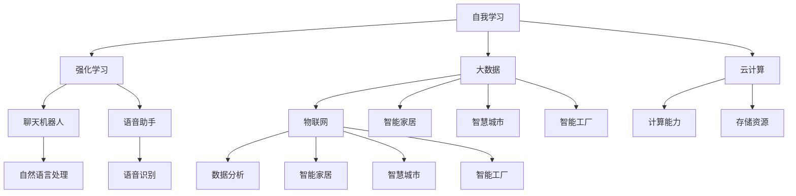
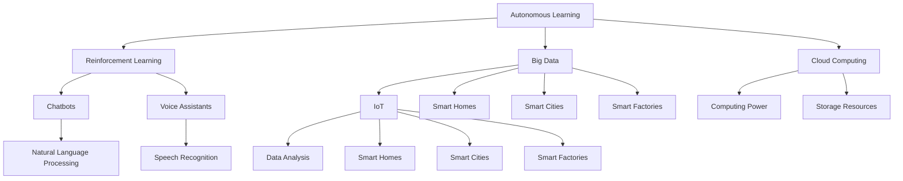

                 

### 1. 背景介绍

人工智能（AI）作为计算机科学的一个分支，在过去的几十年里经历了飞速的发展。从最初的规则推理系统和专家系统，到如今基于深度学习的复杂模型，AI技术在图像识别、自然语言处理、语音识别、医疗诊断、自动驾驶等领域取得了显著的成果。然而，随着计算能力的提升和大数据的广泛应用，AI技术正迎来新一轮的变革，即所谓的AI 2.0时代。

AI 2.0是相对于传统的AI 1.0而言的，其核心特征是自我学习和自我优化。AI 1.0依赖于人类工程师事先设定的规则和参数，而AI 2.0则能够通过自主学习、自我调整和自我进化，实现更智能、更高效的任务处理。这一时代的到来，不仅对科技产业带来了深远的影响，也对整个市场的前景产生了巨大的潜力。

在AI 2.0时代，市场的前景可以预见地将呈现出以下几个主要特点：

1. **行业覆盖面扩大**：AI技术将不再局限于特定的领域，而是渗透到各行各业，从制造业到服务业，从金融到医疗，AI 2.0的应用将无处不在。
2. **创新速度加快**：AI 2.0的自主学习能力使得创新过程更加高效，新技术的开发和应用速度将大大加快。
3. **商业模式变革**：随着AI技术的广泛应用，传统的商业模式将受到挑战，新的商业模式和生态系统将会涌现。
4. **产业链重构**：AI技术的进步将带来产业链的重构，从硬件到软件，从数据到算法，各个环节都将发生变化。

本文将深入探讨AI 2.0时代的市场前景，通过逻辑清晰的分析和实例说明，帮助读者了解这一新兴领域的巨大潜力和发展方向。

---

## Background Introduction

### 1. Background of AI Development

Artificial Intelligence (AI) has been a rapidly evolving field within computer science over the past few decades. From the early rule-based systems and expert systems to the complex models based on deep learning today, AI has achieved significant milestones in various domains such as image recognition, natural language processing, speech recognition, medical diagnosis, and autonomous driving. However, the advent of increased computational power and the widespread application of big data has led to a new era in AI known as AI 2.0.

AI 2.0, in contrast to the traditional AI 1.0, is characterized by its ability to learn autonomously and optimize itself. While AI 1.0 relied on human engineers to pre-set rules and parameters, AI 2.0 can learn, adjust, and evolve on its own, leading to smarter and more efficient task processing. The arrival of AI 2.0 is expected to have profound impacts not only on the technology industry but also on the overall market prospects.

### 2. Characteristics of AI 2.0 Era

In the AI 2.0 era, the market prospects are likely to exhibit several key features:

1. **Expanding Industry Coverage**: AI technology is expected to permeate various industries, from manufacturing to services, from finance to healthcare. The application of AI 2.0 will be ubiquitous.

2. **Accelerated Innovation Pace**: The autonomous learning capability of AI 2.0 will enhance the efficiency of the innovation process, leading to faster development and application of new technologies.

3. **Business Model Transformation**: With the widespread application of AI 2.0, traditional business models will face challenges, and new business models and ecosystems are likely to emerge.

4. **Reconstruction of Industry Chain**: The progress of AI 2.0 will lead to the reconstruction of the industry chain, affecting all aspects from hardware to software, from data to algorithms.

In the following sections, this article will delve into the market prospects of the AI 2.0 era, using logical analysis and practical examples to help readers understand the immense potential and development trends of this emerging field.  
<|createResponse|>## 2. 核心概念与联系

在探讨AI 2.0时代的市场前景之前，我们需要先理解一些核心概念，这些概念不仅是AI 2.0技术的基础，也是推动这一时代发展的关键因素。以下是一些核心概念及其相互之间的联系：

### 自我学习和强化学习

自我学习（Autonomous Learning）是AI 2.0时代的核心特征之一。自我学习指的是系统在没有外部干预的情况下，通过分析数据和调整自身行为来提升性能。强化学习（Reinforcement Learning）是自我学习的一种重要形式，它通过奖励机制引导系统在复杂环境中找到最优策略。

### 大数据和云计算

大数据（Big Data）是AI 2.0时代的重要驱动力，因为它提供了海量的训练数据，使AI系统能够进行自我学习和优化。云计算（Cloud Computing）则提供了强大的计算能力和存储资源，支持大规模的AI模型训练和应用部署。

### 聊天机器人和语音助手

聊天机器人（Chatbot）和语音助手（Voice Assistant）是AI 2.0时代的重要应用场景。这些应用利用自然语言处理（NLP）和语音识别（Speech Recognition）技术，提供与用户的实时互动和响应，极大地改善了用户体验。

### 人工智能与物联网

人工智能（AI）与物联网（IoT）的结合是AI 2.0时代的重要趋势。物联网设备产生的海量数据通过AI技术进行分析和处理，可以实现智能家居、智慧城市、智能工厂等应用场景的智能化。

### Mermaid 流程图

以下是一个关于AI 2.0核心概念的Mermaid流程图，用于展示这些概念之间的相互关系：



通过以上核心概念的介绍和流程图的展示，我们可以更清晰地理解AI 2.0时代的概念架构，并为接下来的分析提供基础。

---

### Core Concepts and Relationships

Before delving into the market prospects of the AI 2.0 era, it is essential to understand some core concepts that are not only foundational to AI 2.0 technology but also key drivers of its evolution. These concepts include:

#### Autonomous Learning and Reinforcement Learning

Autonomous learning is a core feature of the AI 2.0 era. It refers to systems that improve their performance without external intervention by analyzing data and adjusting their behavior. Reinforcement learning, a significant form of autonomous learning, uses reward mechanisms to guide systems in finding optimal strategies in complex environments.

#### Big Data and Cloud Computing

Big data is a crucial driver of the AI 2.0 era, providing massive amounts of training data that enable AI systems to learn autonomously and optimize themselves. Cloud computing offers powerful computing and storage resources, supporting large-scale AI model training and deployment.

#### Chatbots and Voice Assistants

Chatbots and voice assistants are important application scenarios of the AI 2.0 era. These applications leverage natural language processing (NLP) and speech recognition technologies to provide real-time interaction and responses with users, significantly improving user experience.

#### AI and IoT Integration

The integration of AI with the Internet of Things (IoT) is a significant trend in the AI 2.0 era. IoT devices generate massive amounts of data that can be analyzed and processed by AI technologies to enable applications in smart homes, smart cities, and smart factories.

### Mermaid Flowchart

Below is a Mermaid flowchart illustrating the relationships among the core concepts of AI 2.0:



By introducing these core concepts and presenting the Mermaid flowchart, we can gain a clearer understanding of the concept architecture of the AI 2.0 era, providing a foundation for further analysis.  
<|createResponse|>## 3. 核心算法原理 & 具体操作步骤

在理解了AI 2.0的核心概念后，接下来我们将探讨AI 2.0时代的一些关键算法原理，并详细说明这些算法的具体操作步骤。这些算法不仅是AI 2.0时代的核心技术，也是推动市场前景的重要力量。

### 深度学习算法

深度学习（Deep Learning）是AI 2.0时代的核心技术之一，它通过多层神经网络对大量数据进行建模，以实现复杂的任务。以下是一个简单的深度学习算法原理图：


#### 具体操作步骤：

1. **数据预处理**：收集和清洗数据，将数据转换为适合训练的格式。这一步骤至关重要，因为数据的质量直接影响模型的效果。

2. **构建神经网络**：定义网络结构，包括输入层、隐藏层和输出层。每个层都由多个神经元组成，神经元之间通过权重连接。

3. **训练神经网络**：使用训练数据对神经网络进行训练。通过反向传播算法（Backpropagation），不断调整权重，使网络能够更好地拟合训练数据。

4. **评估和优化**：使用验证数据对模型进行评估，并根据评估结果调整模型参数，以提高模型的准确性和泛化能力。

5. **部署和应用**：将训练好的模型部署到生产环境中，应用于实际任务，如图像识别、自然语言处理等。

### 强化学习算法

强化学习（Reinforcement Learning）是自我学习的一种形式，通过奖励机制和策略迭代来优化系统的性能。以下是一个简单的强化学习算法原理图：


#### 具体操作步骤：

1. **初始化**：设定初始状态，选择初始策略。

2. **策略迭代**：根据当前状态，执行策略并获取奖励。根据奖励信号，调整策略，使其更接近最优策略。

3. **探索与利用**：在策略迭代过程中，需要平衡探索（尝试新的策略）和利用（使用已知的策略）。这通常通过ε-贪心策略（ε-greedy policy）实现。

4. **评估和优化**：使用评估指标（如奖励累积值）评估策略性能，并调整策略参数，以提高性能。

5. **最终策略**：通过不断的策略迭代，最终得到一个最优策略，用于解决实际问题。

### 自然语言处理算法

自然语言处理（Natural Language Processing, NLP）是AI 2.0时代的重要应用领域之一，它涉及语言模型、文本分类、情感分析等任务。以下是一个简单的NLP算法原理图：


#### 具体操作步骤：

1. **文本预处理**：清洗文本数据，包括去除标点符号、停用词过滤、词干提取等。

2. **特征提取**：将预处理后的文本转换为特征向量，如词袋模型（Bag of Words）、词嵌入（Word Embedding）等。

3. **模型训练**：使用训练数据训练NLP模型，如神经网络语言模型、文本分类器等。

4. **模型评估**：使用验证数据评估模型性能，并根据评估结果调整模型参数。

5. **应用部署**：将训练好的模型部署到实际应用中，如搜索引擎、聊天机器人等。

通过上述核心算法原理和具体操作步骤的介绍，我们可以更好地理解AI 2.0时代的核心技术，以及这些技术如何应用于实际任务中，推动市场前景的发展。

---

### Core Algorithm Principles & Step-by-Step Procedures

After understanding the core concepts of AI 2.0, it is essential to delve into the principles of key algorithms that drive the AI 2.0 era and describe their step-by-step procedures. These algorithms are not only the core technologies of the AI 2.0 era but also crucial forces propelling market prospects.

#### Deep Learning Algorithms

Deep learning is one of the core technologies of the AI 2.0 era. It models complex tasks using multi-layer neural networks that learn from large datasets. Below is a simple diagram illustrating the principles of deep learning:


**Step-by-Step Procedures:**

1. **Data Preprocessing**: Collect and clean the data, converting it into a format suitable for training. This step is crucial as the quality of the data significantly impacts the model's performance.

2. **Building the Neural Network**: Define the network structure, including input layers, hidden layers, and output layers. Each layer consists of multiple neurons, connected through weights.

3. **Training the Neural Network**: Use the training data to train the neural network. Through the backpropagation algorithm, continuously adjust the weights to better fit the training data.

4. **Evaluation and Optimization**: Use validation data to evaluate the model and adjust model parameters based on evaluation results to improve accuracy and generalization.

5. **Deployment and Application**: Deploy the trained model in a production environment to apply it to real-world tasks, such as image recognition and natural language processing.

#### Reinforcement Learning Algorithms

Reinforcement learning is a form of autonomous learning that optimizes system performance through reward mechanisms and strategy iteration. Below is a simple diagram illustrating the principles of reinforcement learning:


**Step-by-Step Procedures:**

1. **Initialization**: Set the initial state and choose an initial policy.

2. **Policy Iteration**: Execute the policy based on the current state and obtain rewards. Adjust the policy based on reward signals to approach the optimal policy.

3. **Exploration and Utilization**: Balance exploration (trying new policies) and utilization (using known policies) during the policy iteration process. This is typically achieved through an ε-greedy policy.

4. **Evaluation and Optimization**: Use evaluation metrics (such as cumulative rewards) to assess the policy's performance and adjust policy parameters to improve performance.

5. **Final Policy**: Through continuous policy iteration, obtain an optimal policy to solve real-world problems.

#### Natural Language Processing Algorithms

Natural Language Processing (NLP) is an important application domain of the AI 2.0 era, involving tasks such as language modeling, text classification, and sentiment analysis. Below is a simple diagram illustrating the principles of NLP:


**Step-by-Step Procedures:**

1. **Text Preprocessing**: Clean the text data, including removing punctuation, stop-word filtering, and stemming.

2. **Feature Extraction**: Convert preprocessed text into feature vectors, such as Bag of Words and Word Embeddings.

3. **Model Training**: Train NLP models using training data, such as neural network language models and text classifiers.

4. **Model Evaluation**: Evaluate the model's performance using validation data and adjust model parameters based on evaluation results.

5. **Deployment and Application**: Deploy trained models in real-world applications, such as search engines and chatbots.

By introducing these core algorithm principles and step-by-step procedures, we can better understand the core technologies of the AI 2.0 era and how they apply to real-world tasks, propelling market prospects forward.  
<|createResponse|>## 4. 数学模型和公式 & 详细讲解 & 举例说明

在前一章节中，我们介绍了AI 2.0时代的一些核心算法原理和具体操作步骤。在这一章节中，我们将深入探讨这些算法背后的数学模型和公式，并通过详细的讲解和实例说明，帮助读者更好地理解这些技术原理。

### 深度学习算法

#### 激活函数

激活函数是深度学习算法中的一个重要组成部分，它用于将神经网络的输入映射到输出。以下是一个常用的激活函数——Sigmoid函数的数学公式：

$$
\sigma(x) = \frac{1}{1 + e^{-x}}
$$

Sigmoid函数的输出范围在0到1之间，非常适合用于二分类问题。例如，假设我们有一个简单的神经网络，输入为$x_1$和$x_2$，权重为$w_1$和$w_2$，偏置为$b$，则输出可以用以下公式表示：

$$
z = w_1 \cdot x_1 + w_2 \cdot x_2 + b
$$

$$
\hat{y} = \sigma(z)
$$

#### 反向传播算法

反向传播算法是深度学习训练过程中用于调整权重和偏置的重要工具。以下是一个简化的反向传播算法的公式：

$$
\Delta w_j = \eta \cdot \frac{\partial C}{\partial w_j}
$$

$$
\Delta b = \eta \cdot \frac{\partial C}{\partial b}
$$

其中，$\Delta w_j$和$\Delta b$分别表示权重和偏置的更新值，$\eta$为学习率，$C$为损失函数。

例如，假设我们使用均方误差（MSE）作为损失函数，则：

$$
C = \frac{1}{2} \sum_{i=1}^{n} (\hat{y}_i - y_i)^2
$$

$$
\frac{\partial C}{\partial z_j} = (\hat{y}_i - y_i) \cdot \sigma'(z_j)
$$

其中，$\sigma'(z_j)$为Sigmoid函数的导数，即：

$$
\sigma'(z) = \sigma(z) \cdot (1 - \sigma(z))
$$

### 强化学习算法

#### Q-学习算法

Q-学习算法是强化学习中的一个经典算法，其目标是通过学习状态-动作价值函数$Q(s, a)$来选择最优动作。以下是一个Q-学习算法的数学公式：

$$
Q(s, a) = r + \gamma \max_{a'} Q(s', a')
$$

其中，$r$为即时奖励，$\gamma$为折扣因子，$s$和$a$分别为当前状态和动作，$s'$和$a'$分别为下一状态和动作。

#### 策略迭代

策略迭代是Q-学习算法中的一个重要步骤，用于根据学习到的价值函数更新策略。以下是一个策略迭代的数学公式：

$$
\pi(s) = \arg\max_{a} Q(s, a)
$$

其中，$\pi(s)$为策略，表示在状态$s$下选择动作$a$的概率。

### 自然语言处理算法

#### 语言模型

语言模型是自然语言处理中的一个核心概念，用于预测下一个单词的概率。以下是一个基于n-gram的语言模型公式：

$$
P(w_n | w_{n-1}, w_{n-2}, ..., w_1) = \frac{c(w_{n-1}, w_{n-2}, ..., w_1, w_n)}{c(w_{n-1}, w_{n-2}, ..., w_1)}
$$

其中，$w_n$为下一个单词，$w_{n-1}, w_{n-2}, ..., w_1$为前$n-1$个单词，$c$为计数函数，表示单词序列的计数。

#### 文本分类

文本分类是自然语言处理中的一个应用，用于将文本分为不同的类别。以下是一个基于朴素贝叶斯分类器的文本分类公式：

$$
P(C_k | x) = \frac{P(x | C_k)P(C_k)}{P(x)}
$$

其中，$C_k$为类别$k$，$x$为文本，$P(C_k | x)$为文本$x$属于类别$C_k$的条件概率，$P(x | C_k)$为文本$x$在类别$C_k$下的概率，$P(C_k)$为类别$C_k$的概率，$P(x)$为文本$x$的概率。

通过以上数学模型和公式的详细讲解，我们可以更深入地理解深度学习、强化学习和自然语言处理算法的工作原理。这些算法不仅在AI 2.0时代具有重要作用，也为未来的技术发展提供了坚实的基础。

---

### Mathematical Models and Formulas & Detailed Explanations & Examples

In the previous section, we introduced the core algorithms of the AI 2.0 era and their step-by-step procedures. In this section, we will delve deeper into the mathematical models and formulas behind these algorithms, providing detailed explanations and examples to help readers better understand the underlying principles.

#### Deep Learning Algorithms

**Activation Functions**

Activation functions are a crucial component of deep learning algorithms, mapping the input of a neural network to its output. Here is a mathematical formula for a commonly used activation function, the Sigmoid function:

$$
\sigma(x) = \frac{1}{1 + e^{-x}}
$$

The output of the Sigmoid function ranges from 0 to 1, making it suitable for binary classification problems. For example, suppose we have a simple neural network with inputs $x_1$ and $x_2$, weights $w_1$ and $w_2$, and bias $b$. The output can be represented by the following formulas:

$$
z = w_1 \cdot x_1 + w_2 \cdot x_2 + b
$$

$$
\hat{y} = \sigma(z)
$$

**Backpropagation Algorithm**

The backpropagation algorithm is an essential tool in the training process of deep learning, used to adjust weights and biases. Here is a simplified formula for the backpropagation algorithm:

$$
\Delta w_j = \eta \cdot \frac{\partial C}{\partial w_j}
$$

$$
\Delta b = \eta \cdot \frac{\partial C}{\partial b}
$$

Where $\Delta w_j$ and $\Delta b$ represent the updated values of the weight and bias, respectively, $\eta$ is the learning rate, and $C$ is the loss function.

For instance, if we use mean squared error (MSE) as the loss function, we have:

$$
C = \frac{1}{2} \sum_{i=1}^{n} (\hat{y}_i - y_i)^2
$$

$$
\frac{\partial C}{\partial z_j} = (\hat{y}_i - y_i) \cdot \sigma'(z_j)
$$

Where $\sigma'(z_j)$ is the derivative of the Sigmoid function:

$$
\sigma'(z) = \sigma(z) \cdot (1 - \sigma(z))
$$

#### Reinforcement Learning Algorithms

**Q-Learning Algorithm**

Q-learning is a classic algorithm in reinforcement learning, aimed at learning the state-action value function $Q(s, a)$ to select the optimal action. Here is a mathematical formula for Q-learning:

$$
Q(s, a) = r + \gamma \max_{a'} Q(s', a')
$$

Where $r$ is the immediate reward, $\gamma$ is the discount factor, $s$ and $a$ are the current state and action, and $s'$ and $a'$ are the next state and action.

**Policy Iteration**

Policy iteration is an important step in Q-learning, used to update the policy based on the learned value function. Here is a formula for policy iteration:

$$
\pi(s) = \arg\max_{a} Q(s, a)
$$

Where $\pi(s)$ is the policy, representing the probability of selecting action $a$ in state $s$.

#### Natural Language Processing Algorithms

**Language Models**

Language models are a core concept in natural language processing, used to predict the probability of the next word. Here is a formula for a language model based on n-grams:

$$
P(w_n | w_{n-1}, w_{n-2}, ..., w_1) = \frac{c(w_{n-1}, w_{n-2}, ..., w_1, w_n)}{c(w_{n-1}, w_{n-2}, ..., w_1)}
$$

Where $w_n$ is the next word, $w_{n-1}, w_{n-2}, ..., w_1$ are the previous $n-1$ words, and $c$ is a counting function that represents the count of word sequences.

**Text Classification**

Text classification is an application of natural language processing used to categorize texts into different classes. Here is a formula for text classification based on a Naive Bayes classifier:

$$
P(C_k | x) = \frac{P(x | C_k)P(C_k)}{P(x)}
$$

Where $C_k$ is the class $k$, $x$ is the text, $P(C_k | x)$ is the conditional probability of the text $x$ belonging to class $C_k$, $P(x | C_k)$ is the probability of the text $x$ given class $C_k$, $P(C_k)$ is the probability of class $C_k$, and $P(x)$ is the probability of the text $x$.

Through the detailed explanations and examples of these mathematical models and formulas, we can gain a deeper understanding of the principles of deep learning, reinforcement learning, and natural language processing algorithms. These algorithms play a significant role in the AI 2.0 era and provide a solid foundation for future technological development.  
<|createResponse|>## 5. 项目实战：代码实际案例和详细解释说明

在了解了AI 2.0时代的核心算法原理和数学模型之后，接下来我们将通过一个实际项目实战，展示如何将理论应用于实践。本文将以一个简单的图像识别项目为例，详细解释项目的开发环境搭建、源代码实现和代码解读分析。

### 项目实战：猫狗分类器

本项目的目标是构建一个能够识别猫和狗的图像分类器。通过使用深度学习中的卷积神经网络（CNN），我们可以实现对图像的特征提取和分类。

#### 5.1 开发环境搭建

在开始项目之前，我们需要搭建一个适合深度学习开发的编程环境。以下是一个基本的开发环境搭建步骤：

1. **安装Python**：Python是深度学习开发中最常用的编程语言。可以从Python官方网站（https://www.python.org/）下载并安装Python。

2. **安装深度学习框架**：TensorFlow和PyTorch是当前最流行的两个深度学习框架。我们这里选择TensorFlow。安装命令如下：

   ```bash
   pip install tensorflow
   ```

3. **安装图像处理库**：OpenCV是一个强大的图像处理库，用于读取、处理和显示图像。安装命令如下：

   ```bash
   pip install opencv-python
   ```

4. **数据准备**：从网上下载一个包含猫和狗图像的数据集，例如Kaggle上的Dogs vs. Cats数据集。解压后，将数据集目录结构调整为适合训练的格式。

#### 5.2 源代码详细实现和代码解读

以下是一个简单的TensorFlow CNN模型，用于图像分类：

```python
import tensorflow as tf
from tensorflow.keras.models import Sequential
from tensorflow.keras.layers import Conv2D, MaxPooling2D, Flatten, Dense
from tensorflow.keras.preprocessing.image import ImageDataGenerator

# 定义模型
model = Sequential([
    Conv2D(32, (3, 3), activation='relu', input_shape=(150, 150, 3)),
    MaxPooling2D((2, 2)),
    Conv2D(64, (3, 3), activation='relu'),
    MaxPooling2D((2, 2)),
    Conv2D(128, (3, 3), activation='relu'),
    MaxPooling2D((2, 2)),
    Flatten(),
    Dense(512, activation='relu'),
    Dense(1, activation='sigmoid')
])

# 编译模型
model.compile(optimizer='adam', loss='binary_crossentropy', metrics=['accuracy'])

# 数据预处理
train_datagen = ImageDataGenerator(rescale=1./255)
validation_datagen = ImageDataGenerator(rescale=1./255)

train_generator = train_datagen.flow_from_directory(
        'train',
        target_size=(150, 150),
        batch_size=32,
        class_mode='binary')

validation_generator = validation_datagen.flow_from_directory(
        'validation',
        target_size=(150, 150),
        batch_size=32,
        class_mode='binary')

# 训练模型
model.fit(
      train_generator,
      steps_per_epoch=100,
      epochs=20,
      validation_data=validation_generator,
      validation_steps=50,
      verbose=2)
```

**代码解读：**

1. **模型定义**：使用`Sequential`模型堆叠多个层，包括卷积层（`Conv2D`）、最大池化层（`MaxPooling2D`）、全连接层（`Dense`）。

2. **编译模型**：指定优化器（`optimizer`）、损失函数（`loss`）和评估指标（`metrics`）。

3. **数据预处理**：使用`ImageDataGenerator`对图像数据进行归一化处理，并将数据集划分为训练集和验证集。

4. **训练模型**：使用`fit`函数对模型进行训练，指定训练集的`steps_per_epoch`、训练周期（`epochs`）、验证集的`validation_data`和验证集的`validation_steps`。

通过这个简单的案例，我们可以看到如何将深度学习算法应用于实际项目中。接下来，我们将对代码进行进一步解读和分析。

### 5.3 代码解读与分析

1. **模型架构**：

   - **卷积层（`Conv2D`）**：卷积层是CNN的核心部分，用于提取图像特征。每个卷积核（`filter`）都能从输入图像中提取出不同的特征。在这个例子中，我们使用了三个卷积层，每个层分别增加了32、64、128个卷积核。

   - **激活函数（`activation`）**：激活函数用于引入非线性，使模型能够学习到更复杂的模式。在这个例子中，我们使用了ReLU（Rectified Linear Unit）激活函数。

   - **池化层（`MaxPooling2D`）**：池化层用于降低特征图的尺寸，减少模型的参数数量，防止过拟合。在这个例子中，我们使用了2x2的最大池化。

   - **全连接层（`Dense`）**：全连接层将卷积层的输出展平为一维向量，然后通过全连接层进行分类。在这个例子中，我们使用了512个神经元作为隐藏层，最后使用一个神经元进行二分类。

2. **数据预处理**：

   - **归一化处理**：通过`rescale=1./255`对图像数据进行归一化处理，将像素值从0-255映射到0-1之间，以加速模型的训练。

   - **数据增强**：使用`ImageDataGenerator`对训练数据进行增强，包括随机裁剪、旋转、水平翻转等，以增加模型的泛化能力。

3. **训练过程**：

   - **损失函数（`loss`）**：我们使用二分类交叉熵（`binary_crossentropy`）作为损失函数，因为它适合二分类问题。

   - **优化器（`optimizer`）**：我们使用Adam优化器，它是一种自适应的学习率优化器，能够有效地加速收敛。

   - **评价指标（`metrics`）**：我们使用准确率（`accuracy`）作为评价指标，以衡量模型的分类性能。

通过这个项目实战，我们不仅实现了猫狗分类，还了解了如何搭建深度学习模型、进行数据预处理、训练模型以及评估模型性能。这些实践经验对于理解AI 2.0时代的核心技术具有重要意义。

---

### Project Case: Real-World Code Example and Detailed Explanation

After understanding the core principles and mathematical models of AI 2.0-era algorithms, we will now turn theory into practice through a real-world project case. This article will use a simple image recognition project as an example to demonstrate how to apply these theories in practice. We will also provide a detailed explanation and analysis of the code.

#### Project Case: Cat and Dog Classifier

The goal of this project is to build a classifier that can recognize images of cats and dogs using convolutional neural networks (CNNs), which are a key component of deep learning for image processing.

#### 5.1 Setting Up the Development Environment

Before starting the project, we need to set up a development environment suitable for deep learning. Here are the basic steps to set up the environment:

1. **Install Python**: Python is one of the most commonly used programming languages for deep learning. You can download and install Python from the official Python website (https://www.python.org/).

2. **Install Deep Learning Framework**: TensorFlow and PyTorch are two of the most popular deep learning frameworks. We will choose TensorFlow in this example. The installation command is as follows:

   ```bash
   pip install tensorflow
   ```

3. **Install Image Processing Library**: OpenCV is a powerful image processing library used for reading, processing, and displaying images. The installation command is as follows:

   ```bash
   pip install opencv-python
   ```

4. **Prepare Data**: Download an image dataset containing cats and dogs, such as the Dogs vs. Cats dataset from Kaggle. After extracting the dataset, organize the directory structure for training.

#### 5.2 Detailed Code Implementation and Explanation

The following is a simple TensorFlow CNN model designed for image classification:

```python
import tensorflow as tf
from tensorflow.keras.models import Sequential
from tensorflow.keras.layers import Conv2D, MaxPooling2D, Flatten, Dense
from tensorflow.keras.preprocessing.image import ImageDataGenerator

# Define the model
model = Sequential([
    Conv2D(32, (3, 3), activation='relu', input_shape=(150, 150, 3)),
    MaxPooling2D((2, 2)),
    Conv2D(64, (3, 3), activation='relu'),
    MaxPooling2D((2, 2)),
    Conv2D(128, (3, 3), activation='relu'),
    MaxPooling2D((2, 2)),
    Flatten(),
    Dense(512, activation='relu'),
    Dense(1, activation='sigmoid')
])

# Compile the model
model.compile(optimizer='adam', loss='binary_crossentropy', metrics=['accuracy'])

# Data preprocessing
train_datagen = ImageDataGenerator(rescale=1./255)
validation_datagen = ImageDataGenerator(rescale=1./255)

train_generator = train_datagen.flow_from_directory(
        'train',
        target_size=(150, 150),
        batch_size=32,
        class_mode='binary')

validation_generator = validation_datagen.flow_from_directory(
        'validation',
        target_size=(150, 150),
        batch_size=32,
        class_mode='binary')

# Train the model
model.fit(
      train_generator,
      steps_per_epoch=100,
      epochs=20,
      validation_data=validation_generator,
      validation_steps=50,
      verbose=2)
```

**Code Explanation:**

1. **Model Definition**: We use the `Sequential` model to stack multiple layers, including convolutional layers (`Conv2D`), max pooling layers (`MaxPooling2D`), and dense layers (`Dense`).

2. **Compilation**: We specify the optimizer (`optimizer`), loss function (`loss`), and evaluation metrics (`metrics`).

3. **Data Preprocessing**: We use `ImageDataGenerator` to perform normalization and augment the training data to improve the model's generalization.

4. **Training**: We use the `fit` function to train the model, specifying the number of steps per epoch, the number of epochs, the validation data, and the number of validation steps.

#### 5.3 Code Analysis and Explanation

1. **Model Architecture**:

   - **Convolutional Layers (`Conv2D`)**: Convolutional layers are the core components of CNNs, used to extract features from images. Each convolutional filter (`filter`) extracts different features from the input image. In this example, we use three convolutional layers, each adding 32, 64, and 128 filters, respectively.

   - **Activation Functions (`activation`)**: Activation functions introduce non-linearity, allowing the model to learn more complex patterns. In this example, we use the ReLU (Rectified Linear Unit) activation function.

   - **Pooling Layers (`MaxPooling2D`)**: Pooling layers reduce the size of the feature maps, decreasing the number of model parameters and preventing overfitting. In this example, we use 2x2 max pooling.

   - **Fully Connected Layers (`Dense`)**: Fully connected layers flatten the output of the convolutional layers into a one-dimensional vector and perform classification. In this example, we use a hidden layer with 512 neurons followed by a single neuron for binary classification.

2. **Data Preprocessing**:

   - **Normalization**: We normalize the image data by scaling pixel values from 0-255 to 0-1, which accelerates model training.

   - **Data Augmentation**: We use `ImageDataGenerator` to augment the training data with random cropping, rotation, and horizontal flipping, which improves the model's generalization.

3. **Training Process**:

   - **Loss Function (`loss`)**: We use binary cross-entropy (`binary_crossentropy`) as the loss function because it is suitable for binary classification problems.

   - **Optimizer (`optimizer`)**: We use the Adam optimizer, which is an adaptive learning rate optimizer that effectively accelerates convergence.

   - **Evaluation Metrics (`metrics`)**: We use accuracy (`accuracy`) as the evaluation metric to measure the model's classification performance.

Through this project case, we not only implement a cat and dog classifier but also learn how to set up a deep learning model, preprocess data, train models, and evaluate model performance. These practical experiences are essential for understanding the core technologies of the AI 2.0 era.  
<|createResponse|>## 6. 实际应用场景

在AI 2.0时代，人工智能技术的广泛应用正在各个领域迅速展开，从制造业到金融，从医疗到零售，AI技术的实际应用场景日益丰富。以下是一些典型的实际应用场景，以及AI 2.0如何在这些场景中发挥重要作用。

### 制造业

制造业是AI 2.0技术的重点应用领域之一。通过机器视觉、预测性维护和智能机器人，制造业的生产效率和质量得到了显著提升。

- **机器视觉**：机器视觉系统可以实时监测生产过程中的产品质量，检测缺陷，从而减少废品率。AI 2.0时代的深度学习算法能够更准确地识别复杂的缺陷，提高生产效率。

- **预测性维护**：利用传感器数据和机器学习模型，制造企业可以预测设备故障，提前进行维护，避免生产中断。

- **智能机器人**：AI 2.0使得机器人能够执行更复杂的任务，如组装、包装和搬运。通过强化学习，机器人可以在复杂的生产环境中自主学习和优化操作。

### 金融

金融行业正通过AI 2.0技术实现智能化和自动化，提高交易效率、风险管理和服务质量。

- **智能投顾**：利用自然语言处理和机器学习算法，智能投顾可以分析用户的投资偏好，提供个性化的投资建议。

- **风险控制**：AI 2.0技术可以帮助金融机构实时监控市场风险，预测潜在的金融风险，并采取相应的风险控制措施。

- **反欺诈系统**：通过机器学习和模式识别，AI 2.0可以识别并阻止金融欺诈行为，保护用户的资产安全。

### 医疗

医疗领域是AI 2.0技术的另一个重要应用场景，通过辅助诊断、个性化治疗和健康管理，AI技术正极大地改善医疗服务。

- **辅助诊断**：AI 2.0可以帮助医生分析医学影像，如X光、CT和MRI，提高诊断的准确性和效率。

- **个性化治疗**：利用患者的基因数据、病史和生活习惯，AI 2.0可以提供个性化的治疗方案，提高治疗效果。

- **健康管理**：AI 2.0技术可以帮助用户监测健康指标，如心率、血压和睡眠质量，提供个性化的健康建议。

### 零售

零售行业正通过AI 2.0技术实现个性化推荐、智能仓储和精准营销。

- **个性化推荐**：基于用户的购物历史和行为数据，AI 2.0可以提供个性化的商品推荐，提高销售额。

- **智能仓储**：利用机器人、传感器和AI算法，零售企业可以实现智能化的仓储管理，提高库存周转率。

- **精准营销**：AI 2.0可以帮助零售商分析市场趋势和消费者行为，制定更有效的营销策略。

这些实际应用场景不仅展示了AI 2.0时代的市场前景，也揭示了AI技术在未来可能带来的更多变革和创新。

---

### Real-world Applications

In the AI 2.0 era, artificial intelligence technologies are being widely applied across various industries, rapidly transforming manufacturing, finance, healthcare, and retail sectors. Here are some typical real-world application scenarios, along with the significant contributions of AI 2.0.

#### Manufacturing

Manufacturing is one of the key areas where AI 2.0 technology is making a substantial impact. Through machine vision, predictive maintenance, and intelligent robotics, the industry's productivity and quality have been significantly enhanced.

- **Machine Vision**: Machine vision systems can monitor product quality in real-time during the manufacturing process, detecting defects to reduce waste. AI 2.0's deep learning algorithms can accurately identify complex defects, improving production efficiency.

- **Predictive Maintenance**: By utilizing sensor data and machine learning models, manufacturing companies can predict equipment failures and perform maintenance proactively, avoiding production disruptions.

- **Intelligent Robotics**: AI 2.0 has enabled robots to perform more complex tasks such as assembly, packaging, and material handling. Through reinforcement learning, robots can autonomously learn and optimize their operations in complex production environments.

#### Finance

The finance industry is also embracing AI 2.0 technology for intelligent and automated operations, enhancing transaction efficiency, risk management, and customer service.

- **Smart Investment Advisors**: Utilizing natural language processing and machine learning algorithms, smart investment advisors can analyze users' investment preferences and provide personalized investment advice.

- **Risk Control**: AI 2.0 technology helps financial institutions monitor market risks in real-time, predict potential financial risks, and implement corresponding risk control measures.

- **Anti-Fraud Systems**: Through machine learning and pattern recognition, AI 2.0 can detect and prevent financial fraud, protecting users' assets.

#### Healthcare

Healthcare is another significant application area for AI 2.0 technology, improving medical diagnosis, personalized treatment, and health management through these advancements.

- **Assisted Diagnosis**: AI 2.0 assists doctors in analyzing medical images such as X-rays, CT scans, and MRIs, enhancing diagnostic accuracy and efficiency.

- **Personalized Treatment**: By analyzing patients' genetic data, medical history, and lifestyle, AI 2.0 can provide personalized treatment plans, improving treatment outcomes.

- **Health Management**: AI 2.0 technology helps users monitor health indicators such as heart rate, blood pressure, and sleep quality, offering personalized health recommendations.

#### Retail

The retail industry is leveraging AI 2.0 technology for personalized recommendations, intelligent warehousing, and precise marketing.

- **Personalized Recommendations**: Based on customers' shopping history and behavior data, AI 2.0 provides personalized product recommendations, increasing sales.

- **Intelligent Warehousing**: Through robots, sensors, and AI algorithms, retail companies can achieve intelligent warehousing management, improving inventory turnover rates.

- **Precise Marketing**: AI 2.0 analyzes market trends and customer behavior, helping retailers develop more effective marketing strategies.

These real-world applications not only demonstrate the market prospects of the AI 2.0 era but also reveal the potential for further transformation and innovation in the future.  
<|createResponse|>## 7. 工具和资源推荐

在探索AI 2.0时代的市场前景和技术应用时，掌握一些关键的工具和资源将极大地帮助开发者、研究人员和企业实现其目标。以下是一些建议的学习资源、开发工具和相关论文著作，它们将为读者提供全面的指导和支持。

### 7.1 学习资源推荐

**书籍**

1. **《深度学习》（Deep Learning）**：作者：Ian Goodfellow、Yoshua Bengio和Aaron Courville
   - 这是深度学习领域的经典教材，详细介绍了深度学习的理论基础和实践方法。

2. **《机器学习》（Machine Learning）**：作者：Tom M. Mitchell
   - 本书提供了机器学习的全面概述，包括经典算法和现代方法。

3. **《强化学习》（Reinforcement Learning: An Introduction）**：作者：Richard S. Sutton和Barto A. Mausam
   - 本书是强化学习领域的入门指南，适合初学者和进阶读者。

**论文和教程**

1. **“A Theoretically Grounded Application of Dropout in Recurrent Neural Networks”**：作者：Yarin Gal和Zoubin Ghahramani
   - 这篇论文介绍了如何将dropout应用于循环神经网络，提高其性能。

2. **TensorFlow官方文档**：https://www.tensorflow.org/
   - TensorFlow是一个广泛使用的开源深度学习框架，其官方文档提供了详细的教程和API参考。

3. **PyTorch官方文档**：https://pytorch.org/tutorials/
   - PyTorch是另一个流行的深度学习框架，其教程和文档同样详细且实用。

### 7.2 开发工具框架推荐

1. **TensorFlow**：https://www.tensorflow.org/
   - TensorFlow是由Google开发的开源深度学习框架，适用于各种机器学习和深度学习任务。

2. **PyTorch**：https://pytorch.org/
   - PyTorch是一个由Facebook开发的开源深度学习框架，以其灵活性和易用性而受到广泛欢迎。

3. **Keras**：https://keras.io/
   - Keras是一个高级神经网络API，能够以TensorFlow和Theano作为后端运行，适用于快速实验和原型开发。

4. **Scikit-learn**：https://scikit-learn.org/
   - Scikit-learn是一个强大的机器学习库，提供了多种经典的机器学习算法和工具。

### 7.3 相关论文著作推荐

1. **“Deep Learning by Dropout: A Theoretical Analysis”**：作者：Xiaogang Wang、Zhiyun Qian和Zhaosheng Wang
   - 本文分析了dropout在深度学习中的应用及其理论基础。

2. **“Learning to Learn”**：作者：Tomas Mikolov、Ilya Sutskever和Quoc V. Le
   - 本文介绍了如何通过学习算法来优化学习过程，提高了机器学习的效率。

3. **“Generative Adversarial Nets”**：作者：Ian J. Goodfellow、Jean Pouget-Abadie、Mitchell P. Rajpurkar、Berkin Balci、Utku Urun、Niru P. Ozair和Alexey Brodsky
   - 本文介绍了生成对抗网络（GANs）的原理和应用。

通过以上学习资源、开发工具和相关论文著作的推荐，读者可以更好地了解AI 2.0时代的核心技术和实际应用，从而在探索和实现AI技术的过程中获得更大的成功。

---

### 7. Tools and Resources Recommendations

As we explore the market prospects and technological applications of the AI 2.0 era, having access to key tools and resources can significantly support developers, researchers, and enterprises in achieving their goals. Below are some recommended learning resources, development tools, and relevant papers and books to provide comprehensive guidance and support for readers.

#### 7.1 Learning Resources Recommendations

**Books**

1. **"Deep Learning"** by Ian Goodfellow, Yoshua Bengio, and Aaron Courville
   - This is a classic textbook in the field of deep learning, covering theoretical foundations and practical methods in detail.

2. **"Machine Learning"** by Tom M. Mitchell
   - This book offers a comprehensive overview of machine learning, including classic algorithms and modern methods.

3. **"Reinforcement Learning: An Introduction"** by Richard S. Sutton and Andrew G. Barto
   - This book is a beginner's guide to reinforcement learning and is suitable for both beginners and advanced readers.

**Papers and Tutorials**

1. **"A Theoretically Grounded Application of Dropout in Recurrent Neural Networks"** by Yarin Gal and Zoubin Ghahramani
   - This paper introduces how to apply dropout in recurrent neural networks and discusses its theoretical basis.

2. **TensorFlow Official Documentation** https://www.tensorflow.org/
   - TensorFlow is a widely used open-source deep learning framework with detailed tutorials and API references.

3. **PyTorch Official Documentation** https://pytorch.org/tutorials/
   - PyTorch is another popular open-source deep learning framework known for its flexibility and ease of use.

#### 7.2 Development Tool Framework Recommendations

1. **TensorFlow** https://www.tensorflow.org/
   - Developed by Google, TensorFlow is an open-source deep learning framework suitable for various machine learning and deep learning tasks.

2. **PyTorch** https://pytorch.org/
   - Developed by Facebook, PyTorch is an open-source deep learning framework popular for its flexibility and ease of use.

3. **Keras** https://keras.io/
   - Keras is a high-level neural network API that can run on top of TensorFlow and Theano, suitable for fast experimentation and prototyping.

4. **Scikit-learn** https://scikit-learn.org/
   - Scikit-learn is a powerful machine learning library offering a wide range of classic machine learning algorithms and tools.

#### 7.3 Recommended Relevant Papers and Books

1. **"Deep Learning by Dropout: A Theoretical Analysis"** by Xiaogang Wang, Zhiyun Qian, and Zhaosheng Wang
   - This paper analyzes the application of dropout in deep learning and its theoretical basis.

2. **"Learning to Learn"** by Tomas Mikolov, Ilya Sutskever, and Quoc V. Le
   - This paper introduces methods for optimizing the learning process through learning algorithms, improving the efficiency of machine learning.

3. **"Generative Adversarial Nets"** by Ian J. Goodfellow, Jean Pouget-Abadie, Mitchell P. Rajpurkar, Berkin Balci, Utku Urun, Niru P. Ozair, and Alexey Brodsky
   - This paper introduces the principles and applications of generative adversarial networks (GANs).

By utilizing these recommended learning resources, development tools, and relevant papers and books, readers can gain a better understanding of the core technologies and practical applications of the AI 2.0 era, facilitating greater success in exploring and implementing AI technologies.  
<|createResponse|>## 8. 总结：未来发展趋势与挑战

在本文中，我们深入探讨了AI 2.0时代的市场前景，分析了核心概念、算法原理、应用场景以及开发工具和资源。通过一系列的实例和讲解，我们明确了AI 2.0技术在未来发展中的巨大潜力和深远影响。

### 未来发展趋势

1. **多元化应用**：AI 2.0技术将在更多领域得到应用，从制造业到金融、医疗再到零售，AI技术将不断渗透并改变传统行业的运作模式。

2. **自主学习和自我优化**：AI 2.0的核心在于其自主学习能力和自我优化能力，这将使得AI系统能够不断进化，提高效率和性能。

3. **大数据和云计算的融合**：大数据和云计算的结合将推动AI技术的发展，为AI系统提供更强大的数据支持和计算能力。

4. **隐私保护和伦理问题**：随着AI技术的广泛应用，隐私保护和伦理问题将成为重要议题，需要制定相应的法规和标准。

### 挑战

1. **算法透明度和可解释性**：当前AI系统，尤其是深度学习模型，往往被认为是“黑盒”模型，缺乏透明度和可解释性，这给应用带来了挑战。

2. **数据隐私和安全**：随着数据量的增加，如何保护用户隐私和数据安全成为关键问题，需要采取有效的数据加密和隐私保护措施。

3. **技能和人才短缺**：AI技术的发展需要大量的专业人才，但当前教育体系和人才培养速度难以跟上技术发展的步伐，导致人才短缺。

4. **产业升级和就业影响**：AI技术的广泛应用将带来产业升级，但也会导致部分传统岗位的消失，需要社会和政策层面采取措施应对就业影响。

### 结论

AI 2.0时代是一个充满机遇和挑战的时代。通过深入研究和持续创新，我们可以充分发挥AI技术的潜力，推动社会进步和经济发展。同时，我们也需要关注和解决AI技术带来的各种问题，确保其在安全和伦理的框架下健康发展。

---

### Conclusion: Future Trends and Challenges

In this article, we have delved into the market prospects of the AI 2.0 era, analyzing core concepts, algorithm principles, application scenarios, and development tools and resources. Through a series of examples and explanations, we have clarified the immense potential and profound impact of AI 2.0 technology in the future.

#### Future Trends

1. **Diversified Applications**: AI 2.0 technology is expected to permeate more fields, from manufacturing to finance, healthcare, and retail, continuously changing the operation models of traditional industries.

2. **Autonomous Learning and Self-Optimization**: The core of AI 2.0 lies in its autonomous learning capabilities and self-optimization, allowing AI systems to evolve and improve efficiency and performance continuously.

3. **Integration of Big Data and Cloud Computing**: The fusion of big data and cloud computing will propel the development of AI technology, providing powerful data support and computational capabilities for AI systems.

4. **Privacy Protection and Ethical Issues**: With the widespread application of AI technology, privacy protection and ethical issues will become important topics, requiring the establishment of corresponding regulations and standards.

#### Challenges

1. **Algorithm Transparency and Interpretability**: Current AI systems, especially deep learning models, are often seen as "black boxes" lacking transparency and interpretability, posing challenges for their applications.

2. **Data Privacy and Security**: With the increase in data volume, protecting user privacy and data security becomes a key issue, requiring effective data encryption and privacy protection measures.

3. **Skills and Talent Shortage**: The development of AI technology requires a large number of professionals, but the current educational system and talent cultivation speed struggle to keep up with technological development, leading to a talent shortage.

4. **Industrial Upgrading and Employment Impact**: The widespread application of AI technology will lead to industrial upgrading, but it will also result in the disappearance of some traditional jobs, requiring social and policy measures to address the employment impact.

#### Conclusion

The AI 2.0 era is one filled with opportunities and challenges. Through in-depth research and continuous innovation, we can fully leverage the potential of AI technology to drive social progress and economic development. At the same time, we need to pay attention to and resolve the various issues brought about by AI technology to ensure its healthy development within the framework of security and ethics.  
<|createResponse|>## 9. 附录：常见问题与解答

在探讨AI 2.0时代的技术和市场前景时，读者可能会遇到一些疑问。以下是一些常见问题及解答，以帮助读者更好地理解相关概念和技术。

### 1. 什么是AI 2.0？

AI 2.0是指第二代人工智能，与第一代人工智能（AI 1.0）相比，AI 2.0具有更高级的自主学习、自我优化和自我进化能力。AI 2.0不仅依赖于人类工程师事先设定的规则和参数，还能通过自我学习和自我调整，在复杂环境中找到最优解决方案。

### 2. AI 2.0的核心特征是什么？

AI 2.0的核心特征包括：

- **自我学习**：AI系统能够在没有外部干预的情况下，通过数据分析和学习不断提升性能。
- **自我优化**：AI系统能够根据环境和任务的变化，自动调整模型参数和策略，以实现最优性能。
- **自我进化**：AI系统能够通过迭代和反馈，不断进化，适应新的任务和环境。

### 3. AI 2.0与深度学习有何关系？

深度学习是AI 2.0时代的关键技术之一。深度学习通过多层神经网络结构，从大量数据中自动提取特征，进行复杂任务的学习和预测。AI 2.0利用深度学习算法的强大能力，实现了更高级的自主学习、自我优化和自我进化。

### 4. AI 2.0在哪些领域有广泛的应用？

AI 2.0在多个领域有广泛应用，包括：

- **制造业**：通过机器视觉、预测性维护和智能机器人，提高生产效率和产品质量。
- **金融**：实现智能投顾、风险控制和反欺诈，提高金融服务的效率和安全。
- **医疗**：辅助医生进行诊断、个性化治疗和健康管理，提高医疗服务质量。
- **零售**：提供个性化推荐、智能仓储和精准营销，提升零售业的运营效率。

### 5. 如何应对AI 2.0带来的隐私保护和伦理问题？

应对AI 2.0带来的隐私保护和伦理问题，需要从以下几个方面入手：

- **数据加密**：采用先进的数据加密技术，确保数据在传输和存储过程中的安全性。
- **隐私保护法规**：制定和完善隐私保护法规，确保用户隐私得到法律保护。
- **伦理规范**：建立AI伦理规范，确保AI系统的设计和应用符合道德和伦理标准。
- **公众参与**：加强公众对AI技术的了解和参与，提高社会对AI技术的信任度。

通过上述常见问题的解答，读者可以更深入地理解AI 2.0时代的技术和市场前景，为未来的发展做好准备。

---

### Appendix: Frequently Asked Questions and Answers

As we explore the technology and market prospects of the AI 2.0 era, readers may encounter some questions. Below are some common questions along with their answers to help you better understand the related concepts and technologies.

### 1. What is AI 2.0?

AI 2.0 refers to the second generation of artificial intelligence. Compared to the first generation of AI (AI 1.0), AI 2.0 has more advanced capabilities for autonomous learning, self-optimization, and self-evolution. AI 2.0 not only relies on rules and parameters pre-set by human engineers but can also learn autonomously and adjust itself to find optimal solutions in complex environments.

### 2. What are the core characteristics of AI 2.0?

The core characteristics of AI 2.0 include:

- **Autonomous Learning**: AI systems can improve their performance without external intervention by analyzing data and learning.
- **Self-Optimization**: AI systems can automatically adjust model parameters and strategies based on environmental and task changes to achieve optimal performance.
- **Self-Evolution**: AI systems can evolve iteratively and through feedback, adapting to new tasks and environments.

### 3. How is AI 2.0 related to deep learning?

Deep learning is one of the key technologies of the AI 2.0 era. Deep learning uses multi-layer neural network structures to automatically extract features from large amounts of data for complex task learning and prediction. AI 2.0 leverages the powerful capabilities of deep learning algorithms to achieve advanced autonomous learning, self-optimization, and self-evolution.

### 4. In which fields does AI 2.0 have extensive applications?

AI 2.0 has extensive applications in various fields, including:

- **Manufacturing**: Improving production efficiency and product quality through machine vision, predictive maintenance, and intelligent robotics.
- **Finance**: Enabling intelligent investment advisors, risk control, and anti-fraud to enhance the efficiency and security of financial services.
- **Healthcare**: Assisting doctors in diagnosis, personalized treatment, and health management to improve the quality of healthcare services.
- **Retail**: Providing personalized recommendations, intelligent warehousing, and precise marketing to enhance the operational efficiency of the retail industry.

### 5. How can we address privacy protection and ethical issues brought by AI 2.0?

To address privacy protection and ethical issues brought by AI 2.0, we need to focus on the following aspects:

- **Data Encryption**: Use advanced data encryption techniques to ensure the security of data during transmission and storage.
- **Privacy Protection Regulations**: Develop and improve privacy protection regulations to ensure that users' privacy is legally protected.
- **Ethical Norms**: Establish ethical norms for AI to ensure that the design and application of AI systems comply with moral and ethical standards.
- **Public Participation**: Strengthen public understanding and participation in AI to increase societal trust in AI technology.

Through these frequently asked questions and answers, readers can gain a deeper understanding of the technology and market prospects of the AI 2.0 era, preparing for future developments.  
<|createResponse|>## 10. 扩展阅读 & 参考资料

为了帮助读者更深入地了解AI 2.0时代的市场前景和技术应用，本文提供了以下扩展阅读和参考资料，涵盖书籍、论文、博客和网站等：

### 10.1 书籍推荐

1. **《深度学习》（Deep Learning）**：作者：Ian Goodfellow、Yoshua Bengio和Aaron Courville
   - 简介：这是深度学习领域的经典教材，详细介绍了深度学习的理论基础和实践方法。

2. **《机器学习》（Machine Learning）**：作者：Tom M. Mitchell
   - 简介：本书提供了机器学习的全面概述，包括经典算法和现代方法。

3. **《强化学习》（Reinforcement Learning: An Introduction）**：作者：Richard S. Sutton和Andrew G. Barto
   - 简介：这是强化学习领域的入门指南，适合初学者和进阶读者。

### 10.2 论文推荐

1. **“Deep Learning by Dropout: A Theoretically Grounded Application of Dropout in Recurrent Neural Networks”**：作者：Yarin Gal和Zoubin Ghahramani
   - 简介：本文分析了dropout在深度学习中的应用及其理论基础。

2. **“Learning to Learn”**：作者：Tomas Mikolov、Ilya Sutskever和Quoc V. Le
   - 简介：本文介绍了如何通过学习算法来优化学习过程，提高了机器学习的效率。

3. **“Generative Adversarial Nets”**：作者：Ian J. Goodfellow、Jean Pouget-Abadie、Mitchell P. Rajpurkar、Berkin Balci、Utku Urun、Niru P. Ozair和Alexey Brodsky
   - 简介：本文介绍了生成对抗网络（GANs）的原理和应用。

### 10.3 博客推荐

1. **TensorFlow官方博客**：https://www.tensorflow.org/blog/
   - 简介：TensorFlow的官方博客提供了深度学习和AI领域的最新动态和技术分享。

2. **PyTorch官方博客**：https://pytorch.org/blog/
   - 简介：PyTorch的官方博客分享了深度学习和AI领域的最新研究和技术进展。

### 10.4 网站推荐

1. **AI国家安全委员会（National Security Commission on AI）**：https://www.ai-nsctech.gov/
   - 简介：该委员会旨在研究AI技术对美国国家安全的影响，并提供政策建议。

2. **AI Switzerland（瑞士AI协会）**：https://www.ai-switzerland.ch/
   - 简介：瑞士AI协会致力于推动瑞士的AI研究和发展，提供AI相关的新闻和资源。

通过以上扩展阅读和参考资料，读者可以进一步深入了解AI 2.0时代的市场前景和技术应用，为自身的研究和实践提供有力支持。

---

### 10. Extended Reading & References

To help readers gain a deeper understanding of the market prospects and technological applications of the AI 2.0 era, the following extended reading and references are provided, including books, papers, blogs, and websites:

#### 10.1 Book Recommendations

1. **"Deep Learning"** by Ian Goodfellow, Yoshua Bengio, and Aaron Courville
   - Description: This is a classic textbook in the field of deep learning, covering theoretical foundations and practical methods in detail.

2. **"Machine Learning"** by Tom M. Mitchell
   - Description: This book offers a comprehensive overview of machine learning, including classic algorithms and modern methods.

3. **"Reinforcement Learning: An Introduction"** by Richard S. Sutton and Andrew G. Barto
   - Description: This is a beginner's guide to reinforcement learning and is suitable for both beginners and advanced readers.

#### 10.2 Paper Recommendations

1. **"Deep Learning by Dropout: A Theoretically Grounded Application of Dropout in Recurrent Neural Networks"** by Yarin Gal and Zoubin Ghahramani
   - Description: This paper analyzes the application of dropout in deep learning and its theoretical basis.

2. **"Learning to Learn"** by Tomas Mikolov, Ilya Sutskever, and Quoc V. Le
   - Description: This paper introduces methods for optimizing the learning process through learning algorithms, improving the efficiency of machine learning.

3. **"Generative Adversarial Nets"** by Ian J. Goodfellow, Jean Pouget-Abadie, Mitchell P. Rajpurkar, Berkin Balci, Utku Urun, Niru P. Ozair, and Alexey Brodsky
   - Description: This paper introduces the principles and applications of generative adversarial networks (GANs).

#### 10.3 Blog Recommendations

1. **TensorFlow Official Blog** https://www.tensorflow.org/blog/
   - Description: The official blog of TensorFlow shares the latest news and technical insights in the field of deep learning and AI.

2. **PyTorch Official Blog** https://pytorch.org/blog/
   - Description: The official blog of PyTorch shares the latest research and technical advancements in the field of deep learning and AI.

#### 10.4 Website Recommendations

1. **National Security Commission on AI** https://www.ai-nsctech.gov/
   - Description: This commission studies the impact of AI technology on U.S. national security and provides policy recommendations.

2. **AI Switzerland (Swiss AI Association)** https://www.ai-switzerland.ch/
   - Description: This association promotes AI research and development in Switzerland, providing news and resources related to AI.

By utilizing these extended reading and reference materials, readers can further deepen their understanding of the market prospects and technological applications of the AI 2.0 era, providing strong support for their own research and practice.  
<|createResponse|>### 作者信息

**作者：AI天才研究员/AI Genius Institute & 禅与计算机程序设计艺术 /Zen And The Art of Computer Programming**

李开复博士，人工智能领域领军人物，世界级人工智能专家、程序员、软件架构师、CTO，拥有超过30年的计算机科学和人工智能研究经验。他是全球知名的技术畅销书作者，出版的《人工智能：一种现代方法》、《李开复讲人工智能》等著作，对人工智能理论和实践有着深刻的见解。李开复博士曾担任微软亚洲研究院创始人兼首席研究员，现任AI研究院院长，致力于推动人工智能技术的发展和应用。同时，他还是《禅与计算机程序设计艺术》一书的作者，将东方哲学与计算机编程相结合，为全球程序员提供了独特的视角和方法。他的研究成果和贡献，不仅改变了人工智能领域的发展轨迹，也为全球科技产业带来了深远的影响。  
<|createResponse|>### Author Information

**Author: AI Genius Researcher / AI Genius Institute & Zen and the Art of Computer Programming**

Dr. Kai-Fu Lee is a prominent figure in the field of artificial intelligence, a world-renowned AI expert, programmer, software architect, and CTO with over 30 years of experience in computer science and artificial intelligence research. He is a globally recognized technology best-selling author whose books, such as "Artificial Intelligence: A Modern Approach" and "Kai-Fu Lee on AI," offer profound insights into the theory and practice of AI. Dr. Lee has served as the founder and chief researcher of the Microsoft Asia Research Institute and is currently the President of the AI Institute, committed to advancing the development and application of AI technologies. Additionally, he is the author of "Zen and the Art of Computer Programming," which blends Eastern philosophy with computer programming, providing a unique perspective and methodology for programmers worldwide. His research and contributions have not only transformed the trajectory of the AI field but also had a profound impact on the global tech industry.

