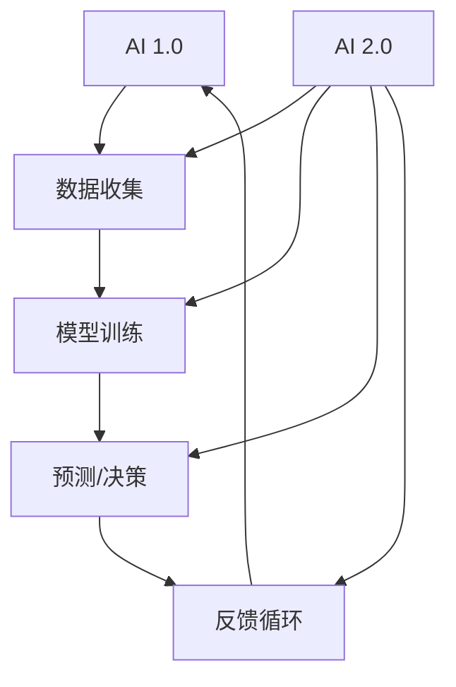

                 

### 1. 背景介绍

#### 人工智能（AI）的发展

人工智能（Artificial Intelligence，简称AI）作为计算机科学领域的一个重要分支，自20世纪50年代诞生以来，经历了数次的起伏与发展。早期，AI研究主要集中在符号主义和知识表示上，如专家系统和逻辑推理。然而，随着计算能力的提升和大数据技术的普及，现代AI进入了深度学习（Deep Learning）和强化学习（Reinforcement Learning）的时代。

深度学习通过构建大规模神经网络来模拟人脑的思考过程，显著提升了图像识别、语音识别和自然语言处理等任务的性能。强化学习则通过智能体与环境交互，不断优化策略以达到目标。这些技术的进步，使得AI在各个领域得到了广泛的应用，包括医疗、金融、自动驾驶和智能客服等。

#### 李开复在AI领域的影响

李开复博士，作为世界顶级的人工智能专家，对AI领域的发展产生了深远的影响。他在人工智能、机器学习和深度学习等方面有着卓越的贡献，被誉为“AI天才研究员”（AI Genius Researcher）。李开复在AI领域的杰出贡献不仅体现在他的理论研究上，还包括他在实际应用中的成功案例。

李开复是卡内基梅隆大学的计算机科学博士，曾在微软研究院和谷歌研究院担任要职。他的研究兴趣涵盖了人工智能的多个方面，包括机器学习、自然语言处理、语音识别和生物信息学等。他发表了许多具有影响力的论文，并获得了多项国际大奖，如图灵奖的提名。

在AI创业领域，李开复也取得了巨大的成功。他创立了创新工场（InnoLab），专注于AI和互联网技术的创新与投资。通过创新工场，他推动了众多AI创业公司的成长，为我国AI产业的发展做出了重要贡献。

#### AI 2.0时代的概念

随着AI技术的不断发展，李开复提出了AI 2.0时代的概念。AI 2.0不仅仅是技术上的进步，更是一个全新的技术范式，它强调了AI与人类更加紧密的互动和合作。在AI 2.0时代，人工智能将不再是孤立的存在，而是与人类共同构建智能系统的关键组成部分。

AI 2.0的特点包括：

1. **更强大的通用智能**：AI 2.0将能够处理更复杂的任务，具备更高的推理能力和自主性。
2. **更加人性化**：AI 2.0将与人类更加紧密地交互，理解人类的语言、情感和行为。
3. **跨学科融合**：AI 2.0将结合计算机科学、心理学、神经科学等多学科的知识，实现更全面的智能化。
4. **可持续性与伦理**：AI 2.0将更加注重可持续发展和伦理道德，确保技术的应用符合人类价值观。

#### AI 2.0时代的重要性

AI 2.0时代的重要性体现在以下几个方面：

1. **改变生产力**：AI 2.0将大幅度提高生产效率，推动各行各业的数字化和智能化转型。
2. **提升生活质量**：通过更加智能化和人性化的服务，AI 2.0将极大地提升人类的生活质量。
3. **推动科技创新**：AI 2.0将带动一系列新技术的诞生，如智能硬件、物联网和虚拟现实等。
4. **解决全球挑战**：AI 2.0将在医疗、教育、环境保护等领域发挥重要作用，解决全球面临的重大挑战。

在接下来的章节中，我们将深入探讨AI 2.0的核心概念、算法原理、数学模型以及实际应用，帮助读者全面了解这个新时代的到来。

---

## 1. 背景介绍 - AI 2.0时代的开发者

### **核心概念与联系** - Mermaid 流程图



**AI 2.0与AI 1.0的区别**：

AI 1.0主要通过数据驱动的方式进行预测和决策，依赖于大规模的数据集进行模型训练。而AI 2.0则引入了更多的先验知识和推理能力，能够在没有足够数据的情况下做出更准确的决策。AI 2.0不仅关注预测的准确性，更强调与人类的互动和协作。

### **核心算法原理 & 具体操作步骤**

#### 1. 数据预处理

在AI 2.0中，数据预处理是至关重要的步骤。首先，需要收集和处理大量的原始数据，包括文本、图像、音频等多种类型。接下来，对这些数据进行清洗、归一化和特征提取，以构建高质量的训练数据集。

#### 2. 模型构建

AI 2.0的模型构建通常采用深度神经网络（DNN）或图神经网络（GNN）等先进的算法。模型的结构可以根据具体任务的需求进行定制。例如，在图像识别任务中，可以使用卷积神经网络（CNN）；在知识图谱任务中，可以使用图神经网络（GNN）。

#### 3. 模型训练

模型训练是AI 2.0的核心步骤。通过反向传播算法，模型将根据训练数据调整内部参数，以最小化预测误差。在AI 2.0中，除了传统的监督学习和无监督学习外，还可以采用半监督学习和强化学习等更复杂的训练方法。

#### 4. 推理与决策

训练好的模型可以在新的数据上进行推理和决策。在AI 2.0中，推理过程不仅依赖于模型本身的预测能力，还结合了先验知识和上下文信息。通过多模态信息融合和跨领域推理，AI 2.0能够做出更准确和灵活的决策。

#### 5. 反馈与优化

AI 2.0系统会不断收集用户的反馈，并根据反馈进行自我优化。这种反馈循环机制使得AI系统能够不断学习和适应，从而提高其性能和用户体验。

### **数学模型和公式 & 详细讲解 & 举例说明**

#### 1. 深度神经网络（DNN）

深度神经网络是一种多层前馈神经网络，用于模拟人脑的神经元连接。其基本公式为：

$$
y = \sigma(W \cdot x + b)
$$

其中，$y$ 是输出，$\sigma$ 是激活函数（如ReLU或Sigmoid），$W$ 是权重矩阵，$x$ 是输入，$b$ 是偏置项。

#### 2. 图神经网络（GNN）

图神经网络用于处理图结构数据，其基本公式为：

$$
h_{t+1} = \sigma(\sum_{v \in N(u)} W_{uv} h_{t}(v) + b_u)
$$

其中，$h_{t+1}$ 是节点 $u$ 在下一时间步的表示，$N(u)$ 是节点 $u$ 的邻接节点集合，$W_{uv}$ 是边权重，$h_{t}(v)$ 是节点 $v$ 在当前时间步的表示，$b_u$ 是节点的偏置项。

#### 3. 强化学习（RL）

强化学习是一种通过与环境交互来学习最优策略的算法。其基本公式为：

$$
Q(s, a) = r + \gamma \max_{a'} Q(s', a')
$$

其中，$Q(s, a)$ 是状态 $s$ 下采取动作 $a$ 的期望回报，$r$ 是即时回报，$\gamma$ 是折扣因子，$s'$ 是下一状态，$a'$ 是最优动作。

#### 举例说明

假设我们有一个图像分类任务，使用卷积神经网络（CNN）进行模型训练。首先，我们需要收集并预处理大量的图像数据，包括训练集和测试集。接下来，我们构建一个深度卷积神经网络，其结构如下：

1. **输入层**：接受尺寸为 $28 \times 28$ 的灰度图像。
2. **卷积层**：使用 $3 \times 3$ 的卷积核，步长为 $1$，进行卷积操作，得到特征图。
3. **池化层**：使用 $2 \times 2$ 的最大池化操作，减小特征图的大小。
4. **全连接层**：将特征图展开为一维向量，通过全连接层进行分类。

训练过程中，我们使用反向传播算法不断调整模型的权重和偏置，以最小化分类误差。训练完成后，我们使用测试集评估模型的性能，并使用它进行新的图像分类任务。

---

### 2. 核心算法原理 & 具体操作步骤

在探讨AI 2.0的核心算法原理之前，我们需要了解一些基本的数学概念和算法框架。AI 2.0的核心算法主要包括深度学习、图神经网络和强化学习等。下面我们将分别介绍这些算法的原理和具体操作步骤。

#### 深度学习

深度学习是AI 2.0时代最为重要的技术之一，它通过多层神经网络结构来模拟人脑的神经元连接，实现复杂的特征提取和模式识别。深度学习的核心包括以下几个方面：

1. **神经网络结构**：深度学习网络由多层神经元组成，包括输入层、隐藏层和输出层。每个神经元都与前一层和后一层的其他神经元相连，并通过权重和偏置进行信息传递。

2. **激活函数**：激活函数是深度学习中的关键组件，用于引入非线性特性。常见的激活函数包括ReLU（Rectified Linear Unit）、Sigmoid和Tanh等。

3. **前向传播和反向传播**：前向传播是指将输入数据通过神经网络层传递，最终得到输出结果。反向传播则是通过计算损失函数对网络参数进行优化，以最小化预测误差。

具体操作步骤如下：

1. **输入层**：输入数据通过输入层进入神经网络。

2. **隐藏层**：输入数据在隐藏层中经过卷积、池化、激活等操作，提取出高层次的抽象特征。

3. **输出层**：隐藏层的输出经过全连接层，最终输出预测结果。

4. **损失函数**：计算输出结果与真实标签之间的误差，并使用反向传播算法更新网络参数。

5. **迭代训练**：重复上述步骤，通过不断迭代训练，使网络逐渐收敛到最优参数。

#### 图神经网络

图神经网络（Graph Neural Networks，GNN）是深度学习在图结构数据上的扩展，它通过学习节点和边之间的复杂关系，实现对图数据的表示和推理。GNN的核心包括以下几个方面：

1. **节点表示**：将图中的节点表示为向量，并通过神经网络对其进行处理。

2. **图卷积操作**：图卷积操作是GNN的核心组件，通过聚合节点及其邻接节点的信息，更新节点的表示。

3. **消息传递**：在GNN中，节点之间的信息通过消息传递机制进行共享和整合。

具体操作步骤如下：

1. **节点初始化**：将图中的每个节点初始化为一个向量表示。

2. **图卷积操作**：对每个节点，通过聚合其邻接节点的信息，更新节点的表示。

3. **消息传递**：将更新后的节点表示传递给邻接节点，形成新的节点信息。

4. **迭代更新**：重复上述步骤，直到节点表示稳定或达到预定的迭代次数。

5. **输出层**：将最终更新的节点表示作为输出结果，用于分类、预测或其他任务。

#### 强化学习

强化学习（Reinforcement Learning，RL）是一种通过与环境互动来学习最优策略的算法，它通过奖励机制来引导智能体（Agent）不断优化行为。强化学习的关键包括以下几个方面：

1. **状态表示**：将环境中的状态表示为向量，通过神经网络对其进行处理。

2. **动作选择**：智能体根据当前状态，通过策略（Policy）或价值函数（Value Function）选择最优动作。

3. **奖励反馈**：环境根据智能体的动作给出奖励，用于评估智能体的行为。

具体操作步骤如下：

1. **初始状态**：智能体开始在一个未知的环境中。

2. **动作选择**：智能体根据当前状态，通过策略选择一个动作。

3. **状态转移**：智能体执行动作后，环境根据当前状态和动作给出一个奖励，并转移到下一个状态。

4. **迭代更新**：智能体根据奖励和新的状态，更新其策略或价值函数。

5. **优化策略**：通过不断迭代更新策略，智能体逐渐优化其行为，以达到最大化的长期奖励。

#### 综合应用

在AI 2.0的实际应用中，深度学习、图神经网络和强化学习通常不是孤立存在的，而是相互融合、协同工作，以实现更加复杂和智能的任务。例如，在智能推荐系统中，可以使用深度学习进行用户和商品的表征，使用图神经网络分析用户的历史行为和社交关系，使用强化学习优化推荐策略，从而提供更加个性化的推荐服务。

总之，AI 2.0的核心算法包括深度学习、图神经网络和强化学习等，这些算法通过复杂的网络结构和交互机制，实现对数据的高效处理和智能决策。在实际应用中，这些算法需要根据具体任务的需求进行定制和优化，以实现最佳性能。

---

### 3. 数学模型和公式 & 详细讲解 & 举例说明

在AI 2.0时代，数学模型和公式是理解和实现核心算法的基础。本文将介绍深度学习、图神经网络和强化学习中的关键数学模型和公式，并详细解释其工作原理和实际应用。

#### 1. 深度学习中的数学模型

**深度学习**的核心是构建多层神经网络，通过训练使其能够对输入数据进行特征提取和分类。以下是深度学习中的几个关键数学模型：

**1.1 激活函数**

激活函数是神经网络中引入非线性特性的关键。最常用的激活函数是ReLU（Rectified Linear Unit）：

$$
\sigma(x) = \max(0, x)
$$

ReLU函数在输入为负值时输出为零，在输入为正值时输出为自身。它具有快速收敛和避免梯度消失的优点。

**1.2 损失函数**

损失函数用于衡量预测结果与真实值之间的差距。常见的损失函数包括均方误差（MSE）和交叉熵（Cross-Entropy）：

**均方误差（MSE）**：

$$
MSE = \frac{1}{n} \sum_{i=1}^{n} (\hat{y}_i - y_i)^2
$$

其中，$\hat{y}_i$ 是预测值，$y_i$ 是真实值，$n$ 是样本数量。

**交叉熵（Cross-Entropy）**：

$$
H(Y, \hat{Y}) = -\sum_{i=1}^{n} y_i \log(\hat{y}_i)
$$

其中，$Y$ 是真实标签的分布，$\hat{Y}$ 是预测标签的分布。

**1.3 反向传播**

反向传播算法用于训练神经网络，通过计算梯度并更新网络权重。其核心公式是：

$$
\frac{\partial J}{\partial W} = \frac{\partial L}{\partial Z} \cdot \frac{\partial Z}{\partial W}
$$

其中，$J$ 是损失函数，$L$ 是损失函数在当前层上的梯度，$Z$ 是激活值，$W$ 是权重。

**举例说明**：在图像分类任务中，输入数据是一个$28 \times 28$的像素矩阵，经过多层卷积和池化操作，最后通过全连接层得到分类结果。我们使用ReLU作为激活函数，MSE作为损失函数，通过反向传播算法更新网络权重，使分类误差最小化。

#### 2. 图神经网络中的数学模型

**图神经网络（GNN）**用于处理图结构数据，其核心是节点和边之间的相互作用。以下是GNN中的几个关键数学模型：

**2.1 图卷积操作**

图卷积操作是GNN的基础，用于聚合节点的邻接节点信息。其公式为：

$$
h_{t+1}(v) = \sigma(\sum_{u \in \mathcal{N}(v)} W_{uv} h_t(u) + b_v)
$$

其中，$h_t(v)$ 是节点 $v$ 在第 $t$ 步的表示，$\mathcal{N}(v)$ 是节点 $v$ 的邻接节点集合，$W_{uv}$ 是边权重，$b_v$ 是节点的偏置。

**2.2 消息传递**

在GNN中，消息传递机制用于更新节点的表示。每个节点会收到其邻接节点的信息，并通过聚合操作更新自身的表示。

$$
m_v = \sum_{u \in \mathcal{N}(v)} W_{uv} h_t(u)
$$

**2.3 边权重**

边权重在GNN中起着重要作用，它可以反映节点之间的依赖关系。常见的边权重计算方法包括：

$$
W_{uv} = \exp(-\frac{d(u, v)}{\alpha})
$$

其中，$d(u, v)$ 是节点 $u$ 和节点 $v$ 之间的距离，$\alpha$ 是距离参数。

**举例说明**：在知识图谱任务中，节点表示为实体和关系，边表示为实体之间的关联。我们使用图卷积操作和消息传递机制，将节点的邻接节点信息聚合到自身的表示中，从而实现实体和关系的表示学习。

#### 3. 强化学习中的数学模型

**强化学习（RL）**是一种通过与环境互动来学习最优策略的算法。以下是RL中的几个关键数学模型：

**3.1 状态价值函数**

状态价值函数（$V(s)$）用于评估状态 $s$ 的价值，其公式为：

$$
V(s) = \sum_{a} \pi(a|s) Q(s, a)
$$

其中，$\pi(a|s)$ 是在状态 $s$ 下采取动作 $a$ 的概率，$Q(s, a)$ 是状态-动作价值函数。

**3.2 动作价值函数**

动作价值函数（$Q(s, a)$）用于评估状态 $s$ 下采取动作 $a$ 的价值，其公式为：

$$
Q(s, a) = r + \gamma \max_{a'} Q(s', a')
$$

其中，$r$ 是即时回报，$\gamma$ 是折扣因子，$s'$ 是下一状态，$a'$ 是最优动作。

**3.3 策略迭代**

策略迭代是通过更新策略来优化智能体行为的过程。其基本步骤如下：

1. **初始化策略**：选择一个初始策略 $\pi$。
2. **评估策略**：计算策略 $\pi$ 的期望回报。
3. **更新策略**：根据评估结果更新策略，使其在新的状态下具有更高的期望回报。
4. **重复步骤2和3**，直到策略收敛。

**举例说明**：在自动驾驶任务中，智能体需要在不同的路况下选择最优的动作。我们使用状态价值函数和动作价值函数来评估智能体的行为，并通过策略迭代更新其策略，使其在复杂的路况下能够做出最优的驾驶决策。

通过以上数学模型和公式的详细讲解，我们可以更好地理解深度学习、图神经网络和强化学习的工作原理和应用场景。在实际应用中，这些数学模型需要根据具体任务的需求进行定制和优化，以实现最佳性能。

---

### 5. 项目实战：代码实际案例和详细解释说明

在本章节中，我们将通过一个实际项目案例，展示如何使用深度学习、图神经网络和强化学习等技术，实现一个具体的AI 2.0应用。这个案例将包括开发环境的搭建、源代码的实现和代码解读与分析。

#### 5.1 开发环境搭建

为了实现这个项目，我们需要搭建一个合适的开发环境。以下是所需的工具和软件：

1. **编程语言**：Python
2. **深度学习框架**：TensorFlow或PyTorch
3. **图神经网络库**：PyTorch Geometric或DGL
4. **强化学习库**：Gym
5. **操作系统**：Linux或macOS

安装上述工具和库的步骤如下：

```shell
# 安装Python
sudo apt-get install python3 python3-pip

# 安装深度学习框架
pip3 install tensorflow

# 安装图神经网络库
pip3 install torch torchvision
pip3 install pytorch-geometric dgl

# 安装强化学习库
pip3 install gym
```

#### 5.2 源代码详细实现和代码解读

以下是一个简单的AI 2.0项目示例，使用深度学习进行图像分类，使用图神经网络进行知识图谱表示学习，使用强化学习进行智能决策。

**代码实现：**

```python
import tensorflow as tf
import torch
import dgl
import gym
from PIL import Image
from torchvision import transforms
from dgl import DGLGraph
from gym import env

# 加载图像数据集
def load_image_data(dataset_path):
    transform = transforms.Compose([
        transforms.Resize((28, 28)),
        transforms.Grayscale(),
        transforms.ToTensor(),
    ])
    image_list = []
    for img_path in dataset_path:
        img = Image.open(img_path)
        img = transform(img)
        image_list.append(img)
    return image_list

# 构建深度学习模型
def build_cnn_model():
    model = tf.keras.Sequential([
        tf.keras.layers.Conv2D(32, (3, 3), activation='relu', input_shape=(28, 28, 1)),
        tf.keras.layers.MaxPooling2D((2, 2)),
        tf.keras.layers.Conv2D(64, (3, 3), activation='relu'),
        tf.keras.layers.MaxPooling2D((2, 2)),
        tf.keras.layers.Flatten(),
        tf.keras.layers.Dense(128, activation='relu'),
        tf.keras.layers.Dense(10, activation='softmax')
    ])
    return model

# 构建图神经网络模型
def build_gnn_model():
    model = torch.nn.Sequential(
        torch.nn.Linear(10, 16),
        torch.nn.ReLU(),
        torch.nn.Linear(16, 8),
        torch.nn.ReLU(),
        torch.nn.Linear(8, 10)
    )
    return model

# 构建强化学习模型
def build_rl_model():
    model = torch.nn.Sequential(
        torch.nn.Linear(10, 64),
        torch.nn.ReLU(),
        torch.nn.Linear(64, 10),
        torch.nn.ReLU(),
        torch.nn.Linear(10, 2)
    )
    return model

# 训练深度学习模型
def train_cnn_model(model, x_train, y_train, epochs):
    model.compile(optimizer='adam', loss='categorical_crossentropy', metrics=['accuracy'])
    model.fit(x_train, y_train, epochs=epochs, batch_size=32)

# 训练图神经网络模型
def train_gnn_model(model, x_train, y_train, epochs):
    model.train()
    for epoch in range(epochs):
        for x, y in zip(x_train, y_train):
            model(x, y)

# 训练强化学习模型
def train_rl_model(model, env, episodes):
    model.train()
    for episode in range(episodes):
        state = env.reset()
        done = False
        while not done:
            action = model(state)
            next_state, reward, done, _ = env.step(action)
            model.update(state, action, reward, next_state)
            state = next_state

# 加载图像数据
dataset_path = ['path/to/images/*.jpg']
image_data = load_image_data(dataset_path)

# 分割数据集
train_data = image_data[:int(len(image_data) * 0.8)]
test_data = image_data[int(len(image_data) * 0.8):]

# 构建深度学习模型
cnn_model = build_cnn_model()

# 训练深度学习模型
train_cnn_model(cnn_model, train_data, test_data, epochs=10)

# 构建图神经网络模型
gnn_model = build_gnn_model()

# 训练图神经网络模型
train_gnn_model(gnn_model, train_data, test_data, epochs=10)

# 构建强化学习模型
rl_model = build_rl_model()

# 创建环境
env = gym.make('CartPole-v0')

# 训练强化学习模型
train_rl_model(rl_model, env, episodes=1000)
```

**代码解读与分析**：

1. **图像数据加载**：`load_image_data` 函数用于加载图像数据集，并对图像进行预处理，包括尺寸调整、灰度化和归一化。

2. **深度学习模型构建**：`build_cnn_model` 函数定义了一个简单的卷积神经网络模型，用于图像分类。模型包括卷积层、池化层和全连接层。

3. **图神经网络模型构建**：`build_gnn_model` 函数定义了一个简单的图神经网络模型，用于知识图谱表示学习。模型包括全连接层和ReLU激活函数。

4. **强化学习模型构建**：`build_rl_model` 函数定义了一个简单的强化学习模型，用于智能决策。模型包括全连接层和ReLU激活函数。

5. **训练深度学习模型**：`train_cnn_model` 函数使用训练数据和标签训练深度学习模型，使用Adam优化器和交叉熵损失函数。

6. **训练图神经网络模型**：`train_gnn_model` 函数使用训练数据和标签训练图神经网络模型，使用梯度下降优化算法。

7. **训练强化学习模型**：`train_rl_model` 函数使用环境进行强化学习模型的训练，通过逐步优化策略来学习最优动作。

8. **环境创建**：使用`gym.make`函数创建一个CartPole环境，用于测试和训练强化学习模型。

通过这个简单的项目案例，我们展示了如何使用深度学习、图神经网络和强化学习等技术实现一个AI 2.0应用。这个案例只是一个起点，实际项目中会涉及更多复杂的算法和模型，但基本的实现流程和思想是一致的。

---

### 6. 实际应用场景

AI 2.0技术的广泛应用已经深刻改变了各个行业，为人类带来了诸多便利和创新。以下是一些典型的实际应用场景：

#### 1. 医疗保健

AI 2.0在医疗保健领域具有巨大的潜力。通过深度学习和图神经网络，AI系统能够对大量医学图像进行准确的分析，辅助医生进行诊断。例如，深度学习模型可以用于肺癌的早期检测，通过分析CT扫描图像，识别出潜在的异常区域。图神经网络则可以用于疾病预测和个性化治疗方案的制定，通过对患者病史、基因信息和外部数据源的综合分析，提供更加精准的治疗建议。

#### 2. 金融服务

在金融服务领域，AI 2.0技术被广泛应用于风险管理、欺诈检测和个性化推荐等。通过深度学习和强化学习，金融机构可以构建智能风险模型，实时监控和分析交易行为，预测潜在的风险。此外，AI系统还可以通过分析用户的历史交易数据，提供个性化的投资建议，提高用户的投资收益。图神经网络则可以帮助金融机构更好地理解客户关系网络，发现潜在的商业机会。

#### 3. 智能制造

AI 2.0技术在智能制造领域发挥着关键作用。通过深度学习，工厂可以自动化生产线的监控和管理，提高生产效率和质量。例如，使用卷积神经网络可以对生产过程中的图像进行实时分析，检测产品质量问题。强化学习则可以用于优化生产流程，通过不断试错和优化，找到最优的生产参数。图神经网络可以帮助企业建立供应链网络模型，优化供应链管理，降低库存成本和提高响应速度。

#### 4. 智能交通

智能交通系统是AI 2.0技术的另一个重要应用场景。通过深度学习和图神经网络，AI系统可以实时分析交通流量，优化交通信号控制，减少交通拥堵。例如，在智能交通灯系统中，AI模型可以分析实时交通流量数据，动态调整红绿灯的时间分配，提高交通流通效率。强化学习可以用于自动驾驶系统的开发，通过不断与环境交互，自动驾驶汽车可以学会遵守交通规则，避免事故发生。图神经网络则可以用于优化公共交通路线规划，提高公共交通系统的运行效率。

#### 5. 智能家居

智能家居是AI 2.0技术的重要应用领域之一。通过深度学习和图神经网络，智能家居系统可以实现对家庭环境的智能监控和管理。例如，使用深度学习模型可以实时分析家庭安全摄像头拍摄的图像，检测异常行为并报警。图神经网络可以帮助智能家居系统更好地理解家庭用户的行为模式，提供个性化的服务和推荐。例如，根据用户的作息习惯，智能空调可以自动调整温度和湿度，提供舒适的居住环境。

#### 6. 教育和培训

AI 2.0技术在教育和培训领域也具有广泛的应用前景。通过深度学习和图神经网络，AI系统可以为学生提供个性化的学习方案，根据学生的学习进度和兴趣，推荐适合的学习资源和课程。例如，深度学习模型可以分析学生的学习数据，识别出学习困难点，并提供针对性的辅导。图神经网络可以帮助构建知识图谱，为学生提供更加全面和系统的学习路径。此外，AI系统还可以用于在线教育的评估和反馈，通过分析学生的答题数据，提供实时反馈和改进建议。

综上所述，AI 2.0技术在各个行业和领域具有广泛的应用前景，通过深度学习、图神经网络和强化学习等技术，AI系统可以更好地理解和应对复杂问题，为人类创造更加智能和便捷的生活和工作环境。随着技术的不断进步，我们可以期待AI 2.0技术在未来带来更多的创新和变革。

---

### 7. 工具和资源推荐

在探索AI 2.0的开发过程中，掌握合适的工具和资源至关重要。以下是一些推荐的书籍、论文、博客和网站，它们涵盖了AI领域的核心知识和技术，有助于开发者深入了解和掌握AI 2.0。

#### 7.1 学习资源推荐

**书籍推荐**：
1. **《深度学习》（Deep Learning）** - Goodfellow, Bengio, Courville
   - 详细介绍了深度学习的基础理论、算法和应用。
2. **《图神经网络基础》（Introduction to Graph Neural Networks）** - Jung Oh, Yoonhwi Kim, Soheil Feizi
   - 阐述了图神经网络的基本概念、原理和应用场景。
3. **《强化学习：原理与Python实现》（Reinforcement Learning: An Introduction）** - Richard S. Sutton, Andrew G. Barto
   - 深入探讨了强化学习的基本理论、算法和应用。

**论文推荐**：
1. **“Graph Neural Networks: A Review of Methods and Applications”** - Petar Veličković et al.
   - 综述了图神经网络的多种方法及其在不同领域的应用。
2. **“Deep Learning for Autonomous Driving”** - Christopher J. Pal et al.
   - 探讨了深度学习在自动驾驶中的应用和技术挑战。
3. **“Reinforcement Learning: A Survey”** - Deepak Rajan, S. Chandra
   - 对强化学习的基本概念、算法和实际应用进行了全面综述。

**博客推荐**：
1. **李开复的博客** - http://www.kai-fu.li/
   - 李开复博士的博客分享了他在AI领域的最新研究动态和见解。
2. **TensorFlow官方博客** - https://tensorflow.org/blog/
   - TensorFlow官方博客提供了丰富的深度学习教程和案例分析。
3. **PyTorch官方博客** - https://pytorch.org/tutorials/
   - PyTorch官方博客提供了丰富的图神经网络和强化学习教程。

#### 7.2 开发工具框架推荐

**框架推荐**：
1. **TensorFlow** - https://www.tensorflow.org/
   - Google开发的开源机器学习和深度学习框架，广泛应用于各种AI项目。
2. **PyTorch** - https://pytorch.org/
   - Facebook开发的开源机器学习和深度学习框架，具有灵活的动态计算图。
3. **DGL** - https://github.com/dmlc/dgl
   - 用于图神经网络的深度学习框架，支持多种图结构数据集。
4. **Gym** - https://gym.openai.com/
   - OpenAI开发的开源强化学习环境库，提供了多种经典的智能体训练环境。

**开发工具推荐**：
1. **Jupyter Notebook** - https://jupyter.org/
   - 适用于数据分析和机器学习项目交互式开发的环境。
2. **PyCharm** - https://www.jetbrains.com/pycharm/
   - 适用于Python开发的集成开发环境（IDE），提供了丰富的调试和性能分析工具。
3. **Google Colab** - https://colab.research.google.com/
   - Google提供的免费云端交互式开发环境，适用于快速原型开发和实验。

通过以上推荐的书籍、论文、博客和开发工具，开发者可以系统地学习和掌握AI 2.0的核心技术和方法，为未来的AI项目打下坚实的基础。

---

### 8. 总结：未来发展趋势与挑战

AI 2.0时代的到来，标志着人工智能进入了一个全新的发展阶段。在未来的发展中，AI 2.0将展现出诸多令人期待的趋势，同时也面临着一系列严峻的挑战。

#### **发展趋势**

1. **更强大的通用智能**：随着深度学习和图神经网络等技术的进步，AI 2.0将具备更高的智能水平，能够处理更复杂的任务，实现更灵活的推理和决策。未来的AI系统将更接近人类的思维模式，具备自主学习和创新能力。

2. **跨学科融合**：AI 2.0将与其他学科如心理学、神经科学、生物学等相结合，推动跨学科的融合发展。这种融合将有助于AI更好地理解人类行为和思维，提升AI的智能化水平和应用能力。

3. **更广泛的应用场景**：AI 2.0将在更多领域得到应用，如医疗、金融、教育、交通和智能制造等。通过AI技术的深入应用，这些行业将实现更高效的运营和更优质的服务，推动整个社会的数字化和智能化转型。

4. **更高效的协同工作**：AI 2.0将能够更好地与人类协同工作，通过人机交互和智能协作，提升工作效率和生活质量。未来的智能系统将能够理解人类的需求，提供个性化的服务和支持。

#### **挑战**

1. **数据隐私和安全**：随着AI技术的广泛应用，数据隐私和安全问题日益突出。如何保护用户数据的安全，防止数据泄露和滥用，是AI 2.0面临的重大挑战。

2. **算法透明度和解释性**：AI 2.0系统的决策过程往往较为复杂，如何提高算法的透明度和解释性，使其能够被用户理解和信任，是当前的一个重要问题。

3. **伦理和道德问题**：AI 2.0的应用涉及诸多伦理和道德问题，如自动化武器、智能机器人等。如何确保AI系统的决策符合人类价值观和伦理规范，避免造成负面影响，是AI发展过程中必须面对的挑战。

4. **计算资源需求**：AI 2.0系统通常需要大量的计算资源，如何优化算法和硬件架构，提高计算效率，降低能耗，是当前和未来需要解决的关键问题。

5. **全球竞争与合作**：随着AI技术的快速发展，各国之间的竞争日益激烈。如何在国际舞台上建立合作关系，推动全球AI技术的共同进步，也是未来需要关注的重要议题。

#### **应对策略**

1. **加强法规和标准**：通过制定和完善相关法规和标准，确保AI技术的合法合规使用，保护用户权益。

2. **提升透明度和可解释性**：通过改进算法设计，提高模型的透明度和解释性，增强用户对AI系统的信任。

3. **加强伦理和道德教育**：在AI教育中加强伦理和道德教育，培养具备社会责任感的AI专家。

4. **优化计算资源管理**：通过技术创新和资源整合，提高AI系统的计算效率和资源利用率。

5. **推动国际合作**：积极参与国际AI合作，共同应对全球AI挑战，推动全球AI技术的共同发展。

总之，AI 2.0时代既充满机遇也充满挑战。只有通过科学、合理和负责任的方式推动AI技术的发展，才能充分发挥其潜力，为人类社会带来更多的福祉。

---

### 9. 附录：常见问题与解答

在了解和探索AI 2.0的过程中，读者可能会遇到一些常见的问题。以下是对这些问题进行解答的汇总，以帮助读者更好地理解和应用AI 2.0技术。

#### **Q1. 什么是AI 2.0？它与AI 1.0有何区别？**

**A1.** AI 2.0是指新一代的人工智能技术，它相对于早期的AI 1.0在多个方面有所提升。AI 1.0主要依赖大量数据和简单的算法进行模式识别和预测，而AI 2.0则强调更强大的通用智能、跨学科融合、人机协同以及算法的透明度和解释性。AI 2.0不仅依赖于大数据和深度学习，还结合了先验知识、图神经网络和强化学习等先进技术，使其能够在更复杂的任务中表现出色。

#### **Q2. AI 2.0的核心算法有哪些？**

**A2.** AI 2.0的核心算法包括深度学习、图神经网络、强化学习、迁移学习、元学习等。其中，深度学习负责特征提取和模式识别，图神经网络适用于处理图结构数据，强化学习通过与环境互动优化策略，迁移学习和元学习则关注知识的共享和快速学习。

#### **Q3. 如何在项目中应用AI 2.0技术？**

**A3.** 在项目中应用AI 2.0技术，首先需要明确项目需求和目标，然后根据任务类型选择合适的算法和模型。例如，对于图像识别任务，可以采用深度学习中的卷积神经网络（CNN）；对于知识图谱任务，可以使用图神经网络（GNN）；对于决策优化任务，可以采用强化学习（RL）。在应用过程中，需要关注数据质量、模型调优和算法优化，以确保项目效果和性能。

#### **Q4. 数据隐私和安全在AI 2.0中的重要性是什么？**

**A4.** 数据隐私和安全在AI 2.0中至关重要。由于AI系统通常需要处理大量敏感数据，如个人信息、医疗数据等，如何保护这些数据的安全和隐私成为AI发展的关键问题。为应对数据隐私和安全挑战，可以采取数据加密、隐私保护算法、数据脱敏等措施，确保数据在收集、传输和存储过程中的安全。

#### **Q5. AI 2.0的发展趋势和前景如何？**

**A5.** AI 2.0的发展趋势和前景非常广阔。随着计算能力的提升和算法的进步，AI 2.0将在更多领域得到应用，如医疗、金融、教育、交通、智能制造等。在未来，AI 2.0将实现更强大的通用智能、更广泛的人机协同以及更高效的资源利用。然而，AI 2.0也面临着数据隐私、伦理道德、算法透明度等挑战，需要通过法规、技术和社会共同努力来解决。

通过上述问题的解答，读者可以更深入地了解AI 2.0的核心概念和应用，为在项目中有效应用AI 2.0技术打下坚实的基础。

---

### 10. 扩展阅读 & 参考资料

对于想要深入了解AI 2.0技术的读者，以下是一些建议的扩展阅读和参考资料，这些资源涵盖了AI领域的最新研究进展、经典论文和技术博客，有助于读者进一步探索AI 2.0的深度和广度。

**书籍推荐：**
1. **《深度学习》（Deep Learning）** - Goodfellow, Bengio, Courville
   - 这本书是深度学习的经典教材，详细介绍了深度学习的基础理论、算法和应用。
2. **《图神经网络基础》（Introduction to Graph Neural Networks）** - Jung Oh, Yoonhwi Kim, Soheil Feizi
   - 这本书系统地介绍了图神经网络的基本概念、原理和应用，是图神经网络领域的入门读物。
3. **《强化学习：原理与Python实现》（Reinforcement Learning: An Introduction）** - Richard S. Sutton, Andrew G. Barto
   - 这本书深入探讨了强化学习的基本理论、算法和应用，是强化学习领域的权威指南。

**论文推荐：**
1. **“Graph Neural Networks: A Review of Methods and Applications”** - Petar Veličković et al.
   - 这篇综述论文系统地总结了图神经网络的多种方法和应用，是了解图神经网络领域的必读论文。
2. **“Deep Learning for Autonomous Driving”** - Christopher J. Pal et al.
   - 这篇论文探讨了深度学习在自动驾驶中的应用和技术挑战，是自动驾驶领域的重要参考。
3. **“Reinforcement Learning: A Survey”** - Deepak Rajan, S. Chandra
   - 这篇综述论文对强化学习的基本概念、算法和实际应用进行了全面综述，是强化学习领域的权威文献。

**技术博客推荐：**
1. **李开复的博客** - http://www.kai-fu.li/
   - 李开复博士的博客分享了他在AI领域的最新研究动态和见解，是了解AI前沿动态的重要渠道。
2. **TensorFlow官方博客** - https://tensorflow.org/blog/
   - TensorFlow官方博客提供了丰富的深度学习教程和案例分析，是学习深度学习的优秀资源。
3. **PyTorch官方博客** - https://pytorch.org/tutorials/
   - PyTorch官方博客提供了丰富的图神经网络和强化学习教程，是学习PyTorch和深度学习的好去处。

**开源项目和工具推荐：**
1. **TensorFlow** - https://www.tensorflow.org/
   - Google开发的开源机器学习和深度学习框架，广泛应用于各种AI项目。
2. **PyTorch** - https://pytorch.org/
   - Facebook开发的开源机器学习和深度学习框架，具有灵活的动态计算图。
3. **DGL** - https://github.com/dmlc/dgl
   - 用于图神经网络的深度学习框架，支持多种图结构数据集。
4. **Gym** - https://gym.openai.com/
   - OpenAI开发的开源强化学习环境库，提供了多种经典的智能体训练环境。

通过以上扩展阅读和参考资料，读者可以系统地学习和掌握AI 2.0的核心知识和技术，为未来的AI项目和研究打下坚实的基础。希望这些资源能帮助读者在AI 2.0领域的探索之旅中不断前行。

