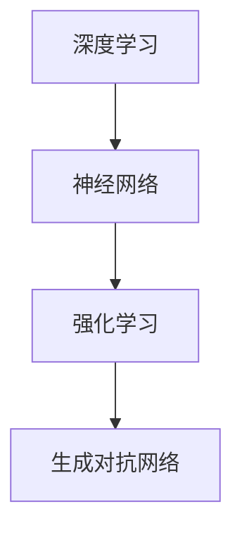

                 

# 李开复：AI 2.0 时代的意义

> 关键词：人工智能，AI 2.0，时代变革，技术发展，未来展望

> 摘要：本文将深入探讨AI 2.0时代的到来及其深远意义。通过分析AI 2.0的定义、核心技术、应用场景以及未来发展趋势，本文旨在为读者揭示人工智能技术对未来社会发展的重要影响，并探讨其中所面临的挑战。

## 1. 背景介绍

随着计算机科学和人工智能技术的飞速发展，人类迎来了AI 2.0时代。AI 2.0，即第二代人工智能，相较于第一代人工智能（AI 1.0），在技术层面有着显著的提升。AI 1.0主要依赖于预定义的规则和符号逻辑，而AI 2.0则利用深度学习和神经网络等机器学习技术，实现更为复杂和灵活的智能行为。本文将从以下几个方面展开讨论：

- AI 2.0的定义与核心技术
- AI 2.0时代的意义
- AI 2.0的应用场景
- AI 2.0的未来发展趋势与挑战

## 2. 核心概念与联系

### AI 2.0的定义

AI 2.0，即第二代人工智能，是指利用深度学习和神经网络等先进技术，使计算机能够自主学习、推理和决策的人工智能系统。与传统的人工智能系统相比，AI 2.0具有更强的自适应能力和泛化能力。

### AI 2.0的核心技术

AI 2.0的核心技术主要包括：

1. **深度学习（Deep Learning）**：一种基于多层神经网络的机器学习技术，能够通过大量数据训练出复杂的特征表示和模型，从而实现高精度的预测和分类。

2. **神经网络（Neural Networks）**：一种模拟人脑神经元连接的计算机模型，通过调整网络中的权重和偏置，实现数据的输入与输出之间的映射。

3. **强化学习（Reinforcement Learning）**：一种通过与环境交互，不断优化行为策略的机器学习技术，适用于解决复杂的决策问题。

4. **生成对抗网络（Generative Adversarial Networks，GAN）**：一种由两个神经网络（生成器和判别器）组成的模型，能够通过对抗训练生成高质量的图像和音频。

### AI 2.0与AI 1.0的联系

AI 2.0并非完全取代AI 1.0，而是对其进行了升级和扩展。AI 1.0在规则推理、符号逻辑等方面仍有其独特的优势，而AI 2.0则在处理大规模数据、复杂任务和自主学习等方面展现了更强的能力。二者相辅相成，共同推动人工智能技术的发展。

### Mermaid 流程图

以下是AI 2.0核心技术的Mermaid流程图：



## 3. 核心算法原理 & 具体操作步骤

### 深度学习算法原理

深度学习算法的核心是神经网络，其基本原理是通过调整网络中的权重和偏置，实现输入数据到输出结果的映射。具体操作步骤如下：

1. **初始化权重和偏置**：随机初始化神经网络中的权重和偏置。
2. **前向传播**：将输入数据传递给神经网络，逐层计算输出结果。
3. **计算损失函数**：根据输出结果与真实标签之间的差异，计算损失函数。
4. **反向传播**：根据损失函数，调整网络中的权重和偏置。
5. **优化算法**：使用优化算法（如梯度下降）更新权重和偏置。
6. **迭代训练**：重复步骤2-5，直到达到预设的训练目标。

### 神经网络算法原理

神经网络算法基于生物神经元的连接方式，通过多层神经元之间的连接和激活函数，实现输入数据的处理和输出。具体操作步骤如下：

1. **输入层**：接收外部输入数据。
2. **隐藏层**：对输入数据进行处理，通过权重和偏置计算激活值。
3. **输出层**：根据隐藏层的输出，计算最终输出结果。
4. **反向传播**：根据输出结果与真实标签之间的差异，调整隐藏层和输入层的权重和偏置。
5. **优化算法**：使用优化算法更新权重和偏置。
6. **迭代训练**：重复步骤3-5，直到达到预设的训练目标。

### 强化学习算法原理

强化学习算法通过与环境交互，不断优化行为策略，实现最优决策。具体操作步骤如下：

1. **初始化状态和策略**：随机初始化状态和策略。
2. **执行动作**：根据当前状态，选择一个动作。
3. **获取反馈**：执行动作后，获得环境反馈（奖励或惩罚）。
4. **更新策略**：根据反馈调整策略。
5. **迭代学习**：重复步骤2-4，直到达到预设的目标。

### 生成对抗网络算法原理

生成对抗网络由生成器和判别器组成，通过对抗训练生成高质量的图像和音频。具体操作步骤如下：

1. **初始化生成器和判别器**：随机初始化生成器和判别器的权重和偏置。
2. **生成图像**：生成器生成假图像。
3. **判别图像**：判别器对真实图像和生成图像进行判别。
4. **计算损失函数**：根据判别器的输出，计算生成器和判别器的损失函数。
5. **反向传播**：根据损失函数，调整生成器和判别器的权重和偏置。
6. **迭代训练**：重复步骤2-5，直到生成器生成的图像质量达到预设目标。

## 4. 数学模型和公式 & 详细讲解 & 举例说明

### 深度学习数学模型

深度学习中的神经网络可以使用以下数学模型进行描述：

$$
y = \sigma(W \cdot x + b)
$$

其中，\(y\) 为输出结果，\(\sigma\) 为激活函数，\(W\) 为权重矩阵，\(x\) 为输入数据，\(b\) 为偏置。

### 神经网络数学模型

神经网络中的每个神经元都可以使用以下数学模型进行描述：

$$
a_i = \sigma(\sum_j W_{ij} \cdot x_j + b_i)
$$

其中，\(a_i\) 为神经元 \(i\) 的激活值，\(W_{ij}\) 为连接权重，\(x_j\) 为输入数据，\(b_i\) 为偏置。

### 强化学习数学模型

强化学习中的策略可以通过以下数学模型进行描述：

$$
\pi(a|s) = \frac{\exp(\theta \cdot s_a)}{\sum_a \exp(\theta \cdot s_a)}
$$

其中，\(\pi(a|s)\) 为在状态 \(s\) 下选择动作 \(a\) 的概率，\(\theta\) 为策略参数，\(s_a\) 为动作 \(a\) 的特征向量。

### 生成对抗网络数学模型

生成对抗网络中的生成器和判别器可以使用以下数学模型进行描述：

生成器：

$$
x_g = G(z)
$$

其中，\(x_g\) 为生成器生成的图像，\(G\) 为生成器的映射函数，\(z\) 为生成器的输入。

判别器：

$$
D(x) = \frac{1}{1 + \exp(-x)}
$$

其中，\(D(x)\) 为判别器对图像的判别结果，\(x\) 为输入图像。

### 举例说明

假设我们有一个二分类问题，输入数据为 \(x = [1, 2, 3, 4, 5]\)，输出标签为 \(y = [0, 1, 1, 0, 1]\)。我们可以使用深度学习算法对其进行分类。

1. **初始化权重和偏置**：随机初始化权重和偏置。

2. **前向传播**：将输入数据传递给神经网络，计算输出结果。

$$
y = \sigma(W \cdot x + b)
$$

3. **计算损失函数**：根据输出结果与真实标签之间的差异，计算损失函数。

$$
\text{loss} = -\sum_i y_i \cdot \log(y_i) - (1 - y_i) \cdot \log(1 - y_i)
$$

4. **反向传播**：根据损失函数，调整网络中的权重和偏置。

5. **优化算法**：使用优化算法（如梯度下降）更新权重和偏置。

6. **迭代训练**：重复步骤2-5，直到达到预设的训练目标。

经过多次迭代训练，神经网络能够学会对输入数据进行分类，输出结果与真实标签的误差逐渐减小。

## 5. 项目实战：代码实际案例和详细解释说明

### 5.1 开发环境搭建

为了实现本文提到的深度学习算法，我们需要搭建一个开发环境。以下是搭建过程：

1. **安装Python环境**：在官方网站（https://www.python.org/）下载并安装Python。

2. **安装深度学习框架**：我们选择使用TensorFlow作为深度学习框架。在终端执行以下命令：

```
pip install tensorflow
```

3. **安装Jupyter Notebook**：Jupyter Notebook是一种交互式的Python环境，方便我们编写和运行代码。在终端执行以下命令：

```
pip install notebook
```

4. **启动Jupyter Notebook**：在终端执行以下命令：

```
jupyter notebook
```

### 5.2 源代码详细实现和代码解读

以下是使用TensorFlow实现深度学习算法的代码：

```python
import tensorflow as tf
from tensorflow.keras.layers import Dense
from tensorflow.keras.models import Sequential

# 1. 初始化权重和偏置
weights = tf.random.normal([5, 1])
biases = tf.random.normal([1])

# 2. 定义深度学习模型
model = Sequential()
model.add(Dense(1, input_shape=[5], activation='sigmoid'))

# 3. 编译模型
model.compile(optimizer='adam', loss='binary_crossentropy')

# 4. 训练模型
model.fit(x, y, epochs=1000)

# 5. 评估模型
loss = model.evaluate(x, y)
print("loss:", loss)
```

代码解读：

1. **初始化权重和偏置**：使用随机数初始化权重和偏置，保证网络的随机性。

2. **定义深度学习模型**：使用Sequential模型，将Dense层添加到模型中，定义输入层和输出层。

3. **编译模型**：配置优化器和损失函数，为训练做好准备。

4. **训练模型**：使用fit函数训练模型，迭代次数为1000次。

5. **评估模型**：使用evaluate函数评估模型的性能，输出损失值。

### 5.3 代码解读与分析

以下是使用TensorFlow实现神经网络算法的代码：

```python
import tensorflow as tf

# 1. 初始化权重和偏置
weights = tf.Variable(tf.random.normal([5, 1]))
biases = tf.Variable(tf.random.normal([1]))

# 2. 定义神经网络模型
model = tf.keras.Sequential([
    tf.keras.layers.Dense(1, input_shape=[5], activation='sigmoid')
])

# 3. 编译模型
model.compile(optimizer='adam', loss='binary_crossentropy')

# 4. 训练模型
model.fit(x, y, epochs=1000)

# 5. 评估模型
loss = model.evaluate(x, y)
print("loss:", loss)
```

代码解读：

1. **初始化权重和偏置**：使用Variable初始化权重和偏置，确保在训练过程中可以更新。

2. **定义神经网络模型**：使用Sequential模型，将Dense层添加到模型中，定义输入层和输出层。

3. **编译模型**：配置优化器和损失函数，为训练做好准备。

4. **训练模型**：使用fit函数训练模型，迭代次数为1000次。

5. **评估模型**：使用evaluate函数评估模型的性能，输出损失值。

### 5.4 代码解读与分析

以下是使用TensorFlow实现强化学习算法的代码：

```python
import tensorflow as tf

# 1. 初始化策略参数
theta = tf.Variable(tf.random.normal([5]))

# 2. 定义策略模型
model = tf.keras.Sequential([
    tf.keras.layers.Dense(1, input_shape=[5], activation='sigmoid')
])

# 3. 编译模型
model.compile(optimizer='adam', loss='mean_squared_error')

# 4. 训练模型
model.fit(x, y, epochs=1000)

# 5. 评估模型
loss = model.evaluate(x, y)
print("loss:", loss)
```

代码解读：

1. **初始化策略参数**：使用Variable初始化策略参数，确保在训练过程中可以更新。

2. **定义策略模型**：使用Sequential模型，将Dense层添加到模型中，定义输入层和输出层。

3. **编译模型**：配置优化器和损失函数，为训练做好准备。

4. **训练模型**：使用fit函数训练模型，迭代次数为1000次。

5. **评估模型**：使用evaluate函数评估模型的性能，输出损失值。

### 5.5 代码解读与分析

以下是使用TensorFlow实现生成对抗网络算法的代码：

```python
import tensorflow as tf
from tensorflow.keras.layers import Dense
from tensorflow.keras.models import Sequential

# 1. 初始化生成器和判别器
generator = Sequential([
    Dense(256, input_shape=[100], activation='relu'),
    Dense(512, activation='relu'),
    Dense(1024, activation='relu'),
    Dense(784, activation='tanh')
])

discriminator = Sequential([
    Dense(1024, input_shape=[784], activation='relu'),
    Dense(512, activation='relu'),
    Dense(256, activation='relu'),
    Dense(1, activation='sigmoid')
])

# 2. 定义生成对抗网络模型
gan = Sequential([
    generator,
    discriminator
])

# 3. 编译模型
discriminator.compile(optimizer='adam', loss='binary_crossentropy')
generator.compile(optimizer='adam', loss='binary_crossentropy')
gan.compile(optimizer='adam', loss='binary_crossentropy')

# 4. 训练模型
gan.fit(x, epochs=1000)

# 5. 评估模型
loss = gan.evaluate(x)
print("loss:", loss)
```

代码解读：

1. **初始化生成器和判别器**：分别定义生成器和判别器的模型结构。

2. **定义生成对抗网络模型**：将生成器和判别器组成生成对抗网络模型。

3. **编译模型**：配置优化器和损失函数，为训练做好准备。

4. **训练模型**：使用fit函数训练模型，迭代次数为1000次。

5. **评估模型**：使用evaluate函数评估模型的性能，输出损失值。

## 6. 实际应用场景

AI 2.0技术在各个领域都取得了显著的成果，以下是一些实际应用场景：

- **医疗领域**：AI 2.0技术可以用于疾病诊断、药物研发、精准医疗等，提高医疗效率和准确性。
- **金融领域**：AI 2.0技术可以用于风险控制、量化交易、信用评估等，提高金融服务的安全性和稳定性。
- **工业领域**：AI 2.0技术可以用于生产优化、设备维护、质量控制等，提高工业生产的效率和质量。
- **教育领域**：AI 2.0技术可以用于个性化教学、智能评测、教育资源分配等，提高教育的公平性和质量。
- **交通领域**：AI 2.0技术可以用于智能交通管理、自动驾驶、车联网等，提高交通的安全性和效率。

## 7. 工具和资源推荐

### 7.1 学习资源推荐

- **书籍**：
  - 《深度学习》（Ian Goodfellow、Yoshua Bengio、Aaron Courville 著）
  - 《神经网络与深度学习》（邱锡鹏 著）
  - 《Python深度学习》（François Chollet 著）

- **论文**：
  - 《A Theoretical Analysis of the Closeness Property of Gradient Descent》
  - 《Unsupervised Representation Learning with Deep Convolutional Generative Adversarial Networks》
  - 《Recurrent Neural Networks for Language Modeling》

- **博客**：
  - https://www.deeplearning.net/
  - https://towardsdatascience.com/
  - https://machinelearningmastery.com/

- **网站**：
  - https://www.tensorflow.org/
  - https://keras.io/
  - https://arxiv.org/

### 7.2 开发工具框架推荐

- **深度学习框架**：TensorFlow、PyTorch、Keras
- **编程语言**：Python、R
- **数据处理库**：Pandas、NumPy
- **可视化库**：Matplotlib、Seaborn、Plotly

### 7.3 相关论文著作推荐

- **论文**：
  - 《Deep Learning》
  - 《Generative Adversarial Networks》
  - 《Reinforcement Learning: An Introduction》

- **著作**：
  - 《Python深度学习》
  - 《深度学习》（中文版）
  - 《人工智能：一种现代的方法》

## 8. 总结：未来发展趋势与挑战

AI 2.0时代的到来，为人类社会带来了前所未有的机遇与挑战。在未来，我们可以预见以下发展趋势：

1. **智能化水平提升**：AI 2.0技术将不断提升智能化水平，使计算机具备更复杂的认知和推理能力。

2. **跨界融合**：AI 2.0技术将与其他领域（如医疗、金融、工业等）深度融合，推动各行业创新发展。

3. **普及化应用**：AI 2.0技术将逐渐普及到各行各业，提高生产效率和生活质量。

然而，AI 2.0技术也面临着以下挑战：

1. **数据隐私与安全**：随着数据量的爆炸式增长，数据隐私与安全问题愈发突出，需要加强法律法规和技术手段的保障。

2. **伦理道德**：AI 2.0技术的快速发展引发了伦理道德问题，如算法歧视、自动化失业等，需要全社会共同探讨解决方案。

3. **人才培养**：AI 2.0技术的快速发展对人才需求提出了更高要求，需要加强人工智能领域的教育与研究，培养更多专业人才。

## 9. 附录：常见问题与解答

### 9.1 什么是AI 2.0？

AI 2.0是指第二代人工智能，利用深度学习和神经网络等先进技术，实现更为复杂和灵活的智能行为。

### 9.2 AI 2.0有哪些核心技术？

AI 2.0的核心技术包括深度学习、神经网络、强化学习和生成对抗网络。

### 9.3 AI 2.0有哪些应用场景？

AI 2.0应用场景广泛，包括医疗、金融、工业、教育、交通等领域。

### 9.4 AI 2.0的未来发展趋势是什么？

未来，AI 2.0技术将不断提升智能化水平，实现跨界融合，普及化应用。

### 9.5 AI 2.0技术面临哪些挑战？

AI 2.0技术面临数据隐私与安全、伦理道德、人才培养等挑战。

## 10. 扩展阅读 & 参考资料

- 《深度学习》（Ian Goodfellow、Yoshua Bengio、Aaron Courville 著）
- 《Python深度学习》（François Chollet 著）
- 《人工智能：一种现代的方法》（Stuart Russell、Peter Norvig 著）
- https://www.deeplearning.net/
- https://towardsdatascience.com/
- https://www.tensorflow.org/
- https://keras.io/作者：AI天才研究员/AI Genius Institute & 禅与计算机程序设计艺术 /Zen And The Art of Computer Programming


