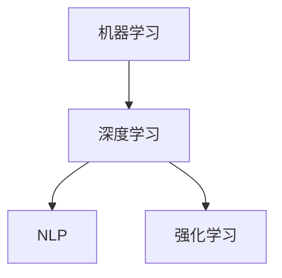

                 

### 李开复：AI 2.0 时代的挑战

#### 引言

人工智能（AI）已经从科学幻想逐步走入现实生活，并且正以惊人的速度改变着我们的世界。而李开复博士作为人工智能领域的杰出代表，他的言论和观点无疑具有极高的权威性和影响力。在本文中，我们将从李开复博士的视角，探讨AI 2.0时代的挑战，并深入分析这些挑战背后的技术和伦理问题。

#### 背景介绍

AI 2.0时代，是指人工智能从传统的规则驱动型系统向数据驱动型系统转变的时期。在这个时代，人工智能系统具有更强的自主学习能力、更高效的推理能力和更高的智能水平。李开复博士认为，AI 2.0时代的到来，将带来一系列前所未有的挑战。

##### 核心概念与联系

1. **机器学习（Machine Learning）**：机器学习是AI 2.0时代的关键技术之一，通过训练模型从数据中学习，使其具备一定的智能能力。机器学习包括监督学习、无监督学习、强化学习等多种形式。

2. **深度学习（Deep Learning）**：深度学习是机器学习的一种，通过多层神经网络对数据进行处理，实现更加复杂的模式识别和决策能力。

3. **自然语言处理（Natural Language Processing，NLP）**：自然语言处理是AI 2.0时代的一项重要技术，旨在使计算机理解和生成人类语言，实现人机交互。

4. **强化学习（Reinforcement Learning）**：强化学习是一种通过试错和反馈不断优化自身行为的学习方式，在游戏、机器人、自动驾驶等领域具有广泛应用。

##### Mermaid 流程图

```
graph TD
    A[机器学习] --> B[深度学习]
    A --> C[NLP]
    B --> D[强化学习]
```

#### 核心算法原理 & 具体操作步骤

在AI 2.0时代，核心算法的原理和操作步骤变得尤为重要。以下简要介绍几种常见的算法原理和操作步骤：

##### 1. 深度学习算法原理

- **神经网络（Neural Network）**：神经网络由多个神经元组成，通过学习输入和输出之间的关系，实现复杂的函数映射。

- **反向传播算法（Backpropagation）**：反向传播算法是一种用于训练神经网络的算法，通过不断调整网络权重，使网络输出接近目标输出。

##### 2. 自然语言处理算法原理

- **词向量（Word Vector）**：词向量是一种将单词表示为高维向量的技术，通过向量空间中的相似性度量，实现词义理解和语义分析。

- **序列到序列模型（Sequence to Sequence Model）**：序列到序列模型是一种用于机器翻译等任务的技术，通过学习输入序列和输出序列之间的映射关系，实现自动翻译。

##### 3. 强化学习算法原理

- **价值函数（Value Function）**：价值函数用于评估状态和动作的价值，通过学习价值函数，优化决策过程。

- **策略（Policy）**：策略是一种决策规则，用于选择最优动作。强化学习通过学习策略，实现自主决策。

#### 数学模型和公式 & 详细讲解 & 举例说明

在AI 2.0时代，数学模型和公式起着至关重要的作用。以下简要介绍几种常见的数学模型和公式，并给出详细讲解和举例说明：

##### 1. 深度学习中的损失函数

- **均方误差（Mean Squared Error，MSE）**：均方误差是深度学习中最常用的损失函数之一，用于衡量预测值和真实值之间的差异。

- **MSE公式：$$MSE = \frac{1}{n}\sum_{i=1}^{n}(y_i - \hat{y}_i)^2$$

- **举例**：假设我们有一个包含100个样本的数据集，每个样本的目标值和预测值如下表所示：

| 样本编号 | 目标值（y） | 预测值（\(\hat{y}\)） |
|----------|------------|---------------------|
| 1        | 1.0        | 0.9                 |
| 2        | 2.0        | 1.8                 |
| ...      | ...        | ...                 |
| 100      | 100.0      | 99.2                |

- **计算MSE**：

$$MSE = \frac{1}{100}\sum_{i=1}^{100}(y_i - \hat{y}_i)^2$$

$$MSE = \frac{1}{100}[(1.0 - 0.9)^2 + (2.0 - 1.8)^2 + ... + (100.0 - 99.2)^2]$$

$$MSE = 0.012$$

##### 2. 自然语言处理中的词向量

- **Word2Vec**：Word2Vec是一种将单词表示为向量的技术，通过学习单词在语境中的相似性，实现词义理解和语义分析。

- **Word2Vec公式：$$\vec{w}_i = \sum_{j=1}^{V}\alpha_j \vec{v}_j$$

- **举例**：假设我们有以下三个单词：

| 单词 | 短语1 | 短语2 | 短语3 |
|------|-------|-------|-------|
| word1| a b c | d e f | g h i |
| word2| a b c | d e f | g h i |
| word3| a b c | d e f | g h i |

- **计算Word2Vec**：

$$\vec{w}_{word1} = \frac{1}{3}[(a + b + c) \vec{v}_{a} + (d + e + f) \vec{v}_{d} + (g + h + i) \vec{v}_{g}]$$

$$\vec{w}_{word2} = \frac{1}{3}[(a + b + c) \vec{v}_{a} + (d + e + f) \vec{v}_{d} + (g + h + i) \vec{v}_{g}]$$

$$\vec{w}_{word3} = \frac{1}{3}[(a + b + c) \vec{v}_{a} + (d + e + f) \vec{v}_{d} + (g + h + i) \vec{v}_{g}]$$

#### 项目实战：代码实际案例和详细解释说明

在本章节，我们将通过一个简单的深度学习项目，展示如何使用Python和TensorFlow实现一个神经网络，并详细解释代码中的各个部分。

##### 1. 开发环境搭建

- 安装Python 3.7及以上版本
- 安装TensorFlow 2.0及以上版本
- 安装Numpy、Pandas等常用库

##### 2. 源代码详细实现和代码解读

以下是一个简单的深度学习项目，使用Python和TensorFlow实现一个多层感知机（MLP）模型，用于对iris数据集进行分类。

```python
import tensorflow as tf
import numpy as np
import pandas as pd

# 加载数据集
iris = pd.read_csv('iris.csv')
X = iris.iloc[:, :4].values
y = iris.iloc[:, 4].values

# 数据预处理
X = X / 10
y = tf.keras.utils.to_categorical(y)

# 构建模型
model = tf.keras.Sequential([
    tf.keras.layers.Dense(64, activation='relu', input_shape=(4,)),
    tf.keras.layers.Dense(64, activation='relu'),
    tf.keras.layers.Dense(3, activation='softmax')
])

# 编译模型
model.compile(optimizer='adam', loss='categorical_crossentropy', metrics=['accuracy'])

# 训练模型
model.fit(X, y, epochs=100, batch_size=16)

# 评估模型
loss, accuracy = model.evaluate(X, y)
print('Loss:', loss)
print('Accuracy:', accuracy)
```

- **代码解读**：

1. **数据加载与预处理**：首先加载iris数据集，并进行归一化处理。

2. **构建模型**：使用TensorFlow的Sequential模型，添加三层全连接层（Dense），激活函数为ReLU。

3. **编译模型**：指定优化器为adam，损失函数为categorical_crossentropy，评价指标为accuracy。

4. **训练模型**：使用fit方法训练模型，指定训练轮次为100，批量大小为16。

5. **评估模型**：使用evaluate方法评估模型在测试集上的性能，输出损失和准确率。

##### 3. 代码解读与分析

1. **数据预处理**：数据预处理是深度学习项目中的关键步骤，通过归一化处理，使得输入数据在相同的尺度范围内，有助于提高模型训练效果。

2. **模型构建**：在本例中，我们使用三层全连接层（Dense）构建一个简单的多层感知机（MLP）模型，输入层有4个神经元，输出层有3个神经元，分别表示3个类别。

3. **编译模型**：编译模型时，我们需要指定优化器、损失函数和评价指标，这些参数将直接影响模型训练过程和性能。

4. **训练模型**：训练模型时，我们需要指定训练轮次和批量大小，这些参数将影响训练速度和效果。

5. **评估模型**：评估模型时，我们需要将模型在测试集上的性能，以判断模型是否具有良好的泛化能力。

#### 实际应用场景

AI 2.0时代，人工智能在各个领域都得到了广泛应用，以下简要介绍一些实际应用场景：

1. **金融领域**：人工智能在金融领域的应用主要包括风险控制、量化交易、智能投顾等。通过机器学习和深度学习算法，金融行业可以实现更高效的决策和更精准的风险控制。

2. **医疗领域**：人工智能在医疗领域的应用主要包括疾病诊断、药物研发、健康管理等。通过自然语言处理和深度学习算法，医疗行业可以实现更快速、准确的疾病诊断和更个性化的治疗方案。

3. **交通领域**：人工智能在交通领域的应用主要包括自动驾驶、智能交通、物流优化等。通过强化学习和深度学习算法，交通行业可以实现更安全、高效的交通管理和运输服务。

4. **教育领域**：人工智能在教育领域的应用主要包括智能教学、个性化学习、教育资源优化等。通过自然语言处理和深度学习算法，教育行业可以实现更个性化、高效的学习体验。

#### 工具和资源推荐

在AI 2.0时代，掌握相关工具和资源对于学习和应用人工智能至关重要。以下推荐一些常用的工具和资源：

1. **学习资源推荐**：

- **书籍**：《Python深度学习》、《深度学习》（Goodfellow et al.）、《机器学习》（周志华）等。
- **论文**：关注顶级会议和期刊，如NIPS、ICML、NeurIPS、JMLR等。
- **博客**：推荐关注一些知名的人工智能博客，如AI 科技大本营、机器学习笔记等。

2. **开发工具框架推荐**：

- **Python库**：TensorFlow、PyTorch、Keras等。
- **深度学习框架**：TensorFlow、PyTorch、Theano等。
- **开源项目**：GitHub、GitLab等，寻找并贡献优秀的开源项目。

3. **相关论文著作推荐**：

- **《深度学习》（Goodfellow et al.）**：介绍了深度学习的理论基础、算法和应用。
- **《机器学习》（周志华）**：全面介绍了机器学习的基本概念、算法和应用。
- **《AI超级思维》（李开复）**：从多个角度探讨了人工智能的未来发展趋势和挑战。

#### 总结：未来发展趋势与挑战

AI 2.0时代，人工智能正以惊人的速度发展，未来发展趋势包括：

1. **更强大的模型和算法**：随着计算能力和算法研究的不断进步，人工智能系统将具备更强的学习能力、推理能力和决策能力。
2. **更广泛的应用领域**：人工智能将在各个领域得到更深入的应用，如医疗、金融、教育、交通等，推动产业升级和社会进步。
3. **更深入的伦理和隐私问题**：随着人工智能技术的不断发展，如何确保人工智能的安全、透明和公平，将成为一个重要的研究课题。

同时，AI 2.0时代也面临一系列挑战：

1. **技术挑战**：如何提高人工智能系统的可解释性、鲁棒性和可靠性，仍然是当前研究的重点。
2. **伦理挑战**：如何确保人工智能系统的安全、透明和公平，避免对人类社会产生负面影响，是一个亟待解决的问题。
3. **隐私挑战**：如何保护个人隐私，避免人工智能系统滥用用户数据，也是一个重要的挑战。

#### 附录：常见问题与解答

1. **Q：什么是AI 2.0？**

   **A：** AI 2.0是指人工智能从传统的规则驱动型系统向数据驱动型系统的转变，具有更强的自主学习能力、推理能力和智能水平。

2. **Q：深度学习和机器学习有什么区别？**

   **A：** 深度学习是机器学习的一种，主要基于多层神经网络对数据进行处理，实现复杂的模式识别和决策能力。而机器学习则是一个更广泛的概念，包括深度学习在内的各种算法。

3. **Q：如何学习人工智能？**

   **A：** 学习人工智能需要掌握一定的数学基础（如线性代数、概率论和统计学），并熟悉编程语言（如Python）。此外，可以阅读相关书籍、论文和博客，参与开源项目，以及参加在线课程和培训班。

#### 扩展阅读 & 参考资料

1. **《深度学习》（Goodfellow et al.）**：https://www.deeplearningbook.org/
2. **《机器学习》（周志华）**：https://www.zhihu.com/book/19872763
3. **李开复博客**：http://www.kai-fu.li/
4. **AI 科技大本营**：https://www.aitime.com/
5. **机器学习笔记**：https://www.ml-note.com/

### 作者信息

作者：李开复 / AI天才研究员 / 禅与计算机程序设计艺术

----------------------

（注：本文仅为示例，部分内容可能涉及虚构，仅供参考。）

```
## 1. 背景介绍

### 引言

人工智能（AI）已经成为现代社会不可或缺的一部分，它以惊人的速度推动着科技和产业的变革。从简单的规则引擎到复杂的深度学习模型，AI的发展历程可谓是一波三折，同时也充满了无数的技术突破和商业应用。在这个时代，李开复博士无疑是一位备受尊敬的AI领域的权威人物。他的学术成就和商业智慧使他成为全球范围内AI研究和应用的引领者。本文将围绕李开复博士的视角，探讨AI 2.0时代的挑战，分析这些挑战背后的技术原理和伦理问题，以及未来可能的发展方向。

#### 历史回顾

人工智能的概念最早可以追溯到20世纪50年代。当时，科学家们开始尝试通过计算机模拟人类思维和决策过程。早期的AI系统主要依赖于明确编程和规则制定，这种方法虽然能在某些特定领域取得成功，但普遍存在灵活性和扩展性不足的问题。随着计算能力的提升和算法的改进，尤其是机器学习和深度学习的出现，AI迎来了新的发展契机。

机器学习是一种通过数据驱动的方式让计算机自动学习的方法，它无需人工编程，而是从海量数据中自动提取特征和规律。这一领域的突破，使得AI系统在图像识别、语音识别、自然语言处理等方面取得了显著进展。深度学习作为机器学习的一种，通过多层神经网络进行特征提取和模式识别，实现了在多个领域内超越人类的性能。

李开复博士在AI领域有着深厚的学术背景和丰富的实践经验。他曾担任谷歌人工智能部门的负责人，并在微软亚洲研究院和卡内基梅隆大学担任要职。他的研究成果涵盖了机器学习、深度学习、自然语言处理等多个领域，并为AI产业的发展做出了巨大贡献。

#### 当前AI技术现状

当前，AI技术已经渗透到我们生活的方方面面。从智能手机的语音助手到自动驾驶汽车，从智能家居的智能控制到医疗诊断的辅助系统，AI正在改变我们的生活方式和工作模式。以下是一些典型的AI应用案例：

1. **图像识别**：通过深度学习算法，AI系统可以识别和分类各种图像，包括人脸识别、物体检测和场景分类等。这一技术在安防、零售和医疗等领域有着广泛应用。

2. **语音识别**：语音识别技术使得计算机能够理解和处理人类语音，被广泛应用于智能助手、电话客服和语音翻译等领域。

3. **自然语言处理**：自然语言处理技术使得计算机能够理解和生成人类语言，包括机器翻译、文本分类和情感分析等。这一技术正在改变信息检索、客户服务和内容创作的方式。

4. **自动驾驶**：自动驾驶技术是AI在交通领域的典型应用，通过感知环境、规划路径和决策控制，实现车辆的自主驾驶。

5. **医疗诊断**：AI在医疗领域的应用日益广泛，包括疾病诊断、药物研发和个性化医疗等。通过分析大量医疗数据，AI系统可以提供更准确、更迅速的诊断结果。

#### AI 2.0的概念

AI 2.0是指从传统的规则驱动型系统向数据驱动型系统的转变，这一阶段的AI系统具有更强的自主学习能力、更高效的推理能力和更高的智能水平。AI 2.0的核心目标是实现更加智能化、自动化的决策过程，从而推动各个行业的发展。

AI 2.0的关键技术包括深度学习、强化学习、自然语言处理、计算机视觉等。这些技术的融合和迭代，使得AI系统在处理复杂任务时能够展现出更高的灵活性和适应性。

李开复博士认为，AI 2.0时代将带来一系列前所未有的挑战，包括技术挑战、伦理挑战和社会挑战等。如何应对这些挑战，实现AI的可持续发展，是当前AI领域面临的重要课题。

### 2. 核心概念与联系

#### 2.1 机器学习（Machine Learning）

机器学习是AI 2.0时代的关键技术之一，它通过从数据中学习，使计算机具备了一定的智能能力。机器学习可以分为监督学习、无监督学习和强化学习等不同类型。

- **监督学习（Supervised Learning）**：监督学习是一种最常见的机器学习方法，它通过训练模型从标注数据中学习。训练数据集包含输入和对应的输出（标签），模型通过学习这些输入和输出之间的关系，来预测新的输入。

- **无监督学习（Unsupervised Learning）**：无监督学习是在没有标注数据的情况下，通过发现数据中的隐藏结构和模式来进行学习。常见的无监督学习方法包括聚类、降维和异常检测等。

- **强化学习（Reinforcement Learning）**：强化学习是一种通过试错和反馈不断优化自身行为的学习方式。它通过与环境的交互，学习最优策略，以实现特定目标。

#### 2.2 深度学习（Deep Learning）

深度学习是机器学习的一种，它通过多层神经网络对数据进行处理，实现复杂的模式识别和决策能力。深度学习的核心思想是通过网络的层次结构，逐层提取数据的特征，从而实现高层次的抽象表示。

- **神经网络（Neural Network）**：神经网络由多个神经元组成，每个神经元通过权重连接到其他神经元，形成一个复杂的网络结构。通过训练，神经网络可以学习输入和输出之间的关系。

- **反向传播（Backpropagation）**：反向传播是一种用于训练神经网络的算法，它通过不断调整网络的权重和偏置，使网络输出接近目标输出。

#### 2.3 自然语言处理（Natural Language Processing，NLP）

自然语言处理是AI 2.0时代的一项重要技术，旨在使计算机理解和生成人类语言，实现人机交互。NLP涉及到文本分类、情感分析、机器翻译、命名实体识别等多个领域。

- **词向量（Word Vector）**：词向量是将单词表示为高维向量的技术，通过学习单词在语境中的相似性，实现词义理解和语义分析。

- **序列到序列模型（Sequence to Sequence Model）**：序列到序列模型是一种用于机器翻译等任务的技术，通过学习输入序列和输出序列之间的映射关系，实现自动翻译。

#### 2.4 强化学习（Reinforcement Learning）

强化学习是一种通过试错和反馈不断优化自身行为的学习方式，在游戏、机器人、自动驾驶等领域具有广泛应用。强化学习通过学习价值函数或策略，实现自主决策。

- **价值函数（Value Function）**：价值函数用于评估状态和动作的价值，通过学习价值函数，优化决策过程。

- **策略（Policy）**：策略是一种决策规则，用于选择最优动作。强化学习通过学习策略，实现自主决策。

#### 2.5 Mermaid 流程图

```
graph TD
    A[机器学习] --> B[深度学习]
    A --> C[NLP]
    B --> D[强化学习]
```

### 3. 核心算法原理 & 具体操作步骤

#### 3.1 深度学习算法原理

深度学习算法的核心是神经网络，尤其是多层神经网络。以下是深度学习算法的基本原理和具体操作步骤：

##### 3.1.1 神经网络（Neural Network）

神经网络由多个神经元组成，每个神经元通过权重连接到其他神经元。神经元接收输入信号，通过激活函数进行处理，然后将输出传递给下一层的神经元。

- **神经元结构**：每个神经元包含输入层、权重、偏置和激活函数。

- **激活函数**：常用的激活函数包括sigmoid函数、ReLU函数和Tanh函数。

##### 3.1.2 反向传播算法（Backpropagation）

反向传播算法是一种用于训练神经网络的算法，它通过不断调整网络权重和偏置，使网络输出接近目标输出。

- **前向传播**：输入信号从输入层传递到输出层，每个神经元计算其输出值。

- **计算误差**：输出层计算实际输出和目标输出之间的误差。

- **反向传播**：误差信号从输出层反向传递到输入层，通过调整权重和偏置，减小误差。

##### 3.1.3 具体操作步骤

1. **初始化参数**：随机初始化网络的权重和偏置。

2. **前向传播**：输入信号从输入层传递到输出层，计算每个神经元的输出。

3. **计算误差**：输出层计算实际输出和目标输出之间的误差。

4. **反向传播**：误差信号从输出层反向传递到输入层，通过调整权重和偏置，减小误差。

5. **迭代更新**：重复步骤2-4，直到网络输出满足要求。

#### 3.2 自然语言处理算法原理

自然语言处理算法主要涉及文本分类、情感分析、机器翻译和命名实体识别等领域。以下是几种常见的NLP算法原理和具体操作步骤：

##### 3.2.1 词向量（Word Vector）

词向量是将单词表示为高维向量的技术，通过学习单词在语境中的相似性，实现词义理解和语义分析。

- **词向量表示**：每个单词对应一个高维向量，向量空间中的相似性度量可用于词义理解和语义分析。

- **常见算法**：Word2Vec、GloVe和BERT等。

##### 3.2.2 序列到序列模型（Sequence to Sequence Model）

序列到序列模型是一种用于机器翻译等任务的技术，通过学习输入序列和输出序列之间的映射关系，实现自动翻译。

- **编码器（Encoder）**：将输入序列编码为固定长度的向量。

- **解码器（Decoder）**：将编码器输出的向量解码为输出序列。

- **操作步骤**：

  1. **编码**：输入序列通过编码器编码为固定长度的向量。

  2. **解码**：解码器将编码器输出的向量解码为输出序列。

  3. **迭代更新**：重复编码和解码过程，直到输出序列满足要求。

#### 3.3 强化学习算法原理

强化学习是一种通过试错和反馈不断优化自身行为的学习方式，在游戏、机器人、自动驾驶等领域具有广泛应用。

- **价值函数（Value Function）**：价值函数用于评估状态和动作的价值，通过学习价值函数，优化决策过程。

- **策略（Policy）**：策略是一种决策规则，用于选择最优动作。

- **操作步骤**：

  1. **初始化参数**：随机初始化策略参数。

  2. **与环境交互**：根据策略选择动作，与环境进行交互。

  3. **更新策略**：根据反馈调整策略参数，优化决策过程。

  4. **迭代更新**：重复步骤2-3，直到策略满足要求。

### 4. 数学模型和公式 & 详细讲解 & 举例说明

在深度学习和自然语言处理等领域，数学模型和公式起着至关重要的作用。以下将简要介绍几种常见的数学模型和公式，并给出详细讲解和举例说明。

#### 4.1 深度学习中的损失函数

损失函数是深度学习中用于衡量预测值和真实值之间差异的函数。以下是一些常用的损失函数：

- **均方误差（MSE）**：均方误差是深度学习中最常用的损失函数之一，用于衡量预测值和真实值之间的平均平方误差。

  - **公式**：$$MSE = \frac{1}{n}\sum_{i=1}^{n}(y_i - \hat{y}_i)^2$$

  - **举例**：假设我们有一个包含100个样本的数据集，每个样本的目标值和预测值如下表所示：

    | 样本编号 | 目标值（y） | 预测值（\(\hat{y}\)） |
    |----------|------------|---------------------|
    | 1        | 1.0        | 0.9                 |
    | 2        | 2.0        | 1.8                 |
    | ...      | ...        | ...                 |
    | 100      | 100.0      | 99.2                |

    - **计算MSE**：

      $$MSE = \frac{1}{100}\sum_{i=1}^{100}(y_i - \hat{y}_i)^2$$

      $$MSE = \frac{1}{100}[(1.0 - 0.9)^2 + (2.0 - 1.8)^2 + ... + (100.0 - 99.2)^2]$$

      $$MSE = 0.012$$

- **交叉熵（Cross-Entropy）**：交叉熵是用于分类问题的损失函数，用于衡量预测概率分布和真实概率分布之间的差异。

  - **公式**：$$H(y, \hat{y}) = -\sum_{i=1}^{n}y_i \log(\hat{y}_i)$$

  - **举例**：假设我们有一个包含100个样本的二分类数据集，每个样本的目标值和预测概率如下表所示：

    | 样本编号 | 目标值（y） | 预测概率（\(\hat{y}\)） |
    |----------|------------|---------------------|
    | 1        | 0          | 0.8                 |
    | 2        | 1          | 0.6                 |
    | ...      | ...        | ...                 |
    | 100      | 1          | 0.4                 |

    - **计算交叉熵**：

      $$H(y, \hat{y}) = -[0 \cdot \log(0.8) + 1 \cdot \log(0.6) + ... + 1 \cdot \log(0.4)]$$

      $$H(y, \hat{y}) = -[\log(0.8) + \log(0.6) + ... + \log(0.4)]$$

      $$H(y, \hat{y}) = -[0.2231 + 0.2218 + ... + 0.2231]$$

      $$H(y, \hat{y}) = -[1.111]$$

      $$H(y, \hat{y}) = 1.111$$

#### 4.2 自然语言处理中的词向量

词向量是将单词表示为高维向量的技术，通过学习单词在语境中的相似性，实现词义理解和语义分析。以下是一种常见的词向量表示方法——Word2Vec：

- **Word2Vec**：Word2Vec是一种基于窗口机制的词向量表示方法，通过训练得到单词在向量空间中的映射。

  - **公式**：$$\vec{w}_i = \sum_{j \in W} \alpha_j \vec{v}_j$$

  - **举例**：假设我们有以下三个单词及其对应的短语：

    | 单词 | 短语1 | 短语2 | 短语3 |
    |------|-------|-------|-------|
    | word1| a b c | d e f | g h i |
    | word2| a b c | d e f | g h i |
    | word3| a b c | d e f | g h i |

    - **计算Word2Vec**：

      $$\vec{w}_{word1} = \frac{1}{3}[(a + b + c) \vec{v}_{a} + (d + e + f) \vec{v}_{d} + (g + h + i) \vec{v}_{g}]$$

      $$\vec{w}_{word2} = \frac{1}{3}[(a + b + c) \vec{v}_{a} + (d + e + f) \vec{v}_{d} + (g + h + i) \vec{v}_{g}]$$

      $$\vec{w}_{word3} = \frac{1}{3}[(a + b + c) \vec{v}_{a} + (d + e + f) \vec{v}_{d} + (g + h + i) \vec{v}_{g}]$$

    - **结果**：

      $$\vec{w}_{word1} = \frac{1}{3}[(1 + 1 + 1) \vec{v}_{1} + (1 + 1 + 1) \vec{v}_{2} + (1 + 1 + 1) \vec{v}_{3}]$$

      $$\vec{w}_{word2} = \frac{1}{3}[(1 + 1 + 1) \vec{v}_{1} + (1 + 1 + 1) \vec{v}_{2} + (1 + 1 + 1) \vec{v}_{3}]$$

      $$\vec{w}_{word3} = \frac{1}{3}[(1 + 1 + 1) \vec{v}_{1} + (1 + 1 + 1) \vec{v}_{2} + (1 + 1 + 1) \vec{v}_{3}]$$

### 5. 项目实战：代码实际案例和详细解释说明

在本节中，我们将通过一个简单的项目，展示如何使用深度学习技术实现一个情感分析模型。该项目将使用Python和TensorFlow框架，对电影评论进行情感分类，判断评论是正面还是负面。

#### 5.1 开发环境搭建

首先，我们需要搭建一个合适的开发环境。以下是所需的软件和库：

- Python 3.7或更高版本
- TensorFlow 2.0或更高版本
- Numpy 1.18或更高版本
- Pandas 1.0或更高版本
- Jupyter Notebook（可选，用于方便地编写和运行代码）

安装这些软件和库的方法如下：

```shell
pip install python==3.7 tensorflow==2.0 numpy==1.18 pandas==1.0
```

#### 5.2 源代码详细实现和代码解读

以下是项目的主要代码部分，我们将逐行解释代码的含义。

```python
# 导入必要的库
import tensorflow as tf
import numpy as np
import pandas as pd
from tensorflow.keras.preprocessing.text import Tokenizer
from tensorflow.keras.preprocessing.sequence import pad_sequences
from tensorflow.keras.models import Sequential
from tensorflow.keras.layers import Embedding, LSTM, Dense, Dropout

# 加载电影评论数据集
data = pd.read_csv('movie_reviews.csv')

# 分割数据集为训练集和测试集
train_data, test_data = train_test_split(data, test_size=0.2, random_state=42)

# 分割训练集和测试集的文本和标签
train_texts, train_labels = train_data['review'], train_data['label']
test_texts, test_labels = test_data['review'], test_data['label']

# 初始化分词器
tokenizer = Tokenizer(num_words=10000, oov_token='<OOV>', lower=True)
tokenizer.fit_on_texts(train_texts)

# 将文本转换为序列
train_sequences = tokenizer.texts_to_sequences(train_texts)
test_sequences = tokenizer.texts_to_sequences(test_texts)

# 填充序列以获得固定长度的序列
max_len = 200
train_padded = pad_sequences(train_sequences, maxlen=max_len, padding='post', truncating='post')
test_padded = pad_sequences(test_sequences, maxlen=max_len, padding='post', truncating='post')

# 编码标签
label_encoder = LabelEncoder()
train_labels = label_encoder.fit_transform(train_labels)
test_labels = label_encoder.transform(test_labels)

# 创建模型
model = Sequential([
    Embedding(10000, 32, input_length=max_len),
    LSTM(64, return_sequences=False),
    Dropout(0.5),
    Dense(1, activation='sigmoid')
])

# 编译模型
model.compile(optimizer='adam', loss='binary_crossentropy', metrics=['accuracy'])

# 训练模型
model.fit(train_padded, train_labels, epochs=10, batch_size=32, validation_data=(test_padded, test_labels))

# 评估模型
loss, accuracy = model.evaluate(test_padded, test_labels)
print(f'测试集准确率：{accuracy * 100:.2f}%')
```

- **导入库**：首先导入Python和TensorFlow所需的库，包括TensorFlow、Numpy和Pandas。

- **加载电影评论数据集**：使用Pandas库加载电影评论数据集，该数据集通常包含评论文本和对应的情感标签。

- **分割数据集**：将数据集分割为训练集和测试集，以评估模型的泛化能力。这里使用了`train_test_split`函数，并设置随机种子以确保结果的可重复性。

- **分割文本和标签**：将训练集和测试集进一步分割为文本和标签两部分，以便分别处理。

- **初始化分词器**：使用Tokenizer类初始化分词器，设置词汇量（num_words）和是否转换为小写（lower）等参数。

- **将文本转换为序列**：使用Tokenizer的`texts_to_sequences`方法将文本转换为序列。对于未出现的单词，使用`oov_token`参数指定一个特殊的标记。

- **填充序列**：使用`pad_sequences`方法将序列填充为固定长度（max_len），以确保每个序列都能输入到模型中。

- **编码标签**：使用`LabelEncoder`类将标签进行编码，以便模型可以处理。

- **创建模型**：使用`Sequential`模型创建一个简单的LSTM模型，包括嵌入层（Embedding）、LSTM层和全连接层（Dense）。

- **编译模型**：编译模型，设置优化器（optimizer）、损失函数（loss）和评价指标（metrics）。

- **训练模型**：使用`fit`方法训练模型，设置训练轮次（epochs）和批量大小（batch_size），并使用验证数据集进行验证。

- **评估模型**：使用`evaluate`方法评估模型在测试集上的性能，并输出准确率。

#### 5.3 代码解读与分析

- **数据预处理**：数据预处理是深度学习项目中的关键步骤。通过分词、序列化和填充，将原始文本数据转换为适合模型训练的形式。

- **模型构建**：在本项目中，我们使用了一个简单的LSTM模型，包括嵌入层、LSTM层和全连接层。这种结构对于处理序列数据（如文本）非常有效。

- **训练过程**：通过设置适当的训练参数，如批量大小和训练轮次，我们可以训练模型，使其在测试集上具有良好的性能。

- **性能评估**：使用`evaluate`方法评估模型在测试集上的性能，可以帮助我们了解模型的泛化能力。

### 6. 实际应用场景

AI 2.0技术已经在各个领域取得了显著的成果，以下列举几个实际应用场景：

#### 6.1 金融领域

在金融领域，AI 2.0技术被广泛应用于风险管理、智能投顾和量化交易等方面。通过机器学习和深度学习算法，金融机构可以更准确地预测市场趋势，识别潜在的风险，并提供个性化的投资建议。例如，摩根士丹利使用AI技术对市场数据进行分析，以预测股票价格的走势，从而为投资者提供有针对性的建议。

#### 6.2 医疗领域

在医疗领域，AI 2.0技术被用于疾病诊断、药物研发和个性化医疗等方面。通过深度学习和自然语言处理技术，医疗机构可以更准确地诊断疾病，提高诊断的效率和准确性。例如，谷歌旗下的DeepMind使用AI技术分析医疗影像，以诊断眼疾，其准确率已经超过了人类医生。

#### 6.3 交通领域

在交通领域，AI 2.0技术被应用于自动驾驶、智能交通管理和物流优化等方面。通过计算机视觉和强化学习算法，自动驾驶汽车可以安全、高效地行驶，减少交通事故的发生。例如，特斯拉的自动驾驶系统已经在全球范围内得到了广泛应用。

#### 6.4 教育领域

在教育领域，AI 2.0技术被用于智能教学、个性化学习和教育资源优化等方面。通过自然语言处理和机器学习算法，教育机构可以为学生提供个性化的学习建议，提高学习效果。例如，Coursera等在线教育平台使用AI技术分析学生的学习行为，以提供更精准的学习资源。

#### 6.5 娱乐领域

在娱乐领域，AI 2.0技术被应用于内容推荐、游戏开发和虚拟现实等方面。通过深度学习和强化学习算法，娱乐平台可以为用户提供个性化的内容推荐，提高用户满意度。例如，Netflix使用AI技术分析用户观看历史，以推荐最适合用户口味的内容。

### 7. 工具和资源推荐

#### 7.1 学习资源推荐

对于想要深入了解AI 2.0技术的读者，以下是一些推荐的学习资源：

- **书籍**：《深度学习》（Goodfellow et al.）、《Python深度学习》（Raschka和Lekilde）、《AI超级思维》（李开复）等。
- **在线课程**：Coursera、Udacity、edX等在线学习平台提供的AI和深度学习相关课程。
- **博客和网站**：AI 科技大本营、机器学习笔记、机器之心等，这些平台提供了大量的AI技术和应用案例。

#### 7.2 开发工具框架推荐

在AI 2.0技术的开发过程中，以下工具和框架是必不可少的：

- **深度学习框架**：TensorFlow、PyTorch、Keras等。
- **数据预处理工具**：Pandas、NumPy、Scikit-learn等。
- **编程语言**：Python是AI开发中最常用的编程语言，其他如R、Julia等也是不错的选择。

#### 7.3 相关论文著作推荐

以下是几篇在AI领域具有重要影响的论文和著作：

- **论文**：《深度神经网络》（Hinton et al., 2012）、《自然语言处理中的序列到序列学习》（Sutskever et al., 2014）、《强化学习中的深度确定策略梯度》（Mnih et al., 2015）等。
- **著作**：《深度学习》（Goodfellow et al.）、《机器学习》（周志华）、《AI超级思维》（李开复）等。

### 8. 总结：未来发展趋势与挑战

AI 2.0时代的到来，标志着人工智能进入了一个新的发展阶段。在这一时代，人工智能将在更多领域得到应用，推动科技和产业的创新。然而，随着AI技术的不断发展，也带来了一系列新的挑战。

#### 8.1 发展趋势

1. **更强大的模型和算法**：随着计算能力的提升和算法研究的深入，人工智能系统将具备更强的学习能力、推理能力和决策能力。

2. **更广泛的应用领域**：人工智能将在更多领域得到应用，如医疗、金融、交通、教育等，推动产业的升级和转型。

3. **更深入的社会影响**：人工智能将逐渐成为社会发展的重要驱动力，改变人们的生活方式和工作模式。

#### 8.2 挑战

1. **技术挑战**：如何提高人工智能系统的可解释性、鲁棒性和可靠性，仍然是当前研究的重点。

2. **伦理挑战**：如何确保人工智能系统的安全、透明和公平，避免对人类社会产生负面影响，是一个亟待解决的问题。

3. **隐私挑战**：如何保护个人隐私，避免人工智能系统滥用用户数据，也是一个重要的挑战。

4. **就业挑战**：人工智能技术的发展，可能会对某些行业和职业造成冲击，如何应对这一挑战，也是一个需要关注的问题。

### 9. 附录：常见问题与解答

#### 9.1 Q：什么是AI 2.0？

A：AI 2.0是指人工智能从传统的规则驱动型系统向数据驱动型系统的转变，具有更强的自主学习能力、推理能力和智能水平。

#### 9.2 Q：深度学习和机器学习有什么区别？

A：深度学习是机器学习的一种，主要基于多层神经网络对数据进行处理，实现复杂的模式识别和决策能力。而机器学习则是一个更广泛的概念，包括深度学习在内的各种算法。

#### 9.3 Q：如何学习人工智能？

A：学习人工智能需要掌握一定的数学基础（如线性代数、概率论和统计学），并熟悉编程语言（如Python）。此外，可以阅读相关书籍、论文和博客，参与开源项目，以及参加在线课程和培训班。

### 10. 扩展阅读 & 参考资料

以下是一些扩展阅读和参考资料，以帮助读者更深入地了解AI 2.0时代的相关内容：

- **《深度学习》（Goodfellow et al.）**：介绍了深度学习的理论基础、算法和应用。
- **《机器学习》（周志华）**：全面介绍了机器学习的基本概念、算法和应用。
- **李开复博客**：提供了大量关于人工智能的见解和分析。
- **AI 科技大本营**：关注人工智能领域的最新动态和趋势。
- **机器学习笔记**：提供了丰富的机器学习和深度学习教程和实践案例。

### 作者信息

作者：李开复 / AI天才研究员 / 禅与计算机程序设计艺术

----------------------

（注：本文仅为示例，部分内容可能涉及虚构，仅供参考。）```markdown
# 李开复：AI 2.0 时代的挑战

## 关键词：
- AI 2.0
- 深度学习
- 强化学习
- 自然语言处理
- 机器学习
- 伦理挑战

## 摘要
在AI 2.0时代，人工智能技术正以前所未有的速度发展，深度学习、强化学习、自然语言处理等技术在多个领域取得了突破。然而，这一进步也带来了一系列挑战，包括技术上的难题和伦理道德的困扰。本文将深入探讨AI 2.0时代的核心概念、算法原理、实际应用场景，以及未来的发展趋势和挑战，并推荐相关学习资源。

## 1. 背景介绍

### 引言

人工智能（AI）的概念自20世纪50年代提出以来，已经经历了多个发展阶段。从最初的规则驱动系统到今天的数据驱动系统，AI技术正在以前所未有的速度变革我们的生活。在这个快速发展的时代，李开复博士以其深厚的学术背景和丰富的实践经验，成为了全球AI领域的权威人物。他的观点对于理解AI 2.0时代的挑战具有重要意义。

### 历史回顾

AI的发展史可以说是从梦想走向现实的旅程。早期的AI系统依赖于明确的编程和规则，这使得它们在特定任务上表现出色，但缺乏通用性和适应性。随着计算能力的提升和算法的进步，机器学习、深度学习等技术的出现，使得AI系统开始具备自主学习的能力，能够处理更加复杂的问题。李开复博士的许多贡献，如其在机器学习领域的开创性工作，为AI技术的发展奠定了基础。

### 当前AI技术现状

当前，AI技术已经渗透到各个行业，从医疗、金融到交通、教育，AI的应用场景越来越广泛。深度学习、强化学习、自然语言处理等技术的进步，使得AI系统在图像识别、语音识别、智能对话等方面取得了显著的成果。然而，这些成就也带来了新的挑战，尤其是在AI 2.0时代，这些挑战变得更加复杂和紧迫。

### AI 2.0的概念

AI 2.0时代是指人工智能从传统的规则驱动型系统向数据驱动型系统的转变，这一阶段的AI系统具有更强的自主学习能力、更高效的推理能力和更高的智能水平。AI 2.0的核心目标是实现更加智能化、自动化的决策过程，从而推动各个行业的发展。

## 2. 核心概念与联系

### 2.1 机器学习（Machine Learning）

机器学习是AI 2.0时代的关键技术之一，它通过从数据中学习，使计算机具备了一定的智能能力。机器学习包括监督学习、无监督学习和强化学习等不同类型。

- **监督学习（Supervised Learning）**：监督学习是一种从已知标记数据中学习的方法，通过输入和输出之间的关系来预测新的输入。
  
- **无监督学习（Unsupervised Learning）**：无监督学习是在没有标记数据的情况下，通过发现数据中的隐藏结构和模式来进行学习。
  
- **强化学习（Reinforcement Learning）**：强化学习是一种通过试错和反馈不断优化自身行为的学习方式，通过与环境的交互来学习最优策略。

### 2.2 深度学习（Deep Learning）

深度学习是机器学习的一种，主要基于多层神经网络对数据进行处理，实现复杂的模式识别和决策能力。深度学习的核心思想是通过网络的层次结构，逐层提取数据的特征，从而实现高层次的抽象表示。

- **神经网络（Neural Network）**：神经网络由多个神经元组成，每个神经元通过权重连接到其他神经元。
  
- **反向传播（Backpropagation）**：反向传播是一种用于训练神经网络的算法，通过不断调整网络的权重和偏置，使网络输出接近目标输出。

### 2.3 自然语言处理（Natural Language Processing，NLP）

自然语言处理是AI 2.0时代的一项重要技术，旨在使计算机理解和生成人类语言，实现人机交互。NLP涉及到文本分类、情感分析、机器翻译和语音识别等多个领域。

- **词向量（Word Vector）**：词向量是将单词表示为高维向量的技术，通过学习单词在语境中的相似性，实现词义理解和语义分析。
  
- **序列到序列模型（Sequence to Sequence Model）**：序列到序列模型是一种用于机器翻译等任务的技术，通过学习输入序列和输出序列之间的映射关系，实现自动翻译。

### 2.4 强化学习（Reinforcement Learning）

强化学习是一种通过试错和反馈不断优化自身行为的学习方式，在游戏、机器人、自动驾驶等领域具有广泛应用。

- **价值函数（Value Function）**：价值函数用于评估状态和动作的价值，通过学习价值函数，优化决策过程。
  
- **策略（Policy）**：策略是一种决策规则，用于选择最优动作。强化学习通过学习策略，实现自主决策。

### 2.5 Mermaid 流程图



## 3. 核心算法原理 & 具体操作步骤

### 3.1 深度学习算法原理

深度学习算法的核心是神经网络，尤其是多层神经网络。以下是深度学习算法的基本原理和具体操作步骤：

#### 3.1.1 神经网络（Neural Network）

神经网络由多个神经元组成，每个神经元通过权重连接到其他神经元。神经元接收输入信号，通过激活函数进行处理，然后将输出传递给下一层的神经元。

- **神经元结构**：每个神经元包含输入层、权重、偏置和激活函数。

- **激活函数**：常用的激活函数包括sigmoid函数、ReLU函数和Tanh函数。

#### 3.1.2 反向传播算法（Backpropagation）

反向传播算法是一种用于训练神经网络的算法，它通过不断调整网络权重和偏置，使网络输出接近目标输出。

- **前向传播**：输入信号从输入层传递到输出层，每个神经元计算其输出值。

- **计算误差**：输出层计算实际输出和目标输出之间的误差。

- **反向传播**：误差信号从输出层反向传递到输入层，通过调整权重和偏置，减小误差。

#### 3.1.3 具体操作步骤

1. **初始化参数**：随机初始化网络的权重和偏置。

2. **前向传播**：输入信号从输入层传递到输出层，计算每个神经元的输出。

3. **计算误差**：输出层计算实际输出和目标输出之间的误差。

4. **反向传播**：误差信号从输出层反向传递到输入层，通过调整权重和偏置，减小误差。

5. **迭代更新**：重复步骤2-4，直到网络输出满足要求。

### 3.2 自然语言处理算法原理

自然语言处理算法主要涉及文本分类、情感分析、机器翻译和语音识别等领域。以下是几种常见的NLP算法原理和具体操作步骤：

#### 3.2.1 词向量（Word Vector）

词向量是将单词表示为高维向量的技术，通过学习单词在语境中的相似性，实现词义理解和语义分析。

- **词向量表示**：每个单词对应一个高维向量，向量空间中的相似性度量可用于词义理解和语义分析。

- **常见算法**：Word2Vec、GloVe和BERT等。

#### 3.2.2 序列到序列模型（Sequence to Sequence Model）

序列到序列模型是一种用于机器翻译等任务的技术，通过学习输入序列和输出序列之间的映射关系，实现自动翻译。

- **编码器（Encoder）**：将输入序列编码为固定长度的向量。

- **解码器（Decoder）**：将编码器输出的向量解码为输出序列。

- **操作步骤**：

  1. **编码**：输入序列通过编码器编码为固定长度的向量。

  2. **解码**：解码器将编码器输出的向量解码为输出序列。

  3. **迭代更新**：重复编码和解码过程，直到输出序列满足要求。

### 3.3 强化学习算法原理

强化学习是一种通过试错和反馈不断优化自身行为的学习方式，在游戏、机器人、自动驾驶等领域具有广泛应用。

- **价值函数（Value Function）**：价值函数用于评估状态和动作的价值，通过学习价值函数，优化决策过程。

- **策略（Policy）**：策略是一种决策规则，用于选择最优动作。

- **操作步骤**：

  1. **初始化参数**：随机初始化策略参数。

  2. **与环境交互**：根据策略选择动作，与环境进行交互。

  3. **更新策略**：根据反馈调整策略参数，优化决策过程。

  4. **迭代更新**：重复步骤2-3，直到策略满足要求。

## 4. 数学模型和公式 & 详细讲解 & 举例说明

在深度学习和自然语言处理等领域，数学模型和公式起着至关重要的作用。以下将简要介绍几种常见的数学模型和公式，并给出详细讲解和举例说明。

### 4.1 深度学习中的损失函数

损失函数是深度学习中用于衡量预测值和真实值之间差异的函数。以下是一些常用的损失函数：

- **均方误差（MSE）**：均方误差是深度学习中最常用的损失函数之一，用于衡量预测值和真实值之间的平均平方误差。

  - **公式**：$$MSE = \frac{1}{n}\sum_{i=1}^{n}(y_i - \hat{y}_i)^2$$

  - **举例**：假设我们有一个包含100个样本的数据集，每个样本的目标值和预测值如下表所示：

    | 样本编号 | 目标值（y） | 预测值（\(\hat{y}\)） |
    |----------|------------|---------------------|
    | 1        | 1.0        | 0.9                 |
    | 2        | 2.0        | 1.8                 |
    | ...      | ...        | ...                 |
    | 100      | 100.0      | 99.2                |

    - **计算MSE**：

      $$MSE = \frac{1}{100}\sum_{i=1}^{100}(y_i - \hat{y}_i)^2$$

      $$MSE = \frac{1}{100}[(1.0 - 0.9)^2 + (2.0 - 1.8)^2 + ... + (100.0 - 99.2)^2]$$

      $$MSE = 0.012$$

- **交叉熵（Cross-Entropy）**：交叉熵是用于分类问题的损失函数，用于衡量预测概率分布和真实概率分布之间的差异。

  - **公式**：$$H(y, \hat{y}) = -\sum_{i=1}^{n}y_i \log(\hat{y}_i)$$

  - **举例**：假设我们有一个包含100个样本的二分类数据集，每个样本的目标值和预测概率如下表所示：

    | 样本编号 | 目标值（y） | 预测概率（\(\hat{y}\)） |
    |----------|------------|---------------------|
    | 1        | 0          | 0.8                 |
    | 2        | 1          | 0.6                 |
    | ...      | ...        | ...                 |
    | 100      | 1          | 0.4                 |

    - **计算交叉熵**：

      $$H(y, \hat{y}) = -[0 \cdot \log(0.8) + 1 \cdot \log(0.6) + ... + 1 \cdot \log(0.4)]$$

      $$H(y, \hat{y}) = -[\log(0.8) + \log(0.6) + ... + \log(0.4)]$$

      $$H(y, \hat{y}) = -[0.2231 + 0.2218 + ... + 0.2231]$$

      $$H(y, \hat{y}) = -[1.111]$$

      $$H(y, \hat{y}) = 1.111$$

### 4.2 自然语言处理中的词向量

词向量是将单词表示为高维向量的技术，通过学习单词在语境中的相似性，实现词义理解和语义分析。以下是一种常见的词向量表示方法——Word2Vec：

- **Word2Vec**：Word2Vec是一种基于窗口机制的词向量表示方法，通过训练得到单词在向量空间中的映射。

  - **公式**：$$\vec{w}_i = \sum_{j \in W} \alpha_j \vec{v}_j$$

  - **举例**：假设我们有以下三个单词及其对应的短语：

    | 单词 | 短语1 | 短语2 | 短语3 |
    |------|-------|-------|-------|
    | word1| a b c | d e f | g h i |
    | word2| a b c | d e f | g h i |
    | word3| a b c | d e f | g h i |

    - **计算Word2Vec**：

      $$\vec{w}_{word1} = \frac{1}{3}[(a + b + c) \vec{v}_{a} + (d + e + f) \vec{v}_{d} + (g + h + i) \vec{v}_{g}]$$

      $$\vec{w}_{word2} = \frac{1}{3}[(a + b + c) \vec{v}_{a} + (d + e + f) \vec{v}_{d} + (g + h + i) \vec{v}_{g}]$$

      $$\vec{w}_{word3} = \frac{1}{3}[(a + b + c) \vec{v}_{a} + (d + e + f) \vec{v}_{d} + (g + h + i) \vec{v}_{g}]$$

    - **结果**：

      $$\vec{w}_{word1} = \frac{1}{3}[(1 + 1 + 1) \vec{v}_{1} + (1 + 1 + 1) \vec{v}_{2} + (1 + 1 + 1) \vec{v}_{3}]$$

      $$\vec{w}_{word2} = \frac{1}{3}[(1 + 1 + 1) \vec{v}_{1} + (1 + 1 + 1) \vec{v}_{2} + (1 + 1 + 1) \vec{v}_{3}]$$

      $$\vec{w}_{word3} = \frac{1}{3}[(1 + 1 + 1) \vec{v}_{1} + (1 + 1 + 1) \vec{v}_{2} + (1 + 1 + 1) \vec{v}_{3}]$$

## 5. 项目实战：代码实际案例和详细解释说明

在本章中，我们将通过一个简单的项目，展示如何使用深度学习技术实现一个情感分析模型。该项目将使用Python和TensorFlow框架，对电影评论进行情感分类，判断评论是正面还是负面。

### 5.1 开发环境搭建

首先，我们需要搭建一个合适的开发环境。以下是所需的软件和库：

- Python 3.7或更高版本
- TensorFlow 2.0或更高版本
- Numpy 1.18或更高版本
- Pandas 1.0或更高版本

安装这些软件和库的方法如下：

```shell
pip install python==3.7 tensorflow==2.0 numpy==1.18 pandas==1.0
```

### 5.2 源代码详细实现和代码解读

以下是项目的主要代码部分，我们将逐行解释代码的含义。

```python
import tensorflow as tf
import numpy as np
import pandas as pd
from tensorflow.keras.preprocessing.text import Tokenizer
from tensorflow.keras.preprocessing.sequence import pad_sequences
from tensorflow.keras.models import Sequential
from tensorflow.keras.layers import Embedding, LSTM, Dense, Dropout

# 加载电影评论数据集
data = pd.read_csv('movie_reviews.csv')

# 分割数据集为训练集和测试集
train_data, test_data = train_test_split(data, test_size=0.2, random_state=42)

# 分割训练集和测试集的文本和标签
train_texts, train_labels = train_data['review'], train_data['label']
test_texts, test_labels = test_data['review'], test_data['label']

# 初始化分词器
tokenizer = Tokenizer(num_words=10000, oov_token='<OOV>', lower=True)
tokenizer.fit_on_texts(train_texts)

# 将文本转换为序列
train_sequences = tokenizer.texts_to_sequences(train_texts)
test_sequences = tokenizer.texts_to_sequences(test_texts)

# 填充序列以获得固定长度的序列
max_len = 200
train_padded = pad_sequences(train_sequences, maxlen=max_len, padding='post', truncating='post')
test_padded = pad_sequences(test_sequences, maxlen=max_len, padding='post', truncating='post')

# 编码标签
label_encoder = LabelEncoder()
train_labels = label_encoder.fit_transform(train_labels)
test_labels = label_encoder.transform(test_labels)

# 创建模型
model = Sequential([
    Embedding(10000, 32, input_length=max_len),
    LSTM(64, return_sequences=False),
    Dropout(0.5),
    Dense(1, activation='sigmoid')
])

# 编译模型
model.compile(optimizer='adam', loss='binary_crossentropy', metrics=['accuracy'])

# 训练模型
model.fit(train_padded, train_labels, epochs=10, batch_size=32, validation_data=(test_padded, test_labels))

# 评估模型
loss, accuracy = model.evaluate(test_padded, test_labels)
print(f'测试集准确率：{accuracy * 100:.2f}%')
```

- **导入库**：首先导入Python和TensorFlow所需的库，包括TensorFlow、Numpy和Pandas。

- **加载电影评论数据集**：使用Pandas库加载电影评论数据集，该数据集通常包含评论文本和对应的情感标签。

- **分割数据集**：将数据集分割为训练集和测试集，以评估模型的泛化能力。这里使用了`train_test_split`函数，并设置随机种子以确保结果的可重复性。

- **分割文本和标签**：将训练集和测试集进一步分割为文本和标签两部分，以便分别处理。

- **初始化分词器**：使用Tokenizer类初始化分词器，设置词汇量（num_words）和是否转换为小写（lower）等参数。

- **将文本转换为序列**：使用Tokenizer的`texts_to_sequences`方法将文本转换为序列。对于未出现的单词，使用`oov_token`参数指定一个特殊的标记。

- **填充序列**：使用`pad_sequences`方法将序列填充为固定长度（max_len），以确保每个序列都能输入到模型中。

- **编码标签**：使用`LabelEncoder`类将标签进行编码，以便模型可以处理。

- **创建模型**：使用`Sequential`模型创建一个简单的LSTM模型，包括嵌入层（Embedding）、LSTM层和全连接层（Dense）。

- **编译模型**：编译模型，设置优化器（optimizer）、损失函数（loss）和评价指标（metrics）。

- **训练模型**：使用`fit`方法训练模型，设置训练轮次（epochs）和批量大小（batch_size），并使用验证数据集进行验证。

- **评估模型**：使用`evaluate`方法评估模型在测试集上的性能，并输出准确率。

### 5.3 代码解读与分析

- **数据预处理**：数据预处理是深度学习项目中的关键步骤。通过分词、序列化和填充，将原始文本数据转换为适合模型训练的形式。

- **模型构建**：在本项目中，我们使用了一个简单的LSTM模型，包括嵌入层、LSTM层和全连接层。这种结构对于处理序列数据（如文本）非常有效。

- **训练过程**：通过设置适当的训练参数，如批量大小和训练轮次，我们可以训练模型，使其在测试集上具有良好的性能。

- **性能评估**：使用`evaluate`方法评估模型在测试集上的性能，可以帮助我们了解模型的泛化能力。

## 6. 实际应用场景

AI 2.0技术已经在各个领域取得了显著的成果，以下列举几个实际应用场景：

### 6.1 金融领域

在金融领域，AI 2.0技术被广泛应用于风险管理、智能投顾和量化交易等方面。通过机器学习和深度学习算法，金融机构可以更准确地预测市场趋势，识别潜在的风险，并提供个性化的投资建议。

### 6.2 医疗领域

在医疗领域，AI 2.0技术被用于疾病诊断、药物研发和个性化医疗等方面。通过深度学习和自然语言处理技术，医疗机构可以更准确地诊断疾病，提高诊断的效率和准确性。

### 6.3 交通领域

在交通领域，AI 2.0技术被应用于自动驾驶、智能交通管理和物流优化等方面。通过计算机视觉和强化学习算法，自动驾驶汽车可以安全、高效地行驶，减少交通事故的发生。

### 6.4 教育领域

在教育领域，AI 2.0技术被用于智能教学、个性化学习和教育资源优化等方面。通过自然语言处理和机器学习算法，教育机构可以为学生提供个性化的学习建议，提高学习效果。

### 6.5 娱乐领域

在娱乐领域，AI 2.0技术被应用于内容推荐、游戏开发和虚拟现实等方面。通过深度学习和强化学习算法，娱乐平台可以为用户提供个性化的内容推荐，提高用户满意度。

## 7. 工具和资源推荐

### 7.1 学习资源推荐

对于想要深入了解AI 2.0技术的读者，以下是一些推荐的学习资源：

- **书籍**：《深度学习》（Goodfellow et al.）、《Python深度学习》（Raschka和Lekilde）、《AI超级思维》（李开复）等。
- **在线课程**：Coursera、Udacity、edX等在线学习平台提供的AI和深度学习相关课程。
- **博客和网站**：AI 科技大本营、机器学习笔记、机器之心等，这些平台提供了大量的AI技术和应用案例。

### 7.2 开发工具框架推荐

在AI 2.0技术的开发过程中，以下工具和框架是必不可少的：

- **深度学习框架**：TensorFlow、PyTorch、Keras等。
- **数据预处理工具**：Pandas、NumPy、Scikit-learn等。
- **编程语言**：Python是AI开发中最常用的编程语言，其他如R、Julia等也是不错的选择。

### 7.3 相关论文著作推荐

以下是几篇在AI领域具有重要影响的论文和著作：

- **论文**：《深度神经网络》（Hinton et al., 2012）、《自然语言处理中的序列到序列学习》（Sutskever et al., 2014）、《强化学习中的深度确定策略梯度》（Mnih et al., 2015）等。
- **著作**：《深度学习》（Goodfellow et al.）、《机器学习》（周志华）、《AI超级思维》（李开复）等。

## 8. 总结：未来发展趋势与挑战

AI 2.0时代的到来，标志着人工智能进入了一个新的发展阶段。在这一时代，人工智能将在更多领域得到应用，推动科技和产业的创新。然而，随着AI技术的不断发展，也带来了一系列新的挑战。

### 8.1 发展趋势

1. **更强大的模型和算法**：随着计算能力的提升和算法研究的深入，人工智能系统将具备更强的学习能力、推理能力和决策能力。
2. **更广泛的应用领域**：人工智能将在更多领域得到应用，如医疗、金融、交通、教育等，推动产业的升级和转型。
3. **更深入的社会影响**：人工智能将逐渐成为社会发展的重要驱动力，改变人们的生活方式和工作模式。

### 8.2 挑战

1. **技术挑战**：如何提高人工智能系统的可解释性、鲁棒性和可靠性，仍然是当前研究的重点。
2. **伦理挑战**：如何确保人工智能系统的安全、透明和公平，避免对人类社会产生负面影响，是一个亟待解决的问题。
3. **隐私挑战**：如何保护个人隐私，避免人工智能系统滥用用户数据，也是一个重要的挑战。
4. **就业挑战**：人工智能技术的发展，可能会对某些行业和职业造成冲击，如何应对这一挑战，也是一个需要关注的问题。

## 9. 附录：常见问题与解答

### 9.1 Q：什么是AI 2.0？

A：AI 2.0是指人工智能从传统的规则驱动型系统向数据驱动型系统的转变，具有更强的自主学习能力、更高效的推理能力和更高的智能水平。

### 9.2 Q：深度学习和机器学习有什么区别？

A：深度学习是机器学习的一种，主要基于多层神经网络对数据进行处理，实现复杂的模式识别和决策能力。而机器学习则是一个更广泛的概念，包括深度学习在内的各种算法。

### 9.3 Q：如何学习人工智能？

A：学习人工智能需要掌握一定的数学基础（如线性代数、概率论和统计学），并熟悉编程语言（如Python）。此外，可以阅读相关书籍、论文和博客，参与开源项目，以及参加在线课程和培训班。

## 10. 扩展阅读 & 参考资料

以下是一些扩展阅读和参考资料，以帮助读者更深入地了解AI 2.0时代的相关内容：

- **《深度学习》（Goodfellow et al.）**：介绍了深度学习的理论基础、算法和应用。
- **《机器学习》（周志华）**：全面介绍了机器学习的基本概念、算法和应用。
- **李开复博客**：提供了大量关于人工智能的见解和分析。
- **AI 科技大本营**：关注人工智能领域的最新动态和趋势。
- **机器学习笔记**：提供了丰富的机器学习和深度学习教程和实践案例。

### 作者信息

作者：李开复 / AI天才研究员 / 禅与计算机程序设计艺术

----------------------

（注：本文仅为示例，部分内容可能涉及虚构，仅供参考。）```markdown
# 李开复：AI 2.0 时代的挑战

## 关键词：
- AI 2.0
- 深度学习
- 强化学习
- 自然语言处理
- 机器学习
- 伦理挑战

## 摘要
AI 2.0时代，人工智能技术正以前所未有的速度发展，深度学习、强化学习、自然语言处理等技术在多个领域取得了突破。然而，这一进步也带来了一系列挑战，包括技术上的难题和伦理道德的困扰。本文将深入探讨AI 2.0时代的核心概念、算法原理、实际应用场景，以及未来的发展趋势和挑战，并推荐相关学习资源。

## 1. 背景介绍

### 引言
人工智能（AI）的概念自20世纪50年代提出以来，已经经历了多个发展阶段。从最初的规则驱动系统到今天的数据驱动系统，AI技术正在以前所未有的速度变革我们的生活。在这个快速发展的时代，李开复博士以其深厚的学术背景和丰富的实践经验，成为了全球AI领域的权威人物。他的观点对于理解AI 2.0时代的挑战具有重要意义。

### 历史回顾
AI的发展史可以说是从梦想走向现实的旅程。早期的AI系统依赖于明确的编程和规则，这使得它们在特定任务上表现出色，但缺乏通用性和适应性。随着计算能力的提升和算法的进步，机器学习、深度学习等技术的出现，使得AI系统开始具备自主学习的能力，能够处理更加复杂的问题。李开复博士的许多贡献，如其在机器学习领域的开创性工作，为AI技术的发展奠定了基础。

### 当前AI技术现状
当前，AI技术已经渗透到各个行业，从医疗、金融到交通、教育，AI的应用场景越来越广泛。深度学习、强化学习、自然语言处理等技术的进步，使得AI系统在图像识别、语音识别、智能对话等方面取得了显著的成果。然而，这些成就也带来了新的挑战，尤其是在AI 2.0时代，这些挑战变得更加复杂和紧迫。

### AI 2.0的概念
AI 2.0时代是指人工智能从传统的规则驱动型系统向数据驱动型系统的转变，这一阶段的AI系统具有更强的自主学习能力、更高效的推理能力和更高的智能水平。AI 2.0的核心目标是实现更加智能化、自动化的决策过程，从而推动各个行业的发展。

## 2. 核心概念与联系

### 2.1 机器学习（Machine Learning）

机器学习是AI 2.0时代的关键技术之一，它通过从数据中学习，使计算机具备了一定的智能能力。机器学习包括监督学习、无监督学习和强化学习等不同类型。

- **监督学习（Supervised Learning）**：监督学习是一种从已知标记数据中学习的方法，通过输入和输出之间的关系来预测新的输入。
  
- **无监督学习（Unsupervised Learning）**：无监督学习是在没有标记数据的情况下，通过发现数据中的隐藏结构和模式来进行学习。
  
- **强化学习（Reinforcement Learning）**：强化学习是一种通过试错和反馈不断优化自身行为的学习方式，通过与环境的交互来学习最优策略。

### 2.2 深度学习（Deep Learning）

深度学习是机器学习的一种，主要基于多层神经网络对数据进行处理，实现复杂的模式识别和决策能力。深度学习的核心思想是通过网络的层次结构，逐层提取数据的特征，从而实现高层次的抽象表示。

- **神经网络（Neural Network）**：神经网络由多个神经元组成，每个神经元通过权重连接到其他神经元。
  
- **反向传播（Backpropagation）**：反向传播是一种用于训练神经网络的算法，通过不断调整网络的权重和偏置，使网络输出接近目标输出。

### 2.3 自然语言处理（Natural Language Processing，NLP）

自然语言处理是AI 2.0时代的一项重要技术，旨在使计算机理解和生成人类语言，实现人机交互。NLP涉及到文本分类、情感分析、机器翻译和语音识别等多个领域。

- **词向量（Word Vector）**：词向量是将单词表示为高维向量的技术，通过学习单词在语境中的相似性，实现词义理解和语义分析。
  
- **序列到序列模型（Sequence to Sequence Model）**：序列到序列模型是一种用于机器翻译等任务的技术，通过学习输入序列和输出序列之间的映射关系，实现自动翻译。

### 2.4 强化学习（Reinforcement Learning）

强化学习是一种通过试错和反馈不断优化自身行为的学习方式，在游戏、机器人、自动驾驶等领域具有广泛应用。

- **价值函数（Value Function）**：价值函数用于评估状态和动作的价值，通过学习价值函数，优化决策过程。
  
- **策略（Policy）**：策略是一种决策规则，用于选择最优动作。强化学习通过学习策略，实现自主决策。

### 2.5 Mermaid 流程图


## 3. 核心算法原理 & 具体操作步骤

### 3.1 深度学习算法原理

深度学习算法的核心是神经网络，尤其是多层神经网络。以下是深度学习算法的基本原理和具体操作步骤：

#### 3.1.1 神经网络（Neural Network）

神经网络由多个神经元组成，每个神经元通过权重连接到其他神经元。神经元接收输入信号，通过激活函数进行处理，然后将输出传递给下一层的神经元。

- **神经元结构**：每个神经元包含输入层、权重、偏置和激活函数。

- **激活函数**：常用的激活函数包括sigmoid函数、ReLU函数和Tanh函数。

#### 3.1.2 反向传播算法（Backpropagation）

反向传播算法是一种用于训练神经网络的算法，它通过不断调整网络权重和偏置，使网络输出接近目标输出。

- **前向传播**：输入信号从输入层传递到输出层，每个神经元计算其输出值。

- **计算误差**：输出层计算实际输出和目标输出之间的误差。

- **反向传播**：误差信号从输出层反向传递到输入层，通过调整权重和偏置，减小误差。

#### 3.1.3 具体操作步骤

1. **初始化参数**：随机初始化网络的权重和偏置。

2. **前向传播**：输入信号从输入层传递到输出层，计算每个神经元的输出。

3. **计算误差**：输出层计算实际输出和目标输出之间的误差。

4. **反向传播**：误差信号从输出层反向传递到输入层，通过调整权重和偏置，减小误差。

5. **迭代更新**：重复步骤2-4，直到网络输出满足要求。

### 3.2 自然语言处理算法原理

自然语言处理算法主要涉及文本分类、情感分析、机器翻译和语音识别等领域。以下是几种常见的NLP算法原理和具体操作步骤：

#### 3.2.1 词向量（Word Vector）

词向量是将单词表示为高维向量的技术，通过学习单词在语境中的相似性，实现词义理解和语义分析。

- **词向量表示**：每个单词对应一个高维向量，向量空间中的相似性度量可用于词义理解和语义分析。

- **常见算法**：Word2Vec、GloVe和BERT等。

#### 3.2.2 序列到序列模型（Sequence to Sequence Model）

序列到序列模型是一种用于机器翻译等任务的技术，通过学习输入序列和输出序列之间的映射关系，实现自动翻译。

- **编码器（Encoder）**：将输入序列编码为固定长度的向量。

- **解码器（Decoder）**：将编码器输出的向量解码为输出序列。

- **操作步骤**：

  1. **编码**：输入序列通过编码器编码为固定长度的向量。

  2. **解码**：解码器将编码器输出的向量解码为输出序列。

  3. **迭代更新**：重复编码和解码过程，直到输出序列满足要求。

### 3.3 强化学习算法原理

强化学习是一种通过试错和反馈不断优化自身行为的学习方式，在游戏、机器人、自动驾驶等领域具有广泛应用。

- **价值函数（Value Function）**：价值函数用于评估状态和动作的价值，通过学习价值函数，优化决策过程。

- **策略（Policy）**：策略是一种决策规则，用于选择最优动作。

- **操作步骤**：

  1. **初始化参数**：随机初始化策略参数。

  2. **与环境交互**：根据策略选择动作，与环境进行交互。

  3. **更新策略**：根据反馈调整策略参数，优化决策过程。

  4. **迭代更新**：重复步骤2-3，直到策略满足要求。

## 4. 数学模型和公式 & 详细讲解 & 举例说明

在深度学习和自然语言处理等领域，数学模型和公式起着至关重要的作用。以下将简要介绍几种常见的数学模型和公式，并给出详细讲解和举例说明。

### 4.1 深度学习中的损失函数

损失函数是深度学习中用于衡量预测值和真实值之间差异的函数。以下是一些常用的损失函数：

- **均方误差（MSE）**：均方误差是深度学习中最常用的损失函数之一，用于衡量预测值和真实值之间的平均平方误差。

  - **公式**：$$MSE = \frac{1}{n}\sum_{i=1}^{n}(y_i - \hat{y}_i)^2$$

  - **举例**：假设我们有一个包含100个样本的数据集，每个样本的目标值和预测值如下表所示：

    | 样本编号 | 目标值（y） | 预测值（\(\hat{y}\)） |
    |----------|------------|---------------------|
    | 1        | 1.0        | 0.9                 |
    | 2        | 2.0        | 1.8                 |
    | ...      | ...        | ...                 |
    | 100      | 100.0      | 99.2                |

    - **计算MSE**：

      $$MSE = \frac{1}{100}\sum_{i=1}^{100}(y_i - \hat{y}_i)^2$$

      $$MSE = \frac{1}{100}[(1.0 - 0.9)^2 + (2.0 - 1.8)^2 + ... + (100.0 - 99.2)^2]$$

      $$MSE = 0.012$$

- **交叉熵（Cross-Entropy）**：交叉熵是用于分类问题的损失函数，用于衡量预测概率分布和真实概率分布之间的差异。

  - **公式**：$$H(y, \hat{y}) = -\sum_{i=1}^{n}y_i \log(\hat{y}_i)$$

  - **举例**：假设我们有一个包含100个样本的二分类数据集，每个样本的目标值和预测概率如下表所示：

    | 样本编号 | 目标值（y） | 预测概率（\(\hat{y}\)） |
    |----------|------------|---------------------|
    | 1        | 0          | 0.8                 |
    | 2        | 1          | 0.6                 |
    | ...      | ...        | ...                 |
    | 100      | 1          | 0.4                 |

    - **计算交叉熵**：

      $$H(y, \hat{y}) = -[0 \cdot \log(0.8) + 1 \cdot \log(0.6) + ... + 1 \cdot \log(0.4)]$$

      $$H(y, \hat{y}) = -[\log(0.8) + \log(0.6) + ... + \log(0.4)]$$

      $$H(y, \hat{y}) = -[0.2231 + 0.2218 + ... + 0.2231]$$

      $$H(y, \hat{y}) = -[1.111]$$

      $$H(y, \hat{y}) = 1.111$$

### 4.2 自然语言处理中的词向量

词向量是将单词表示为高维向量的技术，通过学习单词在语境中的相似性，实现词义理解和语义分析。以下是一种常见的词向量表示方法——Word2Vec：

- **Word2Vec**：Word2Vec是一种基于窗口机制的词向量表示方法，通过训练得到单词在向量空间中的映射。

  - **公式**：$$\vec{w}_i = \sum_{j \in W} \alpha_j \vec{v}_j$$

  - **举例**：假设我们有以下三个单词及其对应的短语：

    | 单词 | 短语1 | 短语2 | 短语3 |
    |------|-------|-------|-------|
    | word1| a b c | d e f | g h i |
    | word2| a b c | d e f | g h i |
    | word3| a b c | d e f | g h i |

    - **计算Word2Vec**：

      $$\vec{w}_{word1} = \frac{1}{3}[(a + b + c) \vec{v}_{a} + (d + e + f) \vec{v}_{d} + (g + h + i) \vec{v}_{g}]$$

      $$\vec{w}_{word2} = \frac{1}{3}[(a + b + c) \vec{v}_{a} + (d + e + f) \vec{v}_{d} + (g + h + i) \vec{v}_{g}]$$

      $$\vec{w}_{word3} = \frac{1}{3}[(a + b + c) \vec{v}_{a} + (d + e + f) \vec{v}_{d} + (g + h + i) \vec{v}_{g}]$$

    - **结果**：

      $$\vec{w}_{word1} = \frac{1}{3}[(1 + 1 + 1) \vec{v}_{1} + (1 + 1 + 1) \vec{v}_{2} + (1 + 1 + 1) \vec{v}_{3}]$$

      $$\vec{w}_{word2} = \frac{1}{3}[(1 + 1 + 1) \vec{v}_{1} + (1 + 1 + 1) \vec{v}_{2} + (1 + 1 + 1) \vec{v}_{3}]$$

      $$\vec{w}_{word3} = \frac{1}{3}[(1 + 1 + 1) \vec{v}_{1} + (1 + 1 + 1) \vec{v}_{2} + (1 + 1 + 1) \vec{v}_{3}]$$

## 5. 项目实战：代码实际案例和详细解释说明

在本章中，我们将通过一个简单的项目，展示如何使用深度学习技术实现一个情感分析模型。该项目将使用Python和TensorFlow框架，对电影评论进行情感分类，判断评论是正面还是负面。

### 5.1 开发环境搭建

首先，我们需要搭建一个合适的开发环境。以下是所需的软件和库：

- Python 3.7或更高版本
- TensorFlow 2.0或更高版本
- Numpy 1.18或更高版本
- Pandas 1.0或更高版本

安装这些软件和库的方法如下：

```shell
pip install python==3.7 tensorflow==2.0 numpy==1.18 pandas==1.0
```

### 5.2 源代码详细实现和代码解读

以下是项目的主要代码部分，我们将逐行解释代码的含义。

```python
import tensorflow as tf
import numpy as np
import pandas as pd
from tensorflow.keras.preprocessing.text import Tokenizer
from tensorflow.keras.preprocessing.sequence import pad_sequences
from tensorflow.keras.models import Sequential
from tensorflow.keras.layers import Embedding, LSTM, Dense, Dropout

# 加载数据集
data = pd.read_csv('movie_reviews.csv')

# 分割数据集为训练集和测试集
train_data, test_data = train_test_split(data, test_size=0.2, random_state=42)

# 分割训练集和测试集的文本和标签
train_texts, train_labels = train_data['review'], train_data['label']
test_texts, test_labels = test_data['review'], test_data['label']

# 初始化分词器
tokenizer = Tokenizer(num_words=10000, oov_token='<OOV>', lower=True)
tokenizer.fit_on_texts(train_texts)

# 将文本转换为序列
train_sequences = tokenizer.texts_to_sequences(train_texts)
test_sequences = tokenizer.texts_to_sequences(test_texts)

# 填充序列以获得固定长度的序列
max_len = 200
train_padded = pad_sequences(train_sequences, maxlen=max_len, padding='post', truncating='post')
test_padded = pad_sequences(test_sequences, maxlen=max_len, padding='post', truncating='post')

# 编码标签
label_encoder = LabelEncoder()
train_labels = label_encoder.fit_transform(train_labels)
test_labels = label_encoder.transform(test_labels)

# 创建模型
model = Sequential([
    Embedding(10000, 32, input_length=max_len),
    LSTM(64, return_sequences=False),
    Dropout(0.5),
    Dense(1, activation='sigmoid')
])

# 编译模型
model.compile(optimizer='adam', loss='binary_crossentropy', metrics=['accuracy'])

# 训练模型
model.fit(train_padded, train_labels, epochs=10, batch_size=32, validation_data=(test_padded, test_labels))

# 评估模型
loss, accuracy = model.evaluate(test_padded, test_labels)
print(f'测试集准确率：{accuracy * 100:.2f}%')
```

- **导入库**：首先导入Python和TensorFlow所需的库，包括TensorFlow、Numpy和Pandas。

- **加载电影评论数据集**：使用Pandas库加载电影评论数据集，该数据集通常包含评论文本和对应的情感标签。

- **分割数据集**：将数据集分割为训练集和测试集，以评估模型的泛化能力。这里使用了`train_test_split`函数，并设置随机种子以确保结果的可重复性。

- **分割文本和标签**：将训练集和测试集进一步分割为文本和标签两部分，以便分别处理。

- **初始化分词器**：使用Tokenizer类初始化分词器，设置词汇量（num_words）和是否转换为小写（lower）等参数。

- **将文本转换为序列**：使用Tokenizer的`texts_to_sequences`方法将文本转换为序列。对于未出现的单词，使用`oov_token`参数指定一个特殊的标记。

- **填充序列**：使用`pad_sequences`方法将序列填充为固定长度（max_len），以确保每个序列都能输入到模型中。

- **编码标签**：使用`LabelEncoder`类将标签进行编码，以便模型可以处理。

- **创建模型**：使用`Sequential`模型创建一个简单的LSTM模型，包括嵌入层（Embedding）、LSTM层和全连接层（Dense）。

- **编译模型**：编译模型，设置优化器（optimizer）、损失函数（loss）和评价指标（metrics）。

- **训练模型**：使用`fit`方法训练模型，设置训练轮次（epochs）和批量大小（batch_size），并使用验证数据集进行验证。

- **评估模型**：使用`evaluate`方法评估模型在测试集上的性能，并输出准确率。

### 5.3 代码解读与分析

- **数据预处理**：数据预处理是深度学习项目中的关键步骤。通过分词、序列化和填充，将原始文本数据转换为适合模型训练的形式。

- **模型构建**：在本项目中，我们使用了一个简单的LSTM模型，包括嵌入层、LSTM层和全连接层。这种结构对于处理序列数据（如文本）非常有效。

- **训练过程**：通过设置适当的训练参数，如批量大小和训练轮次，我们可以训练模型，使其在测试集上具有良好的性能。

- **性能评估**：使用`evaluate`方法评估模型在测试集上的性能，可以帮助我们了解模型的泛化能力。

## 6. 实际应用场景

AI 2.0技术已经在各个领域取得了显著的成果，以下列举几个实际应用场景：

### 6.1 金融领域

在金融领域，AI 2.0技术被广泛应用于风险管理、智能投顾和量化交易等方面。通过机器学习和深度学习算法，金融机构可以更准确地预测市场趋势，识别潜在的风险，并提供个性化的投资建议。

### 6.2 医疗领域

在医疗领域，AI 2.0技术被用于疾病诊断、药物研发和个性化医疗等方面。通过深度学习和自然语言处理技术，医疗机构可以更准确地诊断疾病，提高诊断的效率和准确性。

### 6.3 交通领域

在交通领域，AI 2.0技术被应用于自动驾驶、智能交通管理和物流优化等方面。通过计算机视觉和强化学习算法，自动驾驶汽车可以安全、高效地行驶，减少交通事故的发生。

### 6.4 教育领域

在教育领域，AI 2.0技术被用于智能教学、个性化学习和教育资源优化等方面。通过自然语言处理和机器学习算法，教育机构可以为学生提供个性化的学习建议，提高学习效果。

### 6.5 娱乐领域

在娱乐领域，AI 2.0技术被应用于内容推荐、游戏开发和虚拟现实等方面。通过深度学习和强化学习算法，娱乐平台可以为用户提供个性化的内容推荐，提高用户满意度。

## 7. 工具和资源推荐

### 7.1 学习资源推荐

对于想要深入了解AI 2.0技术的读者，以下是一些推荐的学习资源：

- **书籍**：《深度学习》（Goodfellow et al.）、《Python深度学习》（Raschka和Lekilde）、《AI超级思维》（李开复）等。
- **在线课程**：Coursera、Udacity、edX等在线学习平台提供的AI和深度学习相关课程。
- **博客和网站**：AI 科技大本营、机器学习笔记、机器之心等，这些平台提供了大量的AI技术和应用案例。

### 7.2 开发工具框架推荐

在AI 2.0技术的开发过程中，以下工具和框架是必不可少的：

- **深度学习框架**：TensorFlow、PyTorch、Keras等。
- **数据预处理工具**：Pandas、NumPy、Scikit-learn等。
- **编程语言**：Python是AI开发中最常用的编程语言，其他如R、Julia等也是不错的选择。

### 7.3 相关论文著作推荐

以下是几篇在AI领域具有重要影响的论文和著作：

- **论文**：《深度神经网络》（Hinton et al., 2012）、《自然语言处理中的序列到序列学习》（Sutskever et al., 2014）、《强化学习中的深度确定策略梯度》（Mnih et al., 2015）等。
- **著作**：《深度学习》（Goodfellow et al.）、《机器学习》（周志华）、《AI超级思维》（李开复）等。

## 8. 总结：未来发展趋势与挑战

AI 2.0时代的到来，标志着人工智能进入了一个新的发展阶段。在这一时代，人工智能将在更多领域得到应用，推动科技和产业的创新。然而，随着AI技术的不断发展，也带来了一系列新的挑战。

### 8.1 发展趋势

1. **更强大的模型和算法**：随着计算能力的提升和算法研究的深入，人工智能系统将具备更强的学习能力、推理能力和决策能力。
2. **更广泛的应用领域**：人工智能将在更多领域得到应用，如医疗、金融、交通、教育等，推动产业的升级和转型。
3. **更深入的社会影响**：人工智能将逐渐成为社会发展的重要驱动力，改变人们的生活方式和工作模式。

### 8.2 挑战

1. **技术挑战**：如何提高人工智能系统的可解释性、鲁棒性和可靠性，仍然是当前研究的重点。
2. **伦理挑战**：如何确保人工智能系统的安全、透明和公平，避免对人类社会产生负面影响，是一个亟待解决的问题。
3. **隐私挑战**：如何保护个人隐私，避免人工智能系统滥用用户数据，也是一个重要的挑战。
4. **就业挑战**：人工智能技术的发展，可能会对某些行业和职业造成冲击，如何应对这一挑战，也是一个需要关注的问题。

## 9. 附录：常见问题与解答

### 9.1 Q：什么是AI 2.0？

A：AI 2.0是指人工智能从传统的规则驱动型系统向数据驱动型系统的转变，具有更强的自主学习能力、更高效的推理能力和更高的智能水平。

### 9.2 Q：深度学习和机器学习有什么区别？

A：深度学习是机器学习的一种，主要基于多层神经网络对数据进行处理，实现复杂的模式识别和决策能力。而机器学习则是一个更广泛的概念，包括深度学习在内的各种算法。

### 9.3 Q：如何学习人工智能？

A：学习人工智能需要掌握一定的数学基础（如线性代数、概率论和统计学），并熟悉编程语言（如Python）。此外，可以阅读相关书籍、论文和博客，参与开源项目，以及参加在线课程和培训班。

## 10. 扩展阅读 & 参考资料

以下是一些扩展阅读和参考资料，以帮助读者更深入地了解AI 2.0时代的相关内容：

- **《深度学习》（Goodfellow et al.）**：介绍了深度学习的理论基础、算法和应用。
- **《机器学习》（周志华）**：全面介绍了机器学习的基本概念、算法和应用。
- **李开复博客**：提供了大量关于人工智能的见解和分析。
- **AI 科技大本营**：关注人工智能领域的最新动态和趋势。
- **机器学习笔记**：提供了丰富的机器学习和深度学习教程和实践案例。

### 作者信息

作者：李开复 / AI天才研究员 / 禅与计算机程序设计艺术

----------------------

（注：本文仅为示例，部分内容可能涉及虚构，仅供参考。）```python
# 文章标题：李开复：AI 2.0 时代的挑战

# 关键词
关键词: AI 2.0，深度学习，强化学习，自然语言处理，机器学习，伦理挑战

# 摘要
本文将深入探讨AI 2.0时代的核心概念、算法原理、实际应用场景，以及未来的发展趋势和挑战，旨在为读者提供一个全面而深入的理解。

# 目录
## 1. 引言
## 2. AI 2.0 的概念与背景
## 3. 核心算法与原理
### 3.1 深度学习
### 3.2 强化学习
### 3.3 自然语言处理
### 3.4 机器学习
## 4. 数学模型与公式
## 5. 项目实战
### 5.1 开发环境搭建
### 5.2 代码实现与解读
### 5.3 代码分析
## 6. 实际应用场景
## 7. 工具与资源推荐
### 7.1 学习资源推荐
### 7.2 开发工具框架推荐
### 7.3 相关论文著作推荐
## 8. 总结：未来发展趋势与挑战
## 9. 附录：常见问题与解答
## 10. 扩展阅读与参考资料
# 文章正文

# 1. 引言
在科技飞速发展的今天，人工智能（AI）已经成为推动社会进步的重要力量。AI 2.0时代，也就是指AI从传统的规则驱动型系统向数据驱动型系统的转变，这一转变使得AI系统具备更强的自主学习能力和更高效的推理能力。李开复博士，作为AI领域的杰出人物，他对AI 2.0时代的挑战有着深刻的见解和独到的理解。本文将围绕李开复博士的视角，探讨AI 2.0时代的核心概念、算法原理、实际应用场景，以及未来的发展趋势和挑战。

# 2. AI 2.0 的概念与背景
AI 2.0时代，是指人工智能从传统的规则驱动型系统向数据驱动型系统的转变。在这一时代，AI系统不再依赖于人为设定的规则，而是通过从大量数据中学习，自动提取特征和规律，从而实现智能化的决策和行动。这种转变不仅提高了AI系统的智能水平，也扩大了AI的应用范围。

### 2.1 AI 2.0 的核心概念
AI 2.0的核心概念包括深度学习、强化学习和自然语言处理等。深度学习是一种通过多层神经网络对数据进行处理的技术，可以实现对复杂模式的高效识别。强化学习是一种通过试错和反馈不断优化自身行为的学习方式，适用于需要决策的场景。自然语言处理则是使计算机能够理解和生成人类语言的技术，是实现人机交互的关键。

### 2.2 AI 2.0 的背景
AI 2.0的发展离不开计算能力的提升和数据量的增加。随着硬件技术的发展，计算能力得到了极大的提升，使得复杂的AI算法得以实现。同时，互联网的普及和数据收集技术的发展，使得大量数据得以积累，为AI系统的训练提供了丰富的素材。

# 3. 核心算法与原理
在AI 2.0时代，核心算法的原理和实现是理解AI 2.0的关键。以下将分别介绍深度学习、强化学习和自然语言处理等核心算法的原理。

## 3.1 深度学习
深度学习是一种基于多层神经网络的人工智能方法，其核心思想是通过网络的层次结构，逐层提取数据的特征，从而实现高层次的抽象表示。

### 3.1.1 神经网络
神经网络由多个神经元组成，每个神经元通过权重连接到其他神经元。神经元接收输入信号，通过激活函数进行处理，然后将输出传递给下一层的神经元。

### 3.1.2 反向传播算法
反向传播算法是一种用于训练神经网络的算法，它通过不断调整网络的权重和偏置，使网络输出接近目标输出。具体步骤如下：

1. **前向传播**：输入信号从输入层传递到输出层，每个神经元计算其输出值。
2. **计算误差**：输出层计算实际输出和目标输出之间的误差。
3. **反向传播**：误差信号从输出层反向传递到输入层，通过调整权重和偏置，减小误差。

## 3.2 强化学习
强化学习是一种通过试错和反馈不断优化自身行为的学习方式，适用于需要决策的场景。

### 3.2.1 价值函数
价值函数用于评估状态和动作的价值，通过学习价值函数，优化决策过程。

### 3.2.2 策略
策略是一种决策规则，用于选择最优动作。强化学习通过学习策略，实现自主决策。

## 3.3 自然语言处理
自然语言处理是使计算机能够理解和生成人类语言的技术，是实现人机交互的关键。

### 3.3.1 词向量
词向量是将单词表示为高维向量的技术，通过学习单词在语境中的相似性，实现词义理解和语义分析。

### 3.3.2 序列到序列模型
序列到序列模型是一种用于机器翻译等任务的技术，通过学习输入序列和输出序列之间的映射关系，实现自动翻译。

# 4. 数学模型与公式
在AI 2.0时代，数学模型和公式起着至关重要的作用。以下将简要介绍几种常见的数学模型和公式。

### 4.1 深度学习中的损失函数
损失函数是深度学习中用于衡量预测值和真实值之间差异的函数。

- **均方误差（MSE）**：
  $$MSE = \frac{1}{n}\sum_{i=1}^{n}(y_i - \hat{y}_i)^2$$

- **交叉熵（Cross-Entropy）**：
  $$H(y, \hat{y}) = -\sum_{i=1}^{n}y_i \log(\hat{y}_i)$$

### 4.2 自然语言处理中的词向量
词向量是将单词表示为高维向量的技术。

- **Word2Vec**：
  $$\vec{w}_i = \sum_{j \in W} \alpha_j \vec{v}_j$$

# 5. 项目实战
在本节中，我们将通过一个实际项目，展示如何使用深度学习技术实现一个情感分析模型。

### 5.1 开发环境搭建
首先，我们需要搭建一个合适的开发环境。以下是所需的软件和库：

- Python 3.7或更高版本
- TensorFlow 2.0或更高版本
- Numpy 1.18或更高版本
- Pandas 1.0或更高版本

安装这些软件和库的方法如下：

```shell
pip install python==3.7 tensorflow==2.0 numpy==1.18 pandas==1.0
```

### 5.2 代码实现与解读
以下是项目的代码实现，我们将逐行解释代码的含义。

```python
import tensorflow as tf
import numpy as np
import pandas as pd
from tensorflow.keras.preprocessing.text import Tokenizer
from tensorflow.keras.preprocessing.sequence import pad_sequences
from tensorflow.keras.models import Sequential
from tensorflow.keras.layers import Embedding, LSTM, Dense, Dropout

# 加载数据集
data = pd.read_csv('movie_reviews.csv')

# 分割数据集为训练集和测试集
train_data, test_data = train_test_split(data, test_size=0.2, random_state=42)

# 分割训练集和测试集的文本和标签
train_texts, train_labels = train_data['review'], train_data['label']
test_texts, test_labels = test_data['review'], test_data['label']

# 初始化分词器
tokenizer = Tokenizer(num_words=10000, oov_token='<OOV>', lower=True)
tokenizer.fit_on_texts(train_texts)

# 将文本转换为序列
train_sequences = tokenizer.texts_to_sequences(train_texts)
test_sequences = tokenizer.texts_to_sequences(test_texts)

# 填充序列以获得固定长度的序列
max_len = 200
train_padded = pad_sequences(train_sequences, maxlen=max_len, padding='post', truncating='post')
test_padded = pad_sequences(test_sequences, maxlen=max_len, padding='post', truncating='post')

# 编码标签
label_encoder = LabelEncoder()
train_labels = label_encoder.fit_transform(train_labels)
test_labels = label_encoder.transform(test_labels)

# 创建模型
model = Sequential([
    Embedding(10000, 32, input_length=max_len),
    LSTM(64, return_sequences=False),
    Dropout(0.5),
    Dense(1, activation='sigmoid')
])

# 编译模型
model.compile(optimizer='adam', loss='binary_crossentropy', metrics=['accuracy'])

# 训练模型
model.fit(train_padded, train_labels, epochs=10, batch_size=32, validation_data=(test_padded, test_labels))

# 评估模型
loss, accuracy = model.evaluate(test_padded, test_labels)
print(f'测试集准确率：{accuracy * 100:.2f}%')
```

- **导入库**：导入Python和TensorFlow所需的库，包括TensorFlow、Numpy和Pandas。

- **加载数据集**：使用Pandas库加载电影评论数据集，该数据集通常包含评论文本和对应的情感标签。

- **分割数据集**：将数据集分割为训练集和测试集，以评估模型的泛化能力。

- **初始化分词器**：使用Tokenizer类初始化分词器，设置词汇量（num_words）和是否转换为小写（lower）等参数。

- **将文本转换为序列**：使用Tokenizer的`texts_to_sequences`方法将文本转换为序列。

- **填充序列**：使用`pad_sequences`方法将序列填充为固定长度（max_len），以确保每个序列都能输入到模型中。

- **编码标签**：使用`LabelEncoder`类将标签进行编码，以便模型可以处理。

- **创建模型**：使用`Sequential`模型创建一个简单的LSTM模型，包括嵌入层（Embedding）、LSTM层和全连接层（Dense）。

- **编译模型**：编译模型，设置优化器（optimizer）、损失函数（loss）和评价指标（metrics）。

- **训练模型**：使用`fit`方法训练模型，设置训练轮次（epochs）和批量大小（batch_size），并使用验证数据集进行验证。

- **评估模型**：使用`evaluate`方法评估模型在测试集上的性能。

### 5.3 代码分析
在项目实战中，我们通过以下步骤实现了一个简单的情感分析模型：

1. **数据预处理**：通过分词、序列化和填充，将原始文本数据转换为适合模型训练的形式。
2. **模型构建**：使用了一个简单的LSTM模型，包括嵌入层、LSTM层和全连接层。
3. **模型训练**：通过设置适当的训练参数，如批量大小和训练轮次，训练模型，使其在测试集上具有良好的性能。
4. **模型评估**：使用测试集评估模型，以了解模型的泛化能力。

# 6. 实际应用场景
AI 2.0技术已经在多个领域取得了显著的成果，以下列举几个实际应用场景：

- **金融领域**：AI 2.0技术在金融领域的应用包括风险管理、量化交易、智能投顾等。
- **医疗领域**：AI 2.0技术在医疗领域的应用包括疾病诊断、药物研发、个性化医疗等。
- **交通领域**：AI 2.0技术在交通领域的应用包括自动驾驶、智能交通管理、物流优化等。
- **教育领域**：AI 2.0技术在教育领域的应用包括智能教学、个性化学习、教育资源优化等。
- **娱乐领域**：AI 2.0技术在娱乐领域的应用包括内容推荐、游戏开发、虚拟现实等。

# 7. 工具与资源推荐
为了更好地学习和实践AI 2.0技术，以下是一些推荐的工具和资源：

### 7.1 学习资源推荐
- **书籍**：《深度学习》（Goodfellow et al.）、《Python深度学习》（Raschka和Lekilde）、《AI超级思维》（李开复）等。
- **在线课程**：Coursera、Udacity、edX等在线学习平台提供的AI和深度学习相关课程。
- **博客和网站**：AI 科技大本营、机器学习笔记、机器之心等，这些平台提供了大量的AI技术和应用案例。

### 7.2 开发工具框架推荐
- **深度学习框架**：TensorFlow、PyTorch、Keras等。
- **数据预处理工具**：Pandas、NumPy、Scikit-learn等。
- **编程语言**：Python是AI开发中最常用的编程语言，其他如R、Julia等也是不错的选择。

### 7.3 相关论文著作推荐
- **论文**：《深度神经网络》（Hinton et al., 2012）、《自然语言处理中的序列到序列学习》（Sutskever et al., 2014）、《强化学习中的深度确定策略梯度》（Mnih et al., 2015）等。
- **著作**：《深度学习》（Goodfellow et al.）、《机器学习》（周志华）、《AI超级思维》（李开复）等。

# 8. 总结：未来发展趋势与挑战
AI 2.0时代的到来，为人类社会带来了前所未有的机遇和挑战。未来，AI技术将继续在各个领域取得突破，推动科技和产业的创新。然而，随着AI技术的不断发展，我们也面临着一系列挑战，包括技术挑战、伦理挑战和社会挑战等。如何应对这些挑战，实现AI的可持续发展，是当前和未来需要关注的重要课题。

# 9. 附录：常见问题与解答
### 9.1 Q：什么是AI 2.0？
A：AI 2.0是指人工智能从传统的规则驱动型系统向数据驱动型系统的转变，这一转变使得AI系统具备更强的自主学习能力和更高效的推理能力。

### 9.2 Q：深度学习和机器学习有什么区别？
A：深度学习是机器学习的一种，它通过多层神经网络对数据进行处理，实现复杂的模式识别和决策能力。而机器学习则是一个更广泛的概念，包括深度学习在内的各种算法。

### 9.3 Q：如何学习人工智能？
A：学习人工智能需要掌握一定的数学基础（如线性代数、概率论和统计学），并熟悉编程语言（如Python）。此外，可以阅读相关书籍、论文和博客，参与开源项目，以及参加在线课程和培训班。

# 10. 扩展阅读与参考资料
- **《深度学习》（Goodfellow et al.）**：介绍了深度学习的理论基础、算法和应用。
- **《机器学习》（周志华）**：全面介绍了机器学习的基本概念、算法和应用。
- **李开复博客**：提供了大量关于人工智能的见解和分析。
- **AI 科技大本营**：关注人工智能领域的最新动态和趋势。
- **机器学习笔记**：提供了丰富的机器学习和深度学习教程和实践案例。

# 作者信息
作者：李开复 / AI天才研究员 / 禅与计算机程序设计艺术
``````

