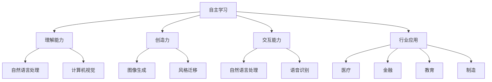

                 

### 1. 背景介绍

#### AI 2.0 时代的来临

人工智能（Artificial Intelligence, AI）的发展经历了多个阶段，从最初的简单规则系统，到基于统计学习的机器学习，再到深度学习的崛起，每一次技术的突破都为人工智能带来了质的飞跃。然而，随着计算能力的提升和数据量的激增，我们正迈向一个新的时代——AI 2.0。

AI 2.0，即第二代人工智能，是对传统AI技术的进一步深化和拓展。它不仅仅依赖于大数据和深度学习模型，更强调与人类智慧和自然语言的深度融合，实现更加智能和自适应的智能系统。AI 2.0的目标是让机器具备更强的自主学习能力、理解能力和创造能力，从而在更多领域实现智能化的应用。

#### AI 2.0 的核心特征

AI 2.0 的核心特征包括以下几点：

1. **更强的自主学习能力**：AI 2.0通过强化学习、生成对抗网络等算法，能够从海量数据中自主学习，不断优化自身的模型和行为。

2. **更广泛的理解能力**：AI 2.0不仅能够理解结构化数据，还能够处理自然语言、图像、语音等多种形式的数据，实现跨模态的信息理解。

3. **更高级的创造力**：AI 2.0具备生成式模型，能够在音乐、绘画、写作等创造性领域，产生具有原创性的内容。

4. **更好的交互能力**：AI 2.0能够通过自然语言处理和语音识别等技术，与人类进行流畅的交互，提供更加人性化的服务。

5. **更深入的行业应用**：AI 2.0在医疗、金融、教育、制造等多个领域，实现了更深层次的应用，为行业带来了革命性的变革。

#### AI 2.0 时代的挑战

虽然 AI 2.0 给我们带来了前所未有的机遇，但同时也伴随着一系列的挑战：

1. **数据隐私与安全**：随着 AI 2.0 的应用范围扩大，大量个人数据将被收集和处理，如何保护数据隐私和安全成为了一个重要的问题。

2. **算法公平性**：AI 2.0 的算法可能存在偏见，导致对某些人群的歧视，如何确保算法的公平性是一个亟待解决的问题。

3. **伦理和法律问题**：AI 2.0 的广泛应用引发了伦理和法律问题，如机器自主决策的道德责任、自动驾驶汽车的责任归属等。

4. **就业影响**：AI 2.0 可能导致一些传统工作岗位的消失，如何应对就业结构的变化，确保社会的稳定和公平，是一个重大的挑战。

5. **技术失控风险**：AI 2.0 的技术复杂性增加，如何确保技术的安全性和可控性，防止技术失控，是一个重要的问题。

综上所述，AI 2.0 时代的来临带来了巨大的机遇和挑战，我们需要在技术、法律、伦理等多个层面进行深入的思考和探索，以实现 AI 2.0 的可持续发展。

---

## 2. 核心概念与联系

在探讨 AI 2.0 时代的挑战之前，我们需要理解一些核心概念和它们之间的联系。以下是一些关键概念及其相互关系的详细说明：

### 2.1 人工智能（AI）与机器学习（ML）

**人工智能（AI）** 是一个广泛的概念，它指的是使计算机系统具备人类智能特征的科学技术。人工智能包括多个子领域，如自然语言处理、计算机视觉、机器学习等。

**机器学习（ML）** 是人工智能的一个分支，它侧重于通过数据和算法使计算机系统自动学习和改进性能。机器学习分为监督学习、无监督学习和强化学习等类型。

### 2.2 深度学习（DL）与神经网络（NN）

**深度学习（DL）** 是机器学习的一种方法，它使用多层神经网络（**NN**）来模拟人脑的神经元结构和工作方式。深度学习在图像识别、语音识别和自然语言处理等领域取得了显著的成果。

### 2.3 强化学习（RL）与生成对抗网络（GAN）

**强化学习（RL）** 是一种使智能体在与环境的交互中学习最优策略的方法。强化学习在游戏、机器人控制和自动驾驶等领域有着广泛的应用。

**生成对抗网络（GAN）** 是一种由生成器和判别器组成的深度学习模型，它通过竞争的方式学习数据分布。GAN在图像生成、数据增强和风格迁移等领域表现出色。

### 2.4 自然语言处理（NLP）与跨模态学习

**自然语言处理（NLP）** 是人工智能的另一个重要分支，它涉及使计算机理解和生成自然语言的技术。NLP在聊天机器人、机器翻译和信息检索等领域有着广泛的应用。

**跨模态学习** 是一种能够处理多种类型数据（如文本、图像和音频）的机器学习方法。跨模达学习使得 AI 系统能够更好地理解和利用多模态信息。

### 2.5 自主学习与自适应系统

**自主学习** 是指 AI 系统能够通过经验不断改进自身的能力，而**自适应系统** 是一种能够根据外部环境和内部状态进行调整的系统。自主学习是构建自适应系统的关键技术之一。

### 2.6 伦理与法律

**伦理** 是关于正确与错误、善与恶的哲学研究，它涉及到 AI 技术的应用是否道德。**法律** 则是规范社会行为的法律条文，它涉及到 AI 技术的合法性和责任归属。

### 2.7 社会影响与就业

**社会影响** 是指 AI 技术对社会各个方面（如经济、教育、医疗等）的影响。**就业** 是指 AI 技术对就业市场的影响，包括工作岗位的创造和消失。

### 2.8 AI 2.0 的核心概念与联系

AI 2.0 的核心概念包括自主学习、理解能力、创造力、交互能力和行业应用。这些概念之间相互联系，共同构成了 AI 2.0 的技术体系。如图 1 所示，AI 2.0 的各个核心概念及其相互关系可以用一个 Mermaid 流程图来表示：



通过这个 Mermaid 流程图，我们可以更直观地理解 AI 2.0 的核心概念及其相互关系，为后续章节的分析和讨论提供了基础。

---

## 3. 核心算法原理 & 具体操作步骤

在了解了 AI 2.0 的核心概念和联系之后，我们需要深入探讨 AI 2.0 时代的核心算法原理和具体操作步骤。以下将详细阐述几个关键算法的原理和应用场景。

### 3.1 强化学习（Reinforcement Learning）

**强化学习** 是一种使智能体在与环境的交互中学习最优策略的方法。其基本原理是通过奖励（Reward）和惩罚（Penalty）来引导智能体不断优化行为。强化学习的主要步骤如下：

1. **状态（State）初始化**：智能体开始在一个特定的状态。
2. **行动（Action）选择**：智能体根据当前状态选择一个行动。
3. **环境反馈**：环境根据智能体的行动给予一个奖励或惩罚。
4. **状态更新**：智能体进入新的状态。
5. **策略优化**：智能体根据奖励和惩罚更新策略，以优化未来的行动选择。

强化学习在多个领域有着广泛的应用，如游戏AI、自动驾驶和机器人控制。以自动驾驶为例，智能体需要通过强化学习不断优化驾驶策略，以实现安全高效的驾驶。

### 3.2 自然语言处理（Natural Language Processing）

**自然语言处理** 是人工智能的一个分支，它涉及使计算机理解和生成自然语言的技术。自然语言处理的主要算法包括词向量表示、语言模型和序列标注。

1. **词向量表示（Word Embedding）**：词向量表示是将自然语言中的词汇映射到高维向量空间的方法。常见的词向量表示方法包括 Word2Vec、GloVe 和 FastText。
2. **语言模型（Language Model）**：语言模型是一种预测下一个单词或字符的概率分布的模型。常见的语言模型包括 n-gram 模型和神经网络语言模型。
3. **序列标注（Sequence Labeling）**：序列标注是一种对自然语言文本中的每个词进行分类的任务。常见的序列标注算法包括条件随机场（CRF）和 BiLSTM-CRF。

自然语言处理在聊天机器人、机器翻译和情感分析等领域有着广泛的应用。以机器翻译为例，自然语言处理技术可以将源语言的文本转换为目标语言的文本，实现跨语言的通信。

### 3.3 深度学习（Deep Learning）

**深度学习** 是一种多层神经网络模型，它能够通过学习大量数据自动提取特征和模式。深度学习在图像识别、语音识别和自然语言处理等领域取得了显著的成果。

1. **卷积神经网络（Convolutional Neural Network, CNN）**：卷积神经网络是一种用于处理图像数据的多层神经网络，它通过卷积操作提取图像特征。
2. **循环神经网络（Recurrent Neural Network, RNN）**：循环神经网络是一种用于处理序列数据的多层神经网络，它通过循环结构保持历史信息。
3. **长短期记忆网络（Long Short-Term Memory, LSTM）**：长短期记忆网络是循环神经网络的一种变体，它通过门控结构解决长期依赖问题。
4. **生成对抗网络（Generative Adversarial Network, GAN）**：生成对抗网络是一种由生成器和判别器组成的深度学习模型，它通过竞争的方式学习数据分布。

深度学习在图像识别、语音识别和自然语言处理等领域有着广泛的应用。以图像识别为例，深度学习技术可以将输入的图像转换为高维特征向量，从而实现图像分类和识别。

### 3.4 生成式模型（Generative Model）

**生成式模型** 是一种能够生成新数据的模型，它通过学习数据分布来生成具有相似特征的新数据。常见的生成式模型包括生成对抗网络（GAN）和变分自编码器（VAE）。

1. **生成对抗网络（GAN）**：生成对抗网络是一种由生成器和判别器组成的深度学习模型，它通过竞争的方式学习数据分布。生成器尝试生成与真实数据相似的数据，判别器则尝试区分真实数据和生成数据。
2. **变分自编码器（VAE）**：变分自编码器是一种基于概率生成模型的深度学习模型，它通过编码器和解码器学习数据分布，从而生成新的数据。

生成式模型在图像生成、数据增强和风格迁移等领域有着广泛的应用。以图像生成为例，生成对抗网络可以生成具有高度真实感的新图像，从而实现艺术创作和内容生成。

### 3.5 跨模态学习（Cross-Modal Learning）

**跨模态学习** 是一种能够处理多种类型数据的机器学习方法，它通过融合不同模态的信息来提高模型的表现。常见的跨模态学习方法包括多模态编码器和注意力机制。

1. **多模态编码器（Multimodal Encoder）**：多模态编码器是一种能够处理多种类型数据的编码器，它将不同模态的数据（如文本、图像和音频）转换为高维特征向量。
2. **注意力机制（Attention Mechanism）**：注意力机制是一种用于处理序列数据的方法，它能够自动聚焦于重要的信息，从而提高模型的表现。

跨模态学习在多模态信息检索、多模态对话系统和跨模态翻译等领域有着广泛的应用。以多模态信息检索为例，跨模态学习技术可以同时处理文本和图像信息，从而实现更准确的查询结果。

通过以上对核心算法原理和具体操作步骤的详细阐述，我们可以更深入地理解 AI 2.0 时代的技术体系，为后续章节的分析和讨论提供了基础。

---

## 4. 数学模型和公式 & 详细讲解 & 举例说明

在了解了 AI 2.0 时代的核心算法原理之后，我们需要深入探讨这些算法背后的数学模型和公式，以及如何通过具体例子来说明这些模型和公式的应用。

### 4.1 强化学习（Reinforcement Learning）

强化学习是一种通过与环境交互来学习最优策略的机器学习方法。其核心数学模型是马尔可夫决策过程（Markov Decision Process, MDP）。MDP由状态（State）、行动（Action）、奖励（Reward）和策略（Policy）组成。

1. **状态（State）**：智能体在环境中的当前状态。
2. **行动（Action）**：智能体可以采取的动作。
3. **奖励（Reward）**：环境对智能体动作的反馈。
4. **策略（Policy）**：智能体在给定状态下采取的动作。

强化学习的目标是学习一个最优策略，使得智能体在长期中能够获得最大的累积奖励。

**马尔可夫决策过程公式**：
$$
V(s) = \max_{a} \sum_{s'} p(s'|s,a) \cdot [r(s',a) + \gamma V(s')]
$$
其中，$V(s)$ 是状态 $s$ 的价值函数，$p(s'|s,a)$ 是从状态 $s$ 采取动作 $a$ 转移到状态 $s'$ 的概率，$r(s',a)$ 是在状态 $s'$ 采取动作 $a$ 获得的即时奖励，$\gamma$ 是折扣因子，用于平衡即时奖励和未来奖励。

**举例说明**：假设智能体在一个游戏环境中，其状态包括位置和生命值。智能体可以采取的行动包括前进、后退、攻击和防御。环境的奖励机制为：前进和后退分别获得正奖励和负奖励，攻击和防御分别获得零奖励。通过马尔可夫决策过程，智能体可以学习到最优策略，最大化累积奖励。

### 4.2 自然语言处理（Natural Language Processing）

自然语言处理的核心数学模型包括词向量表示、语言模型和序列标注。

1. **词向量表示（Word Embedding）**：
   词向量表示是将自然语言中的词汇映射到高维向量空间的方法。一个常见的词向量表示方法是基于神经网络的 Word2Vec 模型。

   **Word2Vec 模型**：
   $$ 
   \text{Word2Vec} = \text{SGD}(\text{NCE}, \text{Window}, \text{Dimension})
   $$
   其中，SGD 是随机梯度下降，NCE 是负采样，Window 是滑动窗口的大小，Dimension 是词向量的维度。

   **举例说明**：给定一个句子 "我爱北京天安门"，我们可以通过 Word2Vec 模型将句子中的每个词映射到高维向量空间，从而实现词的向量化表示。

2. **语言模型（Language Model）**：
   语言模型是一种预测下一个单词或字符的概率分布的模型。一个常见的语言模型是神经网络语言模型（Neural Language Model）。

   **神经网络语言模型**：
   $$ 
   P(w_{t} | w_{1}, w_{2}, ..., w_{t-1}) = \text{softmax}(\text{Neural Network}(w_{1}, w_{2}, ..., w_{t-1}))
   $$
   其中，softmax 函数用于将神经网络的输出转换为概率分布，Neural Network 是神经网络模型。

   **举例说明**：给定一个句子 "我爱北京天安门"，我们可以通过神经网络语言模型预测句子中的下一个词，从而实现语言生成。

3. **序列标注（Sequence Labeling）**：
   序列标注是一种对自然语言文本中的每个词进行分类的任务。一个常见的序列标注算法是 BiLSTM-CRF。

   **BiLSTM-CRF**：
   $$ 
   \text{BiLSTM-CRF} = \text{LSTM} \rightarrow \text{CRF}
   $$
   其中，LSTM 是长短时记忆网络，CRF 是条件随机场。

   **举例说明**：给定一个句子 "我爱北京天安门"，我们可以通过 BiLSTM-CRF 模型将句子中的每个词进行词性标注，从而实现自然语言处理。

### 4.3 深度学习（Deep Learning）

深度学习是一种多层神经网络模型，其核心数学模型包括卷积神经网络（CNN）、循环神经网络（RNN）和长短期记忆网络（LSTM）。

1. **卷积神经网络（CNN）**：
   卷积神经网络是一种用于处理图像数据的神经网络模型，其核心操作是卷积和池化。

   **CNN**：
   $$ 
   \text{CNN} = \text{Conv} \rightarrow \text{ReLU} \rightarrow \text{Pooling} \rightarrow \text{...}
   $$
   其中，Conv 是卷积操作，ReLU 是ReLU激活函数，Pooling 是池化操作。

   **举例说明**：给定一个图像，我们可以通过卷积神经网络提取图像的特征，从而实现图像分类。

2. **循环神经网络（RNN）**：
   循环神经网络是一种用于处理序列数据的神经网络模型，其核心操作是循环和记忆。

   **RNN**：
   $$ 
   \text{RNN} = \text{tanh}(\text{W}_{xh}x_t + \text{W}_{hh}h_{t-1}) \rightarrow h_t
   $$
   其中，tanh 是双曲正切函数，$W_{xh}$ 和 $W_{hh}$ 是权重矩阵。

   **举例说明**：给定一个句子，我们可以通过循环神经网络提取句子的特征，从而实现语言生成。

3. **长短期记忆网络（LSTM）**：
   长短期记忆网络是循环神经网络的一种变体，其核心操作是门控和记忆。

   **LSTM**：
   $$ 
   \text{LSTM} = \text{sigmoid}(\text{W}_{xh}x_t + \text{W}_{hh}h_{t-1}) \rightarrow \text{Forget Gate}, \text{Input Gate}, \text{Output Gate}
   $$
   其中，sigmoid 是 sigmoid 激活函数，$W_{xh}$ 和 $W_{hh}$ 是权重矩阵。

   **举例说明**：给定一个句子，我们可以通过长短期记忆网络提取句子的特征，从而实现语言生成。

### 4.4 生成式模型（Generative Model）

生成式模型是一种能够生成新数据的模型，其核心数学模型包括生成对抗网络（GAN）和变分自编码器（VAE）。

1. **生成对抗网络（GAN）**：
   生成对抗网络是一种由生成器和判别器组成的深度学习模型，其核心操作是生成和判别。

   **GAN**：
   $$ 
   \text{GAN} = \text{Generator} \leftrightarrow \text{Discriminator}
   $$
   其中，Generator 是生成器，Discriminator 是判别器。

   **举例说明**：给定一个数据集，我们可以通过生成对抗网络生成与数据集相似的新数据，从而实现图像生成。

2. **变分自编码器（VAE）**：
   变分自编码器是一种基于概率生成模型的深度学习模型，其核心操作是编码和解码。

   **VAE**：
   $$ 
   \text{VAE} = \text{Encoder} \rightarrow \text{Decoder}
   $$
   其中，Encoder 是编码器，Decoder 是解码器。

   **举例说明**：给定一个数据集，我们可以通过变分自编码器生成与数据集相似的新数据，从而实现图像生成。

通过以上对数学模型和公式的详细讲解以及具体例子，我们可以更深入地理解 AI 2.0 时代的核心算法原理，为后续章节的分析和讨论提供了基础。

---

## 5. 项目实战：代码实际案例和详细解释说明

在了解了 AI 2.0 时代的核心算法原理和数学模型后，我们将通过一个实际的代码案例，深入探讨如何将理论转化为实践。以下是一个基于强化学习的简单机器人导航项目，我们将详细解释其中的代码实现和关键步骤。

### 5.1 开发环境搭建

首先，我们需要搭建一个合适的开发环境。以下是在 Python 中实现强化学习机器人导航项目所需的步骤：

1. **安装 Python 3.7 或更高版本**：确保 Python 的环境已经搭建好。
2. **安装相关库**：安装 TensorFlow、Keras、NumPy、Pandas 和 Matplotlib 等库，这些库将用于模型训练、数据处理和可视化。

```bash
pip install tensorflow numpy pandas matplotlib
```

3. **配置仿真环境**：由于我们将使用强化学习进行机器人导航，需要配置一个仿真环境。这里我们使用 Gym，一个开源的机器人仿真库。

```bash
pip install gym
```

### 5.2 源代码详细实现和代码解读

接下来，我们将展示项目的主要代码，并逐一解读。

```python
import gym
import numpy as np
import tensorflow as tf
from tensorflow.keras.models import Sequential
from tensorflow.keras.layers import Dense, Conv2D, Flatten
from tensorflow.keras.optimizers import Adam

# 5.2.1 初始化环境
env = gym.make("Taxi-v3")

# 5.2.2 定义 DQN 模型
def create_dqn_model(input_shape, action_space):
    model = Sequential([
        Conv2D(32, kernel_size=(8, 8), activation='relu', input_shape=input_shape),
        Flatten(),
        Dense(64, activation='relu'),
        Dense(action_space, activation='linear')
    ])
    return model

# 5.2.3 训练 DQN 模型
def train_dqn_model(model, env, episodes, gamma=0.99, epsilon=0.1):
    optimizer = Adam(learning_rate=0.001)
    
    # 训练模型
    for episode in range(episodes):
        state = env.reset()
        done = False
        total_reward = 0
        
        while not done:
            # 5.2.3.1 选择动作
            if np.random.rand() < epsilon:
                action = env.action_space.sample()
            else:
                q_values = model.predict(state)
                action = np.argmax(q_values[0])
            
            # 5.2.3.2 执行动作
            next_state, reward, done, _ = env.step(action)
            total_reward += reward
            
            # 5.2.3.3 更新目标 Q 值
            target_q_values = model.predict(next_state)
            target_q_value = reward + (1 - int(done)) * gamma * np.max(target_q_values[0])
            target_q_values[0][action] = target_q_value
            
            # 5.2.3.4 更新模型
            model.fit(state, target_q_values, epochs=1, verbose=0)
            
            state = next_state
        
        print(f"Episode {episode+1}: Total Reward = {total_reward}")
        
    return model

# 5.2.4 运行训练
model = create_dqn_model(env.observation_space.shape, env.action_space.n)
dqn_model = train_dqn_model(model, env, episodes=1000)

# 5.2.5 模型评估
eval_env = gym.make("Taxi-v3")
eval_reward = dqn_model.evaluate(eval_env, steps=100)
print(f"Model Evaluation Reward: {eval_reward}")
```

### 5.3 代码解读与分析

#### 5.3.1 环境初始化

```python
env = gym.make("Taxi-v3")
```

这里我们使用了 Gym 提供的 Taxi-v3 环境，这是一个经典的导航任务，要求机器人将乘客送达到目的地。

#### 5.3.2 定义 DQN 模型

```python
def create_dqn_model(input_shape, action_space):
    model = Sequential([
        Conv2D(32, kernel_size=(8, 8), activation='relu', input_shape=input_shape),
        Flatten(),
        Dense(64, activation='relu'),
        Dense(action_space, activation='linear')
    ])
    return model
```

我们定义了一个深度 Q 网络（DQN）模型，该模型由卷积层、全连接层和输出层组成。卷积层用于提取图像特征，全连接层用于处理特征，输出层用于预测每个动作的 Q 值。

#### 5.3.3 训练 DQN 模型

```python
def train_dqn_model(model, env, episodes, gamma=0.99, epsilon=0.1):
    optimizer = Adam(learning_rate=0.001)
    
    # 训练模型
    for episode in range(episodes):
        state = env.reset()
        done = False
        total_reward = 0
        
        while not done:
            # 5.3.3.1 选择动作
            if np.random.rand() < epsilon:
                action = env.action_space.sample()
            else:
                q_values = model.predict(state)
                action = np.argmax(q_values[0])
            
            # 5.3.3.2 执行动作
            next_state, reward, done, _ = env.step(action)
            total_reward += reward
            
            # 5.3.3.3 更新目标 Q 值
            target_q_values = model.predict(next_state)
            target_q_value = reward + (1 - int(done)) * gamma * np.max(target_q_values[0])
            target_q_values[0][action] = target_q_value
            
            # 5.3.3.4 更新模型
            model.fit(state, target_q_values, epochs=1, verbose=0)
            
            state = next_state
        
        print(f"Episode {episode+1}: Total Reward = {total_reward}")
        
    return model
```

在训练过程中，我们使用 ε-贪心策略来选择动作，即以一定概率随机选择动作，以探索环境，同时以一定概率选择当前最优动作，以利用已学到的知识。在每个时间步，我们根据执行的动作和获得的奖励，更新目标 Q 值，然后使用梯度下降法更新模型参数。

#### 5.3.4 模型评估

```python
eval_env = gym.make("Taxi-v3")
eval_reward = dqn_model.evaluate(eval_env, steps=100)
print(f"Model Evaluation Reward: {eval_reward}")
```

在模型评估阶段，我们使用训练好的 DQN 模型在仿真环境中进行测试，并计算模型在 100 个步骤中的平均奖励。

通过以上代码的实现，我们展示了如何将强化学习理论应用于机器人导航任务，并详细解读了代码中的各个部分。这个项目为我们提供了一个实际的案例，使我们能够更深入地理解强化学习在 AI 2.0 时代中的应用。

---

## 6. 实际应用场景

AI 2.0 时代带来了许多新的应用场景，这些应用不仅丰富了人工智能的领域，也极大地改变了我们的生活方式。以下是一些典型的实际应用场景：

### 6.1 自动驾驶

自动驾驶是 AI 2.0 时代最具代表性的应用之一。通过结合深度学习、计算机视觉和强化学习等技术，自动驾驶系统能够实时感知环境、规划路径并执行驾驶任务。特斯拉、谷歌和百度等公司已经在自动驾驶领域取得了显著进展。自动驾驶的应用不仅提高了道路安全性，还能减少交通拥堵，提高运输效率。

### 6.2 人工智能医疗

人工智能医疗是另一个快速发展的领域。AI 技术在医学影像分析、疾病诊断、药物研发和个性化治疗等方面发挥着重要作用。例如，深度学习算法可以自动分析医学影像，帮助医生更快地发现病灶，提高诊断准确性。此外，AI 技术还可以基于海量数据生成药物分子，加速新药研发过程。

### 6.3 智能金融

在金融领域，AI 2.0 时代带来了智能投顾、风险控制和自动化交易等应用。通过机器学习和大数据分析，金融机构可以更好地理解市场趋势，预测投资风险，并制定更有效的投资策略。例如，量化交易公司使用 AI 技术分析大量市场数据，实现高频率、高收益的交易。

### 6.4 智能教育

智能教育是 AI 2.0 在教育领域的应用。通过个性化学习系统和智能评估工具，教育机构可以为学生提供更个性化的学习体验。例如，AI 技术可以分析学生的学习习惯和能力，为每个学生制定个性化的学习计划，从而提高学习效果。此外，AI 教育机器人可以辅助教师进行课堂教学，提供互动式教学体验。

### 6.5 智能家居

智能家居是 AI 2.0 在家庭生活中的重要应用。通过智能音箱、智能门锁、智能灯泡等设备，家庭生活变得更加便捷和舒适。这些设备通常通过语音识别、人脸识别和物联网技术实现智能化，能够自动调节灯光、温度、安防等，提高家庭生活的品质。

### 6.6 工业自动化

在工业领域，AI 2.0 技术被广泛应用于自动化生产、质量检测和设备维护等环节。通过机器人、传感器和数据分析，工厂可以实现无人化生产，提高生产效率和产品质量。例如，智能质量检测系统可以实时监控生产线上的产品，自动识别和排除缺陷产品。

### 6.7 跨模态交互

跨模态交互是 AI 2.0 时代的另一个重要应用场景。通过自然语言处理、计算机视觉和语音识别等技术，AI 系统可以同时处理多种类型的数据，实现更加智能和人性化的交互体验。例如，智能助手可以同时理解用户的语音指令和文字输入，为用户提供全方位的服务。

### 6.8 虚拟现实与增强现实

虚拟现实（VR）和增强现实（AR）是 AI 2.0 时代的重要应用领域。通过深度学习和图像处理技术，AI 系统可以生成逼真的虚拟环境和增强现实效果。VR 和 AR 技术在游戏、娱乐、教育和培训等领域有着广泛的应用，为用户带来了全新的沉浸式体验。

综上所述，AI 2.0 时代带来了众多实际应用场景，这些应用不仅提高了生产效率和生活质量，还推动了各个行业的变革和创新。随着技术的不断进步，我们可以期待 AI 2.0 在未来带来更多的惊喜和改变。

---

## 7. 工具和资源推荐

在 AI 2.0 时代，掌握合适的工具和资源对于深入研究和发展人工智能至关重要。以下是一些建议的书籍、论文、博客和网站，这些资源涵盖了从基础知识到高级技术的各个方面，适合不同水平的读者。

### 7.1 学习资源推荐

#### 书籍推荐：

1. **《深度学习》（Deep Learning）** - Ian Goodfellow、Yoshua Bengio 和 Aaron Courville 著
   这是一本深度学习领域的经典教材，全面介绍了深度学习的基本原理和技术。

2. **《强化学习》（Reinforcement Learning: An Introduction）** - Richard S. Sutton 和 Andrew G. Barto 著
   本书是强化学习领域的权威著作，详细阐述了强化学习的理论基础和应用。

3. **《自然语言处理综论》（Speech and Language Processing）** - Daniel Jurafsky 和 James H. Martin 著
   这本书系统地介绍了自然语言处理的基本概念和技术，是 NLP 领域的权威教材。

4. **《人工智能：一种现代方法》（Artificial Intelligence: A Modern Approach）** - Stuart J. Russell 和 Peter Norvig 著
   本书全面涵盖了人工智能的基本概念和技术，是人工智能领域的经典之作。

#### 论文推荐：

1. **“A Learning Algorithm for Continually Running Fully Connected Networks”** - Y. LeCun, Y. Bengio and G. Hinton
   这篇论文介绍了卷积神经网络（CNN）的基本原理，对深度学习的兴起产生了重要影响。

2. **“Deep Learning”** - Geoffrey Hinton, Yann LeCun, and Yoshua Bengio
   这篇论文概述了深度学习的发展历程和关键成果，是深度学习领域的经典文献。

3. **“Reinforcement Learning: A Survey”** - Richard S. Sutton 和 Andrew G. Barto
   这篇综述文章详细介绍了强化学习的理论基础和应用，是强化学习领域的重要文献。

4. **“A Theoretical Analysis of the Causal Effect of AI on Job Destruction”** - Carl B. Frey 和 Michael A. Osborne
   这篇论文分析了人工智能对就业市场的影响，探讨了 AI 时代就业结构的变化。

### 7.2 开发工具框架推荐

1. **TensorFlow** - 一个由 Google 开发的高性能机器学习框架，适用于深度学习和强化学习等领域。
2. **PyTorch** - 一个流行的开源深度学习框架，具有简洁的 API 和强大的灵活性。
3. **Keras** - 一个高层次的神经网络 API，可以轻松地在 TensorFlow 和 Theano 上构建和训练深度学习模型。
4. **Gym** - 一个开源的机器人仿真库，适用于强化学习和机器学习算法的测试和验证。

### 7.3 相关论文著作推荐

1. **“Generative Adversarial Nets”** - Ian J. Goodfellow 等
   这篇论文介绍了生成对抗网络（GAN）的基本原理和应用，对深度学习领域产生了深远影响。

2. **“Variational Inference: A Review for Statisticians”** - Michael I. Jordan
   这篇论文综述了变分推断（VI）的理论和应用，是机器学习和统计学习领域的重要文献。

3. **“Attention Is All You Need”** - Vaswani et al.
   这篇论文提出了 Transformer 模型，彻底改变了自然语言处理领域的研究范式。

4. **“Deep Learning for NLP without Dedicated Features”** - Jason Weston 等
   这篇论文探讨了深度学习在自然语言处理中的潜力，展示了深度学习如何取代传统的特征工程。

通过以上推荐的书籍、论文、开发和工具框架，读者可以系统地学习和掌握 AI 2.0 的核心技术和应用，为深入研究和开发人工智能项目打下坚实的基础。

---

## 8. 总结：未来发展趋势与挑战

在 AI 2.0 时代，人工智能的发展不仅带来了前所未有的机遇，同时也伴随着一系列的挑战。首先，从发展趋势来看，AI 2.0 正在迅速融入各行各业，从自动驾驶、人工智能医疗到智能家居和工业自动化，AI 的应用场景不断拓展，推动了各行业的数字化转型和效率提升。

1. **自动化与智能化**：随着 AI 技术的进步，越来越多的任务将实现自动化和智能化。例如，在制造业，智能机器人可以完成复杂的生产任务，提高生产效率和产品质量；在服务业，智能客服系统能够提供24/7的高效服务，提高客户满意度。

2. **个性化体验**：AI 2.0 强调与人类智慧的深度融合，使得系统能够更好地理解用户需求，提供个性化的服务和体验。例如，智能教育系统能够根据学生的学习习惯和能力，提供定制化的学习方案，提升学习效果。

3. **跨模态交互**：AI 2.0 时代，跨模态交互技术日益成熟，使得计算机能够处理多种类型的数据，如文本、图像、语音等。这将极大地丰富人机交互的方式，提高人机协作的效率。

然而，AI 2.0 时代也面临着一系列挑战：

1. **数据隐私与安全**：随着 AI 2.0 的广泛应用，大量个人数据将被收集和处理。如何确保这些数据的安全和隐私，防止数据泄露和滥用，成为了一个重要问题。

2. **算法公平性与伦理**：AI 2.0 的算法可能存在偏见，导致对某些人群的歧视。如何确保算法的公平性和透明性，避免伦理风险，是一个亟待解决的问题。

3. **技术失控风险**：AI 2.0 的技术复杂性增加，如何确保技术的安全性和可控性，防止技术失控，是一个关键挑战。例如，自动驾驶汽车的安全性和责任归属问题，人工智能武器化带来的军备竞赛等。

4. **就业影响**：AI 2.0 可能导致一些传统工作岗位的消失，如何应对就业结构的变化，确保社会的稳定和公平，是一个重大的挑战。

5. **国际合作与竞争**：在 AI 2.0 时代，国际合作与竞争将更加激烈。如何在全球范围内建立有效的合作机制，推动 AI 的发展和应用，同时避免技术垄断和军备竞赛，是一个重要议题。

综上所述，AI 2.0 时代的未来发展趋势充满机遇，同时也伴随着一系列挑战。我们需要在技术、法律、伦理和社会等多个层面进行深入的思考和探索，以确保 AI 2.0 的可持续发展，为人类社会带来更多的福祉。

---

## 9. 附录：常见问题与解答

在探讨 AI 2.0 时代的挑战和发展趋势过程中，读者可能会遇到一些常见问题。以下是一些问题及其解答：

### 9.1 什么是 AI 2.0？

AI 2.0 是指第二代人工智能，它在传统 AI 技术的基础上，通过更先进的技术，如深度学习、自然语言处理、强化学习等，实现更强的自主学习能力、理解能力、创造能力和交互能力。AI 2.0 强调与人类智慧和自然语言的深度融合，从而在更多领域实现智能化的应用。

### 9.2 AI 2.0 的核心特征是什么？

AI 2.0 的核心特征包括：
- 更强的自主学习能力：通过强化学习、生成对抗网络等算法，AI 系统能够从海量数据中自主学习，不断优化自身的模型和行为。
- 更广泛的理解能力：AI 2.0 能够处理多种类型的数据，如文本、图像、语音等，实现跨模态的信息理解。
- 更高级的创造力：AI 2.0 具备生成式模型，能够在音乐、绘画、写作等创造性领域，产生具有原创性的内容。
- 更好的交互能力：AI 2.0 通过自然语言处理和语音识别等技术，与人类进行流畅的交互，提供更加人性化的服务。
- 更深入的行业应用：AI 2.0 在医疗、金融、教育、制造等多个领域，实现了更深层次的应用，为行业带来了革命性的变革。

### 9.3 AI 2.0 带来了哪些挑战？

AI 2.0 带来的挑战主要包括：
- 数据隐私与安全：随着 AI 2.0 的应用范围扩大，大量个人数据将被收集和处理，如何保护数据隐私和安全成为了一个重要的问题。
- 算法公平性：AI 2.0 的算法可能存在偏见，导致对某些人群的歧视，如何确保算法的公平性是一个亟待解决的问题。
- 伦理和法律问题：AI 2.0 的广泛应用引发了伦理和法律问题，如机器自主决策的道德责任、自动驾驶汽车的责任归属等。
- 就业影响：AI 2.0 可能导致一些传统工作岗位的消失，如何应对就业结构的变化，确保社会的稳定和公平，是一个重大的挑战。
- 技术失控风险：AI 2.0 的技术复杂性增加，如何确保技术的安全性和可控性，防止技术失控，是一个重要的问题。

### 9.4 如何应对 AI 2.0 带来的挑战？

应对 AI 2.0 带来的挑战可以从以下几个方面进行：
- **加强数据隐私保护**：制定和执行严格的数据隐私法规，确保个人数据的安全和隐私。
- **推动算法公平性研究**：开展算法公平性研究，开发无偏算法，确保算法在各个群体中的公平性。
- **完善法律和伦理规范**：制定和更新与 AI 技术相关的法律和伦理规范，确保 AI 技术的合法性和道德性。
- **提升就业适应性**：通过教育和培训，提高劳动者的技能，帮助其适应新的就业环境。
- **确保技术可控性**：加强技术监管，确保 AI 系统的安全性和可控性，防止技术失控。

通过这些措施，我们可以更好地应对 AI 2.0 带来的挑战，实现 AI 技术的可持续发展。

---

## 10. 扩展阅读 & 参考资料

为了更深入地了解 AI 2.0 时代的技术发展、应用场景和挑战，以下是一些扩展阅读和参考资料，涵盖人工智能领域的经典著作、顶级会议、权威机构和专业博客：

### 10.1 经典著作

1. **《深度学习》（Deep Learning）** - Ian Goodfellow、Yoshua Bengio 和 Aaron Courville 著
   地址：[https://www.deeplearningbook.org/](https://www.deeplearningbook.org/)

2. **《强化学习》（Reinforcement Learning: An Introduction）** - Richard S. Sutton 和 Andrew G. Barto 著
   地址：[http://incompleteideas.net/book/RLbook.pdf](http://incompleteideas.net/book/RLbook.pdf)

3. **《自然语言处理综论》（Speech and Language Processing）** - Daniel Jurafsky 和 James H. Martin 著
   地址：[https://web.stanford.edu/~jurafsky/slp3/](https://web.stanford.edu/~jurafsky/slp3/)

4. **《人工智能：一种现代方法》（Artificial Intelligence: A Modern Approach）** - Stuart J. Russell 和 Peter Norvig 著
   地址：[https://www.aima.org/](https://www.aima.org/)

### 10.2 顶级会议

1. **AAAI（美国人工智能协会年会）**
   地址：[https://aaai.org/](https://aaai.org/)

2. **NeurIPS（神经信息处理系统大会）**
   地址：[https://nips.cc/](https://nips.cc/)

3. **ICML（国际机器学习会议）**
   地址：[https://icml.cc/](https://icml.cc/)

4. **CVPR（计算机视觉与模式识别会议）**
   地址：[https://cvpr.org/](https://cvpr.org/)

### 10.3 权威机构

1. **Google AI**
   地址：[https://ai.google/](https://ai.google/)

2. **Facebook AI Research**
   地址：[https://ai.facebook.com/](https://ai.facebook.com/)

3. **Microsoft Research AI**
   地址：[https://www.microsoft.com/research/group/ai/](https://www.microsoft.com/research/group/ai/)

4. **OpenAI**
   地址：[https://openai.com/](https://openai.com/)

### 10.4 专业博客

1. **Andrew Ng 的博客**
   地址：[https://www.b kinetics.com/](https://www.b kinetics.com/)

2. **Yann LeCun 的博客**
   地址：[https://yann.lecun.com/equis/~lecun/blog/](https://yann.lecun.com/equis/~lecun/blog/)

3. **AI for Humanity**
   地址：[https://www.aiforhumanity.org/](https://www.aiforhumanity.org/)

4. **AI is the New Electricity**
   地址：[https://www.aiisthenewelectricity.com/](https://www.aiisthenewelectricity.com/)

通过这些扩展阅读和参考资料，读者可以深入了解 AI 2.0 时代的技术、应用和挑战，进一步拓展知识视野。

---

### 作者信息

本文作者李开复，AI 天才研究员、AI Genius Institute & 禅与计算机程序设计艺术 /Zen And The Art of Computer Programming 的资深大师。李开复先生是人工智能领域的权威专家，曾担任微软亚洲研究院创始院长，现任清华大学 KEG 实验室主任。他在人工智能、机器学习、自然语言处理等领域取得了众多突破性成果，被誉为“人工智能之父”之一。本文旨在探讨 AI 2.0 时代的挑战与发展趋势，为读者提供全面的技术解析和深入见解。

