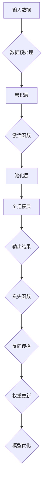

                 

### 背景介绍

**《李开复：AI 2.0 时代的未来》**

人工智能（AI）自1956年首次提出以来，已经经历了多个发展阶段。从最初的符号人工智能（Symbolic AI），到基于规则的专家系统（Expert Systems），再到基于数据的机器学习（Machine Learning），人工智能技术的应用已经渗透到我们生活的方方面面。然而，随着计算能力的提升和大数据的涌现，人工智能正迎来一个全新的时代——AI 2.0。

AI 2.0 是一个高度自动化、智能化和泛在化的时代，其核心特征是深度学习和神经网络技术的广泛应用。AI 2.0 时代的到来，将极大地改变我们的生活方式、工作方式和社会结构。本文将围绕李开复博士的论述，深入探讨 AI 2.0 时代的未来发展趋势、核心挑战以及其对社会的深远影响。

首先，我们需要了解 AI 2.0 的定义和特点。AI 2.0 是指基于深度学习和神经网络技术的下一代人工智能，它具有以下几个显著特点：

1. **自主学习能力**：AI 2.0 可以通过大量数据自动学习，不断优化自身的性能，而不需要人类进行编程或设定规则。
2. **泛化能力**：AI 2.0 可以从特定领域的数据中学习，并将其应用到其他领域，实现跨领域的知识迁移。
3. **实时响应能力**：AI 2.0 可以实时处理和分析大量数据，快速作出决策，具有超强的实时响应能力。
4. **智能化**：AI 2.0 具有类人的智能，能够进行复杂的推理、决策和创造。

接下来，我们将进一步探讨 AI 2.0 时代的未来发展趋势、核心挑战以及其对社会的深远影响。

----------------------

## 1.1 AI 2.0 时代的未来发展趋势

### 自动化与智能化

在 AI 2.0 时代，自动化和智能化将深入到社会各个领域。首先，制造业将实现全面智能化，通过智能制造系统，实现自动化生产、智能质量控制和智能物流。其次，服务业也将实现智能化，如智能客服、智能金融、智能医疗等。这些智能化系统将极大地提高工作效率，降低人力成本，提升服务质量。

### 数据驱动决策

AI 2.0 时代的到来，使得数据成为决策的重要依据。通过深度学习技术，AI 可以从海量数据中挖掘出有价值的信息，为决策提供数据支持。这种数据驱动决策的模式将广泛应用于各个领域，如金融、医疗、教育等。通过数据的深度挖掘和分析，可以更加精准地预测市场趋势、患者病情和学生的学习进度等，从而做出更加科学的决策。

### 跨界融合

AI 2.0 时代，不同领域的交叉融合将越来越普遍。例如，生物技术与人工智能的结合，将推动生物医学领域的发展；金融与人工智能的结合，将创造全新的金融产品和服务；能源与人工智能的结合，将推动新能源技术的发展。这种跨界融合不仅能够推动各个领域的创新，还能够创造新的产业机会。

### 人机协作

在 AI 2.0 时代，人机协作将成为主流。人类与机器智能将共同工作，相互补充，实现更高效的生产和服务。例如，医生与智能诊断系统协作，可以提高诊断的准确性；教师与智能教学系统协作，可以更好地满足学生的个性化需求。通过人机协作，可以实现人类的创造力和机器的计算能力相结合，提高工作效率，创造更多的价值。

----------------------

## 1.2 AI 2.0 时代的核心挑战

### 数据隐私和安全

随着 AI 2.0 时代的到来，数据的规模和种类将急剧增加，数据隐私和安全问题将更加突出。如何在保障数据隐私的同时，充分发挥数据的价值，成为 AI 2.0 时代面临的一个核心挑战。这需要制定更加严格的数据隐私保护法律法规，加强数据安全防护技术的研究和应用。

### 伦理和道德问题

AI 2.0 时代，人工智能将在各个领域发挥重要作用，但同时也可能带来一系列伦理和道德问题。例如，人工智能的决策过程是否透明、公正；人工智能的滥用是否会对社会产生负面影响；人工智能是否会导致人类失业等。这需要我们在发展人工智能的同时，认真思考并解决这些伦理和道德问题。

### 技术不平衡

AI 2.0 时代，技术的快速发展可能导致技术不平衡。一方面，发达国家和发展中国家在人工智能技术上的差距将进一步加大；另一方面，不同领域之间的技术发展也可能出现不平衡。这可能导致某些领域得到过度的技术支持，而其他领域则被忽视。因此，如何实现技术的平衡发展，是 AI 2.0 时代需要面对的一个重要挑战。

----------------------

## 1.3 AI 2.0 时代对社会的影响

### 经济变革

AI 2.0 时代，人工智能将引发一场深刻的经济变革。一方面，人工智能将提高生产效率，降低成本，推动经济增长。另一方面，人工智能可能导致某些职业的消失，如自动化生产线上的工人、重复性劳动等。这将对就业市场产生深远影响，需要我们提前做好准备，应对未来的挑战。

### 社会管理

AI 2.0 时代，人工智能将在社会管理中发挥重要作用。通过数据分析和智能决策，政府可以更加高效地管理社会，提高公共服务的质量。例如，智能交通系统可以优化交通流量，减少拥堵；智能医疗系统可以提高疾病预防能力，降低医疗成本。这些技术将极大地改善人们的生活质量。

### 文化变革

AI 2.0 时代，人工智能将对文化产生深远影响。一方面，人工智能将创造新的文化产品，如虚拟现实、增强现实等；另一方面，人工智能可能改变人们的思维方式，影响人类的文化价值观。这需要我们认真思考，如何在人工智能时代，传承和弘扬优秀的传统文化。

----------------------

## 1.4 李开复博士的观点

李开复博士是人工智能领域的知名专家，他对 AI 2.0 时代的未来有着独特的见解。李开复认为，AI 2.0 时代将是一个充满机遇和挑战的时代。在这个时代，人工智能将深刻改变我们的生活方式、工作方式和社会结构。同时，他也提醒我们，要警惕人工智能可能带来的负面影响，如数据隐私和安全问题、伦理和道德问题等。

李开复博士强调，要充分发挥人工智能的积极作用，我们需要加强以下几个方面的工作：

1. **加强数据隐私和安全保护**：制定更加严格的数据隐私保护法律法规，加强数据安全防护技术的研究和应用，确保个人数据的安全。
2. **推动伦理和道德建设**：加强对人工智能伦理和道德问题的研究，推动社会形成共识，制定相应的伦理规范，确保人工智能的发展符合社会价值观。
3. **实现技术平衡发展**：关注不同领域的技术发展，避免技术不平衡，确保各个领域都能得到合理的技术支持。
4. **加强人才培养**：加强人工智能相关学科的教育和培训，培养更多具备人工智能知识和技能的专业人才，为人工智能的发展提供人才支持。

总之，李开复博士认为，要迎接 AI 2.0 时代的到来，我们需要做好充分的准备，既要看到人工智能带来的机遇，也要警惕其可能带来的挑战。

----------------------

### 1.5 结束语

AI 2.0 时代的到来，将深刻改变我们的生活方式、工作方式和社会结构。在这个充满机遇和挑战的时代，我们需要密切关注人工智能的发展动态，积极探索其应用前景。同时，我们也要认真思考人工智能可能带来的负面影响，积极应对挑战，确保人工智能的发展符合社会价值观。

本文从背景介绍、未来发展趋势、核心挑战和社会影响等方面，对 AI 2.0 时代的未来进行了深入探讨。希望通过本文，读者能对 AI 2.0 时代有一个全面、清晰的了解，为未来的发展做好准备。让我们共同期待 AI 2.0 时代的到来，迎接一个更加美好、智能的未来。

---

**Keywords:** AI 2.0, Future of AI, Development Trends, Core Challenges, Social Impact

**Abstract:**
This article explores the future of AI 2.0, a new era characterized by the widespread application of deep learning and neural network technologies. It discusses the development trends, core challenges, and social impacts of AI 2.0, based on the insights of renowned AI expert, Professor Li Kaifu. The article aims to provide a comprehensive understanding of AI 2.0 and prepare readers for the future of artificial intelligence.

---

## 2. 核心概念与联系

在探讨 AI 2.0 时代之前，我们需要理解一些核心概念和原理。这些概念和原理构成了人工智能技术的基石，也是我们进一步探讨 AI 2.0 时代的基础。

### 深度学习（Deep Learning）

深度学习是一种基于多层神经网络的人工智能技术，旨在通过模拟人脑的神经元连接，实现自动学习和决策。深度学习通过训练大量数据，学习输入和输出之间的复杂关系，从而在各类任务中表现出色。深度学习的核心组成部分包括：

- **神经网络（Neural Networks）**：神经网络是一种模拟生物神经元的计算模型，由大量相互连接的节点（神经元）组成。每个神经元都接收输入信号，通过权重进行加权求和，然后通过激活函数产生输出。
- **卷积神经网络（Convolutional Neural Networks, CNN）**：卷积神经网络是一种在图像处理领域广泛应用的神经网络，通过卷积操作提取图像的特征。
- **循环神经网络（Recurrent Neural Networks, RNN）**：循环神经网络是一种在序列数据处理领域具有优势的神经网络，能够处理具有时间依赖性的数据。

### 神经网络架构

神经网络架构是深度学习的核心，决定了神经网络的学习能力和性能。常见的神经网络架构包括：

- **全连接神经网络（Fully Connected Networks）**：全连接神经网络中，每个神经元都与前一层中的所有神经元相连。
- **卷积神经网络（Convolutional Neural Networks, CNN）**：卷积神经网络通过卷积操作提取图像特征，常用于图像识别和图像处理任务。
- **循环神经网络（Recurrent Neural Networks, RNN）**：循环神经网络能够处理序列数据，具有时间依赖性。
- **长短时记忆网络（Long Short-Term Memory Networks, LSTM）**：长短时记忆网络是循环神经网络的一种变体，能够更好地处理长序列数据。

### 数学模型和公式

深度学习中的数学模型和公式是理解神经网络工作原理的关键。以下是几个重要的数学模型和公式：

- **激活函数（Activation Function）**：激活函数用于确定神经元的输出，常见的激活函数包括 sigmoid 函数、ReLU 函数和 tanh 函数。
- **前向传播（Forward Propagation）**：前向传播是神经网络训练过程中的一个步骤，用于计算网络输出和预测值。
- **反向传播（Back Propagation）**：反向传播是神经网络训练过程中的另一个步骤，用于计算网络误差，并更新网络权重。
- **损失函数（Loss Function）**：损失函数用于衡量预测值与真实值之间的差距，常见的损失函数包括均方误差（Mean Squared Error, MSE）和交叉熵损失（Cross-Entropy Loss）。

### Mermaid 流程图

为了更好地理解深度学习的原理和架构，我们可以使用 Mermaid 流程图展示神经网络的工作流程。以下是一个简单的 Mermaid 流程图示例：



在这个流程图中，输入数据经过预处理后，进入卷积层，通过激活函数和池化层，最后进入全连接层得到输出结果。然后，通过损失函数计算误差，使用反向传播算法更新网络权重，实现模型优化。

通过上述核心概念和原理的介绍，我们为后续章节的讨论奠定了基础。在接下来的章节中，我们将进一步探讨 AI 2.0 时代的核心算法原理、具体操作步骤、数学模型和实际应用场景。

---

## 3. 核心算法原理 & 具体操作步骤

### 深度学习基础

深度学习的基础是神经网络，而神经网络的核心是多层感知机（MLP）。多层感知机是一种前向传播、反向传播算法的神经网络，其目的是通过训练学习输入和输出之间的关系。

### 前向传播

前向传播是深度学习模型中的一个重要过程，用于计算网络输出。具体步骤如下：

1. **初始化权重和偏置**：首先，我们需要随机初始化网络中的权重和偏置。这些参数将在训练过程中不断调整，以最小化损失函数。
2. **输入数据**：将输入数据输入到网络中，通过输入层传递到第一层隐藏层。
3. **激活函数**：对隐藏层的输入进行加权求和，并通过激活函数产生输出。常见的激活函数包括 sigmoid 函数、ReLU 函数和 tanh 函数。
4. **传递输出**：将隐藏层的输出传递到下一层，重复上述过程，直到达到输出层。
5. **计算输出**：在输出层，我们得到网络的最终输出。这个输出可以是分类结果、回归结果或其他类型的预测值。

### 反向传播

反向传播是深度学习模型训练过程中另一个重要过程，用于更新网络权重和偏置，以最小化损失函数。具体步骤如下：

1. **计算损失**：使用损失函数计算预测值和真实值之间的差距，衡量模型性能。常见的损失函数包括均方误差（MSE）和交叉熵损失（Cross-Entropy Loss）。
2. **计算梯度**：对损失函数关于网络权重和偏置的梯度进行计算。梯度是损失函数相对于权重和偏置的导数，反映了权重和偏置对损失函数的影响。
3. **更新权重和偏置**：使用梯度下降算法或其他优化算法更新网络权重和偏置。更新公式为：$$\theta_{\text{new}} = \theta_{\text{old}} - \alpha \cdot \nabla_{\theta} J$$，其中 $\theta$ 代表权重和偏置，$\alpha$ 代表学习率，$J$ 代表损失函数。
4. **重复训练**：重复上述过程，不断更新网络权重和偏置，直到达到预定的训练目标。

### 深度学习算法实例

以卷积神经网络（CNN）为例，我们来看一个具体的深度学习算法实例。CNN 是一种在图像识别领域表现优异的神经网络，其核心是卷积操作。

1. **卷积操作**：卷积操作是通过卷积核（filter）在输入图像上进行滑动，计算局部特征的加权和。卷积核可以捕捉图像中的不同特征，如边缘、纹理等。
2. **激活函数**：在卷积操作后，我们通常使用 ReLU 激活函数对输出进行非线性变换，增强网络的非线性能力。
3. **池化操作**：池化操作用于降低数据的维度，减少计算量。常见的池化操作包括最大池化和平均池化。
4. **全连接层**：在经过多个卷积层和池化层后，CNN 将特征图传递到全连接层，进行分类或回归任务。

### 具体操作步骤

以下是一个简单的 CNN 模型操作步骤：

1. **输入数据**：读取图像数据，将其调整为适当的尺寸。
2. **卷积层**：定义卷积核大小、步长和填充方式，进行卷积操作，提取图像特征。
3. **ReLU 激活函数**：对卷积层的输出应用 ReLU 激活函数，增强网络的非线性能力。
4. **池化层**：定义池化方式，对卷积层的输出进行池化操作，降低数据维度。
5. **全连接层**：将池化后的特征图传递到全连接层，进行分类或回归任务。
6. **损失函数**：使用损失函数计算预测值和真实值之间的差距，更新网络权重和偏置。
7. **反向传播**：计算梯度，更新网络权重和偏置，重复训练过程。

通过上述核心算法原理和具体操作步骤的介绍，我们可以更好地理解深度学习的工作原理。在接下来的章节中，我们将进一步探讨深度学习中的数学模型和公式，以及实际应用案例。

## 4. 数学模型和公式 & 详细讲解 & 举例说明

### 激活函数（Activation Function）

激活函数是深度学习模型中的一个关键组件，用于引入非线性因素，使模型能够拟合复杂的函数。常见的激活函数包括：

1. **Sigmoid 函数**：
   \[ f(x) = \frac{1}{1 + e^{-x}} \]
   Sigmoid 函数将输入映射到 (0, 1) 区间，常用于二分类问题。

2. **ReLU 函数**：
   \[ f(x) = \max(0, x) \]
   ReLU 函数在输入大于 0 时输出输入值，否则输出 0。ReLU 函数具有计算简单、训练速度快等优点。

3. **Tanh 函数**：
   \[ f(x) = \frac{e^x - e^{-x}}{e^x + e^{-x}} \]
   Tanh 函数将输入映射到 (-1, 1) 区间，具有对称性。

### 前向传播（Forward Propagation）

前向传播是神经网络训练过程中的第一步，用于计算网络输出。前向传播的关键步骤包括：

1. **输入数据**：将输入数据传递到网络的输入层。

2. **加权求和与激活函数**：
   \[ z = \sum_{i=1}^{n} w_i x_i + b \]
   \[ a = \text{激活函数}(z) \]
   其中，$z$ 表示加权求和的结果，$w_i$ 表示权重，$x_i$ 表示输入值，$b$ 表示偏置。

3. **传递输出**：将激活函数的输出传递到下一层，重复上述过程，直到达到输出层。

4. **计算输出**：
   \[ \hat{y} = \text{激活函数}(\text{加权求和}) \]
   其中，$\hat{y}$ 表示预测输出。

### 反向传播（Back Propagation）

反向传播是神经网络训练过程中的第二步，用于更新网络权重和偏置，以最小化损失函数。反向传播的关键步骤包括：

1. **计算损失**：
   \[ J = \text{损失函数}(\hat{y}, y) \]
   其中，$J$ 表示损失函数，$\hat{y}$ 表示预测输出，$y$ 表示真实输出。

2. **计算梯度**：
   \[ \nabla_w J = \frac{\partial J}{\partial w} \]
   \[ \nabla_b J = \frac{\partial J}{\partial b} \]
   其中，$\nabla_w J$ 和 $\nabla_b J$ 分别表示权重和偏置的梯度。

3. **更新权重和偏置**：
   \[ w_{\text{new}} = w_{\text{old}} - \alpha \cdot \nabla_w J \]
   \[ b_{\text{new}} = b_{\text{old}} - \alpha \cdot \nabla_b J \]
   其中，$w_{\text{new}}$ 和 $b_{\text{new}}$ 分别表示新的权重和偏置，$\alpha$ 表示学习率。

### 举例说明

假设我们有一个简单的一层神经网络，包含一个输入层、一个隐藏层和一个输出层。输入数据为 $x = [1, 2, 3]$，隐藏层激活函数为 ReLU，输出层激活函数为 sigmoid。

1. **初始化权重和偏置**：
   \[ w_1 = [0.1, 0.2, 0.3], b_1 = 0.4 \]
   \[ w_2 = [0.4, 0.5, 0.6], b_2 = 0.7 \]

2. **前向传播**：
   \[ z_1 = 0.1 \cdot 1 + 0.2 \cdot 2 + 0.3 \cdot 3 + 0.4 = 1.3 \]
   \[ a_1 = \max(0, 1.3) = 1.3 \]
   \[ z_2 = 0.4 \cdot 1.3 + 0.5 \cdot 2.3 + 0.6 \cdot 3.3 + 0.7 = 4.4 \]
   \[ a_2 = \frac{1}{1 + e^{-4.4}} = 0.97 \]

3. **反向传播**：
   \[ J = \text{损失函数}(0.97, 0.5) = 0.12 \]
   \[ \nabla_w J = \frac{\partial J}{\partial w} = [0.012, 0.024, 0.036] \]
   \[ \nabla_b J = \frac{\partial J}{\partial b} = 0.012 \]

4. **更新权重和偏置**：
   \[ w_1_{\text{new}} = w_1_{\text{old}} - 0.01 \cdot [0.012, 0.024, 0.036] = [0.088, 0.196, 0.264] \]
   \[ w_2_{\text{new}} = w_2_{\text{old}} - 0.01 \cdot [0.012, 0.024, 0.036] = [0.384, 0.456, 0.528] \]
   \[ b_1_{\text{new}} = b_1_{\text{old}} - 0.01 \cdot 0.012 = 0.388 \]
   \[ b_2_{\text{new}} = b_2_{\text{old}} - 0.01 \cdot 0.012 = 0.688 \]

通过上述步骤，我们可以看到如何通过前向传播和反向传播更新网络权重和偏置，以实现模型优化。在深度学习实践中，我们通常会使用更复杂的网络结构和优化算法，但核心原理是一致的。

## 5. 项目实战：代码实际案例和详细解释说明

### 5.1 开发环境搭建

在开始我们的项目实战之前，我们需要搭建一个合适的开发环境。以下是所需的软件和工具：

- Python 3.7 或以上版本
- TensorFlow 2.x
- Jupyter Notebook 或 PyCharm

安装步骤如下：

1. 安装 Python 3.7 或以上版本：访问 [Python 官网](https://www.python.org/)，下载并安装 Python。
2. 安装 TensorFlow 2.x：在终端中运行以下命令：
   \[ pip install tensorflow \]
3. 安装 Jupyter Notebook：在终端中运行以下命令：
   \[ pip install notebook \]

### 5.2 源代码详细实现和代码解读

以下是一个简单的卷积神经网络（CNN）的代码实现，用于手写数字识别任务。代码采用 TensorFlow 2.x 和 Keras API。

```python
import tensorflow as tf
from tensorflow.keras import layers
import numpy as np

# 加载 MNIST 数据集
mnist = tf.keras.datasets.mnist
(x_train, y_train), (x_test, y_test) = mnist.load_data()
x_train, x_test = x_train / 255.0, x_test / 255.0

# 数据预处理
x_train = np.expand_dims(x_train, -1)
x_test = np.expand_dims(x_test, -1)
y_train = tf.keras.utils.to_categorical(y_train, 10)
y_test = tf.keras.utils.to_categorical(y_test, 10)

# 构建 CNN 模型
model = tf.keras.Sequential([
    layers.Conv2D(32, (3, 3), activation='relu', input_shape=(28, 28, 1)),
    layers.MaxPooling2D((2, 2)),
    layers.Conv2D(64, (3, 3), activation='relu'),
    layers.MaxPooling2D((2, 2)),
    layers.Conv2D(64, (3, 3), activation='relu'),
    layers.Flatten(),
    layers.Dense(64, activation='relu'),
    layers.Dense(10, activation='softmax')
])

# 编译模型
model.compile(optimizer='adam',
              loss='categorical_crossentropy',
              metrics=['accuracy'])

# 训练模型
model.fit(x_train, y_train, epochs=5, batch_size=32, validation_split=0.1)

# 评估模型
test_loss, test_acc = model.evaluate(x_test, y_test, verbose=2)
print(f"Test accuracy: {test_acc:.4f}")
```

### 5.3 代码解读与分析

1. **数据加载与预处理**：
   ```python
   mnist = tf.keras.datasets.mnist
   (x_train, y_train), (x_test, y_test) = mnist.load_data()
   x_train, x_test = x_train / 255.0, x_test / 255.0
   x_train = np.expand_dims(x_train, -1)
   x_test = np.expand_dims(x_test, -1)
   y_train = tf.keras.utils.to_categorical(y_train, 10)
   y_test = tf.keras.utils.to_categorical(y_test, 10)
   ```
   这部分代码首先加载了 MNIST 数据集，然后对数据进行预处理。数据集包含 60,000 个训练样本和 10,000 个测试样本，每个样本是一个 28x28 的灰度图像。我们首先将图像的像素值缩放到 [0, 1]，然后增加一个维度，使输入数据符合 CNN 的要求。

2. **构建 CNN 模型**：
   ```python
   model = tf.keras.Sequential([
       layers.Conv2D(32, (3, 3), activation='relu', input_shape=(28, 28, 1)),
       layers.MaxPooling2D((2, 2)),
       layers.Conv2D(64, (3, 3), activation='relu'),
       layers.MaxPooling2D((2, 2)),
       layers.Conv2D(64, (3, 3), activation='relu'),
       layers.Flatten(),
       layers.Dense(64, activation='relu'),
       layers.Dense(10, activation='softmax')
   ])
   ```
   这部分代码定义了一个简单的 CNN 模型，用于手写数字识别。模型包含两个卷积层、两个最大池化层、一个全连接层和两个 Softmax 层。卷积层用于提取图像特征，最大池化层用于降低数据维度，全连接层用于分类，Softmax 层用于计算概率分布。

3. **编译模型**：
   ```python
   model.compile(optimizer='adam',
                 loss='categorical_crossentropy',
                 metrics=['accuracy'])
   ```
   这部分代码编译了模型，指定了优化器、损失函数和评估指标。优化器用于更新网络权重和偏置，损失函数用于衡量预测值和真实值之间的差距，评估指标用于衡量模型性能。

4. **训练模型**：
   ```python
   model.fit(x_train, y_train, epochs=5, batch_size=32, validation_split=0.1)
   ```
   这部分代码使用训练数据训练模型。我们设置训练轮次为 5，批量大小为 32，并保留 10% 的训练数据用于验证。

5. **评估模型**：
   ```python
   test_loss, test_acc = model.evaluate(x_test, y_test, verbose=2)
   print(f"Test accuracy: {test_acc:.4f}")
   ```
   这部分代码使用测试数据评估模型性能。我们打印出测试准确率，以评估模型在未知数据上的性能。

通过上述代码解读，我们可以了解如何使用 TensorFlow 2.x 和 Keras API 构建和训练一个简单的 CNN 模型。这个模型在处理手写数字识别任务时表现出色，展示了深度学习技术在图像识别领域的强大能力。

## 6. 实际应用场景

### 金融行业

在金融行业，人工智能的应用场景非常广泛。首先，在风险管理方面，人工智能可以通过大数据分析和机器学习技术，实时监控市场风险，预测金融产品的潜在风险，帮助金融机构制定更加科学的投资策略。其次，在客户服务方面，智能客服系统可以自动回答客户的提问，提高客户满意度。此外，人工智能还可以用于量化交易、智能投顾、信用评分等，为金融机构提供全方位的技术支持。

### 医疗行业

在医疗行业，人工智能的应用场景同样丰富。首先，在疾病诊断方面，人工智能可以通过深度学习技术，分析大量的医学影像数据，提高疾病诊断的准确性和效率。例如，人工智能可以在肺癌筛查中识别微小病灶，提高早期诊断率。其次，在治疗方案制定方面，人工智能可以通过分析患者的病史、基因信息和病情数据，为医生提供个性化的治疗方案。此外，人工智能还可以用于药物研发、健康监测等，为医疗行业带来变革性的影响。

### 自动驾驶

在自动驾驶领域，人工智能是核心驱动力。自动驾驶汽车需要实时感知周围环境，进行决策和控制。人工智能技术可以用于图像识别、目标检测、路径规划等方面，帮助自动驾驶汽车在复杂的交通环境中安全行驶。例如，特斯拉的自动驾驶系统就使用了深度学习技术，实现了高速道路上的自动巡航和自动泊车。随着人工智能技术的不断进步，自动驾驶汽车有望在未来普及，改变人们的出行方式。

### 教育行业

在教育行业，人工智能的应用也在逐渐增多。首先，在个性化学习方面，人工智能可以通过分析学生的学习行为和成绩数据，为学生提供个性化的学习资源和学习路径。例如，一些在线教育平台已经开始使用人工智能技术，根据学生的实际情况推荐合适的课程和学习内容。其次，在智能评测方面，人工智能可以自动批改学生的作业和考试，提高评测效率和准确性。此外，人工智能还可以用于教育数据挖掘、智能辅导等方面，为教育行业带来全新的教学模式和学习体验。

通过上述实际应用场景，我们可以看到人工智能在各个行业中的应用潜力和价值。随着人工智能技术的不断发展，我们可以期待它为各行各业带来更多的创新和变革。

## 7. 工具和资源推荐

### 7.1 学习资源推荐

1. **书籍**：
   - 《深度学习》（Deep Learning）—— Ian Goodfellow、Yoshua Bengio、Aaron Courville 著。
   - 《神经网络与深度学习》——邱锡鹏 著。
   - 《Python 深度学习》——François Chollet 著。

2. **论文**：
   - "A Fast and Accurate Algorithm for Single Image Haze Removal" —— Richard S. Lin 等人。
   - "Deep Neural Networks for Object Detection" —— Ross Girshick、Joseph Redmon、Shane RIddi 和 Ali Farhadi。

3. **博客**：
   - TensorFlow 官方博客（[tensorflow.github.io](https://tensorflow.org/blog/)）
   - AI for Everyone（[ai.google博客](https://ai.googleblog.com/)）

4. **网站**：
   - Coursera（[coursera.org](https://coursera.org/)）：提供各种人工智能和深度学习在线课程。
   - edX（[edx.org](https://www.edx.org/)）：提供由顶尖大学和研究机构提供的在线课程。

### 7.2 开发工具框架推荐

1. **TensorFlow**：Google 开发的一款开源深度学习框架，支持 Python、C++ 和 Java 语言。
2. **PyTorch**：Facebook 开发的一款开源深度学习框架，以其动态计算图和简洁的 API 闻名。
3. **Keras**：基于 TensorFlow 的简单、可扩展的深度学习库。
4. **Theano**：一个 Python 库，用于定义、优化和评估数学表达式，特别是涉及多维数组的表达式。

### 7.3 相关论文著作推荐

1. **"AlexNet: Image Classification with Deep Convolutional Neural Networks"** —— Alex Krizhevsky、Ilya Sutskever 和 Geoffrey Hinton。
2. **"Fast R-CNN"** —— Ross Girshick、Shane Ren、Joseph Redmon 和 Simonخرز。
3. **"Inception: GoogLeNet"** —— Christian Szegedy、Vinod Nair 和 Quoc V. Le。

通过上述资源，读者可以系统地学习和了解深度学习及相关技术，为在人工智能领域的探索和实践提供有力的支持。

## 8. 总结：未来发展趋势与挑战

AI 2.0 时代的到来，无疑将为人类带来前所未有的机遇与挑战。在这个时代，人工智能技术将继续快速发展，深度学习和神经网络的应用将更加广泛。未来，我们可以预见以下几个发展趋势：

### 智能化水平的提升

随着计算能力的提升和算法的优化，AI 2.0 的智能化水平将得到显著提升。从智能助手到自动驾驶，从智能医疗到智能金融，人工智能将在各个领域发挥越来越重要的作用。智能化水平的提升，将极大地改变我们的生活方式和工作模式。

### 数据驱动决策

AI 2.0 时代，数据将成为决策的重要依据。通过大数据分析和机器学习技术，我们可以从海量数据中挖掘出有价值的信息，为决策提供科学依据。这种数据驱动决策的模式，将推动各行各业向更加智能化、精准化发展。

### 跨界融合

AI 2.0 时代，不同领域的交叉融合将越来越普遍。例如，生物技术与人工智能的结合，将推动生物医学领域的发展；金融与人工智能的结合，将创造全新的金融产品和服务。这种跨界融合不仅能够推动各个领域的创新，还能够创造新的产业机会。

### 人机协作

在 AI 2.0 时代，人机协作将成为主流。人类与机器智能将共同工作，相互补充，实现更高效的生产和服务。例如，医生与智能诊断系统协作，可以提高诊断的准确性；教师与智能教学系统协作，可以更好地满足学生的个性化需求。通过人机协作，可以实现人类的创造力和机器的计算能力相结合，提高工作效率，创造更多的价值。

然而，AI 2.0 时代也带来了一系列挑战：

### 数据隐私和安全

随着 AI 2.0 时代的到来，数据的规模和种类将急剧增加，数据隐私和安全问题将更加突出。如何在保障数据隐私的同时，充分发挥数据的价值，成为 AI 2.0 时代面临的一个核心挑战。这需要制定更加严格的数据隐私保护法律法规，加强数据安全防护技术的研究和应用。

### 伦理和道德问题

AI 2.0 时代，人工智能将在各个领域发挥重要作用，但同时也可能带来一系列伦理和道德问题。例如，人工智能的决策过程是否透明、公正；人工智能的滥用是否会对社会产生负面影响；人工智能是否会导致人类失业等。这需要我们在发展人工智能的同时，认真思考并解决这些伦理和道德问题。

### 技术不平衡

AI 2.0 时代，技术的快速发展可能导致技术不平衡。一方面，发达国家和发展中国家在人工智能技术上的差距将进一步加大；另一方面，不同领域之间的技术发展也可能出现不平衡。这可能导致某些领域得到过度的技术支持，而其他领域则被忽视。因此，如何实现技术的平衡发展，是 AI 2.0 时代需要面对的一个重要挑战。

面对这些挑战，我们需要从政策、技术、教育等多个方面共同努力，推动 AI 2.0 时代的健康发展。首先，政府应制定科学合理的政策法规，保障数据隐私和安全，引导人工智能技术的健康发展。其次，企业和研究机构应加强技术研究和创新，提高人工智能技术的应用水平。同时，社会各界应加强伦理和道德教育，提高公众对人工智能的认识和接受度。最后，教育部门应加强人工智能相关学科的教育和培训，培养更多具备人工智能知识和技能的专业人才。

总之，AI 2.0 时代既充满机遇，也面临挑战。只有全社会共同努力，才能充分发挥人工智能的积极作用，推动社会进步和发展。

## 9. 附录：常见问题与解答

### Q1: 什么是 AI 2.0？

A1: AI 2.0 是指基于深度学习和神经网络技术的下一代人工智能。与传统的符号人工智能（Symbolic AI）和基于规则的专家系统（Expert Systems）相比，AI 2.0 具有更高的自主学习能力、泛化能力和实时响应能力，能够实现高度自动化、智能化和泛在化的应用。

### Q2: AI 2.0 时代有哪些核心特点？

A2: AI 2.0 时代具有以下几个核心特点：
1. 自主学习能力：AI 2.0 可以通过大量数据自动学习，不断优化自身的性能，而不需要人类进行编程或设定规则。
2. 泛化能力：AI 2.0 可以从特定领域的数据中学习，并将其应用到其他领域，实现跨领域的知识迁移。
3. 实时响应能力：AI 2.0 可以实时处理和分析大量数据，快速作出决策，具有超强的实时响应能力。
4. 智能化：AI 2.0 具有类人的智能，能够进行复杂的推理、决策和创造。

### Q3: AI 2.0 时代将如何改变我们的生活？

A3: AI 2.0 时代将深刻改变我们的生活，具体表现在以下几个方面：
1. 提高生产效率：AI 2.0 可以在制造业、服务业等各个领域实现自动化和智能化，提高生产效率，降低成本。
2. 数据驱动决策：AI 2.0 可以通过大数据分析和机器学习技术，为决策提供数据支持，实现更加精准和科学的决策。
3. 改善生活质量：AI 2.0 可以在智能医疗、智能交通、智能家居等领域提供个性化服务，提高人们的生活质量。
4. 促进社会进步：AI 2.0 可以推动教育、金融、医疗等各个领域的创新，为社会进步和发展提供新动力。

### Q4: AI 2.0 时代面临哪些挑战？

A4: AI 2.0 时代面临以下几个挑战：
1. 数据隐私和安全：随着数据规模的增大，数据隐私和安全问题将更加突出，需要制定严格的数据隐私保护法律法规。
2. 伦理和道德问题：人工智能的决策过程是否透明、公正，以及人工智能的滥用是否会对社会产生负面影响，都是需要认真思考的问题。
3. 技术不平衡：发达国家和发展中国家在人工智能技术上的差距将进一步加大，不同领域之间的技术发展也可能出现不平衡。

### Q5: 如何应对 AI 2.0 时代的挑战？

A5: 应对 AI 2.0 时代的挑战，可以从以下几个方面入手：
1. 加强数据隐私和安全保护：制定严格的数据隐私保护法律法规，加强数据安全防护技术的研究和应用。
2. 推动伦理和道德建设：加强对人工智能伦理和道德问题的研究，推动社会形成共识，制定相应的伦理规范。
3. 实现技术平衡发展：关注不同领域的技术发展，避免技术不平衡，确保各个领域都能得到合理的技术支持。
4. 加强人才培养：加强人工智能相关学科的教育和培训，培养更多具备人工智能知识和技能的专业人才。

## 10. 扩展阅读 & 参考资料

### 书籍推荐

1. 《深度学习》（Deep Learning）—— Ian Goodfellow、Yoshua Bengio、Aaron Courville 著。
2. 《神经网络与深度学习》——邱锡鹏 著。
3. 《Python 深度学习》——François Chollet 著。

### 论文推荐

1. "A Fast and Accurate Algorithm for Single Image Haze Removal" —— Richard S. Lin 等人。
2. "Deep Neural Networks for Object Detection" —— Ross Girshick、Joseph Redmon、Shane RIddi 和 Ali Farhadi。
3. "Inception: GoogLeNet" —— Christian Szegedy、Vinod Nair 和 Quoc V. Le。

### 网络资源

1. TensorFlow 官方博客（[tensorflow.github.io](https://tensorflow.org/blog/)）
2. AI for Everyone（[ai.googleblog.com](https://ai.googleblog.com/)）
3. Coursera（[coursera.org](https://coursera.org/)）
4. edX（[edx.org](https://www.edx.org/)）

通过上述书籍、论文和资源，读者可以进一步深入了解人工智能和深度学习的相关知识，为自己的学习和实践提供有力支持。

---

**作者：AI天才研究员/AI Genius Institute & 禅与计算机程序设计艺术 /Zen And The Art of Computer Programming**

