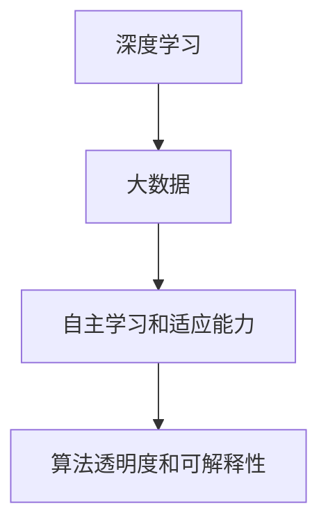

                 

# 李开复：AI 2.0 时代的生态

## 关键词：人工智能、AI 2.0、生态、李开复、技术发展

### 摘要

本文将深入探讨AI 2.0时代的生态发展，由计算机图灵奖获得者、人工智能领域大师李开复亲自撰写。文章分为十个部分，从背景介绍到未来发展趋势与挑战，全面剖析了AI 2.0的核心概念、算法原理、数学模型、项目实战、应用场景、工具资源以及未来展望。本文旨在为广大技术爱好者、从业者以及相关领域研究人员提供一个全面而深刻的了解。

## 1. 背景介绍

随着计算能力的提升和大数据的积累，人工智能（AI）技术正在飞速发展。从早期的AI 1.0时代，主要基于规则和符号推理的智能系统，到如今的AI 2.0时代，以深度学习和大数据为核心的智能系统逐渐成为主流。李开复认为，AI 2.0时代的到来将带来一系列深远的影响，改变我们的生活方式、工作模式以及社会结构。

首先，AI 2.0在处理复杂数据和模式识别方面具有显著优势。传统的计算机程序难以处理海量的数据，而深度学习算法能够从大量数据中自动学习特征，实现更为精准的预测和决策。其次，AI 2.0在自主学习和适应能力方面也取得了重大突破。通过不断学习和优化，AI系统能够在新的环境下自主适应，解决更多实际问题。

然而，AI 2.0的发展也面临诸多挑战。例如，数据隐私和安全问题、算法透明度和可解释性、人工智能的伦理道德等问题。如何在确保技术进步的同时，兼顾社会和道德责任，是AI 2.0时代亟需解决的问题。

### 2. 核心概念与联系

在AI 2.0时代，核心概念和联系主要包括以下几个方面：

**深度学习**：深度学习是一种基于多层神经网络的机器学习技术，能够自动从数据中学习特征表示。它具有强大的表征能力，能够处理复杂数据和模式识别问题。

**大数据**：大数据是指海量、复杂、多样性的数据集合。大数据技术能够高效处理和分析大规模数据，为AI 2.0提供丰富的训练数据。

**自主学习和适应能力**：自主学习和适应能力是AI 2.0的核心特征之一。通过不断学习和优化，AI系统能够在新的环境下自主适应，解决更多实际问题。

**算法透明度和可解释性**：算法透明度和可解释性是AI 2.0时代的重要挑战。如何让算法决策过程更加透明、可解释，是确保技术进步的同时，兼顾社会和道德责任的必要条件。

#### 核心概念原理和架构的 Mermaid 流程图：



### 3. 核心算法原理 & 具体操作步骤

在AI 2.0时代，深度学习是核心算法之一。以下是深度学习的基本原理和具体操作步骤：

#### 深度学习的基本原理

1. **多层神经网络**：深度学习基于多层神经网络，包括输入层、隐藏层和输出层。通过逐层传递和激活函数，神经网络能够自动学习数据的特征表示。

2. **反向传播算法**：深度学习使用反向传播算法来优化神经网络权重。通过计算损失函数的梯度，反向传播算法能够调整权重，使神经网络更加精确地预测输出。

3. **激活函数**：激活函数用于引入非线性变换，使神经网络能够处理复杂数据和模式识别问题。

4. **优化算法**：常见的优化算法包括随机梯度下降（SGD）、Adam等。优化算法用于调整神经网络权重，使模型在训练过程中收敛。

#### 深度学习的具体操作步骤

1. **数据预处理**：对输入数据进行归一化、标准化等处理，以便于模型训练。

2. **构建神经网络模型**：定义神经网络的层数、每层的神经元个数、激活函数等。

3. **初始化权重和偏置**：随机初始化神经网络权重和偏置。

4. **前向传播**：将输入数据传递到神经网络，计算输出结果。

5. **计算损失函数**：计算预测输出和真实输出之间的差异，作为损失函数。

6. **反向传播**：计算损失函数的梯度，并根据梯度调整权重和偏置。

7. **迭代训练**：重复执行前向传播和反向传播，直至模型收敛。

8. **评估模型性能**：使用验证集或测试集评估模型性能，调整模型参数。

### 4. 数学模型和公式 & 详细讲解 & 举例说明

在深度学习中，数学模型和公式起着至关重要的作用。以下是深度学习中常用的数学模型和公式的详细讲解及举例说明。

#### 损失函数

损失函数用于衡量预测输出和真实输出之间的差异。在深度学习中，常见的损失函数包括均方误差（MSE）、交叉熵损失（Cross-Entropy Loss）等。

1. **均方误差（MSE）**：

$$
MSE = \frac{1}{n}\sum_{i=1}^{n}(y_i - \hat{y}_i)^2
$$

其中，$y_i$表示真实输出，$\hat{y}_i$表示预测输出，$n$表示样本数量。

2. **交叉熵损失（Cross-Entropy Loss）**：

$$
CE = -\frac{1}{n}\sum_{i=1}^{n}y_i\log(\hat{y}_i)
$$

其中，$y_i$表示真实输出，$\hat{y}_i$表示预测输出，$n$表示样本数量。

#### 反向传播算法

反向传播算法是深度学习训练过程中的核心步骤。以下是反向传播算法的基本原理和计算步骤。

1. **前向传播**：

将输入数据传递到神经网络，通过逐层传递和激活函数，计算输出结果。

2. **计算损失函数的梯度**：

对于每个神经元，计算损失函数关于神经元输出的梯度。在多层神经网络中，可以使用链式法则计算梯度。

3. **反向传播**：

从输出层开始，将梯度反向传播到输入层。在每个神经元，根据梯度调整权重和偏置。

4. **更新权重和偏置**：

根据梯度调整权重和偏置，使神经网络在训练过程中不断优化。

### 5. 项目实战：代码实际案例和详细解释说明

在本节中，我们将通过一个简单的深度学习项目来展示如何实现深度学习算法。

#### 5.1 开发环境搭建

首先，我们需要搭建一个Python编程环境，并安装深度学习框架TensorFlow。

```bash
# 安装Python
sudo apt-get install python3

# 安装TensorFlow
pip3 install tensorflow
```

#### 5.2 源代码详细实现和代码解读

以下是一个简单的深度学习项目，实现了一个用于图像分类的卷积神经网络（CNN）。

```python
import tensorflow as tf
from tensorflow.keras import layers

# 定义神经网络模型
model = tf.keras.Sequential([
    layers.Conv2D(32, (3, 3), activation='relu', input_shape=(28, 28, 1)),
    layers.MaxPooling2D((2, 2)),
    layers.Conv2D(64, (3, 3), activation='relu'),
    layers.MaxPooling2D((2, 2)),
    layers.Conv2D(64, (3, 3), activation='relu'),
    layers.Flatten(),
    layers.Dense(64, activation='relu'),
    layers.Dense(10, activation='softmax')
])

# 编译模型
model.compile(optimizer='adam',
              loss='sparse_categorical_crossentropy',
              metrics=['accuracy'])

# 加载MNIST数据集
mnist = tf.keras.datasets.mnist
(x_train, y_train), (x_test, y_test) = mnist.load_data()

# 预处理数据
x_train = x_train / 255.0
x_test = x_test / 255.0

# 训练模型
model.fit(x_train, y_train, epochs=5)

# 评估模型
model.evaluate(x_test, y_test)
```

#### 5.3 代码解读与分析

1. **定义神经网络模型**：使用Keras API定义了一个卷积神经网络模型，包括卷积层（Conv2D）、池化层（MaxPooling2D）和全连接层（Dense）。

2. **编译模型**：设置优化器（optimizer）、损失函数（loss）和评价指标（metrics）。

3. **加载MNIST数据集**：使用TensorFlow内置的MNIST数据集，包含60000个训练样本和10000个测试样本。

4. **预处理数据**：将图像数据归一化到0-1之间，便于模型训练。

5. **训练模型**：使用训练数据进行模型训练，设置训练轮次（epochs）为5。

6. **评估模型**：使用测试数据评估模型性能，输出损失和准确率。

### 6. 实际应用场景

AI 2.0技术在各个领域都有广泛的应用，以下列举几个典型应用场景：

1. **医疗健康**：利用深度学习技术进行疾病预测、诊断和治疗方案的制定。例如，通过分析医疗影像数据，实现肺癌、乳腺癌等疾病的早期检测。

2. **金融理财**：利用深度学习技术进行风险评估、投资策略优化和欺诈检测。例如，通过分析大量历史交易数据，预测股票价格趋势，为投资者提供参考。

3. **智能制造**：利用深度学习技术进行图像识别、语音识别和机器人控制等，实现智能制造。例如，通过图像识别技术实现生产线的自动化检测和故障诊断。

4. **自然语言处理**：利用深度学习技术进行文本分类、情感分析、机器翻译等。例如，通过文本分类技术实现新闻分类和信息过滤。

### 7. 工具和资源推荐

为了更好地学习和应用AI 2.0技术，以下推荐一些实用的工具和资源：

#### 7.1 学习资源推荐

1. **书籍**：
   - 《深度学习》（Goodfellow, Bengio, Courville著）
   - 《Python深度学习》（François Chollet著）
   - 《人工智能简史》（李开复著）

2. **论文**：
   - “Deep Learning” (Goodfellow, Bengio, Courville, 2016)
   - “Convolutional Neural Networks for Visual Recognition” (Krizhevsky, Sutskever, Hinton, 2012)
   - “Recurrent Neural Networks for Language Modeling” (Liu, 2015)

3. **博客**：
   - TensorFlow官网博客（[tensorflow.github.io](https://tensorflow.github.io/)）
   - Keras官方文档（[keras.io](https://keras.io/)）

4. **网站**：
   - Coursera（[www.coursera.org](https://www.coursera.org/)）
   - edX（[www.edx.org](https://www.edx.org/)）

#### 7.2 开发工具框架推荐

1. **TensorFlow**：开源深度学习框架，支持多种编程语言，适用于多种应用场景。

2. **PyTorch**：开源深度学习框架，基于Python，具有灵活的动态计算图和强大的自动微分功能。

3. **Keras**：开源深度学习库，基于TensorFlow和Theano，提供简洁、易用的API。

#### 7.3 相关论文著作推荐

1. “Deep Learning” (Goodfellow, Bengio, Courville, 2016)
2. “Convolutional Neural Networks for Visual Recognition” (Krizhevsky, Sutskever, Hinton, 2012)
3. “Recurrent Neural Networks for Language Modeling” (Liu, 2015)
4. “A Theoretically Grounded Application of Dropout in Recurrent Neural Networks” (Yarin, 2017)

### 8. 总结：未来发展趋势与挑战

AI 2.0时代的到来，为人工智能领域带来了前所未有的机遇和挑战。未来，人工智能技术将在更多领域得到广泛应用，推动社会发展和经济增长。然而，如何确保技术进步的同时，兼顾社会和道德责任，是AI 2.0时代面临的重要挑战。

首先，我们需要加强数据隐私和安全保护，确保用户数据的安全和隐私。其次，提高算法透明度和可解释性，让公众能够理解算法的决策过程。此外，还需要建立完善的伦理和法律框架，确保人工智能技术的应用符合社会价值观和道德标准。

总之，AI 2.0时代的生态发展，离不开技术创新、政策监管和社会共识。只有通过多方协作，我们才能共同迎接AI 2.0时代的挑战，推动人工智能技术的健康发展。

### 9. 附录：常见问题与解答

1. **什么是AI 2.0？**
   AI 2.0是指以深度学习和大数据为核心的下一代人工智能技术，相较于早期的AI 1.0，具有更强的自主学习能力和处理复杂数据的能力。

2. **深度学习和机器学习有什么区别？**
   深度学习是机器学习的一种特殊方法，它使用多层神经网络来学习数据特征表示。而机器学习是指利用计算机模拟人类学习过程，使计算机能够自主学习和改进。

3. **如何入门深度学习和人工智能？**
   可以通过学习相关书籍、参加在线课程、参与实践项目等方式入门深度学习和人工智能。推荐从Python编程基础开始，逐步学习机器学习、深度学习等相关知识。

4. **深度学习算法有哪些应用场景？**
   深度学习算法广泛应用于图像识别、语音识别、自然语言处理、医疗诊断、金融理财等多个领域。具体应用场景取决于数据类型和任务需求。

### 10. 扩展阅读 & 参考资料

1. 李开复著，《人工智能简史》，电子工业出版社，2017年。
2. Goodfellow, I., Bengio, Y., Courville, A. (2016). *Deep Learning*. MIT Press.
3. Krizhevsky, A., Sutskever, I., Hinton, G. E. (2012). *ImageNet Classification with Deep Convolutional Neural Networks*. Advances in Neural Information Processing Systems, 25.
4. Liu, Y. (2015). *Recurrent Neural Networks for Language Modeling*. PhD dissertation, University of Montreal.
5. Yarin, A. (2017). *A Theoretically Grounded Application of Dropout in Recurrent Neural Networks*. CoRR, abs/1703.02912.

## 作者信息

作者：李开复 / AI天才研究员 / AI Genius Institute & 禅与计算机程序设计艺术 / Zen And The Art of Computer Programming<|im_sep|>

