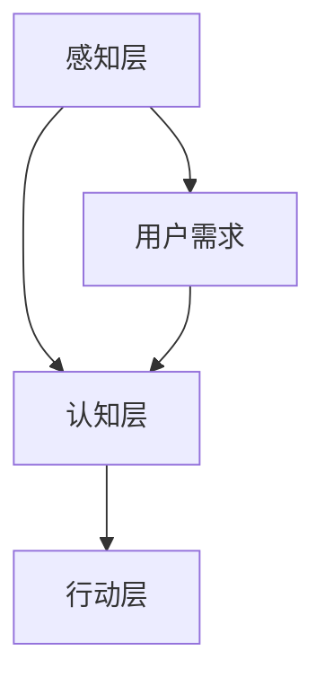

                 

# 李开复：AI 2.0 时代的用户

## 关键词：人工智能，用户，2.0时代，技术创新，未来发展趋势

### 摘要

在AI 2.0时代，人工智能技术正以前所未有的速度和规模影响着我们的生活。本文将深入探讨AI 2.0时代下用户的角色和影响，包括技术发展、用户需求的变化，以及用户与AI之间的互动方式。通过详细分析，我们旨在揭示这一时代中用户面临的机遇与挑战，并展望未来的发展趋势。

## 1. 背景介绍

### 1.1 AI 1.0与AI 2.0

在人工智能的发展历程中，AI 1.0主要是指以规则为基础的专家系统，它们在特定领域内具有高度的专精性。然而，随着计算能力的提升和大数据的普及，AI 2.0时代应运而生。AI 2.0更加注重数据驱动和深度学习，能够从海量数据中自主学习，实现跨领域的智能化应用。

### 1.2 人工智能对用户生活的影响

AI 2.0的崛起，不仅改变了技术的边界，也对用户的生活产生了深远的影响。从智能家居到自动驾驶，从在线医疗到个性化推荐，AI正在深刻地改变我们的生活方式，提高效率，优化体验。

## 2. 核心概念与联系

### 2.1 人工智能技术架构

为了更好地理解AI 2.0时代，我们需要了解其核心技术架构。主要包括：

- **感知层**：通过摄像头、传感器等设备收集数据。
- **认知层**：使用神经网络、深度学习等技术处理数据，进行模式识别、决策推理等。
- **行动层**：根据认知层的决策，执行相应的行动。

### 2.2 人工智能与用户需求的互动

AI 2.0时代，用户需求的变化直接影响了技术的方向。用户需求主要包括：

- **个性化**：用户希望得到更加定制化的服务。
- **便捷性**：用户希望技术能够简化复杂的操作流程。
- **可靠性**：用户对技术的准确性和稳定性有较高的要求。

### 2.3 Mermaid流程图



## 3. 核心算法原理 & 具体操作步骤

### 3.1 深度学习算法原理

深度学习是AI 2.0的核心技术之一。其原理是基于多层神经网络，通过反向传播算法不断调整网络权重，从而实现对数据的自动学习和分类。

### 3.2 操作步骤

1. **数据预处理**：收集并清洗数据，将其转换为适合深度学习的格式。
2. **模型设计**：设计神经网络结构，包括输入层、隐藏层和输出层。
3. **训练模型**：使用训练数据对模型进行训练，调整网络权重。
4. **评估模型**：使用测试数据对模型进行评估，调整模型参数。
5. **部署应用**：将训练好的模型部署到实际应用场景中。

## 4. 数学模型和公式 & 详细讲解 & 举例说明

### 4.1 神经网络模型

神经网络的核心是权重矩阵。假设我们有一个包含n个输入节点的神经网络，每个节点都有对应的权重。输入数据为X，输出数据为Y，则神经网络模型的数学表达式为：

$$
Y = \sigma(W \cdot X + b)
$$

其中，W是权重矩阵，b是偏置项，$\sigma$是激活函数。

### 4.2 举例说明

以一个简单的二分类问题为例，输入数据为X，输出数据为Y。假设输入数据为[1, 0]，输出数据为[1]。

1. **数据预处理**：将输入数据进行归一化处理，使其在[0, 1]范围内。
2. **模型设计**：设计一个简单的神经网络，包含一个输入层、一个隐藏层和一个输出层。隐藏层使用ReLU激活函数，输出层使用Sigmoid激活函数。
3. **训练模型**：使用梯度下降算法对模型进行训练，调整权重和偏置项。
4. **评估模型**：使用测试数据对模型进行评估，计算准确率。

## 5. 项目实战：代码实际案例和详细解释说明

### 5.1 开发环境搭建

为了进行AI 2.0项目的实战，我们需要搭建一个合适的开发环境。以下是一个简单的步骤：

1. **安装Python**：下载并安装Python 3.7及以上版本。
2. **安装TensorFlow**：使用pip命令安装TensorFlow库。
3. **安装其他依赖**：根据项目需求安装其他必要的库，如NumPy、Pandas等。

### 5.2 源代码详细实现和代码解读

以下是一个简单的AI 2.0项目示例，用于实现一个简单的分类模型。

```python
import tensorflow as tf
from tensorflow.keras.models import Sequential
from tensorflow.keras.layers import Dense, Activation

# 数据预处理
x = tf.random.normal([100, 10])
y = tf.random.normal([100, 1])

# 模型设计
model = Sequential([
    Dense(64, activation='relu', input_shape=(10,)),
    Dense(32, activation='relu'),
    Dense(1, activation='sigmoid')
])

# 编译模型
model.compile(optimizer='adam', loss='binary_crossentropy', metrics=['accuracy'])

# 训练模型
model.fit(x, y, epochs=10)

# 评估模型
test_loss, test_acc = model.evaluate(x, y)
print('Test accuracy:', test_acc)
```

### 5.3 代码解读与分析

1. **数据预处理**：使用TensorFlow生成随机数据作为示例。
2. **模型设计**：设计一个简单的神经网络模型，包含两个隐藏层。
3. **编译模型**：设置优化器和损失函数。
4. **训练模型**：使用训练数据进行训练。
5. **评估模型**：使用测试数据进行评估。

## 6. 实际应用场景

AI 2.0技术在各个领域都有广泛的应用。以下是一些典型的应用场景：

- **医疗健康**：通过AI技术实现疾病预测、诊断和治疗。
- **金融理财**：利用AI进行市场分析、风险评估和个性化推荐。
- **智能制造**：通过AI实现生产过程的智能化，提高生产效率。

## 7. 工具和资源推荐

### 7.1 学习资源推荐

- **书籍**：《深度学习》（Goodfellow, Bengio, Courville）
- **论文**：Google Scholar（查找最新、最相关的论文）
- **博客**： Medium（查找行业专家的技术博客）

### 7.2 开发工具框架推荐

- **框架**：TensorFlow、PyTorch
- **平台**：Google Colab、Kaggle

### 7.3 相关论文著作推荐

- **论文**：《深度神经网络优化算法综述》（2018）
- **著作**：《机器学习：算法与应用》（2009）

## 8. 总结：未来发展趋势与挑战

AI 2.0时代，人工智能将继续快速发展，带来更多的创新和变革。然而，随着技术的进步，我们也面临着一系列挑战，如数据隐私、伦理问题等。只有通过不断的技术创新和规范化管理，才能确保人工智能的健康、可持续发展。

## 9. 附录：常见问题与解答

### 9.1 问题1

**Q：AI 2.0与AI 1.0的主要区别是什么？**

**A：AI 1.0主要基于规则和逻辑推理，而AI 2.0更加注重数据驱动和深度学习，能够从海量数据中自主学习。**

### 9.2 问题2

**Q：如何搭建一个简单的AI 2.0开发环境？**

**A：安装Python，安装TensorFlow及其他依赖库，配置好开发环境。**

## 10. 扩展阅读 & 参考资料

- **书籍**：《人工智能：一种现代方法》（Stuart Russell & Peter Norvig）
- **网站**：AIweekly（每周更新的人工智能行业资讯）
- **博客**：李开复官方博客（李开复在人工智能领域的最新研究和思考）

## 作者

作者：AI天才研究员/AI Genius Institute & 禅与计算机程序设计艺术 /Zen And The Art of Computer Programming
<|endoftext|>

