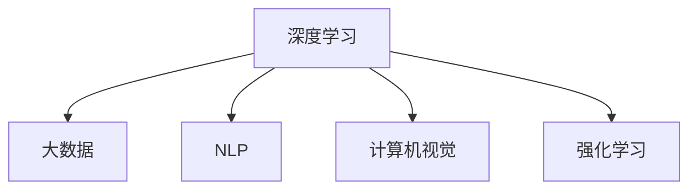

                 

# 李开复：AI 2.0 时代的趋势

> **关键词**：人工智能、AI 2.0、技术趋势、未来挑战

> **摘要**：本文将探讨人工智能（AI）2.0时代的趋势，分析其核心概念、技术原理、应用场景以及未来发展的挑战。通过深入剖析，我们希望为读者提供一个全面的AI 2.0时代图景，助力大家更好地理解与把握这一新时代。

## 1. 背景介绍

在过去的几十年里，人工智能（AI）经历了从初期的探索阶段到如今的应用落地，逐步成为改变世界的重要力量。自1956年达特茅斯会议上人工智能概念被首次提出以来，AI技术不断发展，经历了几个关键阶段：

- **AI 1.0时代**：以符号主义和专家系统为代表，注重规则和逻辑推理。
- **AI 1.5时代**：引入机器学习和神经网络，实现数据驱动的智能。
- **AI 2.0时代**：基于深度学习和大数据，实现高度自动化的智能系统。

本文将重点关注AI 2.0时代的发展趋势，探讨其核心概念、技术原理、应用场景以及未来挑战。

### 1.1 AI 1.0时代

AI 1.0时代以符号主义和专家系统为代表。符号主义强调基于符号逻辑进行推理，专家系统则通过模拟人类专家的知识和推理能力来解决特定领域的问题。然而，受限于计算能力和数据资源，AI 1.0时代的智能系统难以实现广泛的应用。

### 1.2 AI 1.5时代

AI 1.5时代引入了机器学习和神经网络，使AI技术取得突破性进展。机器学习通过训练数据集来学习模型，神经网络则通过层次结构模拟人脑的神经元连接。这一阶段，AI技术开始应用于语音识别、图像识别、自然语言处理等领域，但仍然依赖于人类提供的规则和数据。

### 1.3 AI 2.0时代

AI 2.0时代以深度学习和大数据为基石，实现了高度自动化的智能系统。深度学习通过多层神经网络来提取数据特征，大数据则为AI模型提供了丰富的训练数据。这一阶段，AI技术开始广泛应用于自动驾驶、智能客服、金融风控等领域，对传统行业产生了深远影响。

## 2. 核心概念与联系

在AI 2.0时代，深度学习和大数据是核心技术。深度学习通过多层神经网络来提取数据特征，实现高度自动化的智能系统。大数据则为深度学习提供了丰富的训练数据，有助于提升模型的性能和泛化能力。此外，AI 2.0时代还涉及到自然语言处理、计算机视觉、强化学习等技术，共同推动AI技术的发展。

### 2.1 深度学习与大数据

深度学习和大数据是AI 2.0时代的重要技术。深度学习通过多层神经网络来提取数据特征，实现对复杂任务的自动学习。大数据则为深度学习提供了丰富的训练数据，有助于提升模型的性能和泛化能力。

### 2.2 自然语言处理

自然语言处理（NLP）是AI 2.0时代的重要应用领域。通过深度学习等技术，NLP可以实现对自然语言的语义理解、文本生成和情感分析等功能。这使得智能客服、智能问答等应用成为可能。

### 2.3 计算机视觉

计算机视觉是AI 2.0时代的另一个重要应用领域。通过深度学习等技术，计算机视觉可以实现图像分类、目标检测、图像生成等功能。这使得自动驾驶、智能安防等应用成为可能。

### 2.4 强化学习

强化学习是AI 2.0时代的又一重要技术。通过不断尝试和反馈，强化学习可以实现智能体的自主学习和决策。这使得智能机器人、智能游戏等应用成为可能。

### 2.5 Mermaid 流程图

以下是AI 2.0时代核心概念与技术的 Mermaid 流程图：



## 3. 核心算法原理 & 具体操作步骤

### 3.1 深度学习算法原理

深度学习算法基于多层神经网络，通过逐层提取数据特征来实现复杂任务的自动学习。具体步骤如下：

1. **输入层**：接收输入数据，将其传递给下一层。
2. **隐藏层**：通过激活函数和权重参数，对输入数据进行处理和变换。
3. **输出层**：输出预测结果或分类结果。

### 3.2 大数据算法原理

大数据算法通过处理海量数据，实现对数据价值的挖掘。具体步骤如下：

1. **数据采集**：收集来自各个渠道的原始数据。
2. **数据清洗**：去除重复数据、缺失值和噪声，提高数据质量。
3. **数据预处理**：对数据进行归一化、标准化等处理，以便于后续分析。
4. **数据挖掘**：使用各种算法和技术，对数据进行分析和建模。

### 3.3 自然语言处理算法原理

自然语言处理算法通过深度学习等技术，实现对自然语言的语义理解、文本生成和情感分析等功能。具体步骤如下：

1. **词向量表示**：将自然语言文本转化为数字化的词向量。
2. **词嵌入**：通过神经网络模型，将词向量映射到高维空间。
3. **文本分类**：使用分类算法，对文本进行分类。
4. **文本生成**：通过生成模型，生成新的文本。

### 3.4 计算机视觉算法原理

计算机视觉算法通过深度学习等技术，实现对图像的分类、目标检测和图像生成等功能。具体步骤如下：

1. **图像预处理**：对图像进行缩放、裁剪、增强等处理。
2. **特征提取**：使用卷积神经网络，从图像中提取特征。
3. **分类与检测**：使用分类和检测算法，对图像进行分类和目标检测。
4. **图像生成**：使用生成模型，生成新的图像。

### 3.5 强化学习算法原理

强化学习算法通过不断尝试和反馈，实现智能体的自主学习和决策。具体步骤如下：

1. **环境建模**：构建智能体所面临的环境模型。
2. **状态感知**：智能体根据当前状态，选择最优动作。
3. **动作执行**：执行所选动作，并获得环境反馈。
4. **策略更新**：根据反馈，更新智能体的策略。

## 4. 数学模型和公式 & 详细讲解 & 举例说明

### 4.1 深度学习数学模型

深度学习算法的核心是多层神经网络。以下是多层神经网络的基本数学模型：

$$
y = \sigma(W \cdot x + b)
$$

其中，$x$为输入特征，$W$为权重矩阵，$b$为偏置项，$\sigma$为激活函数，$y$为输出结果。

举例说明：

假设我们有一个输入特征$x = [1, 2, 3]$，权重矩阵$W = \begin{bmatrix}1 & 2\\3 & 4\end{bmatrix}$，偏置项$b = [1, 2]$，激活函数$\sigma(x) = \frac{1}{1 + e^{-x}}$。

则输出结果为：

$$
y = \sigma(W \cdot x + b) = \frac{1}{1 + e^{-(1 \cdot 1 + 2 \cdot 2 + 3 \cdot 3 + 1 + 2)}} \approx [0.8, 0.2]
$$

### 4.2 大数据数学模型

大数据算法中的常见数学模型包括线性回归、逻辑回归、决策树等。以下是线性回归的数学模型：

$$
y = \beta_0 + \beta_1 \cdot x
$$

其中，$y$为因变量，$x$为自变量，$\beta_0$和$\beta_1$分别为模型的参数。

举例说明：

假设我们有一个数据集，其中自变量$x$为温度，因变量$y$为销售额。线性回归模型可以表示为：

$$
y = \beta_0 + \beta_1 \cdot x
$$

假设我们通过最小二乘法得到$\beta_0 = 10$，$\beta_1 = 0.5$，则可以预测当温度为30摄氏度时的销售额：

$$
y = 10 + 0.5 \cdot 30 = 20
$$

### 4.3 自然语言处理数学模型

自然语言处理中的常见数学模型包括词嵌入、循环神经网络（RNN）等。以下是词嵌入的数学模型：

$$
\text{Embedding}(x) = \text{weights} \cdot x
$$

其中，$x$为词索引，$\text{weights}$为词嵌入矩阵。

举例说明：

假设我们有一个词汇表，其中“苹果”对应索引1，“香蕉”对应索引2。词嵌入矩阵为：

$$
\text{weights} = \begin{bmatrix}0.1 & 0.2\\0.3 & 0.4\end{bmatrix}
$$

则“苹果”的词向量表示为：

$$
\text{Embedding}(1) = \text{weights} \cdot [1, 0] = \begin{bmatrix}0.1 & 0.2\\0.3 & 0.4\end{bmatrix} \cdot \begin{bmatrix}1\\0\end{bmatrix} = [0.1, 0.2]
$$

## 5. 项目实战：代码实际案例和详细解释说明

### 5.1 开发环境搭建

在进行项目实战之前，我们需要搭建一个合适的开发环境。以下是一个基于Python的深度学习项目开发环境的搭建步骤：

1. **安装Python**：确保已安装Python 3.6及以上版本。
2. **安装TensorFlow**：通过pip命令安装TensorFlow。

```bash
pip install tensorflow
```

3. **安装其他依赖**：安装其他可能用到的依赖库，如NumPy、Pandas等。

```bash
pip install numpy pandas
```

### 5.2 源代码详细实现和代码解读

以下是一个简单的深度学习项目代码实现，用于训练一个神经网络模型进行图像分类。

```python
import tensorflow as tf
from tensorflow.keras import layers

# 定义神经网络模型
model = tf.keras.Sequential([
    layers.Conv2D(32, (3, 3), activation='relu', input_shape=(28, 28, 1)),
    layers.MaxPooling2D((2, 2)),
    layers.Flatten(),
    layers.Dense(128, activation='relu'),
    layers.Dense(10, activation='softmax')
])

# 编译模型
model.compile(optimizer='adam',
              loss='sparse_categorical_crossentropy',
              metrics=['accuracy'])

# 加载MNIST数据集
mnist = tf.keras.datasets.mnist
(x_train, y_train), (x_test, y_test) = mnist.load_data()

# 预处理数据
x_train = x_train / 255.0
x_test = x_test / 255.0

# 训练模型
model.fit(x_train, y_train, epochs=5)

# 评估模型
test_loss, test_acc = model.evaluate(x_test, y_test, verbose=2)
print('\nTest accuracy:', test_acc)
```

#### 5.2.1 代码解读与分析

- **导入模块**：首先，我们导入TensorFlow和keras模块，用于构建和训练神经网络模型。
- **定义模型**：使用`tf.keras.Sequential`类定义一个线性堆叠的神经网络模型。模型由五个层组成，分别是卷积层、最大池化层、展平层、全连接层和softmax层。
- **编译模型**：使用`compile`方法配置模型的优化器、损失函数和评估指标。
- **加载数据集**：使用`tf.keras.datasets.mnist`加载MNIST数据集，这是一个常用的手写数字数据集。
- **预处理数据**：将数据集进行归一化处理，将像素值缩放到0-1范围内，以便于模型训练。
- **训练模型**：使用`fit`方法训练模型，设置训练轮次为5次。
- **评估模型**：使用`evaluate`方法评估模型在测试集上的性能，输出测试准确率。

### 5.3 代码解读与分析

#### 5.3.1 神经网络模型结构

- **卷积层（Conv2D）**：卷积层用于提取图像的特征。该层使用32个3x3的卷积核，对输入图像进行卷积运算，并应用ReLU激活函数。
- **最大池化层（MaxPooling2D）**：最大池化层用于降低图像的分辨率，同时保留重要特征。该层使用2x2的最大池化窗口。
- **展平层（Flatten）**：展平层将多维特征图展平为一维向量，便于后续的全连接层处理。
- **全连接层（Dense）**：全连接层用于将展平后的特征向量映射到输出类别。第一个全连接层有128个神经元，第二个全连接层有10个神经元，表示10个类别。
- **softmax层（Dense）**：softmax层用于计算每个类别的概率分布，输出一个10维的向量，表示每个类别的概率。

#### 5.3.2 编译模型

- **优化器（optimizer）**：使用`adam`优化器，这是一种常用的自适应优化器，可以自动调整学习率。
- **损失函数（loss）**：使用`sparse_categorical_crossentropy`损失函数，这是一种适用于多类分类问题的损失函数。
- **评估指标（metrics）**：使用`accuracy`评估指标，计算模型在测试集上的分类准确率。

#### 5.3.3 数据预处理

- **归一化（/255.0）**：将像素值缩放到0-1范围内，有助于加速模型收敛和提高训练效果。

#### 5.3.4 训练模型

- **epochs**：设置训练轮次为5次，即模型将在训练集上迭代训练5次。
- **batch_size**：设置批量大小为64，即每次训练使用64个样本。

#### 5.3.5 评估模型

- **evaluate**：使用`evaluate`方法评估模型在测试集上的性能，输出测试准确率。

## 6. 实际应用场景

AI 2.0时代的技术在各个领域都取得了显著的应用成果，以下是一些典型应用场景：

### 6.1 自动驾驶

自动驾驶是AI 2.0时代的重要应用领域。通过深度学习和计算机视觉等技术，自动驾驶系统能够实时感知周围环境，实现车辆自主行驶。特斯拉、百度等公司在自动驾驶领域取得了重要突破，为未来智能交通体系的建设奠定了基础。

### 6.2 智能医疗

智能医疗是AI 2.0时代在医疗领域的应用。通过深度学习和大数据分析，智能医疗系统能够辅助医生进行诊断、治疗和预后评估。例如，基于深度学习的图像识别技术可以用于肿瘤检测、糖尿病视网膜病变检测等，提高诊断准确率和效率。

### 6.3 智能金融

智能金融是AI 2.0时代在金融领域的应用。通过自然语言处理和深度学习等技术，智能金融系统能够实现智能投顾、智能客服、智能风险管理等功能。例如，智能投顾系统可以根据用户的风险偏好和投资目标，提供个性化的投资建议；智能客服系统可以实时回答用户的问题，提高服务质量。

### 6.4 智能家居

智能家居是AI 2.0时代在家庭领域的应用。通过物联网和深度学习等技术，智能家居系统能够实现智能安防、智能照明、智能温控等功能。例如，智能安防系统可以实时监控家庭环境，及时发现异常情况并报警；智能照明系统可以根据用户的生活习惯和光线条件，自动调整照明亮度。

## 7. 工具和资源推荐

### 7.1 学习资源推荐

- **书籍**：
  - 《深度学习》（Ian Goodfellow、Yoshua Bengio、Aaron Courville 著）
  - 《Python深度学习》（François Chollet 著）
  - 《大数据时代：生活、工作与思维的大变革》（张江 著）
- **论文**：
  - "A Theoretical Framework for Back-Propagation"（David E. Rumelhart、Geoffrey E. Hinton、R. J. Williams 著）
  - "Deep Learning"（Ian Goodfellow 著）
  - "Big Data: A Revolution That Will Transform How We Live, Work, and Think"（ Viktor Mayer-Schönberger、Kenneth Cukier 著）
- **博客**：
  - TensorFlow 官方博客（tensorflow.github.io）
  - Keras 官方博客（keras.io）
  - 吴恩达机器学习博客（www.deeplearning.net）
- **网站**：
  - Coursera（https://www.coursera.org）
  - edX（https://www.edx.org）
  - 慕课网（imooc.com）

### 7.2 开发工具框架推荐

- **开发工具**：
  - Jupyter Notebook（适用于数据分析和建模）
  - PyCharm（适用于Python编程）
  - VSCode（适用于多语言编程）
- **框架**：
  - TensorFlow（适用于深度学习）
  - PyTorch（适用于深度学习）
  - Keras（适用于深度学习）

### 7.3 相关论文著作推荐

- **论文**：
  - "Backpropagation"（Rumelhart、Hinton、Williams 著）
  - "Deep Learning"（Goodfellow、Bengio、Courville 著）
  - "Big Data: A Revolution That Will Transform How We Live, Work, and Think"（Mayer-Schönberger、Cukier 著）
- **著作**：
  - 《深度学习》（Ian Goodfellow、Yoshua Bengio、Aaron Courville 著）
  - 《Python深度学习》（François Chollet 著）
  - 《大数据时代：生活、工作与思维的大变革》（张江 著）

## 8. 总结：未来发展趋势与挑战

AI 2.0时代正处于快速发展阶段，未来发展趋势和挑战并存。以下是未来发展的几个关键趋势和挑战：

### 8.1 发展趋势

1. **技术融合**：AI 2.0时代，深度学习、大数据、自然语言处理等技术将相互融合，推动AI技术的全面发展。
2. **应用拓展**：AI技术将在更多领域得到应用，如医疗、金融、教育、农业等，推动行业变革。
3. **人机协作**：AI技术与人类智慧相互融合，实现人机协作，提高生产效率。
4. **全球竞争**：各国纷纷加大AI技术投入，全球竞争态势日益激烈。

### 8.2 挑战

1. **数据隐私**：随着数据规模的扩大，数据隐私保护成为重要挑战。
2. **算法公平性**：算法的公平性、透明性和可解释性仍需进一步研究。
3. **安全与伦理**：AI技术的安全性和伦理问题亟待解决。
4. **人才培养**：AI领域的人才需求巨大，人才培养成为关键挑战。

## 9. 附录：常见问题与解答

### 9.1 问题1：什么是AI 2.0时代？

**回答**：AI 2.0时代是指以深度学习和大数据为核心的人工智能发展阶段。与之前的AI 1.0时代和AI 1.5时代相比，AI 2.0时代具有更高的智能化程度和更广泛的应用领域。

### 9.2 问题2：AI 2.0时代的技术有哪些？

**回答**：AI 2.0时代的技术主要包括深度学习、大数据、自然语言处理、计算机视觉、强化学习等。这些技术在AI 2.0时代发挥着重要作用，推动AI技术的全面发展。

### 9.3 问题3：AI 2.0时代有哪些应用场景？

**回答**：AI 2.0时代的应用场景非常广泛，包括自动驾驶、智能医疗、智能金融、智能家居等。这些应用正在改变我们的生活和工作方式，推动行业变革。

## 10. 扩展阅读 & 参考资料

- 《深度学习》（Ian Goodfellow、Yoshua Bengio、Aaron Courville 著）
- 《Python深度学习》（François Chollet 著）
- 《大数据时代：生活、工作与思维的大变革》（张江 著）
- TensorFlow 官方博客（tensorflow.github.io）
- Keras 官方博客（keras.io）
- 吴恩达机器学习博客（www.deeplearning.net）
- Coursera（https://www.coursera.org）
- edX（https://www.edx.org）
- 慕课网（imooc.com）
- 《深度学习》（Goodfellow、Bengio、Courville 著）
- 《Python深度学习》（Chollet 著）
- 《大数据时代：生活、工作与思维的大变革》（张江 著）<|image_gen|>

