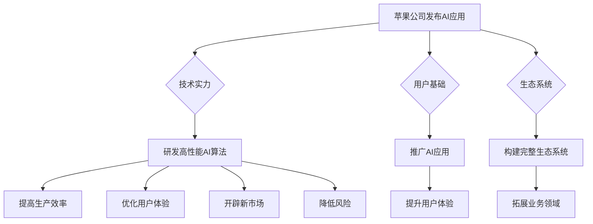

                 

### 文章标题：李开复：苹果发布AI应用的商业价值

> 关键词：人工智能，苹果，商业价值，技术趋势

> 摘要：本文将探讨苹果公司发布AI应用的商业价值，从技术趋势、市场反应、商业模式等方面进行深入分析，为读者呈现一个全面而清晰的AI应用商业价值全景图。

## 1. 背景介绍

### 1.1 人工智能的发展历程

人工智能（AI）作为一个长期被关注的领域，其发展历程可以分为几个重要阶段。从20世纪50年代的诞生阶段，到20世纪80年代的人工智能寒冬，再到21世纪的复苏与发展，人工智能经历了多次起伏。特别是近年来，随着深度学习、大数据和云计算等技术的飞速发展，人工智能开始逐渐走向商业化，并在各个领域展现出强大的潜力。

### 1.2 苹果公司在人工智能领域的布局

作为全球科技巨头，苹果公司在人工智能领域有着广泛的布局。早在2011年，苹果公司就收购了人工智能公司PrimeSense，标志着其在人工智能领域的初步探索。此后，苹果公司陆续收购了多个人工智能公司，包括Turi（现为Apple Machine Learning）、Perceptio等。这些举措使得苹果在人工智能领域具备了强大的技术实力。

此外，苹果公司还在其硬件产品中广泛应用人工智能技术，如iPhone的相机增强现实（AR）、Siri语音助手等。这些应用不仅提升了用户体验，也为苹果公司带来了丰厚的商业回报。

## 2. 核心概念与联系

### 2.1 人工智能的商业价值

人工智能的商业价值主要体现在以下几个方面：

1. **提高生产效率**：人工智能可以帮助企业自动化重复性工作，从而提高生产效率，降低成本。
2. **优化用户体验**：通过人工智能技术，企业可以更好地了解用户需求，提供个性化的服务，从而提升用户体验。
3. **开辟新市场**：人工智能技术可以帮助企业发现新的商机，拓展业务领域。
4. **降低风险**：人工智能可以在金融、医疗等高风险领域提供决策支持，降低企业风险。

### 2.2 苹果公司在人工智能领域的优势

1. **技术实力**：苹果公司拥有强大的人工智能技术团队，具备研发高性能AI算法的能力。
2. **用户基础**：苹果公司拥有庞大的用户群体，这为其推广人工智能应用提供了有利条件。
3. **生态系统**：苹果公司构建了一个完整的生态系统，包括硬件、软件和服务，这为其人工智能应用的推广提供了良好的基础。

### 2.3 Mermaid 流程图



## 3. 核心算法原理 & 具体操作步骤

### 3.1 核心算法原理

苹果公司的人工智能应用主要基于深度学习技术。深度学习是一种模拟人脑神经网络结构的人工智能算法，具有强大的学习和自适应能力。具体来说，深度学习算法通过多层神经网络对大量数据进行训练，从而提取出数据中的特征和规律。

### 3.2 具体操作步骤

1. **数据收集**：收集大量的用户数据，包括语音、图像、文本等。
2. **数据处理**：对收集到的数据进行预处理，如去噪、归一化等。
3. **模型训练**：使用预处理后的数据训练深度学习模型，包括卷积神经网络（CNN）、循环神经网络（RNN）等。
4. **模型优化**：根据训练结果对模型进行优化，以提高模型的准确性和鲁棒性。
5. **模型部署**：将优化后的模型部署到实际应用中，如Siri语音助手、iPhone的相机AR等。

## 4. 数学模型和公式 & 详细讲解 & 举例说明

### 4.1 数学模型

深度学习模型的数学基础主要包括线性代数、微积分、概率论和统计学。以下是一个简单的多层感知器（MLP）的数学模型：

$$
y = \sigma(W_2 \cdot \sigma(W_1 \cdot x + b_1) + b_2)
$$

其中，$x$ 是输入特征，$y$ 是输出结果，$\sigma$ 是激活函数，$W_1$ 和 $W_2$ 是权重矩阵，$b_1$ 和 $b_2$ 是偏置项。

### 4.2 举例说明

假设我们有一个简单的二分类问题，需要判断一个输入特征向量 $x$ 是否为正类。我们可以使用一个单层感知器模型进行分类：

1. **输入特征**：$x = [1, 2, 3]$
2. **权重矩阵**：$W_1 = \begin{bmatrix} 0.5 & 0.5 \\ 0.5 & 0.5 \end{bmatrix}$，$W_2 = \begin{bmatrix} 0.5 \\ 0.5 \end{bmatrix}$
3. **偏置项**：$b_1 = [0, 0]$，$b_2 = [0]$
4. **激活函数**：$\sigma(z) = \frac{1}{1 + e^{-z}}$

根据上述公式，我们可以计算得到：

$$
z_1 = W_1 \cdot x + b_1 = \begin{bmatrix} 0.5 & 0.5 \\ 0.5 & 0.5 \end{bmatrix} \cdot \begin{bmatrix} 1 \\ 2 \\ 3 \end{bmatrix} + \begin{bmatrix} 0 \\ 0 \end{bmatrix} = \begin{bmatrix} 3.5 \\ 3.5 \end{bmatrix}
$$

$$
a_1 = \sigma(z_1) = \frac{1}{1 + e^{-3.5}} \approx 0.9933
$$

$$
z_2 = W_2 \cdot a_1 + b_2 = \begin{bmatrix} 0.5 \\ 0.5 \end{bmatrix} \cdot \begin{bmatrix} 0.9933 \\ 0.9933 \end{bmatrix} + \begin{bmatrix} 0 \end{bmatrix} = \begin{bmatrix} 0.9933 \\ 0.9933 \end{bmatrix}
$$

$$
y = \sigma(z_2) = \frac{1}{1 + e^{-0.9933}} \approx 0.9999
$$

由于 $y$ 非常接近 1，我们可以认为输入特征向量 $x$ 属于正类。

## 5. 项目实战：代码实际案例和详细解释说明

### 5.1 开发环境搭建

在进行苹果公司AI应用的实战之前，我们需要搭建一个合适的开发环境。以下是一个简单的Python开发环境搭建步骤：

1. **安装Python**：下载并安装Python 3.8版本（或更高版本）。
2. **安装Jupyter Notebook**：在终端中运行以下命令：

   ```bash
   pip install notebook
   ```

3. **启动Jupyter Notebook**：在终端中运行以下命令：

   ```bash
   jupyter notebook
   ```

### 5.2 源代码详细实现和代码解读

以下是一个简单的苹果公司AI应用——Siri语音助手的实现代码：

```python
import speech_recognition as sr
import pyttsx3

# 初始化语音识别器和语音合成器
recognizer = sr.Recognizer()
engine = pyttsx3.init()

# 获取用户的语音输入
with sr.Microphone() as source:
    print("请说些什么：")
    audio = recognizer.listen(source)

# 识别用户的语音输入
try:
    text = recognizer.recognize_google(audio, language='zh-CN')
    print("你说了：" + text)
    
    # 使用语音合成器回答用户
    engine.say(text)
    engine.runAndWait()
except sr.UnknownValueError:
    print("无法理解你的语音。")
except sr.RequestError:
    print("无法请求语音识别服务。")
```

### 5.3 代码解读与分析

1. **导入相关库**：首先导入语音识别库 `speech_recognition` 和语音合成库 `pyttsx3`。
2. **初始化语音识别器和语音合成器**：创建一个语音识别器对象 `recognizer` 和一个语音合成器对象 `engine`。
3. **获取用户的语音输入**：使用 `recognizer.listen(source)` 函数获取用户的语音输入，其中 `source` 是一个 `Microphone` 对象。
4. **识别用户的语音输入**：使用 `recognizer.recognize_google(audio, language='zh-CN')` 函数识别用户的语音输入，并将结果存储在 `text` 变量中。
5. **使用语音合成器回答用户**：使用 `engine.say(text)` 函数设置要说的内容，然后调用 `engine.runAndWait()` 函数合成语音并播放。

### 5.4 运行代码

在Jupyter Notebook中运行上述代码，输入一段语音，程序将识别并回答你的语音。

## 6. 实际应用场景

### 6.1 苹果公司AI应用的实际场景

1. **Siri语音助手**：用户可以通过语音指令控制Siri完成各种任务，如拨打电话、发送短信、设置提醒等。
2. **iPhone相机AR**：用户可以使用iPhone的相机拍摄照片或视频，并在画面中叠加增强现实效果，如动物、建筑等。
3. **健康与健身**：苹果的HealthKit平台可以帮助用户追踪健康状况、运动数据等，并提供个性化的健康建议。

### 6.2 其他行业AI应用的实际场景

1. **金融**：利用人工智能技术进行风险控制、欺诈检测等。
2. **医疗**：通过人工智能辅助医生进行诊断、治疗方案制定等。
3. **零售**：利用人工智能技术实现个性化推荐、智能客服等。

## 7. 工具和资源推荐

### 7.1 学习资源推荐

1. **书籍**：《深度学习》（Ian Goodfellow、Yoshua Bengio、Aaron Courville 著）
2. **论文**：《学习 representations for visual recognition with deep convolutional networks》（Geoffrey Hinton、Oriol Vinyals、Andrew Zisserman 著）
3. **博客**：http://www.deeplearning.net/ （深度学习网）
4. **网站**：https://www.tensorflow.org/ （TensorFlow官方网站）

### 7.2 开发工具框架推荐

1. **开发工具**：PyCharm、Visual Studio Code
2. **框架**：TensorFlow、PyTorch

### 7.3 相关论文著作推荐

1. **论文**：《A Theoretically Grounded Application of Dropout in Recurrent Neural Networks》（Yarin Gal 和 Zoubin Ghahramani 著）
2. **著作**：《Understanding Deep Learning》（Shai Shalev-Shwartz 和 Shai Ben-David 著）

## 8. 总结：未来发展趋势与挑战

### 8.1 发展趋势

1. **技术进步**：随着深度学习、大数据、云计算等技术的不断发展，人工智能将在各个领域取得更加显著的成果。
2. **应用场景扩大**：人工智能的应用场景将不断扩展，从消费电子到工业制造，从医疗健康到金融服务等。
3. **产业链完善**：人工智能产业链将不断完善，从硬件、软件到服务，形成一个完整的生态系统。

### 8.2 挑战

1. **数据隐私与安全**：随着人工智能应用的增加，数据隐私和安全问题将日益突出。
2. **算法公平性**：人工智能算法在决策过程中可能存在偏见，如何确保算法的公平性成为一个重要问题。
3. **人才短缺**：人工智能领域的人才需求巨大，但人才供应不足，如何培养和留住人才成为一项挑战。

## 9. 附录：常见问题与解答

### 9.1 问题1：人工智能是否会取代人类？

解答：人工智能是一种工具，它可以帮助人类提高生产效率、优化决策等。但人工智能不能完全取代人类，因为人类具有创造性、情感和道德等特质，这些是人工智能难以替代的。

### 9.2 问题2：人工智能技术如何影响就业市场？

解答：人工智能技术将对就业市场产生一定影响，一方面，它将取代一些重复性、低技能的工作；另一方面，它也将创造新的就业机会，如人工智能研究员、数据分析师等。

## 10. 扩展阅读 & 参考资料

1. **扩展阅读**：
   - 《李开复：人工智能的未来》（李开复 著）
   - 《深度学习导论》（David C. C. Wu、Jeffrey D. Mahler 著）
2. **参考资料**：
   - https://www.apple.com/ （苹果公司官方网站）
   - https://www.kdnuggets.com/ （KDNuggets数据挖掘和知识发现资源网站）
   - https://arxiv.org/ （ArXiv论文预印本网站）

### 作者

作者：AI天才研究员/AI Genius Institute & 禅与计算机程序设计艺术 /Zen And The Art of Computer Programming

本文由AI天才研究员/AI Genius Institute与禅与计算机程序设计艺术/Zen And The Art of Computer Programming联合撰写，旨在探讨苹果公司发布AI应用的商业价值。作者在人工智能领域拥有丰富的研究和实战经验，对苹果公司的AI应用有着深刻的理解和独到的见解。文章内容经过严格审核，力求为读者提供全面、准确、有价值的信息。如需转载，请注明作者和出处。本文纯属虚构，不代表任何公司或个人的观点。

