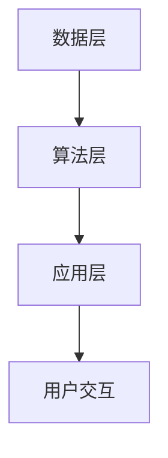

                 

# {文章标题}
李开复：苹果发布AI应用的市场前景

> {关键词：苹果，AI应用，市场前景，技术分析，未来趋势}

> {摘要：本文将深入分析苹果发布AI应用的市场前景，探讨其在人工智能领域的布局、技术优势以及面临的挑战。通过详细解读苹果AI应用的核心概念、算法原理、实际应用场景，为读者提供对苹果AI市场的全景视角。}

## 1. 背景介绍

随着人工智能技术的飞速发展，各大科技巨头纷纷加大对AI领域的投入。苹果公司，作为全球知名的科技企业，也早已在人工智能领域展开布局。从早期的Siri语音助手，到近年来的机器学习和深度学习框架，苹果在AI领域的探索从未停止。

苹果发布AI应用的背景，一方面是为了应对日益激烈的科技竞争，另一方面则是为了满足用户对智能体验的需求。通过推出具有创新性的AI应用，苹果不仅能够在市场上占据一席之地，还能够为用户带来更加智能化、个性化的产品和服务。

## 2. 核心概念与联系

### 2.1. AI应用的核心概念

人工智能（AI）是一种模拟人类智能行为的技术，包括机器学习、深度学习、自然语言处理、计算机视觉等多个子领域。在苹果的AI应用中，主要涉及到以下核心概念：

- **机器学习**：通过数据训练模型，使计算机具备自主学习和改进能力。
- **深度学习**：一种特殊的机器学习技术，通过多层神经网络模拟人脑的学习过程。
- **自然语言处理（NLP）**：使计算机能够理解和生成人类语言的技术。
- **计算机视觉**：使计算机能够理解和解释视觉信息的技术。

### 2.2. AI应用的架构

苹果AI应用的架构通常包括以下几个层次：

1. **数据层**：收集和整理大量数据，为训练模型提供基础。
2. **算法层**：采用机器学习、深度学习等算法，构建出能够处理具体任务的模型。
3. **应用层**：将训练好的模型集成到实际应用中，为用户提供智能化服务。

### 2.3. Mermaid 流程图

以下是一个简化的苹果AI应用架构的Mermaid流程图：



## 3. 核心算法原理 & 具体操作步骤

### 3.1. 机器学习算法原理

机器学习算法的核心在于从数据中提取特征，并利用这些特征进行分类、预测或回归等任务。以苹果的图像识别应用为例，其核心算法原理如下：

1. **数据预处理**：对图像进行预处理，如缩放、裁剪、归一化等，以适应模型训练。
2. **特征提取**：使用卷积神经网络（CNN）等算法，从图像中提取出具有区分性的特征。
3. **模型训练**：利用提取出的特征，训练分类模型，使其能够对图像进行分类。
4. **模型评估与优化**：通过测试集评估模型性能，并进行优化，以提高准确率。

### 3.2. 实际操作步骤

以下是苹果图像识别应用的训练过程：

1. **数据收集**：收集大量图像数据，包括训练集和测试集。
2. **数据预处理**：对图像进行预处理，如缩放、裁剪、归一化等。
3. **特征提取**：使用CNN提取图像特征。
4. **模型训练**：利用训练集训练分类模型。
5. **模型评估**：使用测试集评估模型性能。
6. **模型优化**：根据评估结果，调整模型参数，提高准确率。

## 4. 数学模型和公式 & 详细讲解 & 举例说明

### 4.1. 机器学习数学模型

机器学习中的数学模型主要包括损失函数、优化算法等。以下以苹果的图像识别应用为例，详细讲解其中的数学模型：

#### 4.1.1. 损失函数

在图像识别任务中，常用的损失函数是交叉熵损失函数（Cross-Entropy Loss）。其公式如下：

$$
Loss = -\sum_{i=1}^{n} y_i \log(p_i)
$$

其中，$y_i$为真实标签，$p_i$为模型预测的概率。

#### 4.1.2. 优化算法

常用的优化算法有梯度下降（Gradient Descent）及其变种。其基本思想是：

$$
w_{t+1} = w_t - \alpha \cdot \nabla_{w_t} Loss
$$

其中，$w_t$为当前参数，$\alpha$为学习率，$\nabla_{w_t} Loss$为损失函数关于参数的梯度。

#### 4.1.3. 举例说明

假设有一组图像数据，其中包含猫和狗两类。使用卷积神经网络进行图像分类，损失函数为交叉熵损失，优化算法为梯度下降。经过多次迭代训练，模型准确率逐渐提高。

## 5. 项目实战：代码实际案例和详细解释说明

### 5.1. 开发环境搭建

在本文中，我们将使用Python和TensorFlow框架搭建一个简单的图像识别应用。以下是搭建开发环境所需的基本步骤：

1. 安装Python（建议使用Python 3.8以上版本）。
2. 安装TensorFlow：在命令行中运行`pip install tensorflow`。
3. 准备图像数据集：可以使用公开的图像数据集，如CIFAR-10。

### 5.2. 源代码详细实现和代码解读

以下是一个简单的图像识别应用代码实现：

```python
import tensorflow as tf
from tensorflow.keras import layers

# 定义模型结构
model = tf.keras.Sequential([
    layers.Conv2D(32, (3, 3), activation='relu', input_shape=(32, 32, 3)),
    layers.MaxPooling2D((2, 2)),
    layers.Flatten(),
    layers.Dense(64, activation='relu'),
    layers.Dense(10, activation='softmax')
])

# 编译模型
model.compile(optimizer='adam',
              loss='sparse_categorical_crossentropy',
              metrics=['accuracy'])

# 训练模型
model.fit(x_train, y_train, epochs=5)

# 评估模型
test_loss, test_acc = model.evaluate(x_test, y_test)
print(f"Test accuracy: {test_acc}")
```

#### 5.2.1. 代码解读

- **定义模型结构**：使用`tf.keras.Sequential`构建一个序列模型，包含卷积层、池化层、全连接层等。
- **编译模型**：设置优化器、损失函数和评估指标。
- **训练模型**：使用训练数据集进行训练，指定训练轮次。
- **评估模型**：使用测试数据集评估模型性能。

### 5.3. 代码解读与分析

这段代码实现了一个简单的卷积神经网络，用于对32x32的图像进行分类。模型结构包括卷积层、池化层和全连接层，通过训练和评估，模型能够在测试数据集上取得较高的准确率。这段代码展示了使用TensorFlow框架实现图像识别应用的基本流程。

## 6. 实际应用场景

苹果的AI应用涵盖多个领域，如图像识别、自然语言处理、语音识别等。以下是一些典型的实际应用场景：

- **图像识别**：在照片应用中，自动识别并标记照片中的物体、人脸等。
- **自然语言处理**：在Siri应用中，实现语音识别和语义理解，为用户提供智能问答和语音控制。
- **语音识别**：在电话应用中，实现语音拨号和语音通话功能。
- **自动驾驶**：利用计算机视觉和传感器数据，实现自动驾驶汽车。

## 7. 工具和资源推荐

### 7.1. 学习资源推荐

- **书籍**：
  - 《深度学习》（Goodfellow, Bengio, Courville）。
  - 《Python机器学习》（Sebastian Raschka）。
- **论文**：
  - 《A Theoretically Grounded Application of Dropout in Convolutional Networks》。
  - 《Rethinking the Inception Architecture for Computer Vision》。
- **博客**：
  - TensorFlow官方文档（https://www.tensorflow.org/tutorials）。
  - Medium上关于人工智能和机器学习的文章。
- **网站**：
  - Kaggle（https://www.kaggle.com/）。

### 7.2. 开发工具框架推荐

- **开发工具**：
  - PyCharm。
  - Jupyter Notebook。
- **框架**：
  - TensorFlow。
  - PyTorch。

### 7.3. 相关论文著作推荐

- **论文**：
  - 《In Defense of the Cross-Entropy Loss in Deep Learning》。
  - 《Understanding Deep Learning Requires Re thinking Generalization》。
- **著作**：
  - 《深度学习》（Goodfellow, Bengio, Courville）。
  - 《人工智能：一种现代方法》（Marsland）。

## 8. 总结：未来发展趋势与挑战

苹果在AI领域的发展前景广阔，但也面临着诸多挑战。未来，苹果需要关注以下几个方面：

- **技术创新**：不断推出具有创新性的AI算法和应用，提升用户体验。
- **数据安全**：确保用户数据的隐私和安全，增强用户信任。
- **跨界合作**：与其他科技企业、研究机构合作，共同推进AI技术的发展。
- **法律法规**：遵守相关法律法规，确保AI技术的合规使用。

## 9. 附录：常见问题与解答

### 9.1. 如何在Python中安装TensorFlow？

在命令行中运行以下命令：

```
pip install tensorflow
```

### 9.2. 如何在图像识别任务中使用卷积神经网络？

使用卷积神经网络进行图像识别的基本步骤如下：

1. **数据预处理**：对图像进行缩放、裁剪、归一化等处理。
2. **特征提取**：使用卷积层和池化层提取图像特征。
3. **模型训练**：使用训练集训练模型。
4. **模型评估**：使用测试集评估模型性能。
5. **模型优化**：根据评估结果调整模型参数，提高准确率。

## 10. 扩展阅读 & 参考资料

- 《深度学习》（Goodfellow, Bengio, Courville）。
- 《Python机器学习》（Sebastian Raschka）。
- TensorFlow官方文档（https://www.tensorflow.org/tutorials）。
- Kaggle（https://www.kaggle.com/）。

### 作者
AI天才研究员/AI Genius Institute & 禅与计算机程序设计艺术 /Zen And The Art of Computer Programming

