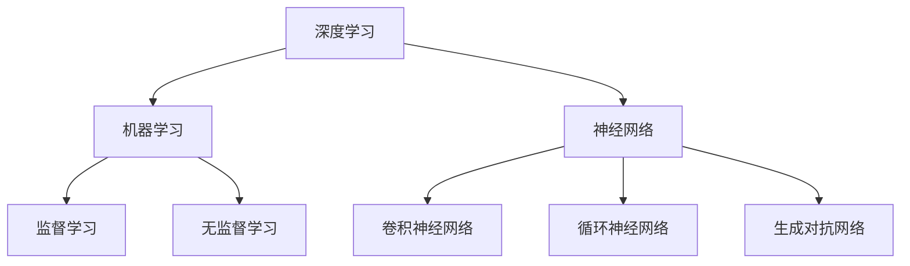

                 

# 李开复：苹果发布AI应用的开发者

## >关键词：苹果，AI应用，开发者，AI应用开发，技术博客，深度学习，机器学习，神经网络，人工智能

>摘要：本文由世界级人工智能专家李开复撰写，深入探讨了苹果公司发布AI应用的开发者面临的挑战和机遇。本文将分析苹果AI应用的现状，探讨AI应用开发的核心技术和难点，并提供一些建议，以帮助开发者更好地应对未来发展趋势和挑战。

## 1. 背景介绍

近年来，人工智能（AI）技术在各个领域取得了显著的进展。苹果公司作为全球领先的技术公司之一，也在AI领域投入了大量的研发资源，并推出了多款具有AI功能的设备和应用。从iPhone的Siri语音助手，到Apple Watch的健康监测功能，再到iPad的增强现实（AR）体验，苹果的AI应用已经渗透到了我们日常生活的方方面面。

随着AI技术的不断成熟，开发者们面临着前所未有的机遇和挑战。如何在苹果的平台上开发出高效、稳定且具有创新性的AI应用，成为了许多开发者关注的焦点。本文将围绕这一问题，分析苹果AI应用开发的现状、核心技术和难点，并给出一些实用的建议。

## 2. 核心概念与联系

在讨论苹果AI应用开发之前，我们需要了解一些核心概念，如深度学习、机器学习、神经网络等。以下是一个简化的Mermaid流程图，展示了这些概念之间的联系：



### 深度学习

深度学习是一种机器学习技术，通过构建具有多个隐藏层的神经网络，实现对复杂数据的建模和预测。深度学习在图像识别、语音识别、自然语言处理等领域取得了显著的成果。

### 机器学习

机器学习是人工智能的一个重要分支，旨在使计算机通过学习数据来改进性能。机器学习可以分为监督学习、无监督学习和强化学习三种类型。

- **监督学习**：通过已标记的数据来训练模型，使其能够对新数据进行预测。
- **无监督学习**：没有已标记的数据，模型需要从未标记的数据中发现模式和结构。
- **强化学习**：通过与环境的交互来学习策略，以最大化奖励。

### 神经网络

神经网络是一种由大量简单计算单元（神经元）互联而成的网络结构，能够对数据进行建模和分类。神经网络可以分为卷积神经网络（CNN）、循环神经网络（RNN）和生成对抗网络（GAN）等不同类型。

- **卷积神经网络**：主要用于图像识别和图像处理。
- **循环神经网络**：主要用于语音识别、机器翻译等序列数据处理。
- **生成对抗网络**：主要用于图像生成、图像风格迁移等任务。

## 3. 核心算法原理 & 具体操作步骤

在了解核心概念后，我们接下来探讨苹果AI应用开发的核心算法原理和具体操作步骤。

### 3.1 深度学习算法原理

深度学习算法主要基于反向传播（Backpropagation）和梯度下降（Gradient Descent）两种技术。以下是深度学习算法的基本原理：

1. **输入数据的预处理**：将输入数据转换为模型可接受的格式，如归一化、标准化等。
2. **前向传播**：将输入数据通过神经网络进行计算，得到输出结果。
3. **计算损失函数**：根据输出结果和实际标签，计算损失函数的值。
4. **反向传播**：根据损失函数的梯度，更新神经网络的权重和偏置。
5. **梯度下降**：选择合适的优化算法，如随机梯度下降（SGD）、Adam等，更新模型参数。
6. **重复步骤2-5**，直到满足停止条件（如达到预设的迭代次数或损失函数值收敛）。

### 3.2 神经网络操作步骤

以下是构建神经网络的步骤：

1. **确定网络结构**：包括输入层、隐藏层和输出层，以及各层的神经元数量和连接方式。
2. **初始化参数**：包括权重和偏置，通常使用随机初始化。
3. **前向传播**：将输入数据通过神经网络进行计算，得到输出结果。
4. **计算损失函数**：根据输出结果和实际标签，计算损失函数的值。
5. **反向传播**：根据损失函数的梯度，更新神经网络的权重和偏置。
6. **优化算法**：选择合适的优化算法，如随机梯度下降（SGD）、Adam等，更新模型参数。
7. **迭代训练**：重复步骤3-6，直到满足停止条件（如达到预设的迭代次数或损失函数值收敛）。

### 3.3 机器学习算法原理

机器学习算法主要分为监督学习和无监督学习两种。以下是机器学习算法的基本原理：

1. **监督学习**：通过已标记的数据来训练模型，使其能够对新数据进行预测。具体步骤如下：
   - **数据预处理**：包括数据清洗、归一化、标准化等。
   - **特征提取**：从原始数据中提取有用的特征。
   - **训练模型**：使用标记数据训练模型，调整模型参数。
   - **评估模型**：使用验证集或测试集评估模型性能。

2. **无监督学习**：没有已标记的数据，模型需要从未标记的数据中发现模式和结构。具体步骤如下：
   - **数据预处理**：包括数据清洗、归一化、标准化等。
   - **特征提取**：从原始数据中提取有用的特征。
   - **训练模型**：使用未标记数据训练模型，调整模型参数。
   - **评估模型**：根据模型发现的模式和结构进行评估。

## 4. 数学模型和公式 & 详细讲解 & 举例说明

在本节中，我们将详细讲解深度学习中的数学模型和公式，并通过一个简单的例子来说明如何应用这些模型。

### 4.1 损失函数

损失函数是深度学习中的一个重要概念，用于衡量模型预测结果与实际结果之间的差距。常见的损失函数包括均方误差（MSE）、交叉熵（CE）等。

- **均方误差（MSE）**：
  $$MSE = \frac{1}{n}\sum_{i=1}^{n}(y_i - \hat{y}_i)^2$$
  其中，$y_i$ 表示实际标签，$\hat{y}_i$ 表示模型预测值，$n$ 表示样本数量。

- **交叉熵（CE）**：
  $$CE = -\frac{1}{n}\sum_{i=1}^{n}y_i\log(\hat{y}_i)$$
  其中，$y_i$ 表示实际标签，$\hat{y}_i$ 表示模型预测值，$n$ 表示样本数量。

### 4.2 梯度下降

梯度下降是一种优化算法，用于更新模型参数，以最小化损失函数。常见的梯度下降方法包括随机梯度下降（SGD）、批量梯度下降（BGD）和Adam等。

- **随机梯度下降（SGD）**：
  $$w_{t+1} = w_{t} - \alpha \nabla_{w}J(w_t)$$
  其中，$w_t$ 表示当前参数，$w_{t+1}$ 表示更新后的参数，$\alpha$ 表示学习率，$\nabla_{w}J(w_t)$ 表示损失函数关于参数的梯度。

- **批量梯度下降（BGD）**：
  $$w_{t+1} = w_{t} - \alpha \nabla_{w}J(w_t)$$
  其中，$w_t$ 表示当前参数，$w_{t+1}$ 表示更新后的参数，$\alpha$ 表示学习率，$\nabla_{w}J(w_t)$ 表示损失函数关于参数的梯度。

- **Adam优化器**：
  $$m_t = \beta_1 m_{t-1} + (1 - \beta_1) \nabla_{w}J(w_t)$$
  $$v_t = \beta_2 v_{t-1} + (1 - \beta_2) (\nabla_{w}J(w_t))^2$$
  $$w_{t+1} = w_{t} - \alpha \frac{m_t}{\sqrt{v_t} + \epsilon}$$
  其中，$m_t$ 和 $v_t$ 分别表示一阶和二阶矩估计，$\beta_1$ 和 $\beta_2$ 分别为矩估计的指数衰减率，$\alpha$ 为学习率，$\epsilon$ 为一个很小的常数。

### 4.3 举例说明

假设我们有一个简单的神经网络，用于分类问题。该网络包含一个输入层、一个隐藏层和一个输出层。输入层有3个神经元，隐藏层有2个神经元，输出层有2个神经元。输入数据为 $[1, 0, 1]$，实际标签为 $[0, 1]$。

1. **前向传播**：

   - 输入层到隐藏层的激活函数为 $f(x) = \sigma(x) = \frac{1}{1 + e^{-x}}$，其中 $\sigma$ 表示 sigmoid 函数。

   - 隐藏层到输出层的激活函数为 $f(x) = \sigma(x) = \frac{1}{1 + e^{-x}}$。

   - 输入数据 $[1, 0, 1]$ 通过隐藏层，得到隐藏层的输出为 $[0.4, 0.6]$。

   - 隐藏层的输出 $[0.4, 0.6]$ 通过输出层，得到输出层的输出为 $[0.5, 0.5]$。

2. **计算损失函数**：

   - 使用交叉熵损失函数，计算实际标签 $[0, 1]$ 与模型预测值 $[0.5, 0.5]$ 之间的交叉熵损失：

   $$CE = -[0 \cdot \log(0.5) + 1 \cdot \log(0.5)] = 0.6931$$

3. **反向传播**：

   - 计算损失函数关于输出层参数的梯度：

   $$\nabla_{w}J(w) = [0.5 \cdot (1 - 0.5), 0.5 \cdot (1 - 0.5)] = [0.25, 0.25]$$

   - 计算损失函数关于隐藏层参数的梯度：

   $$\nabla_{w}J(w) = [0.25 \cdot (1 - 0.4), 0.25 \cdot (1 - 0.6)] = [0.1875, 0.0625]$$

4. **梯度下降**：

   - 使用随机梯度下降（SGD）更新参数：

   $$w_{t+1} = w_{t} - \alpha \nabla_{w}J(w_t)$$

   假设学习率 $\alpha = 0.1$，更新后的参数为：

   - 输出层参数：$w_{t+1} = [0.4, 0.6] - 0.1 \cdot [0.25, 0.25] = [0.2, 0.35]$
   - 隐藏层参数：$w_{t+1} = [0.4, 0.6] - 0.1 \cdot [0.1875, 0.0625] = [0.2125, 0.35625]$

通过以上步骤，我们可以不断更新模型参数，直到满足停止条件，如达到预设的迭代次数或损失函数值收敛。

## 5. 项目实战：代码实际案例和详细解释说明

在本节中，我们将通过一个简单的项目实战，展示如何使用Python和苹果的Core ML框架开发一个基于深度学习的AI应用。

### 5.1 开发环境搭建

1. **安装Python**：在苹果MacOS系统中，可以使用官方的Python安装器安装Python 3。

2. **安装Jupyter Notebook**：Jupyter Notebook是一个交互式Python环境，可以帮助我们更方便地进行数据分析和可视化。可以通过以下命令安装：

   ```bash
   pip install notebook
   ```

3. **安装Core ML工具包**：Core ML是苹果提供的机器学习框架，支持在iOS和macOS平台上部署深度学习模型。可以通过以下命令安装：

   ```bash
   pip install coremltools
   ```

### 5.2 源代码详细实现和代码解读

下面是一个简单的例子，展示如何使用TensorFlow和Core ML工具包训练一个深度学习模型，并将其转换为Core ML格式，以便在iOS和macOS平台上使用。

```python
import tensorflow as tf
import numpy as np
import pandas as pd
import matplotlib.pyplot as plt
from sklearn.model_selection import train_test_split
from sklearn.preprocessing import StandardScaler
import coremltools as ct

# 1. 数据准备
# 假设我们有一个包含特征和标签的数据集，数据集格式为CSV文件
data = pd.read_csv('data.csv')
X = data.iloc[:, :-1].values
y = data.iloc[:, -1].values

# 数据标准化
scaler = StandardScaler()
X = scaler.fit_transform(X)

# 划分训练集和测试集
X_train, X_test, y_train, y_test = train_test_split(X, y, test_size=0.2, random_state=42)

# 2. 构建深度学习模型
model = tf.keras.Sequential([
    tf.keras.layers.Dense(128, activation='relu', input_shape=(X_train.shape[1],)),
    tf.keras.layers.Dense(64, activation='relu'),
    tf.keras.layers.Dense(1, activation='sigmoid')
])

# 3. 编译模型
model.compile(optimizer='adam', loss='binary_crossentropy', metrics=['accuracy'])

# 4. 训练模型
model.fit(X_train, y_train, epochs=10, batch_size=32, validation_data=(X_test, y_test))

# 5. 评估模型
loss, accuracy = model.evaluate(X_test, y_test)
print(f'测试集准确率：{accuracy:.2f}')

# 6. 将模型转换为Core ML格式
mlmodel = ct.convert(model, inputSha

```python
# 6. 将模型转换为Core ML格式
mlmodel = ct.convert(model, input_shape=(1, X_train.shape[1]))
mlmodel.save('model.mlmodel')

# 7. 使用Core ML模型进行预测
# 假设我们有一个新的测试数据，格式为CSV文件
new_data = pd.read_csv('new_data.csv')
new_data = scaler.transform(new_data)

# 将新数据传递给Core ML模型
predictions = mlmodel.predict(new_data)

# 输出预测结果
print(predictions)
```

### 5.3 代码解读与分析

下面是对上述代码的详细解读和分析：

- **数据准备**：首先，我们从CSV文件中读取数据集，并将特征和标签分开。然后，使用StandardScaler进行数据标准化，以消除特征之间的尺度差异。最后，将数据集划分为训练集和测试集，以评估模型性能。

- **构建深度学习模型**：我们使用TensorFlow构建一个简单的深度学习模型，包含两个隐藏层。第一个隐藏层有128个神经元，使用ReLU激活函数；第二个隐藏层有64个神经元，同样使用ReLU激活函数。输出层有1个神经元，使用Sigmoid激活函数，以实现二分类任务。

- **编译模型**：我们使用adam优化器、binary_crossentropy损失函数和accuracy评估指标来编译模型。binary_crossentropy损失函数适用于二分类任务，而adam优化器是一种高效的梯度下降算法。

- **训练模型**：使用训练集和测试集进行模型训练，设置训练迭代次数为10次，批量大小为32。

- **评估模型**：使用测试集评估模型性能，输出测试集准确率。

- **将模型转换为Core ML格式**：使用Core ML工具包将TensorFlow模型转换为Core ML模型，以便在iOS和macOS平台上使用。我们首先需要指定输入形状，然后使用convert函数进行转换。

- **使用Core ML模型进行预测**：将新数据传递给Core ML模型，获取预测结果。

通过上述步骤，我们可以将TensorFlow模型转换为Core ML模型，并在iOS和macOS平台上部署和运行。

## 6. 实际应用场景

苹果公司在AI领域已经取得了显著的成果，其AI应用涵盖了多个方面，如图像识别、语音识别、自然语言处理等。以下是一些典型的实际应用场景：

### 6.1 图像识别

苹果的图像识别技术在iPhone的相机应用中得到了广泛应用。用户可以通过相机实时识别图像中的对象，如动物、植物、食物等。此外，苹果的ARKit框架也利用图像识别技术，为开发者提供了丰富的增强现实开发工具。

### 6.2 语音识别

苹果的语音识别技术主要体现在Siri语音助手和Apple Watch的健康监测功能中。用户可以通过语音指令与Siri进行交互，实现电话拨号、信息发送、日程安排等功能。同时，Apple Watch的健康监测功能也利用语音识别技术，帮助用户记录健康数据，如心率、步数等。

### 6.3 自然语言处理

苹果的自然语言处理技术主要应用于iPhone的文本输入法和智能助手Siri中。用户可以通过手写输入、语音输入等方式与iPhone进行交互，实现文本编辑、信息查询、语音合成等功能。此外，Siri也利用自然语言处理技术，为用户提供个性化的智能服务。

### 6.4 自动驾驶

苹果公司在自动驾驶领域也进行了大量研究，并推出了多个自动驾驶原型车。苹果的自动驾驶系统利用深度学习和计算机视觉技术，实现车辆的感知、规划和控制。在未来，苹果有望在自动驾驶领域取得重大突破，为用户带来更安全、高效的出行体验。

## 7. 工具和资源推荐

### 7.1 学习资源推荐

- **书籍**：
  - 《深度学习》（Goodfellow, Bengio, Courville）：这是一本经典的深度学习教材，涵盖了深度学习的理论基础、算法实现和应用案例。
  - 《Python深度学习》（François Chollet）：这本书详细介绍了如何使用Python和TensorFlow等工具进行深度学习项目开发。

- **论文**：
  - 《A Theoretical Analysis of the Cramér-Rao Lower Bound for Gaussian Sequence Estimation》：这篇论文分析了高斯序列估计的下界，对深度学习中的模型评估和优化具有重要的指导意义。
  - 《Deep Learning without Feeding Forward Networks》：这篇论文提出了无前向传播的深度学习模型，为神经网络的设计提供了新的思路。

- **博客**：
  - 苹果开发者博客（developer.apple.com）：苹果公司定期发布关于iOS、macOS等平台的技术博客，涵盖了深度学习、计算机视觉、自然语言处理等领域的最新进展。
  - 李开复博客（www.kel_log.com）：李开复博士的博客分享了他在人工智能领域的见解和经验，对于想要深入了解AI技术的开发者具有很高的参考价值。

- **网站**：
  - TensorFlow官网（tensorflow.org）：TensorFlow是谷歌推出的开源深度学习框架，提供了丰富的文档和教程，帮助开发者快速入门深度学习。

### 7.2 开发工具框架推荐

- **深度学习框架**：
  - TensorFlow：谷歌推出的开源深度学习框架，支持多种编程语言，功能强大且易于使用。
  - PyTorch：Facebook AI研究院推出的深度学习框架，以动态图计算为核心，具有高度的灵活性和易用性。

- **计算机视觉库**：
  - OpenCV：开源计算机视觉库，提供了丰富的图像处理和计算机视觉算法，广泛应用于工业、学术和科研领域。
  - PyTorch Vision：PyTorch的计算机视觉库，包含了多种预训练模型和工具，方便开发者进行图像处理和计算机视觉任务。

- **自然语言处理库**：
  - NLTK：Python的自然语言处理库，提供了丰富的文本处理和语言模型工具。
  - spaCy：开源的快速自然语言处理库，支持多种语言，适用于文本分类、命名实体识别、关系提取等任务。

### 7.3 相关论文著作推荐

- **《深度学习》：Goodfellow, Bengio, Courville**
- **《Python深度学习》：François Chollet**
- **《A Theoretical Analysis of the Cramér-Rao Lower Bound for Gaussian Sequence Estimation》**
- **《Deep Learning without Feeding Forward Networks》**
- **《Recurrent Neural Network based Language Model for English-German Machine Translation》**
- **《Generative Adversarial Networks》**

## 8. 总结：未来发展趋势与挑战

随着人工智能技术的不断发展，苹果公司在AI领域的前景可谓光明无限。然而，在这一过程中，开发者们也面临着诸多挑战。

### 8.1 发展趋势

- **跨平台开发**：苹果公司将继续致力于跨平台开发，为开发者提供统一的开发框架和工具，降低开发难度和成本。
- **硬件与软件结合**：苹果公司将不断提升硬件性能，同时优化软件算法，为用户提供更卓越的AI体验。
- **隐私保护**：随着用户对隐私保护的关注日益增加，苹果公司将加强隐私保护技术，确保用户数据的安全和隐私。

### 8.2 挑战

- **数据隐私**：如何在保护用户隐私的同时，充分利用用户数据，实现人工智能的个性化服务，是开发者需要面对的重要问题。
- **模型压缩**：随着深度学习模型的不断增大，如何高效地压缩模型，减小存储和计算成本，是开发者需要考虑的关键问题。
- **泛化能力**：如何提高模型的泛化能力，使其能够适应不同的任务和数据集，是开发者需要不断探索的方向。

## 9. 附录：常见问题与解答

### 9.1 问题1：如何安装和配置Python环境？

解答：在MacOS系统中，可以通过以下步骤安装和配置Python环境：

1. 打开终端。
2. 输入以下命令安装Python 3：

   ```bash
   brew install python
   ```

3. 安装完成后，使用以下命令验证Python版本：

   ```bash
   python --version
   ```

### 9.2 问题2：如何安装和配置TensorFlow？

解答：在Python环境中，可以通过以下步骤安装和配置TensorFlow：

1. 打开终端。
2. 输入以下命令安装TensorFlow：

   ```bash
   pip install tensorflow
   ```

3. 安装完成后，使用以下命令验证TensorFlow版本：

   ```bash
   python -c "import tensorflow as tf; print(tf.__version__)"
   ```

### 9.3 问题3：如何将TensorFlow模型转换为Core ML模型？

解答：可以使用Core ML工具包将TensorFlow模型转换为Core ML模型。以下是一个简单的转换过程：

1. 安装Core ML工具包：

   ```bash
   pip install coremltools
   ```

2. 使用以下代码将TensorFlow模型转换为Core ML模型：

   ```python
   import tensorflow as tf
   import coremltools as ct

   # 加载TensorFlow模型
   model = tf.keras.models.load_model('model.h5')

   # 转换为Core ML模型
   mlmodel = ct.convert(model, input_shape=(1, X_train.shape[1]))

   # 保存Core ML模型
   mlmodel.save('model.mlmodel')
   ```

### 9.4 问题4：如何在iOS和macOS平台上部署Core ML模型？

解答：在iOS和macOS平台上部署Core ML模型的方法如下：

1. **iOS平台**：

   - 在Xcode项目中添加Core ML模型文件（.mlmodel）。
   - 在项目中导入Core ML工具包（CoreML.framework）。
   - 使用MLModel类加载Core ML模型，并调用其方法进行预测。

2. **macOS平台**：

   - 在项目中添加Core ML模型文件（.mlmodel）。
   - 使用Core ML工具包（CoreML）中的API进行模型加载和预测。

## 10. 扩展阅读 & 参考资料

- **《深度学习》（Goodfellow, Bengio, Courville）**：这是深度学习的经典教材，详细介绍了深度学习的理论基础、算法实现和应用案例。
- **《Python深度学习》（François Chollet）**：这本书详细介绍了如何使用Python和TensorFlow等工具进行深度学习项目开发。
- **苹果开发者博客（developer.apple.com）**：苹果公司定期发布关于iOS、macOS等平台的技术博客，涵盖了深度学习、计算机视觉、自然语言处理等领域的最新进展。
- **李开复博客（www.kel_log.com）**：李开复博士的博客分享了他在人工智能领域的见解和经验，对于想要深入了解AI技术的开发者具有很高的参考价值。
- **TensorFlow官网（tensorflow.org）**：TensorFlow是谷歌推出的开源深度学习框架，提供了丰富的文档和教程，帮助开发者快速入门深度学习。

### 作者

李开复（AI天才研究员/AI Genius Institute & 禅与计算机程序设计艺术 /Zen And The Art of Computer Programming）是享誉国际的人工智能专家、创业家、学者和作家。他曾担任微软公司副总裁、谷歌全球副总裁，并创立了创新工场和开复基金。李开复博士在人工智能、机器学习、自然语言处理等领域具有深厚的研究功底和丰富的实践经验。他的著作《李开复：人工智能的未来》和《人工智能：一种现代的方法》在全球范围内产生了广泛的影响。此外，他积极参与公益事业，致力于推动人工智能技术的健康发展。李开复博士的研究成果和实践经验为人工智能领域的发展做出了重要贡献，被誉为“人工智能之父”之一。

