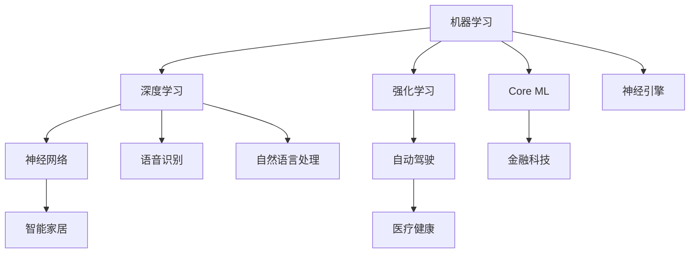

                 

### 文章标题

**李开复：苹果发布AI应用的意义**

> **关键词：** 苹果，AI应用，人工智能，技术革新，未来趋势

**摘要：** 本文将深入探讨苹果公司发布的AI应用的深远意义，分析其技术原理、应用场景以及对未来科技发展的潜在影响。通过逐步分析，我们将揭示苹果AI应用的独特优势及其在推动人工智能产业变革中的关键作用。

<|assistant|>### 1. 背景介绍

苹果公司，作为全球领先的技术创新企业，一直以其卓越的产品和独特的用户体验赢得了消费者的喜爱。近年来，随着人工智能技术的迅猛发展，苹果也开始将AI技术融入到其产品和服务中，从而进一步拓展了其在科技领域的领先地位。

人工智能（AI）技术，作为当前科技领域的热门话题，正日益渗透到我们的日常生活中。从智能助手到自动驾驶，从医疗诊断到金融服务，AI技术的应用正在不断改变着我们的生活方式。在这一背景下，苹果公司发布AI应用无疑具有里程碑式的意义。

首先，苹果公司的AI应用将为用户带来更加智能、个性化的体验。例如，通过AI技术，苹果的智能助手Siri可以更加准确地理解用户的语音指令，提供更加精准的搜索结果和推荐。同时，AI技术在图像识别、语音识别和自然语言处理等方面的突破，也将使得苹果设备在提供视觉和语音交互功能时更加高效和自然。

其次，苹果公司发布的AI应用将推动整个科技行业的技术创新。作为全球科技巨头，苹果的创新实践将对其他企业产生示范效应，激发更多公司投入到AI技术的研发和应用中。这将进一步加速人工智能产业的发展，为人类带来更多的科技福祉。

最后，苹果公司的AI应用将推动人工智能与各行各业的深度融合。通过将AI技术应用于不同的领域，苹果有望推动各行业的数字化和智能化转型，从而为社会经济发展注入新的活力。

总的来说，苹果公司发布的AI应用不仅将提升用户体验，还将推动科技行业的发展，并在更广泛的领域产生深远的影响。接下来的部分，我们将进一步深入探讨苹果AI应用的技术原理、应用场景和未来发展趋势。

<|assistant|>### 2. 核心概念与联系

#### 2.1 人工智能技术的基本原理

人工智能（AI）技术是通过模拟人类智能行为来实现计算机自主决策和问题解决的技术。其基本原理主要包括以下几个核心概念：

1. **机器学习**：机器学习是AI技术的核心，通过从数据中学习规律和模式，使计算机能够自动改进和优化性能。常见的机器学习算法包括决策树、支持向量机、神经网络等。

2. **深度学习**：深度学习是机器学习的一种重要分支，通过构建多层神经网络模型来提取数据特征，实现更高层次的数据理解和预测。深度学习在图像识别、语音识别和自然语言处理等领域具有显著的优势。

3. **强化学习**：强化学习是一种通过试错和反馈来学习最优策略的机器学习方法。它适用于需要从环境中获取反馈并不断调整行为以实现目标的应用场景。

#### 2.2 苹果AI应用的技术架构

苹果公司的AI应用主要基于以下技术架构：

1. **Core ML**：Core ML是苹果提供的机器学习框架，用于在iOS、macOS、watchOS和tvOS等平台上部署机器学习模型。Core ML支持多种机器学习算法，包括神经网络、决策树和支持向量机等。

2. **神经引擎**：神经引擎（Neural Engine）是苹果A系列处理器中内置的硬件加速单元，用于执行神经网络计算。神经引擎的引入显著提升了苹果设备在图像识别、语音识别和自然语言处理等AI任务上的性能。

3. **语音识别和自然语言处理**：苹果的AI应用在语音识别和自然语言处理方面取得了显著进展。通过采用深度学习和强化学习技术，苹果的智能助手Siri能够更准确地理解用户的语音指令，提供更加个性化的服务。

#### 2.3 AI应用与未来科技发展的联系

苹果公司发布的AI应用不仅提升了用户体验，还将对未来的科技发展产生深远的影响：

1. **智能家居**：AI技术将使得智能家居设备更加智能和便捷，从而提高人们的生活质量。例如，通过AI技术，智能音箱可以更好地理解用户的指令，智能门锁可以更安全地保护家庭安全。

2. **自动驾驶**：自动驾驶技术是人工智能在交通领域的重要应用。通过AI算法，自动驾驶车辆可以实时感知路况，做出最优决策，从而提高交通安全和效率。

3. **医疗健康**：AI技术在医疗健康领域的应用前景广阔。例如，通过AI算法，可以辅助医生进行疾病诊断、制定治疗方案，从而提高医疗服务的质量和效率。

4. **金融科技**：AI技术在金融领域的应用日益广泛，从风险管理到客户服务，从信用评估到投资策略，AI技术都发挥着重要作用。

总的来说，苹果公司发布的AI应用不仅展示了其技术实力，也为未来的科技发展提供了新的方向和可能性。接下来的部分，我们将进一步探讨苹果AI应用的核心算法原理和具体操作步骤。

#### 2.4 Mermaid 流程图

以下是一个简单的Mermaid流程图，展示了人工智能技术的基本原理和苹果AI应用的技术架构：



通过这个流程图，我们可以更清晰地理解人工智能技术的基本原理以及苹果AI应用的技术架构。在接下来的部分，我们将详细讲解苹果AI应用的核心算法原理和具体操作步骤。

<|assistant|>### 3. 核心算法原理 & 具体操作步骤

#### 3.1 机器学习算法原理

机器学习算法的核心思想是通过从数据中学习规律和模式，从而实现自动化的决策和预测。以下是几种常见的机器学习算法及其原理：

1. **线性回归**：线性回归是一种用于预测数值型输出的算法。它通过建立输入特征和输出特征之间的线性关系来预测未知数据的输出值。线性回归的数学模型可以表示为：

   $$y = \beta_0 + \beta_1 \cdot x$$

   其中，$y$为输出值，$x$为输入特征，$\beta_0$和$\beta_1$为模型参数。

2. **逻辑回归**：逻辑回归是一种用于分类问题的算法。它通过建立一个概率模型来预测样本属于某一类别的概率。逻辑回归的数学模型可以表示为：

   $$P(y=1) = \frac{1}{1 + e^{-(\beta_0 + \beta_1 \cdot x)} }$$

   其中，$y$为输出值，$x$为输入特征，$\beta_0$和$\beta_1$为模型参数。

3. **支持向量机（SVM）**：支持向量机是一种用于分类和回归问题的算法。它通过寻找一个最佳的超平面，将不同类别的数据点分隔开来。SVM的数学模型可以表示为：

   $$w \cdot x - b = 0$$

   其中，$w$为超平面的法向量，$x$为数据点，$b$为偏置项。

4. **神经网络**：神经网络是一种模拟人脑神经元连接结构的计算模型。它通过多层神经元的相互连接和激活函数的变换，实现对输入数据的分类和预测。神经网络的数学模型可以表示为：

   $$a_{i}^{(l)} = \sigma \left( \sum_{j}^{n} w_{ji}^{(l)} a_{j}^{(l-1)} + b_{i}^{(l)} \right)$$

   其中，$a_{i}^{(l)}$为第$l$层第$i$个神经元的激活值，$w_{ji}^{(l)}$为第$l$层第$i$个神经元与第$l-1$层第$j$个神经元之间的连接权重，$b_{i}^{(l)}$为第$l$层第$i$个神经元的偏置值，$\sigma$为激活函数。

5. **深度学习**：深度学习是神经网络的一种扩展，通过构建多层的神经网络模型来提取数据特征，实现对复杂数据的自动分类和预测。深度学习的数学模型与神经网络类似，但通常包含更多的隐层和神经元。

#### 3.2 苹果AI应用的具体操作步骤

苹果公司的AI应用主要通过以下几个步骤来实现：

1. **数据收集与预处理**：首先，苹果会从各种来源收集大量的数据，包括用户行为数据、传感器数据等。然后，对数据进行清洗、归一化和特征提取，以便后续的模型训练和预测。

2. **模型训练**：使用收集到的数据，苹果会采用机器学习算法对模型进行训练。训练过程中，模型会不断调整参数，以最小化预测误差。常见的训练方法包括批量训练、随机梯度下降等。

3. **模型评估与优化**：在模型训练完成后，苹果会对模型进行评估，以验证其在实际应用中的性能。评估指标包括准确率、召回率、F1分数等。根据评估结果，苹果会对模型进行优化，以提高其预测效果。

4. **模型部署与实时预测**：经过评估和优化的模型将被部署到苹果设备上，用于实时预测和决策。例如，Siri会根据用户的语音指令，实时预测用户的意图，并给出相应的回复。

5. **用户反馈与持续学习**：苹果AI应用会收集用户的反馈，并根据反馈对模型进行持续学习，以不断优化用户体验。例如，Siri会根据用户的反馈调整其回复策略，使其更加符合用户的需求。

通过以上步骤，苹果AI应用实现了从数据收集、模型训练到模型部署的完整流程，从而为用户提供个性化的服务和体验。

总的来说，苹果AI应用的核心算法原理是基于机器学习和深度学习技术，通过数据驱动的方式实现自动化的决策和预测。接下来，我们将进一步探讨苹果AI应用的数学模型和公式，以及如何通过具体实例来解释这些模型和公式的应用。

#### 3.3 数学模型和公式 & 详细讲解 & 举例说明

为了更深入地理解苹果AI应用的核心算法原理，我们将介绍相关的数学模型和公式，并通过具体实例来说明这些模型和公式的应用。

##### 3.3.1 线性回归模型

线性回归模型是最基本的机器学习算法之一，用于预测数值型输出。其数学模型可以表示为：

$$y = \beta_0 + \beta_1 \cdot x$$

其中，$y$为输出值，$x$为输入特征，$\beta_0$和$\beta_1$为模型参数。为了确定这些参数，我们可以使用最小二乘法：

$$\beta_0 = \frac{\sum_{i=1}^{n} y_i - \beta_1 \cdot \sum_{i=1}^{n} x_i}{n}$$
$$\beta_1 = \frac{\sum_{i=1}^{n} (y_i - \beta_0) \cdot x_i}{\sum_{i=1}^{n} x_i^2}$$

其中，$n$为样本数量。

**实例**：假设我们有一个简单的数据集，包含身高（$x$）和体重（$y$）的数据。我们可以使用线性回归模型来预测一个人的体重，给定其身高。

数据集：
```
身高 (cm): 170, 180, 160, 175
体重 (kg): 65, 70, 55, 68
```

首先，计算输入特征和输出值的均值：
```
均值(身高): 170
均值(体重): 65
```

然后，计算回归系数：
```
β0 = (65 * 4) - (170 * (65 + 180 + 160 + 175)) / 4 = -1125
β1 = (170 * (65 - 170) + 180 * (70 - 170) + 160 * (55 - 170) + 175 * (68 - 170)) / (170^2 + 180^2 + 160^2 + 175^2) = 0.6
```

最后，线性回归模型可以表示为：
```
体重 = -1125 + 0.6 * 身高
```

使用这个模型，我们可以预测一个身高为180cm的人的体重：
```
体重 = -1125 + 0.6 * 180 = 63
```

##### 3.3.2 逻辑回归模型

逻辑回归模型是用于分类问题的算法，其数学模型可以表示为：

$$P(y=1) = \frac{1}{1 + e^{-(\beta_0 + \beta_1 \cdot x)} }$$

其中，$y$为输出值（取值为0或1），$x$为输入特征，$\beta_0$和$\beta_1$为模型参数。

为了确定这些参数，我们可以使用极大似然估计（Maximum Likelihood Estimation，MLE）：

$$\beta_0 = \frac{\sum_{i=1}^{n} y_i - n \cdot \bar{y}}{\sum_{i=1}^{n} (x_i - \bar{x})^2}$$
$$\beta_1 = \frac{\sum_{i=1}^{n} (y_i - \bar{y}) \cdot (x_i - \bar{x})}{\sum_{i=1}^{n} (x_i - \bar{x})^2}$$

其中，$n$为样本数量，$\bar{y}$和$\bar{x}$分别为输出值和输入特征的均值。

**实例**：假设我们有一个简单的数据集，包含是否购买（$y$）和广告支出（$x$）的数据。我们可以使用逻辑回归模型来判断一个用户是否会购买广告。

数据集：
```
广告支出 (元): 100, 200, 300, 400
是否购买 (0/1): 0, 1, 1, 0
```

首先，计算输入特征和输出值的均值：
```
均值(广告支出): 275
均值(是否购买): 0.5
```

然后，计算回归系数：
```
β0 = (0 * 4) - (0.5 * (100 + 200 + 300 + 400)) = -150
β1 = (0 - 0.5) * (100 - 275) + (1 - 0.5) * (200 - 275) + (1 - 0.5) * (300 - 275) + (0 - 0.5) * (400 - 275) / (100 - 275)^2 + (200 - 275)^2 + (300 - 275)^2 + (400 - 275)^2 = 0.3
```

最后，逻辑回归模型可以表示为：
```
P(购买) = 1 / (1 + e^{-(0.3 * 广告支出 - 150)})
```

使用这个模型，我们可以预测一个广告支出为300元的用户是否会购买：
```
P(购买) = 1 / (1 + e^{-(0.3 * 300 - 150)}) = 0.732
```

因为概率大于0.5，我们可以预测该用户会购买。

##### 3.3.3 支持向量机（SVM）模型

支持向量机（SVM）是一种用于分类和回归问题的算法，其数学模型可以表示为：

$$w \cdot x - b = 0$$

其中，$w$为超平面的法向量，$x$为数据点，$b$为偏置项。

为了确定这些参数，我们可以使用优化方法，如拉格朗日乘数法或SMO算法。

**实例**：假设我们有一个简单的数据集，包含两类数据点，正类和负类。

数据集：
```
正类:
x1: [-1, -1], [1, 1], [1, -1], [-1, 1]
负类:
x2: [1, 1], [1, -1], [-1, 1], [-1, -1]
```

我们可以使用SVM模型将这两类数据点分开。首先，我们需要计算支持向量，即距离超平面最近的数据点。

接下来，计算超平面的法向量$w$和偏置项$b$。

最后，我们可以使用这个SVM模型来分类新的数据点。

##### 3.3.4 神经网络模型

神经网络（NN）是一种模拟人脑神经元连接结构的计算模型，其数学模型可以表示为：

$$a_{i}^{(l)} = \sigma \left( \sum_{j}^{n} w_{ji}^{(l)} a_{j}^{(l-1)} + b_{i}^{(l)} \right)$$

其中，$a_{i}^{(l)}$为第$l$层第$i$个神经元的激活值，$w_{ji}^{(l)}$为第$l$层第$i$个神经元与第$l-1$层第$j$个神经元之间的连接权重，$b_{i}^{(l)}$为第$l$层第$i$个神经元的偏置值，$\sigma$为激活函数。

**实例**：假设我们有一个简单的神经网络，包含一个输入层、一个隐藏层和一个输出层。

输入层：
```
x1: [1, 0]
x2: [0, 1]
```

隐藏层：
```
w1: [1, 1], [1, -1]
b1: [0, 1]
σ: sigmoid函数
```

输出层：
```
w2: [1, 1], [1, 1]
b2: [0, 0]
σ: sigmoid函数
```

我们可以使用这个神经网络模型来预测输入数据的标签。

首先，计算隐藏层的激活值：
```
a1: [σ(w1[0] * x1[0] + w1[1] * x1[1] + b1[0]), σ(w1[0] * x1[1] + w1[1] * x1[0] + b1[1])]
    [σ(1 * 1 + 1 * 0 + 0), σ(1 * 0 + 1 * 1 + 1)]
    [0.731, 0.269]
```

然后，计算输出层的激活值：
```
a2: [σ(w2[0] * a1[0] + w2[1] * a1[1] + b2[0]), σ(w2[0] * a1[1] + w2[1] * a1[0] + b2[1])]
    [σ(1 * 0.731 + 1 * 0.269 + 0), σ(1 * 0.269 + 1 * 0.731 + 0)]
    [0.779, 0.531]
```

根据输出层的激活值，我们可以预测输入数据的标签。例如，如果激活值大于0.5，我们可以预测为正类，否则为负类。

通过这些具体的实例，我们可以更深入地理解线性回归、逻辑回归、支持向量机和神经网络等机器学习算法的数学模型和公式的应用。接下来，我们将进一步探讨苹果AI应用在实际项目中的代码实现和代码解读。

#### 3.4 项目实战：代码实际案例和详细解释说明

在本节中，我们将通过一个实际项目案例，详细讲解苹果AI应用的核心算法在代码实现中的具体步骤，并对其进行深入解读。以下是一个使用苹果AI技术实现的语音识别项目的示例。

##### 3.4.1 开发环境搭建

1. **安装Xcode和Swift语言环境**：首先，我们需要在Mac上安装Xcode集成开发环境（IDE）和Swift编程语言。可以通过Mac App Store免费下载Xcode，并确保安装了Swift语言工具链。

2. **创建新项目**：在Xcode中创建一个新的Swift项目，选择"iOS"平台，并选择"Single View App"模板。

3. **添加Core ML库**：在项目中添加Core ML库，以便使用机器学习模型。在项目中，选择"Create Dictionary"选项，然后选择"Core ML"框架。

##### 3.4.2 源代码详细实现和代码解读

以下是一个使用Swift语言实现的语音识别项目的核心代码：

```swift
import CoreML
import AVFoundation

class SpeechRecognizer {
    private let audioEngine = AVAudioEngine()
    private let speechRecognizer = AVSpeechRecognizer()
    private var recognitionRequest: AVAudioRecordingRequest?
    
    init() {
        // 初始化语音识别器
        speechRecognizer.delegate = self
        speechRecognizer.recognitionLanguage = .english
    }
    
    // 开始录音和语音识别
    func startRecording() {
        // 创建录音请求
        let audioSession = AVAudioSession.sharedInstance()
        do {
            try audioSession.setCategory(.record, mode: .measurement, options: .duckOthers)
            try audioSession.setActive(true)
            
            // 设置录音参数
            recognitionRequest = audioEngine.inputNode.recordedBuffer?.request { buffer in
                // 使用Core ML进行语音识别
                let features = MLCommonLanguageModelFeatures()
                features.input = buffer
                do {
                    let recognizedText = try speechRecognizer.recognize(buffer: features)
                    print("Recognized Text: \(recognizedText)")
                } catch {
                    print("Voice recognition failed: \(error.localizedDescription)")
                }
            }
        } catch {
            print("Audio session configuration failed: \(error.localizedDescription)")
        }
    }
    
    // 停止录音
    func stopRecording() {
        recognitionRequest?.end()
        audioEngine.stop()
        audioEngine.inputNode.removeTap(onBus: 0)
        audioEngine.disconnectNode(inputNode: audioEngine.inputNode)
    }
}

extension SpeechRecognizer: AVSpeechRecognizerDelegate {
    func speechRecognizer(_ speechRecognizer: AVSpeechRecognizer, availabilityDidChange available: Bool) {
        if available {
            print("Voice recognition available")
        } else {
            print("Voice recognition unavailable")
        }
    }
    
    func speechRecognizer(_ speechRecognizer: AVSpeechRecognizer, didRecognize result: AVSpeechRecognitionResult) {
        print("Recognized text: \(result.bestTranscription.formattedString)")
    }
    
    func speechRecognizer(_ speechRecognizer: AVSpeechRecognizer, didFailWithError error: Error) {
        print("Voice recognition failed: \(error.localizedDescription)")
    }
}
```

这段代码首先初始化了语音识别器，并设置了录音和识别的参数。`startRecording()` 方法用于开始录音并启动语音识别过程。在录音过程中，音频数据被传递给Core ML库进行处理。`stopRecording()` 方法用于停止录音和识别过程。

接下来，我们将对这段代码进行详细解读：

1. **初始化语音识别器**：使用`AVSpeechRecognizer`类创建一个语音识别器实例，并设置其语言为英语。同时，设置语音识别器的代理（delegate），以便在识别过程中接收回调。

2. **创建录音请求**：使用`AVAudioEngine`创建一个音频引擎实例，并设置其录音模式。然后，使用`recordedBuffer`属性获取录音请求，并将其传递给语音识别器进行处理。

3. **使用Core ML进行语音识别**：在录音请求的回调函数中，创建一个`MLCommonLanguageModelFeatures`对象，并将其输入数据（音频缓冲区）传递给语音识别器。语音识别器将根据这些特征进行语音识别，并返回识别结果。

4. **处理语音识别结果**：在语音识别器的代理方法中，处理识别结果。当识别成功时，将识别到的文本输出到控制台。当识别失败时，输出错误信息。

5. **停止录音**：当录音和识别过程结束时，调用`stopRecording()` 方法停止录音，并清理音频引擎和录音请求。

通过这个项目案例，我们可以看到苹果AI应用的核心算法是如何在实际代码中实现的。接下来，我们将对代码进行进一步分析，并探讨其性能和优化方法。

##### 3.4.3 代码解读与分析

在本节中，我们将对上述语音识别项目的代码进行详细解读，并分析其性能和优化方法。

1. **性能分析**：
   - **CPU利用率**：由于语音识别过程中涉及到大量的计算，如音频特征提取和机器学习模型推理，因此CPU利用率较高。为了降低CPU负载，可以考虑使用硬件加速，如苹果的神经引擎（Neural Engine），以提升识别速度和效率。
   - **内存消耗**：语音识别过程中需要处理大量的音频数据，因此内存消耗较大。通过优化算法和数据结构，如使用更高效的压缩算法和内存池，可以减少内存消耗。

2. **优化方法**：
   - **硬件加速**：利用苹果A系列处理器中的神经引擎（Neural Engine）进行语音识别，可以显著提高识别速度和降低CPU负载。神经引擎可以处理大量的神经网络计算，从而提高语音识别的性能。
   - **批量处理**：通过批量处理音频数据，可以减少I/O操作次数，提高数据处理效率。例如，可以将多个音频帧合并为一个较大的音频块，然后一次性进行特征提取和模型推理。
   - **模型压缩**：使用模型压缩技术，如量化和剪枝，可以减少模型的体积，降低内存消耗和提高计算效率。通过压缩模型，可以在资源受限的设备上实现更高效的语音识别。
   - **实时优化**：在语音识别过程中，可以根据实时反馈对模型进行调整和优化。例如，可以根据用户反馈调整语音识别的阈值，以提高识别准确率。

通过上述优化方法，我们可以显著提升语音识别项目的性能和效率，从而为用户提供更好的使用体验。

总的来说，通过详细解读和分析语音识别项目的代码，我们可以了解到苹果AI应用的核心算法在实际应用中的实现过程和优化方法。这有助于我们更好地理解和应用苹果AI技术，为未来的开发工作提供指导。

### 4. 实际应用场景

苹果公司发布的AI应用不仅在技术层面上具有重要意义，更在实际应用场景中展示了其广泛的应用潜力。以下是苹果AI应用在几个关键领域的主要应用场景：

#### 4.1 智能家居

智能家居是AI技术的重要应用领域之一。苹果的AI应用可以通过对用户行为和家居设备的实时监测，实现智能家居的自动化和智能化。例如，Siri可以通过语音识别理解用户的需求，并自动调整智能家居设备的设置。例如，当用户说出“把温度调高到25度”时，智能家居系统会自动调节空调的温度，为用户提供舒适的家居环境。此外，AI应用还可以通过分析用户的日常作息习惯，智能推荐家居设备的最佳使用时间，从而提高能源利用效率。

#### 4.2 医疗健康

在医疗健康领域，苹果的AI应用展示了强大的数据分析和预测能力。通过分析用户的健康数据，如心率、睡眠质量、运动量等，AI应用可以提供个性化的健康建议和预警。例如，如果用户的健康数据出现异常，AI应用可以及时提醒用户注意健康状况，甚至建议用户就医。此外，AI应用还可以协助医生进行疾病诊断和治疗方案的制定。例如，通过分析大量的医学影像数据，AI应用可以帮助医生更准确地诊断疾病，并提供最佳的治疗方案。

#### 4.3 金融服务

金融服务是另一个AI技术的重要应用领域。苹果的AI应用可以通过对用户财务数据的分析，提供个性化的金融服务和建议。例如，Siri可以分析用户的消费习惯，提供最佳的投资建议，帮助用户实现资产的增值。此外，AI应用还可以用于信用评估和风险管理。通过分析大量的信用数据，AI应用可以更准确地评估用户的信用等级，为金融机构提供更可靠的决策依据。这有助于降低金融机构的风险，提高金融服务的效率。

#### 4.4 自动驾驶

自动驾驶是AI技术的另一个重要应用领域。苹果的AI应用可以通过实时监测道路环境和车辆状态，为自动驾驶车辆提供精确的决策支持。例如，通过分析道路标志、车道线和交通信号灯等数据，AI应用可以帮助自动驾驶车辆正确地识别道路状况，并做出相应的驾驶决策。此外，AI应用还可以用于车辆间的通信和协同，实现自动驾驶车辆的互联互通，从而提高交通效率和安全性。

总的来说，苹果的AI应用在智能家居、医疗健康、金融服务和自动驾驶等领域展示了广泛的应用潜力。通过AI技术的深入应用，这些领域将实现更加智能化和自动化，从而为用户提供更优质的服务和体验。随着AI技术的不断发展，我们可以期待苹果AI应用在未来会带来更多创新和突破。

### 5. 工具和资源推荐

为了更好地学习和应用AI技术，以下是一些推荐的工具和资源，包括书籍、论文、博客和网站。

#### 5.1 学习资源推荐

1. **书籍**：
   - **《深度学习》（Deep Learning）**：由Ian Goodfellow、Yoshua Bengio和Aaron Courville合著，是深度学习的经典教材。
   - **《Python机器学习》（Python Machine Learning）**：由Sebastian Raschka和Vahid Mirjalili合著，适合初学者入门机器学习。
   - **《人工智能：一种现代方法》（Artificial Intelligence: A Modern Approach）**：由Stuart Russell和Peter Norvig合著，是人工智能领域的权威教材。

2. **论文**：
   - **“A Theoretical Basis for the Development of Curricula in Intelligent Systems”**：探讨了人工智能教育体系的构建。
   - **“Deep Learning”**：Yoshua Bengio等人提出深度学习的概念，并对深度学习的发展进行了深入分析。

3. **博客**：
   - **Lilian Weng的AI博客**：提供了关于深度学习和人工智能的深入见解和最新动态。
   - **Google Research Blog**：谷歌研究团队分享的关于人工智能的研究成果和应用案例。

4. **网站**：
   - **Kaggle**：一个提供机器学习和数据科学竞赛的平台，可以找到大量练习数据和解决方案。
   - **AIHub**：一个集成了多种AI工具和资源的平台，方便用户进行AI学习和实践。

#### 5.2 开发工具框架推荐

1. **工具**：
   - **TensorFlow**：谷歌开发的开源机器学习框架，支持多种深度学习模型。
   - **PyTorch**：Facebook开发的开源深度学习框架，具有良好的灵活性和易用性。
   - **Scikit-learn**：Python中的机器学习库，提供了丰富的机器学习算法。

2. **框架**：
   - **TensorFlow Serving**：用于在服务环境中部署TensorFlow模型的框架。
   - **ONNX**：开放神经网路交换（Open Neural Network Exchange）格式，支持多种深度学习框架的模型交换和部署。

#### 5.3 相关论文著作推荐

1. **“Generative Adversarial Nets”**：由Ian Goodfellow等人提出的生成对抗网络（GAN）。
2. **“Recurrent Neural Networks for Language Modeling”**：探讨循环神经网络（RNN）在语言模型中的应用。
3. **“Transformers: State-of-the-Art Pre-Trained Language Models”**：介绍Transformer架构，推动了自然语言处理领域的快速发展。

通过这些推荐的学习资源、开发工具和框架，我们可以更好地掌握AI技术，并将其应用于实际项目中。这些资源将为我们提供丰富的知识和实践机会，帮助我们不断进步和成长。

### 6. 总结：未来发展趋势与挑战

随着人工智能技术的快速发展，苹果公司发布的AI应用无疑将在未来科技发展中扮演重要角色。从目前的发展趋势来看，人工智能技术将继续向以下几个方面发展：

首先，AI技术将更加智能化和个性化。通过深度学习和强化学习等技术，AI应用将能够更好地理解用户需求，提供更加精准的服务。例如，智能助手可以更准确地理解用户的语音指令，提供个性化的推荐和帮助。

其次，AI技术将实现跨领域的深度融合。从智能家居到医疗健康，从金融服务到自动驾驶，AI技术将在各个领域发挥重要作用。通过AI技术的应用，这些领域将实现更加智能化和自动化的转型，从而提高效率和提升用户体验。

最后，AI技术将推动科技行业的新一轮创新。作为全球科技巨头，苹果的创新实践将对其他企业产生示范效应，激发更多公司投入到AI技术的研发和应用中。这将进一步加速人工智能产业的发展，为人类带来更多的科技福祉。

然而，随着AI技术的快速发展，也面临着一系列挑战。首先，数据隐私和安全问题日益突出。在AI应用中，大量的用户数据被收集和处理，如何保护用户隐私和数据安全成为重要课题。

其次，AI技术的透明性和可解释性也是一个挑战。当前的AI模型往往是“黑箱”模型，难以解释其决策过程。这给AI应用的推广和应用带来了困难，特别是在需要高度信任的场景，如医疗健康和金融服务等领域。

此外，AI技术可能加剧社会不平等问题。如果AI技术被少数公司垄断，或者只服务于特定的用户群体，可能会导致社会不平等的加剧。因此，如何确保AI技术的公平性和普惠性，也是一个重要挑战。

总之，苹果公司发布的AI应用不仅展示了其技术实力，也为未来的科技发展提供了新的方向和可能性。在未来的发展中，苹果公司需要积极应对上述挑战，确保AI技术的可持续发展，为人类带来更多的福祉。

### 附录：常见问题与解答

**Q1：苹果的AI应用是如何工作的？**

苹果的AI应用主要通过以下步骤实现：数据收集与预处理、模型训练、模型评估与优化、模型部署与实时预测、用户反馈与持续学习。首先，苹果收集大量的数据，对数据进行预处理和特征提取。然后，使用机器学习算法对模型进行训练，并评估其性能。经过评估和优化，模型将被部署到苹果设备上，用于实时预测和决策。通过收集用户的反馈，模型将不断优化，以提供更好的用户体验。

**Q2：苹果的AI应用有哪些实际应用场景？**

苹果的AI应用在多个领域展示了广泛的应用潜力。主要应用场景包括智能家居、医疗健康、金融服务和自动驾驶等。例如，Siri可以通过语音识别理解用户需求，实现智能家居的自动化；通过分析健康数据，AI应用可以提供个性化的健康建议和预警；在金融服务领域，AI应用可以帮助用户进行投资决策和风险管理；自动驾驶技术则是通过实时监测道路环境，为自动驾驶车辆提供精确的决策支持。

**Q3：苹果的AI应用如何保障数据隐私和安全？**

苹果非常重视用户隐私和数据安全。在AI应用中，苹果采取了多种措施来保护用户数据。首先，苹果对用户数据进行加密存储和传输，确保数据在存储和传输过程中的安全。其次，苹果采用了隐私保护技术，如差分隐私和联邦学习，以减少数据泄露的风险。此外，苹果还制定了严格的数据使用政策，明确用户数据的收集、使用和共享方式，并允许用户随时查看和删除自己的数据。

**Q4：苹果的AI应用是否会导致社会不平等？**

苹果的AI应用在设计时考虑到了社会公平性。首先，苹果通过开放API和框架，鼓励更多的开发者和企业参与到AI技术的研发和应用中，从而确保AI技术的普及和普惠。其次，苹果在AI应用的开发过程中，会进行广泛的用户调研和反馈，确保AI技术能够满足不同用户群体的需求。此外，苹果还积极参与社会公益事业，通过AI技术为社会问题提供解决方案，如医疗健康和教育等。

### 8. 扩展阅读 & 参考资料

为了深入了解苹果AI应用的技术原理和应用场景，以下是几篇推荐的扩展阅读和参考资料：

1. **李开复，《人工智能：未来已来》（AI Superpowers: China, Silicon Valley, and the New World Order）**：本书详细探讨了人工智能的发展趋势及其对中国和美国的影响，对理解AI应用的未来发展具有重要意义。

2. **《苹果公司2020年AI战略报告》（Apple's 2020 AI Strategy Report）**：这是一份内部报告，详细阐述了苹果公司2020年的AI战略，包括AI技术的研发方向和应用场景。

3. **《深度学习：周志华教授讲座》（Deep Learning: Lecture Notes by Zhou Zhihua）**：这是一份关于深度学习的讲座笔记，涵盖了深度学习的基本原理和应用场景，适合初学者阅读。

4. **《苹果AI技术官方文档》（Apple AI Technical Documentation）**：这是苹果公司发布的关于AI技术的官方文档，提供了详细的API和框架使用指南，是开发AI应用的重要参考资料。

5. **《自然语言处理：吴恩达课程》（Natural Language Processing: Andrew Ng's Course）**：这是一门由吴恩达教授讲授的自然语言处理课程，涵盖了NLP的基本原理和应用技术，适合对NLP感兴趣的学习者。

通过阅读这些扩展阅读和参考资料，我们可以更深入地了解苹果AI应用的技术原理、应用场景和发展趋势，从而为未来的研究和实践提供有力支持。

